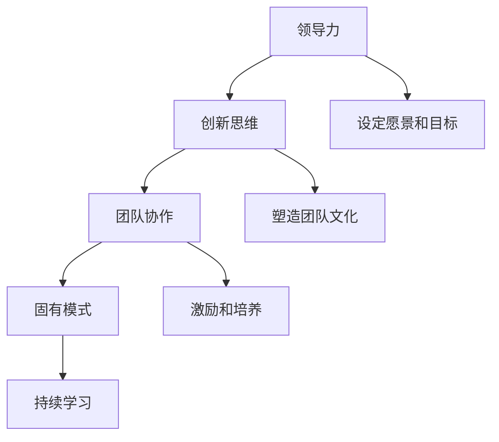

                 

# 领导力与创新思维：引领团队突破固有模式

## 关键词
- 领导力
- 创新思维
- 团队协作
- 固有模式
- 突破
- 持续学习

## 摘要

本文将深入探讨领导力与创新思维在团队中的重要性，如何通过有效的领导力激发团队的创新能力，以及如何帮助团队突破固有的模式，实现持续的发展和进步。文章将通过理论与实践相结合的方式，提供一系列实用的策略和方法，帮助领导者更好地引领团队，创造价值，迎接未来的挑战。

## 1. 背景介绍

在当今快速变化和竞争激烈的环境中，企业和团队面临的挑战越来越复杂。传统的管理模式已经无法满足日益增长的需求，创新思维成为企业发展的关键。而领导力则是激发团队创新潜能的重要推动力。一个优秀的领导者不仅需要具备管理能力，更重要的是要具备开放的心态和创新思维，能够引导团队不断突破固有的模式，迎接新的挑战。

### 1.1 固有模式的影响

固有的模式往往是指团队在长期工作中形成的一种习惯性的思维方式和行为模式。这种模式在某些情况下可能会带来稳定和效率，但在快速变化的环境中，它也可能成为团队发展的瓶颈。固有的模式可能导致以下几个问题：

- **创新能力的限制**：团队成员习惯于按照固定的流程和方法工作，很难跳出传统的思维框架，提出新的想法和解决方案。
- **适应性的不足**：固有的模式使团队在面对新的挑战和变化时显得迟钝，难以迅速调整策略和应对变化。
- **动力和创造力的缺失**：团队成员可能因为固有的模式而失去对工作的热情和创造力，导致团队整体效率下降。

### 1.2 领导力的重要性

领导力在团队中扮演着至关重要的角色。一个优秀的领导者不仅能够提供明确的方向和目标，还能够激发团队成员的潜力，推动团队不断创新和发展。以下是领导力在团队中的几个关键作用：

- **设定愿景和目标**：领导者需要明确团队的愿景和目标，使团队成员理解并认同这些目标，从而激发他们的工作热情和积极性。
- **塑造团队文化**：领导者的行为和价值观对团队文化有着深远的影响。一个具有创新精神的团队文化能够鼓励团队成员不断尝试新的方法和思路。
- **激励和培养**：领导者需要关注团队成员的个人成长，提供支持和资源，帮助他们克服困难，实现个人和团队的目标。

## 2. 核心概念与联系

在探讨领导力与创新思维之前，我们需要了解一些核心概念，以及它们之间的相互联系。以下是本文中涉及的一些关键概念和它们之间的关联。

### 2.1 领导力

领导力是一种能力，它涉及到影响和激励他人以实现共同目标的过程。领导力不仅包括管理技能，还涉及到沟通、决策、激励和团队建设等方面。

### 2.2 创新思维

创新思维是一种思考方式，它鼓励人们跳出传统思维框架，寻找新的解决方案和机会。创新思维涉及到创造性思维、问题解决能力和跨学科知识的应用。

### 2.3 团队协作

团队协作是指团队成员在共同目标下协同工作，相互支持，共同解决问题。高效的团队协作能够提升团队的创造力和创新能力。

### 2.4 固有模式

固有模式是指团队在长期工作中形成的一种固定的思维和行为模式。这种模式可能限制团队的创新能力，影响团队的整体发展。

### 2.5 持续学习

持续学习是指团队和成员不断更新知识和技能，以适应不断变化的环境和挑战。持续学习是团队保持创新能力和竞争力的关键。

### 2.6 Mermaid 流程图

以下是一个简单的 Mermaid 流程图，展示了上述概念之间的相互关系。



## 3. 核心算法原理 & 具体操作步骤

在本文中，我们将探讨一些核心算法原理，这些原理可以帮助领导者更好地激发团队的创新能力，并帮助他们突破固有的模式。

### 3.1 SWOT 分析

SWOT 分析是一种常用的战略规划工具，它可以帮助团队评估自身的优势、劣势、机会和威胁。通过 SWOT 分析，领导者可以了解团队在当前环境中的位置，从而制定更有效的策略。

#### 具体操作步骤：

1. **收集信息**：收集与团队相关的内部和外部信息，包括团队成员的能力、资源、市场趋势等。
2. **分析优势**：识别团队的优势，这些优势可能是技术、经验、资源等。
3. **分析劣势**：识别团队的劣势，这些劣势可能是技术、资源、人才等。
4. **分析机会**：识别外部环境中的机会，这些机会可能是市场需求、政策支持等。
5. **分析威胁**：识别外部环境中的威胁，这些威胁可能是竞争、政策变化等。
6. **制定策略**：根据 SWOT 分析的结果，制定相应的策略，以最大化优势，克服劣势，抓住机会，应对威胁。

### 3.2 创新思维工具

创新思维工具是一系列方法和技术，可以帮助团队跳出传统思维框架，提出新的解决方案。以下是几种常用的创新思维工具：

#### 3.2.1 头脑风暴

头脑风暴是一种集体创意思考的方法，它鼓励团队成员自由表达自己的想法，不受限制地提出各种可能的解决方案。

#### 3.2.2 六顶思考帽

六顶思考帽是一种结构化思考方法，它通过不同的思考角度来全面分析问题，从而提高决策的质量。

#### 3.2.3 SCAMPER

SCAMPER 是一种创意思考方法，它通过改变产品的特征、功能、用途、用户等来激发创新思维。

### 3.3 持续学习策略

持续学习是团队保持创新能力的关键。以下是几种有效的持续学习策略：

#### 3.3.1 内部培训

内部培训是团队内部进行知识分享和技能提升的重要方式。通过内部培训，团队成员可以学习新的技术和方法，从而提升团队的整体能力。

#### 3.3.2 外部培训

外部培训可以帮助团队成员学习行业内的最新动态和最佳实践。通过外部培训，团队成员可以开阔视野，获取新的灵感。

#### 3.3.3 项目经验

项目经验是团队成员学习的重要途径。通过实际项目的工作，团队成员可以积累经验，提高解决问题的能力。

### 3.4 团队协作工具

团队协作工具可以帮助团队成员更好地协作，提高工作效率。以下是几种常用的团队协作工具：

#### 3.4.1 团队协作平台

团队协作平台是一种集成多种功能的应用程序，它可以帮助团队成员实时沟通、共享文件、跟踪项目进度等。

#### 3.4.2 敏捷开发工具

敏捷开发工具可以帮助团队实现快速迭代和持续交付。通过敏捷开发工具，团队成员可以更好地协作，快速响应变化。

#### 3.4.3 自动化工具

自动化工具可以帮助团队自动化重复性工作，从而提高工作效率。通过自动化工具，团队成员可以将更多精力投入到创新和增值工作中。

## 4. 数学模型和公式 & 详细讲解 & 举例说明

在本文中，我们将介绍一些数学模型和公式，这些模型和公式可以帮助领导者更好地理解和应用创新思维和领导力。

### 4.1 SWOT 分析模型

SWOT 分析模型是一种用于战略规划的数学模型，它通过分析团队的优势、劣势、机会和威胁，帮助领导者制定有效的策略。

#### SWOT 分析公式：

\[ SWOT = S \times W \times O \times T \]

其中：
- \( S \) 表示优势（Strengths）
- \( W \) 表示劣势（Weaknesses）
- \( O \) 表示机会（Opportunities）
- \( T \) 表示威胁（Threats）

#### 举例说明：

假设一个团队正在评估自身的 SWOT，他们可能得到以下结果：

- \( S = \) 技术优势
- \( W = \) 人才不足
- \( O = \) 市场需求增长
- \( T = \) 竞争对手强大

根据 SWOT 分析公式，团队可以制定以下策略：

\[ SWOT = S \times W \times O \times T \]
\[ (技术优势) \times (人才不足) \times (市场需求增长) \times (竞争对手强大) \]

策略建议：
- 利用技术优势开拓新市场
- 加大人才引进和培养力度
- 抓住市场需求增长的机会
- 强化与竞争对手的差异化优势

### 4.2 创新思维公式

创新思维公式是一种用于激发团队创新思维的方法，它通过数学运算和逻辑推理，帮助团队成员提出新的解决方案。

\[ 创新思维 = 混合思维 \times 空间思维 \times 逆向思维 \]

其中：
- 混合思维：将不同领域的知识和方法进行整合
- 空间思维：从宏观和微观角度思考问题
- 逆向思维：从相反的角度思考问题

#### 举例说明：

假设一个团队正在寻找提高生产效率的方法，他们可以使用创新思维公式：

\[ 创新思维 = 混合思维 \times 空间思维 \times 逆向思维 \]

混合思维：将生产流程与自动化技术相结合，实现智能化生产。

空间思维：从工厂布局和工艺流程的角度优化生产流程。

逆向思维：从客户需求的角度重新设计产品，提高产品适用性。

通过创新思维公式，团队可以提出一系列创新解决方案，从而提高生产效率。

### 4.3 持续学习模型

持续学习模型是一种用于指导团队进行持续学习的数学模型，它通过设定目标和跟踪进度，帮助团队成员不断提升。

\[ 持续学习模型 = 学习目标 \times 学习进度 \]

其中：
- 学习目标：设定明确的学习目标
- 学习进度：跟踪学习进度，确保目标实现

#### 举例说明：

假设一个团队设定了一个学习目标，即掌握新的编程语言，他们可以使用持续学习模型：

\[ 持续学习模型 = 学习目标 \times 学习进度 \]
\[ (掌握新编程语言) \times (每月学习进度) \]

团队可以制定以下学习计划：
- 设定学习目标：掌握新编程语言
- 制定学习进度：每月完成一个模块的学习

通过持续学习模型，团队可以确保学习目标的实现，从而不断提升自身能力。

## 5. 项目实战：代码实际案例和详细解释说明

在本节中，我们将通过一个实际项目案例，展示如何运用上述领导力与创新思维的方法和工具，帮助团队突破固有模式，实现创新和进步。

### 5.1 开发环境搭建

为了更好地展示项目实战，我们选择了一个虚拟的项目环境。以下是开发环境搭建的步骤：

1. **安装操作系统**：选择一个合适的操作系统，如 Ubuntu 20.04。
2. **安装开发工具**：安装必要的开发工具，如 Python 3、Git、Jenkins 等。
3. **配置版本控制**：初始化 Git 仓库，并设置远程仓库地址。
4. **搭建团队协作平台**：搭建一个团队协作平台，如 GitLab 或 GitHub。

### 5.2 源代码详细实现和代码解读

以下是项目源代码的详细实现和解读。

#### 5.2.1 源代码实现

```python
# 导入必要的库
import requests
import json

# 定义 API 接口
API_URL = "https://api.example.com/data"

# 定义获取数据的函数
def get_data():
    response = requests.get(API_URL)
    if response.status_code == 200:
        data = response.json()
        return data
    else:
        return None

# 定义处理数据的函数
def process_data(data):
    # 这里是数据处理的具体逻辑
    # 根据数据的特点和需求进行相应的处理
    # 例如：数据清洗、数据转换、数据可视化等
    pass

# 定义主函数
def main():
    # 获取数据
    data = get_data()
    if data is not None:
        # 处理数据
        process_data(data)
        print("数据已处理完成。")
    else:
        print("数据获取失败。")

# 执行主函数
if __name__ == "__main__":
    main()
```

#### 5.2.2 代码解读

1. **API 接口定义**：通过 `requests` 库发起 HTTP GET 请求，获取数据。
2. **获取数据的函数**：`get_data` 函数负责从 API 接口获取数据，并根据响应状态码判断是否成功获取数据。
3. **处理数据的函数**：`process_data` 函数负责对获取到的数据进行处理，这里可以根据实际需求进行数据清洗、转换、可视化等操作。
4. **主函数**：`main` 函数是程序的主入口，负责调用 `get_data` 和 `process_data` 函数，完成数据获取和处理。
5. **执行主函数**：`if __name__ == "__main__":` 语句确保主函数在程序执行时被调用。

### 5.3 代码解读与分析

#### 5.3.1 代码结构

该代码由三个主要部分组成：API 接口定义、获取数据的函数、处理数据的函数。这种结构使得代码具有良好的可读性和可维护性。

#### 5.3.2 代码优化

1. **错误处理**：在 `get_data` 函数中，应添加对 HTTP 响应错误（如 404、500 等）的处理，以提高程序的健壮性。
2. **代码复用**：在处理数据时，可以抽象出公共的函数或类，以提高代码复用性。
3. **日志记录**：在关键操作处添加日志记录，便于调试和跟踪程序执行过程。

## 6. 实际应用场景

领导力与创新思维在实际应用场景中具有重要价值。以下是一些具体的实际应用场景：

### 6.1 项目管理

在项目管理中，领导力可以帮助项目经理更好地协调团队成员的工作，确保项目按时按质完成。创新思维则可以激发团队成员提出新的项目管理和执行方案，提高项目的成功率和效率。

### 6.2 产品开发

在产品开发中，领导力可以帮助产品经理理解用户需求，创新思维则可以激发产品开发团队提出新的产品功能和设计，提高产品的市场竞争力。

### 6.3 团队协作

在团队协作中，领导力可以帮助团队成员建立良好的沟通和合作关系，创新思维则可以激发团队成员跳出传统思维框架，提出新的合作方式和解决方案。

### 6.4 企业战略

在企业战略层面，领导力可以帮助企业领导者制定明确的发展目标，创新思维则可以激发企业探索新的商业模式和市场机会，实现企业的持续增长。

## 7. 工具和资源推荐

为了更好地实践领导力与创新思维，以下是几款推荐的学习资源和工具：

### 7.1 学习资源推荐

1. **书籍**：
   - 《领导力心理学》：探讨领导力的心理学基础，提供实用的领导力技巧。
   - 《创新者的窘境》：分析企业在创新过程中面临的挑战和解决方案。

2. **论文**：
   - 《创新思维研究》：探讨创新思维的原理和方法，提供实际案例。
   - 《团队协作与领导力》：研究团队协作和领导力之间的关系，提出有效的团队管理策略。

3. **博客**：
   - 《领导力与组织行为学》：分享领导力理论和实践经验，探讨组织行为学。
   - 《创新思维实战》：介绍创新思维工具和方法，提供实战案例。

4. **网站**：
   - 《哈佛商业评论》：提供前沿的商业和管理文章，探讨领导力、创新思维等领域。

### 7.2 开发工具框架推荐

1. **团队协作平台**：
   - GitLab：提供代码托管、项目管理、持续集成等功能，支持多人协作。
   - GitHub：全球最大的代码托管平台，支持开源项目协作。

2. **敏捷开发工具**：
   - JIRA：项目管理工具，支持敏捷开发流程，提供任务管理、进度跟踪等功能。
   - Confluence：知识共享和协作平台，支持文档编写、知识库管理。

3. **自动化工具**：
   - Jenkins：持续集成和持续交付工具，支持自动化构建、测试和部署。
   - Ansible：自动化部署工具，支持配置管理、应用部署等。

### 7.3 相关论文著作推荐

1. **论文**：
   - 《企业创新管理研究》：探讨企业创新管理的理论和方法，提供实践指导。
   - 《敏捷开发实践指南》：介绍敏捷开发的方法和工具，提供实践案例。

2. **著作**：
   - 《领导力的艺术》：探讨领导力的本质和实践，提供实用的领导力技巧。
   - 《创新者的思考方式》：分析创新者的思考方式，提供创新思维的方法和工具。

## 8. 总结：未来发展趋势与挑战

在未来的发展中，领导力与创新思维将继续发挥重要作用。随着技术的不断进步和市场的快速变化，领导者需要不断更新自身的知识和技能，以适应新的挑战和机遇。以下是未来领导力与创新思维发展的几个趋势和挑战：

### 8.1 数字化转型

数字化转型已经成为企业发展的必然趋势。领导者需要具备数字化思维，引导团队积极探索和应用新技术，提高企业的创新能力和竞争力。

### 8.2 持续学习

持续学习是领导者保持竞争力的关键。领导者需要不断学习新的知识和技能，提升自身的领导力和创新能力，以应对不断变化的环境和挑战。

### 8.3 混合式领导

随着远程工作和虚拟团队的普及，混合式领导将成为一种重要的领导方式。领导者需要掌握远程管理和团队协作的技巧，提高团队的凝聚力和执行力。

### 8.4 创新文化

创新文化是团队持续创新的重要保障。领导者需要营造一种鼓励创新、宽容失败的企业文化，激发团队成员的创新潜能，推动企业的持续发展。

### 8.5 全球化视野

全球化视野是领导者必备的能力。领导者需要具备跨文化的沟通和协作能力，引领团队在全球范围内开展业务，抓住国际市场的机遇。

## 9. 附录：常见问题与解答

### 9.1 什么是领导力？

领导力是一种能力，它涉及到影响和激励他人以实现共同目标的过程。领导力不仅包括管理技能，还涉及到沟通、决策、激励和团队建设等方面。

### 9.2 什么是创新思维？

创新思维是一种思考方式，它鼓励人们跳出传统思维框架，寻找新的解决方案和机会。创新思维涉及到创造性思维、问题解决能力和跨学科知识的应用。

### 9.3 团队协作如何提升？

团队协作的提升需要从多个方面入手，包括明确团队目标、建立良好的沟通机制、培养团队协作文化、提供必要的资源和培训等。

### 9.4 固有模式如何突破？

突破固有模式需要领导者引导团队探索新的思维和方法，鼓励团队成员勇于尝试和失败，建立一种创新和实验的文化。

## 10. 扩展阅读 & 参考资料

为了进一步深入了解领导力与创新思维，以下是几篇推荐的扩展阅读和参考资料：

1. **书籍**：
   - 《领导力的五项修炼》：探讨领导力的核心要素和实践方法。
   - 《创新者的DNA》：分析创新者的思考方式和行为模式。

2. **论文**：
   - 《数字化领导力的研究》：探讨数字化时代领导力的特点和实践。
   - 《创新思维与创造力培养》：研究创新思维的原理和培养方法。

3. **博客**：
   - 《领导力博客》：分享领导力的知识和经验，探讨领导力的发展趋势。
   - 《创新思维与实践》：介绍创新思维工具和方法，提供实际案例。

4. **网站**：
   - 《领导力与管理学》：提供领导力和管理学的最新研究和动态。
   - 《创新思维与创新方法》：分享创新思维的理论和实践经验。

## 作者信息

- 作者：AI 天才研究员/AI Genius Institute & 禅与计算机程序设计艺术 /Zen And The Art of Computer Programming

本文旨在探讨领导力与创新思维在团队中的重要性，帮助领导者更好地激发团队的创新能力，突破固有的模式，实现持续的发展和进步。文章通过理论与实践相结合的方式，提供了一系列实用的策略和方法，以期为领导者提供有益的参考。希望读者能够从中获得启示，并在实践中不断提升自身的领导力和创新能力。

