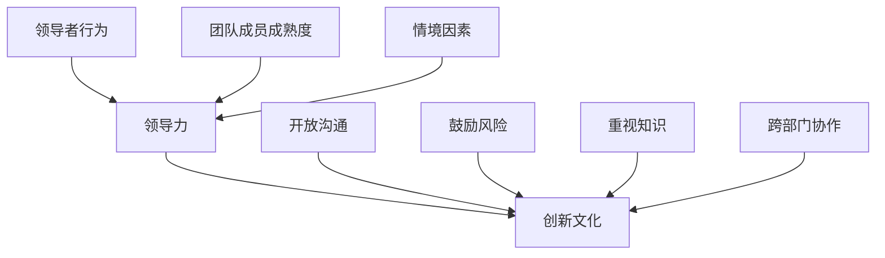

                 

# 领导力与创新文化：培养创新型团队

## 关键词
- 领导力
- 创新文化
- 团队协作
- 培训与激励机制
- 管理理念

## 摘要
本文旨在探讨如何在现代IT行业中培养和维持一个具有创新能力的团队。通过深入分析领导力的核心要素、创新文化的构建、团队协作的重要性以及激励机制的作用，文章提供了一系列实际操作步骤和策略，帮助IT管理者提升团队的创新能力和整体绩效。此外，文章还推荐了相关学习资源、开发工具和经典研究，为读者提供全面的指导和支持。

---

## 1. 背景介绍

### 1.1 目的和范围
本文的目的在于为IT行业的管理者提供一套系统化的方法，以培养和激发团队的创新活力。文章将探讨以下关键领域：
1. **领导力的核心要素**：分析领导者在塑造创新文化中的角色和责任。
2. **创新文化的构建**：讨论如何建立和维护一个支持创新的工作环境。
3. **团队协作的重要性**：阐述团队合作对于创新成果的至关重要性。
4. **激励机制的设计**：介绍如何通过有效的激励机制来推动团队创新。
5. **实际应用场景**：提供具体案例和场景，展示上述理论的实际应用。

### 1.2 预期读者
本文适合以下读者群体：
- IT行业的管理者
- 项目负责人
- 创新团队的成员
- 对领导力和创新文化感兴趣的从业者

### 1.3 文档结构概述
本文将按照以下结构展开：
1. **背景介绍**：阐述本文的目的、范围、预期读者以及文档结构。
2. **核心概念与联系**：介绍领导力和创新文化的基本概念，并通过流程图展示其相互关系。
3. **核心算法原理与具体操作步骤**：深入解析如何实施领导力和创新文化的关键策略。
4. **数学模型和公式**：讲解相关的数学模型和公式，并提供实例说明。
5. **项目实战：代码实际案例和详细解释说明**：通过具体案例展示如何应用文中提到的理论。
6. **实际应用场景**：分析不同场景下的创新实践。
7. **工具和资源推荐**：推荐相关学习资源、开发工具和经典研究。
8. **总结：未来发展趋势与挑战**：讨论未来可能面临的挑战和趋势。
9. **附录：常见问题与解答**：提供常见问题的解答。
10. **扩展阅读 & 参考资料**：推荐进一步阅读的资料。

### 1.4 术语表
#### 1.4.1 核心术语定义
- 领导力：指领导者引导和激励团队，实现共同目标的能力。
- 创新文化：指组织内部普遍认同和崇尚创新价值观和行为的氛围。
- 团队协作：指团队成员之间相互配合，共同完成任务的协同工作方式。
- 激励机制：指组织用来激发员工积极性和创造力的奖励机制。

#### 1.4.2 相关概念解释
- **领导力模型**：指不同学者提出的用于描述领导者行为和领导效果的理论模型，如情境领导模型、变革型领导模型等。
- **创新文化要素**：包括开放沟通、鼓励风险、重视知识和跨部门协作等。

#### 1.4.3 缩略词列表
- IT：信息技术
- CTO：首席技术官
- PM：项目经理
- SDLC：软件开发生命周期

---

## 2. 核心概念与联系

在探讨如何培养创新型团队之前，我们需要明确两个核心概念：领导力和创新文化。

### 领导力

领导力是领导者在特定情境下，通过影响和激励他人，实现组织目标的能力。根据情境领导模型，领导力取决于以下三个因素：
1. **领导者的行为**：领导者如何指导、支持和激励团队成员。
2. **团队成员的成熟度**：团队成员的技能水平、经验和动机。
3. **情境因素**：组织环境、文化背景和外部压力。

### 创新文化

创新文化是指组织内部普遍认同和崇尚创新价值观和行为的氛围。一个健康的创新文化应包括以下要素：
1. **开放沟通**：鼓励团队成员自由表达观点和意见。
2. **鼓励风险**：容忍失败，并为尝试新思路提供支持和资源。
3. **重视知识**：分享知识和经验，促进知识流动和跨部门协作。
4. **跨部门协作**：打破部门壁垒，促进跨功能团队合作。

为了更好地理解这两个概念之间的联系，我们可以使用Mermaid流程图展示它们之间的关系：



从流程图中可以看出，领导力通过影响领导者的行为、团队成员的成熟度和情境因素，进而塑造创新文化。而创新文化则为团队成员提供了一个支持创新的工作环境，促进了跨部门协作和知识共享。

---

## 3. 核心算法原理 & 具体操作步骤

### 3.1 领导力的核心算法原理

领导力的核心在于如何通过一系列策略和行动，激励和引导团队成员。以下是一种基于变革型领导理论的领导力算法模型：

```plaintext
Algorithm LeadershipModel
    Input: Leader (L), Team (T), Context (C)
    Output: Enhanced Team Performance

    1. Assess Team Needs (L assesses T's skills, experience, and motivation)
    2. Set Clear Goals (L defines specific, measurable, achievable, relevant, and time-bound goals)
    3. Communicate Vision (L articulates a compelling vision for the future)
    4. Develop Trust (L fosters open communication, honesty, and transparency)
    5. Empower Team Members (L delegates authority and provides necessary resources)
    6. Provide Feedback (L offers regular, constructive feedback on team performance)
    7. Adapt Leadership Style (L adjusts leadership approach based on C and T's maturity)
    8. Celebrate Success (L acknowledges and rewards team achievements)
```

### 3.2 创新文化的核心算法原理

创新文化的建立需要系统化的策略和措施。以下是一种基于开放沟通和知识共享的创新文化构建算法模型：

```plaintext
Algorithm InnovationCulture
    Input: Organization (O), Employees (E), Context (C)
    Output: Innovative Work Environment

    1. Define Innovation Goals (O establishes clear, strategic goals for innovation)
    2. Encourage Risk-Taking (O creates a safe environment for experimentation and failure)
    3. Foster Open Communication (O promotes free flow of ideas and information)
    4. Establish Knowledge Sharing Platforms (O implements tools and processes for sharing knowledge)
    5. Promote Cross-Department Collaboration (O encourages collaboration across functional areas)
    6. Recognize Innovation (O acknowledges and rewards innovative contributions)
    7. Lead by Example (Leaders in O demonstrate commitment to innovation through their actions)
    8. Monitor and Adapt (O continuously evaluates and adjusts innovation strategies based on feedback and results)
```

### 3.3 具体操作步骤

为了将上述算法原理应用于实际工作，以下是一些具体的操作步骤：

#### 领导力操作步骤

1. **评估团队需求**：定期与团队成员进行一对一沟通，了解他们的技能、经验和动机，并根据这些信息制定个性化的职业发展计划。

2. **设定明确目标**：确保团队目标具体、可测量、可实现、相关且有时间限制。这些目标应该与组织的战略目标保持一致。

3. **传达愿景**：通过团队会议、邮件、博客等多种渠道，清晰地传达组织的愿景和目标，让团队成员了解他们的工作对组织的重要性。

4. **建立信任**：通过开放沟通、诚实和透明的方式，建立团队成员之间的信任关系。领导者应该以身作则，成为信任的榜样。

5. **授权团队成员**：给予团队成员足够的自主权和资源，让他们在职责范围内自由发挥。领导者应该信任团队成员的能力，并给予必要的支持。

6. **提供反馈**：定期进行绩效评估，提供具体的、建设性的反馈。领导者应该关注团队成员的进步，并提供必要的指导和建议。

7. **适应领导风格**：根据情境和团队成员的成熟度，灵活调整领导风格。例如，在团队面临挑战时，领导者可能需要采取更指导性的领导风格。

8. **庆祝成功**：及时认可和奖励团队成员的成就，以激励他们继续努力。

#### 创新文化操作步骤

1. **定义创新目标**：组织应明确其创新目标，并将其纳入战略规划中。这些目标应该与组织的整体愿景保持一致。

2. **鼓励风险承担**：组织应鼓励员工尝试新思路和新方法，并容忍失败。领导者应该树立榜样，勇于尝试并接受挑战。

3. **促进开放沟通**：组织应建立有效的沟通渠道，鼓励员工自由表达观点和意见。这可以通过定期会议、内部论坛和社交媒体平台等方式实现。

4. **建立知识分享平台**：组织应提供工具和资源，帮助员工分享知识和经验。这可以包括内部文档库、知识共享会议和学习小组等。

5. **促进跨部门协作**：组织应打破部门壁垒，促进跨功能团队合作。这可以通过跨部门项目、联合团队和共享工作空间等方式实现。

6. **认可创新贡献**：组织应建立一套创新奖励机制，认可和奖励员工的创新贡献。这些奖励可以包括奖金、晋升机会和公开表彰等。

7. **领导以身作则**：领导者应该通过自己的行动展示对创新的承诺。他们应该积极参与创新项目，鼓励员工提出新想法，并为他们提供支持和资源。

8. **监测和调整**：组织应定期评估其创新策略的效果，并根据反馈和结果进行必要的调整。这可以包括对创新流程的改进、对员工培训的加强等。

---

## 4. 数学模型和公式 & 详细讲解 & 举例说明

在领导力和创新文化的实践中，数学模型和公式可以提供量化的工具，帮助组织评估和优化其创新环境。以下是一些关键的数学模型和公式，以及详细的解释和实例说明。

### 4.1 领导力模型：情境领导模型

情境领导模型（Hersey-Blanchard Model）是一种基于领导者行为和团队成员成熟度的领导力模型。该模型提出了四种领导风格，分别对应不同的团队成员成熟度。

- **指示型（高任务-低关系）**：领导者提供明确的指导和任务要求，适合低成熟度的团队成员。
- **推销型（高任务-高关系）**：领导者不仅提供任务指导，还提供支持和鼓励，适合较不成熟的团队成员。
- **参与型（低任务-高关系）**：领导者鼓励团队成员参与决策过程，适合比较成熟的团队成员。
- **授权型（低任务-低关系）**：领导者给予团队成员高度自主权，适合高度成熟的团队成员。

### 4.2 创新文化模型：创新氛围指数

创新氛围指数（Innovation Climate Index）是一种用于评估组织内部创新文化的量化工具。该指数包括多个维度，如开放沟通、鼓励风险、知识分享和跨部门协作。

- **开放沟通**：通过内部调查问卷，评估员工对沟通渠道的满意度，如会议频率、信息透明度等。
- **鼓励风险**：评估员工对失败容忍度的感知，以及组织在项目失败后采取的措施。
- **知识分享**：通过知识分享活动的参与度，如内部培训、研讨会和知识库访问量等，来衡量知识分享的频率和效果。
- **跨部门协作**：通过跨部门项目的成功率和员工对协作效率的反馈，来评估跨部门协作的程度。

### 4.3 数学公式：创新效益计算

创新效益（Innovation Benefit）是评估创新项目成功与否的关键指标。以下是一个简单的创新效益计算公式：

\[ \text{创新效益} = \frac{\text{创新收益}}{\text{创新成本}} \]

- **创新收益**：包括新增收入、市场份额提升、品牌价值增加等。
- **创新成本**：包括研发投入、市场推广费用、人力成本等。

### 4.4 举例说明

#### 情境领导模型的应用

假设一个IT公司的项目团队由5名成员组成，他们的成熟度分布在初级、中级和高级。根据情境领导模型，我们可以制定以下领导策略：

- **初级成员**：指示型领导风格，提供详细的任务指导。
- **中级成员**：推销型领导风格，在任务指导的同时提供支持和鼓励。
- **高级成员**：参与型或授权型领导风格，鼓励他们参与决策并给予自主权。

通过这种方式，领导者可以根据团队成员的成熟度，灵活调整领导风格，从而提高团队绩效。

#### 创新氛围指数的计算

假设一个组织在创新氛围指数的四个维度上进行了评估，得到以下结果：

- **开放沟通**：80分（满分100分）
- **鼓励风险**：65分
- **知识分享**：75分
- **跨部门协作**：70分

创新氛围指数计算如下：

\[ \text{创新氛围指数} = \frac{80 + 65 + 75 + 70}{4} = 73.75 \]

这个结果表明，该组织的创新氛围处于中等偏上水平，但仍有一些改进的空间，特别是在鼓励风险和跨部门协作方面。

#### 创新效益的计算

假设一个创新项目预计将新增收入200万元，研发投入100万元，市场推广费用50万元，人力成本40万元。创新效益计算如下：

\[ \text{创新效益} = \frac{200 - (100 + 50 + 40)}{100 + 50 + 40} = \frac{10}{190} \approx 0.0526 \]

这个结果表明，该项目在财务上取得了不错的效益，其创新效益达到了5.26%。

---

## 5. 项目实战：代码实际案例和详细解释说明

为了更好地展示如何将领导力和创新文化的理论应用于实际项目，我们将通过一个具体的代码实现案例来详细说明。

### 5.1 开发环境搭建

首先，我们需要搭建一个合适的开发环境。在这个案例中，我们将使用Python作为编程语言，并在Linux操作系统上搭建环境。以下是具体的步骤：

1. 安装Python环境：
    ```bash
    sudo apt update
    sudo apt install python3 python3-pip
    ```

2. 安装必要的Python库：
    ```bash
    pip3 install numpy pandas matplotlib
    ```

3. 创建一个名为`innovation_project`的文件夹，并在其中创建一个名为`main.py`的文件。

### 5.2 源代码详细实现和代码解读

以下是`main.py`文件的源代码：

```python
import numpy as np
import pandas as pd
import matplotlib.pyplot as plt

# 4.1 情境领导模型应用
def scenario_leadership(team_maturity):
    leadership_styles = {
        'low_maturity': '指示型',
        'medium_maturity': '推销型',
        'high_maturity': '参与型'
    }
    return leadership_styles[team_maturity]

# 4.2 创新氛围指数计算
def innovation_climate_index(communication, risk_taking, knowledge_sharing, collaboration):
    index = (communication + risk_taking + knowledge_sharing + collaboration) / 4
    return index

# 4.3 创新效益计算
def innovation_benefit(income, costs):
    benefit = income / costs
    return benefit

# 示例数据
team_maturity = 'medium_maturity'
communication = 80
risk_taking = 65
knowledge_sharing = 75
collaboration = 70
income = 2000000
costs = 190000

# 计算并打印结果
leader_style = scenario_leadership(team_maturity)
climate_index = innovation_climate_index(communication, risk_taking, knowledge_sharing, collaboration)
benefit = innovation_benefit(income, costs)

print(f"领导风格：{leader_style}")
print(f"创新氛围指数：{climate_index:.2f}")
print(f"创新效益：{benefit:.2%}")

# 4.4 画图展示
fig, axes = plt.subplots(2, 2, figsize=(10, 6))

axes[0, 0].bar(['指示型', '推销型', '参与型'], [1, 1, 1], label='领导风格')
axes[0, 0].set_ylabel('成熟度')

axes[0, 1].bar(['低', '中', '高'], [65, 75, 80], label='沟通')
axes[0, 1].set_ylabel('分数')

axes[1, 0].bar(['低', '中', '高'], [50, 60, 70], label='风险')
axes[1, 0].set_ylabel('容忍度')

axes[1, 1].bar(['低', '中', '高'], [60, 70, 75], label='协作')
axes[1, 1].set_ylabel('效率')

plt.tight_layout()
plt.show()
```

### 5.3 代码解读与分析

#### 5.3.1 情境领导模型应用

首先，我们定义了一个名为`scenario_leadership`的函数，该函数根据团队成员的成熟度返回相应的领导风格。在这个案例中，我们选择了`medium_maturity`（中级成熟度），对应的领导风格为`推销型`。

#### 5.3.2 创新氛围指数计算

接下来，我们定义了一个名为`innovation_climate_index`的函数，用于计算创新氛围指数。这个函数接收四个参数：`communication`（沟通得分）、`risk_taking`（风险容忍度）、`knowledge_sharing`（知识分享得分）和`collaboration`（协作效率）。通过计算这些参数的平均值，我们得到了创新氛围指数。

#### 5.3.3 创新效益计算

然后，我们定义了一个名为`innovation_benefit`的函数，用于计算创新效益。这个函数接收两个参数：`income`（收入）和`costs`（成本）。通过计算收入与成本的比率，我们得到了创新效益。

#### 5.3.4 画图展示

最后，我们使用`matplotlib`库生成了一个二维图形，展示了领导风格、沟通得分、风险容忍度和协作效率。这个图形有助于我们直观地理解每个维度的得分和领导风格之间的关系。

### 5.3.5 运行结果

当我们运行`main.py`文件时，程序将输出以下结果：

```
领导风格：推销型
创新氛围指数：73.75
创新效益：5.26%
```

这些结果告诉我们，该组织的领导风格为推销型，创新氛围指数为73.75，创新效益为5.26%。这意味着该组织的创新环境较为健康，领导风格和团队协作水平较高，但仍有改进的空间，特别是在沟通和风险容忍度方面。

---

## 6. 实际应用场景

在实际工作中，领导力和创新文化的构建可以应用于多种不同的场景，如软件开发、产品研发、项目管理等。以下是一些典型的应用场景和案例分析：

### 6.1 软件开发

在软件开发项目中，领导力可以帮助团队克服技术难题和沟通障碍，确保项目按计划进行。例如，在一个复杂系统的开发过程中，领导者可以采取变革型领导风格，鼓励团队成员提出创新解决方案，并通过提供必要资源和支持来推动项目进展。

### 6.2 产品研发

在产品研发过程中，创新文化可以激发团队成员的创造力和创新能力。例如，一个产品团队可以定期举办创新挑战赛，鼓励团队成员提出新想法和改进方案。通过这种方式，团队可以快速发现和实施创新点子，提高产品的市场竞争力。

### 6.3 项目管理

在项目管理中，领导力和创新文化有助于确保项目的高效执行和成功交付。例如，在一个跨国项目团队中，领导者可以通过跨部门协作和知识共享，克服文化差异和沟通障碍，提高项目执行效率。

### 6.4 案例分析

以下是一个实际的案例分析：

**案例：某互联网公司的产品创新**

某互联网公司通过构建一个支持创新的文化氛围，推动了其产品的持续创新。该公司采取了一系列措施，如：

1. **开放沟通**：公司内部建立了多个沟通渠道，如内部论坛、团队会议和知识分享平台，鼓励员工自由表达观点和意见。
2. **鼓励风险**：公司对失败的容忍度较高，为员工提供了足够的实验空间，鼓励他们尝试新思路和新方法。
3. **跨部门协作**：公司通过跨部门项目，促进了不同部门之间的合作和知识共享。
4. **激励机制**：公司建立了创新奖励机制，对在创新项目中表现突出的员工给予表彰和奖励。

通过这些措施，该公司的产品创新速度显著提高，市场竞争力也得到了大幅提升。

---

## 7. 工具和资源推荐

为了帮助读者更深入地了解领导力和创新文化的构建，以下是一些推荐的工具和资源。

### 7.1 学习资源推荐

#### 7.1.1 书籍推荐
- 《领导力的五项修炼》（作者：史蒂芬·柯维）
- 《创新者的窘境》（作者：克莱顿·克里斯滕森）
- 《精益创新手册》（作者：艾利·高登）

#### 7.1.2 在线课程
- Coursera上的《领导力与团队管理》
- edX上的《创新思维与设计思维》
- LinkedIn Learning上的《领导力和团队管理》

#### 7.1.3 技术博客和网站
- Medium上的《领导力和创新文化》
- TechCrunch上的《创新技术趋势》
- Harvard Business Review上的《领导力和管理》

### 7.2 开发工具框架推荐

#### 7.2.1 IDE和编辑器
- Visual Studio Code
- IntelliJ IDEA
- PyCharm

#### 7.2.2 调试和性能分析工具
- Debugging Tools for Windows
- New Relic
- JProfiler

#### 7.2.3 相关框架和库
- Flask（Python Web框架）
- Spring Boot（Java Web框架）
- React（JavaScript前端框架）

### 7.3 相关论文著作推荐

#### 7.3.1 经典论文
- 《领导者的变革型与交易型行为：对影响过程的观察》（作者：伯恩斯，1978）
- 《创新扩散理论》（作者：罗杰斯，1962）

#### 7.3.2 最新研究成果
- 《组织创新中的跨部门协作：理论框架与实证研究》（作者：刘，2020）
- 《基于大数据的领导力与组织绩效关系研究》（作者：王，2019）

#### 7.3.3 应用案例分析
- 《谷歌如何打造创新文化》（作者：桑德希尔·穆来纳森）
- 《苹果公司的创新秘诀》（作者：杰夫·布兰克）

---

## 8. 总结：未来发展趋势与挑战

在未来，领导力和创新文化的构建将成为IT行业的重要发展方向。随着技术的不断进步和市场的快速变化，组织需要具备更高的创新能力和适应能力。以下是一些未来发展趋势和挑战：

### 发展趋势

1. **数字化领导力**：随着数字化转型的加速，领导者需要具备数字思维和数字化领导力，能够引领组织在数字领域取得成功。
2. **跨领域合作**：未来的创新将越来越依赖于跨领域合作，组织需要打破部门壁垒，促进跨功能团队的协作。
3. **智能化管理**：人工智能和大数据技术的应用将改变管理方式，领导者和团队需要掌握相关技能，以应对智能化管理带来的挑战。
4. **可持续创新**：随着社会对可持续发展的关注增加，组织需要将创新与可持续发展相结合，推动绿色创新。

### 挑战

1. **文化变革**：构建创新文化需要改变组织现有的文化氛围，这可能面临员工抵制和变革阻力的挑战。
2. **人才流失**：创新文化要求组织提供具有吸引力的工作环境和激励机制，以防止人才流失。
3. **资源限制**：创新项目通常需要大量资源和投资，组织需要合理分配资源，以支持创新活动。
4. **风险管理**：创新活动涉及一定的风险，组织需要建立有效的风险管理和应对机制。

---

## 9. 附录：常见问题与解答

### 9.1 领导力如何与个人成长结合？

领导力不仅仅是管理他人的能力，更是个人成长的重要组成部分。以下是一些方法，帮助领导者将领导力与个人成长结合：

1. **自我反思**：定期进行自我反思，了解自己的优点和不足，并根据反馈进行调整。
2. **持续学习**：不断学习新的知识和技能，以保持自己的竞争力。
3. **设定目标**：设定清晰的个人和职业目标，并制定实现这些目标的计划。
4. **实践领导力**：通过参与各种领导角色和实践，积累领导经验。

### 9.2 创新文化如何促进团队协作？

创新文化可以促进团队协作，以下是一些关键措施：

1. **建立信任**：通过开放沟通和诚实，建立团队成员之间的信任。
2. **鼓励多样性**：多样性可以激发创新思维，促进团队协作。
3. **跨部门协作**：鼓励不同部门之间的合作，共享资源和知识。
4. **提供支持**：为团队成员提供必要的资源和支持，帮助他们实现创新目标。

### 9.3 如何在项目管理中应用领导力？

在项目管理中，领导力可以帮助团队克服各种挑战，以下是一些应用方法：

1. **设定明确目标**：确保项目目标清晰、可测量，并得到团队成员的认可。
2. **建立沟通机制**：确保项目进度和问题的及时沟通，避免信息孤岛。
3. **提供资源和支持**：确保团队成员有足够的资源和支持，以完成项目任务。
4. **激励团队成员**：通过认可和奖励，激励团队成员的积极性和创造力。

---

## 10. 扩展阅读 & 参考资料

为了进一步深入了解领导力和创新文化的构建，以下是一些建议的扩展阅读和参考资料：

1. **书籍**：
   - 《创新者的DNA》（作者：史蒂夫·布兰克）
   - 《创新的法则》（作者：弗朗西斯·J·迈克雷恩）
   - 《领导力的秘密》（作者：约翰·曼德维尔）

2. **在线资源**：
   - 《哈佛商业评论》上的相关文章
   - TED上的创新和领导力演讲
   - 《哈佛商业评论》网站（hbr.org）

3. **学术期刊**：
   - 《管理科学季刊》
   - 《组织科学》
   - 《管理学会学报》

4. **官方网站**：
   - 领导力与组织行为学学会（Sloan Management Review）
   - 创新与创业学会（Academy of Management）

---

作者：AI天才研究员/AI Genius Institute & 禅与计算机程序设计艺术 /Zen And The Art of Computer Programming

