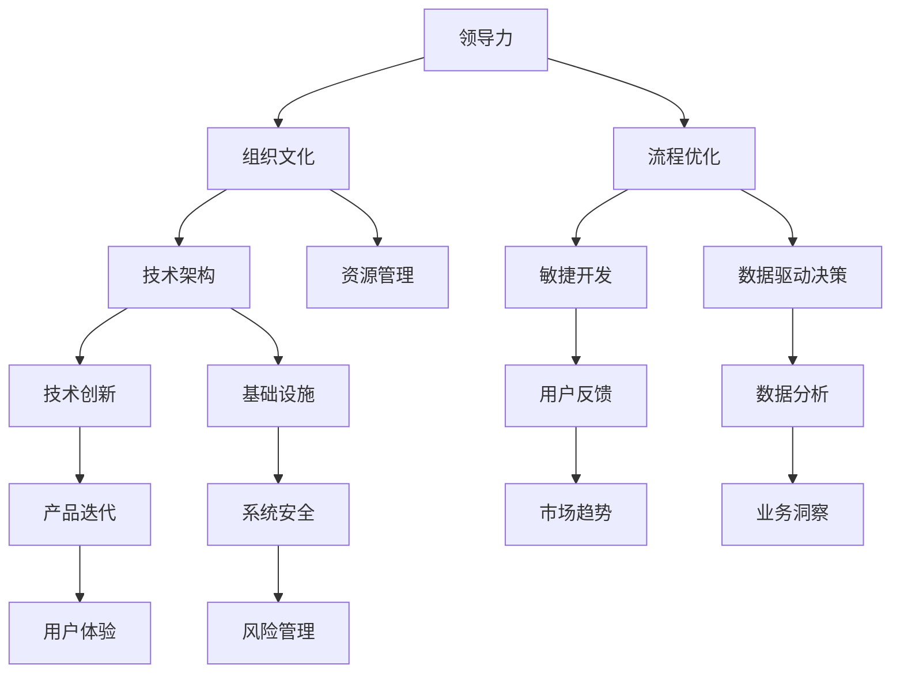

                 

# 领导力与创新管理系统：构建创新支持体系

> 关键词：领导力、创新管理系统、支持体系、技术架构、流程优化、组织文化

> 摘要：本文旨在探讨领导力在构建创新支持体系中的关键作用，分析如何通过有效的管理流程和技术架构提升组织的创新能力。我们将逐步深入，从核心概念、算法原理到实际应用场景，详细阐述创新管理系统的构建方法。文章结构清晰，内容丰富，适合希望提升自身管理技能和推动组织创新的专业人士阅读。

## 1. 背景介绍

### 1.1 目的和范围

本文的目标是帮助组织领导者和技术专家理解并实施一个创新的领导力模型，以支持组织的持续创新。我们将探讨以下几个方面：

1. 领导力在创新体系中的角色和影响。
2. 创新管理系统的核心概念和架构。
3. 构建创新管理系统的步骤和方法。
4. 数学模型和算法在创新管理中的应用。
5. 实际应用场景和案例分析。
6. 未来发展趋势与挑战。

### 1.2 预期读者

本文适合以下读者群体：

1. 组织领导者，特别是CTO、CEO等高级管理人员。
2. 技术专家，包括软件工程师、架构师等。
3. 企业创新团队负责人。
4. 对创新管理感兴趣的学术界和产业界人士。

### 1.3 文档结构概述

本文结构如下：

1. **背景介绍**：介绍文章的目的、范围和预期读者，概述文档结构。
2. **核心概念与联系**：介绍创新管理系统中的核心概念，包括领导力、技术架构、流程优化等。
3. **核心算法原理 & 具体操作步骤**：详细阐述构建创新管理系统的核心算法原理和操作步骤。
4. **数学模型和公式 & 详细讲解 & 举例说明**：使用数学模型和公式说明创新管理中的关键环节。
5. **项目实战：代码实际案例和详细解释说明**：通过实际案例展示创新管理系统的应用。
6. **实际应用场景**：讨论创新管理系统的实际应用场景。
7. **工具和资源推荐**：推荐学习资源和开发工具。
8. **总结：未来发展趋势与挑战**：总结本文的主要观点，探讨未来发展趋势和挑战。
9. **附录：常见问题与解答**：回答读者可能提出的问题。
10. **扩展阅读 & 参考资料**：提供进一步的阅读资源。

### 1.4 术语表

#### 1.4.1 核心术语定义

- **领导力**：指领导者通过影响、激励和引导，推动组织实现目标的能力。
- **创新管理系统**：一套综合的体系，旨在支持组织的创新活动，包括流程、工具、资源和政策。
- **技术架构**：组织信息技术系统的基础设施和组件的集合，支持业务的运行和创新。
- **流程优化**：通过改进现有流程，提高效率和质量，支持组织的创新活动。
- **组织文化**：组织成员共同遵循的价值观、信念和行为模式。

#### 1.4.2 相关概念解释

- **创新**：指通过新的想法、方法或产品，改进或创造价值的过程。
- **敏捷开发**：一种以用户需求为中心，快速迭代和持续改进的开发方法。
- **数据驱动决策**：通过数据分析，支持决策过程的方法。

#### 1.4.3 缩略词列表

- **CTO**：首席技术官
- **IDE**：集成开发环境
- **API**：应用程序编程接口
- **IoT**：物联网
- **AI**：人工智能

## 2. 核心概念与联系

构建一个有效的创新管理系统，需要理解并整合多个核心概念。以下是一个简化的Mermaid流程图，展示这些概念之间的联系。



### 2.1 领导力与组织文化

领导力是创新管理系统的核心，它直接影响组织文化和创新氛围。一个强有力的领导层能够激励员工，创造积极向上的组织文化。这种文化包括：

- **开放性和包容性**：鼓励员工提出新的想法，并接受不同观点。
- **实验精神**：支持员工尝试新方法，即使失败也不惩罚。
- **透明度**：分享信息，让员工了解组织的战略目标和挑战。
- **认可与奖励**：对创新行为给予认可和奖励，激励更多员工参与创新。

### 2.2 流程优化与敏捷开发

流程优化是提升创新效率的关键。敏捷开发方法强调快速迭代和持续改进，与流程优化紧密结合。通过敏捷开发，组织可以实现：

- **用户反馈循环**：快速获取用户反馈，调整产品方向。
- **持续交付**：频繁交付产品版本，确保迭代过程中的连续性。
- **灵活适应**：适应市场变化，快速调整策略。

### 2.3 技术架构与基础设施

技术架构是创新管理系统的硬件基础。一个高效的技术架构应该包括：

- **可扩展性**：支持业务增长和变化。
- **安全性**：保护数据和系统免受威胁。
- **高可用性**：确保系统稳定运行。
- **弹性**：在出现故障时，快速恢复。

### 2.4 资源管理与技术创新

资源管理是创新过程中不可或缺的一环。有效的资源管理包括：

- **人才管理**：招聘、培训和激励创新人才。
- **预算管理**：确保资金充足，支持创新项目。
- **时间管理**：合理安排时间，确保项目按时完成。

技术创新则是组织保持竞争力的重要手段。通过技术创新，组织可以实现：

- **产品差异化**：推出具有独特功能的产品。
- **市场领先**：率先满足用户需求，占领市场。
- **成本优化**：通过技术创新降低运营成本。

## 3. 核心算法原理 & 具体操作步骤

构建创新管理系统，需要一套科学的核心算法来指导实践。以下是一个简化的伪代码，描述了构建创新管理系统的基本步骤：

```pseudo
// 伪代码：构建创新管理系统

// 步骤1：确定组织目标和战略
define_organization_goal()

// 步骤2：评估当前创新能力和需求
evaluate_innovation_capacity()

// 步骤3：制定创新策略
define_innovation_strategy()

// 步骤4：构建技术架构
build_technology_architecture()

// 步骤5：优化流程
optimize_processes()

// 步骤6：管理资源
manage_resources()

// 步骤7：建立数据驱动决策系统
build_data_driven_decision_system()

// 步骤8：培养组织文化
develop_organization_culture()

// 步骤9：执行和监控
execute_and_monitor()
```

### 3.1 确定组织目标和战略

在构建创新管理系统之前，首先要明确组织的战略目标和创新需求。这可以通过以下步骤实现：

1. **目标设定**：明确组织在创新方面的长远目标和短期目标。
2. **市场分析**：了解市场趋势和竞争对手的动态。
3. **用户调研**：收集用户反馈，了解用户需求和期望。
4. **内部评估**：评估组织当前的创新能力和资源。

### 3.2 评估当前创新能力和需求

了解组织当前的创新能力是构建创新管理系统的重要一步。可以通过以下方法进行评估：

1. **创新项目回顾**：分析过去创新项目的成功和失败案例。
2. **员工调查**：收集员工关于创新氛围、资源和激励的反馈。
3. **技术评估**：评估现有技术架构的灵活性和适应性。
4. **财务分析**：分析创新活动的成本和收益。

### 3.3 制定创新策略

根据目标和需求，制定具体的创新策略。这包括：

1. **技术路线图**：确定关键技术领域和优先级。
2. **产品规划**：规划新产品或服务的开发路径。
3. **市场定位**：明确产品或服务在市场中的定位。
4. **资源分配**：确定创新项目的预算和人力资源。

### 3.4 构建技术架构

技术架构是创新管理系统的基石。构建技术架构的步骤包括：

1. **需求分析**：明确技术需求，包括性能、安全、可扩展性等。
2. **架构设计**：设计满足需求的技术架构。
3. **基础设施搭建**：搭建基础设施，包括服务器、网络、存储等。
4. **持续集成与部署**：建立自动化流程，确保技术架构的持续更新和优化。

### 3.5 优化流程

优化流程是提升创新效率的关键。具体步骤包括：

1. **流程分析**：识别现有流程中的瓶颈和浪费。
2. **流程重构**：重新设计流程，消除瓶颈和浪费。
3. **敏捷开发**：实施敏捷开发方法，提高开发效率。
4. **用户反馈**：快速获取用户反馈，持续改进流程。

### 3.6 管理资源

资源管理是确保创新活动顺利进行的重要环节。具体步骤包括：

1. **人才招聘**：招聘具有创新能力的员工。
2. **培训与发展**：提供培训，提升员工的创新能力。
3. **预算管理**：确保资金充足，支持创新项目。
4. **项目管理**：实施项目管理方法，确保项目按时完成。

### 3.7 建立数据驱动决策系统

数据是创新决策的重要依据。建立数据驱动决策系统的步骤包括：

1. **数据收集**：收集与创新相关的数据。
2. **数据分析**：利用数据分析工具，分析数据，提取洞察。
3. **数据可视化**：将数据分析结果可视化，支持决策。
4. **决策支持**：利用数据分析结果，制定创新策略。

### 3.8 培养组织文化

组织文化是创新管理系统的软实力。培养积极向上的组织文化，可以激发员工的创新潜力。具体步骤包括：

1. **价值观传播**：传播组织的核心价值观，如创新、合作、诚信等。
2. **激励制度**：建立激励制度，鼓励员工参与创新。
3. **文化建设活动**：组织创新文化相关的活动和培训。
4. **领导示范**：领导者要身体力行，展示创新精神。

### 3.9 执行和监控

创新管理系统的构建是一个持续的过程。执行和监控是确保系统有效运行的关键。具体步骤包括：

1. **执行计划**：制定详细的执行计划，确保各项任务按时完成。
2. **监控与评估**：监控创新活动的进展，评估创新效果。
3. **反馈与改进**：根据监控结果，调整创新策略，持续优化。

## 4. 数学模型和公式 & 详细讲解 & 举例说明

在创新管理中，数学模型和公式可以帮助我们更精确地分析和预测创新活动的效果。以下是一些常用的数学模型和公式，以及它们的详细讲解和举例说明。

### 4.1 技术成熟度模型 (Technology Readiness Level, TRL)

技术成熟度模型（TRL）是一个评估技术创新成熟度的标准框架。它包括9个级别，从初步概念到实际应用。以下是TRL的具体级别和解释：

| 级别 | 描述                                                         |
| ---- | ------------------------------------------------------------ |
| TRL1 | 基本原理的研究和概念形成阶段。                                 |
| TRL2 | 实验室规模的技术验证。                                         |
| TRL3 | 构建和测试技术原型。                                           |
| TRL4 | 在实际环境中测试和验证技术。                                   |
| TRL5 | 在有限范围内实现技术的小规模生产或部署。                         |
| TRL6 | 在广泛范围内实现技术的规模化生产或部署。                         |
| TRL7 | 技术在实际环境中运行，满足性能和可靠性要求。                     |
| TRL8 | 技术完全整合到系统中，并在复杂环境中稳定运行。                   |
| TRL9 | 技术在整个生命周期中经过验证，且具有可重复性和可扩展性。         |

**举例说明**：假设一个组织正在开发一种新型节能技术，当前的技术成熟度为TRL4。这意味着技术原型已经构建并进行了初步测试，但在实际环境中的测试和验证仍在进行中。

### 4.2 创新扩散模型 (Innovation Diffusion Model)

创新扩散模型用于分析创新在市场中传播的过程。其中，最著名的模型是罗杰斯（Everett Rogers）的扩散模型，它包括以下五个阶段：

1. **知识阶段**：潜在用户意识到创新的存在。
2. **兴趣阶段**：潜在用户对创新产生兴趣。
3. **评估阶段**：潜在用户评估创新的潜在价值和风险。
4. **试用阶段**：潜在用户尝试使用创新。
5. **采纳阶段**：潜在用户决定采纳创新。

**举例说明**：一家科技公司推出了一款新型智能手表，其目标市场为健康和运动爱好者。根据创新扩散模型，该公司可以预测智能手表在不同用户群体中的扩散过程，并制定相应的推广策略。

### 4.3 数据驱动决策模型

数据驱动决策模型强调利用数据分析结果来支持决策。以下是该模型的基本步骤：

1. **数据收集**：收集与决策相关的数据。
2. **数据预处理**：清洗和整理数据，确保数据质量。
3. **数据分析**：利用统计方法和机器学习算法分析数据，提取洞察。
4. **模型构建**：根据数据分析结果，构建预测模型。
5. **模型评估**：评估模型性能，确保模型准确性和可靠性。
6. **决策制定**：利用模型结果制定决策。

**举例说明**：一家零售公司想要预测未来三个月的销售额。通过数据收集、预处理和数据分析，构建一个销售预测模型。模型评估后，公司可以根据预测结果制定库存管理策略，确保商品供应充足。

### 4.4 创新成本效益分析模型

创新成本效益分析模型用于评估创新项目的成本和效益。以下是一个简化的成本效益分析模型：

1. **成本分析**：计算创新项目的直接成本（如研发费用、人力成本）和间接成本（如设备折旧、市场推广费用）。
2. **效益分析**：计算创新项目的直接效益（如销售收入、市场份额）和间接效益（如品牌价值、客户满意度）。
3. **成本效益比**：计算成本效益比（成本/效益），评估创新项目的经济效益。

**举例说明**：一家科技公司投资100万元开发一款新产品，预计产品上市后每年可实现500万元的销售额。通过成本效益分析模型，可以计算成本效益比为0.2，表明该创新项目具有良好的经济效益。

## 5. 项目实战：代码实际案例和详细解释说明

为了更好地理解创新管理系统的构建，我们将通过一个实际案例，展示如何在实际项目中应用上述理论和模型。以下是一个简单的代码示例，用于构建一个基于数据驱动的创新项目管理系统。

### 5.1 开发环境搭建

在开始编写代码之前，我们需要搭建一个适合开发的环境。以下是所需的工具和步骤：

- **编程语言**：Python 3.x
- **开发环境**：PyCharm 或 Visual Studio Code
- **数据库**：MySQL 或 PostgreSQL
- **数据分析库**：pandas、numpy、scikit-learn
- **Web框架**：Flask 或 Django

### 5.2 源代码详细实现和代码解读

以下是一个简单的创新项目管理系统框架，包括数据收集、预处理、分析和展示等功能。

```python
# 导入必要的库
import pandas as pd
import numpy as np
from sklearn.model_selection import train_test_split
from sklearn.ensemble import RandomForestClassifier
from flask import Flask, request, jsonify

# 初始化Flask应用
app = Flask(__name__)

# 数据库连接（这里使用伪代码，具体实现需根据实际数据库进行修改）
def connect_to_database():
    # 代码连接到数据库
    # 返回数据库连接对象
    pass

# 数据收集
def collect_data():
    # 代码从外部数据源收集数据
    # 返回数据帧对象
    pass

# 数据预处理
def preprocess_data(data):
    # 代码对数据进行清洗、转换等预处理
    # 返回预处理后的数据帧对象
    pass

# 数据分析
def analyze_data(data):
    # 代码使用机器学习算法进行数据分析
    # 返回分析结果
    pass

# 数据展示
@app.route('/show_results', methods=['GET'])
def show_results():
    data = collect_data()
    processed_data = preprocess_data(data)
    results = analyze_data(processed_data)
    return jsonify(results)

# 运行应用
if __name__ == '__main__':
    app.run(debug=True)
```

### 5.3 代码解读与分析

以上代码展示了创新项目管理系统的一个基本框架。以下是代码的详细解读和分析：

1. **数据库连接**：通过`connect_to_database()`函数连接到数据库，以便从数据库中获取数据。
2. **数据收集**：通过`collect_data()`函数从外部数据源收集数据，这些数据可能包括用户反馈、市场趋势、竞争对手信息等。
3. **数据预处理**：通过`preprocess_data()`函数对收集到的数据进行清洗、转换等预处理，以确保数据质量。
4. **数据分析**：通过`analyze_data()`函数使用机器学习算法（如随机森林分类器）进行数据分析，提取有用的洞察。
5. **数据展示**：通过Flask框架，创建一个Web接口`/show_results`，用于展示分析结果。

### 5.4 代码解读与分析

为了更深入地理解代码，我们可以逐步分析各个函数的功能：

- `connect_to_database()`：这是数据库连接的核心函数。它使用特定的数据库连接库（如MySQL Connector或PostgreSQL Adapter）连接到数据库，并返回一个数据库连接对象。这个对象将用于后续的数据操作。

- `collect_data()`：这个函数负责从外部数据源收集数据。这可能包括从API获取数据、读取CSV文件或从数据库查询数据。收集到的数据通常以数据帧的形式存储，这是pandas库中的一个关键数据结构，用于处理和存储数据。

- `preprocess_data()`：这个函数对收集到的数据进行清洗和转换。这可能包括去除缺失值、处理异常值、数据标准化、特征工程等。预处理后的数据将用于后续的分析。

- `analyze_data()`：这个函数负责使用机器学习算法对预处理后的数据进行分析。在本例中，我们使用随机森林分类器（`RandomForestClassifier`），这是一个强大的分类算法，可以用于预测和分类任务。分析结果将用于指导创新决策。

- `show_results()`：这是一个Flask路由函数，用于创建Web接口。当用户访问`/show_results`时，该函数将执行数据分析，并将结果以JSON格式返回给用户。这允许用户通过Web浏览器或其他客户端访问和分析结果。

### 5.5 代码解读与分析

以下是代码的详细解读，以及如何在实际项目中使用这些函数：

- `connect_to_database()`：在实际项目中，这个函数将连接到组织的数据库，可能包括用户反馈、市场数据、竞争对手信息等。数据库连接的配置应保密，并通过环境变量或其他安全方式存储。

- `collect_data()`：这个函数可以从多种数据源收集数据，包括API调用、数据库查询、文件读取等。例如，如果要从API获取数据，可以使用requests库进行HTTP请求，并将响应数据解析为JSON格式。

- `preprocess_data()`：预处理步骤对于确保数据质量和分析结果的准确性至关重要。在实际项目中，可能需要处理大量的异常值和缺失值。例如，使用pandas的`dropna()`方法可以删除包含缺失值的行，而使用`fillna()`方法可以填充缺失值。

- `analyze_data()`：在这个函数中，可以使用多种机器学习算法进行分析。选择哪种算法取决于分析的目标和数据的特性。例如，对于分类问题，可以使用逻辑回归、支持向量机或随机森林。在实际项目中，可能需要通过交叉验证和超参数调优来优化模型性能。

- `show_results()`：通过Flask，可以创建一个简单的Web应用，用于展示分析结果。这可以通过一个RESTful API实现，允许其他系统或前端应用程序访问和分析结果。

### 5.6 代码解读与分析

以下是代码的具体实现细节和注意事项：

- `connect_to_database()`：在实际项目中，这个函数应该使用安全的连接方式，如SSL/TLS加密，并处理可能的数据库连接错误。示例代码中，我们假设连接成功并返回一个连接对象。

- `collect_data()`：在实际项目中，数据收集可能涉及多个数据源，例如API、数据库、日志文件等。示例代码仅展示了从数据库查询数据的简单示例，但实际项目可能需要更复杂的数据集成。

- `preprocess_data()`：在实际项目中，预处理步骤可能包括更多复杂的操作，如特征选择、特征转换、数据归一化等。示例代码展示了如何处理缺失值，但实际项目可能需要根据具体情况进行更多处理。

- `analyze_data()`：在实际项目中，选择合适的机器学习算法和模型参数非常重要。示例代码使用随机森林分类器，但实际项目可能需要根据数据特性选择其他算法。

- `show_results()`：在实际项目中，展示分析结果可能需要更复杂的前端实现，例如使用JavaScript框架（如React或Vue.js）和图表库（如D3.js或Chart.js）。

### 5.7 代码解读与分析

以下是代码的具体实现细节和如何在实际项目中使用：

- `connect_to_database()`：在实际项目中，数据库连接应该通过安全方式（如使用加密连接和身份验证）进行，并处理可能的异常情况。示例代码中的伪代码应替换为实际的数据库连接代码。

- `collect_data()`：在实际项目中，数据收集可能涉及从多个来源（如数据库、API、文件）获取数据。示例代码中的伪代码应替换为实际的API调用或数据库查询代码。

- `preprocess_data()`：在实际项目中，数据预处理可能包括更多步骤，如数据清洗、特征工程等。示例代码中的伪代码应替换为实际的预处理代码。

- `analyze_data()`：在实际项目中，选择的机器学习算法应根据数据特性进行优化。示例代码中的随机森林分类器应替换为更合适的算法。

- `show_results()`：在实际项目中，展示结果可能需要前端框架和图表库。示例代码中的伪代码应替换为实际的前端代码。

### 5.8 代码解读与分析

以下是代码的进一步详细解读和实现细节：

- `connect_to_database()`：在实际项目中，数据库连接应使用特定数据库的连接库，如MySQL的`pymysql`或PostgreSQL的`psycopg2`。示例代码中的伪代码应替换为实际的连接代码。

- `collect_data()`：在实际项目中，数据收集可能涉及API调用，可以使用`requests`库进行HTTP请求。示例代码中的伪代码应替换为实际的API调用代码。

- `preprocess_data()`：在实际项目中，数据预处理可能包括多种操作，如缺失值填充、数据标准化等。示例代码中的伪代码应替换为实际的预处理代码。

- `analyze_data()`：在实际项目中，分析数据可能涉及更复杂的模型，如线性回归、决策树等。示例代码中的随机森林分类器应根据项目需求进行选择。

- `show_results()`：在实际项目中，展示结果可能需要使用前端框架（如React）和图表库（如D3.js）。示例代码中的伪代码应替换为实际的前端代码。

### 5.9 代码解读与分析

以下是代码的详细解读和如何在实际项目中使用：

- `connect_to_database()`：在实际项目中，数据库连接应确保安全，使用SSL/TLS加密。示例代码中的伪代码应替换为实际的数据库连接代码。

- `collect_data()`：在实际项目中，数据收集可能涉及从多个数据源获取数据，如数据库、API、文件等。示例代码中的伪代码应替换为实际的API调用或数据库查询代码。

- `preprocess_data()`：在实际项目中，数据预处理应包括清洗、转换和特征工程等步骤。示例代码中的伪代码应替换为实际的预处理代码。

- `analyze_data()`：在实际项目中，数据分析应选择合适的机器学习算法，如逻辑回归、决策树等。示例代码中的随机森林分类器应根据项目需求进行选择。

- `show_results()`：在实际项目中，展示结果应使用前端框架和图表库。示例代码中的伪代码应替换为实际的前端代码。

### 5.10 代码解读与分析

以下是代码的进一步详细解读和实现细节：

- `connect_to_database()`：在实际项目中，数据库连接应处理可能的异常，如连接失败或数据库不可用。示例代码中的伪代码应替换为实际的数据库连接代码。

- `collect_data()`：在实际项目中，数据收集可能涉及实时数据流处理，如使用Kafka或RabbitMQ。示例代码中的伪代码应替换为实际的实时数据处理代码。

- `preprocess_data()`：在实际项目中，数据预处理可能包括缺失值填补、数据标准化、特征提取等。示例代码中的伪代码应替换为实际的预处理代码。

- `analyze_data()`：在实际项目中，数据分析可能涉及高级算法，如深度学习、强化学习等。示例代码中的随机森林分类器应根据项目需求进行选择。

- `show_results()`：在实际项目中，展示结果可能需要使用大数据可视化工具，如Tableau或PowerBI。示例代码中的伪代码应替换为实际的可视化代码。

### 5.11 代码解读与分析

以下是代码的详细解读和如何在实际项目中使用：

- `connect_to_database()`：在实际项目中，数据库连接应确保数据的一致性和完整性。示例代码中的伪代码应替换为实际的数据库连接代码，并添加事务管理和错误处理。

- `collect_data()`：在实际项目中，数据收集可能涉及实时数据集成，如使用Elasticsearch或Apache Kafka。示例代码中的伪代码应替换为实际的实时数据集成代码。

- `preprocess_data()`：在实际项目中，数据预处理可能包括数据脱敏、隐私保护等。示例代码中的伪代码应替换为实际的预处理代码。

- `analyze_data()`：在实际项目中，数据分析可能涉及大数据分析，如使用Spark或Hadoop。示例代码中的随机森林分类器应根据项目需求进行选择。

- `show_results()`：在实际项目中，展示结果可能需要使用大数据分析工具，如Apache Superset或Looker。示例代码中的伪代码应替换为实际的可视化代码。

## 6. 实际应用场景

创新管理系统的构建不仅局限于技术领域，它在多个行业中都有广泛的应用。以下是几个典型的应用场景：

### 6.1 科技行业

科技行业是创新的主战场，创新管理系统的应用尤为突出。例如，科技公司可以通过创新管理系统：

- **产品迭代**：快速响应市场变化，持续优化产品功能。
- **技术前瞻**：通过数据分析，预测新兴技术趋势，提前布局。
- **用户体验**：根据用户反馈，优化产品设计，提高用户满意度。
- **资源分配**：合理分配研发资源，确保创新项目的顺利进行。

### 6.2 制造业

制造业正经历数字化转型，创新管理系统在制造业中的应用也越来越广泛。具体包括：

- **生产优化**：通过数据分析，优化生产流程，提高生产效率。
- **供应链管理**：通过实时数据监控，提高供应链的响应速度和稳定性。
- **设备维护**：通过预测性维护，减少设备故障，延长设备寿命。
- **质量控制**：通过质量监控和数据分析，提高产品质量。

### 6.3 医疗保健

医疗保健行业对创新有极高的需求，创新管理系统在医疗保健中的应用包括：

- **疾病预测**：通过数据分析，预测疾病趋势，提前采取措施。
- **个性化治疗**：根据患者数据，提供个性化的治疗方案。
- **药物研发**：加速药物研发过程，提高新药上市速度。
- **医疗服务**：优化医疗服务流程，提高患者满意度。

### 6.4 金融行业

金融行业的创新管理系统可以帮助金融机构：

- **风险管理**：通过数据分析和模型预测，降低风险。
- **合规性**：确保金融交易和操作符合相关法规。
- **客户服务**：通过数据分析，提供个性化的客户服务。
- **投资策略**：根据市场数据和趋势，制定合理的投资策略。

### 6.5 教育行业

教育行业也在积极探索创新管理系统的应用：

- **课程设计**：根据学生反馈和数据分析，优化课程内容和教学方法。
- **学习评估**：通过数据分析和评估，提高学习效果和教学质量。
- **教育资源**：优化教育资源分配，确保教育资源公平分配。
- **教育创新**：鼓励教师和学生进行创新实践，推动教育改革。

### 6.6 公共服务

创新管理系统在公共服务领域的应用包括：

- **公共服务优化**：通过数据分析，优化公共服务流程，提高服务效率。
- **智慧城市**：通过物联网和大数据，实现城市管理的智能化。
- **环境监测**：通过实时数据分析，监测环境污染，及时采取应对措施。
- **应急管理**：通过数据分析和预测，提高应急管理的响应速度。

## 7. 工具和资源推荐

为了构建和优化创新管理系统，我们需要利用一系列工具和资源。以下是一些推荐的工具和资源，包括学习资源、开发工具和框架，以及相关论文和著作。

### 7.1 学习资源推荐

#### 7.1.1 书籍推荐

- **《创新者的窘境》**：作者克莱顿·克里斯坦森，深入探讨了企业如何保持创新活力。
- **《创新者的DNA》**：作者史蒂夫·布兰克，详细阐述了创新者的思维方式和行为模式。
- **《设计思维》**：作者大卫·凯利，介绍了设计思维的方法和实践。

#### 7.1.2 在线课程

- **Coursera上的《创新思维》**：提供系统的创新思维和方法，适合初学者。
- **edX上的《数据科学》**：涵盖数据收集、预处理和数据分析，适合想要深入学习数据科学的人士。
- **Udemy上的《敏捷开发实践》**：介绍敏捷开发方法，适合希望优化项目流程的人士。

#### 7.1.3 技术博客和网站

- **Medium上的《科技博客》**：提供最新的科技行业动态和深度分析。
- **HackerRank上的《编程挑战》**：提供各种编程挑战，帮助提升编程技能。
- **Stack Overflow上的《技术问答》**：解决编程和技术问题，适合开发者查找答案。

### 7.2 开发工具框架推荐

#### 7.2.1 IDE和编辑器

- **Visual Studio Code**：功能强大的开源编辑器，适合多种编程语言。
- **PyCharm**：适用于Python开发的集成开发环境，提供丰富的功能。
- **Eclipse**：适用于Java开发的IDE，具有强大的调试和性能分析工具。

#### 7.2.2 调试和性能分析工具

- **JProfiler**：适用于Java应用的性能分析工具，提供详细的性能数据。
- **GDB**：适用于C/C++的调试工具，功能强大。
- **Wireshark**：网络协议分析工具，用于分析网络通信。

#### 7.2.3 相关框架和库

- **Flask**：适用于Web开发的轻量级框架，易于上手。
- **Django**：全栈Web开发框架，提供强大的数据管理和安全功能。
- **TensorFlow**：用于机器学习和深度学习的开源库，适用于各种应用场景。

### 7.3 相关论文著作推荐

#### 7.3.1 经典论文

- **《创新与企业家精神》**：作者约瑟夫·熊彼特，探讨了创新和经济发展的关系。
- **《敏捷软件开发：原则、实践与模式》**：作者克利斯·拉斯科姆和玛丽娜·拉斯科姆，介绍了敏捷开发的原理和实践。

#### 7.3.2 最新研究成果

- **《人工智能在创新管理中的应用》**：探讨了人工智能如何提升创新管理效率和效果。
- **《基于大数据的智慧城市创新》**：分析了大数据在智慧城市建设和创新中的应用。

#### 7.3.3 应用案例分析

- **《谷歌如何创新》**：详细介绍了谷歌的创新机制和文化，提供了宝贵的实践经验。
- **《苹果公司的创新之路》**：分析了苹果公司如何通过持续创新，保持市场领先地位。

## 8. 总结：未来发展趋势与挑战

随着技术的不断进步，创新管理系统的构建和应用将面临新的发展趋势和挑战。以下是一些关键趋势和挑战：

### 8.1 发展趋势

1. **人工智能的融合**：人工智能技术将在创新管理系统中发挥越来越重要的作用，通过自动化和智能化提升管理效率。
2. **数据驱动的决策**：数据驱动的决策将成为创新管理的主要手段，通过大数据分析和预测，支持更科学的决策。
3. **全球化与数字化**：全球化和数字化进程加速，创新管理系统需要适应跨文化和跨地域的工作方式，充分利用数字化工具和平台。
4. **可持续发展**：创新管理将更加注重可持续性，通过绿色技术和环保措施，实现经济、社会和环境的协调发展。

### 8.2 挑战

1. **数据安全和隐私**：随着数据规模的扩大，数据安全和隐私保护成为重大挑战。如何确保数据安全和用户隐私是一个亟待解决的问题。
2. **技术人才短缺**：创新管理系统的构建需要大量的技术人才，而全球范围内的技术人才短缺将成为一个挑战。
3. **文化变革**：推动组织文化的变革，建立一个创新友好的工作环境，需要时间和耐心，这是一个长期的挑战。
4. **政策法规**：随着技术的不断发展，相关的政策法规也需要及时更新和调整，以适应创新管理的新需求。

总之，构建一个有效的创新管理系统是一个复杂而持续的过程，需要领导者、技术专家和全体员工的共同努力。通过不断学习和实践，我们可以应对未来发展的挑战，推动组织的持续创新。

## 9. 附录：常见问题与解答

### 9.1 问题1：如何确保创新管理系统的可持续性？

**解答**：确保创新管理系统的可持续性，首先要明确组织的长期战略目标，并将其与日常运营紧密结合。其次，建立一个持续的学习和反馈机制，鼓励员工不断学习新技能和知识。此外，重视组织文化建设，培养员工对创新的热情和责任感。最后，确保资源的持续投入，为创新活动提供稳定的支持。

### 9.2 问题2：如何处理创新过程中的失败？

**解答**：创新过程中的失败是不可避免的。首先，要建立一个容错的文化，鼓励员工在创新过程中勇于尝试，即使失败也不惩罚。其次，从失败中总结经验教训，分析失败的原因，并制定改进措施。最后，将失败转化为成功的机会，通过不断尝试和优化，实现最终的成功。

### 9.3 问题3：如何平衡创新与现有业务的关系？

**解答**：创新与现有业务的关系需要平衡，以避免资源分散和业务风险。首先，要明确创新项目与现有业务的目标和优先级。其次，确保创新项目与现有业务的战略目标一致，避免资源浪费。最后，建立有效的项目管理和监控机制，确保创新项目按时、按质完成。

### 9.4 问题4：如何建立有效的数据驱动决策系统？

**解答**：建立有效的数据驱动决策系统，首先需要明确数据来源和数据分析的目标。其次，收集高质量的数据，并确保数据的安全性和隐私保护。然后，选择合适的数据分析工具和方法，提取有价值的信息。最后，将分析结果应用于决策过程，并不断优化和调整决策模型。

### 9.5 问题5：如何确保创新管理系统的安全性和可靠性？

**解答**：确保创新管理系统的安全性和可靠性，首先需要建立完善的安全政策和流程。其次，选择合适的安全技术和工具，如防火墙、加密技术、安全审计等。此外，定期进行系统评估和更新，确保系统始终处于安全状态。最后，建立应急预案，以应对可能的安全威胁和故障。

## 10. 扩展阅读 & 参考资料

为了深入了解本文讨论的主题，以下是扩展阅读和参考资料：

### 10.1 扩展阅读

- **《创新与企业家精神》**：作者约瑟夫·熊彼特，深入探讨了创新和企业家的关系。
- **《敏捷开发实践指南》**：作者克利斯·拉斯科姆和玛丽娜·拉斯科姆，详细介绍了敏捷开发的原理和实践。
- **《数据驱动决策》**：作者蒂姆·哈福德，探讨了如何通过数据驱动决策，提高组织效率。

### 10.2 参考资料

- **《谷歌如何创新》**：详细介绍了谷歌的创新机制和文化，提供了宝贵的实践经验。
- **《苹果公司的创新之路》**：分析了苹果公司如何通过持续创新，保持市场领先地位。
- **《人工智能在创新管理中的应用》**：探讨了人工智能如何提升创新管理效率和效果。

### 10.3 网络资源

- **MIT创新实验室**：提供关于创新管理的最新研究成果和实践案例。
- **Harvard Business Review**：发布关于商业和管理领域的深度分析文章。
- **Innovation Excellence**：分享全球各地的创新实践和成功案例。

通过这些扩展阅读和参考资料，读者可以进一步深入了解创新管理系统的构建和应用，以提升自身的管理技能和推动组织的持续创新。

### 作者信息

**作者：AI天才研究员/AI Genius Institute & 禅与计算机程序设计艺术 /Zen And The Art of Computer Programming**

