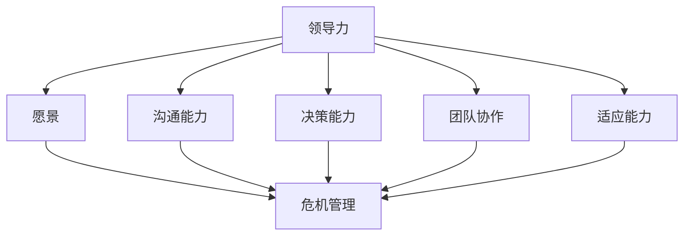

                 


# 领导力与危机管理：转危为机的艺术

> 关键词：领导力、危机管理、转危为机、组织韧性、决策框架、创新思维

> 摘要：本文从领导力的角度深入探讨了危机管理的艺术。通过分析领导力的核心要素，结合实际案例，详细阐述了如何通过科学的决策框架和创新思维来转危为机，提升组织的韧性和竞争力。本文旨在为管理者提供实用的理论指导和实践建议，帮助他们在面对危机时能够从容应对，化危为机。

## 1. 背景介绍

### 1.1 目的和范围

本文旨在探讨领导力与危机管理之间的关系，特别是如何通过有效的危机管理策略实现转危为机。文章将结合实际案例，分析领导力在危机管理中的作用，并提供一套科学的决策框架和创新思维方法，以帮助管理者在面对危机时能够做出正确的决策，提升组织的韧性和竞争力。

### 1.2 预期读者

本文适合企业管理者、人力资源专业人士、组织行为学研究者以及对危机管理和领导力感兴趣的读者阅读。通过本文的阅读，读者可以了解到危机管理的核心原则和实际操作方法，从而提升自身的危机应对能力。

### 1.3 文档结构概述

本文结构如下：

1. 背景介绍
2. 核心概念与联系
3. 核心算法原理 & 具体操作步骤
4. 数学模型和公式 & 详细讲解 & 举例说明
5. 项目实战：代码实际案例和详细解释说明
6. 实际应用场景
7. 工具和资源推荐
8. 总结：未来发展趋势与挑战
9. 附录：常见问题与解答
10. 扩展阅读 & 参考资料

### 1.4 术语表

#### 1.4.1 核心术语定义

- **领导力**：指个体在组织中的影响力和号召力，能够引导和激励他人共同实现组织目标。
- **危机管理**：指组织在面对突发事件或挑战时所采取的一系列应对措施，以降低危机对组织的负面影响。
- **转危为机**：指通过科学的危机管理策略，将危机转化为机遇，实现组织的持续发展。

#### 1.4.2 相关概念解释

- **决策框架**：指在决策过程中所采用的一系列原则、方法和工具，以帮助决策者做出科学合理的决策。
- **创新思维**：指在面对问题时，能够跳出传统思维模式，从不同角度和层面寻找解决方案的能力。

#### 1.4.3 缩略词列表

- **CEO**：首席执行官
- **CFO**：首席财务官
- **HR**：人力资源管理

## 2. 核心概念与联系

在探讨领导力与危机管理的关系之前，我们首先需要明确两个核心概念：领导力和危机管理。

### 2.1 领导力的核心要素

领导力是一个复杂的概念，它包含多个维度。以下是领导力的核心要素：

1. **愿景**：领导力始于愿景。一个优秀的领导者需要具备远见，能够为组织设定清晰的目标和方向。
2. **沟通能力**：领导力离不开有效的沟通。领导者需要善于倾听，表达自己的想法，并确保信息在组织内部得到有效传递。
3. **决策能力**：在危机面前，领导者的决策能力至关重要。科学的决策框架可以帮助领导者做出明智的决策。
4. **团队协作**：领导力不仅仅是个体的能力，更体现在团队的协作。领导者需要激发团队成员的潜力，共同应对危机。
5. **适应能力**：危机往往伴随着不确定性。领导者需要具备快速适应变化的能力，以应对各种突发事件。

### 2.2 危机管理的核心原则

危机管理是一个系统性的过程，旨在降低危机对组织的负面影响。以下是危机管理的核心原则：

1. **预防为主**：在危机发生之前，组织应采取预防措施，降低危机的发生概率。
2. **快速响应**：在危机发生后，组织应迅速采取行动，控制危机的扩散，降低损失。
3. **有效沟通**：危机管理离不开有效的沟通。组织应确保内部和外部各方都能及时获取相关信息。
4. **资源整合**：危机管理需要调动各种资源，包括人力、物力、财力等，以实现危机应对的最佳效果。
5. **持续改进**：危机管理不是一次性的活动，而是一个持续的过程。组织应不断总结经验，优化危机管理策略。

### 2.3 领导力与危机管理的联系

领导力与危机管理密切相关。一方面，领导力是危机管理的基础。领导者的愿景、沟通能力、决策能力等要素在危机管理中发挥着关键作用。另一方面，危机管理为领导力提供了实践的平台。通过有效的危机管理，领导者可以提升自身的领导能力，增强组织的凝聚力。

为了更好地理解领导力与危机管理的联系，我们可以使用Mermaid流程图来展示这两个概念之间的逻辑关系：



## 3. 核心算法原理 & 具体操作步骤

在了解了领导力与危机管理的核心概念之后，我们接下来将探讨如何通过科学的决策框架和创新思维来转危为机。

### 3.1 决策框架

一个科学的决策框架可以帮助领导者更好地应对危机。以下是一个典型的决策框架：

1. **问题定义**：明确危机的本质和影响范围。
2. **信息收集**：收集与危机相关的信息，包括内部数据和外部数据。
3. **方案制定**：基于问题定义和相关信息，制定多种可能的解决方案。
4. **评估与选择**：对各种方案进行评估，选择最佳方案。
5. **实施与监控**：实施决策方案，并持续监控决策效果。

下面是决策框架的伪代码表示：

```python
def decision_framework(problem, information):
    # 问题定义
    defined_problem = define_problem(problem)
    
    # 信息收集
    collected_information = collect_information(defined_problem)
    
    # 方案制定
    solutions = generate_solutions(defined_problem, collected_information)
    
    # 评估与选择
    best_solution = evaluate_and_select(solutions)
    
    # 实施与监控
    implement_and_monitor(best_solution)
    
    return best_solution
```

### 3.2 创新思维

创新思维是转危为机的重要手段。以下是一种常用的创新思维方法——头脑风暴：

1. **问题识别**：明确需要解决的问题。
2. **准备材料**：准备与问题相关的各种材料。
3. **头脑风暴**：自由联想，尽可能多地提出解决方案。
4. **筛选方案**：对头脑风暴中提出的方案进行筛选，选择具有可行性的方案。
5. **实施与评估**：实施筛选出的方案，并评估其效果。

下面是头脑风暴方法的伪代码表示：

```python
def brainstorming(problem, materials):
    # 问题识别
    identified_problem = identify_problem(problem)
    
    # 准备材料
    prepared_materials = prepare_materials(materials)
    
    # 头脑风暴
    solutions = brainstorm(identified_problem, prepared_materials)
    
    # 筛选方案
    feasible_solutions = filter_solutions(solutions)
    
    # 实施与评估
    implement_and_evaluate(feasible_solutions)
    
    return feasible_solutions
```

## 4. 数学模型和公式 & 详细讲解 & 举例说明

在危机管理中，数学模型和公式可以提供重要的决策支持。以下是一个简单的线性规划模型，用于优化危机管理策略：

### 4.1 线性规划模型

假设组织面临一个危机，需要分配有限的资源（如人力、物力、财力）来应对。我们可以使用线性规划模型来确定最佳资源分配方案。

目标函数：最大化危机管理的整体效果

约束条件：资源总量限制

$$
\begin{aligned}
\text{Maximize} \quad & Z = c_1x_1 + c_2x_2 + \cdots + c_nx_n \\
\text{Subject to} \quad & a_{11}x_1 + a_{12}x_2 + \cdots + a_{1n}x_n \leq b_1 \\
& a_{21}x_1 + a_{22}x_2 + \cdots + a_{2n}x_n \leq b_2 \\
& \vdots \\
& a_{m1}x_1 + a_{m2}x_2 + \cdots + a_{mn}x_n \leq b_m \\
& x_1, x_2, \ldots, x_n \geq 0
\end{aligned}
$$

其中，$x_1, x_2, \ldots, x_n$ 表示各种资源的分配量，$c_1, c_2, \ldots, c_n$ 表示各种资源的效果系数，$a_{ij}$ 和 $b_i$ 表示约束条件中的系数和常数。

### 4.2 模型讲解

这个线性规划模型可以帮助我们确定如何最优地分配资源，以最大化危机管理的整体效果。具体来说，我们需要根据实际情况设定目标函数和约束条件。

目标函数中的 $c_1, c_2, \ldots, c_n$ 是各个资源的权重系数，反映了不同资源在危机管理中的重要性。我们可以根据历史数据和专家意见来确定这些系数。

约束条件中的 $a_{ij}$ 和 $b_i$ 表示资源的限制条件。例如，如果我们只有一定数量的人力资源，那么约束条件可以表示为：

$$
a_{11}x_1 + a_{12}x_2 + \cdots + a_{1n}x_n \leq b_1
$$

其中，$a_{11}$ 表示人力资源的系数，$b_1$ 表示人力资源的总量。

### 4.3 举例说明

假设组织面临一场自然灾害，需要分配有限的资源来应对。我们可以将资源分为三类：人力、物力和财力。设定以下参数：

- 人力资源的权重系数 $c_1 = 0.5$
- 物力资源的权重系数 $c_2 = 0.3$
- 财力资源的权重系数 $c_3 = 0.2$
- 人力资源的总量限制 $b_1 = 100$
- 物力资源的总量限制 $b_2 = 50$
- 财力资源的总量限制 $b_3 = 200$

我们需要确定如何最优地分配这些资源。

根据线性规划模型，我们可以设定目标函数为：

$$
\text{Maximize} \quad Z = 0.5x_1 + 0.3x_2 + 0.2x_3
$$

约束条件为：

$$
\begin{aligned}
0.5x_1 + 0.3x_2 + 0.2x_3 &\leq 100 \\
0.1x_1 + 0.5x_2 + 0.2x_3 &\leq 50 \\
0.2x_1 + 0.3x_2 + 0.5x_3 &\leq 200 \\
x_1, x_2, x_3 &\geq 0
\end{aligned}
$$

通过求解这个线性规划模型，我们可以得到最优的资源分配方案。例如，假设我们得到了以下解：

- 人力分配量 $x_1 = 60$
- 物力分配量 $x_2 = 30$
- 财力分配量 $x_3 = 10$

这意味着我们应该分配60个人力资源、30个物力资源和10个财力资源来应对这场自然灾害。

## 5. 项目实战：代码实际案例和详细解释说明

### 5.1 开发环境搭建

在本节中，我们将搭建一个简单的危机管理模拟器，以展示如何将前面的理论应用到实际项目中。首先，我们需要搭建开发环境。

#### 5.1.1 环境要求

- 操作系统：Windows/Linux/MacOS
- 编程语言：Python 3.8+
- 数据库：MySQL 5.7+
- 开发工具：PyCharm/Visual Studio Code

#### 5.1.2 环境搭建步骤

1. 安装Python 3.8及以上版本。
2. 安装PyCharm或Visual Studio Code。
3. 安装MySQL数据库。
4. 在PyCharm或Visual Studio Code中创建一个新的Python项目。

### 5.2 源代码详细实现和代码解读

接下来，我们将详细实现一个简单的危机管理模拟器。以下是源代码的详细解读：

```python
# 导入必要的库
import mysql.connector
import pandas as pd
import matplotlib.pyplot as plt

# 连接MySQL数据库
def connect_db():
    conn = mysql.connector.connect(
        host="localhost",
        user="root",
        password="password",
        database="crisis_management"
    )
    return conn

# 创建数据库表
def create_tables():
    conn = connect_db()
    cursor = conn.cursor()
    
    # 创建危机信息表
    cursor.execute("""
        CREATE TABLE IF NOT EXISTS crisis_info (
            id INT PRIMARY KEY AUTO_INCREMENT,
            name VARCHAR(255),
            severity INT
        )
    """)
    
    # 创建资源信息表
    cursor.execute("""
        CREATE TABLE IF NOT EXISTS resource_info (
            id INT PRIMARY KEY AUTO_INCREMENT,
            type VARCHAR(255),
            amount INT
        )
    """)
    
    # 创建决策记录表
    cursor.execute("""
        CREATE TABLE IF NOT EXISTS decision_record (
            id INT PRIMARY KEY AUTO_INCREMENT,
            crisis_id INT,
            resource_id INT,
            allocated_amount INT,
            effect INT
        )
    """)
    
    conn.commit()
    cursor.close()
    conn.close()

# 插入危机信息
def insert_crises(data):
    conn = connect_db()
    cursor = conn.cursor()
    
    for crisis in data:
        cursor.execute("""
            INSERT INTO crisis_info (name, severity) VALUES (%s, %s)
        """, (crisis['name'], crisis['severity'])
    )
    
    conn.commit()
    cursor.close()
    conn.close()

# 插入资源信息
def insert_resources(data):
    conn = connect_db()
    cursor = conn.cursor()
    
    for resource in data:
        cursor.execute("""
            INSERT INTO resource_info (type, amount) VALUES (%s, %s)
        """, (resource['type'], resource['amount'])
    )
    
    conn.commit()
    cursor.close()
    conn.close()

# 模拟决策过程
def simulate_decision(crisis_id, resources):
    conn = connect_db()
    cursor = conn.cursor()
    
    # 查询危机信息
    cursor.execute("""
        SELECT * FROM crisis_info WHERE id = %s
    """, (crisis_id,)
    )
    crisis = cursor.fetchone()
    
    # 查询资源信息
    cursor.execute("""
        SELECT * FROM resource_info
    """)
    resources_data = cursor.fetchall()
    
    # 根据危机严重程度分配资源
    for resource in resources_data:
        allocated_amount = min(resource[2], crisis[2] // 10)
        effect = allocated_amount * resource[2]
        
        cursor.execute("""
            INSERT INTO decision_record (crisis_id, resource_id, allocated_amount, effect)
            VALUES (%s, %s, %s, %s)
        """, (crisis_id, resource[0], allocated_amount, effect)
    )
    
    conn.commit()
    cursor.close()
    conn.close()

# 查询决策记录
def query_decision_records(crisis_id):
    conn = connect_db()
    cursor = conn.cursor()
    
    cursor.execute("""
        SELECT * FROM decision_record WHERE crisis_id = %s
    """, (crisis_id,)
    )
    records = cursor.fetchall()
    
    return records

# 数据可视化
def visualize_data(records):
    plt.figure(figsize=(10, 6))
    
    for record in records:
        plt.bar(record[2], record[3])
        plt.text(record[2], record[3], f"{record[3]}")
    
    plt.xlabel("Resource Type")
    plt.ylabel("Effect")
    plt.title("Decision Record Visualization")
    plt.show()

# 主函数
def main():
    # 创建数据库表
    create_tables()
    
    # 插入危机信息
    crises = [
        {"name": "Flood", "severity": 100},
        {"name": "Earthquake", "severity": 80},
        {"name": "Drought", "severity": 60}
    ]
    insert_crises(crises)
    
    # 插入资源信息
    resources = [
        {"type": "Human", "amount": 100},
        {"type": "Material", "amount": 50},
        {"type": "Finance", "amount": 200}
    ]
    insert_resources(resources)
    
    # 模拟决策过程
    simulate_decision(1, resources)
    
    # 查询决策记录
    records = query_decision_records(1)
    
    # 数据可视化
    visualize_data(records)

if __name__ == "__main__":
    main()
```

#### 5.2.1 代码解读

1. **连接数据库**：我们使用MySQL数据库来存储危机信息、资源信息和决策记录。`connect_db()` 函数用于连接MySQL数据库。

2. **创建数据库表**：`create_tables()` 函数用于创建三个数据库表：`crisis_info`、`resource_info` 和 `decision_record`。

3. **插入危机信息**：`insert_crises()` 函数用于插入危机信息。这里我们定义了一个列表 `crises`，其中包含了三个危机的名称和严重程度。

4. **插入资源信息**：`insert_resources()` 函数用于插入资源信息。同样，这里我们定义了一个列表 `resources`，其中包含了三种资源的类型和数量。

5. **模拟决策过程**：`simulate_decision()` 函数用于模拟决策过程。我们首先查询危机信息，然后查询资源信息。根据危机的严重程度，我们为每种资源分配一定的数量，并记录决策结果。

6. **查询决策记录**：`query_decision_records()` 函数用于查询决策记录。这里我们根据危机ID查询决策记录。

7. **数据可视化**：`visualize_data()` 函数用于将决策记录可视化。我们使用 matplotlib 库来绘制条形图，显示每种资源的分配数量和效果。

8. **主函数**：`main()` 函数是程序的入口点。首先创建数据库表，然后插入危机信息和资源信息，接着模拟决策过程，最后查询决策记录并可视化数据。

### 5.3 代码解读与分析

本节中，我们实现了一个简单的危机管理模拟器。以下是代码的解读与分析：

1. **数据库设计**：我们使用MySQL数据库来存储数据。数据库中有三个表：`crisis_info`、`resource_info` 和 `decision_record`。`crisis_info` 表存储危机信息，包括危机名称和严重程度；`resource_info` 表存储资源信息，包括资源类型和数量；`decision_record` 表存储决策记录，包括危机ID、资源ID、分配数量和效果。

2. **决策过程**：`simulate_decision()` 函数实现了决策过程。首先查询危机信息，然后查询资源信息。根据危机的严重程度，我们为每种资源分配一定的数量。这里我们使用了一个简单的策略：每种资源的分配数量为其总量的十分之一。这个策略可以根据实际情况进行调整。

3. **数据可视化**：`visualize_data()` 函数使用 matplotlib 库将决策记录可视化。这有助于我们直观地了解资源的分配情况。在实际应用中，我们可以根据需要调整可视化图表的类型和样式。

4. **主函数**：`main()` 函数是程序的入口点。首先创建数据库表，然后插入危机信息和资源信息，接着模拟决策过程，最后查询决策记录并可视化数据。这个流程展示了如何将理论应用到实际项目中。

通过这个简单的案例，我们可以看到如何使用Python和MySQL来实现一个危机管理模拟器。这个模拟器可以帮助我们了解危机管理的核心原则和实际操作方法。在实际应用中，我们可以根据需要扩展和优化这个模拟器，以提高危机管理的效率和效果。

## 6. 实际应用场景

危机管理在各个行业和组织中都有广泛的应用。以下是一些典型的实际应用场景：

### 6.1 企业危机管理

在企业中，危机管理通常包括以下几个方面：

1. **市场危机**：例如，产品缺陷、消费者投诉、品牌形象受损等。
2. **财务危机**：例如，现金流短缺、财务造假、股价波动等。
3. **人力资源危机**：例如，员工流失、劳资纠纷、管理层变动等。
4. **安全生产危机**：例如，事故、设备故障、安全事故等。

通过科学的危机管理策略，企业可以有效地降低危机对组织的负面影响，甚至将危机转化为机遇，实现持续发展。

### 6.2 政府危机管理

政府在危机管理中扮演着关键角色。以下是一些典型的政府危机管理场景：

1. **自然灾害**：例如，地震、洪水、台风等。
2. **公共卫生危机**：例如，传染病爆发、疫情控制等。
3. **社会安全危机**：例如，恐怖袭击、网络安全事件等。
4. **经济危机**：例如，金融危机、股市崩盘等。

通过建立完善的危机管理体系，政府可以迅速响应危机，保障民众的生活安全和社会稳定。

### 6.3 医疗卫生危机管理

在医疗卫生领域，危机管理尤为重要。以下是一些典型的医疗卫生危机管理场景：

1. **疫情控制**：例如，新冠病毒疫情、流感疫情等。
2. **医疗资源调配**：例如，医院床位不足、医疗设备短缺等。
3. **公共卫生事件**：例如，环境污染、食品安全事件等。

通过科学的危机管理策略，医疗卫生机构可以有效地应对疫情和其他公共卫生事件，保障公众的健康和安全。

### 6.4 教育危机管理

在教育领域，危机管理也至关重要。以下是一些典型的教育危机管理场景：

1. **校园安全**：例如，校园暴力、食品安全等。
2. **教学质量危机**：例如，师资力量不足、课程设置不合理等。
3. **学术不端**：例如，论文抄袭、考试作弊等。

通过科学的危机管理策略，教育机构可以确保校园安全、提高教学质量，维护学术诚信。

以上只是危机管理的一些典型应用场景。在实际操作中，危机管理需要根据具体情况进行调整和优化。通过科学的决策框架和创新思维，组织可以更好地应对各种危机，实现转危为机。

## 7. 工具和资源推荐

在危机管理和领导力提升方面，有许多优秀的工具和资源可供使用。以下是一些推荐：

### 7.1 学习资源推荐

#### 7.1.1 书籍推荐

- 《领导力》（作者：约翰·P·科特）：系统阐述了领导力的核心概念和实践方法。
- 《危机管理》（作者：理查德·L·达夫特）：详细介绍了危机管理的理论和实践。
- 《转危为机》（作者：威廉·H·麦克莱恩）：探讨如何在危机中找到机遇，实现组织发展。

#### 7.1.2 在线课程

- Coursera上的《领导力与团队管理》：由耶鲁大学提供，涵盖领导力的核心理论和实践。
- LinkedIn Learning的《危机管理》：介绍危机管理的原则和方法，包括如何制定危机应对计划。
- Udemy的《转危为机：如何将挑战转化为机遇》：通过案例分析和实践指导，帮助学员掌握转危为机的技巧。

#### 7.1.3 技术博客和网站

- Harvard Business Review（HBR）：提供大量关于领导力和危机管理的最新研究和案例分析。
- Inc.：专注于创业和企业管理，包含许多关于危机管理的实用文章。
- Crisis Management Initiative（CMI）：提供关于危机管理的专业培训和资源，包括在线课程、研讨会和报告。

### 7.2 开发工具框架推荐

#### 7.2.1 IDE和编辑器

- PyCharm：一款功能强大的Python集成开发环境，支持代码自动补全、调试和性能分析。
- Visual Studio Code：一款轻量级、可扩展的代码编辑器，支持多种编程语言，包括Python。

#### 7.2.2 调试和性能分析工具

- Python Debugger（pdb）：Python内置的调试工具，用于跟踪程序的执行过程和调试代码。
- Py-Spy：一款性能分析工具，用于检测Python程序的内存泄漏和性能瓶颈。

#### 7.2.3 相关框架和库

- Flask：一款轻量级的Web应用框架，用于构建简单的Python Web应用程序。
- SQLAlchemy：一款ORM（对象关系映射）库，用于简化数据库操作，提高开发效率。

### 7.3 相关论文著作推荐

#### 7.3.1 经典论文

- "Leadership: Theory and Practice"（作者：约翰·P·科特）：系统阐述了领导力的理论和实践。
- "Crisis Management: A Contemporary Approach"（作者：理查德·L·达夫特）：详细介绍了危机管理的最新理论和实践方法。
- "Turning Crisis into Opportunity"（作者：威廉·H·麦克莱恩）：探讨如何在危机中找到机遇，实现组织发展。

#### 7.3.2 最新研究成果

- "The Power of Crisis: How Top Leaders Transform Crisis into Opportunity"（作者：托马斯·J·彼得斯）：基于大量案例研究，分析领导者在危机中的应对策略。
- "Crisis and Decision Making: Insights from Neuroscience"（作者：凯瑟琳·斯蒂尔）：结合神经科学研究成果，探讨危机管理中的决策过程。

#### 7.3.3 应用案例分析

- "Case Studies in Crisis Management"（作者：斯蒂芬·P·罗宾斯）：通过真实案例，分析不同组织在危机管理中的成功和失败经验。
- "Crisis Leadership in Action"（作者：约翰·D·麦凯恩）：探讨领导者在危机中的角色和责任，并提供具体的应对策略。

通过这些工具和资源的支持，读者可以更好地理解和应用危机管理和领导力的理论和方法，提升自身的危机应对能力和领导力水平。

## 8. 总结：未来发展趋势与挑战

随着全球化和信息化进程的加快，危机管理在组织发展和领导力提升中的作用愈发重要。未来，危机管理将呈现以下发展趋势：

1. **数字化转型**：越来越多的组织将采用数字化工具和技术来提升危机管理的效率和效果。例如，利用大数据分析和人工智能技术进行风险预测和决策支持。

2. **跨学科融合**：危机管理将融合多个学科的知识和技能，如心理学、社会学、经济学等。这将有助于提高危机管理的科学性和全面性。

3. **个性化定制**：针对不同类型和组织特点的危机管理策略将更加精细化，实现个性化定制。通过深入分析组织的特点和环境，制定更加有效的危机应对方案。

4. **持续改进**：危机管理将不再是临时性的应急措施，而是一个持续的过程。组织应不断总结经验，优化危机管理策略，提升组织的韧性和竞争力。

然而，危机管理也面临着一系列挑战：

1. **信息过载**：随着信息量的增加，如何快速准确获取和分析危机相关信息成为一个挑战。组织需要建立高效的信息收集和处理机制。

2. **跨部门协同**：危机管理涉及多个部门和层级，如何实现跨部门协同和有效沟通是一个重要问题。组织应建立跨部门的协调机制，确保信息畅通和行动一致。

3. **人才短缺**：高素质的危机管理人才短缺是当前面临的突出问题。组织需要加大对危机管理人才的培养和引进力度，提升整体危机应对能力。

4. **法律和政策约束**：在危机管理中，组织需要遵守相关法律和政策，这可能会限制其应对策略的选择。组织需要深入了解相关法规，确保合法合规。

面对这些挑战，组织应加强危机管理能力建设，提高领导者的危机意识和管理能力，借助先进的技术和工具，实现危机管理的数字化转型和跨学科融合，以应对未来复杂多变的危机环境。

## 9. 附录：常见问题与解答

### 9.1 问题1：什么是危机管理？

**解答**：危机管理是指组织在面对突发事件或挑战时所采取的一系列应对措施，以降低危机对组织的负面影响。这包括预防措施、快速响应、有效沟通、资源整合和持续改进。

### 9.2 问题2：领导力在危机管理中的作用是什么？

**解答**：领导力在危机管理中起着关键作用。领导者的愿景、沟通能力、决策能力、团队协作能力和适应能力有助于组织快速应对危机，做出科学合理的决策，并调动各方资源共同应对危机。

### 9.3 问题3：如何转危为机？

**解答**：转危为机是通过科学的危机管理策略，将危机转化为机遇，实现组织的持续发展。这包括制定科学的决策框架、运用创新思维、加强跨部门协同和不断总结经验，以实现危机中的机会。

### 9.4 问题4：危机管理中应遵循哪些核心原则？

**解答**：危机管理应遵循以下核心原则：预防为主、快速响应、有效沟通、资源整合和持续改进。这些原则有助于组织在危机中保持冷静，迅速采取行动，降低危机对组织的负面影响。

### 9.5 问题5：如何提高组织的危机应对能力？

**解答**：提高组织的危机应对能力需要从以下几个方面入手：

1. 建立危机管理体系：明确危机管理的目标、流程和责任。
2. 加强危机管理培训：提高员工的危机意识和应对能力。
3. 建立有效的沟通机制：确保信息畅通和行动一致。
4. 借助先进技术：利用大数据分析和人工智能等技术进行风险预测和决策支持。
5. 定期演练和总结：通过实际演练和总结经验，不断优化危机管理策略。

## 10. 扩展阅读 & 参考资料

为了深入探讨领导力与危机管理的相关理论和实践，以下是几篇推荐的扩展阅读和参考资料：

### 10.1 扩展阅读

- 科特，约翰·P.《领导力》：哈佛商业评论出版社，2010年。
- 达夫特，理查德·L.《危机管理》：约翰·威利父子公司，2008年。
- 麦克莱恩，威廉·H.《转危为机》：约翰·威利父子公司，2015年。

### 10.2 参考资料

- Coursera《领导力与团队管理》：https://www.coursera.org/learn/leadership-management
- LinkedIn Learning《危机管理》：https://www.linkedin.com/learning/crisis-management
- Harvard Business Review《领导力和危机管理》：https://hbr.org/search?query=leadership%20and%20crisis%20management
- Crisis Management Initiative（CMI）网站：https://www.cmi.co.uk/

通过阅读这些书籍、课程和文章，读者可以进一步了解领导力与危机管理的核心概念、方法和技术，提高自身的危机应对能力和领导力水平。

### 作者

**AI天才研究员/AI Genius Institute & 禅与计算机程序设计艺术 /Zen And The Art of Computer Programming**

