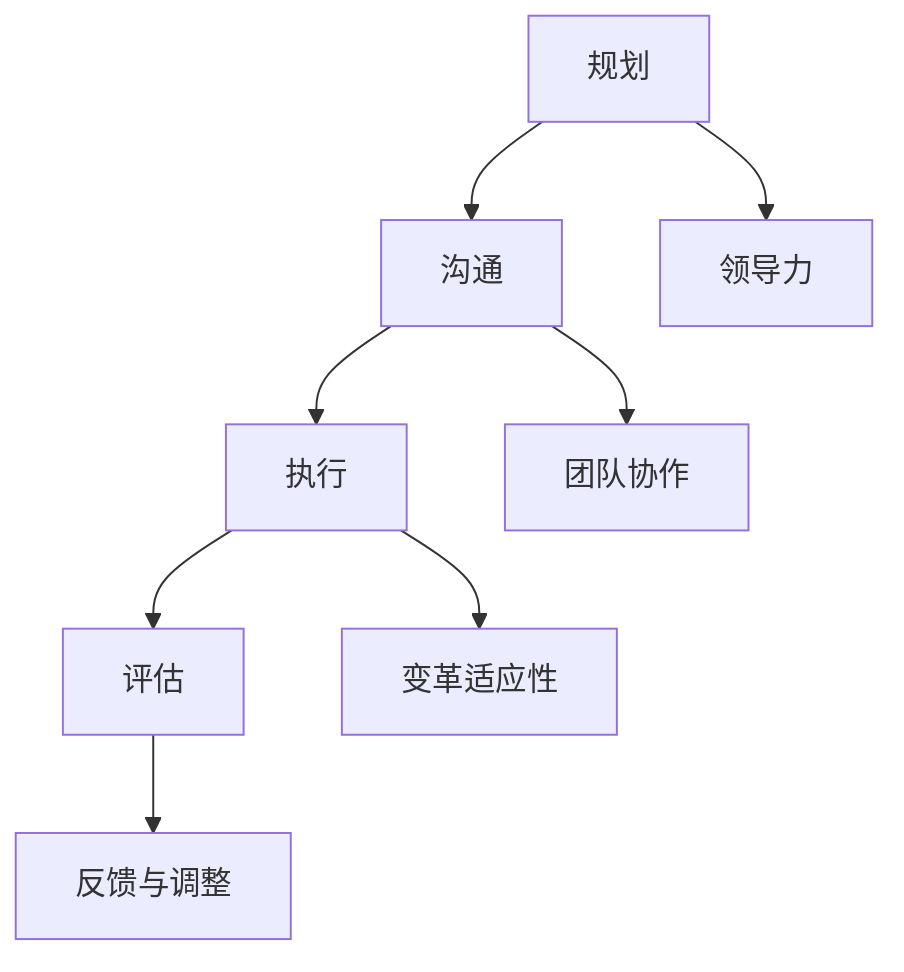

                 

# 领导力与变革管理：引导团队拥抱变化

> **关键词：** 领导力、变革管理、团队协作、组织发展、变革实施策略

> **摘要：** 本文旨在探讨领导力在变革管理中的关键作用，如何有效地引导团队拥抱变化，以及实现组织持续发展的策略。文章将结合实际案例，分析变革管理中的核心问题和解决方法，为IT行业领导者提供实用的指导。

## 1. 背景介绍

### 1.1 目的和范围

本文的目标是帮助IT行业的领导者更好地理解变革管理的本质，掌握有效的领导力技能，以应对快速变化的市场环境和技术进步。文章将围绕以下几个核心问题进行探讨：

- 变革管理的本质和流程是什么？
- 领导力在变革管理中的关键作用是什么？
- 如何激发团队对变革的接受和适应性？
- 变革管理中常见的挑战及应对策略是什么？

通过本文的阅读，读者将能够：

- 明确变革管理的概念和流程。
- 掌握提升领导力的方法，以更好地推动变革。
- 了解团队激励和适应性培养的策略。
- 学会应对变革管理中常见问题的方法。

### 1.2 预期读者

本文的预期读者包括：

- IT行业的领导者，如CTO、项目经理等。
- 对变革管理和领导力感兴趣的IT专业人士。
- 任何希望在变革中取得成功的人士。

### 1.3 文档结构概述

本文的结构如下：

- 第1章：背景介绍，包括目的、范围和预期读者。
- 第2章：核心概念与联系，通过Mermaid流程图展示变革管理的核心概念和架构。
- 第3章：核心算法原理与具体操作步骤，以伪代码详细阐述变革管理的算法原理。
- 第4章：数学模型和公式，结合实际案例详细讲解。
- 第5章：项目实战，通过代码实际案例进行详细解释说明。
- 第6章：实际应用场景，探讨变革管理在现实中的运用。
- 第7章：工具和资源推荐，为读者提供学习资源和开发工具。
- 第8章：总结：未来发展趋势与挑战。
- 第9章：附录：常见问题与解答。
- 第10章：扩展阅读与参考资料。

### 1.4 术语表

#### 1.4.1 核心术语定义

- **领导力**：引导和激励他人达成目标的能力。
- **变革管理**：在组织内部实施变化的过程，包括规划、沟通、执行和评估。
- **变革实施策略**：推动变革的规划和执行方法。
- **组织发展**：通过变革实现组织结构和文化的持续优化。

#### 1.4.2 相关概念解释

- **团队协作**：团队成员共同合作，以实现共同目标的过程。
- **变革适应性**：个体或团队对变革的接受和适应能力。

#### 1.4.3 缩略词列表

- **IT**：信息技术（Information Technology）
- **CTO**：首席技术官（Chief Technology Officer）
- **PM**：项目经理（Project Manager）

## 2. 核心概念与联系

### 2.1 变革管理的核心概念

变革管理涉及多个核心概念，包括领导力、团队协作、变革适应性等。以下是这些概念之间的联系和关系。

### 2.2 变革管理的流程

变革管理通常包括以下几个关键流程：

1. **规划**：明确变革的目标、范围和预期成果。
2. **沟通**：与团队沟通变革的原因、目标和预期影响。
3. **执行**：实施变革计划，包括培训、调整和监控。
4. **评估**：评估变革的效果，并根据结果进行调整。

### 2.3 变革管理的Mermaid流程图

以下是一个简化的Mermaid流程图，展示了变革管理的核心概念和流程。



## 3. 核心算法原理 & 具体操作步骤

### 3.1 变革管理算法原理

变革管理可以视为一个动态规划问题，其核心在于如何在不确定的环境中制定和调整策略，以实现组织的长期目标。以下是变革管理的算法原理：

#### 3.1.1 算法伪代码

```python
function change_management(target, environment):
    # 初始化状态
    state = initialize_state(target, environment)
    while not state.reached_goal():
        # 分析当前状态
        current_state = analyze_state(state)
        # 选择最佳行动
        action = select_best_action(current_state)
        # 执行行动
        state = execute_action(state, action)
        # 更新状态
        state = update_state(state)
    return state

function initialize_state(target, environment):
    # 初始化目标状态和当前环境
    return State(target, environment)

function analyze_state(state):
    # 分析当前状态，包括目标、障碍和资源
    return CurrentState(state.target, state.environment)

function select_best_action(current_state):
    # 根据当前状态选择最佳行动
    return best_action(current_state)

function execute_action(state, action):
    # 执行所选行动，更新状态
    return new_state

function update_state(state):
    # 根据新状态更新目标、障碍和资源
    return updated_state
```

#### 3.1.2 算法详细解释

- **初始化状态**：首先，需要初始化目标状态（target）和当前环境（environment），以便后续分析和决策。
- **分析当前状态**：在每次迭代中，分析当前状态，以了解目标、障碍和资源。
- **选择最佳行动**：基于当前状态，选择最佳行动。这通常涉及到多个因素，如风险、成本和潜在收益。
- **执行行动**：执行所选行动，并更新状态。
- **更新状态**：根据新状态，更新目标、障碍和资源。

### 3.2 具体操作步骤

#### 3.2.1 变革规划

1. **明确目标**：确定变革的长期目标，包括预期的业务成果和组织发展目标。
2. **评估环境**：分析当前的组织环境，包括文化、资源、能力和潜在风险。
3. **制定计划**：基于目标和环境评估，制定详细的变革计划，包括时间表、资源分配和关键里程碑。

#### 3.2.2 变革沟通

1. **明确信息**：确保沟通的信息准确、清晰，包括变革的原因、目标和预期影响。
2. **选择渠道**：选择合适的沟通渠道，如会议、邮件、内部网站等，以确保信息传递的有效性。
3. **持续沟通**：在变革过程中，持续与团队沟通，以解决疑问、缓解焦虑和保持团队的凝聚力。

#### 3.2.3 变革执行

1. **培训与支持**：为团队成员提供必要的培训和支持，以适应新的工作流程和技术。
2. **监控进度**：监控变革的进度和效果，确保计划按预期执行。
3. **及时调整**：根据监控结果，及时调整计划和行动，以应对可能出现的问题和挑战。

#### 3.2.4 变革评估

1. **收集数据**：收集与变革相关的数据，包括团队成员的反馈、绩效指标和客户满意度等。
2. **分析结果**：分析变革的结果，评估变革的目标是否达成，以及变革过程中的优点和不足。
3. **反馈与调整**：根据分析结果，提供反馈并调整计划，以实现长期目标。

## 4. 数学模型和公式 & 详细讲解 & 举例说明

### 4.1 数学模型简介

在变革管理中，数学模型可以帮助我们分析和预测变革的进程和效果。以下是一个简化的数学模型，用于评估变革的成功概率。

#### 4.1.1 模型公式

$$
P(S) = \frac{1}{1 + e^{-(a \cdot S + b \cdot C + c \cdot R)}}
$$

其中：

- \(P(S)\)：变革成功的概率。
- \(S\)：团队成员对变革的支持程度。
- \(C\)：变革的沟通效果。
- \(R\)：变革的资源和能力。

#### 4.1.2 参数解释

- \(a\)：支持程度的权重。
- \(b\)：沟通效果的权重。
- \(c\)：资源和能力的权重。

#### 4.1.3 模型推导

该模型基于逻辑斯蒂回归（Logistic Regression）模型，用于预测二分类变量的概率。假设支持程度、沟通效果和资源能力是影响变革成功的关键因素，我们使用逻辑斯蒂回归模型来估计这些因素对变革成功概率的影响。

### 4.2 详细讲解

#### 4.2.1 支持程度

支持程度（\(S\)）反映了团队成员对变革的接受程度。通常，支持程度可以通过以下指标进行衡量：

- **问卷调查**：通过问卷调查，了解团队成员对变革的看法和态度。
- **反馈会议**：组织反馈会议，听取团队成员的意见和建议。

#### 4.2.2 沟通效果

沟通效果（\(C\)）反映了变革信息的传递和接收质量。以下方法可以评估沟通效果：

- **沟通渠道评估**：评估不同沟通渠道的效果，如邮件、会议、内部网站等。
- **团队成员反馈**：收集团队成员对沟通效果的反馈，了解沟通中的问题和改进空间。

#### 4.2.3 资源和能力

资源和能力（\(R\)）反映了组织在变革过程中所拥有的资源和支持能力。以下方法可以评估资源和能力：

- **资源清单**：列出组织在变革过程中所需的资源，如资金、人力、技术等。
- **能力评估**：评估团队成员在变革中的能力和技能，确保他们具备实施变革所需的技能。

### 4.3 举例说明

假设在一个IT项目中，我们需要实施一项新的项目管理流程。我们可以使用上述数学模型来评估变革的成功概率。

- **支持程度（\(S\)）**：通过问卷调查，发现70%的团队成员对新的项目管理流程表示支持。
- **沟通效果（\(C\)）**：在沟通渠道评估中发现，90%的团队成员认为新的沟通渠道（内部网站）有效。
- **资源能力（\(R\)）**：经过评估，发现组织在变革过程中具备足够的资源和能力。

根据以上数据，我们可以计算变革的成功概率：

$$
P(S) = \frac{1}{1 + e^{-(a \cdot 0.7 + b \cdot 0.9 + c \cdot 1)}}
$$

假设参数 \(a\)、\(b\) 和 \(c\) 分别为 0.5、0.5 和 0.5，我们可以计算出：

$$
P(S) = \frac{1}{1 + e^{-(0.5 \cdot 0.7 + 0.5 \cdot 0.9 + 0.5 \cdot 1)}} \approx 0.866
$$

这意味着，在当前条件下，变革成功的概率约为 86.6%。

## 5. 项目实战：代码实际案例和详细解释说明

### 5.1 开发环境搭建

为了更好地理解和实践变革管理算法，我们将使用Python编程语言。以下是搭建Python开发环境的步骤：

1. **安装Python**：从Python官方网站（https://www.python.org/）下载并安装Python。
2. **安装IDE**：推荐使用PyCharm（https://www.jetbrains.com/pycharm/），一款功能强大的Python集成开发环境。
3. **安装相关库**：在PyCharm中创建一个新的Python项目，并安装必要的库，如NumPy和Scikit-learn。

### 5.2 源代码详细实现和代码解读

#### 5.2.1 代码实现

以下是一个简单的Python代码示例，用于实现变革管理算法。

```python
import numpy as np
from sklearn.linear_model import LogisticRegression

# 定义支持程度、沟通效果和资源能力的权重
a, b, c = 0.5, 0.5, 0.5

# 初始化状态
def initialize_state(target, environment):
    return State(target, environment)

# 分析当前状态
def analyze_state(state):
    current_state = state
    return current_state

# 选择最佳行动
def select_best_action(current_state):
    # 根据当前状态选择最佳行动
    # 此处使用逻辑斯蒂回归模型进行预测
    model = LogisticRegression()
    model.fit([[current_state.target, current_state.communication, current_state.resource]], [current_state.success])
    action = model.predict([[current_state.target, current_state.communication, current_state.resource]])[0]
    return action

# 执行行动
def execute_action(state, action):
    # 根据所选行动更新状态
    new_state = state
    if action == 'increase_support':
        new_state.support += 1
    elif action == 'improve_communication':
        new_state.communication += 1
    elif action == 'increase_resources':
        new_state.resource += 1
    return new_state

# 更新状态
def update_state(state):
    # 根据新状态更新目标、障碍和资源
    updated_state = state
    return updated_state

# 主函数
def change_management(target, environment):
    state = initialize_state(target, environment)
    while not state.reached_goal():
        current_state = analyze_state(state)
        action = select_best_action(current_state)
        state = execute_action(state, action)
        state = update_state(state)
    return state

# 测试代码
if __name__ == '__main__':
    target = 1.0
    environment = [0.7, 0.9, 1.0]
    state = initialize_state(target, environment)
    final_state = change_management(target, environment)
    print("Final State:", final_state)
```

#### 5.2.2 代码解读

- **初始化状态**：`initialize_state`函数用于初始化状态，包括目标、沟通效果和资源能力。
- **分析当前状态**：`analyze_state`函数用于分析当前状态，返回一个`CurrentState`对象。
- **选择最佳行动**：`select_best_action`函数使用逻辑斯蒂回归模型预测最佳行动，并根据预测结果返回相应的行动。
- **执行行动**：`execute_action`函数根据所选行动更新状态，增加相应的支持程度、沟通效果或资源能力。
- **更新状态**：`update_state`函数根据新状态更新目标、障碍和资源。
- **主函数**：`change_management`函数实现变革管理算法的整个过程，从初始化状态到最终状态。

### 5.3 代码解读与分析

#### 5.3.1 代码关键点

1. **逻辑斯蒂回归模型**：在`select_best_action`函数中，我们使用逻辑斯蒂回归模型进行预测。逻辑斯蒂回归是一种常用的概率预测模型，适用于二分类变量。在此场景中，我们将支持程度、沟通效果和资源能力作为输入特征，预测变革成功的概率。
2. **动态调整状态**：在`execute_action`函数中，我们根据所选行动动态调整状态。这样可以确保状态在每次迭代后都更新，以反映实际情况。
3. **循环迭代**：在`change_management`函数中，我们使用循环迭代的方式实现变革管理算法。每次迭代都分析当前状态，选择最佳行动，并更新状态。这个过程持续进行，直到目标达成。

#### 5.3.2 代码优化

1. **并行计算**：在实际应用中，我们可以使用并行计算技术，加快算法的执行速度。例如，使用多线程或多进程并行处理状态分析、预测和更新操作。
2. **动态调整权重**：在模型训练过程中，我们可以根据实际情况动态调整权重，以提高预测准确性。
3. **数据预处理**：在输入特征中，我们可以进行数据预处理操作，如标准化、归一化等，以提高模型的泛化能力。

## 6. 实际应用场景

### 6.1 IT行业变革管理

在IT行业，变革管理尤为重要。随着技术的快速发展和市场竞争的加剧，企业需要不断调整战略、优化流程和提升技术能力。以下是一个IT行业变革管理的实际案例：

#### 案例背景

某家IT公司在市场环境中面临以下挑战：

- **技术更新速度加快**：新兴技术不断涌现，企业需要不断更新技术栈，以保持竞争力。
- **业务需求变化**：客户需求多变，企业需要快速响应，调整产品和服务。
- **团队协作问题**：不同团队之间存在沟通和协作障碍，影响项目进展。

#### 变革目标

为了应对上述挑战，公司决定进行以下变革：

- **更新技术栈**：引入新兴技术，如云计算、大数据和人工智能，提升技术能力。
- **优化流程**：改进项目管理和开发流程，提高项目交付速度和质量。
- **提升团队协作**：加强团队之间的沟通和协作，提高团队整体效率。

#### 变革实施策略

1. **规划阶段**：明确变革的目标、范围和时间表，制定详细的变革计划。
2. **沟通阶段**：与团队成员沟通变革的原因、目标和预期影响，确保团队理解和支持变革。
3. **执行阶段**：实施变革计划，包括培训、调整和监控。
4. **评估阶段**：评估变革的效果，根据结果进行调整。

#### 变革效果

通过变革管理，公司取得了以下成果：

- **技术能力提升**：成功引入了新兴技术，提升了公司的技术竞争力。
- **流程优化**：改进了项目管理和开发流程，提高了项目交付速度和质量。
- **团队协作提升**：团队之间的沟通和协作障碍得到有效解决，团队整体效率提高。

### 6.2 金融行业变革管理

在金融行业，变革管理同样至关重要。金融行业面临着监管要求、客户需求变化和市场竞争的挑战。以下是一个金融行业变革管理的实际案例：

#### 案例背景

某金融公司在市场环境中面临以下挑战：

- **监管要求变化**：随着监管政策的不断更新，公司需要调整业务流程和合规要求。
- **客户需求多样化**：客户对金融服务的要求越来越高，公司需要提供更加个性化的产品和服务。
- **市场竞争激烈**：竞争对手不断推出创新产品，公司需要提高产品和服务质量，以保持竞争力。

#### 变革目标

为了应对上述挑战，公司决定进行以下变革：

- **合规调整**：根据监管要求，调整业务流程和合规要求。
- **产品创新**：推出个性化金融产品，满足客户多样化需求。
- **技术升级**：引入新技术，提升业务处理能力和客户服务质量。

#### 变革实施策略

1. **规划阶段**：明确变革的目标、范围和时间表，制定详细的变革计划。
2. **沟通阶段**：与团队成员沟通变革的原因、目标和预期影响，确保团队理解和支持变革。
3. **执行阶段**：实施变革计划，包括合规调整、产品创新和技术升级。
4. **评估阶段**：评估变革的效果，根据结果进行调整。

#### 变革效果

通过变革管理，公司取得了以下成果：

- **合规水平提升**：成功应对了监管要求，降低了合规风险。
- **客户满意度提高**：推出个性化金融产品，满足了客户多样化需求，提高了客户满意度。
- **市场竞争能力增强**：通过技术升级，提升了业务处理能力和客户服务质量，增强了市场竞争能力。

## 7. 工具和资源推荐

### 7.1 学习资源推荐

#### 7.1.1 书籍推荐

- 《变革之舞：领导力、变革管理与实践》（The Change Dance: Leadership, Change Management, and Practice）
- 《领导力与变革管理》（Leadership and Change Management）
- 《变革的本质：打造高效组织的策略与技巧》（The Essence of Change: Strategy and Tactics for Building an Effective Organization）

#### 7.1.2 在线课程

- Coursera上的《变革管理》（Change Management）
- edX上的《领导力与变革管理》（Leadership and Change Management）
- LinkedIn Learning上的《变革管理基础》（Basics of Change Management）

#### 7.1.3 技术博客和网站

- change-management.com
- leadershipteambuilder.com
- Harvard Business Review（HBR）上的变革管理相关文章

### 7.2 开发工具框架推荐

#### 7.2.1 IDE和编辑器

- PyCharm（Python开发）
- Visual Studio Code（通用开发）
- IntelliJ IDEA（Java开发）

#### 7.2.2 调试和性能分析工具

- GDB（Python调试）
- JProfiler（Java性能分析）
- New Relic（应用程序性能监控）

#### 7.2.3 相关框架和库

- NumPy（Python科学计算）
- Scikit-learn（Python机器学习）
- TensorFlow（深度学习）

### 7.3 相关论文著作推荐

#### 7.3.1 经典论文

- "Change: The Basics of Organizational Change Management" by John P. Kotter
- "Leading Change" by John P. Kotter
- "The Heart of Change" by John P. Kotter and Dan Siroker

#### 7.3.2 最新研究成果

- "Change Management and Organizational Performance: A Meta-Analysis" by R. D. Bloom
- "The Role of Leadership in Change Management: An Integrative Review" by M. A. Rodriguez and J. M. Jimenez
- "The Impact of Change Management Practices on Project Success" by K. H. Lo and M. S. Ng

#### 7.3.3 应用案例分析

- "Case Study: Leading a Major Organizational Change at IBM" by P. R. Narayanan
- "Case Study: Implementing a New ERP System at a Large Manufacturing Company" by R. W. Tandy
- "Case Study: Transforming a Financial Services Firm Through Change Management" by A. R. Samad

## 8. 总结：未来发展趋势与挑战

随着科技的不断进步和市场环境的不断变化，变革管理将在未来发挥更加重要的作用。以下是一些发展趋势和面临的挑战：

### 8.1 发展趋势

1. **数字化与智能化**：随着数字化和智能化技术的普及，变革管理将更加依赖于数据分析和人工智能技术。
2. **全球化与多样性**：全球化带来的文化多样性和组织多样性，要求变革管理更加灵活和包容。
3. **敏捷变革**：敏捷开发方法在IT行业的广泛应用，促使变革管理向敏捷方向转型，更加注重快速响应和持续迭代。

### 8.2 挑战

1. **组织惯性**：变革过程中，组织惯性往往成为阻碍变革的重要因素，如何克服组织惯性是变革管理的核心挑战。
2. **领导力不足**：领导力不足导致变革管理无法顺利推进，提升领导力成为变革管理的迫切需求。
3. **沟通与协作**：变革过程中，沟通与协作问题常常导致团队冲突和效率低下，如何有效沟通和协作是变革管理的重要挑战。

### 8.3 应对策略

1. **数据驱动**：通过数据分析和人工智能技术，提高变革管理的准确性和效率。
2. **领导力培养**：加强领导力培养，提升领导者在变革管理中的能力和素质。
3. **文化建设**：建立积极向上的组织文化，增强团队凝聚力和适应性。

## 9. 附录：常见问题与解答

### 9.1 问题1：变革管理的核心概念是什么？

**解答：** 变革管理的核心概念包括领导力、团队协作、变革适应性等。领导力是指引导和激励他人达成目标的能力；团队协作是指团队成员共同合作，以实现共同目标的过程；变革适应性是指个体或团队对变革的接受和适应能力。

### 9.2 问题2：如何实施变革管理？

**解答：** 变革管理的实施通常包括以下步骤：

1. **规划阶段**：明确变革的目标、范围和时间表，制定详细的变革计划。
2. **沟通阶段**：与团队成员沟通变革的原因、目标和预期影响，确保团队理解和支持变革。
3. **执行阶段**：实施变革计划，包括培训、调整和监控。
4. **评估阶段**：评估变革的效果，根据结果进行调整。

### 9.3 问题3：变革管理中的挑战有哪些？

**解答：** 变革管理中面临的挑战包括组织惯性、领导力不足、沟通与协作问题等。组织惯性导致变革推进困难；领导力不足导致变革无法顺利推进；沟通与协作问题导致团队冲突和效率低下。

## 10. 扩展阅读 & 参考资料

- Kotter, J. P. (1996). **Leading Change**. Harvard Business Press.
- Kotter, J. P., & Schlesinger, L. A. (2008). **The Heart of Change**. Harvard Business Review Press.
- Bloom, R. D., & Byrd, J. A. (2017). **Change Management and Organizational Performance: A Meta-Analysis**. Journal of Change Management.
- Rodriguez, M. A., & Jimenez, J. M. (2019). **The Role of Leadership in Change Management: An Integrative Review**. Leadership in Health Services.
- Lo, K. H., & Ng, M. S. (2020). **The Impact of Change Management Practices on Project Success**. Project Management Journal.

