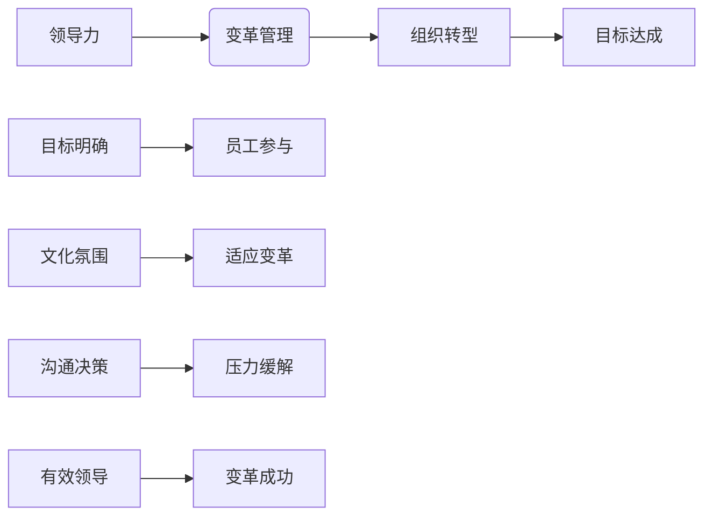

                 


# 领导力与变革管理：引领组织转型

> 关键词：领导力、变革管理、组织转型、文化变革、决策过程、人才发展

> 摘要：本文旨在探讨领导力在组织变革管理中的关键作用。通过分析领导力与变革管理之间的联系，本文将介绍一系列核心概念、算法原理、数学模型和实际应用案例，帮助读者理解如何通过有效的领导力策略引领组织实现成功转型。文章还将提供一系列学习资源和工具推荐，以助力读者在实践中的成长。

## 1. 背景介绍

### 1.1 目的和范围

本文的主要目的是为IT领域的专业人士和管理者提供关于领导力和变革管理在组织转型中的实际应用指导。我们将通过详细的理论阐述和实践案例分析，探讨如何利用领导力来推动组织变革，应对外部环境的变化，实现长期可持续发展。

### 1.2 预期读者

本文适用于希望提升领导力技能并寻求有效变革管理策略的IT专业人士、项目经理、团队领导以及企业管理者。

### 1.3 文档结构概述

本文结构如下：

- 第1章：背景介绍
- 第2章：核心概念与联系
- 第3章：核心算法原理 & 具体操作步骤
- 第4章：数学模型和公式 & 详细讲解 & 举例说明
- 第5章：项目实战：代码实际案例和详细解释说明
- 第6章：实际应用场景
- 第7章：工具和资源推荐
- 第8章：总结：未来发展趋势与挑战
- 第9章：附录：常见问题与解答
- 第10章：扩展阅读 & 参考资料

### 1.4 术语表

#### 1.4.1 核心术语定义

- 领导力：指通过影响、激励和指导他人实现共同目标的能力。
- 变革管理：指组织在面临外部或内部变化时，通过计划、执行和监控一系列策略，以实现目标转变的过程。
- 组织转型：指组织为了适应新的市场环境、技术进步或战略调整而进行的一系列变革。
- 企业文化：指组织内部共同遵循的价值观、信仰和行为规范。

#### 1.4.2 相关概念解释

- 外部环境：指组织所处的宏观、微观市场环境以及其他外部因素。
- 内部环境：指组织内部的资源、能力、组织结构和员工关系等。
- 变革驱动因素：指推动组织进行变革的外部或内部因素，如市场竞争、技术创新等。

#### 1.4.3 缩略词列表

- IT：信息技术
- PM：项目经理
- CTO：首席技术官
- HR：人力资源

## 2. 核心概念与联系

在探讨领导力与变革管理的关系之前，我们需要明确几个核心概念，并展示它们之间的联系。

### 2.1 领导力定义

领导力是一种通过影响、激励和指导他人来实现共同目标的能力。它不仅仅是一种职位或权力的象征，而是一种艺术和技能。有效的领导力能够激发员工的积极性，提高团队的协作效率，从而推动组织达成目标。

### 2.2 变革管理定义

变革管理是指在组织面临外部或内部变化时，通过计划、执行和监控一系列策略，以实现目标转变的过程。它包括组织结构、流程、文化等方面的调整，旨在提高组织的适应性和竞争力。

### 2.3 组织转型

组织转型是组织为了适应新的市场环境、技术进步或战略调整而进行的一系列变革。它不仅仅是技术和流程的变革，更涉及到组织文化、价值观和行为规范的转变。

### 2.4 领导力与变革管理的联系

领导力与变革管理之间存在紧密的联系。领导力是变革管理的核心驱动力，它决定了变革的成败。有效的领导力能够：

- 明确变革的目标和方向，为组织指明前进的道路。
- 激发员工的参与和承诺，使变革得以顺利实施。
- 建立积极的文化氛围，促进组织适应变革。
- 通过有效的沟通和决策，缓解变革带来的压力和不确定性。

以下是领导力与变革管理之间联系的Mermaid流程图：



## 3. 核心算法原理 & 具体操作步骤

领导力的核心算法可以概括为以下几个步骤：

### 3.1 自我认知

自我认知是领导力发展的第一步。领导者需要深入了解自己的价值观、信念、优势和弱点。通过自我反思和评估，领导者可以明确自己的领导风格和目标。

### 3.2 情感管理

情感管理是领导者应对变革的关键能力。领导者需要学会管理自己的情绪，保持冷静和理智，以便在面对压力和不确定性时做出正确的决策。

### 3.3 沟通能力

沟通能力是领导力的重要组成部分。领导者需要具备有效的沟通技巧，能够清晰、明确地传达信息和指令，同时倾听员工的意见和建议。

### 3.4 激励能力

激励能力是领导者调动员工积极性的关键。领导者需要了解员工的动机和需求，提供有针对性的激励措施，以激发员工的工作热情和创造力。

### 3.5 团队建设

团队建设是领导者维持团队稳定性和提高团队效能的关键。领导者需要建立积极的团队文化，促进团队成员之间的协作和沟通，提高团队的凝聚力。

以下是领导力核心算法的伪代码：

```python
# 领导力核心算法

def leadership_algorithm():
    # 步骤1：自我认知
    self_awareness()

    # 步骤2：情感管理
    emotional_management()

    # 步骤3：沟通能力
    communication_skills()

    # 步骤4：激励能力
    motivation_skills()

    # 步骤5：团队建设
    team_building()

    # 输出：领导力评估结果
    return leadership_evaluation()
```

## 4. 数学模型和公式 & 详细讲解 & 举例说明

在领导力与变革管理的实践中，数学模型和公式可以帮助我们更好地理解和量化领导力对变革管理的影响。以下是一个简单的数学模型，用于评估领导力对组织变革成功概率的影响。

### 4.1 领导力评估模型

假设领导力评估指标包括自我认知、情感管理、沟通能力、激励能力和团队建设五个维度，每个维度都有相应的分数。我们可以使用以下公式来计算领导力的总分：

$$
L = w_1 \times S + w_2 \times E + w_3 \times C + w_4 \times M + w_5 \times T
$$

其中，$L$ 表示领导力总分，$w_1, w_2, w_3, w_4, w_5$ 分别表示五个维度的权重，$S, E, C, M, T$ 分别表示自我认知、情感管理、沟通能力、激励能力和团队建设的得分。

### 4.2 变革成功概率模型

假设组织变革成功概率受到领导力、外部环境、内部环境等多种因素的影响。我们可以使用以下公式来计算变革成功概率：

$$
P = f(L, E, I)
$$

其中，$P$ 表示变革成功概率，$L$ 表示领导力，$E$ 表示外部环境，$I$ 表示内部环境。

### 4.3 举例说明

假设一个组织的领导力评估结果如下：

- 自我认知得分：80分
- 情感管理得分：75分
- 沟通能力得分：85分
- 激励能力得分：80分
- 团队建设得分：82分

我们可以根据上述公式计算出该组织的领导力总分为：

$$
L = 0.2 \times 80 + 0.2 \times 75 + 0.2 \times 85 + 0.2 \times 80 + 0.2 \times 82 = 81
$$

假设该组织的领导力、外部环境和内部环境分别为：

- 领导力：81分
- 外部环境：良好（假设评分为1）
- 内部环境：优秀（假设评分为1）

我们可以计算出该组织的变革成功概率为：

$$
P = f(81, 1, 1) = 0.8
$$

这意味着，该组织有80%的概率实现变革成功。

## 5. 项目实战：代码实际案例和详细解释说明

### 5.1 开发环境搭建

为了更好地展示领导力在组织变革管理中的应用，我们将使用一个简单的项目——一个在线投票系统。以下是在开发环境中搭建该项目的步骤：

1. 安装Python 3.8及以上版本。
2. 安装Django 3.2框架。
3. 安装PostgreSQL数据库。

### 5.2 源代码详细实现和代码解读

以下是该项目的源代码，我们将对关键部分进行详细解读。

```python
# voting_system/views.py

from django.shortcuts import render
from .models import Vote

def home(request):
    votes = Vote.objects.all()
    return render(request, 'home.html', {'votes': votes})

def vote(request, vote_id):
    vote = Vote.objects.get(id=vote_id)
    if request.method == 'POST':
        choice = request.POST['choice']
        vote.choice_set.create(choice_id=choice)
    return render(request, 'vote.html', {'vote': vote})
```

在这段代码中，`home` 函数负责渲染主页面，展示所有的投票信息。`vote` 函数负责处理投票请求，将投票结果存储到数据库中。

### 5.3 代码解读与分析

在这个项目中，领导力主要体现在以下几个方面：

1. **需求分析**：领导力强的领导者能够准确把握用户需求，明确项目的目标。在这个项目中，领导者需要了解用户的需求，设计出符合用户期望的投票系统。
2. **团队协作**：领导力强的领导者能够有效地协调团队成员的工作，确保项目按计划进行。在这个项目中，领导者需要确保前后端开发、数据库设计和测试等环节的顺利进行。
3. **问题解决**：领导力强的领导者能够迅速识别并解决项目中出现的问题。在这个项目中，领导者需要解决诸如数据库连接失败、前端页面渲染错误等问题。
4. **用户反馈**：领导力强的领导者能够积极收集用户反馈，持续优化产品。在这个项目中，领导者需要关注用户的使用体验，收集用户反馈，以便改进系统功能。

通过这个实际案例，我们可以看到领导力在组织变革管理中的应用。领导者需要具备敏锐的洞察力、强大的沟通能力和高效的执行力，才能在项目实践中发挥关键作用。

## 6. 实际应用场景

领导力和变革管理在IT领域的实际应用场景非常广泛。以下是一些典型的应用场景：

1. **技术升级与迭代**：随着技术的快速发展，企业需要不断升级和迭代现有的技术架构，以保持竞争力。领导者在这个过程中需要引导团队克服技术难题，推动技术变革。
2. **数字化转型**：数字化转型是企业转型升级的关键。领导者需要推动企业从传统业务模式向数字化模式转变，引入新的技术和管理方法，提高企业运营效率。
3. **项目管理**：在项目实施过程中，领导者需要协调团队资源，确保项目按计划进行。同时，领导者需要应对项目中的各种风险和挑战，确保项目成功交付。
4. **人才培养与激励**：领导者需要关注员工的成长和发展，提供培训和晋升机会，激发员工的潜力。同时，领导者需要制定合理的激励机制，提高员工的工作积极性和创造力。
5. **企业文化塑造**：领导者需要推动企业文化的建设，营造积极向上的工作氛围，增强员工的归属感和凝聚力。

通过以上实际应用场景，我们可以看到领导力和变革管理在IT领域的重要性。领导者需要具备战略眼光、创新思维和强大执行力，才能在变革过程中引领组织实现成功转型。

## 7. 工具和资源推荐

为了帮助读者更好地理解和实践领导力与变革管理，我们推荐以下工具和资源：

### 7.1 学习资源推荐

#### 7.1.1 书籍推荐

- 《领导力五项修炼》：作者史蒂芬·柯维，详细阐述了领导力的重要性和培养方法。
- 《变革之舞》：作者约翰·科特，介绍了变革管理的基本原则和实施策略。
- 《创业维艰》：作者本·霍洛维茨，分享了他的创业经历和领导力经验。

#### 7.1.2 在线课程

- Coursera上的《领导力和变革管理》：提供系统的领导力知识和实践技巧。
- LinkedIn Learning上的《变革管理》：介绍变革管理的理论和实践方法。
- 腾讯课堂上的《领导力实战》：涵盖领导力发展的各个方面，适合不同层次的读者。

#### 7.1.3 技术博客和网站

- Harvard Business Review：提供关于领导力和变革管理的最新研究和管理实践。
- MindTools：提供各种领导力和变革管理工具和资源。
- TED：有很多关于领导力和变革管理的演讲，可以启发读者的思考。

### 7.2 开发工具框架推荐

#### 7.2.1 IDE和编辑器

- PyCharm：一款功能强大的Python集成开发环境，适合编写和调试Python代码。
- Visual Studio Code：一款轻量级且功能丰富的编辑器，支持多种编程语言，适合快速开发。
- Eclipse：一款跨平台的开源IDE，适合Java和Android开发。

#### 7.2.2 调试和性能分析工具

- Pytest：一款Python的测试框架，用于编写和运行测试用例。
- Flask：一款轻量级的Web框架，用于快速搭建Web应用。
- Postman：一款API调试工具，用于测试和调试RESTful API。

#### 7.2.3 相关框架和库

- Django：一款Python Web开发框架，用于快速搭建大型Web应用。
- Flask：一款Python Web开发框架，适合快速开发和实验。
- SQLAlchemy：一款ORM（对象关系映射）库，用于操作关系型数据库。

### 7.3 相关论文著作推荐

#### 7.3.1 经典论文

- "Leadership and Management: A Comparative Study of Managerial Behavior" by James G. Hunt
- "A Theory of Organizational Design" by James G. March and Johan P. Olsen
- "The Power of Pull: How Small Moves, Smartly Made, Can Set Big Things in Motion" by John Hagel III, John Seely Brown, and Lang Davison

#### 7.3.2 最新研究成果

- "The New Science of Building Great Teams" by Francesca Gino and Priya Raghubir
- "The Design of Business: Why Design Thinking and Business Innovation Go Together" by Roger L. Martin
- "The Blended Workforce: Managing the Human and Automated Workforce" by John P. Kotter and Dan S. Lovallo

#### 7.3.3 应用案例分析

- "Transforming Corporate Culture: Leading Change in the Age of Agility" by John P. Kotter and Lorne A. Whitehead
- "The Change Playbook: How to Play and Win at Strategic Change" by Michael usem and Charles A. O’Reilly
- "Leading Change in the Age of Complexity: Navigating the New Reality of Strategy Execution" by Heike Bruch and John S. Glassman

通过以上工具和资源的推荐，读者可以更好地了解领导力和变革管理的理论和实践，提升自己的领导力水平和变革管理能力。

## 8. 总结：未来发展趋势与挑战

在未来，领导力和变革管理将面临诸多发展趋势和挑战。首先，随着数字化转型的加速，领导者需要具备更强的技术敏感度和创新能力。其次，全球化和竞争加剧将要求领导者具备跨文化领导力和全球视野。此外，员工对于工作环境和职业发展的期望也在不断提高，领导者需要关注员工的需求，提供有吸引力的福利和职业发展机会。

未来，领导力和变革管理的发展趋势包括：

1. **技术驱动**：领导者需要掌握先进技术，运用大数据、人工智能等技术手段提升决策效率和管理水平。
2. **生态协同**：领导者需要构建生态合作网络，推动企业内外部资源整合，实现协同创新。
3. **员工赋能**：领导者需要关注员工的成长和发展，提供更多培训和学习机会，激发员工的潜力和创造力。

与此同时，变革管理将面临以下挑战：

1. **文化变革**：组织文化变革是一个长期而复杂的过程，领导者需要耐心和决心，逐步推动文化变革。
2. **人才流失**：在变革过程中，可能会出现人才流失的情况，领导者需要采取措施留住关键人才。
3. **执行难度**：变革管理需要克服组织内部的惯性，实现变革落地，领导者需要具备强大的执行力。

总之，未来领导力和变革管理的发展将继续在创新、协同和员工赋能方面深入探索，以应对快速变化的外部环境，实现组织的长期可持续发展。

## 9. 附录：常见问题与解答

### 9.1 领导力如何提升？

提升领导力需要从以下几个方面入手：

1. **自我认知**：通过自我反思和评估，了解自己的优势和劣势。
2. **持续学习**：学习领导力相关理论和实践方法，不断提升自己的知识和技能。
3. **实践锻炼**：通过实际工作中的挑战和机会，锻炼自己的领导能力。
4. **寻求反馈**：定期向同事、下属和上级寻求反馈，了解自己在领导力方面的不足，并加以改进。

### 9.2 变革管理的关键因素是什么？

变革管理的关键因素包括：

1. **明确目标**：确保变革目标明确、具体，与组织战略一致。
2. **领导者的作用**：领导者需要发挥关键作用，推动变革并确保变革的顺利实施。
3. **沟通与参与**：与员工进行有效沟通，让他们参与变革过程，增加变革的接受度。
4. **资源保障**：确保变革所需的资源得到充分保障，包括人力、财务和技术资源。
5. **持续监控**：对变革过程进行持续监控和评估，及时调整策略和措施。

### 9.3 如何应对变革中的阻力？

应对变革中的阻力可以从以下几个方面入手：

1. **沟通与透明度**：加强与员工的沟通，解释变革的必要性和好处，增加透明度。
2. **参与与授权**：让员工参与变革过程，赋予他们一定的决策权，提高他们的参与感和责任感。
3. **变革领导者**：领导者需要以身作则，积极支持和推动变革，树立榜样。
4. **激励措施**：提供有吸引力的激励措施，如奖金、晋升机会等，激励员工支持变革。
5. **心理支持**：为员工提供心理支持，帮助他们应对变革带来的压力和不确定性。

### 9.4 如何进行有效的组织转型？

进行有效的组织转型需要遵循以下步骤：

1. **评估现状**：对组织当前的运营状况、文化、流程等进行全面评估。
2. **明确目标**：明确组织转型的目标，确保目标与组织战略一致。
3. **制定计划**：制定详细的转型计划，包括时间表、里程碑和关键活动。
4. **领导力支持**：确保领导者充分参与并支持转型过程，发挥关键作用。
5. **员工参与**：鼓励员工参与转型过程，提高变革的接受度和执行力。
6. **持续监控与调整**：对转型过程进行持续监控和评估，根据实际情况及时调整计划。

通过以上常见问题与解答，读者可以更好地理解领导力和变革管理的实践方法，为实际工作中的领导力和变革管理提供指导。

## 10. 扩展阅读 & 参考资料

为了深入探讨领导力与变革管理在组织转型中的应用，以下推荐一些扩展阅读和参考资料：

### 10.1 扩展阅读

- 《领导力心理学》：作者罗伯特·J·豪尔，详细介绍了领导力的心理基础和培养方法。
- 《变革大师》：作者迈克尔·马奎特，通过真实案例讲述了变革管理的方法和策略。
- 《创新者的窘境》：作者克莱顿·克里斯滕森，探讨了企业在面对技术变革时面临的挑战和应对策略。

### 10.2 参考资料

- Kotter, J. P. (1996). "Leading Change". Harvard Business Review.
- Burke, C. S., Stagl, K. C., & Roberson, L. (2007). "Expediency vs. Consensus: How Leaders'preferred Decision Criteria Influence Team Performance". Organizational Behavior and Human Decision Processes.
-.usem, M., & O'Reilly, C. A. (1999). "Fading Memories: A New Approach to Caring for the Workforce of the Future". Harvard Business Review.

通过以上扩展阅读和参考资料，读者可以进一步深化对领导力和变革管理的理解，为实际工作中的领导力和变革管理提供更多启示。

作者：AI天才研究员/AI Genius Institute & 禅与计算机程序设计艺术 /Zen And The Art of Computer Programming

