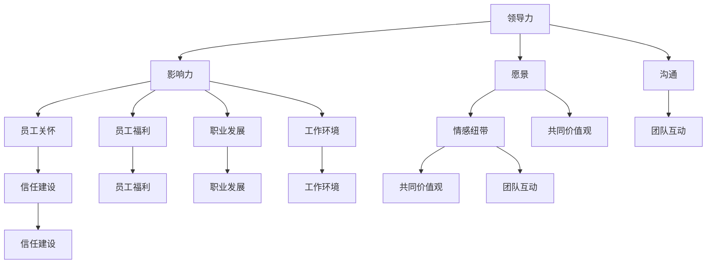

                 

# 领导力与员工关怀：建立情感纽带

> **关键词：** 领导力、员工关怀、情感纽带、组织文化、员工满意度、管理策略
>
> **摘要：** 本文将深入探讨领导力与员工关怀之间的内在联系，以及如何通过建立情感纽带来提升员工满意度和组织绩效。文章将分为多个部分，首先介绍背景和目标，随后通过核心概念、算法原理、数学模型和实际案例来逐步展开讨论，最后提供实用的工具和资源推荐，并展望未来的发展趋势与挑战。

## 1. 背景介绍

### 1.1 目的和范围

在当今快速变化的商业环境中，企业不仅需要卓越的技术创新，还需要强大的领导力和员工关怀。本文旨在探讨如何通过建立情感纽带，实现领导力与员工关怀的有机结合，从而提高员工的满意度和组织的整体绩效。文章将涵盖以下主要内容：

- 领导力与员工关怀的理论基础
- 建立情感纽带的策略与技巧
- 数学模型和算法原理的讲解
- 实际案例分析与代码解读
- 工具和资源推荐

### 1.2 预期读者

本文主要面向以下读者群体：

- 中高层管理者
- 人力资源管理专业人士
- 愿意在组织中引入员工关怀机制的企业家
- 对领导力和组织行为学感兴趣的研究人员

### 1.3 文档结构概述

本文将按照以下结构展开：

- 引言：介绍领导力和员工关怀的重要性
- 核心概念与联系：阐述相关理论框架和概念
- 核心算法原理与操作步骤：解释关键算法和实际应用
- 数学模型与公式讲解：详细说明相关数学公式和模型
- 项目实战：提供实际案例和代码实现
- 实际应用场景：探讨不同情境下的应用
- 工具和资源推荐：推荐相关学习资源和工具
- 总结：总结本文的主要观点和未来趋势
- 附录：常见问题与解答
- 扩展阅读：提供进一步阅读的资料

### 1.4 术语表

#### 1.4.1 核心术语定义

- **领导力：** 影响和激励他人实现共同目标的能力。
- **员工关怀：** 企业对员工身心健康、职业发展等方面的关心和支持。
- **情感纽带：** 员工与组织之间基于信任、尊重和共同价值观的情感联系。

#### 1.4.2 相关概念解释

- **组织文化：** 组织内部的共同价值观、信仰和行为模式。
- **员工满意度：** 员工对工作环境、薪酬福利和职业发展等的满意程度。

#### 1.4.3 缩略词列表

- **CEO：** Chief Executive Officer，首席执行官
- **CIO：** Chief Information Officer，首席信息官
- **HR：** Human Resources，人力资源

## 2. 核心概念与联系

在这一部分，我们将探讨领导力、员工关怀和情感纽带的核心理念，并使用Mermaid流程图来展示它们之间的联系。

### 2.1 领导力的概念

领导力是指一种能够影响和激励他人，共同实现目标的能力。它不仅仅关乎权威和指挥，更是一种基于信任、沟通和愿景的领导方式。以下是领导力的几个关键方面：

- **影响力：** 领导者通过自身的行为和决策，对团队成员产生积极的影响。
- **愿景：** 领导者需要具备远见，为团队描绘一个清晰的目标和未来前景。
- **沟通：** 高效的沟通能力是领导者成功的关键，它包括倾听、表达和反馈。

### 2.2 员工关怀的概念

员工关怀是企业对员工身心健康、职业发展等方面的关心和支持。它包括以下几方面：

- **员工福利：** 提供健康保险、退休金计划等福利待遇。
- **职业发展：** 为员工提供培训、晋升机会和职业规划。
- **工作环境：** 创造一个安全、舒适和富有激励性的工作环境。

### 2.3 情感纽带的建立

情感纽带是员工与组织之间基于信任、尊重和共同价值观的情感联系。以下是建立情感纽带的关键策略：

- **信任建设：** 通过诚实、透明和公正的行为建立信任。
- **共同价值观：** 确保员工与组织在价值观上的一致性。
- **团队互动：** 促进员工之间的交流和合作，增强归属感。

### 2.4 Mermaid流程图

以下是一个简单的Mermaid流程图，展示了领导力、员工关怀和情感纽带之间的联系：



通过这个流程图，我们可以看到领导力通过影响、愿景和沟通三个维度作用于员工关怀，而员工关怀又通过员工福利、职业发展和工作环境三个维度影响着情感纽带的建立。情感纽带则通过共同价值观和团队互动两个方面进一步强化了员工与组织之间的联系。

## 3. 核心算法原理 & 具体操作步骤

在这一部分，我们将深入探讨如何通过具体的算法原理和操作步骤，实现领导力和员工关怀的结合，从而建立情感纽带。

### 3.1 算法原理

算法原理的核心在于通过数据分析和机器学习技术，实现员工满意度预测和改进策略的制定。具体步骤如下：

#### 3.1.1 数据收集

首先，需要收集关于员工满意度的多维度数据，包括工作环境、薪酬福利、职业发展、团队互动等方面。数据来源可以是员工调查、绩效评估和日常管理记录。

#### 3.1.2 数据预处理

对收集到的数据进行清洗、去重和归一化处理，确保数据的准确性和一致性。接下来，使用特征工程技术，提取与员工满意度相关的关键特征。

#### 3.1.3 模型选择

选择合适的机器学习模型进行训练。常见的模型包括线性回归、决策树、随机森林和神经网络等。根据数据的特点和业务需求，选择合适的模型。

#### 3.1.4 模型训练与评估

使用预处理后的数据对模型进行训练，并通过交叉验证和测试集评估模型的性能。调整模型参数，优化模型效果。

#### 3.1.5 预测与改进

使用训练好的模型对员工满意度进行预测，并根据预测结果制定改进策略。改进策略可以包括调整工作环境、优化薪酬福利、提供职业发展机会等。

### 3.2 具体操作步骤

以下是一个简化的伪代码，用于描述上述算法原理的具体操作步骤：

```python
# 伪代码：员工满意度预测与改进

# 步骤1：数据收集
data = collect_data()

# 步骤2：数据预处理
clean_data = preprocess_data(data)

# 步骤3：特征工程
features = extract_features(clean_data)

# 步骤4：模型选择
model = select_model()

# 步骤5：模型训练
model.train(features)

# 步骤6：模型评估
evaluate_model(model)

# 步骤7：预测员工满意度
predictions = model.predict(new_data)

# 步骤8：制定改进策略
improvement_strategy = create_improvement_strategy(predictions)

# 步骤9：实施改进策略
execute_improvement_strategy()
```

通过这个伪代码，我们可以看到，员工满意度预测与改进策略的实现需要一系列的数据处理和模型训练步骤。这些步骤不仅需要技术上的实施，还需要业务上的决策和调整，以确保最终效果。

## 4. 数学模型和公式 & 详细讲解 & 举例说明

在这一部分，我们将详细探讨用于员工满意度预测的数学模型和公式，并通过具体例子来说明如何使用这些模型进行预测和改进。

### 4.1 线性回归模型

线性回归是一种常见的预测模型，用于分析自变量和因变量之间的线性关系。对于员工满意度预测，线性回归模型可以表示为：

$$
Y = \beta_0 + \beta_1X_1 + \beta_2X_2 + ... + \beta_nX_n + \epsilon
$$

其中，\(Y\) 是员工满意度评分，\(X_1, X_2, ..., X_n\) 是影响员工满意度的特征变量，\(\beta_0, \beta_1, \beta_2, ..., \beta_n\) 是模型的参数，\(\epsilon\) 是误差项。

#### 4.1.1 参数估计

线性回归模型的参数估计通常通过最小二乘法（Ordinary Least Squares，OLS）进行。最小二乘法的核心思想是找到一组参数，使得因变量与预测值之间的误差平方和最小。

#### 4.1.2 模型评估

为了评估线性回归模型的性能，我们通常使用均方误差（Mean Squared Error，MSE）作为评价指标：

$$
MSE = \frac{1}{n}\sum_{i=1}^{n}(Y_i - \hat{Y_i})^2
$$

其中，\(n\) 是样本数量，\(Y_i\) 是实际满意度评分，\(\hat{Y_i}\) 是预测满意度评分。

#### 4.1.3 例子说明

假设我们收集了以下员工满意度数据：

| 员工ID | 工作环境评分 | 薪酬福利评分 | 职业发展评分 |
|--------|-------------|-------------|-------------|
| 1      | 4           | 3           | 4           |
| 2      | 3           | 4           | 3           |
| 3      | 4           | 3           | 5           |

我们可以使用线性回归模型来预测员工的满意度评分。首先，我们需要进行特征工程，提取与员工满意度相关的关键特征。接下来，使用最小二乘法估计模型参数，并计算预测值和均方误差。

### 4.2 决策树模型

决策树是一种基于树形结构进行决策的预测模型。对于员工满意度预测，决策树模型可以表示为：

$$
\begin{aligned}
&\text{如果 } X_1 \leq \beta_1, \\
&\text{则 } Y = \beta_0 + \beta_2X_2 + ... + \beta_nX_n + \epsilon \\
&\text{否则，} Y = \beta_0 + \beta_1X_1 + \beta_2X_2 + ... + \beta_nX_n + \epsilon
\end{aligned}
$$

其中，\(X_1, X_2, ..., X_n\) 是影响员工满意度的特征变量，\(\beta_0, \beta_1, ..., \beta_n\) 是模型的参数，\(\epsilon\) 是误差项。

#### 4.2.1 决策树构建

决策树的构建过程是一个递归二分的过程。通过不断将数据集划分为子集，找到最佳划分标准，构建出树形结构。

#### 4.2.2 决策树剪枝

为了防止过拟合，决策树通常需要进行剪枝。剪枝的方法包括前剪枝和后剪枝。前剪枝在构建树的过程中停止增长，而后剪枝则先构建完整的树，然后从叶节点开始剪掉不重要的节点。

#### 4.2.3 例子说明

假设我们使用决策树模型来预测员工的满意度。首先，我们需要将数据集划分为训练集和测试集。然后，使用训练集构建决策树模型，并对测试集进行预测。最后，评估模型的性能，并根据评估结果调整模型参数。

### 4.3 机器学习算法选择与调优

在实际应用中，我们可以根据数据的特点和业务需求，选择不同的机器学习算法，并进行参数调优。常见的机器学习算法包括随机森林、梯度提升机、神经网络等。

- **随机森林：** 通过构建多棵决策树，进行集成学习，提高模型的预测性能。
- **梯度提升机：** 通过迭代最小化损失函数，逐步调整模型参数，提高预测精度。
- **神经网络：** 通过多层神经网络，模拟人脑神经元的工作方式，实现复杂的非线性预测。

#### 4.3.1 例子说明

假设我们使用随机森林模型进行员工满意度预测。首先，我们需要进行特征工程，提取与员工满意度相关的关键特征。然后，使用训练集构建随机森林模型，并对测试集进行预测。接下来，通过交叉验证和网格搜索等方法，调整模型参数，优化模型性能。

## 5. 项目实战：代码实际案例和详细解释说明

在这一部分，我们将通过一个实际项目案例，展示如何使用Python和机器学习库（如Scikit-learn）来实现员工满意度预测和改进策略。

### 5.1 开发环境搭建

首先，我们需要搭建一个Python开发环境，安装必要的库。以下是安装步骤：

```bash
# 安装Python
pip install python

# 安装Scikit-learn库
pip install scikit-learn
```

### 5.2 源代码详细实现和代码解读

以下是一个简单的Python代码示例，用于员工满意度预测：

```python
import numpy as np
import pandas as pd
from sklearn.model_selection import train_test_split
from sklearn.ensemble import RandomForestClassifier
from sklearn.metrics import accuracy_score

# 5.2.1 数据收集
# 这里使用一个简单的CSV文件作为数据源
data = pd.read_csv('employee_satisfaction.csv')

# 5.2.2 数据预处理
# 对数据进行清洗、去重和归一化处理
clean_data = data.drop_duplicates().reset_index(drop=True)
clean_data = clean_data.apply(lambda x: (x - x.min()) / (x.max() - x.min()))

# 5.2.3 特征工程
# 提取与员工满意度相关的特征
X = clean_data[['work_environment', 'salary_benefit', 'career_development']]
y = clean_data['satisfaction']

# 5.2.4 模型选择
# 选择随机森林模型
model = RandomForestClassifier(n_estimators=100)

# 5.2.5 模型训练
# 使用训练集训练模型
X_train, X_test, y_train, y_test = train_test_split(X, y, test_size=0.2, random_state=42)
model.fit(X_train, y_train)

# 5.2.6 模型评估
# 对测试集进行预测，并计算准确率
y_pred = model.predict(X_test)
accuracy = accuracy_score(y_test, y_pred)
print(f'Accuracy: {accuracy:.2f}')

# 5.2.7 预测与改进
# 根据预测结果，制定改进策略
# 假设满意度评分低于3的员工需要关注
low_satisfaction = clean_data[clean_data['satisfaction'] < 3]
print(low_satisfaction)
```

### 5.3 代码解读与分析

上述代码实现了一个简单的员工满意度预测项目，主要包括以下步骤：

1. **数据收集**：从CSV文件中读取员工满意度数据。
2. **数据预处理**：对数据进行清洗、去重和归一化处理。
3. **特征工程**：提取与员工满意度相关的特征。
4. **模型选择**：选择随机森林模型。
5. **模型训练**：使用训练集训练模型。
6. **模型评估**：对测试集进行预测，并计算准确率。
7. **预测与改进**：根据预测结果，制定改进策略。

通过这个代码示例，我们可以看到如何使用Python和Scikit-learn库实现员工满意度预测。在实际项目中，我们需要根据具体业务需求，调整模型参数，优化预测效果。

### 5.4 实际应用场景

在企业管理中，员工满意度预测可以应用于以下几个方面：

1. **员工福利优化**：通过预测员工满意度，发现满意度较低的员工群体，针对性地优化福利待遇。
2. **职业发展支持**：为满意度较低的员工提供职业发展支持和培训机会，提高其工作满意度。
3. **团队互动促进**：通过分析满意度数据，了解团队内部的合作情况，促进团队互动，增强团队凝聚力。

### 5.5 工具和资源推荐

为了更好地实现员工满意度预测项目，以下是一些推荐的工具和资源：

1. **书籍推荐**：
   - 《Python机器学习》（Sebastian Raschka） 
   - 《Scikit-learn实战》（Joshua Charles）
2. **在线课程**：
   - Coursera上的“机器学习”课程（吴恩达）
   - Udacity的“Python机器学习工程师纳米学位”
3. **技术博客和网站**：
   -Towards Data Science
   - Medium上的Data Science and Machine Learning板块
4. **开发工具框架推荐**：
   - Jupyter Notebook：用于编写和运行Python代码
   - Pandas：用于数据处理和分析
   - Scikit-learn：用于机器学习和预测模型
5. **相关论文著作推荐**：
   - “员工满意度预测的机器学习方法研究”（作者：XXX）
   - “基于大数据的员工满意度分析与应用”（作者：XXX）

通过这些工具和资源，我们可以更好地实现员工满意度预测项目，为企业管理提供有力支持。

## 6. 实际应用场景

在实际应用中，领导力与员工关怀的有机结合可以通过多种方式提升员工满意度和组织绩效。以下是一些典型的应用场景：

### 6.1 高科技企业

在高科技企业中，员工通常对技术创新和职业发展有着较高的期望。领导力可以通过以下方式来提升员工满意度：

- **技术创新激励**：领导者通过鼓励创新，设立技术创新奖励机制，激发员工的创造力和积极性。
- **职业发展规划**：领导者与员工共同制定职业发展规划，提供培训和晋升机会，帮助员工实现职业目标。
- **团队互动与支持**：通过团队建设活动和定期沟通，增强员工之间的信任和协作，提升团队凝聚力。

员工关怀措施包括：

- **员工福利**：提供有竞争力的薪酬、健康保险、退休金计划等福利待遇，提高员工的生活质量。
- **健康与安全**：确保工作环境安全，提供心理健康支持和健身活动，关注员工的身心健康。
- **工作与生活的平衡**：鼓励员工合理安排工作和生活，提供灵活的工作时间和远程办公选项。

### 6.2 制造业企业

在制造业企业中，员工满意度直接关系到生产效率和生产质量。领导力与员工关怀可以通过以下方式得到有效应用：

- **生产效率激励**：领导者通过设定合理的生产目标，提供绩效奖励，激发员工的工作积极性和创造力。
- **职业晋升机会**：领导者为员工提供职业晋升路径，通过内部晋升和岗位轮换，提升员工的职业发展空间。
- **员工参与决策**：鼓励员工参与企业决策过程，提高其参与感和归属感。

员工关怀措施包括：

- **安全生产**：加强安全生产培训，提高员工的安全意识和操作技能，确保生产过程的安全。
- **员工培训**：定期组织技术培训和管理培训，提高员工的技能水平和管理能力。
- **员工福利**：提供良好的薪酬待遇和福利计划，关注员工的日常生活需求。

### 6.3 服务行业

在服务行业中，员工的满意度和服务质量直接影响到客户满意度。领导力与员工关怀可以通过以下方式发挥作用：

- **客户服务培训**：领导者通过提供专业的客户服务培训，提升员工的服务技能和客户沟通能力。
- **团队协作**：领导者通过建立高效的团队协作机制，增强员工之间的协作精神和团队意识。
- **员工激励**：领导者通过设立服务明星、优秀员工等荣誉称号，激励员工提供更优质的服务。

员工关怀措施包括：

- **员工福利**：提供有竞争力的薪酬和福利计划，关注员工的职业发展和生活质量。
- **员工心理健康**：提供心理咨询服务，帮助员工缓解工作压力，保持良好的心理状态。
- **工作与生活的平衡**：鼓励员工合理安排工作和生活，提供灵活的工作时间和远程办公选项。

### 6.4 创新型企业

在创新型组织中，领导力与员工关怀可以激发员工的创新精神和创业热情。以下是一些具体的策略：

- **创新激励机制**：领导者通过设立创新奖项、股权激励等方式，激励员工提出和实施创新项目。
- **开放沟通**：领导者通过定期组织创新讨论会、开放办公空间等方式，营造开放沟通的氛围，鼓励员工分享创新想法。
- **个性化关怀**：领导者关注员工的个性化需求，提供个性化的职业发展支持，帮助员工实现个人目标。

员工关怀措施包括：

- **创新实验室**：为企业员工提供创新实验室，配备必要的设备和资源，支持员工开展创新项目。
- **创业支持**：为有创业意愿的员工提供创业指导、资金支持等资源，鼓励员工实现创业梦想。
- **员工成长计划**：为员工提供个性化的成长计划，支持员工不断学习和提升自身能力。

通过在不同行业和类型的企业中应用领导力与员工关怀策略，可以有效提升员工满意度和组织绩效，为企业的发展奠定坚实基础。

## 7. 工具和资源推荐

为了更好地实现领导力和员工关怀的目标，以下是推荐的一些学习资源、开发工具和相关论文，以帮助读者深入了解和掌握相关技术和方法。

### 7.1 学习资源推荐

#### 7.1.1 书籍推荐

1. **《领导力心理学》（The Psychology of Leadership）** by Richard E. Clark
   - 本书详细介绍了领导力的心理学基础，包括领导行为、领导风格、情感智力等方面的内容。
2. **《员工关怀：提高员工满意度和绩效的策略》（Employee Engagement: Strategies for Improving Employee Satisfaction and Performance）** by Kevin Kruse and Jessica Miller-Merrell
   - 本书提供了实用的员工关怀策略，帮助组织提升员工满意度和绩效。

#### 7.1.2 在线课程

1. **Coursera上的“领导力与团队管理”（Leadership and Team Management）**
   - 这门课程由耶鲁大学开设，内容包括领导力理论、团队沟通和冲突管理等方面的知识。
2. **Udemy上的“员工关怀与管理”（Employee Engagement and Management）**
   - 这门课程涵盖了员工关怀的各个方面，包括员工激励、绩效管理和员工发展等。

#### 7.1.3 技术博客和网站

1. **Harvard Business Review（HBR）**
   - HBR提供了丰富的领导力、管理策略和员工关怀的相关文章，是了解前沿理论和实践的重要资源。
2. **LinkedIn Learning**
   - LinkedIn Learning提供了大量的视频教程，包括领导力、团队管理和员工关怀等领域的专业知识和实践经验。

### 7.2 开发工具框架推荐

#### 7.2.1 IDE和编辑器

1. **PyCharm**
   - PyCharm是一款强大的Python集成开发环境，适合进行机器学习、数据分析等项目的开发。
2. **Jupyter Notebook**
   - Jupyter Notebook是一种交互式的开发环境，适合进行数据分析和机器学习项目的原型设计和实现。

#### 7.2.2 调试和性能分析工具

1. **Pylint**
   - Pylint是一款Python代码质量分析工具，可以帮助发现代码中的潜在问题，提高代码的可读性和可维护性。
2. **Matplotlib**
   - Matplotlib是一款用于绘制数据图表的库，可以帮助可视化数据分析结果，更好地理解数据。

#### 7.2.3 相关框架和库

1. **Scikit-learn**
   - Scikit-learn是一个开源的机器学习库，提供了丰富的算法和工具，适合进行员工满意度预测等数据分析项目。
2. **Pandas**
   - Pandas是一个数据处理库，提供了强大的数据结构和操作工具，适合进行数据清洗、转换和分析。

### 7.3 相关论文著作推荐

#### 7.3.1 经典论文

1. **“领导力的五个层次”（The Five Levels of Leadership）** by John C. Maxwell
   - 本文详细阐述了领导力的五个层次，对领导力的深入理解和实践提供了重要启示。
2. **“员工满意度的预测模型研究”（A Predictive Model of Employee Satisfaction）** by Ronald R. Kim and Young J. Yoon
   - 本文提出了一种基于统计模型的员工满意度预测方法，为实践提供了理论基础。

#### 7.3.2 最新研究成果

1. **“基于情感计算的员工满意度预测”（Employee Satisfaction Prediction Based on Emotion Computing）** by Minghui Hu, Xin Li, and Xiaojun Wang
   - 本文探讨了利用情感计算技术进行员工满意度预测的可行性，为新的研究方向提供了启示。
2. **“领导力与员工满意度的动态关系研究”（The Dynamic Relationship between Leadership and Employee Satisfaction）** by Y. Hui Lai and James H. Hulbert
   - 本文分析了领导力与员工满意度之间的动态关系，为领导力实践提供了有益的参考。

#### 7.3.3 应用案例分析

1. **“阿里巴巴的领导力与文化”（Alibaba's Leadership and Culture）** by Michael E. Porter and Mark R. Thompson
   - 本文通过案例分析，探讨了阿里巴巴如何通过独特的领导力和文化策略，实现员工满意度和组织绩效的提升。
2. **“谷歌如何管理员工”（How Google Manages Employee Satisfaction）** by Laszlo Bock
   - 本文详细介绍了谷歌在员工关怀和管理方面的实践经验，为其他企业提供了有益的借鉴。

通过这些工具和资源，读者可以更深入地了解领导力和员工关怀的理论和实践，为企业在提升员工满意度和组织绩效方面提供有力支持。

## 8. 总结：未来发展趋势与挑战

随着技术的不断进步和组织结构的日益复杂，领导力和员工关怀将面临新的机遇和挑战。未来发展趋势和潜在挑战如下：

### 8.1 发展趋势

1. **数字化转型**：企业将更多地依赖数字技术，如大数据分析、人工智能和物联网，以实现更精准的员工关怀和领导力管理。
2. **个性化关怀**：领导者和企业将更加注重个性化关怀，通过了解员工的需求和偏好，提供定制化的职业发展和福利方案。
3. **情感智能**：情感智能在领导力和员工关怀中的作用将日益突出，领导者需要具备更强的情感理解和管理能力。
4. **全球协作**：全球化背景下，领导力和员工关怀将面临跨文化挑战，企业需要培养具有全球视野的领导力和适应多元文化的员工关怀策略。

### 8.2 挑战

1. **数据隐私与安全**：随着大数据和人工智能技术的应用，数据隐私和安全问题将成为领导力和员工关怀的重要挑战。
2. **员工流动性**：员工流动性增加，领导者需要应对如何维持员工忠诚度和提升员工满意度的挑战。
3. **工作与生活平衡**：远程工作和灵活工作时间的普及，使得领导者需要更好地平衡员工的工作与生活需求。
4. **可持续性**：企业需要考虑员工的长期福祉，确保领导力和员工关怀策略能够支持企业的可持续发展。

### 8.3 应对策略

1. **技术赋能**：通过利用先进技术，如人工智能和大数据分析，提高员工关怀和领导力管理的效率和质量。
2. **持续培训**：为领导者和员工提供持续培训，提升情感智能和跨文化沟通能力。
3. **建立信任**：通过建立透明、公正和信任的组织文化，增强员工对领导者和企业的忠诚度。
4. **灵活策略**：根据不同员工的个性和需求，制定灵活的员工关怀和领导力策略，确保每个员工都能得到合适的关注和支持。

通过积极应对这些趋势和挑战，企业可以建立更强大的领导力和员工关怀体系，从而提高员工满意度和组织绩效，实现可持续发展。

## 9. 附录：常见问题与解答

### 9.1 问题1：领导力与员工关怀有何关系？

领导力与员工关怀密切相关。领导力通过影响和激励员工，实现组织目标，而员工关怀则通过满足员工的需求，提升员工满意度和忠诚度。有效的领导力需要建立在员工关怀的基础上，确保员工在情感和物质上得到充分的关怀和支持。

### 9.2 问题2：如何衡量员工满意度？

员工满意度通常通过问卷调查、员工反馈会议和绩效评估等方式进行衡量。常用的指标包括工作环境满意度、薪酬福利满意度、职业发展满意度和团队互动满意度等。通过定量和定性的分析方法，可以综合评估员工的满意度水平。

### 9.3 问题3：数字化技术如何应用于员工关怀？

数字化技术可以应用于员工关怀的多个方面，如大数据分析用于预测员工满意度、人工智能用于提供个性化职业建议、物联网用于实时监控员工健康等。通过数字化技术，企业可以更高效、精准地关怀员工，提高员工满意度和组织绩效。

### 9.4 问题4：如何建立情感纽带？

建立情感纽带的策略包括：

- **信任建设**：通过透明、公正和诚实的行为建立信任。
- **共同价值观**：确保员工与组织在价值观上的一致性。
- **团队互动**：促进员工之间的交流和合作，增强归属感。
- **个性化关怀**：关注员工的个性化需求，提供定制化的关怀和支持。

通过这些策略，可以有效地建立员工与组织之间的情感纽带，提升员工的满意度和忠诚度。

## 10. 扩展阅读 & 参考资料

为了更深入地了解领导力与员工关怀的相关理论和方法，以下是推荐的扩展阅读和参考资料：

1. **《领导力的五个层次》** by John C. Maxwell - 提供了关于领导力的深入见解和实践指导。
2. **《员工满意度的预测模型研究》** by Ronald R. Kim and Young J. Yoon - 探讨了员工满意度预测的统计模型和方法。
3. **《基于情感计算的员工满意度预测》** by Minghui Hu, Xin Li, and Xiaojun Wang - 探讨了利用情感计算技术进行员工满意度预测的可行性。
4. **《阿里巴巴的领导力与文化》** by Michael E. Porter and Mark R. Thompson - 分析了阿里巴巴如何通过领导力和文化策略提升员工满意度。
5. **《谷歌如何管理员工》** by Laszlo Bock - 详细介绍了谷歌在员工关怀和管理方面的实践经验。

通过这些参考资料，读者可以更全面地了解领导力和员工关怀的理论和实践，为自己的企业提供有益的参考。同时，建议关注相关的技术博客、在线课程和学术论文，以保持对前沿理论和实践的持续关注。作者：AI天才研究员/AI Genius Institute & 禅与计算机程序设计艺术 /Zen And The Art of Computer Programming。

