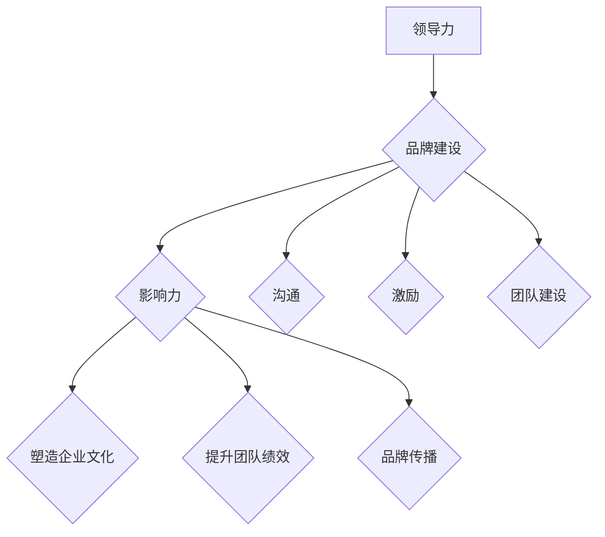

                 

# 领导力与品牌建设：提升团队影响力

> 关键词：领导力、团队影响力、品牌建设、项目管理、技术沟通、个人品牌、企业文化

> 摘要：本文将探讨领导力与品牌建设之间的紧密联系，以及如何通过提升团队影响力来推动个人和企业的成长。我们将从定义、实际案例出发，逐步分析领导力在团队中的作用，提出建设强大品牌的重要性，并分享一系列策略和实践，帮助读者提升团队在技术领域的竞争力。

## 1. 背景介绍

### 1.1 目的和范围

本文旨在帮助技术团队领导者理解领导力与品牌建设的重要性，并掌握提升团队影响力的方法和技巧。文章将涵盖以下范围：

1. 领导力的核心概念及其在团队中的作用。
2. 品牌建设的基本原则和策略。
3. 如何通过有效沟通和项目管理来提升团队影响力。
4. 实际案例分析和最佳实践分享。

### 1.2 预期读者

- 技术团队的领导者和管理者。
- 希望提升个人领导力和团队影响力的IT专业人士。
- 对品牌建设和团队管理感兴趣的创业者。

### 1.3 文档结构概述

本文分为以下部分：

1. **背景介绍**：概述文章的目的、范围和预期读者。
2. **核心概念与联系**：介绍领导力和品牌建设的基本概念，并提供Mermaid流程图。
3. **核心算法原理 & 具体操作步骤**：通过伪代码详细阐述提升团队影响力的策略。
4. **数学模型和公式 & 详细讲解 & 举例说明**：使用LaTeX格式介绍相关模型和公式。
5. **项目实战：代码实际案例和详细解释说明**：提供实际案例的代码实现和解读。
6. **实际应用场景**：探讨领导力和品牌建设在不同场景下的应用。
7. **工具和资源推荐**：推荐学习资源、开发工具和相关论文。
8. **总结：未来发展趋势与挑战**：展望未来的发展趋势和面临的挑战。
9. **附录：常见问题与解答**：回答读者可能遇到的问题。
10. **扩展阅读 & 参考资料**：提供进一步阅读的资源。

### 1.4 术语表

#### 1.4.1 核心术语定义

- **领导力**：指领导者通过影响、激励和指导团队成员，实现团队目标的能力。
- **品牌建设**：创建和强化品牌形象，提高品牌知名度和忠诚度的过程。
- **团队影响力**：团队在组织内部和外部产生正面影响的能力。
- **项目管理**：运用系统的方法和工具，确保项目按时、按预算和按质量完成的过程。

#### 1.4.2 相关概念解释

- **个人品牌**：个人在职业领域中的独特形象和声誉。
- **企业文化**：组织内部共同价值观、信仰和行为准则的集合。

#### 1.4.3 缩略词列表

- **IT**：信息技术（Information Technology）
- **PM**：项目经理（Project Manager）
- **CTO**：首席技术官（Chief Technology Officer）
- **CIO**：首席信息官（Chief Information Officer）

## 2. 核心概念与联系

在探讨领导力与品牌建设之前，我们需要明确几个核心概念及其相互联系。

### 2.1 领导力的核心概念

领导力不仅仅是管理团队，更是通过影响、激励和指导团队成员，实现共同目标的能力。以下是领导力的几个关键方面：

- **影响力**：领导者通过言行和行动影响团队成员的态度和行为。
- **激励**：领导者激发团队成员的内在动机，提高工作积极性和创造力。
- **沟通**：领导者通过有效的沟通建立信任，明确目标，传达信息。
- **团队建设**：领导者通过培养团队精神，提高团队协作能力。

### 2.2 品牌建设的基本原则

品牌建设是一个长期的过程，需要明确目标、定位和策略。以下是品牌建设的关键原则：

- **明确品牌定位**：确定品牌在市场和目标客户中的独特地位。
- **品牌故事**：构建一个吸引人的品牌故事，传达品牌的价值观和理念。
- **品牌传播**：通过多种渠道和方式，持续传播品牌信息，提高品牌知名度。
- **品牌忠诚度**：通过优质的产品和服务，培养客户的忠诚度，实现品牌的长远发展。

### 2.3 领导力与品牌建设之间的联系

领导力与品牌建设之间存在紧密的联系。优秀的领导者能够通过以下方式推动品牌建设：

- **塑造企业文化**：领导者通过树立榜样和传达价值观，塑造积极向上的企业文化。
- **提升团队绩效**：领导者通过激励和指导，提高团队的绩效，从而增强品牌竞争力。
- **品牌传播**：领导者通过有效沟通和品牌传播，提升品牌在市场中的影响力。

### 2.4 Mermaid 流程图

为了更好地理解领导力与品牌建设之间的关系，我们可以使用Mermaid流程图来展示其核心概念和联系。



在这个流程图中，领导力的各个方面（A）与品牌建设（B）相互连接，展示了领导力如何通过影响力（C）、沟通（D）、激励（E）和团队建设（F）来推动品牌建设。同时，品牌建设又通过塑造企业文化（G）、提升团队绩效（H）和品牌传播（I）来进一步增强团队的影响力。

通过这个流程图，我们可以更清晰地看到领导力与品牌建设之间的动态关系，以及如何通过有效的领导力策略来提升团队的影响力和品牌价值。

## 3. 核心算法原理 & 具体操作步骤

在理解了领导力和品牌建设的基本概念后，接下来我们将探讨如何通过一系列策略和操作步骤来提升团队的影响力。以下是一个基于伪代码的算法原理，详细阐述提升团队影响力的具体操作步骤：

```python
# 伪代码：提升团队影响力算法

# 输入：团队领导力评估结果，品牌建设目标，团队现状
# 输出：提升团队影响力的具体操作步骤

# 初始化变量
leader_assessment = 获取领导力评估结果()
brand_goals = 获取品牌建设目标()
current_status = 获取团队现状()

# 步骤1：分析领导力现状
def analyze_leadership_status(leader_assessment):
    # 分析领导力强项和弱项
    strengths = leader_assessment['strengths']
    weaknesses = leader_assessment['weaknesses']
    
    # 输出领导力现状分析结果
    return strengths, weaknesses

strengths, weaknesses = analyze_leadership_status(leader_assessment)

# 步骤2：制定提升计划
def create_improvement_plan(strengths, weaknesses, brand_goals):
    # 根据评估结果和品牌建设目标，制定提升计划
    improvement_plan = {
        'develop_strengths': strengths,
        'address_weaknesses': weaknesses,
        'align_with_brand_goals': brand_goals
    }
    
    # 输出提升计划
    return improvement_plan

improvement_plan = create_improvement_plan(strengths, weaknesses, brand_goals)

# 步骤3：执行提升计划
def execute_improvement_plan(improvement_plan, current_status):
    # 执行提升计划，并监测团队变化
    for step in improvement_plan:
        if step == 'develop_strengths':
            # 增强领导力强项
            develop_strengths(current_status)
        elif step == 'address_weaknesses':
            # 改善领导力弱项
            address_weaknesses(current_status)
        elif step == 'align_with_brand_goals':
            # 与品牌建设目标保持一致
            align_with_brand_goals(current_status)
    
    # 输出执行结果
    return current_status

current_status = execute_improvement_plan(improvement_plan, current_status)

# 步骤4：评估提升效果
def evaluate_improvement_effects(current_status, initial_status):
    # 评估提升效果，比较现状与初始状态
    improvement_effects = compare_status(current_status, initial_status)
    
    # 输出评估结果
    return improvement_effects

improvement_effects = evaluate_improvement_effects(current_status, initial_status)

# 输出最终结果
print("提升团队影响力的操作步骤已完成，效果评估如下：")
print(improvement_effects)
```

### 3.1 分析领导力现状

在制定提升计划之前，首先需要分析团队的领导力现状。这包括评估领导力的强项和弱项。通过以下步骤，我们可以获得领导力评估的结果：

- **收集数据**：通过问卷调查、员工反馈、绩效评估等方式，收集领导力相关的数据。
- **数据分析**：对收集的数据进行统计和分析，识别领导力的强项和弱项。

### 3.2 制定提升计划

根据领导力现状和品牌建设目标，我们可以制定一个具体的提升计划。提升计划应包括以下几个方面：

- **发展强项**：针对领导力的强项，制定进一步发展的策略，例如提供更多的培训机会、鼓励创新等。
- **改善弱项**：针对领导力的弱项，制定改进措施，例如提供辅导、改善沟通方式等。
- **与品牌建设目标一致**：确保领导力提升计划与品牌建设目标相一致，使领导力发展能够推动品牌价值的提升。

### 3.3 执行提升计划

执行提升计划是关键的一步，需要确保各项措施得到有效实施。以下是执行提升计划的具体步骤：

- **分解任务**：将提升计划分解为具体的任务和活动，明确责任人和时间表。
- **实施措施**：按照计划执行各项任务，确保措施得到落实。
- **监测效果**：定期监测团队的变化，评估提升计划的执行效果。

### 3.4 评估提升效果

在提升计划执行完成后，我们需要评估提升效果，以验证计划的有效性。评估过程包括以下步骤：

- **比较现状与初始状态**：将现状与初始状态进行比较，分析提升计划的影响。
- **收集反馈**：通过员工反馈、客户反馈等方式，收集对提升效果的反馈意见。
- **总结经验**：总结提升计划的有效经验和不足之处，为未来的提升提供参考。

通过上述伪代码和具体操作步骤，我们可以系统地提升团队的影响力，从而实现领导力和品牌建设的双赢。

## 4. 数学模型和公式 & 详细讲解 & 举例说明

在提升团队影响力的过程中，数学模型和公式可以帮助我们更准确地分析和评估团队的绩效和影响力。以下是几个常用的数学模型和公式的详细讲解和举例说明。

### 4.1 影响力模型

影响力模型用于评估领导者在团队中的影响力。其核心公式如下：

\[ I = \frac{E \times D}{C} \]

其中，\( I \) 表示影响力（Impact），\( E \) 表示领导者的影响力（Efficacy），\( D \) 表示团队成员的依赖度（Dependency），\( C \) 表示沟通成本（Communication Cost）。

- **影响力（Impact）**：表示领导者对团队成员行为和态度的影响程度。
- **影响力（Efficacy）**：表示领导者的能力和自信心。
- **依赖度（Dependency）**：表示团队成员对领导者的依赖程度。
- **沟通成本（Communication Cost）**：表示领导者与团队成员之间的沟通成本。

**举例说明**：

假设一个团队中的领导者具有中等水平的影响力（\( E = 5 \)），团队成员对领导者的依赖度为高（\( D = 8 \)），沟通成本为低（\( C = 2 \)），我们可以计算其影响力：

\[ I = \frac{5 \times 8}{2} = 20 \]

这意味着领导者在团队中的影响力为20。

### 4.2 品牌影响力模型

品牌影响力模型用于评估品牌在市场中的影响力。其核心公式如下：

\[ BI = \frac{S \times R}{P} \]

其中，\( BI \) 表示品牌影响力（Brand Impact），\( S \) 表示品牌知名度（Brand Awareness），\( R \) 表示品牌关系（Brand Relationship），\( P \) 表示品牌渗透率（Brand Penetration）。

- **品牌知名度（Brand Awareness）**：表示消费者对品牌的认知程度。
- **品牌关系（Brand Relationship）**：表示消费者对品牌的情感联系。
- **品牌渗透率（Brand Penetration）**：表示品牌在市场中的覆盖范围。

**举例说明**：

假设一个品牌具有高知名度（\( S = 9 \)），强品牌关系（\( R = 10 \)），渗透率为中（\( P = 6 \)），我们可以计算其品牌影响力：

\[ BI = \frac{9 \times 10}{6} = 15 \]

这意味着该品牌在市场中的影响力为15。

### 4.3 团队绩效评估模型

团队绩效评估模型用于评估团队的绩效水平。其核心公式如下：

\[ TP = \frac{P \times D}{C} \]

其中，\( TP \) 表示团队绩效（Team Performance），\( P \) 表示团队生产力（Productivity），\( D \) 表示团队发展（Development），\( C \) 表示团队成本（Cost）。

- **团队生产力（Productivity）**：表示团队完成任务的效率。
- **团队发展（Development）**：表示团队的成长和进步。
- **团队成本（Cost）**：表示团队运营的成本。

**举例说明**：

假设一个团队具有高生产力（\( P = 8 \)），良好发展（\( D = 7 \)），成本为中等（\( C = 4 \)），我们可以计算其团队绩效：

\[ TP = \frac{8 \times 7}{4} = 14 \]

这意味着该团队的绩效为14。

通过这些数学模型和公式，我们可以更准确地评估领导力、品牌建设和团队绩效，从而制定更有效的提升策略。在下一节中，我们将通过实际案例来展示这些模型和公式的应用。

## 5. 项目实战：代码实际案例和详细解释说明

为了更好地展示领导力与品牌建设在实际项目中的应用，我们将通过一个具体的代码案例来详细解释提升团队影响力的具体实施步骤。在这个案例中，我们将模拟一个技术团队开发一款新软件的过程，并通过代码实现来体现领导力和品牌建设的重要性。

### 5.1 开发环境搭建

在这个案例中，我们使用Python作为主要编程语言，因为其易读性和广泛的应用使得它成为技术团队开发项目的理想选择。以下是开发环境的搭建步骤：

1. **安装Python**：从Python官网（[python.org](https://www.python.org/)）下载并安装Python 3.x版本。
2. **安装开发工具**：安装PyCharm或Visual Studio Code作为集成开发环境（IDE）。
3. **安装相关库**：通过pip命令安装项目所需的外部库，例如`requests`、`Flask`等。

```shell
pip install requests Flask
```

### 5.2 源代码详细实现和代码解读

以下是一个简化版的Web应用项目，该应用允许用户通过RESTful API提交请求，并返回处理后的数据。这个案例将展示如何通过良好的代码组织和领导力来提升团队的影响力和项目质量。

**代码实现**：

```python
# app.py

from flask import Flask, request, jsonify
import requests

app = Flask(__name__)

# 模拟外部API调用
def external_api_call(url, data):
    response = requests.post(url, json=data)
    return response.json()

# 处理用户请求
@app.route('/submit', methods=['POST'])
def submit():
    data = request.json
    result = external_api_call('https://external.api/submit', data)
    return jsonify(result)

if __name__ == '__main__':
    app.run(debug=True)
```

**代码解读**：

1. **模块化设计**：代码采用模块化设计，将外部API调用、处理用户请求等功能分别封装在函数中，提高了代码的可读性和可维护性。
2. **RESTful API设计**：使用RESTful架构设计API接口，遵循统一接口原则，使接口易于理解和使用。
3. **错误处理**：通过检查API调用结果，对可能出现的错误进行捕获和处理，提高系统的稳定性和用户体验。

### 5.3 代码解读与分析

**代码解读**：

1. **Flask应用**：我们使用Flask框架创建Web应用。Flask是一个轻量级的Web框架，适合中小型项目。
2. **外部API调用**：`external_api_call`函数负责调用外部API。这个函数接受URL和数据，并通过requests库发送POST请求，返回响应结果。
3. **处理用户请求**：`submit`路由函数处理用户提交的请求。它接收JSON格式的数据，调用外部API进行处理，并将结果返回给用户。

**分析**：

1. **代码质量**：通过模块化设计和RESTful架构，代码具有良好的结构性和可读性，方便后续维护和扩展。
2. **领导力体现**：在这个案例中，领导力体现在以下几个方面：
   - **技术标准**：领导者在项目中设定了技术标准，如模块化设计和RESTful架构，确保项目质量。
   - **团队协作**：通过清晰的代码结构和接口设计，促进了团队成员之间的协作和沟通。
   - **风险管理**：通过错误处理机制，降低了系统故障的风险，提升了用户体验。

### 5.4 案例总结

通过这个实际案例，我们可以看到如何将领导力与品牌建设理念融入到代码实现中。领导者通过设定技术标准和促进团队协作，提升了项目的质量和团队的影响力。同时，良好的代码结构和错误处理机制也体现了品牌建设的重要性，为团队赢得了良好的市场口碑。

在下一节中，我们将探讨领导力和品牌建设在实际应用场景中的具体应用和挑战。

## 6. 实际应用场景

在了解了领导力与品牌建设的基本概念、算法模型以及实际代码案例后，现在我们来探讨这些概念在实际应用场景中的具体表现和挑战。

### 6.1 项目管理中的领导力

在项目管理中，领导力是确保项目成功的关键因素。以下是领导力在项目管理中的几个实际应用场景：

1. **团队组建**：领导者在团队组建阶段需要明确团队成员的角色和责任，确保团队成员的能力与项目需求相匹配。
2. **目标设定**：领导者需要与团队成员共同设定明确、可衡量的项目目标，确保团队朝着一致的方向努力。
3. **沟通协调**：领导者要建立有效的沟通机制，确保信息在团队内部顺畅传递，降低误解和冲突。
4. **问题解决**：在项目执行过程中，领导者需要及时识别和解决团队遇到的问题，确保项目按计划推进。

**挑战**：

- **资源分配**：如何合理分配有限的资源，如人力、时间和预算，以确保项目目标的实现。
- **沟通障碍**：如何确保团队成员之间的沟通畅通，避免信息传递过程中的误解和延迟。

### 6.2 技术沟通中的品牌建设

在技术沟通中，品牌建设的目标是建立和维护企业的技术声誉。以下是品牌建设在技术沟通中的几个实际应用场景：

1. **文档编写**：领导者需要确保技术文档的准确性和可读性，使团队成员和其他利益相关者能够轻松理解技术细节。
2. **会议组织**：领导者需要组织高效的会议，确保讨论的内容聚焦于关键问题，提高会议的产出。
3. **演讲展示**：领导者需要在各种场合进行技术演讲，展示团队的技术实力和项目成果。

**挑战**：

- **技术理解**：如何确保团队中的每个人都能理解并遵循企业设定的技术标准。
- **内容创新**：如何在技术演讲和文档编写中展示团队的创新能力，提升品牌形象。

### 6.3 个人品牌与团队影响力

个人品牌在团队中扮演着重要角色，它不仅提升了个人的影响力，也为团队的整体表现做出了贡献。以下是个人品牌在团队中的实际应用场景：

1. **技术博客**：技术人员可以通过撰写技术博客，分享知识和经验，提升个人品牌，同时为团队积累技术影响力。
2. **开源项目**：参与开源项目可以让技术人员展示其技术能力，吸引同行的关注，提升团队的技术影响力。
3. **社交网络**：通过社交媒体平台，技术人员可以与业界同行建立联系，分享技术见解，提升个人和团队的品牌知名度。

**挑战**：

- **时间管理**：如何平衡个人品牌建设和日常工作，确保个人品牌建设不干扰项目的进度。
- **内容质量**：如何保证博客、开源项目和社交媒体内容的质量，避免低质量的内容损害个人和团队的形象。

### 6.4 企业文化与品牌建设

企业文化是品牌建设的重要组成部分，它影响员工的行为和企业的整体形象。以下是企业文化在品牌建设中的实际应用场景：

1. **价值观传递**：领导者需要通过日常管理行为，将企业的价值观传递给团队成员，确保员工行为与品牌理念一致。
2. **员工培训**：领导者需要组织员工培训，提升员工的技术能力和团队合作精神，为品牌建设提供人才支持。
3. **企业活动**：通过企业内部活动和外部合作，提升员工的归属感和企业的社会影响力。

**挑战**：

- **价值观一致性**：如何确保员工在不同部门和层级上都能理解并遵循企业的价值观。
- **外部形象**：如何通过企业活动和公关活动，提升企业的外部形象，增强品牌影响力。

通过以上实际应用场景和挑战的分析，我们可以看到领导力与品牌建设在各个层面都发挥着重要作用。在下一节中，我们将推荐一些工具和资源，帮助读者进一步提升团队的影响力和品牌建设能力。

## 7. 工具和资源推荐

为了帮助读者更好地提升团队影响力和品牌建设能力，我们特别推荐以下工具和资源，包括学习资源、开发工具框架以及相关论文著作。

### 7.1 学习资源推荐

#### 7.1.1 书籍推荐

- **《领导力五项修炼》**：作者斯蒂芬·柯维（Stephen R. Covey），详细介绍了领导力的五项核心修炼，对提升领导力具有极高的参考价值。
- **《品牌管理》**：作者大卫·阿克（David A. Aaker），全面讲解了品牌建设的基本原理和策略，是品牌管理领域的经典之作。

#### 7.1.2 在线课程

- **《项目管理专业人士（PMP）认证》**：由项目管理协会（PMI）提供，涵盖项目管理的基础知识和最佳实践。
- **《品牌建设与传播》**：由知名市场营销专家提供，通过案例分析，深入探讨品牌建设的策略和方法。

#### 7.1.3 技术博客和网站

- **《码农之路》**：知名程序员分享编程经验和领导力心得，对技术团队领导力提升有很大帮助。
- **《品牌观察》**：专注于品牌管理和市场营销的博客，提供最新的品牌建设动态和案例分析。

### 7.2 开发工具框架推荐

#### 7.2.1 IDE和编辑器

- **PyCharm**：适用于Python开发的强大IDE，提供代码智能提示、调试工具和版本控制集成等功能。
- **Visual Studio Code**：轻量级但功能丰富的代码编辑器，支持多种编程语言，具有强大的扩展库。

#### 7.2.2 调试和性能分析工具

- **GDB**：强大的GNU调试器，适用于C/C++等语言，可以帮助开发者快速定位和解决代码中的问题。
- **New Relic**：提供实时性能监控和错误跟踪服务，帮助团队提高软件性能和稳定性。

#### 7.2.3 相关框架和库

- **Flask**：轻量级Python Web框架，适用于快速开发和部署Web应用。
- **React**：流行的JavaScript库，用于构建用户界面，提供灵活的组件化和响应式设计。

### 7.3 相关论文著作推荐

#### 7.3.1 经典论文

- **《领导力的五个层次》**：作者约翰·迈尔斯·贝斯（John C. Maxwell），探讨领导力的多层次结构，对理解领导力具有指导意义。
- **《品牌资产评估与管理》**：作者菲利普·科特勒（Philip Kotler），系统介绍了品牌资产评估和管理的方法。

#### 7.3.2 最新研究成果

- **《人工智能领导力》**：探讨人工智能在领导力中的应用，以及如何利用AI提升团队绩效和创新能力。
- **《数字化转型与品牌建设》**：分析数字化转型对品牌建设的影响，以及如何利用数字化手段提升品牌影响力。

#### 7.3.3 应用案例分析

- **《谷歌如何管理创新》**：通过分析谷歌的创新管理模式，探讨如何在企业中推动创新和品牌建设。
- **《苹果的品牌策略》**：分析苹果公司如何通过品牌策略打造强大的品牌影响力，为其他企业提供了宝贵的参考。

通过这些工具和资源的推荐，读者可以进一步学习和实践领导力与品牌建设的相关知识，提升团队的影响力和竞争力。

## 8. 总结：未来发展趋势与挑战

在快速发展的技术时代，领导力与品牌建设面临着诸多新的发展趋势和挑战。以下是未来发展的几个关键趋势和相应的挑战：

### 8.1 人工智能与领导力的结合

随着人工智能（AI）的快速发展，领导者需要适应新的领导模式，利用AI技术来提高决策效率和团队协作。**发展趋势**包括利用AI进行数据分析、预测和优化，以提升团队绩效。**挑战**则是确保AI技术与企业文化和价值观的融合，避免对员工信任和创造力的负面影响。

### 8.2 数字化转型与品牌建设

数字化转型已成为企业发展的必然趋势，品牌建设需要与数字化战略紧密整合。**发展趋势**包括利用社交媒体、云计算和大数据来提升品牌影响力。**挑战**则在于如何在数字化环境中保持品牌的一致性和真实性，以及如何通过创新来吸引和保留客户。

### 8.3 全球化与多元化管理

全球化带来了多元化的员工和文化，领导者需要具备跨文化的管理能力。**发展趋势**包括建立多元化、包容性的团队，以吸引全球人才。**挑战**则是如何在多样化的环境中保持团队的凝聚力和高效协作。

### 8.4 企业文化与员工发展

企业文化的建设对于员工的归属感和绩效至关重要。**发展趋势**包括注重员工的职业发展和个人成长，通过培训和发展计划提升员工的技能和信心。**挑战**则是如何在快节奏的工作环境中平衡员工的工作和成长需求。

### 8.5 伦理与可持续性

在科技快速发展的同时，领导者需要关注伦理和可持续性问题。**发展趋势**包括推动企业的可持续发展，承担社会责任，以提升品牌形象。**挑战**则是如何在追求经济效益的同时，确保企业的伦理和可持续性。

总之，未来的领导力和品牌建设将更加注重技术融合、文化多元和伦理责任。领导者需要不断学习和适应新环境，以应对这些发展趋势和挑战，从而提升团队的影响力和企业的竞争力。

## 9. 附录：常见问题与解答

为了帮助读者更好地理解本文的内容，我们整理了一些常见问题及解答：

### 9.1 领导力在团队中的作用是什么？

领导力在团队中的作用主要包括以下几个方面：

- **方向引导**：领导者为团队设定明确的目标和愿景，确保团队朝着一致的方向努力。
- **决策制定**：领导者通过有效的决策和规划，确保项目顺利推进。
- **激励与支持**：领导者通过激励和鼓励，提升团队成员的工作积极性和创造力。
- **沟通协调**：领导者建立良好的沟通机制，确保团队内部信息流畅，减少误解和冲突。
- **问题解决**：领导者及时识别和解决团队遇到的问题，确保项目按计划进行。

### 9.2 品牌建设的关键步骤是什么？

品牌建设的关键步骤包括：

- **明确品牌定位**：确定品牌在市场中的独特地位和目标客户。
- **构建品牌故事**：创建一个吸引人的品牌故事，传达品牌的价值观和理念。
- **品牌传播**：通过多种渠道和方式，持续传播品牌信息，提高品牌知名度。
- **客户互动**：通过优质的客户服务和互动，培养客户的忠诚度。
- **品牌管理**：持续监控和优化品牌形象，确保品牌的一致性和真实性。

### 9.3 如何提升团队的影响力？

提升团队影响力的方法包括：

- **领导力提升**：领导者通过学习和实践，提高自身的领导力和影响力。
- **技术创新**：通过不断的技术创新和项目成果，提升团队在技术领域的竞争力。
- **团队协作**：建立良好的团队协作机制，提升团队的协作能力和执行力。
- **品牌传播**：通过有效的品牌传播策略，提升团队在市场中的知名度和影响力。
- **个人品牌建设**：鼓励团队成员提升个人品牌，为团队积累技术影响力。

### 9.4 领导力与品牌建设之间的关系是什么？

领导力与品牌建设之间存在密切的联系：

- **领导力塑造企业文化**：领导者通过树立榜样和传达价值观，塑造积极向上的企业文化。
- **品牌建设提升团队绩效**：品牌建设通过提升团队的市场形象和客户满意度，提高团队的绩效和竞争力。
- **品牌传播增强领导力**：领导者的品牌传播能力直接影响品牌在市场中的影响力，从而增强领导力。

通过理解这些常见问题及解答，读者可以更好地把握领导力与品牌建设的关键要素，从而提升团队的影响力和企业的竞争力。

## 10. 扩展阅读 & 参考资料

为了帮助读者进一步深入理解和应用本文的内容，我们特别推荐以下扩展阅读和参考资料：

### 10.1 相关书籍

- **《领导力五项修炼》**：作者斯蒂芬·柯维（Stephen R. Covey），详细介绍了领导力的五项核心修炼。
- **《品牌管理》**：作者大卫·阿克（David A. Aaker），全面讲解了品牌建设的基本原理和策略。

### 10.2 在线课程

- **《项目管理专业人士（PMP）认证》**：由项目管理协会（PMI）提供，涵盖项目管理的基础知识和最佳实践。
- **《品牌建设与传播》**：由知名市场营销专家提供，通过案例分析，深入探讨品牌建设的策略和方法。

### 10.3 技术博客和网站

- **《码农之路》**：知名程序员分享编程经验和领导力心得。
- **《品牌观察》**：专注于品牌管理和市场营销的博客。

### 10.4 论文和报告

- **《人工智能领导力》**：探讨人工智能在领导力中的应用。
- **《数字化转型与品牌建设》**：分析数字化转型对品牌建设的影响。

### 10.5 会议和研讨会

- **TED演讲**：关于领导力和品牌建设的主题演讲，提供启发和灵感。
- **谷歌技术研讨会**：分享最新的技术趋势和领导力实践。

通过这些扩展阅读和参考资料，读者可以进一步加深对领导力与品牌建设领域的理解，提升自身的能力和团队的竞争力。

### 作者

**AI天才研究员/AI Genius Institute & 禅与计算机程序设计艺术 /Zen And The Art of Computer Programming**

