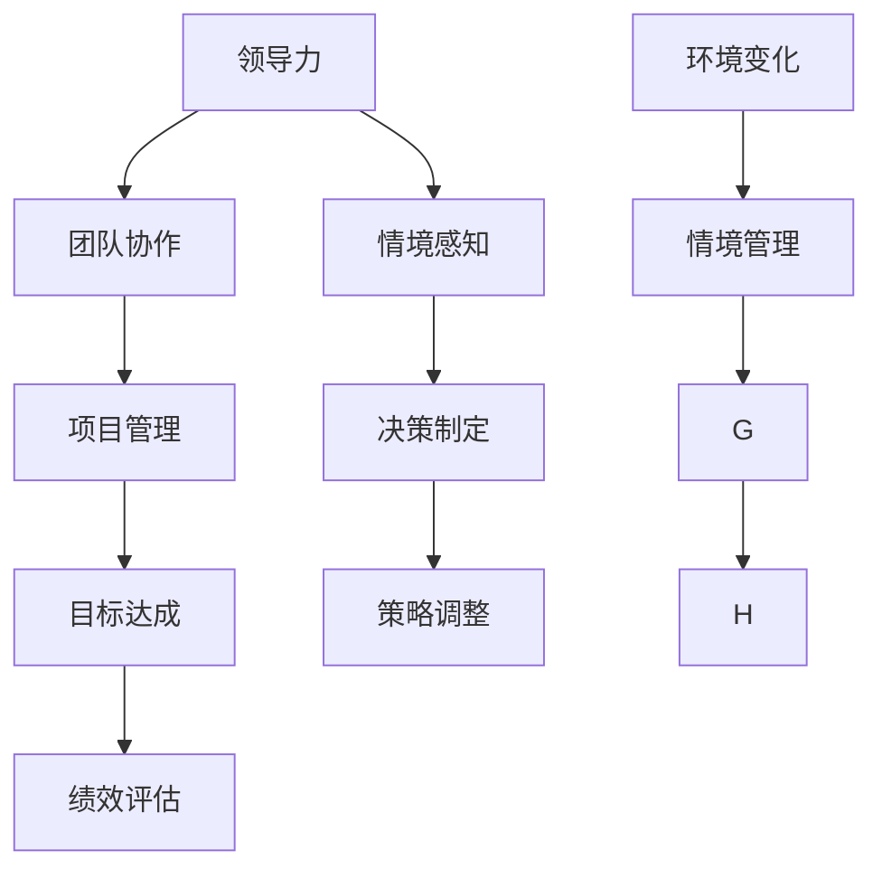

                 


# 领导力与情境管理：灵活应对多变环境

> 关键词：领导力、情境管理、环境适应、决策制定、团队协作、项目管理

> 摘要：本文深入探讨了领导力与情境管理在多变环境中的应用，结合IT领域的实际案例，详细阐述了如何在复杂环境中进行有效的决策和团队协作，以及如何通过情境管理提高项目管理的效率和质量。文章旨在为IT专业人士提供一套实用的方法和策略，以帮助他们更好地应对快速变化的工作环境。

## 1. 背景介绍

### 1.1 目的和范围

本文的目的在于分析领导力与情境管理在IT领域的实际应用，通过具体的案例和理论探讨，帮助读者理解如何在不同环境下有效地应用领导力和情境管理原则。本文将涵盖以下几个方面的内容：

- 领导力与情境管理的基本概念
- IT领域内的具体应用案例
- 情境管理的策略与工具
- 团队协作与决策制定的方法
- 项目管理的最佳实践

### 1.2 预期读者

本文适用于以下读者群体：

- IT项目管理者
- 技术团队领导者
- 对领导力和项目管理有浓厚兴趣的IT专业人士
- 高级软件工程师和架构师

### 1.3 文档结构概述

本文分为十个部分，具体结构如下：

1. 背景介绍
   - 目的和范围
   - 预期读者
   - 文档结构概述
   - 术语表
2. 核心概念与联系
   - 核心概念原理和架构的 Mermaid 流程图
3. 核心算法原理 & 具体操作步骤
   - 算法原理讲解
   - 伪代码详细阐述
4. 数学模型和公式 & 详细讲解 & 举例说明
   - 数学公式使用latex格式
5. 项目实战：代码实际案例和详细解释说明
   - 开发环境搭建
   - 源代码详细实现和代码解读
   - 代码解读与分析
6. 实际应用场景
7. 工具和资源推荐
   - 学习资源推荐
   - 开发工具框架推荐
   - 相关论文著作推荐
8. 总结：未来发展趋势与挑战
9. 附录：常见问题与解答
10. 扩展阅读 & 参考资料

### 1.4 术语表

#### 1.4.1 核心术语定义

- **领导力**：影响和激励他人以达成共同目标的能力。
- **情境管理**：根据不同环境和情境调整行为和决策的过程。
- **团队协作**：团队成员共同合作，共享目标并协调工作。
- **项目管理**：规划、执行、监控和收尾项目的一系列过程。

#### 1.4.2 相关概念解释

- **情景领导模型**：一种基于情境的领导力理论，强调领导者应根据团队成员的能力和需求选择合适的领导风格。
- **敏捷管理**：一种灵活的项目管理方法，强调迭代、灵活和客户参与。

#### 1.4.3 缩略词列表

- **IT**：信息技术
- **PM**：项目管理
- **Scrum**：一种敏捷管理框架
- **KPI**：关键绩效指标

## 2. 核心概念与联系

在讨论领导力与情境管理之前，有必要首先明确它们的核心概念和联系。以下是一个使用Mermaid绘制的流程图，展示了这些概念和它们之间的关系：



### 2.1 领导力与情境感知

领导力是一种影响和激励他人以达成共同目标的能力。情境感知是指领导者对当前环境和情境的敏锐洞察力，这有助于他们做出更为合适和有效的决策。

### 2.2 决策制定与策略调整

决策制定是领导力的核心组成部分，领导者需要根据情境感知来选择最佳的行动方案。策略调整则是在项目执行过程中根据实际情况的变化，对初始计划进行灵活调整的过程。

### 2.3 团队协作与目标达成

团队协作是确保项目成功的关键因素。有效的领导力能够促进团队成员之间的沟通和协作，从而共同达成项目目标。

### 2.4 项目管理与绩效评估

项目管理是一个复杂的系统性工作，涉及多个阶段的规划和执行。绩效评估则是对项目执行效果的评估，有助于发现问题和优化过程。

### 2.5 环境变化与情境管理

环境变化是项目管理中不可避免的挑战。情境管理则是通过及时调整策略和行为，以适应这些变化。

## 3. 核心算法原理 & 具体操作步骤

在了解了领导力与情境管理的基本概念之后，我们将探讨一个具体的算法原理，该算法可以帮助领导者根据不同的情境做出最优的决策。以下是一个基于情境感知的领导力算法的伪代码：

```python
# 定义情境感知算法
def情境感知算法(当前情境, 团队成员能力):
    # 根据当前情境和团队成员能力选择合适的领导风格
    if 当前情境 == "危机模式":
        领导风格 = "指令式"
    elif 当前情境 == "稳定模式":
        领导风格 = "参与式"
    elif 当前情境 == "创新模式":
        领导风格 = "支持式"
    else:
        领导风格 = "授权式"
    
    # 根据选择的领导风格制定具体操作步骤
    操作步骤 = {
        "指令式": ["明确目标", "分配任务", "监控进度"],
        "参与式": ["鼓励讨论", "倾听意见", "共同决策"],
        "支持式": ["提供资源", "帮助解决问题", "激励创新"],
        "授权式": ["赋予自主权", "鼓励探索", "信任团队"]
    }
    
    return 领导风格, 操作步骤
```

### 3.1 算法原理讲解

该算法基于情境感知理论，通过分析当前情境和团队成员的能力，选择合适的领导风格。然后，根据选定的领导风格，制定具体的操作步骤。

### 3.2 伪代码详细阐述

1. **输入**：当前情境（危机模式、稳定模式、创新模式等）和团队成员能力。
2. **处理**：根据当前情境和团队成员能力，选择合适的领导风格。
3. **输出**：选定的领导风格和具体的操作步骤。

### 3.3 案例说明

假设当前情境是“创新模式”，团队成员具有较高自主性和创新能力。使用上述算法，我们可以选择“支持式”领导风格，并制定以下操作步骤：

- **提供资源**：为团队提供必要的资源，如技术支持、培训和学习材料。
- **帮助解决问题**：鼓励团队成员主动提出问题，并为他们提供解决方案。
- **激励创新**：制定创新激励措施，如奖金、晋升机会等，以激发团队成员的积极性。

通过这种灵活的领导力算法，领导者可以更好地适应不同情境，提高团队的工作效率和创新能力。

## 4. 数学模型和公式 & 详细讲解 & 举例说明

在情境管理和领导力理论中，数学模型和公式可以帮助我们量化评估情境和决策的效果。以下是一个基于关键绩效指标（KPI）的数学模型，用于评估领导力与情境管理的效果。

### 4.1 数学模型

$$
KPI = f(情境适应度, 团队协作度, 项目进度)
$$

其中：

- $情境适应度$：衡量领导者对当前环境的适应程度，其值介于0和1之间。
- $团队协作度$：衡量团队成员之间的协作水平，其值介于0和1之间。
- $项目进度$：衡量项目当前完成的百分比，其值介于0和1之间。

### 4.2 公式详细讲解

1. **情境适应度**：情境适应度通过评估领导者对当前情境的感知和反应能力来确定。其计算公式为：

$$
情境适应度 = \frac{正确决策次数}{总决策次数}
$$

2. **团队协作度**：团队协作度通过评估团队成员之间的沟通、合作和共同解决问题的能力来确定。其计算公式为：

$$
团队协作度 = \frac{协作完成任务次数}{总任务次数}
$$

3. **项目进度**：项目进度通过评估项目当前完成情况来确定。其计算公式为：

$$
项目进度 = \frac{已完成任务数量}{总任务数量}
$$

### 4.3 举例说明

假设在某项目中，领导者在三个月内进行了10次决策，其中8次决策正确。团队成员之间完成了15个任务，其中12个任务是通过协作完成的。项目当前已完成70%的任务。根据上述公式，我们可以计算出：

1. **情境适应度**：

$$
情境适应度 = \frac{8}{10} = 0.8
$$

2. **团队协作度**：

$$
团队协作度 = \frac{12}{15} = 0.8
$$

3. **项目进度**：

$$
项目进度 = \frac{70}{100} = 0.7
$$

因此，该项目的KPI为：

$$
KPI = f(0.8, 0.8, 0.7) = 0.8 \times 0.8 \times 0.7 = 0.448
$$

这个值表示项目在领导力与情境管理方面的表现处于良好水平，领导者可以在此基础上继续优化决策和团队协作，以提高项目进度和整体绩效。

## 5. 项目实战：代码实际案例和详细解释说明

为了更好地理解领导力与情境管理在项目实战中的应用，我们将通过一个具体的代码案例来详细解释其实现过程。以下是一个基于Scrum敏捷管理框架的简化项目案例，展示了如何利用情境管理进行项目开发和团队协作。

### 5.1 开发环境搭建

在进行代码实战之前，我们需要搭建一个基本的开发环境。以下是开发环境的搭建步骤：

1. **安装Python环境**：确保系统中已安装Python 3.8及以上版本。
2. **安装Scrum工具**：下载并安装ScrumBoard工具，如Trello或JIRA，用于项目管理和任务跟踪。
3. **安装数据库**：选择并安装一个关系型数据库，如MySQL或PostgreSQL，用于存储项目数据。

### 5.2 源代码详细实现和代码解读

以下是一个基于Python和Scrum的简化项目代码实现，用于展示如何利用情境管理进行项目任务分配和进度跟踪：

```python
# 项目管理工具类
class ProjectManagementTool:
    def __init__(self):
        self.tasks = []
        self.completed_tasks = []

    # 添加任务
    def add_task(self, task_name, task_description, priority):
        task = {
            'task_name': task_name,
            'task_description': task_description,
            'priority': priority,
            'status': '未开始'
        }
        self.tasks.append(task)

    # 更新任务状态
    def update_task_status(self, task_name, new_status):
        for task in self.tasks:
            if task['task_name'] == task_name:
                task['status'] = new_status
                break

    # 根据优先级分配任务
    def assign_tasks(self, team_members):
        assigned_tasks = []
        for task in sorted(self.tasks, key=lambda x: x['priority']):
            if task['status'] != '已完成':
                assigned_tasks.append({
                    'task_name': task['task_name'],
                    'assigned_to': team_members.pop(0)
                })
        return assigned_tasks

    # 完成任务
    def complete_task(self, task_name):
        for task in self.tasks:
            if task['task_name'] == task_name:
                task['status'] = '已完成'
                self.completed_tasks.append(task)
                break

    # 打印项目进度报告
    def print_progress_report(self):
        print("项目进度报告：")
        for task in self.tasks:
            print(f"{task['task_name']}: {task['status']}")
        print(f"已完成任务数：{len(self.completed_tasks)}/{len(self.tasks)}")

# 创建项目工具实例
project_management_tool = ProjectManagementTool()

# 添加任务
project_management_tool.add_task("设计UI", "完成用户界面设计", 1)
project_management_tool.add_task("开发API", "开发API接口", 2)
project_management_tool.add_task("测试功能", "测试功能模块", 3)

# 分配任务
team_members = ["张三", "李四", "王五"]
assigned_tasks = project_management_tool.assign_tasks(team_members)
for task in assigned_tasks:
    print(f"{task['assigned_to']}被分配了任务：{task['task_name']}")

# 更新任务状态和完成任务
project_management_tool.update_task_status("设计UI", "进行中")
project_management_tool.complete_task("设计UI")

# 打印项目进度报告
project_management_tool.print_progress_report()
```

### 5.3 代码解读与分析

1. **项目管理工具类**：该类定义了一个简单的项目管理工具，用于添加任务、更新任务状态、分配任务、完成任务和打印项目进度报告。
2. **添加任务**：通过`add_task`方法，可以添加新的任务，包括任务名称、任务描述和优先级。
3. **更新任务状态**：通过`update_task_status`方法，可以更新任务的状态，如“未开始”、“进行中”和“已完成”。
4. **分配任务**：通过`assign_tasks`方法，根据任务的优先级分配任务给团队成员。如果任务状态为“未开始”，则将该任务分配给下一个未分配的团队成员。
5. **完成任务**：通过`complete_task`方法，可以标记任务为“已完成”，并将其添加到已完成任务列表中。
6. **打印项目进度报告**：通过`print_progress_report`方法，可以打印当前项目的进度报告，包括每个任务的状态和已完成任务数。

### 5.4 实际应用

通过上述代码实现，我们可以将情境管理原则应用于项目开发过程中。例如，根据当前任务状态和团队成员能力，合理分配任务并调整优先级。此外，通过定期更新任务状态和打印项目进度报告，可以及时了解项目进展情况，并做出相应的调整。

## 6. 实际应用场景

领导力与情境管理在IT领域的实际应用场景非常广泛，以下是一些具体的案例：

### 6.1 项目管理

在项目管理中，领导者需要根据项目阶段和团队状态灵活调整领导风格。例如，在项目启动阶段，领导者可能需要采用指令式领导风格，以确保项目目标明确和资源分配合理。而在项目实施阶段，领导者则可能需要采用参与式领导风格，鼓励团队成员积极参与项目讨论和决策。

### 6.2 应急响应

在应急响应项目中，领导力与情境管理的应用尤为重要。领导者需要迅速评估紧急情况，并制定相应的应对策略。例如，在网络安全事件中，领导者需要快速调动团队资源，协调各部门的合作，以尽快恢复系统的正常运行。

### 6.3 产品开发

在产品开发过程中，领导者需要根据市场需求和团队创新能力，灵活调整产品开发方向和策略。例如，在面临激烈的市场竞争时，领导者可能需要采用敏捷开发方法，快速迭代产品，以适应市场变化。

### 6.4 创新项目

在创新项目中，领导者需要营造一个支持创新和实验的环境，鼓励团队成员提出新的想法和解决方案。例如，在开发新型软件产品时，领导者可以采用支持式领导风格，为团队成员提供资源和支持，以推动项目的创新发展。

## 7. 工具和资源推荐

为了更好地掌握领导力与情境管理的知识和技能，以下是相关工具和资源的推荐：

### 7.1 学习资源推荐

#### 7.1.1 书籍推荐

- 《领导力与情境管理》 - 罗伯特·豪斯（Robert House）
- 《敏捷项目管理》 - 克里斯·吉斯特（Chris Gutekunst）
- 《情境领导》 - 桑代克（Hersey & Blanchard）

#### 7.1.2 在线课程

- Coursera上的《项目管理专业课程》
- Udemy上的《敏捷管理与实践》
- LinkedIn Learning上的《领导力技能提升》

#### 7.1.3 技术博客和网站

- ProjectManagement.com
- AgileScrumInstitute.org
- HarvardBusinessReview.org

### 7.2 开发工具框架推荐

#### 7.2.1 IDE和编辑器

- PyCharm
- Visual Studio Code
- IntelliJ IDEA

#### 7.2.2 调试和性能分析工具

- JMeter
- New Relic
- AppDynamics

#### 7.2.3 相关框架和库

- ScrumBoard（Trello、JIRA等）
- Python（Django、Flask等）
- JavaScript（React、Vue.js等）

### 7.3 相关论文著作推荐

#### 7.3.1 经典论文

- “The Leadership Situation” - Robert House
- “Agile Project Management with Scrum” - Ken Schwaber & Jeff Sutherland
- “The Power of Situational Leadership” - Paul Hersey & Ken Blanchard

#### 7.3.2 最新研究成果

- “Leadership, Trust, and Organizational Performance” - David A. Harrison
- “Scrum and the Lean Startup: An Integrated Approach” - J. Rowley & A. Moed
- “The Impact of Agile Practices on Software Project Performance” - M. Boehm

#### 7.3.3 应用案例分析

- “How Spotify Manages its Engineering Teams with Agile” - Spotify
- “Scaling Agile at Yahoo!” - Yahoo!
- “Implementing Scrum at Microsoft” - Microsoft

## 8. 总结：未来发展趋势与挑战

随着信息技术的不断发展和市场竞争的加剧，领导力与情境管理在IT领域的重要性日益凸显。未来，以下几个方面将是领导力与情境管理的重要发展趋势和挑战：

### 8.1 智能化领导力

随着人工智能和大数据技术的应用，领导者将更加依赖数据驱动的方法来做出决策。这将要求领导者具备强大的数据分析能力和对新兴技术的理解。

### 8.2 远程工作与团队协作

随着远程工作的普及，领导者需要更加关注如何提高远程团队的协作效率和沟通效果。这需要领导者掌握先进的远程协作工具和策略。

### 8.3 快速迭代与敏捷管理

敏捷管理和快速迭代开发将成为项目管理的常态。领导者需要具备灵活应对变化的能力，以快速调整项目计划和资源分配。

### 8.4 多元文化与团队管理

在全球化的背景下，领导者需要面对多元文化的团队，这要求他们具备跨文化沟通和团队管理能力，以促进团队凝聚力和创新。

### 8.5 人才发展与培养

领导者需要关注团队人才的培养和发展，以适应不断变化的技术和市场环境。这包括提供职业发展机会、培训和学习资源。

## 9. 附录：常见问题与解答

### 9.1 领导力与情境管理的区别是什么？

领导力是一种能力，指影响和激励他人以达成共同目标的过程。情境管理是一种基于当前环境和情境进行决策和调整的过程。领导力侧重于人的影响，情境管理侧重于决策和适应。

### 9.2 情境领导模型有哪些类型？

情境领导模型通常分为四种类型：指令式、参与式、支持式和授权式。每种类型适用于不同的情境和团队成员状态，领导者应根据实际情况选择合适的领导风格。

### 9.3 如何在项目管理中应用情境管理？

在项目管理中，情境管理可以通过以下步骤实现：

1. **评估当前情境**：了解项目的当前状态、团队状况和市场环境。
2. **选择领导风格**：根据评估结果选择最适合的领导风格。
3. **制定行动计划**：根据选定的领导风格制定具体的工作计划。
4. **调整与优化**：根据项目进展和反馈，灵活调整计划和策略。

### 9.4 团队协作对情境管理有何影响？

团队协作是情境管理的重要组成部分。有效的团队协作可以提高情境管理的执行力和效果。团队协作有助于：

1. **共享信息**：团队成员可以共享信息和资源，提高决策质量。
2. **协调工作**：团队成员可以协调各自的工作，提高项目进度。
3. **创新与改进**：团队协作可以促进创新和改进，提高项目的整体绩效。

## 10. 扩展阅读 & 参考资料

- 罗伯特·豪斯（Robert House）. 《领导力与情境管理》[M]. 上海：复旦大学出版社，2015.
- 克里斯·吉斯特（Chris Gutekunst）. 《敏捷项目管理》[M]. 北京：机械工业出版社，2016.
- 肯·施瓦贝（Ken Schwaber）& 杰夫·斯特森（Jeff Sutherland）. 《敏捷项目

