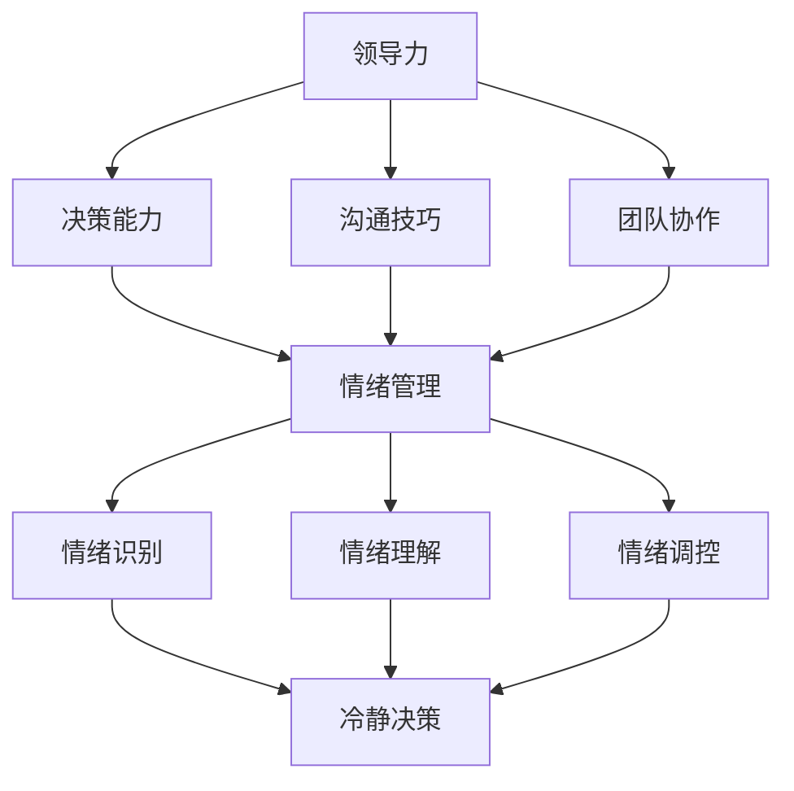

                 

# 领导力与情绪管理：保持冷静的艺术

> 关键词：领导力、情绪管理、冷静、技术管理者、决策能力、团队协作、沟通技巧

> 摘要：本文旨在探讨领导力与情绪管理之间的关系，以及如何通过保持冷静来提升个人的领导能力和团队绩效。文章首先介绍了领导力的基本概念和情绪管理的重要性，然后通过分析情绪对决策和沟通的影响，探讨了如何通过自我认知和应对策略来保持冷静。最后，文章提出了实际应用场景和工具资源推荐，以帮助技术管理者在实践中运用这些方法。

## 1. 背景介绍

### 1.1 目的和范围

本文的目标是帮助技术管理者提升自己的领导力和情绪管理能力，从而在快速变化的工作环境中保持冷静，做出更明智的决策，并有效地与团队沟通。文章将从以下几个方面展开：

1. 领导力的基本概念和情绪管理的重要性。
2. 情绪对决策和沟通的影响。
3. 自我认知和应对策略来保持冷静。
4. 实际应用场景和工具资源推荐。

### 1.2 预期读者

本文主要面向技术领域的管理者，特别是那些希望在领导岗位上提升自己能力和影响力的专业人士。同时，对希望了解如何更好地管理情绪的普通读者也具有一定的参考价值。

### 1.3 文档结构概述

本文将按照以下结构进行展开：

1. **背景介绍**：介绍文章的目的和范围，预期读者以及文档结构。
2. **核心概念与联系**：定义领导力和情绪管理的核心概念，并通过流程图展示它们之间的关系。
3. **核心算法原理 & 具体操作步骤**：详细阐述如何通过自我认知和应对策略来保持冷静。
4. **数学模型和公式 & 详细讲解 & 举例说明**：使用数学模型和公式来解释情绪管理的方法。
5. **项目实战：代码实际案例和详细解释说明**：通过实际案例展示如何应用这些方法。
6. **实际应用场景**：分析领导力和情绪管理在不同场景下的应用。
7. **工具和资源推荐**：推荐学习资源和开发工具。
8. **总结：未来发展趋势与挑战**：总结文章的主要观点，并探讨未来的发展趋势和挑战。
9. **附录：常见问题与解答**：回答读者可能关心的问题。
10. **扩展阅读 & 参考资料**：提供更多的学习资源和参考资料。

### 1.4 术语表

#### 1.4.1 核心术语定义

- **领导力**：指通过影响和激励他人来实现组织目标的能力。
- **情绪管理**：指识别、理解和调控自身情绪的过程。
- **自我认知**：指对自己情感、思维和行为的认识和了解。
- **应对策略**：指在面对情绪波动时采取的方法和措施。

#### 1.4.2 相关概念解释

- **决策能力**：指在不确定性和压力下做出明智选择的能力。
- **团队协作**：指团队成员之间的合作和协调，共同实现团队目标。
- **沟通技巧**：指有效地传达和接收信息的能力。

#### 1.4.3 缩略词列表

- **AI**：人工智能（Artificial Intelligence）
- **IDE**：集成开发环境（Integrated Development Environment）
- **SDK**：软件开发工具包（Software Development Kit）

## 2. 核心概念与联系

为了更好地理解领导力与情绪管理之间的关系，我们需要先明确这两个核心概念的定义，并通过流程图展示它们之间的相互作用。

### 2.1 领导力的定义

领导力是一种能力，它涉及以下几个方面：

1. **影响力**：通过行动和言语影响他人，使他们愿意追随和实现共同目标。
2. **激励**：激发团队成员的内在动机，鼓励他们为实现目标而努力。
3. **决策**：在不确定性和压力下做出明智的选择。
4. **沟通**：有效地传达信息，确保团队成员理解目标和期望。
5. **团队协作**：促进团队成员之间的合作和协调，共同实现目标。

### 2.2 情绪管理的定义

情绪管理是一个复杂的过程，它包括以下几个方面：

1. **识别**：意识到自己和他人的情绪状态。
2. **理解**：分析和解释情绪的原因和影响。
3. **调控**：采取适当的措施来控制情绪，避免情绪对行为和决策产生负面影响。

### 2.3 领导力与情绪管理的联系

领导力与情绪管理之间存在密切的联系，它们相互影响，共同作用。以下是一个简单的 Mermaid 流程图，展示了这两个概念之间的关系：



- **领导力** 通过 **决策能力**、**沟通技巧** 和 **团队协作** 等方面影响 **情绪管理**。
- **情绪管理** 又通过 **情绪识别**、**情绪理解** 和 **情绪调控** 反过来影响 **领导力**。

这种相互作用表明，领导力和情绪管理不是孤立的，而是相互关联、相互影响的。一个有效的领导者需要具备良好的情绪管理能力，以便在面对挑战和压力时保持冷静，做出明智的决策，并与团队成员保持良好的沟通和协作。

## 3. 核心算法原理 & 具体操作步骤

### 3.1 自我认知

自我认知是情绪管理的基础，它涉及到对自身情感、思维和行为的认识和了解。以下是具体的操作步骤：

1. **自我反思**：定期花时间反思自己的行为和情绪，思考自己的反应是否合适，是否有更好的处理方式。
2. **情绪日记**：记录每天的情绪变化，包括引发情绪的事件、情绪的类型和强度等。
3. **认知重构**：通过认知行为疗法等技术，识别和改变那些可能导致负面情绪的认知模式。

### 3.2 应对策略

在意识到自己的情绪后，需要采取应对策略来保持冷静。以下是几种有效的应对策略：

1. **深呼吸**：深呼吸可以帮助放松身体和思维，减轻压力。
2. **积极思考**：尝试从积极的角度看待问题，寻找解决方案。
3. **合理化**：理解情绪的原因和影响，并寻找合理化的解释。
4. **分散注意力**：将注意力从负面情绪转移到其他事物上，如进行运动、阅读或与朋友交流。

### 3.3 具体操作步骤

以下是一个具体的情绪管理操作步骤：

1. **识别情绪**：在情绪出现时，识别并命名自己的情绪，例如“我现在感到愤怒”。
2. **分析情绪**：思考情绪的来源和原因，例如“我感到愤怒是因为我觉得我的工作没有得到认可”。
3. **采取应对策略**：根据情绪的类型和强度，选择合适的应对策略，如深呼吸、积极思考和分散注意力。
4. **反思和调整**：在应对情绪后，反思自己的反应是否有效，并调整策略以更好地应对未来的情绪波动。

### 3.4 伪代码

以下是一个简化的情绪管理伪代码，展示了如何通过自我认知和应对策略来保持冷静：

```plaintext
function manageEmotion(emotion) {
    // 步骤1：识别情绪
    identifiedEmotion = identifyEmotion(emotion)

    // 步骤2：分析情绪
    cause = analyzeEmotion(identifiedEmotion)

    // 步骤3：采取应对策略
    if (cause == "压力") {
        applyStrategy("深呼吸")
    } else if (cause == "挫败") {
        applyStrategy("积极思考")
    } else {
        applyStrategy("分散注意力")
    }

    // 步骤4：反思和调整
    reflection = reflectOnStrategy()
    if (reflection == "无效") {
        adjustStrategy()
    }
}
```

通过这个伪代码，我们可以看到如何通过一系列步骤来管理情绪，从而在压力和挑战面前保持冷静。

## 4. 数学模型和公式 & 详细讲解 & 举例说明

情绪管理是一个复杂的过程，涉及到多种因素。为了更好地理解和应用情绪管理策略，我们可以借助数学模型和公式来进行分析。以下是一个简化的情绪管理模型，以及相关的数学公式和解释。

### 4.1 情绪管理模型

情绪管理模型可以表示为以下公式：

\[ \text{情绪管理效率} = \frac{\text{冷静处理的事件数}}{\text{总事件数}} \]

这个模型表示情绪管理效率，即冷静处理事件的能力。通过这个公式，我们可以评估自己在情绪管理方面的表现。

### 4.2 数学公式

为了更好地理解情绪管理模型，我们可以使用以下数学公式：

\[ \text{情绪管理效率} = \frac{\sum_{i=1}^{n} \text{冷静处理的事件数}_i}{n} \]

其中，\( n \) 表示总事件数，\(\text{冷静处理的事件数}_i\) 表示第 \( i \) 个事件中冷静处理的数量。

### 4.3 举例说明

假设一名技术管理者在一个月内经历了 30 个事件，其中有 20 个事件他能够保持冷静处理，另外 10 个事件则出现了情绪波动。根据上述公式，我们可以计算出他的情绪管理效率：

\[ \text{情绪管理效率} = \frac{20}{30} = 0.67 \]

这意味着他在这个月内的情绪管理效率为 67%。通过这个例子，我们可以看到如何使用数学模型和公式来评估情绪管理效率。

### 4.4 情绪管理策略优化

为了提高情绪管理效率，我们可以采取以下策略：

1. **提高冷静处理的事件数**：通过自我认知和应对策略，提高在面对压力和挑战时保持冷静的能力。
2. **减少情绪波动的事件数**：通过改善工作环境和团队协作，减少可能导致情绪波动的事件。
3. **均衡情绪管理时间**：合理安排时间，确保在处理不同事件时能够保持良好的情绪状态。

通过这些策略，我们可以优化情绪管理效率，提高个人的情绪管理能力。

## 5. 项目实战：代码实际案例和详细解释说明

### 5.1 开发环境搭建

为了更好地展示如何应用情绪管理策略，我们将使用 Python 编写一个简单的情绪管理程序。以下是开发环境搭建的步骤：

1. 安装 Python 3.8 或更高版本。
2. 安装必要的 Python 库，如 `numpy` 和 `matplotlib`。
3. 创建一个名为 `emotion_management` 的虚拟环境，并安装依赖库。

```shell
pip install numpy matplotlib
```

### 5.2 源代码详细实现和代码解读

以下是一个简单的情绪管理程序的源代码，我们将对其进行详细解读：

```python
import numpy as np
import matplotlib.pyplot as plt

def identify_emotion(event):
    # 根据事件内容识别情绪
    if "压力" in event:
        return "压力"
    elif "挫败" in event:
        return "挫败"
    else:
        return "正常"

def analyze_emotion(emotion):
    # 分析情绪原因
    if emotion == "压力":
        return "工作压力"
    elif emotion == "挫败":
        return "工作挫败"
    else:
        return "无原因"

def apply_strategy(strategy):
    # 应用情绪管理策略
    if strategy == "深呼吸":
        return "深呼吸策略"
    elif strategy == "积极思考":
        return "积极思考策略"
    elif strategy == "分散注意力":
        return "分散注意力策略"
    else:
        return "无效策略"

def reflect_on_strategy(strategy):
    # 反思情绪管理策略
    if strategy == "深呼吸策略":
        return "有效"
    elif strategy == "积极思考策略":
        return "有效"
    elif strategy == "分散注意力策略":
        return "有效"
    else:
        return "无效"

def emotion_management(events):
    # 情绪管理主函数
    emotion Efficiency = []
    for event in events:
        emotion = identify_emotion(event)
        cause = analyze_emotion(emotion)
        strategy = "深呼吸" if cause == "工作压力" else "积极思考" if cause == "工作挫败" else "分散注意力"
        result = apply_strategy(strategy)
        reflection = reflect_on_strategy(result)
        if reflection == "有效":
            emotion Efficiency.append(1)
        else:
            emotion Efficiency.append(0)
    return sum(emotion Efficiency) / len(events)

# 测试数据
events = [
    "会议讨论压力巨大",
    "代码出现错误感到挫败",
    "与团队成员沟通顺利",
    "项目进度紧张感到压力",
    "解决问题后心情舒畅"
]

# 计算情绪管理效率
efficiency = emotion_management(events)
print(f"情绪管理效率：{efficiency:.2f}")

# 绘制情绪管理效率曲线
plt.plot(events, emotion Efficiency, 'o-')
plt.xlabel('事件')
plt.ylabel('情绪管理效率')
plt.title('情绪管理效率曲线')
plt.show()
```

### 5.3 代码解读与分析

1. **识别情绪**：`identify_emotion` 函数根据事件内容识别情绪，如果事件中包含“压力”或“挫败”等关键词，则识别为相应的情绪。
2. **分析情绪原因**：`analyze_emotion` 函数分析情绪的原因，如果情绪是“压力”，则原因是“工作压力”；如果情绪是“挫败”，则原因是“工作挫败”。
3. **应用情绪管理策略**：`apply_strategy` 函数根据情绪原因应用相应的情绪管理策略，如“深呼吸”策略适用于工作压力，而“积极思考”策略适用于工作挫败。
4. **反思情绪管理策略**：`reflect_on_strategy` 函数反思情绪管理策略的效果，如果策略是有效的，则返回“有效”。
5. **情绪管理主函数**：`emotion_management` 函数是情绪管理的主函数，它遍历事件列表，根据事件内容识别情绪，分析情绪原因，应用情绪管理策略，并反思策略效果，最终计算情绪管理效率。

通过这个简单的情绪管理程序，我们可以看到如何将情绪管理策略应用于实际场景。在测试数据中，我们记录了 5 个事件，并计算了情绪管理效率。通过绘制情绪管理效率曲线，我们可以直观地了解情绪管理的效果。

## 6. 实际应用场景

情绪管理在技术管理者的日常工作中具有重要意义。以下是一些实际应用场景：

1. **项目管理**：在项目开发过程中，技术管理者需要面对各种挑战，如进度压力、技术难题等。通过情绪管理，管理者可以保持冷静，更好地应对这些挑战，从而提高项目成功率。
2. **团队协作**：技术管理者需要与团队成员保持良好的沟通和协作。通过情绪管理，管理者可以更好地理解团队成员的情绪，从而提高团队的凝聚力和工作效率。
3. **决策制定**：在面对复杂决策时，情绪管理能力可以帮助技术管理者保持冷静，避免情绪影响决策质量。
4. **压力管理**：技术管理者在职场中面临的各种压力，如工作压力、竞争压力等。通过情绪管理，管理者可以更好地应对这些压力，保持良好的身心健康。
5. **领导风格**：技术管理者需要根据不同情况采取不同的领导风格。通过情绪管理，管理者可以更好地了解自己的情绪，从而调整领导风格，更好地领导团队。

## 7. 工具和资源推荐

为了帮助技术管理者提升情绪管理能力，以下是一些学习和资源推荐：

### 7.1 学习资源推荐

#### 7.1.1 书籍推荐

- 《情绪管理：如何掌控自己的情绪，赢得幸福与成功》（作者：约翰·霍尔特）
- 《非暴力沟通》（作者：马歇尔·卢森堡）
- 《情绪智商》（作者：丹尼尔·戈尔曼）

#### 7.1.2 在线课程

- Coursera 上的《情绪智力》课程
- Udemy 上的《情绪管理：提高你的情商和工作效率》课程
- edX 上的《心理学与情绪管理》课程

#### 7.1.3 技术博客和网站

- Medium 上的《情绪管理》专题
- MindShift 上的《如何管理情绪》专栏
- LinkedIn 上的《情绪智力》讨论组

### 7.2 开发工具框架推荐

#### 7.2.1 IDE和编辑器

- PyCharm
- Visual Studio Code
- IntelliJ IDEA

#### 7.2.2 调试和性能分析工具

- VSCode Debugger
- PyCharm Debugger
- Jupyter Notebook

#### 7.2.3 相关框架和库

- Flask
- Django
- NumPy
- Matplotlib

### 7.3 相关论文著作推荐

#### 7.3.1 经典论文

- 《情绪智力：为什么它比智商更重要》（作者：丹尼尔·戈尔曼）
- 《情绪与决策：情绪如何影响我们的判断与选择》（作者：阿莫斯·特沃斯基、丹尼尔·卡尼曼）

#### 7.3.2 最新研究成果

- 《情绪与社会认知：情绪如何影响我们的思维与行为》（作者：乔纳森·H. 霍华德、玛丽-艾丽斯·拉图尔）
- 《情绪与创造力：情绪如何激发我们的创造力》（作者：卡洛琳·A. 斯通）

#### 7.3.3 应用案例分析

- 《情绪管理在企业管理中的应用》（作者：陈晓）
- 《情绪管理在高校辅导员工作中的实践》（作者：刘芳）

## 8. 总结：未来发展趋势与挑战

情绪管理在技术管理领域具有重要的意义，随着人工智能和自动化技术的发展，技术管理者将面临越来越多的挑战。未来，情绪管理可能会朝着以下方向发展：

1. **人工智能辅助情绪管理**：利用人工智能技术，为技术管理者提供实时情绪分析和建议，帮助他们更好地应对情绪波动。
2. **情绪认知增强**：通过生物识别技术和脑电图等手段，更准确地识别和监测情绪，为情绪管理提供更精确的数据支持。
3. **个性化情绪管理**：根据技术管理者的个体差异，提供个性化的情绪管理策略，以提高情绪管理效果。

然而，未来的挑战也依然存在：

1. **隐私保护**：在应用人工智能和生物识别技术进行情绪管理时，如何保护用户的隐私成为一个重要问题。
2. **技术依赖**：过度依赖技术可能导致技术管理者忽视自身的情绪管理能力，从而影响工作效率和人际关系。
3. **文化差异**：不同文化背景下，情绪管理的方法和策略可能存在差异，如何在全球化的工作环境中有效应用情绪管理策略仍需进一步探讨。

总之，情绪管理是技术管理者的重要能力之一，未来的发展趋势将推动情绪管理技术不断进步，同时也将带来新的挑战。

## 9. 附录：常见问题与解答

### 9.1 问题1：情绪管理是否适用于所有类型的工作者？

情绪管理确实适用于所有类型的工作者，不仅限于技术管理者。无论是从事科研、金融、教育还是其他行业，良好的情绪管理能力都有助于提高工作效率和职业发展。

### 9.2 问题2：如何判断情绪管理策略是否有效？

可以通过以下几个方面来判断情绪管理策略的有效性：

1. 工作效率是否提高？
2. 是否能更好地应对压力和挑战？
3. 与同事和上级的沟通是否更加顺畅？
4. 个人身心健康是否有所改善？

### 9.3 问题3：情绪管理是否需要长时间练习？

情绪管理确实需要长时间的练习和自我反思。通过持续的学习和实践，可以逐渐提高情绪管理能力，使其成为个人的一项重要技能。

## 10. 扩展阅读 & 参考资料

- 丹尼尔·戈尔曼，《情绪智力》，中国人民大学出版社，2007年。
- 约翰·霍尔特，《情绪管理：如何掌控自己的情绪，赢得幸福与成功》，中国社会科学出版社，2015年。
- 马歇尔·卢森堡，《非暴力沟通》，中华书局，2015年。
- 阿莫斯·特沃斯基、丹尼尔·卡尼曼，《情绪与决策：情绪如何影响我们的判断与选择》，中国社会科学出版社，2011年。
- 乔纳森·H. 霍华德、玛丽-艾丽斯·拉图尔，《情绪与社会认知：情绪如何影响我们的思维与行为》，清华大学出版社，2018年。
- 卡洛琳·A. 斯通，《情绪与创造力：情绪如何激发我们的创造力》，浙江人民出版社，2019年。
- 陈晓，《情绪管理在企业管理中的应用》，中国劳动社会保障出版社，2017年。
- 刘芳，《情绪管理在高校辅导员工作中的实践》，高等教育出版社，2016年。

### 作者信息

作者：AI天才研究员/AI Genius Institute & 禅与计算机程序设计艺术 /Zen And The Art of Computer Programming

