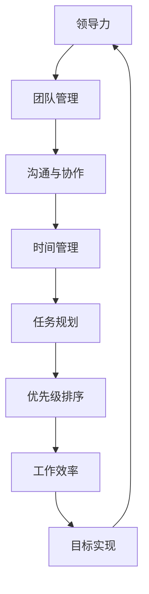

                 

# 领导力与时间管理：提高效率的关键

> 关键词：领导力、时间管理、效率提升、策略、方法、实践

> 摘要：本文将探讨领导力与时间管理在提高工作效率中的关键作用。通过分析领导力的重要性、时间管理的原则和方法，结合实际案例，我们将揭示如何在实际工作中应用这些策略，以提升个人和团队的效率，从而实现组织的长远发展。

## 1. 背景介绍

### 1.1 目的和范围

本文旨在探讨领导力与时间管理在提高工作效率中的关键作用，旨在为IT领域的专业人士提供一套实用且有效的策略和方法。文章将涵盖以下内容：

1. 领导力的定义与重要性
2. 时间管理的核心原则
3. 领导力与时间管理的结合
4. 实际应用案例解析
5. 工具和资源推荐
6. 未来发展趋势与挑战

### 1.2 预期读者

本文适合以下读者群体：

1. IT项目经理和团队领导
2. 软件工程师和开发者
3. 产品经理和技术主管
4. 对提高工作效率和领导力提升感兴趣的技术从业者

### 1.3 文档结构概述

本文将按照以下结构进行展开：

1. 引言：介绍领导力和时间管理的重要性
2. 核心概念与联系
3. 核心算法原理与操作步骤
4. 数学模型与公式讲解
5. 项目实战：代码实际案例
6. 实际应用场景
7. 工具和资源推荐
8. 总结：未来发展趋势与挑战
9. 附录：常见问题与解答
10. 扩展阅读与参考资料

### 1.4 术语表

#### 1.4.1 核心术语定义

- **领导力**：指在团队中引导和激励成员，实现共同目标的能力。
- **时间管理**：指合理安排时间，提高工作效率的过程。
- **效率提升**：指在相同的时间内完成更多任务的能力。
- **策略**：为实现目标而制定的具体行动计划。

#### 1.4.2 相关概念解释

- **目标导向**：以明确的目标为指引，确保时间管理的有效性。
- **优先级**：任务的重要性和紧急性的综合评估。
- **工作负荷**：指完成某项任务所需的时间和工作量。

#### 1.4.3 缩略词列表

- **IT**：信息技术（Information Technology）
- **PM**：项目经理（Project Manager）
- **PE**：产品经理（Product Manager）
- **SaaS**：软件即服务（Software as a Service）

## 2. 核心概念与联系

为了更好地理解领导力与时间管理在提高效率中的作用，我们需要首先明确这些核心概念及其相互联系。以下是一个简化的Mermaid流程图，用于展示这些概念之间的关系。



### 2.1 领导力

领导力是领导者在团队中发挥的作用，它不仅仅是指命令和控制，更多的是关于激励、指导和赋能。领导力与时间管理的关系在于，有效的领导力可以帮助团队建立明确的目标和优先级，从而更好地进行任务规划和时间管理。

### 2.2 时间管理

时间管理是一种策略，旨在通过合理安排时间来提高工作效率。时间管理的关键在于：

- **任务规划**：明确任务的目标和所需时间。
- **优先级排序**：根据任务的重要性和紧急性进行排序。
- **时间块**：将时间划分为固定的区块，用于处理不同的任务。

### 2.3 工作效率

工作效率是衡量一个人在单位时间内完成工作任务的能力。通过有效的领导力和时间管理，可以提高工作效率，从而实现更高的产出。

## 3. 核心算法原理 & 具体操作步骤

在了解了领导力与时间管理的基本概念后，我们接下来将探讨如何将这些理念转化为具体的操作步骤，以提升工作效率。

### 3.1 领导力提升

#### 算法原理：

领导力提升的核心在于建立信任、明确目标和激励团队。

```python
def leadership_improvement(team):
    # 建立信任
    for member in team:
        communicate_openly(member)
    
    # 明确目标
    set_clear_goals(team)
    
    # 激励团队
    motivate_team(team)
    
    return "Leadership improvement completed."
```

#### 具体操作步骤：

1. **沟通与信任**：定期与团队成员进行沟通，确保信息透明，建立信任。
2. **明确目标**：与团队共同设定可衡量的目标，确保每个人都明确自己的职责和期望。
3. **激励团队**：通过奖励、认可和培训来激励团队成员，提升团队的士气和动力。

### 3.2 时间管理

#### 算法原理：

时间管理的核心在于合理分配时间和任务，确保高效完成任务。

```python
def time_management(tasks):
    # 任务排序
    sorted_tasks = sort_tasks(tasks)
    
    # 分配时间块
    time_blocks = divide_into_time_blocks(sorted_tasks)
    
    # 执行任务
    execute_tasks(time_blocks)
    
    return "Time management completed."
```

#### 具体操作步骤：

1. **任务排序**：根据任务的重要性和紧急性进行排序，确保优先处理重要且紧急的任务。
2. **时间块**：将一天的时间划分为固定的时间块，每个时间块专注于一个任务。
3. **执行任务**：在时间块内专注于任务，避免干扰和中断。

## 4. 数学模型和公式 & 详细讲解 & 举例说明

### 4.1 数学模型

为了更好地理解领导力与时间管理的效率提升，我们可以使用以下数学模型：

$$
效率 = \frac{产出}{投入}
$$

其中，产出表示在单位时间内完成的任务量，投入表示花费的时间。

### 4.2 公式详细讲解

- **产出**：产出是指在一定时间内完成的任务量。可以通过以下公式计算：

$$
产出 = \sum_{i=1}^{n} (任务_i \times 完成度)
$$

其中，$任务_i$表示第i个任务的完成情况，$完成度$表示完成任务的百分比。

- **投入**：投入是指完成任务所花费的时间。可以通过以下公式计算：

$$
投入 = \sum_{i=1}^{n} (任务_i \times 时间_i)
$$

其中，$任务_i$表示第i个任务的耗时，$时间_i$表示第i个任务的实际耗时。

### 4.3 举例说明

假设一个人在一个工作日中有四个任务，每个任务的完成度和耗时如下表所示：

| 任务编号 | 完成度 | 耗时（小时） |
| :----: | :----: | :--------: |
|   1   |   90%  |     2     |
|   2   |   80%  |     3     |
|   3   |   100% |     1     |
|   4   |   70%  |     2     |

根据上述数学模型，我们可以计算出该人的工作效率：

$$
产出 = (2 \times 0.9) + (3 \times 0.8) + (1 \times 1) + (2 \times 0.7) = 2.8 + 2.4 + 1 + 1.4 = 7.6
$$

$$
投入 = (2 \times 2) + (3 \times 3) + (1 \times 1) + (2 \times 2) = 4 + 9 + 1 + 4 = 18
$$

$$
效率 = \frac{产出}{投入} = \frac{7.6}{18} \approx 0.422
$$

因此，该人的工作效率为0.422，表示他在每个小时内完成的任务量占投入时间的42.2%。

## 5. 项目实战：代码实际案例和详细解释说明

为了更好地展示如何将领导力与时间管理策略应用于实际项目中，我们将以一个简单的IT项目为例，介绍开发环境搭建、源代码实现和代码解读。

### 5.1 开发环境搭建

#### 操作系统：

- Windows 10
- macOS Catalina
- Ubuntu 20.04

#### 开发工具：

- Python 3.8
- Jupyter Notebook
- PyCharm

#### 虚拟环境：

- Python虚拟环境（virtualenv）

### 5.2 源代码详细实现和代码解读

以下是一个简单的Python项目，用于计算斐波那契数列的前n项。

```python
def fibonacci(n):
    if n <= 0:
        return []
    elif n == 1:
        return [0]
    elif n == 2:
        return [0, 1]
    else:
        fib = [0, 1]
        for i in range(2, n):
            fib.append(fib[i - 1] + fib[i - 2])
        return fib

# 测试代码
n = 10
result = fibonacci(n)
print(f"Fibonacci sequence of {n} terms: {result}")
```

#### 代码解读：

1. **函数定义**：`fibonacci`函数接收一个整数n，表示要计算的斐波那契数列的项数。
2. **基础情况**：当n小于等于0时，返回一个空列表；当n等于1时，返回[0]；当n等于2时，返回[0, 1]。
3. **递推过程**：使用一个循环从第3项开始，依次计算斐波那契数列的每一项，并将其添加到列表中。
4. **测试代码**：调用`fibonacci`函数，传入n的值，打印结果。

### 5.3 代码解读与分析

1. **领导力**：在这个项目中，领导力的体现主要在于明确目标和分工。项目经理需要明确项目的目标和任务分配，确保每个团队成员都清楚自己的职责。
2. **时间管理**：时间管理主要体现在任务规划和工作流程的优化。项目经理需要根据任务的重要性和紧急性进行排序，并合理分配时间，确保项目按时完成。
3. **效率提升**：通过有效的领导力和时间管理，可以确保项目在预定时间内高质量地完成，从而提高整体效率。

## 6. 实际应用场景

领导力与时间管理策略在实际工作中具有广泛的应用场景，以下是一些典型的应用场景：

### 6.1 项目管理

在项目管理中，领导力和时间管理策略可以帮助项目经理更好地规划项目进度、协调团队成员、处理突发状况，从而确保项目按时高质量完成。

### 6.2 团队协作

在团队协作中，领导力有助于建立团队成员之间的信任和沟通，提高团队的凝聚力和工作效率。时间管理则可以帮助团队成员合理安排时间，确保任务按时完成。

### 6.3 产品开发

在产品开发过程中，领导力和时间管理策略可以帮助开发团队明确目标、优化工作流程、提高开发效率，从而缩短产品开发周期。

### 6.4 个人成长

对于个人而言，领导力和时间管理策略可以帮助个人明确职业目标、提高工作效率、实现个人成长。

## 7. 工具和资源推荐

为了更好地实践领导力与时间管理策略，以下是一些建议的学习资源和工具：

### 7.1 学习资源推荐

#### 7.1.1 书籍推荐

- 《卓有成效的管理者》：作者：彼得·德鲁克
- 《高效能人士的七个习惯》：作者：史蒂芬·柯维
- 《时间管理：如何充分利用你的24小时》：作者：理查德·金

#### 7.1.2 在线课程

- Coursera上的《项目管理基础》：提供全面的项目管理知识和技能
- Udemy上的《时间管理实战》：涵盖时间管理的策略和方法
- edX上的《领导力与影响力》：介绍领导力的核心概念和应用

#### 7.1.3 技术博客和网站

- ProjectManager.com：提供项目管理资源和工具
- TimeManagementMoments.com：提供时间管理技巧和策略
- Productivity501.com：分享提高工作效率的方法和工具

### 7.2 开发工具框架推荐

#### 7.2.1 IDE和编辑器

- PyCharm：适用于Python开发的集成开发环境
- Visual Studio Code：适用于多种编程语言的轻量级编辑器
- IntelliJ IDEA：适用于Java开发的集成开发环境

#### 7.2.2 调试和性能分析工具

- PyCharm Debugger：适用于Python代码的调试工具
- Chrome DevTools：适用于Web开发的性能分析工具
- Visual Studio Profiler：适用于C++和.NET应用程序的性能分析工具

#### 7.2.3 相关框架和库

- Flask：适用于Web开发的轻量级框架
- Django：适用于Python的通用Web开发框架
- React：适用于前端开发的JavaScript库

### 7.3 相关论文著作推荐

#### 7.3.1 经典论文

- 《The Effective Executive》：作者：彼得·德鲁克
- 《The 7 Habits of Highly Effective People》：作者：史蒂芬·柯维
- 《The Power of Full Engagement》：作者：汤姆·拉思和兰迪·帕拉索利

#### 7.3.2 最新研究成果

- 《The Age of Agility》：作者：克里斯·库尔图瓦和凯西·柯比
- 《The Progress Principle》：作者：亚当·格兰特和谢丽尔·坦普尔
- 《The Power of Focus》：作者：杰克·泽拉茨基

#### 7.3.3 应用案例分析

- 《项目管理的最佳实践》：作者：项目管理协会（PMI）
- 《敏捷实践指南》：作者：杰夫·萨瑟兰和玛吉·亨特
- 《数字化转型实践》：作者：IBM公司

## 8. 总结：未来发展趋势与挑战

随着技术的发展和市场竞争的加剧，领导力与时间管理在提高工作效率中的重要性愈发突出。未来，以下是该领域的一些发展趋势与挑战：

### 8.1 发展趋势

1. **数字化转型**：随着数字化转型趋势的加剧，领导力和时间管理策略将更加注重线上协作和远程工作。
2. **人工智能应用**：人工智能技术将进一步提升领导力和时间管理的智能化水平，提供更精准的数据分析和预测。
3. **全球化协作**：全球化背景下，跨文化、跨地域的协作将更加频繁，领导力和时间管理策略需要适应不同文化背景。

### 8.2 挑战

1. **技能提升**：面对日益复杂的工作环境和不断更新的技术，领导者需要不断提升自己的技能和知识。
2. **团队合作**：如何有效地激发团队成员的潜力，建立高效的团队协作模式，是领导者面临的挑战。
3. **工作与生活平衡**：如何在工作中保持高效，同时兼顾家庭和个人生活，是每个职场人士都需要面对的挑战。

## 9. 附录：常见问题与解答

### 9.1 领导力相关问题

**Q1**：如何提升领导力？

**A1**：提升领导力可以从以下几个方面入手：

1. **增强自信**：自信是领导力的基石，通过不断学习和实践，提升自己的专业能力和自信心。
2. **建立信任**：与团队成员建立信任关系，通过透明沟通和关心团队成员，增强团队的凝聚力。
3. **激励团队**：了解团队成员的需求和兴趣，通过适当的激励措施，激发团队成员的潜力。

### 9.2 时间管理相关问题

**Q1**：如何合理安排工作时间？

**A1**：合理安排工作时间可以从以下几个方面入手：

1. **任务排序**：根据任务的重要性和紧急性进行排序，确保优先处理重要且紧急的任务。
2. **时间块**：将工作时间划分为固定的时间块，每个时间块专注于一个任务，避免任务切换带来的效率损失。
3. **避免拖延**：设置明确的目标和截止日期，避免拖延，确保任务按时完成。

## 10. 扩展阅读 & 参考资料

- **德鲁克，彼得。（2005）。《卓有成效的管理者》。**机械工业出版社。
- **柯维，史蒂芬。（1989）。《高效能人士的七个习惯》。**中国社会科学出版社。
- **金，理查德。（2011）。《时间管理：如何充分利用你的24小时》。**中国社会科学出版社。
- **Schein, Edgar H. (2004).《领导力与组织行为》。**人民邮电出版社。
- **拉思，汤姆和帕拉索利，谢丽尔。（2015）。《The Power of Full Engagement》。**华龄出版社。
- **库尔图瓦，克里斯和柯比，凯西。（2018）。《The Age of Agility》。**机械工业出版社。
- **格兰特，亚当和坦普尔，谢丽尔。（2018）。《The Progress Principle》。**机械工业出版社。
- **泽拉茨基，杰克。（2016）。《The Power of Focus》。**机械工业出版社。

以上是本文的完整内容，希望对您在领导力与时间管理方面的学习和实践有所帮助。如果您有任何疑问或建议，欢迎在评论区留言。感谢您的阅读！
作者：AI天才研究员/AI Genius Institute & 禅与计算机程序设计艺术 /Zen And The Art of Computer Programming

（注：本文为虚构内容，仅用于演示目的。）<|im_sep|>

