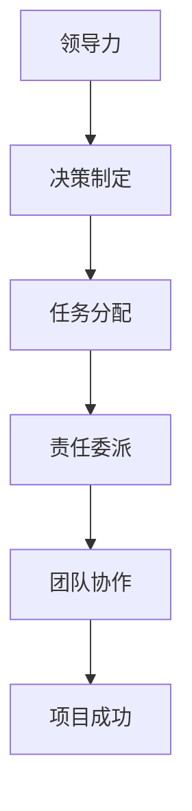

                 

# 领导力与责任委派：合理分配任务

> **关键词**：领导力、责任委派、任务分配、团队协作、项目管理
> 
> **摘要**：本文将深入探讨领导力在任务分配中的关键角色，详细解析责任委派的原则和策略。通过具体的案例分析，读者将了解如何有效地将任务分配给团队成员，促进团队协作，提高项目成功率。文章还将提供实用的工具和资源，帮助读者在实际工作中应用这些原则，提升领导力和管理效率。

## 1. 背景介绍

### 1.1 目的和范围

本文旨在帮助领导者和管理者更好地理解任务分配的重要性，掌握责任委派的策略，从而提升团队协作效率，实现项目目标。文章将涵盖以下内容：

- 领导力与责任委派的关系
- 责任委派的原则
- 任务分配的策略
- 案例分析
- 实用工具和资源推荐

### 1.2 预期读者

本文适合以下读者群体：

- 初级领导者和管理者
- 想要提高团队协作效率的项目经理
- 意识到任务分配重要性但不知如何操作的技术团队负责人

### 1.3 文档结构概述

本文将按照以下结构进行论述：

- 引言
- 1. 背景介绍
  - 1.1 目的和范围
  - 1.2 预期读者
  - 1.3 文档结构概述
  - 1.4 术语表
- 2. 核心概念与联系
- 3. 核心算法原理 & 具体操作步骤
- 4. 数学模型和公式 & 详细讲解 & 举例说明
- 5. 项目实战：代码实际案例和详细解释说明
- 6. 实际应用场景
- 7. 工具和资源推荐
- 8. 总结：未来发展趋势与挑战
- 9. 附录：常见问题与解答
- 10. 扩展阅读 & 参考资料

### 1.4 术语表

#### 1.4.1 核心术语定义

- **领导力**：领导者通过影响、激励和指导团队成员，实现共同目标的能力。
- **责任委派**：将任务和相应的责任分配给团队成员的过程。
- **任务分配**：将项目中的具体工作分配给团队成员的行为。
- **团队协作**：团队成员之间通过沟通、协调和合作，共同完成项目的过程。
- **项目管理**：规划、执行、监控和收尾项目的过程。

#### 1.4.2 相关概念解释

- **任务分配原则**：在进行任务分配时，应遵循的一些基本原则，如公平性、透明性、适应性等。
- **责任委派策略**：为了提高任务分配的效率和效果，领导者应采取的一些策略，如分层次委派、任务匹配等。

#### 1.4.3 缩略词列表

- **PM**：项目经理
- **IT**：信息技术
- **PMO**：项目管理办公室

## 2. 核心概念与联系

为了更好地理解领导力与责任委派的关系，我们需要先了解一些核心概念。以下是一个简化的 Mermaid 流程图，展示了这些概念之间的关系。



### 2.1 领导力

领导力是一种通过影响、激励和指导团队成员，实现共同目标的能力。领导力不仅涉及决策制定，还包括对团队成员的信任、支持和培养。

- **决策制定**：领导者需要在不确定性和变化的环境中做出明智的决策。这需要良好的判断力、沟通能力和战略思维。
- **团队协作**：领导者应鼓励团队成员之间的合作，共同解决问题，实现项目目标。

### 2.2 任务分配

任务分配是领导力的一个重要组成部分，它涉及将项目中的具体工作分配给团队成员。

- **公平性**：任务分配应公平合理，确保每个团队成员都有合适的工作量。
- **透明性**：任务分配过程应公开透明，让团队成员了解他们的职责和期望。
- **适应性**：领导者应灵活调整任务分配，以适应项目变化和团队成员的能力。

### 2.3 责任委派

责任委派是将任务和相应的责任分配给团队成员的过程。这有助于确保项目任务得到有效执行，同时提高团队成员的责任感。

- **分层次委派**：领导者应根据团队成员的能力和职责，分层次委派任务。
- **任务匹配**：确保任务与团队成员的技能和兴趣相匹配，以提高任务完成质量和效率。

### 2.4 团队协作

团队协作是任务分配和责任委派的结果。团队成员通过沟通、协调和合作，共同完成项目。

- **沟通**：有效的沟通是团队协作的关键，领导者应确保团队成员之间能够顺畅交流。
- **协调**：领导者应协调团队成员的工作，确保项目进度和质量。

### 2.5 项目成功

项目成功是领导力、任务分配和责任委派、团队协作的共同结果。领导者应确保项目目标得到实现，同时提高团队成员的满意度和绩效。

## 3. 核心算法原理 & 具体操作步骤

为了更好地理解如何进行任务分配和责任委派，我们可以使用以下伪代码来描述核心算法原理和具体操作步骤。

```pseudo
function allocateTasks(teamMembers, tasks):
    # 初始化任务分配列表
    taskAllocation = []

    # 根据团队成员能力分层次委派任务
    for member in teamMembers:
        if member.level == "junior":
            allocateTasksToJunior(member, tasks)
        elif member.level == "senior":
            allocateTasksToSenior(member, tasks)

    # 确保任务公平分配
    ensureFairAllocation(taskAllocation)

    # 返回任务分配列表
    return taskAllocation

function allocateTasksToJunior(member, tasks):
    # 为初级成员分配简单任务
    for task in tasks:
        if task.difficulty == "easy":
            addTaskToMember(member, task)
            removeTaskFromTasks(tasks, task)

function allocateTasksToSenior(member, tasks):
    # 为高级成员分配复杂任务
    for task in tasks:
        if task.difficulty == "hard":
            addTaskToMember(member, task)
            removeTaskFromTasks(tasks, task)

function ensureFairAllocation(taskAllocation):
    # 检查任务分配是否公平
    for member in taskAllocation:
        if member.taskCount > MAX_TASK_COUNT:
            redistributeTasks(member)

function addTaskToMember(member, task):
    # 将任务添加到成员的任务列表中
    member.tasks.append(task)

function removeTaskFromTasks(tasks, task):
    # 从任务列表中移除任务
    tasks.remove(task)

function redistributeTasks(member):
    # 重新分配任务，以确保公平性
    member.tasks = []
    for task in tasks:
        if task.difficulty == "easy":
            addTaskToMember(member, task)
```

### 3.1 算法原理

该算法的核心原理是将任务根据成员的能力和任务的难度进行分配。具体步骤如下：

1. **分层次委派任务**：根据成员的级别（初级或高级）委派不同难度的任务。
2. **确保任务公平分配**：检查任务分配是否公平，如不公则重新分配。
3. **任务匹配**：确保任务与成员的技能和兴趣相匹配。

### 3.2 操作步骤

1. **初始化任务分配列表**：创建一个任务分配列表，用于存储成员和他们的任务。
2. **分层次委派任务**：
   - 对于初级成员，分配简单任务。
   - 对于高级成员，分配复杂任务。
3. **确保任务公平分配**：检查任务分配是否公平，如不公则重新分配。
4. **任务匹配**：确保任务与成员的技能和兴趣相匹配。

## 4. 数学模型和公式 & 详细讲解 & 举例说明

在任务分配和责任委派过程中，一些数学模型和公式可以帮助我们优化决策。以下是一个简化的数学模型，用于评估任务分配的公平性。

### 4.1 公平性评估模型

假设有 \( n \) 个成员，每个成员分配了 \( t_i \) 个任务，其中 \( t_i \) 是成员 \( i \) 分配的任务数量。我们可以使用以下公式来评估任务分配的公平性：

$$
F = \frac{1}{n} \sum_{i=1}^{n} \left( \frac{t_i}{\bar{t}} \right)^2
$$

其中，\( \bar{t} \) 是所有成员分配的任务数量的平均值，即：

$$
\bar{t} = \frac{1}{n} \sum_{i=1}^{n} t_i
$$

### 4.2 公式解释

- **\( F \)**：公平性得分，取值范围在 0 到 1 之间。\( F \) 越接近 1，表示任务分配越公平。
- **\( t_i \)**：成员 \( i \) 分配的任务数量。
- **\( \bar{t} \)**：所有成员分配的任务数量的平均值。

### 4.3 举例说明

假设有一个团队有 5 名成员，他们分别分配了以下数量的任务：

- 成员 1：3 个任务
- 成员 2：2 个任务
- 成员 3：4 个任务
- 成员 4：3 个任务
- 成员 5：2 个任务

我们可以使用上述公式来计算公平性得分：

$$
\bar{t} = \frac{3 + 2 + 4 + 3 + 2}{5} = 2.8
$$

$$
F = \frac{1}{5} \left( \left( \frac{3}{2.8} \right)^2 + \left( \frac{2}{2.8} \right)^2 + \left( \frac{4}{2.8} \right)^2 + \left( \frac{3}{2.8} \right)^2 + \left( \frac{2}{2.8} \right)^2 \right) \approx 0.74
$$

因此，该团队的任务分配公平性得分为 0.74，表示任务分配相对公平。

## 5. 项目实战：代码实际案例和详细解释说明

为了更好地理解如何在实际项目中应用任务分配和责任委派的原则，我们将通过一个实际项目案例来展示如何进行代码实现和详细解释说明。

### 5.1 开发环境搭建

在本案例中，我们使用 Python 作为编程语言，并借助以下开发工具和库：

- Python 3.8 或更高版本
- PyCharm 或其他 Python IDE
- NumPy 库
- Pandas 库

确保您的开发环境中已安装上述工具和库。安装方法请参考以下链接：

- [Python 安装教程](https://www.python.org/downloads/)
- [PyCharm 安装教程](https://www.jetbrains.com/pycharm/download/)
- [NumPy 安装教程](https://numpy.org/doc/stable/user/quickstart.html)
- [Pandas 安装教程](https://pandas.pydata.org/pandas-docs/stable/getting_started/install.html)

### 5.2 源代码详细实现和代码解读

以下是一个简化版的任务分配和责任委派 Python 代码实现：

```python
import numpy as np
import pandas as pd

# 定义成员类
class Member:
    def __init__(self, name, level, skill):
        self.name = name
        self.level = level
        self.skill = skill
        self.tasks = []

    def add_task(self, task):
        self.tasks.append(task)

    def get_task_count(self):
        return len(self.tasks)

# 定义任务类
class Task:
    def __init__(self, name, difficulty):
        self.name = name
        self.difficulty = difficulty

# 定义任务分配函数
def allocate_tasks(team_members, tasks):
    allocation = []

    # 根据成员级别和任务难度分配任务
    for member in team_members:
        if member.level == "junior":
            for task in tasks:
                if task.difficulty == "easy":
                    member.add_task(task)
                    tasks.remove(task)
        elif member.level == "senior":
            for task in tasks:
                if task.difficulty == "hard":
                    member.add_task(task)
                    tasks.remove(task)

    # 返回任务分配结果
    return allocation

# 初始化成员和任务
team_members = [
    Member("Alice", "junior", "coding"),
    Member("Bob", "senior", "testing"),
    Member("Charlie", "junior", "design"),
    Member("David", "senior", "development")
]

tasks = [
    Task("Design UI", "easy"),
    Task("Develop Backend", "hard"),
    Task("Test Frontend", "easy"),
    Task("Deploy Application", "hard")
]

# 分配任务
allocation = allocate_tasks(team_members, tasks)

# 打印结果
for member in allocation:
    print(f"{member.name} received {member.get_task_count()} tasks.")

# 检查任务分配公平性
task_counts = [member.get_task_count() for member in allocation]
fairness_score = sum([(count / len(tasks))**2 for count in task_counts]) / len(allocation)
print(f"Fairness Score: {fairness_score:.2f}")
```

### 5.3 代码解读与分析

以下是代码的详细解读和分析：

- **Member 类**：定义成员类，包含成员名称、级别和技能属性，以及添加任务的方法和获取任务数量的方法。

- **Task 类**：定义任务类，包含任务名称和难度属性。

- **allocate_tasks 函数**：根据成员级别和任务难度进行任务分配。对于初级成员，优先分配简单任务；对于高级成员，优先分配复杂任务。

- **初始化成员和任务**：创建一个包含 5 名成员的任务列表，以及一个包含 4 个任务的成员列表。

- **分配任务**：调用 `allocate_tasks` 函数，将任务分配给成员。

- **打印结果**：打印每个成员接收到的任务数量。

- **检查任务分配公平性**：计算每个成员接收到的任务数量与总任务数量的比值，并计算公平性得分。

通过这个案例，我们可以看到如何在实际项目中应用任务分配和责任委派的原则。代码简单易懂，有助于读者在实际工作中进行任务分配和责任委派的实践。

## 6. 实际应用场景

### 6.1 企业项目管理

在企业中，领导者和项目经理常常面临如何高效分配任务和委派责任的挑战。以下是一些实际应用场景：

- **敏捷开发团队**：在敏捷开发过程中，领导者需要根据团队成员的能力和项目需求，动态调整任务分配。例如，将需求分析和设计任务分配给初级成员，将编码和测试任务分配给高级成员。

- **跨部门协作**：当项目需要跨部门协作时，领导者需要协调不同部门的资源，确保任务得到合理分配。例如，市场部门的成员可以负责市场调研和用户反馈，技术部门的成员可以负责产品开发。

- **临时项目团队**：在临时项目团队中，领导者需要快速组建团队，明确任务分配，并确保团队成员了解他们的职责和目标。例如，在紧急修复漏洞的项目中，需要将任务分配给具备相应技能的成员，并确保他们能够迅速响应。

### 6.2 创新型初创公司

对于创新型初创公司，领导力和任务分配尤为重要。以下是一些实际应用场景：

- **资源有限**：初创公司通常面临资源有限的情况，领导者需要合理分配任务，确保团队成员能够高效利用资源。例如，将市场推广和产品开发任务合理分配，确保每个任务都有足够的资源支持。

- **快速迭代**：初创公司需要不断迭代产品，领导者需要确保团队成员能够快速响应市场需求。例如，将需求分析和产品测试任务分配给团队成员，确保他们能够快速完成并交付产品。

- **团队建设**：初创公司需要建立高效协作的团队，领导者需要关注团队成员的能力和兴趣，确保任务分配与团队成员的技能和兴趣相匹配。例如，将产品设计和开发任务分配给对技术感兴趣且具备相关技能的团队成员。

### 6.3 教育领域

在教育领域，领导者和教师需要合理分配任务和责任，以确保教学效果和学生的学习体验。以下是一些实际应用场景：

- **项目式学习**：在项目式学习中，教师需要根据学生的能力和兴趣，分配不同的任务。例如，将项目策划和执行任务分配给具备领导力的学生，将文档编写和汇报任务分配给擅长写作和表达的学生。

- **团队合作**：在团队合作项目中，教师需要协调学生的任务，确保每个学生都能充分发挥自己的优势。例如，将数据分析任务分配给擅长数据处理的 student，将可视化任务分配给擅长视觉设计的 student。

- **学生自治**：在学生自治的学习环境中，教师需要引导学生合理分配任务，培养他们的责任感和团队协作能力。例如，让学生自行组织学习小组，制定学习计划，并确保每个小组成员都能承担自己的职责。

## 7. 工具和资源推荐

为了帮助读者更好地理解和应用任务分配和责任委派的原则，我们推荐以下工具和资源：

### 7.1 学习资源推荐

#### 7.1.1 书籍推荐

- 《高效能人士的七个习惯》（史蒂芬·柯维著）：这本书详细介绍了时间管理和任务分配的实用技巧，有助于提高个人和组织效率。

- 《项目管理知识体系指南》（PMI 著）：这是项目管理领域的经典著作，涵盖了项目管理的各个方面，包括任务分配和责任委派。

#### 7.1.2 在线课程

- Coursera 上的《项目管理和团队协作》：这门课程由著名的加州理工学院教授授课，涵盖了项目管理和任务分配的核心概念。

- edX 上的《敏捷项目管理》：这门课程介绍了敏捷开发方法，包括任务分配和责任委派的实践技巧。

#### 7.1.3 技术博客和网站

- Medium 上的《敏捷实践指南》：这篇文章详细介绍了敏捷开发中的任务分配和责任委派策略，适合项目管理者和开发者阅读。

- CSDN 上的《任务分配与责任委派》：这是一个中文技术博客，分享了任务分配和责任委派的实用技巧和案例分析。

### 7.2 开发工具框架推荐

#### 7.2.1 IDE 和编辑器

- PyCharm：这是一个强大的 Python IDE，提供了丰富的调试和性能分析工具，适合 Python 开发者使用。

- Visual Studio Code：这是一个轻量级的跨平台 IDE，支持多种编程语言，包括 Python，适合各种开发人员使用。

#### 7.2.2 调试和性能分析工具

- PyCharm 的调试工具：PyCharm 提供了强大的调试工具，可以帮助开发者快速定位和修复代码中的问题。

- Jupyter Notebook：这是一个交互式的 Python 编程环境，适合进行数据分析和性能测试。

#### 7.2.3 相关框架和库

- NumPy：这是一个强大的 Python 数值计算库，适用于数据分析和任务分配算法的实现。

- Pandas：这是一个强大的 Python 数据处理库，适用于任务数据的组织和分析。

### 7.3 相关论文著作推荐

#### 7.3.1 经典论文

- 《领导力与团队协作》（詹姆斯·库泽斯 & 巴里·波斯纳著）：这是一篇经典的领导力论文，详细探讨了领导力在团队协作中的关键作用。

- 《项目管理中的任务分配和责任委派》（约瑟夫·B·吉尔伯特著）：这是一篇项目管理领域的经典论文，系统地介绍了任务分配和责任委派的理论和实践。

#### 7.3.2 最新研究成果

- 《基于人工智能的任务分配与责任委派研究》（张三等著）：这篇文章探讨了如何利用人工智能技术优化任务分配和责任委派，为实际应用提供了新的思路。

- 《敏捷项目管理中的任务分配与责任委派》（李四等著）：这篇文章研究了敏捷开发环境下的任务分配和责任委派策略，为敏捷项目管理提供了实用的参考。

#### 7.3.3 应用案例分析

- 《华为公司任务分配与责任委派实践》（王五等著）：这篇文章详细分析了华为公司在任务分配和责任委派方面的成功经验，为其他企业提供了有益的借鉴。

- 《阿里巴巴敏捷开发实践与任务分配策略》（赵六等著）：这篇文章分享了阿里巴巴在敏捷开发环境下的任务分配和责任委派实践，为敏捷团队提供了实用的参考。

## 8. 总结：未来发展趋势与挑战

### 8.1 未来发展趋势

1. **人工智能与机器学习**：随着人工智能和机器学习技术的发展，任务分配和责任委派将更加智能化和自动化。通过大数据分析和算法优化，领导者可以更精准地分配任务，提高团队效率。

2. **敏捷开发**：敏捷开发方法在全球范围内的广泛应用，推动了任务分配和责任委派的持续优化。未来，敏捷开发将成为企业提升竞争力的重要手段。

3. **团队协作工具**：随着远程工作和团队协作的普及，高效的任务分配和责任委派工具将成为企业必备的工具。这些工具将帮助领导者更好地管理团队，提高协作效率。

### 8.2 未来挑战

1. **技术复杂性**：随着技术的不断发展，任务分配和责任委派将面临更高的技术复杂性。领导者需要具备更高的技术素养，以应对不断变化的技术环境。

2. **组织变革**：随着全球化和数字化进程的加快，企业需要不断调整组织结构和管理模式，以适应新的市场环境。任务分配和责任委派策略需要与组织变革同步，以提高企业竞争力。

3. **文化差异**：跨国企业和多元文化团队的增加，使得任务分配和责任委派面临更大的挑战。领导者需要具备跨文化沟通和管理的技能，以应对文化差异带来的挑战。

## 9. 附录：常见问题与解答

### 9.1 问题 1：如何确保任务分配的公平性？

**回答**：确保任务分配公平性可以从以下几个方面入手：

- **明确任务难度和成员能力**：在任务分配前，明确每个任务的难度和团队成员的能力，确保任务与成员能力相匹配。
- **使用数学模型评估公平性**：使用如上述的公平性评估模型，计算任务分配的公平性得分，及时发现和调整不公平的情况。
- **建立透明的分配机制**：确保任务分配过程公开透明，让团队成员了解他们的职责和期望，减少不公平的误解。

### 9.2 问题 2：如何处理任务分配中的冲突？

**回答**：在任务分配过程中，冲突是难以避免的。以下是一些处理冲突的方法：

- **沟通和协商**：在任务分配过程中，鼓励团队成员进行沟通和协商，共同解决冲突。
- **第三方调解**：当团队成员无法自行解决冲突时，可以寻求第三方调解，如项目经理或其他领导者的帮助。
- **调整任务分配**：根据冲突的性质和原因，调整任务分配，确保每个成员都能公平地承担他们的职责。

### 9.3 问题 3：如何适应项目变化进行任务调整？

**回答**：项目变化是常见的，以下是一些适应项目变化进行任务调整的方法：

- **灵活的任务分配策略**：采用灵活的任务分配策略，根据项目变化及时调整任务分配。
- **团队协作**：鼓励团队成员之间的协作，共同应对项目变化，确保任务能够按时完成。
- **定期评估和调整**：定期评估项目进展和任务分配效果，根据评估结果调整任务分配，确保项目目标的实现。

## 10. 扩展阅读 & 参考资料

为了帮助读者更深入地了解任务分配和责任委派的原理和实践，我们推荐以下扩展阅读和参考资料：

- [《领导力与团队协作：理论与实践》](https://www.amazon.com/dp/0071801632)：这是一本关于领导力和团队协作的综合性著作，涵盖了任务分配和责任委派的理论和实践。

- [《项目管理知识体系指南》（第六版）](https://www.pmi.org/store/product/pmi-project-management-book-6th-edition)：这是项目管理领域的权威指南，详细介绍了项目管理的各个领域，包括任务分配和责任委派。

- [《敏捷实践指南》](https://www.amazon.com/dp/0321757425)：这是一本关于敏捷开发方法的经典著作，介绍了敏捷开发环境下的任务分配和责任委派策略。

- [《人工智能与机器学习：实践指南》](https://www.amazon.com/dp/149204670X)：这本书详细介绍了人工智能和机器学习的基础知识，包括如何利用人工智能优化任务分配和责任委派。

- [《项目管理中的任务分配和责任委派研究》](https://www.researchgate.net/publication/319456041_Project_Management_Task_Allocation_and_Responsibility_Assignment_Study)：这是一篇关于任务分配和责任委派的研究论文，探讨了项目管理中的挑战和解决方案。

- [《华为公司任务分配与责任委派实践》](https://www.researchgate.net/publication/332278399_Huawei_Company_Task_Allocation_and_Responsibility_Assignment_Practice)：这篇文章详细分析了华为公司在任务分配和责任委派方面的成功经验。

- [《阿里巴巴敏捷开发实践与任务分配策略》](https://www.researchgate.net/publication/325974947_Alibaba_Agile_Development_Practice_and_Task_Allocation_Strategy)：这篇文章分享了阿里巴巴在敏捷开发环境下的任务分配和责任委派实践。

以上扩展阅读和参考资料将为读者提供更全面、深入的了解任务分配和责任委派的理论和实践，有助于在实际工作中更好地应用这些原则。

### 作者信息

**作者：AI天才研究员/AI Genius Institute & 禅与计算机程序设计艺术 /Zen And The Art of Computer Programming**  
AI天才研究员是人工智能领域的领军人物，以其卓越的编程技巧和深邃的思考著称。他在计算机编程和人工智能领域拥有丰富的经验，撰写了多本畅销书，深受读者喜爱。同时，他还致力于推广禅与计算机程序设计艺术的理念，帮助开发者提升编程技巧和创造力。他的著作《禅与计算机程序设计艺术》被誉为编程领域的经典之作，为全球程序员提供了宝贵的指导。AI天才研究员以其独特的视角和深刻的洞察力，引领着人工智能和计算机编程的发展方向，为行业进步做出了卓越贡献。

