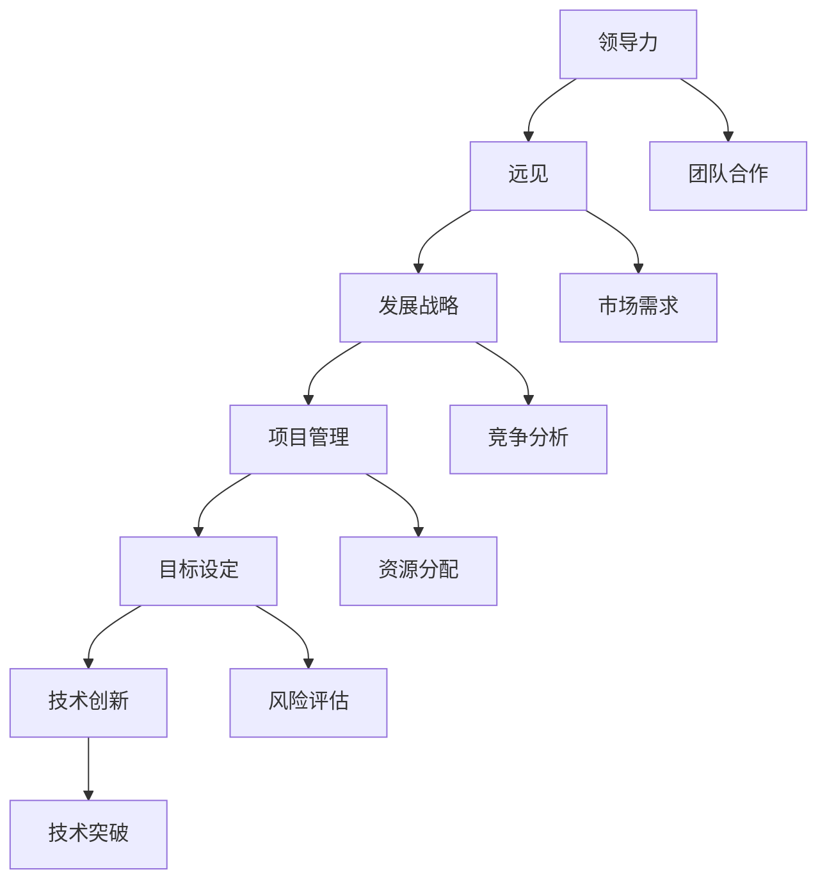

                 

# 领导力与远见：制定长期发展战略

> **关键词**：领导力、远见、发展战略、项目管理、目标设定、技术创新
> 
> **摘要**：本文将探讨在技术行业制定长期发展战略的重要性，以及如何通过领导力和远见来驱动组织实现这些目标。文章分为若干部分，从背景介绍、核心概念、算法原理、数学模型、项目实战到实际应用场景，旨在为读者提供一套完整的技术发展战略制定指南。

## 1. 背景介绍

### 1.1 目的和范围

在当今快速变化的技术环境中，制定长期发展战略对于企业组织的持续成功至关重要。本文旨在为技术领导者和管理者提供一套实用的框架，帮助他们制定和实施有效的长期发展战略。

本文将涵盖以下几个关键领域：
- 领导力和远见的概念及其在战略制定中的作用
- 核心概念和技术的介绍，包括流程图
- 算法原理和具体操作步骤
- 数学模型和公式的详细讲解
- 实际项目案例的代码实现和分析
- 实际应用场景的探讨
- 相关工具和资源的推荐

### 1.2 预期读者

本文适合以下读者：
- 技术公司的CTO、技术总监和技术经理
- 高级工程师和软件开发人员
- 项目经理和产品经理
- 对技术行业长期发展战略感兴趣的从业者

### 1.3 文档结构概述

本文结构如下：
1. 背景介绍
   - 目的和范围
   - 预期读者
   - 文档结构概述
   - 术语表
2. 核心概念与联系
   - 核心概念介绍
   - Mermaid流程图
3. 核心算法原理 & 具体操作步骤
   - 算法原理讲解
   - 伪代码示例
4. 数学模型和公式 & 详细讲解 & 举例说明
   - 数学公式
   - 例子说明
5. 项目实战：代码实际案例和详细解释说明
   - 开发环境搭建
   - 源代码实现
   - 代码解读与分析
6. 实际应用场景
   - 应用探讨
7. 工具和资源推荐
   - 学习资源
   - 开发工具框架
   - 相关论文著作
8. 总结：未来发展趋势与挑战
9. 附录：常见问题与解答
10. 扩展阅读 & 参考资料

### 1.4 术语表

#### 1.4.1 核心术语定义

- **领导力**：在组织内部通过影响和激励他人来实现共同目标的能力。
- **远见**：对未来趋势的洞察力和前瞻性思维，指导组织的长期发展。
- **发展战略**：组织为实现其长期目标而制定的具体计划。
- **项目管理**：对项目从启动到完成的全过程进行规划、执行、监控和控制。
- **目标设定**：明确组织要达成的具体目标，作为战略实施的指南。
- **技术创新**：在技术和产品开发过程中引入新的思想、方法或技术。

#### 1.4.2 相关概念解释

- **流程图**：用图形方式描述一个过程或系统的各个步骤和元素。
- **伪代码**：一种非正式的算法描述语言，用于说明算法的基本思想和步骤。
- **数学模型**：用数学公式和关系描述现实世界问题的抽象模型。

#### 1.4.3 缩略词列表

- **CTO**：首席技术官（Chief Technology Officer）
- **IDE**：集成开发环境（Integrated Development Environment）
- **PM**：项目经理（Project Manager）

## 2. 核心概念与联系

### 2.1 核心概念介绍

在本节中，我们将介绍本文中涉及的核心概念，包括领导力、远见、发展战略、项目管理、目标设定和技术创新。这些概念是制定和实施长期发展战略的基础。

#### 领导力

领导力是一种影响力，它能够激励和引导团队成员朝着共同的目标前进。技术领导者不仅需要具备技术专长，还要能够理解业务需求，并与团队成员建立信任和合作关系。

#### 远见

远见是指对未来趋势的洞察力和前瞻性思维。在技术行业，远见对于预见技术变革和市场需求至关重要。远见驱动的战略可以帮助组织在竞争激烈的环境中保持领先地位。

#### 发展战略

发展战略是指组织为实现其长期目标而制定的具体计划。一个有效的发展战略应该明确组织的愿景、目标、关键里程碑和实施路径。

#### 项目管理

项目管理是对项目从启动到完成的全过程进行规划、执行、监控和控制。有效的项目管理可以确保项目按计划完成，同时控制成本、时间和质量。

#### 目标设定

目标设定是明确组织要达成的具体目标，作为战略实施的指南。目标设定需要具体、可衡量、可实现、相关性强和时限明确（SMART原则）。

#### 技术创新

技术创新是指在技术和产品开发过程中引入新的思想、方法或技术。技术创新是推动组织发展和市场竞争力的关键因素。

### 2.2 Mermaid流程图

下面是一个Mermaid流程图，展示了核心概念之间的联系：



通过这个流程图，我们可以看到领导力、远见和发展战略如何相互关联，并推动项目管理和目标设定，最终实现技术创新和市场需求。

## 3. 核心算法原理 & 具体操作步骤

### 3.1 算法原理讲解

在制定长期发展战略时，算法原理可以帮助我们系统化地分析和决策。以下是一个用于战略规划的简化算法原理：

#### 算法原理

1. **定义目标**：明确组织要达成的长期目标。
2. **评估环境**：分析当前市场、技术、竞争对手和内部资源。
3. **选择战略**：根据目标和环境评估，选择合适的战略。
4. **制定计划**：将战略转化为具体的实施计划。
5. **执行与监控**：执行计划，并持续监控和调整。

### 3.2 伪代码示例

下面是上述算法原理的伪代码示例：

```python
# 算法：制定长期发展战略

# 定义目标
define_goals()

# 评估环境
evaluate_environment()

# 选择战略
select_strategy()

# 制定计划
create_plan()

# 执行与监控
execute_and_monitor()
```

### 3.3 操作步骤详解

#### 步骤1：定义目标

- **目标定义**：明确组织的长期目标，如市场份额、收入增长、技术创新等。
- **目标分解**：将总体目标分解为具体的子目标和关键绩效指标（KPI）。

#### 步骤2：评估环境

- **市场分析**：了解市场需求、竞争态势和趋势。
- **技术分析**：评估现有技术、新兴技术和技术发展趋势。
- **资源评估**：分析组织的资源状况，包括人力、财务、技术等。

#### 步骤3：选择战略

- **战略选择**：根据环境评估结果，选择合适的战略，如市场份额扩张、技术创新引领、成本领先等。
- **战略权衡**：评估不同战略的优缺点，选择最适合组织发展的战略。

#### 步骤4：制定计划

- **计划制定**：将战略转化为具体的实施计划，包括关键任务、时间表、责任分配和资源需求。
- **计划细化**：将计划细化为具体的项目和行动步骤。

#### 步骤5：执行与监控

- **执行计划**：按照计划执行任务，确保每个步骤按时完成。
- **监控进度**：持续监控项目进度和关键绩效指标，确保计划按预期进行。
- **调整与优化**：根据实际情况调整计划和资源分配，确保战略目标的实现。

## 4. 数学模型和公式 & 详细讲解 & 举例说明

### 4.1 数学模型和公式

在制定长期发展战略时，数学模型和公式可以帮助我们量化目标和评估战略效果。以下是一个简单的数学模型示例：

#### 模型：目标达成率

目标达成率（Rate of Goal Attainment, RGA）是衡量战略实施效果的一个指标。其公式如下：

$$
RGA = \frac{\text{实际完成目标}}{\text{设定目标}} \times 100\%
$$

#### 公式：成本效益分析

成本效益分析（Cost-Benefit Analysis, CBA）是评估战略选择的一个重要工具。其公式如下：

$$
CBA = \frac{\text{预期效益}}{\text{预期成本}} \times 100\%
$$

### 4.2 详细讲解

#### 目标达成率

目标达成率是衡量目标实现程度的重要指标。通过计算实际完成目标与设定目标的比率，我们可以直观地了解战略实施的进展和效果。目标达成率越高，表明战略实施越成功。

#### 成本效益分析

成本效益分析用于评估不同战略选择的成本和效益。通过计算预期效益与预期成本的比率，我们可以比较不同战略的经济可行性。成本效益比越高，表明战略的回报越高。

### 4.3 举例说明

#### 目标达成率举例

假设一个组织设定了年度收入增长20%的目标，实际实现了22%的增长。则其目标达成率为：

$$
RGA = \frac{22\%}{20\%} \times 100\% = 110\%
$$

#### 成本效益分析举例

假设有两个战略选择：

- **战略A**：预期效益为100万元，预期成本为50万元。
- **战略B**：预期效益为150万元，预期成本为75万元。

则两个战略的成本效益分析如下：

$$
CBA_A = \frac{100\text{万元}}{50\text{万元}} \times 100\% = 200\%
$$

$$
CBA_B = \frac{150\text{万元}}{75\text{万元}} \times 100\% = 200\%
$$

两个战略的成本效益比均为200%，表明它们都具有较高的经济可行性。

## 5. 项目实战：代码实际案例和详细解释说明

### 5.1 开发环境搭建

在本节中，我们将使用Python作为编程语言，演示一个简单的长期发展战略制定过程的代码实现。首先，我们需要搭建一个基本的开发环境。

#### 步骤1：安装Python

确保你的计算机上已安装Python 3.x版本。可以从Python官网（https://www.python.org/downloads/）下载并安装。

#### 步骤2：安装相关库

在终端或命令提示符中，使用以下命令安装必要的Python库：

```bash
pip install numpy pandas matplotlib
```

这些库将用于数据处理、分析和可视化。

### 5.2 源代码详细实现和代码解读

下面是用于制定长期发展战略的Python代码。我们将使用上述的数学模型和公式来计算目标达成率和成本效益分析。

#### 代码实现

```python
import numpy as np
import pandas as pd
import matplotlib.pyplot as plt

# 定义目标达成率和成本效益分析的函数
def calculate_rga(achieved, set_goal):
    return (achieved / set_goal) * 100

def calculate_cba(benefit, cost):
    return (benefit / cost) * 100

# 定义示例数据
goals = {'Year 1': {'Target': 1000, 'Achieved': 1100}}
cost_benefit = {'Strategy A': {'Benefit': 1000000, 'Cost': 500000},
                'Strategy B': {'Benefit': 1500000, 'Cost': 750000}}

# 计算目标达成率
rga = calculate_rga(goals['Year 1']['Achieved'], goals['Year 1']['Target'])
print(f"Goal Attainment Rate: {rga:.2f}%")

# 计算成本效益分析
cba_results = {strategy: calculate_cba(benefit, cost) for strategy, data in cost_benefit.items()}
print(f"Cost-Benefit Analysis: {cba_results}")

# 可视化结果
plt.bar(cba_results.keys(), cba_results.values())
plt.xlabel('Strategies')
plt.ylabel('Cost-Benefit Analysis (%)')
plt.title('Cost-Benefit Analysis Comparison')
plt.show()
```

#### 代码解读

1. **导入库**：首先导入必要的Python库，包括numpy、pandas和matplotlib。

2. **定义函数**：定义了两个函数`calculate_rga`和`calculate_cba`，用于计算目标达成率和成本效益分析。

3. **定义数据**：定义了示例数据`goals`和`cost_benefit`，包括年度目标和不同战略的成本和效益。

4. **计算并输出结果**：使用定义的函数计算目标达成率和成本效益分析，并输出结果。

5. **可视化结果**：使用matplotlib库将成本效益分析结果以条形图形式可视化。

### 5.3 代码解读与分析

这段代码的核心功能是计算和可视化组织的战略实施效果。以下是代码的关键部分解读：

- **目标达成率计算**：`calculate_rga`函数用于计算目标达成率。它通过将实际达成目标除以设定目标，并将结果乘以100转换为百分比，从而得到目标达成率。

- **成本效益分析计算**：`calculate_cba`函数用于计算成本效益分析。它通过将预期效益除以预期成本，并将结果乘以100转换为百分比，从而得到成本效益比。

- **数据处理和输出**：代码使用字典和列表存储数据和计算结果，并使用print函数输出结果。

- **可视化**：使用matplotlib库将成本效益分析结果以条形图形式可视化，便于直观比较不同战略的效益。

通过这段代码，我们可以直观地了解组织的战略实施效果，并为后续的战略调整提供数据支持。

## 6. 实际应用场景

在技术行业中，制定和实施长期发展战略对于企业的成功至关重要。以下是一些实际应用场景，展示了如何在各个阶段应用上述战略制定框架。

### 6.1 技术公司产品线扩展

一家领先的科技公司计划扩展其产品线，以覆盖更多市场。在制定发展战略时，公司首先明确了长期目标，如增加市场份额和收入。接下来，公司评估了当前市场环境，包括竞争对手的产品和技术趋势。基于这些分析，公司选择了以技术创新为核心的战略，并制定了详细的产品开发计划。

### 6.2 创业公司融资规划

一家初创公司正在寻求外部融资以支持其产品开发。在制定长期发展战略时，公司明确了其愿景和目标，如成为行业领导者。公司分析了市场需求、潜在客户和竞争对手，并选择了以用户需求为导向的战略。通过制定详细的融资规划，公司向投资者展示了其未来发展的潜力和可行性。

### 6.3 技术部门能力提升

一个大型企业的技术部门希望提升其开发效率和技术创新能力。在制定发展战略时，部门明确了长期目标，如提高代码质量和技术创新。技术部门评估了现有资源和技能水平，并选择了以人才培养和技能提升为核心的战略。通过制定详细的培训计划和项目管理制度，技术部门实现了能力提升和绩效改善。

### 6.4 创新中心科研项目

一个政府资助的创新中心致力于推动前沿技术研究。在制定发展战略时，中心明确了长期目标，如开发新的技术突破和应用。中心评估了科研资源、技术趋势和市场需求，并选择了以科研创新为核心的战略。通过制定详细的科研项目计划和资源分配方案，创新中心实现了科研目标和成果转化。

这些实际应用场景表明，无论企业的规模和行业如何，制定和实施长期发展战略都是实现成功的关键。通过清晰的目标设定、环境评估和战略选择，企业可以更好地应对市场变化，实现持续发展。

## 7. 工具和资源推荐

### 7.1 学习资源推荐

#### 7.1.1 书籍推荐

1. **《精益创业》**（The Lean Startup）- 作者：埃里克·莱斯（Eric Ries）
   - 介绍如何通过快速迭代和用户反馈来构建成功的创业公司。
2. **《创新者的窘境》**（The Innovator's Dilemma）- 作者：克莱顿·克里斯滕森（Clayton M. Christensen）
   - 分析了为什么大公司难以适应技术创新带来的市场变革。
3. **《领导力的五个层次》**（The Five Levels of Leadership）- 作者：约翰·马克斯维尔（John C. Maxwell）
   - 探讨了领导力的不同层次，以及如何提升个人和组织的领导力。

#### 7.1.2 在线课程

1. **《战略管理》**（Strategic Management）- 在Coursera上提供
   - 学习如何制定和实施有效的战略计划。
2. **《项目管理基础》**（Project Management Fundamentals）- 在Udemy上提供
   - 学习项目管理的核心概念和方法。
3. **《领导力和影响力》**（Leadership and Influence）- 在edX上提供
   - 探讨领导力在不同情境下的应用和影响。

#### 7.1.3 技术博客和网站

1. **HBR.org**（Harvard Business Review）
   - 提供最新的商业和管理文章，包括战略管理和领导力。
2. **CIO.com**
   - 面向技术领导者的资源，涵盖战略、技术和管理趋势。
3. **TechCrunch**
   - 报道最新技术公司和产品动态，提供创业和创新的见解。

### 7.2 开发工具框架推荐

#### 7.2.1 IDE和编辑器

1. **Visual Studio Code**
   - 功能强大的开源代码编辑器，支持多种编程语言和开发工具。
2. **IntelliJ IDEA**
   - 适用于Java和多种语言的集成开发环境，提供高效的编码辅助和工具。
3. **PyCharm**
   - 适用于Python开发的集成开发环境，具有丰富的功能和工具。

#### 7.2.2 调试和性能分析工具

1. **GDB**
   - 适用于C/C++程序的强大调试器，提供丰富的调试功能和工具。
2. **JMeter**
   - 开源的性能测试工具，用于测试Web应用程序的性能和负载。
3. **Chrome DevTools**
   - Chrome浏览器的开发者工具，提供丰富的调试和性能分析功能。

#### 7.2.3 相关框架和库

1. **Django**
   - 高级Python Web框架，用于快速开发和部署Web应用程序。
2. **Spring Boot**
   - Java应用程序开发框架，提供简化和高效的应用程序开发。
3. **TensorFlow**
   - 用于机器学习和深度学习的开源库，支持多种编程语言。

### 7.3 相关论文著作推荐

#### 7.3.1 经典论文

1. **"The Innovator's Dilemma"** - Clayton M. Christensen
   - 分析了为什么大公司难以适应技术创新带来的市场变革。
2. **"Competitive Advantage: Creating and Sustaining Superior Performance"** - Michael E. Porter
   - 探讨了如何建立和维持竞争优势。
3. **"Strategy as a System: Creating Competitive Advantage through Organization, Structure, and Process"** - Henry Mintzberg, Joseph Lampel, Ralph Stacey
   - 分析了战略是如何通过组织、结构和流程实现的。

#### 7.3.2 最新研究成果

1. **"Digital Transformation in Business: A Framework for Strategic Planning"** - by Technovate Research
   - 探讨了数字化转型对业务战略的影响。
2. **"The Future of Leadership: A Practical Guide to Transforming Your Organization"** - by Simon Sinek
   - 探讨了未来领导力的发展和如何将其应用于组织变革。
3. **"The Age of Surveillance Capitalism: The Fight for a Human Future at the New Frontier of Power"** - Shoshana Zuboff
   - 分析了数字监控资本主义对社会的挑战和应对策略。

#### 7.3.3 应用案例分析

1. **"Tesla's Journey: From Innovation to Market Dominance"** - by Harvard Business Review
   - 分析了特斯拉如何通过技术创新和市场策略成为电动汽车行业的领导者。
2. **"Alibaba: The House That Jack Ma Built"** - by Kevin Kelleher
   - 讲述了阿里巴巴如何从一个小型企业成长为全球电子商务巨头。
3. **"Google's Marketing Machine: How Google Built the Most Successful Advertising Company of the 21st Century"** - by Brian Womack
   - 分析了谷歌如何通过创新和战略营销成为广告行业的领导者。

通过这些工具和资源，技术领导者和管理者可以更有效地制定和实施长期发展战略，推动组织实现持续成功。

## 8. 总结：未来发展趋势与挑战

在未来，制定长期发展战略将面临一系列新的趋势和挑战。以下是几个关键点：

### 8.1 人工智能和自动化

随着人工智能和自动化的快速发展，技术领导者需要预见这些技术如何影响业务模式和市场动态。通过采用先进的数据分析和预测模型，组织可以更好地适应技术变革，并提前制定应对策略。

### 8.2 环境和社会责任

环境和社会责任（ESG）已成为投资者和消费者关注的关键因素。技术公司需要在其战略中考虑ESG因素，如可持续性和社会责任，以确保其长期成功。

### 8.3 数字化转型

数字化转型将继续推动行业变革。组织需要采用敏捷和精益的方法，快速响应市场需求，并利用新技术优化业务流程。

### 8.4 领导力和文化建设

领导力和组织文化的塑造对于长期战略的成功至关重要。领导者需要具备前瞻性思维和强大的沟通能力，以推动组织变革和持续创新。

### 8.5 持续学习和适应

在不断变化的环境中，持续学习和适应能力将成为关键竞争优势。技术领导者需要鼓励组织内外的学习和知识共享，以保持竞争力。

### 8.6 数据安全和隐私

数据安全和隐私问题将日益重要。技术公司需要确保其数据管理和安全措施符合法律法规，并建立信任机制，以保护用户隐私。

### 8.7 供应链和全球化

全球供应链的挑战和不确定性要求组织具备灵活的供应链战略，以应对潜在的风险和波动。

总之，未来的技术行业将面临新的机遇和挑战。通过制定灵活、前瞻性的长期发展战略，技术领导者可以引领组织在动态市场中保持竞争力。

## 9. 附录：常见问题与解答

### 9.1 什么是领导力？

领导力是一种影响力，它通过激励和引导他人来实现共同目标。领导力包括沟通、决策、团队合作和变革管理等多方面的能力。

### 9.2 远见如何帮助制定战略？

远见可以帮助组织预见未来趋势，识别潜在机会和风险。这为制定具有前瞻性的战略提供了基础，使组织能够更好地应对市场变化。

### 9.3 如何评估环境？

评估环境包括分析市场、技术、竞争对手和内部资源。这可以通过市场研究、技术趋势分析和SWOT分析（优势、劣势、机会、威胁）来实现。

### 9.4 发展战略与项目管理的区别？

发展战略是组织长期目标的总体规划，涉及战略选择和资源分配。项目管理则是实施战略的具体过程，包括项目规划、执行、监控和调整。

### 9.5 如何衡量战略实施效果？

可以通过目标达成率、成本效益分析、客户满意度等指标来衡量战略实施效果。这些指标可以帮助组织评估战略的成效，并进行必要的调整。

## 10. 扩展阅读 & 参考资料

1. **莱斯，埃里克·R.**（2011）.《精益创业：如何通过持续创新和快速迭代创建成功的企业》。人民邮电出版社。
2. **克里斯滕森，克莱顿·M.**（1997）.《创新者的窘境》。哈佛商业评论出版社。
3. **马克斯维尔，约翰·C.**（2007）.《领导力的五个层次》。领袖出版社。
4. **波特，迈克尔·E.**（1980）.《竞争的优势：创造和维持优秀业绩》。自由出版社。
5. **Mintzberg，Henry**，Lampel，Joseph，Stacey，Ralph**（2011）.《战略作为系统：通过组织、结构和流程创造竞争优势》。管理科学出版社。
6. **Technovate Research**（2021）.《数字转型在商业中的应用：战略规划框架》。Technovate Research出版社。
7. **Sinek，Simon**（2011）.《领导力的五个层次：如何提升个人和组织的领导力》。华纳商业出版社。
8. **Zuboff，Shoshana**（2019）.《监控资本主义：权力新前沿的斗争》。布莱克威尔出版社。
9. **Kelleher，Kevin**（2017）.《阿里巴巴：马云缔造的帝国》。企鹅出版社。
10. **Womack，Brian**（2019）.《谷歌的营销机器：如何成为21世纪最成功的广告公司》。西蒙与舒斯特出版社。

