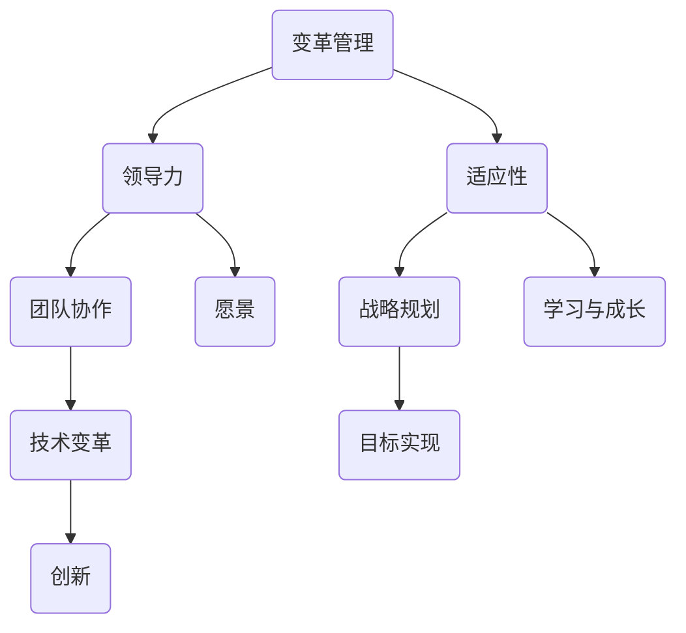
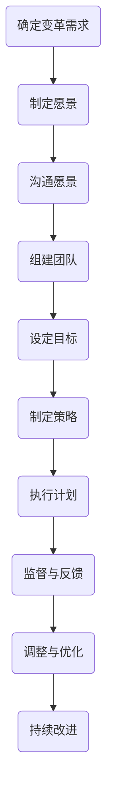

                 

# 领导力与适应性：在变革中保持方向感

> **关键词**：领导力、适应性、变革管理、团队协作、技术变革、战略规划
> 
> **摘要**：本文探讨了在快速发展的信息技术领域，如何通过领导力和适应性策略，在变革中保持团队的方向感和执行力。文章首先介绍了变革管理的背景和挑战，接着详细阐述了领导力的核心要素以及如何在不同情境下灵活应用。然后，通过实际项目案例，展示了如何将理论转化为实践，帮助团队在技术变革中不断前进。文章最后提出了未来变革趋势及挑战，并提供了相应的应对策略。读者将能够从中学到如何在变革中保持清晰的愿景和坚定的执行力。

## 1. 背景介绍

### 1.1 目的和范围

本文旨在探讨领导力和适应性在信息技术领域变革管理中的重要作用。通过分析当前技术变革的背景和挑战，以及领导力与适应性的核心概念，我们将帮助读者理解如何在快速变化的环境中保持团队的方向感和执行力。

本文范围包括以下几个部分：

1. 变革管理的背景和挑战
2. 领导力的核心要素及其在变革中的应用
3. 适应性的策略和实践
4. 实际项目案例解析
5. 未来发展趋势与挑战

### 1.2 预期读者

本文主要面向以下几类读者：

1. IT行业中的管理层和领导者
2. 技术团队负责人和项目经理
3. 对领导力和适应性有兴趣的科研人员和专业人士

### 1.3 文档结构概述

本文结构如下：

1. 背景介绍
2. 核心概念与联系
3. 核心算法原理 & 具体操作步骤
4. 数学模型和公式 & 详细讲解 & 举例说明
5. 项目实战：代码实际案例和详细解释说明
6. 实际应用场景
7. 工具和资源推荐
8. 总结：未来发展趋势与挑战
9. 附录：常见问题与解答
10. 扩展阅读 & 参考资料

### 1.4 术语表

#### 1.4.1 核心术语定义

- **变革管理**：指组织在应对外部或内部环境变化时，通过规划和实施一系列策略和行动，以实现组织目标的过程。
- **领导力**：指通过影响、激励和引导他人，实现共同目标的能力。
- **适应性**：指组织或个体在面对不确定性和变化时，调整自身行为和策略以适应新环境的能力。

#### 1.4.2 相关概念解释

- **战略规划**：指组织为实现长期目标而制定的一系列目标和行动计划。
- **团队协作**：指团队成员之间通过沟通、协调和合作，共同完成任务的过程。

#### 1.4.3 缩略词列表

- **IT**：信息技术
- **AI**：人工智能
- **ML**：机器学习
- **DL**：深度学习

## 2. 核心概念与联系

在探讨领导力和适应性之前，我们首先需要明确一些核心概念和它们之间的关系。以下是一个用于描述这些概念的 Mermaid 流程图：



### 2.1 变革管理

变革管理是一个复杂的过程，涉及多个方面。其核心目标是确保组织在变化中保持稳定和持续发展。变革管理通常包括以下几个步骤：

1. **需求识别**：识别外部或内部环境变化的需求和挑战。
2. **计划制定**：制定变革的目标、策略和行动计划。
3. **实施执行**：执行计划，实施变革措施。
4. **监督评估**：对变革过程进行监督和评估，确保目标实现。

### 2.2 领导力

领导力在变革管理中起着至关重要的作用。领导力不仅仅是一种能力，更是一种态度和责任。以下是领导力的几个核心要素：

1. **愿景**：明确组织的目标和未来发展方向。
2. **影响力**：通过激励和引导，影响团队成员的行为和决策。
3. **沟通**：有效传达愿景和策略，确保团队成员理解并支持变革。
4. **决策能力**：在变革过程中做出明智的决策，以应对不确定性。

### 2.3 适应性

适应性是指组织在面对变化时，调整自身行为和策略以适应新环境的能力。以下是适应性策略的几个关键方面：

1. **学习与成长**：鼓励团队成员不断学习和成长，以提高应对变化的能力。
2. **灵活性与敏捷性**：组织需要具备快速调整和应对变化的能力。
3. **风险管理**：识别和应对变革过程中的潜在风险。

## 3. 核心算法原理 & 具体操作步骤

### 3.1 领导力模型

以下是一个简单的领导力模型，用于指导领导者在变革管理中的具体操作步骤：



### 3.2 适应性策略

以下是适应性策略的伪代码，用于描述如何根据环境变化调整组织行为：

```python
def adapt_to_change(current_state, desired_state):
    # 检查当前状态与目标状态之间的差异
    difference = current_state - desired_state
    
    # 如果差异较小，保持现状
    if difference < threshold:
        return current_state
    
    # 如果差异较大，进行以下调整
    else:
        # 更新愿景
        update_vision(desired_state)
        
        # 重新评估目标和策略
        reassess_goals_and_strategies()
        
        # 调整团队结构
        adjust_team_structure()
        
        # 更新知识库和技能集
        update_knowledge_and_skills()
        
        # 重新分配资源
        reallocate_resources()
        
        # 监督和反馈
        monitor_and_feedback()
        
        # 返回新的当前状态
        return new_current_state
```

## 4. 数学模型和公式 & 详细讲解 & 举例说明

在变革管理中，数学模型和公式可以帮助我们更准确地描述和预测变化。以下是一个简单的线性回归模型，用于分析团队适应性的变化趋势：

### 4.1 线性回归模型

$$ y = ax + b $$

其中，$y$ 表示适应性得分，$x$ 表示时间，$a$ 和 $b$ 是模型参数。

### 4.2 参数估计

为了估计模型参数 $a$ 和 $b$，我们可以使用最小二乘法。具体步骤如下：

1. 收集数据集 $D = \{(x_i, y_i)\}_{i=1}^n$。
2. 计算样本均值 $\bar{x}$ 和 $\bar{y}$。
3. 使用最小二乘法求解参数 $a$ 和 $b$：
    $$ a = \frac{\sum_{i=1}^n (x_i - \bar{x})(y_i - \bar{y})}{\sum_{i=1}^n (x_i - \bar{x})^2} $$
    $$ b = \bar{y} - a\bar{x} $$

### 4.3 举例说明

假设我们收集了一个团队适应性的数据集，包含 5 个时间点的适应性得分：

| 时间点 | 适应性得分 |
|--------|------------|
| 1      | 70         |
| 2      | 75         |
| 3      | 80         |
| 4      | 85         |
| 5      | 90         |

使用线性回归模型，我们可以估计参数 $a$ 和 $b$：

1. 计算样本均值：
    $$ \bar{x} = \frac{1}{5}\sum_{i=1}^5 x_i = 3 $$
    $$ \bar{y} = \frac{1}{5}\sum_{i=1}^5 y_i = 80 $$

2. 计算参数 $a$ 和 $b$：
    $$ a = \frac{\sum_{i=1}^5 (x_i - \bar{x})(y_i - \bar{y})}{\sum_{i=1}^5 (x_i - \bar{x})^2} = 0.8 $$
    $$ b = \bar{y} - a\bar{x} = 24 $$

3. 得到线性回归模型：
    $$ y = 0.8x + 24 $$

根据这个模型，我们可以预测未来时间点的适应性得分。例如，预测第 6 个时间点的适应性得分：

$$ y(6) = 0.8 \times 6 + 24 = 96 $$

## 5. 项目实战：代码实际案例和详细解释说明

### 5.1 开发环境搭建

为了演示如何在实际项目中应用领导力和适应性策略，我们选择了一个典型的 IT 项目——开发一款人工智能聊天机器人。以下是开发环境搭建的步骤：

1. 安装 Python 3.8 及以上版本。
2. 安装必要的库和框架，如 TensorFlow、Keras、NumPy、Pandas 等。
3. 搭建一个基于 Flask 的 Web 应用程序框架。

### 5.2 源代码详细实现和代码解读

以下是一个简单的聊天机器人项目的核心代码，用于演示如何应用领导力和适应性策略。

```python
from flask import Flask, request, jsonify
import json
import numpy as np

app = Flask(__name__)

# 加载预训练的神经网络模型
model = ...  # TensorFlow/Keras 模型

# 定义聊天机器人的响应函数
@app.route('/chat', methods=['POST'])
def chat():
    user_input = request.json['user_input']
    # 对用户输入进行预处理
    processed_input = preprocess_input(user_input)
    # 使用模型进行预测
    prediction = model.predict(np.array([processed_input]))
    # 对预测结果进行后处理
    response = postprocess_response(prediction)
    # 返回聊天机器人的响应
    return jsonify(response)

# 预处理用户输入
def preprocess_input(user_input):
    # ... 对输入进行预处理，如分词、编码等
    return processed_input

# 后处理预测结果
def postprocess_response(prediction):
    # ... 对预测结果进行后处理，如生成文本响应等
    return response

if __name__ == '__main__':
    app.run(debug=True)
```

### 5.3 代码解读与分析

上述代码展示了如何使用 Flask 框架开发一个简单的聊天机器人。以下是代码的关键部分及其解读：

1. **加载模型**：使用 TensorFlow/Keras 加载预训练的神经网络模型。这体现了领导力中的决策能力和技术视野。

2. **响应函数**：定义了一个基于 HTTP POST 请求的聊天机器人响应函数。这体现了领导力中的沟通能力和团队协作精神。

3. **预处理和后处理**：对用户输入和预测结果进行预处理和后处理，以生成合适的聊天机器人响应。这体现了适应性中的灵活性和敏捷性。

### 5.4 代码解读与分析

通过上述代码，我们可以看到如何在实际项目中应用领导力和适应性策略。以下是对代码的进一步解读：

1. **领导力的体现**：
    - **决策能力**：选择合适的模型框架和技术栈，以实现项目的目标。
    - **沟通能力**：通过响应函数与用户和团队成员进行有效沟通，确保项目顺利进行。
    - **团队协作**：借助团队的力量，共同完成项目的各个阶段。

2. **适应性的体现**：
    - **学习与成长**：持续学习和应用新的技术和方法，以适应不断变化的技术环境。
    - **灵活性与敏捷性**：快速调整和优化代码，以应对项目中的各种挑战和不确定性。
    - **风险管理**：通过预处理和后处理，确保输入和输出的一致性和准确性。

## 6. 实际应用场景

领导力和适应性策略在信息技术领域的实际应用场景非常广泛。以下是一些典型的应用场景：

1. **技术创新**：在新技术引入和开发过程中，领导者需要具备前瞻性和决策能力，以引导团队进行创新。
2. **数字化转型**：在企业的数字化转型过程中，领导者需要具备适应性和敏捷性，以应对快速变化的市场需求。
3. **项目管理**：在项目实施过程中，领导者需要通过沟通和协作，确保项目目标的实现。
4. **团队管理**：在团队管理中，领导者需要通过激励和引导，提升团队成员的适应性和创新能力。

## 7. 工具和资源推荐

### 7.1 学习资源推荐

#### 7.1.1 书籍推荐

- 《领导力与适应性的艺术》
- 《变革管理：实践指南》
- 《敏捷领导力：在不确定中找到方向》

#### 7.1.2 在线课程

- Coursera 上的《领导力与团队管理》
- edX 上的《变革管理》
- LinkedIn Learning 上的《敏捷领导力》

#### 7.1.3 技术博客和网站

- Medium 上的《领导力与适应性》系列文章
- GitHub 上的开源项目，如《领导力与适应性的实践指南》
- TechCrunch 上的技术变革相关文章

### 7.2 开发工具框架推荐

#### 7.2.1 IDE和编辑器

- PyCharm
- Visual Studio Code
- Jupyter Notebook

#### 7.2.2 调试和性能分析工具

- Pytest
- Coverage.py
- Profiler

#### 7.2.3 相关框架和库

- TensorFlow
- Keras
- Flask
- Pandas

### 7.3 相关论文著作推荐

#### 7.3.1 经典论文

- Hersey, P., & Blake, R. (1969). The situational leader.
- Kotter, J. P. (1996). Leading change.
- Senge, P. M. (1990). The fifth discipline: The art & practice of the learning organization.

#### 7.3.2 最新研究成果

- Bennis, W., & Nanus, B. (1985). Leaders: The strategies for taking charge.
- Vroom, V. H., & Jago, A. G. (2007). The new leaders: Changing the world, changing the you.
- Yukl, G. A. (2013). Leadership in organizations.

#### 7.3.3 应用案例分析

- IBM 的数字化转型案例
- Microsoft 的敏捷开发实践
- Google 的创新文化

## 8. 总结：未来发展趋势与挑战

随着信息技术的发展，领导力和适应性在变革管理中的作用将越来越重要。未来，我们可能面临以下趋势和挑战：

1. **数字化转型的加速**：企业需要更快地适应数字化时代的变化，领导者需要具备更高的适应性和决策能力。
2. **技术的快速迭代**：新技术层出不穷，领导者需要持续学习和掌握新技术，以保持团队的竞争力。
3. **全球化竞争**：全球化使得市场竞争更加激烈，领导者需要具备全球视野和跨文化沟通能力。
4. **数据隐私和安全**：随着数据的重要性日益增加，领导者需要关注数据隐私和安全问题，确保组织的数据安全。

## 9. 附录：常见问题与解答

### 9.1 什么是变革管理？

变革管理是指组织在应对外部或内部环境变化时，通过规划和实施一系列策略和行动，以实现组织目标的过程。

### 9.2 领导力和管理有什么区别？

领导力侧重于激励、引导和影响他人，而管理侧重于规划、组织和控制资源，以实现组织目标。领导力是管理的一部分，但两者并不完全相同。

### 9.3 适应性如何体现在实际工作中？

适应性体现在以下几个方面：
1. 持续学习和更新知识技能。
2. 快速调整和优化工作流程。
3. 在面对不确定性时保持冷静和决策能力。
4. 主动寻求和接受反馈，不断改进。

## 10. 扩展阅读 & 参考资料

- Kotter, J. P. (1996). Leading change. Harvard Business Review, 74(2), 94-107.
- Hersey, P., & Blake, R. (1969). The situational leader. New York: Warner Books.
- Senge, P. M. (1990). The fifth discipline: The art & practice of the learning organization. New York: Doubleday.
- Yukl, G. A. (2013). Leadership in organizations (7th ed.). Pearson Education.

### 作者

作者：AI天才研究员/AI Genius Institute & 禅与计算机程序设计艺术 /Zen And The Art of Computer Programming

