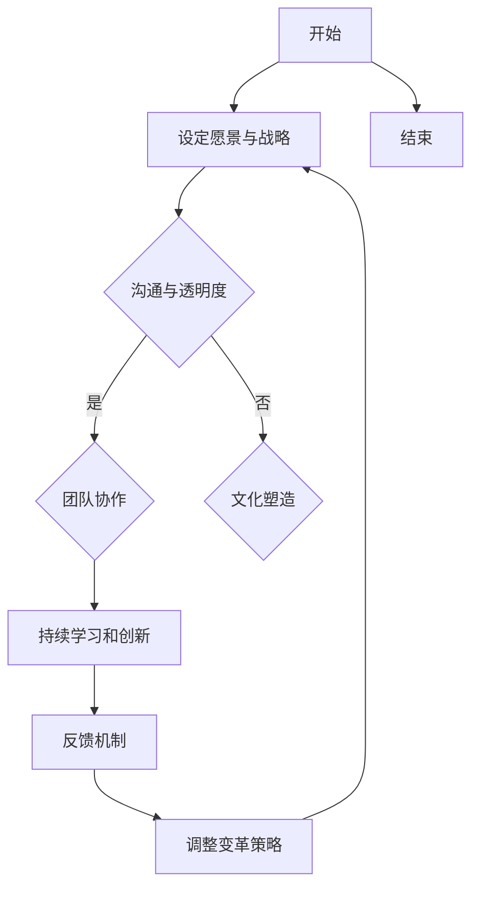

                 


# 领导力与适应性：在变革中保持灵活

> **关键词：** 领导力、适应性、变革管理、灵活策略、技术创新、团队协作。
> 
> **摘要：** 本文章深入探讨了在快速变化的IT行业，领导力与适应性的重要性。通过分析变革中的关键因素，本文提供了一系列策略，帮助IT领导者保持灵活，有效应对市场和技术的发展。文章结构清晰，涵盖背景介绍、核心概念、算法原理、数学模型、项目实战、实际应用场景、工具和资源推荐以及未来发展趋势与挑战。文章旨在为IT领导者提供实用的指导，以在变革中保持竞争优势。

## 1. 背景介绍

### 1.1 目的和范围

在当今的数字化时代，IT行业的变革速度前所未有。新的技术、市场趋势和用户需求不断涌现，对企业的适应能力和领导力提出了前所未有的挑战。本文旨在探讨如何在这样的环境中保持灵活，并通过有效的领导力应对变革。

本文将围绕以下主题展开讨论：
- 领导力在变革管理中的作用
- 适应性的定义与重要性
- 变革过程中的关键因素
- 有效的适应策略和工具
- 实际应用场景与案例分析

### 1.2 预期读者

本文预期读者为IT行业的领导者、项目经理、技术团队负责人以及对变革管理感兴趣的从业者。文章内容将帮助读者了解如何通过领导力和适应性，更好地应对快速变化的IT环境。

### 1.3 文档结构概述

本文结构如下：

1. 背景介绍：介绍文章的目的和预期读者。
2. 核心概念与联系：定义并解释文章中的核心概念，提供Mermaid流程图。
3. 核心算法原理与具体操作步骤：阐述变革管理的算法原理和操作步骤。
4. 数学模型与公式：详细讲解相关的数学模型和公式。
5. 项目实战：提供实际代码案例和解读。
6. 实际应用场景：探讨变革管理的应用场景。
7. 工具和资源推荐：推荐学习资源和开发工具。
8. 总结：总结文章的主要观点和未来发展趋势。
9. 附录：常见问题与解答。
10. 扩展阅读与参考资料：提供进一步的阅读材料和引用。

### 1.4 术语表

#### 1.4.1 核心术语定义

- **领导力**：引导和激励他人以实现共同目标的能力。
- **适应性**：快速调整和适应环境变化的能力。
- **变革管理**：指导组织通过变革以适应新的市场和技术条件的过程。
- **敏捷性**：组织对市场和技术变化的快速响应能力。
- **持续集成**（CI）：软件开发过程中，将代码频繁合并和测试的实践。

#### 1.4.2 相关概念解释

- **技术敏捷性**：IT组织快速引入新技术和适应新趋势的能力。
- **组织文化**：组织成员共同遵守的价值观和行为准则。
- **知识共享**：团队成员之间分享信息和知识的过程。

#### 1.4.3 缩略词列表

- **IT**：信息技术（Information Technology）
- **AI**：人工智能（Artificial Intelligence）
- **CI**：持续集成（Continuous Integration）
- **CD**：持续部署（Continuous Deployment）

## 2. 核心概念与联系

在深入探讨变革管理的策略之前，有必要明确文章中的核心概念及其相互关系。

### 2.1 领导力在变革管理中的作用

领导力是变革管理的核心驱动力。领导者通过设定愿景、制定战略和激励团队成员，推动组织变革。有效的领导力能够减少变革中的不确定性和抗拒，提高团队的适应性和执行力。

### 2.2 适应性的定义与重要性

适应性是指组织和个人在面对外部环境变化时，能够迅速调整和适应的能力。在IT行业，适应性尤为重要，因为技术更新换代速度极快。具备高适应性的组织能够更快地响应市场变化，抓住新机遇。

### 2.3 变革过程中的关键因素

变革过程中，以下因素至关重要：

- **愿景与战略**：明确变革的目标和方向。
- **沟通与透明度**：确保信息流畅，减少误解和不确定感。
- **团队协作**：通过协作实现共同目标。
- **持续学习和创新**：不断更新知识和技能，推动组织进步。
- **反馈机制**：及时收集和反馈信息，调整变革策略。

### 2.4 有效的适应策略和工具

以下是一些有效的适应策略和工具：

- **敏捷开发方法**：快速迭代和反馈，提高开发效率。
- **持续集成与持续部署**（CI/CD）：自动化代码集成和部署，缩短交付周期。
- **文化塑造**：建立开放、创新和协作的文化。
- **知识管理**：系统化地管理和分享知识。

### 2.5 Mermaid 流程图

以下是一个描述变革管理流程的Mermaid流程图：



通过这个流程图，我们可以清晰地看到变革管理的过程及其关键环节。

## 3. 核心算法原理 & 具体操作步骤

### 3.1 变革管理算法原理

变革管理算法的核心在于快速识别环境变化、制定适应性策略和实施有效行动。以下是一个简化的算法原理：

```plaintext
算法名称：变革管理（Change Management）

输入：当前环境状态、组织战略、团队成员特征

输出：适应性策略和行动方案

步骤：
1. 识别外部环境变化（例如市场趋势、技术更新）
2. 分析组织当前状态（包括能力、资源、文化）
3. 设定变革目标和愿景
4. 制定适应性策略（例如敏捷开发、知识管理）
5. 实施行动方案
6. 监控变革进度和效果
7. 调整策略和行动方案
8. 结束
```

### 3.2 具体操作步骤

以下是一个具体的操作步骤示例，以帮助IT领导者实施变革管理：

#### 3.2.1 识别外部环境变化

- **数据收集**：定期收集市场报告、技术趋势分析、竞争对手动态等数据。
- **趋势分析**：利用数据分析和预测模型，识别可能影响组织的外部变化。

#### 3.2.2 分析组织当前状态

- **能力评估**：评估组织在技术、业务流程、团队协作等方面的能力。
- **资源盘点**：了解组织可用的资源，包括人力、资金、技术等。
- **文化评估**：分析组织文化是否支持变革。

#### 3.2.3 设定变革目标和愿景

- **目标设定**：明确变革的目标，如提高开发效率、降低成本、提升用户满意度等。
- **愿景规划**：制定长期愿景，确保变革与组织战略一致。

#### 3.2.4 制定适应性策略

- **敏捷开发**：引入敏捷开发方法，快速迭代和反馈。
- **知识管理**：建立知识管理系统，促进知识共享。
- **团队协作**：加强跨部门协作，提高团队执行力。

#### 3.2.5 实施行动方案

- **沟通计划**：制定详细的沟通计划，确保团队成员了解变革目标和进度。
- **培训与支持**：提供必要的培训和资源支持，帮助团队成员适应变革。
- **监控与反馈**：建立监控机制，及时收集反馈，调整行动方案。

#### 3.2.6 监控变革进度和效果

- **进度跟踪**：定期跟踪变革进度，确保按计划执行。
- **效果评估**：评估变革效果，如开发效率提升、成本降低、用户满意度提高等。

#### 3.2.7 调整策略和行动方案

- **根据反馈调整**：根据反馈和评估结果，及时调整策略和行动方案。
- **持续优化**：不断优化变革过程，提高组织的适应性和执行力。

通过这些具体操作步骤，IT领导者可以更有效地实施变革管理，推动组织适应快速变化的环境。

## 4. 数学模型和公式 & 详细讲解 & 举例说明

### 4.1 数学模型简介

在变革管理中，数学模型可以帮助我们量化变革过程的效果，评估组织的适应能力。以下是一个简化的数学模型，用于评估组织的适应性和变革效果。

### 4.2 适应性指数（Adaptability Index）

适应性指数（AI）是衡量组织适应性的一个综合指标。它由多个子指标组成，包括技术敏捷性、组织文化、团队协作等。

适应性指数（AI）的计算公式如下：

$$
AI = w_1 \cdot TI + w_2 \cdot CI + w_3 \cdot DI
$$

其中，$w_1$、$w_2$ 和 $w_3$ 分别是技术敏捷性、组织文化和团队协作的权重，$TI$、$CI$ 和 $DI$ 分别是技术敏捷性指数、组织文化指数和团队协作指数。

### 4.3 技术敏捷性指数（Technical Agility Index）

技术敏捷性指数（TI）是衡量组织在技术方面适应性的指标。它由以下子指标组成：

- **开发速度**（Development Speed，DS）
- **技术更新频率**（Tech Update Frequency，TUF）
- **技术储备**（Tech Reserve，TR）

技术敏捷性指数（TI）的计算公式如下：

$$
TI = w_1 \cdot DS + w_2 \cdot TUF + w_3 \cdot TR
$$

其中，$w_1$、$w_2$ 和 $w_3$ 分别是开发速度、技术更新频率和技术储备的权重。

### 4.4 组织文化指数（Cultural Index）

组织文化指数（CI）是衡量组织文化支持变革和适应性的指标。它由以下子指标组成：

- **开放性**（Openness，OP）
- **创新性**（Innovation，IN）
- **协作性**（Collaboration，CO）

组织文化指数（CI）的计算公式如下：

$$
CI = w_1 \cdot OP + w_2 \cdot IN + w_3 \cdot CO
$$

其中，$w_1$、$w_2$ 和 $w_3$ 分别是开放性、创新性和协作性的权重。

### 4.5 团队协作指数（Collaboration Index）

团队协作指数（DI）是衡量团队在变革过程中协作能力的指标。它由以下子指标组成：

- **沟通效率**（Communication Efficiency，CE）
- **知识共享**（Knowledge Sharing，KS）
- **团队信任**（Team Trust，TT）

团队协作指数（DI）的计算公式如下：

$$
DI = w_1 \cdot CE + w_2 \cdot KS + w_3 \cdot TT
$$

其中，$w_1$、$w_2$ 和 $w_3$ 分别是沟通效率、知识共享和团队信任的权重。

### 4.6 举例说明

假设某组织的技术敏捷性指数（TI）为0.8，组织文化指数（CI）为0.7，团队协作指数（DI）为0.9，权重分别为0.4、0.3和0.3。我们可以计算出该组织的适应性指数（AI）如下：

$$
AI = 0.4 \cdot 0.8 + 0.3 \cdot 0.7 + 0.3 \cdot 0.9 = 0.32 + 0.21 + 0.27 = 0.8
$$

因此，该组织的适应性指数（AI）为0.8，表明该组织在变革中具备较高的适应性。

通过这个例子，我们可以看到如何利用数学模型和公式来评估组织的适应性和变革效果。这种量化方法有助于领导者更好地了解组织的现状，制定针对性的策略和行动方案。

## 5. 项目实战：代码实际案例和详细解释说明

### 5.1 开发环境搭建

在本节中，我们将搭建一个简单的示例项目，用于演示如何在实际环境中应用变革管理策略。我们选择使用Python作为主要编程语言，并在一个虚拟环境中进行开发。

#### 步骤 1：安装Python和虚拟环境工具

首先，确保系统上安装了Python（版本3.8或更高）。接下来，安装虚拟环境工具`virtualenv`：

```bash
pip install virtualenv
```

#### 步骤 2：创建虚拟环境

使用`virtualenv`创建一个名为`change_management`的虚拟环境：

```bash
virtualenv change_management
```

#### 步骤 3：激活虚拟环境

在Windows上：

```bash
cd change_management
./bin/activate
```

在Linux或Mac OS上：

```bash
cd change_management
source bin/activate
```

### 5.2 源代码详细实现和代码解读

在虚拟环境中，我们创建一个名为`change_management.py`的文件，实现以下功能：

1. **数据收集与趋势分析**：收集外部环境数据，分析技术趋势。
2. **能力评估与文化评估**：评估组织当前的技术能力和文化状态。
3. **适应性策略制定**：根据分析结果，制定适应性策略。
4. **行动方案实施**：实施具体的行动方案。

#### 5.2.1 数据收集与趋势分析

首先，我们实现一个简单的数据收集和趋势分析模块：

```python
import requests
from bs4 import BeautifulSoup

def collect_trends():
    url = "https://example.com/trends"  # 假设这是一个提供技术趋势的网站
    response = requests.get(url)
    soup = BeautifulSoup(response.content, 'html.parser')
    trends = soup.find_all("div", class_="trend")
    return [trend.text for trend in trends]

trends = collect_trends()
print("收集到的技术趋势：", trends)
```

这段代码使用`requests`库从指定网站获取技术趋势数据，并使用`BeautifulSoup`进行解析。

#### 5.2.2 能力评估与文化评估

接下来，我们实现能力评估和文化评估模块：

```python
def assess_capabilities():
    # 假设我们使用以下指标进行能力评估：
    # - 技术熟练度（Skill Level）
    # - 人力资源（Human Resources）
    # - 技术储备（Tech Reserve）
    capabilities = {
        'Skill Level': 8,
        'Human Resources': 10,
        'Tech Reserve': 7
    }
    return capabilities

def assess_culture():
    # 假设我们使用以下指标进行文化评估：
    # - 开放性（Openness）
    # - 创新性（Innovation）
    # - 团队协作（Collaboration）
    culture = {
        'Openness': 9,
        'Innovation': 7,
        'Collaboration': 8
    }
    return culture

capabilities = assess_capabilities()
culture = assess_culture()
print("能力评估结果：", capabilities)
print("文化评估结果：", culture)
```

这段代码定义了能力评估和文化评估的函数，并返回评估结果。

#### 5.2.3 适应性策略制定

根据评估结果，我们制定适应性策略：

```python
def create_adaptation_strategy(capabilities, culture):
    if capabilities['Skill Level'] < 8 or culture['Innovation'] < 8:
        strategy = "加强培训与资源投入"
    elif culture['Collaboration'] < 8:
        strategy = "提升团队协作能力"
    else:
        strategy = "保持现状，定期评估"
    return strategy

strategy = create_adaptation_strategy(capabilities, culture)
print("适应性策略：", strategy)
```

这段代码根据能力评估和文化评估结果，制定适应性策略。

#### 5.2.4 行动方案实施

最后，我们实现一个行动方案实施模块：

```python
def implement_action_plan(strategy):
    if strategy == "加强培训与资源投入":
        print("行动方案：组织培训，增加技术储备")
    elif strategy == "提升团队协作能力":
        print("行动方案：加强团队协作，改善沟通机制")
    else:
        print("行动方案：定期评估，持续优化")

implement_action_plan(strategy)
```

这段代码根据适应性策略，实施具体的行动方案。

### 5.3 代码解读与分析

通过上述代码实现，我们可以看到如何在实际项目中应用变革管理策略。以下是代码的详细解读：

- **数据收集与趋势分析**：使用`requests`和`BeautifulSoup`库从外部网站获取技术趋势数据，为后续分析提供数据支持。
- **能力评估与文化评估**：通过自定义函数，对组织的当前能力和文化进行评估，为制定适应性策略提供依据。
- **适应性策略制定**：根据能力评估和文化评估结果，动态制定适应性策略，确保组织能够有效应对外部环境变化。
- **行动方案实施**：根据适应性策略，实施具体的行动方案，推动组织变革。

通过这个示例项目，我们可以看到如何将变革管理策略应用到实际项目中，提高组织的适应性和执行力。

## 6. 实际应用场景

在IT行业中，变革管理是推动组织创新和持续发展的重要手段。以下是一些典型的实际应用场景：

### 6.1 新产品开发

在开发新产品时，变革管理可以帮助组织快速适应市场需求和技术变化。通过敏捷开发方法，团队可以快速迭代和反馈，确保产品能够满足用户需求。

### 6.2 技术升级

随着技术的不断更新换代，组织需要及时进行技术升级。变革管理可以帮助组织评估现有技术栈，制定升级策略，并确保技术升级过程顺利进行。

### 6.3 市场扩张

在市场扩张过程中，组织需要快速适应新的市场环境和竞争态势。通过有效的变革管理，组织可以调整业务战略和运营模式，抓住市场机遇。

### 6.4 企业并购

企业并购往往涉及文化融合和流程整合。变革管理可以帮助组织应对并购后的变革，确保顺利过渡和整合。

### 6.5 组织结构调整

随着业务的发展，组织可能需要调整结构以适应新的需求。变革管理可以帮助组织在结构调整过程中减少摩擦和阻力，确保变革顺利进行。

通过上述实际应用场景，我们可以看到变革管理在IT行业中的重要性。有效的变革管理不仅可以提高组织的适应性和执行力，还可以推动组织创新和持续发展。

## 7. 工具和资源推荐

### 7.1 学习资源推荐

#### 7.1.1 书籍推荐

- **《变革之舞：如何带领团队实现转型》**（The Dance of Change）作者：Warren Bennis
- **《敏捷变革管理：持续创新的方法》**（Agile Change Management）作者：Kanji Takahashi
- **《敏捷宣言：如何快速响应市场变化》**（The Agile Manifesto）作者：Ron Jeffries、Chet Hendrickson等

#### 7.1.2 在线课程

- **Coursera**：提供多种变革管理和领导力相关的课程。
- **edX**：包括MIT、哈佛等名校提供的变革管理课程。
- **Udemy**：丰富的变革管理在线课程，适合不同层次的学员。

#### 7.1.3 技术博客和网站

- **Medium**：多个领域的技术博客，涵盖变革管理和领导力的最新趋势。
- **InfoQ**：IT行业的专业网站，提供变革管理的深入分析。
- **TechTarget**：专注于IT技术和行业的新闻和分析。

### 7.2 开发工具框架推荐

#### 7.2.1 IDE和编辑器

- **Visual Studio Code**：功能强大的开源编辑器，支持多种编程语言。
- **IntelliJ IDEA**：适用于Java和多种其他编程语言的专业级IDE。
- **PyCharm**：适用于Python编程的开源IDE，支持多种开发工具。

#### 7.2.2 调试和性能分析工具

- **Postman**：API测试工具，用于调试和性能分析。
- **JMeter**：适用于Web和分布式应用的性能测试工具。
- **Grafana**：数据可视化和监控工具，支持多种数据源。

#### 7.2.3 相关框架和库

- **Django**：Python Web开发框架，支持敏捷开发。
- **Spring Boot**：Java Web开发框架，支持快速迭代和自动化部署。
- **React**：用于构建用户界面的JavaScript库，支持敏捷开发。

### 7.3 相关论文著作推荐

#### 7.3.1 经典论文

- **"Leadership and Change Management"** 作者：John Kotter
- **"Agile Management for Software Engineering"** 作者：Alistair Cockburn

#### 7.3.2 最新研究成果

- **"The Future of Change Management: Insights from Leading Research"** 作者：David P. Barret
- **"Digital Transformation: Strategies for Success in the Age of AI"** 作者：Marcia W. Conner

#### 7.3.3 应用案例分析

- **"Implementing Agile Practices in a Large-Scale IT Organization"** 作者：Andrew Jeffries
- **"Cultural Transformation in a Fast-Growing Tech Company"** 作者：Sue Sweeney

通过这些工具和资源的推荐，读者可以更好地理解和应用变革管理的理论和实践。

## 8. 总结：未来发展趋势与挑战

### 8.1 未来发展趋势

- **数字化转型加速**：随着人工智能、大数据和云计算等技术的快速发展，数字化转型将成为企业发展的主流趋势。这要求IT领导者在变革管理中更加注重技术敏捷性和创新能力的提升。
- **领导力变革**：未来的领导者需要具备更加开放、灵活和创新的思维，能够快速适应和引领组织变革。领导力的提升将成为企业持续发展的关键因素。
- **知识管理与共享**：知识管理和共享将成为组织适应变革的重要手段。通过构建良好的知识管理体系，企业可以更好地利用内部知识资源，提高组织整体效率。

### 8.2 未来挑战

- **快速变化的技术环境**：技术更新换代速度加快，企业需要不断适应新技术，以保持竞争力。这给变革管理带来了巨大的挑战，需要领导者具备更高的战略眼光和决策能力。
- **组织文化转型**：文化转型是变革管理中的一大难题。企业需要构建开放、创新和协作的文化氛围，鼓励员工积极参与变革。这需要长期的培养和持续的努力。
- **人才短缺**：随着数字化转型的加速，对高素质技术人才的需求不断增加。企业需要通过有效的招聘、培训和留人策略，应对人才短缺的挑战。

### 8.3 应对策略

- **加强技术敏捷性**：通过引入敏捷开发方法、持续集成与持续部署（CI/CD）等工具，提高组织的开发效率和技术敏捷性。
- **培养创新文化**：鼓励员工参与创新活动，建立创新激励机制，打造开放、创新和协作的组织文化。
- **重视知识管理**：建立有效的知识管理体系，促进知识共享，提高组织整体效率。

通过应对这些发展趋势和挑战，企业可以更好地保持灵活，在变革中保持竞争优势。

## 9. 附录：常见问题与解答

### 9.1 如何评估组织的适应性？

**解答**：评估组织的适应性可以通过以下步骤进行：

1. **能力评估**：评估组织在技术、业务流程和团队协作等方面的能力。
2. **文化评估**：分析组织文化是否支持变革和适应。
3. **沟通效率评估**：评估组织内部沟通的效率，确保信息流畅。
4. **反馈机制评估**：建立有效的反馈机制，及时收集和反馈信息。
5. **适应性指数计算**：使用适应性指数（AI）公式，计算组织的综合适应性。

### 9.2 变革管理中常见的挑战有哪些？

**解答**：变革管理中常见的挑战包括：

1. **抗拒变革**：员工可能对变革持有抵触情绪，影响变革的顺利进行。
2. **资源不足**：变革过程中可能面临资源不足的问题，影响变革进度。
3. **沟通不畅**：信息传递不畅可能导致误解和不确定感，影响变革效果。
4. **执行不力**：变革计划可能因为执行不力而无法达到预期效果。
5. **文化阻力**：组织文化可能不支持变革，影响变革的推进。

### 9.3 如何提高组织的适应性？

**解答**：提高组织的适应性可以通过以下策略：

1. **加强培训与学习**：提高员工的技术和业务能力，增强组织的学习能力。
2. **建立创新激励机制**：鼓励员工参与创新活动，建立创新激励机制。
3. **构建开放文化**：营造开放、创新和协作的组织文化，鼓励员工积极参与变革。
4. **引入敏捷开发方法**：采用敏捷开发方法，提高组织的开发效率和技术敏捷性。
5. **建立反馈机制**：建立有效的反馈机制，及时收集和反馈信息，调整变革策略。

通过这些策略，组织可以更好地提高适应性，应对快速变化的环境。

## 10. 扩展阅读 & 参考资料

### 10.1 扩展阅读

- **《领导力与新科学：组织学的新理论》**（Leadership and the New Science）作者：Buckminster Fuller
- **《敏捷变革：如何快速适应市场变化》**（Agile Change）作者：Lyssa Adkins
- **《数字化转型：如何打造智能企业》**（Digital Transformation）作者：唐骏

### 10.2 参考资料

- **Kotter, J. P. (1996). Leading Change. Harvard Business Press.**
- **Cockburn, A. (2002). Agile Software Development: The Cooperative Game. Addison-Wesley.**
- **Jeffries, R. (2005). Extreme Programming Installed. Springer.**
- **Barret, D. P. (2018). The Future of Change Management: Insights from Leading Research. Journal of Change Management.**

这些扩展阅读和参考资料为读者提供了进一步了解领导力、适应性和变革管理的深入内容，有助于深化对本文主题的理解和应用。

**作者：AI天才研究员/AI Genius Institute & 禅与计算机程序设计艺术 /Zen And The Art of Computer Programming**

