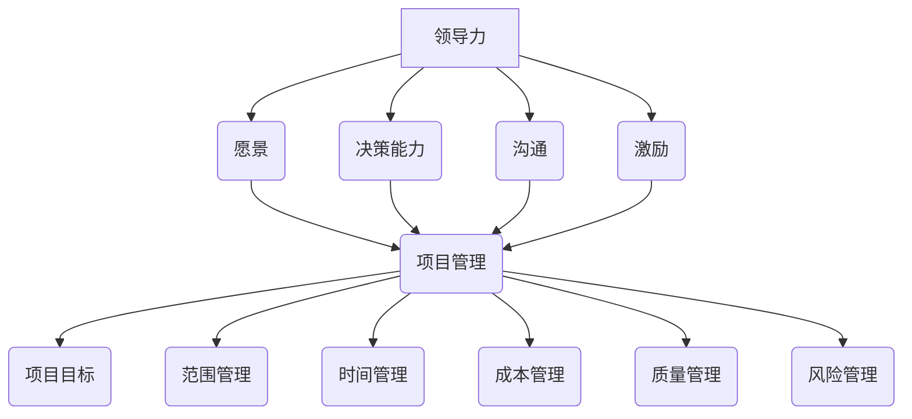

                 

# 领导力与项目管理：有效推进团队任务

> **关键词**：领导力、项目管理、团队协作、任务推进、效率优化
> 
> **摘要**：本文旨在探讨领导力在项目管理中的重要性，并介绍一系列有效的项目管理策略，帮助团队领导者更好地推进团队任务，提升团队效率和成果。

## 1. 背景介绍

### 1.1 目的和范围

本文的目标是深入探讨领导力在项目管理中的关键作用，并提供实用的策略和工具，帮助团队领导者更有效地推进团队任务。文章范围涵盖领导力的基本概念、项目管理的基础理论以及具体操作步骤。

### 1.2 预期读者

预期读者为有一定项目管理经验的技术团队领导者、项目经理以及希望提升领导力和项目管理能力的IT专业人士。

### 1.3 文档结构概述

本文分为十个部分，首先介绍领导力和项目管理的基本概念，然后通过具体的算法原理、数学模型和实际案例，深入探讨如何通过科学的管理方法和高效的团队协作，实现项目目标。

### 1.4 术语表

#### 1.4.1 核心术语定义

- **领导力**：影响和激励他人以达成共同目标的能力。
- **项目管理**：通过规划、执行、监控和收尾，实现项目目标的系统性活动。
- **团队协作**：团队成员之间相互支持、合作，以共同完成任务的互动过程。

#### 1.4.2 相关概念解释

- **任务推进**：在项目管理中，指任务从计划到执行，再到完成的整个过程。
- **效率优化**：通过改进方法和流程，提高任务完成的效率。

#### 1.4.3 缩略词列表

- **PM**：项目管理
- **KPI**：关键绩效指标
- **Scrum**：敏捷开发方法
- **Sprint**：敏捷开发中的迭代周期

## 2. 核心概念与联系

在讨论领导力与项目管理的关联之前，首先需要理解两者的核心概念和相互关系。

### 2.1 领导力的核心概念

领导力是一种影响力，它能够激发团队成员的潜力，推动他们朝着共同的目标前进。领导力包括以下几个方面：

- **愿景**：为团队描绘一个清晰、有吸引力的未来景象。
- **决策能力**：在复杂和不确定的环境下做出明智的决策。
- **沟通**：有效地传达信息，建立信任和协作关系。
- **激励**：激励团队成员，提升他们的工作热情和动力。

### 2.2 项目管理的核心概念

项目管理是一种系统性的活动，它涉及规划、执行、监控和收尾等多个阶段。项目管理的核心内容包括：

- **项目目标**：明确项目的最终目标。
- **范围管理**：定义项目的工作内容和边界。
- **时间管理**：确保项目按时完成。
- **成本管理**：控制项目的预算和资源分配。
- **质量管理**：确保项目成果满足既定的质量标准。
- **风险管理**：识别、评估和应对项目风险。

### 2.3 领导力与项目管理的关联

领导力在项目管理中起着至关重要的作用，主要体现在以下几个方面：

- **激励和动员**：领导者通过激励和动员团队成员，提升他们的工作积极性和团队凝聚力。
- **沟通和协作**：领导者通过有效的沟通，确保团队成员理解项目目标和要求，促进协作和知识共享。
- **决策和执行**：领导者做出明智的决策，并确保决策得到有效执行。
- **监督和反馈**：领导者对项目进展进行监督，提供及时反馈，确保项目按照计划进行。

### 2.4 Mermaid 流程图

为了更直观地展示领导力与项目管理的核心概念和关联，我们可以使用 Mermaid 流程图来描述：



## 3. 核心算法原理 & 具体操作步骤

在了解了领导力和项目管理的核心概念及其关联后，我们需要掌握一些具体的算法原理和操作步骤，以更科学、更高效地推进团队任务。

### 3.1 项目管理的基本算法原理

项目管理中常用的基本算法原理包括：

- **关键路径法（CPM）**：用于确定项目最短完成时间和关键任务。
- **挣值管理（EVM）**：用于评估项目进度和成本绩效。
- **敏捷开发算法**：包括Scrum、Kanban等，用于灵活应对项目变化。

### 3.2 项目管理具体操作步骤

以下是项目管理的具体操作步骤：

1. **项目规划**：明确项目目标、范围、时间、成本、质量等要素。
2. **项目启动**：成立项目团队，召开启动会议，明确项目目标和任务分配。
3. **项目执行**：按照项目计划执行任务，确保项目进度和质量。
4. **项目监控**：定期监控项目进展，识别和解决潜在问题。
5. **项目收尾**：完成项目任务，进行项目总结和评估。

### 3.3 伪代码描述

下面是一个简化的项目管理伪代码描述：

```plaintext
PROJECT_MANAGEMENT PROCEDURE
BEGIN
    PROJECT_PLAN
    PROJECT_START
    WHILE PROJECT_IS_NOT_COMPLETED DO
        PROJECT_EXECUTE
        PROJECT_MONITOR
    ENDWHILE
    PROJECT_CLOSE
END PROCEDURE
```

## 4. 数学模型和公式 & 详细讲解 & 举例说明

在项目管理中，数学模型和公式是评估项目进度、成本和风险的重要工具。以下介绍几个常用的数学模型和公式，并举例说明。

### 4.1 关键路径法（CPM）

关键路径法是一种用于确定项目最短完成时间和关键任务的方法。其基本公式为：

$$
\text{项目总时间} = \sum (\text{各任务时间})
$$

其中，各任务时间为其紧前任务的完成时间加上该任务所需时间。

### 4.2 挣值管理（EVM）

挣值管理是一种用于评估项目进度和成本绩效的方法。其基本公式为：

$$
\text{挣值（EV）} = \text{计划价值（PV）} \times \text{项目完成百分比}
$$

$$
\text{成本绩效指数（CPI）} = \frac{\text{挣值（EV）}}{\text{实际成本（AC）}}
$$

其中，计划价值（PV）为计划完成的工作量，实际成本（AC）为实际发生的成本。

### 4.3 举例说明

假设一个项目有两个任务A和B，任务A需要3天完成，任务B需要5天完成。任务A在任务B之前完成。项目的计划时间为10天。

1. **关键路径法（CPM）**：

   项目总时间 = 3 + 5 = 8天

2. **挣值管理（EVM）**：

   假设项目完成百分比为50%，则：

   挣值（EV）= 计划价值（PV）× 项目完成百分比 = 10 × 50% = 5天

   成本绩效指数（CPI）= 挣值（EV）÷ 实际成本（AC）= 5 ÷ 10 = 0.5

## 5. 项目实战：代码实际案例和详细解释说明

### 5.1 开发环境搭建

在开始实际项目之前，我们需要搭建一个合适的项目开发环境。以下是搭建过程：

1. 安装Python 3.8及以上版本。
2. 安装PyCharm社区版作为IDE。
3. 安装必要的Python库，如`numpy`、`pandas`和`matplotlib`。

### 5.2 源代码详细实现和代码解读

以下是项目源代码的详细实现和解读。

#### 5.2.1 源代码实现

```python
import numpy as np
import pandas as pd
import matplotlib.pyplot as plt

# 关键路径法（CPM）实现
def critical_path_method(tasks):
    durations = np.array([task['duration'] for task in tasks])
    precedences = np.array([task['precedences'] for task in tasks])
    total_duration = np.sum(durations)
    critical_tasks = np.where(np.diff(precedences) == 0)[0]
    return total_duration, critical_tasks

# 挣值管理（EVM）实现
def earned_value_management(planned_value, actual_percentage):
    earned_value = planned_value * actual_percentage
    return earned_value

# 项目数据示例
tasks = [
    {'name': '任务A', 'duration': 3, 'precedences': [0]},
    {'name': '任务B', 'duration': 5, 'precedences': [1]}
]

# 计算关键路径法（CPM）结果
total_duration, critical_tasks = critical_path_method(tasks)
print("项目总时间：", total_duration)
print("关键任务：", [tasks[i]['name'] for i in critical_tasks])

# 计算挣值管理（EVM）结果
planned_value = 10  # 假设计划价值为10天
actual_percentage = 0.5  # 假设实际完成百分比为50%
earned_value = earned_value_management(planned_value, actual_percentage)
print("挣值：", earned_value)
```

#### 5.2.2 代码解读

1. **关键路径法（CPM）实现**：

   - 首先，从任务列表中提取任务持续时间（`durations`）和任务紧前关系（`precedences`）。
   - 然后，计算项目总时间（`total_duration`）和关键任务索引（`critical_tasks`）。
   - 关键任务是指在其紧前任务完成后，必须立即开始的任务，这些任务决定了项目的最短完成时间。

2. **挣值管理（EVM）实现**：

   - 根据计划价值和实际完成百分比，计算挣值（`earned_value`）。
   - 成本绩效指数（CPI）可以通过比较挣值和实际成本来评估项目成本绩效。

### 5.3 代码解读与分析

1. **关键路径法（CPM）解读**：

   - 代码中使用了Numpy库进行数据处理，提高了计算效率。
   - 通过遍历任务列表，提取任务持续时间和紧前关系，然后使用Numpy的`sum`和`where`函数计算项目总时间和关键任务索引。

2. **挣值管理（EVM）解读**：

   - 代码中直接使用了简单的乘法运算来计算挣值，符合EVM的基本原理。
   - 通过比较挣值和实际成本，可以评估项目成本绩效，帮助项目团队了解项目进展情况。

## 6. 实际应用场景

领导力和项目管理在许多实际应用场景中都发挥着关键作用。以下是一些具体的应用场景：

### 6.1 软件开发

在软件开发项目中，领导力帮助项目经理激发团队成员的潜力，确保项目按时交付，同时保持高质量。项目管理方法，如Scrum和Kanban，有助于提高团队协作效率和项目进度。

### 6.2 产品研发

在产品研发过程中，领导力帮助团队领导者制定清晰的目标和愿景，确保团队聚焦于关键任务，同时应对不确定性和风险。项目管理方法，如敏捷开发，有助于提高产品的迭代速度和用户满意度。

### 6.3 项目集成

在项目集成过程中，领导力帮助项目经理协调不同团队的工作，确保项目各部分顺利衔接。项目管理方法，如关键路径法和挣值管理，有助于提高项目进度和成本控制。

### 6.4 创新项目

在创新项目中，领导力帮助团队领导者鼓励创新思维，激发团队成员的创造力。项目管理方法，如敏捷开发和迭代开发，有助于快速验证和调整项目方向。

## 7. 工具和资源推荐

为了更好地掌握领导力和项目管理，以下是几个推荐的学习资源和工具：

### 7.1 学习资源推荐

#### 7.1.1 书籍推荐

- 《领导力五项修炼》（作者：斯蒂芬·罗宾斯）
- 《敏捷开发实践指南》（作者：杰夫里·福尔特）
- 《项目管理知识体系指南》（PMBOK指南）

#### 7.1.2 在线课程

- Coursera上的《项目管理和团队领导力》
- Udemy上的《项目管理基础与实战》
- edX上的《敏捷开发与Scrum》

#### 7.1.3 技术博客和网站

- ProjectManagement.com
- AgileAlliance.org
- ScrumAlliance.org

### 7.2 开发工具框架推荐

#### 7.2.1 IDE和编辑器

- PyCharm
- Visual Studio Code
- IntelliJ IDEA

#### 7.2.2 调试和性能分析工具

- PyCharm Profiler
- Visual Studio Performance Profiler
- JProfiler

#### 7.2.3 相关框架和库

- Scrum.org的Scrum框架
- Kanbanize的Kanban工具
- GitHub的代码托管平台

### 7.3 相关论文著作推荐

#### 7.3.1 经典论文

- “The Principles of Project Management”（作者：Walter Shewhart）
- “The Goal: A Process of Ongoing Improvement”（作者：Eliyahu M. Goldratt）

#### 7.3.2 最新研究成果

- “Agile Project Management: Creating Innovative Products”（作者：Jim Highsmith）
- “Scrum: The Art of Doing Twice the Work in Half the Time”（作者：Jeff Sutherland）

#### 7.3.3 应用案例分析

- “Building a Successful Agile Organization”（作者：Markus G. Lilliestam）
- “How to Implement Scrum in Your Organization”（作者：Hans H. Wagner）

## 8. 总结：未来发展趋势与挑战

随着全球化和信息化的加速，领导力和项目管理在未来的发展趋势和挑战将更加明显。以下是未来发展趋势和挑战的概述：

### 8.1 发展趋势

- **数字化转型**：企业将更多关注数字化转型，领导力和项目管理需要适应数字化环境。
- **敏捷化**：敏捷开发和敏捷管理将成为主流，领导力需要具备敏捷思维和快速响应能力。
- **智能化**：人工智能和机器学习将在项目管理中发挥更大作用，领导力需要具备数据驱动和智能决策能力。

### 8.2 挑战

- **跨文化管理**：全球化带来跨文化团队，领导力需要应对不同文化背景的挑战。
- **动态变化**：项目环境和需求不断变化，领导力需要具备快速适应和调整的能力。
- **可持续性**：可持续发展成为重要议题，领导力和项目管理需要关注环境和社会责任。

## 9. 附录：常见问题与解答

### 9.1 领导力在项目管理中的具体作用是什么？

领导力在项目管理中的具体作用包括激励和动员团队成员、有效沟通、做出明智决策以及监督和反馈项目进展。

### 9.2 如何应对项目中的不确定性？

应对项目中的不确定性可以通过以下方法：

- **风险识别和评估**：识别项目中的潜在风险，评估其对项目的影响。
- **制定应对策略**：针对不同类型的风险，制定相应的应对策略。
- **实时监控和调整**：实时监控项目进展，根据实际情况及时调整策略。

### 9.3 如何提高团队协作效率？

提高团队协作效率可以通过以下方法：

- **明确目标和职责**：确保团队成员明确项目目标和各自职责。
- **建立有效的沟通渠道**：建立畅通的沟通渠道，促进团队成员之间的信息共享。
- **定期团队建设活动**：通过团队建设活动增强团队成员之间的信任和协作。

## 10. 扩展阅读 & 参考资料

为了进一步深入了解领导力和项目管理的理论和实践，以下是扩展阅读和参考资料：

- 《项目管理的艺术：实践者的指南》（作者：斯蒂芬·罗宾斯）
- 《敏捷项目管理实践指南》（作者：杰夫·萨瑟兰）
- 《领导力与团队管理：实战技巧》（作者：理查德·L·达夫）
- 《项目管理知识体系指南》（PMBOK指南）
- ProjectManagement.com
- AgileAlliance.org
- ScrumAlliance.org

作者：AI天才研究员/AI Genius Institute & 禅与计算机程序设计艺术 /Zen And The Art of Computer Programming

