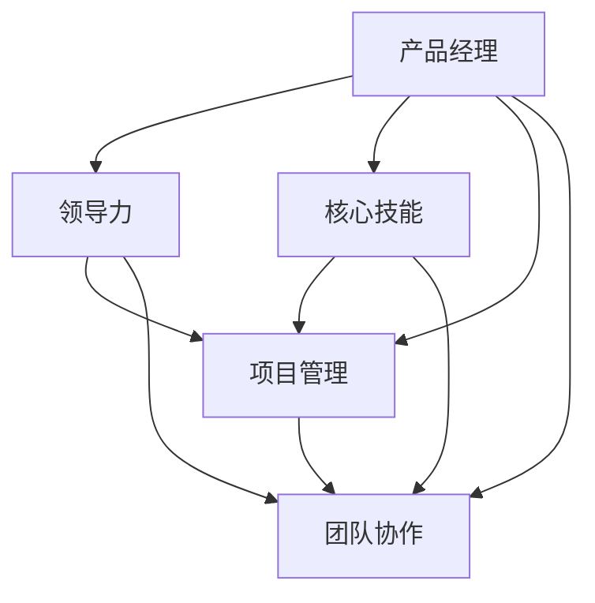
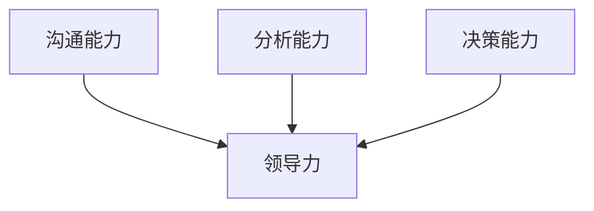

                 

# 领导力修炼日记：一个产品经理的成长之路

> **关键词：产品经理、领导力、成长路径、项目管理、技术技能、团队合作**
> 
> **摘要：本文通过一个产品经理的成长故事，详细阐述了领导力在产品管理中的关键作用。文章涵盖了产品经理所需的核心技能、领导力培养方法以及项目管理实践，旨在为产品经理提供一条清晰的成长之路，助力他们在职业发展中不断进阶。**

## 1. 背景介绍

### 1.1 目的和范围

本文旨在探讨产品经理如何在职场中提升领导力，实现个人和团队的双向成长。文章将以一个产品经理的成长经历为线索，从核心技能、领导力培养和项目管理实践三个方面展开，帮助读者理解领导力在产品管理中的重要性，并掌握提升领导力的方法。

### 1.2 预期读者

本文适合以下读者群体：

1. 初入职场的产品经理或有意从事产品管理工作的年轻人。
2. 在职产品经理，希望提升领导力和项目管理能力的专业人士。
3. 产品经理的导师或团队成员，希望了解如何培养和指导产品经理的领导者。

### 1.3 文档结构概述

本文结构如下：

1. 背景介绍：介绍文章的目的、预期读者和文档结构。
2. 核心概念与联系：阐述产品经理所需的核心技能和领导力的概念。
3. 核心算法原理 & 具体操作步骤：讲解产品经理在实际工作中如何运用领导力。
4. 数学模型和公式 & 详细讲解 & 举例说明：分析领导力在项目管理中的数学模型和实际应用。
5. 项目实战：通过实际案例展示领导力在项目中的应用。
6. 实际应用场景：探讨领导力在不同场景下的应用。
7. 工具和资源推荐：推荐有助于提升领导力和产品管理技能的工具和资源。
8. 总结：对未来发展趋势和挑战的展望。
9. 附录：常见问题与解答。
10. 扩展阅读 & 参考资料：提供进一步的阅读和参考资料。

### 1.4 术语表

#### 1.4.1 核心术语定义

1. **产品经理**：负责产品策略、规划和执行的高级管理人员。
2. **领导力**：影响和激励他人实现共同目标的能力。
3. **项目管理**：规划、执行、监控和控制项目的过程。
4. **团队协作**：团队成员之间相互合作，共同完成任务的协作过程。

#### 1.4.2 相关概念解释

1. **敏捷开发**：一种以用户需求为导向，快速迭代和反馈的软件开发方法。
2. **用户故事**：描述用户需求的一种简洁方式，通常由一个主语、一个动词和一个宾语组成。
3. **关键绩效指标（KPI）**：用于衡量产品绩效的具体指标。

#### 1.4.3 缩略词列表

- PM：Product Manager（产品经理）
- Agile：Agile Development（敏捷开发）
- UX：User Experience（用户体验）
- UI：User Interface（用户界面）

## 2. 核心概念与联系

为了更好地理解产品经理所需的领导力和核心技能，我们可以通过一个简化的 Mermaid 流程图来展示这些概念之间的联系。



### 2.1 领导力在产品管理中的重要性

领导力是产品经理成功的关键因素之一。一个优秀的领导力可以：

1. **激励团队**：激发团队成员的积极性和创造力，共同追求产品目标。
2. **协调资源**：合理分配资源，确保项目按计划推进。
3. **解决问题**：面对项目中的各种挑战和障碍，能够迅速找到解决方案。
4. **沟通与协作**：与团队成员、利益相关者和其他部门进行有效沟通，确保信息传递准确无误。
5. **推动创新**：鼓励团队成员不断尝试新的想法和解决方案，推动产品持续优化。

### 2.2 核心技能与领导力之间的联系

产品经理的核心技能，如沟通能力、分析能力和决策能力，都与领导力密切相关。以下是一个简化的 Mermaid 流程图，展示了这些技能与领导力之间的联系。



## 3. 核心算法原理 & 具体操作步骤

在实际工作中，产品经理需要运用多种领导力技巧来应对不同的挑战。以下是一个简化的伪代码，展示产品经理如何运用领导力解决常见问题。

```python
# 伪代码：产品经理运用领导力解决问题的步骤

function solve_problem(problem):
    # 分析问题
    analyze_problem(problem)
    # 激励团队
    motivate_team(problem)
    # 协调资源
    allocate_resources(problem)
    # 沟通与协作
    communicate_and_collaborate(problem)
    # 决策
    make_decision(problem)
    # 执行
    execute_decision(problem)
    # 监控与调整
    monitor_and_adjust(problem)

function analyze_problem(problem):
    # 收集相关信息
    collect_information(problem)
    # 确定问题根本原因
    identify_root_cause(problem)
    # 提出解决方案
    propose_solutions(problem)

function motivate_team(problem):
    # 设定明确目标
    set_clear_goals(problem)
    # 赞扬团队成员
    praise_team_members(problem)
    # 提供支持和资源
    provide_support_and_resources(problem)

function allocate_resources(problem):
    # 评估资源需求
    assess_resource_needs(problem)
    # 合理分配资源
    allocate_resources_equally(problem)

function communicate_and_collaborate(problem):
    # 定期会议
    hold_regular_meetings(problem)
    # 分享信息
    share_information(problem)
    # 促进协作
    promote_collaboration(problem)

function make_decision(problem):
    # 收集意见
    collect_opinions(problem)
    # 综合评估
    evaluate_options(problem)
    # 选择最佳方案
    choose_best_solution(problem)

function execute_decision(problem):
    # 分配任务
    assign_tasks(problem)
    # 监督执行
    supervise_execution(problem)

function monitor_and_adjust(problem):
    # 监控进度
    monitor_progress(problem)
    # 调整计划
    adjust_plan(problem)
```

### 3.1 分析问题

在解决问题之前，产品经理需要深入了解问题的本质。以下是一个简化的伪代码，展示如何分析问题。

```python
function analyze_problem(problem):
    # 收集相关信息
    information = collect_information(problem)
    # 确定问题根本原因
    root_cause = identify_root_cause(information)
    # 提出解决方案
    solutions = propose_solutions(root_cause)
    return solutions
```

### 3.2 激励团队

激励团队是领导力的重要组成部分。以下是一个简化的伪代码，展示如何激励团队。

```python
function motivate_team(problem):
    # 设定明确目标
    goals = set_clear_goals(problem)
    # 赞扬团队成员
    praise_team_members(goals)
    # 提供支持和资源
    support_and_resources = provide_support_and_resources(problem)
```

### 3.3 协调资源

合理分配资源是项目成功的关键。以下是一个简化的伪代码，展示如何协调资源。

```python
function allocate_resources(problem):
    # 评估资源需求
    needs = assess_resource_needs(problem)
    # 合理分配资源
    resources = allocate_resources_equally(needs)
```

### 3.4 沟通与协作

有效的沟通与协作有助于团队高效地解决问题。以下是一个简化的伪代码，展示如何沟通与协作。

```python
function communicate_and_collaborate(problem):
    # 定期会议
    meetings = hold_regular_meetings(problem)
    # 分享信息
    information = share_information(problem)
    # 促进协作
    collaboration = promote_collaboration(problem)
```

### 3.5 决策

在解决问题时，产品经理需要做出明智的决策。以下是一个简化的伪代码，展示如何决策。

```python
function make_decision(problem):
    # 收集意见
    opinions = collect_opinions(problem)
    # 综合评估
    evaluation = evaluate_options(opinions)
    # 选择最佳方案
    solution = choose_best_solution(evaluation)
    return solution
```

### 3.6 执行

决策后，产品经理需要确保决策得到有效执行。以下是一个简化的伪代码，展示如何执行决策。

```python
function execute_decision(problem):
    # 分配任务
    tasks = assign_tasks(problem)
    # 监督执行
    supervision = supervise_execution(problem)
```

### 3.7 监控与调整

在执行过程中，产品经理需要持续监控项目进度，并根据实际情况进行调整。以下是一个简化的伪代码，展示如何监控与调整。

```python
function monitor_and_adjust(problem):
    # 监控进度
    progress = monitor_progress(problem)
    # 调整计划
    plan = adjust_plan(progress)
```

## 4. 数学模型和公式 & 详细讲解 & 举例说明

领导力在项目管理中的应用，可以通过一些数学模型和公式来详细分析。以下是一个简化的模型，展示领导力在项目管理中的影响。

### 4.1 领导力-项目成功率的数学模型

我们可以使用以下公式来衡量领导力对项目成功率的影响：

$$
成功率 = f(领导力, 项目风险, 团队协作)
$$

其中：

- **成功率**：项目按计划成功完成的概率。
- **领导力**：产品经理的领导力水平。
- **项目风险**：项目面临的各种风险。
- **团队协作**：团队成员之间的协作程度。

### 4.2 领导力对项目成功率的影响分析

#### 4.2.1 领导力对项目风险的影响

领导力可以降低项目风险。具体而言，优秀的领导力可以帮助产品经理：

- **识别风险**：及时发现项目中的潜在风险。
- **评估风险**：准确评估风险对项目的影响。
- **制定应对策略**：制定有效的风险应对策略。

以下是一个简化的数学模型，展示领导力如何降低项目风险：

$$
项目风险 = f(领导力, 风险识别, 风险评估, 应对策略)
$$

#### 4.2.2 领导力对团队协作的影响

领导力可以促进团队协作。具体而言，优秀的领导力可以帮助产品经理：

- **建立共同目标**：确保团队成员有共同的目标和愿景。
- **激励团队成员**：激发团队成员的积极性和创造力。
- **解决冲突**：有效解决团队中的矛盾和冲突。

以下是一个简化的数学模型，展示领导力如何促进团队协作：

$$
团队协作 = f(领导力, 共同目标, 激励，冲突解决)
$$

#### 4.2.3 举例说明

假设一个项目团队在项目中面临以下风险：

- **技术风险**：项目技术实现的复杂性。
- **时间风险**：项目进度的延误。
- **资源风险**：项目所需资源的不足。

根据上述数学模型，我们可以分析领导力对项目成功率的影响。

**例1**：假设领导力水平较低，项目风险较高，团队协作较差，则项目成功率可能较低。

$$
成功率 = f(低领导力, 高风险, 低团队协作) = 低
$$

**例2**：假设领导力水平较高，项目风险较低，团队协作较好，则项目成功率可能较高。

$$
成功率 = f(高领导力, 低风险, 高团队协作) = 高
$$

### 4.3 数学模型的应用

在实际项目中，我们可以通过以下步骤应用上述数学模型：

1. **评估领导力水平**：产品经理需要评估自己的领导力水平，确定需要改进的方面。
2. **识别项目风险**：产品经理需要识别项目中的各种风险，评估其对项目成功的影响。
3. **提高团队协作**：产品经理需要采取措施提高团队协作，确保团队成员有共同的目标和愿景。
4. **制定风险应对策略**：产品经理需要制定有效的风险应对策略，降低项目风险。

通过上述步骤，产品经理可以最大限度地提高项目成功率。

## 5. 项目实战：代码实际案例和详细解释说明

为了更好地展示领导力在项目中的应用，我们来看一个实际的项目案例，并详细解释其中的代码实现和关键步骤。

### 5.1 开发环境搭建

在本案例中，我们使用Python作为编程语言，使用PyCharm作为IDE。以下是如何搭建开发环境的步骤：

1. **安装Python**：从官方网站下载Python安装包并安装。
2. **安装PyCharm**：从官方网站下载PyCharm安装包并安装。
3. **配置Python环境**：在PyCharm中创建一个Python项目，并配置Python解释器和相关库。

### 5.2 源代码详细实现和代码解读

以下是一个简单的项目示例，展示产品经理如何运用领导力进行项目开发。

```python
# 项目名称：任务管理系统

# 导入所需库
import datetime
import os

# 任务类定义
class Task:
    def __init__(self, task_id, task_name, deadline, status):
        self.task_id = task_id
        self.task_name = task_name
        self.deadline = deadline
        self.status = status

    def update_status(self, new_status):
        self.status = new_status

    def is_overdue(self):
        return datetime.datetime.now() > self.deadline

# 任务列表类定义
class TaskList:
    def __init__(self):
        self.tasks = []

    def add_task(self, task):
        self.tasks.append(task)

    def remove_task(self, task_id):
        for task in self.tasks:
            if task.task_id == task_id:
                self.tasks.remove(task)
                break

    def get_overdue_tasks(self):
        overdue_tasks = []
        for task in self.tasks:
            if task.is_overdue():
                overdue_tasks.append(task)
        return overdue_tasks

    def get_completed_tasks(self):
        completed_tasks = []
        for task in self.tasks:
            if task.status == "completed":
                completed_tasks.append(task)
        return completed_tasks

# 主函数
def main():
    task_list = TaskList()

    while True:
        print("1. 添加任务")
        print("2. 删除任务")
        print("3. 获取逾期任务")
        print("4. 获取已完成任务")
        print("5. 退出")

        choice = input("请输入您的选择（1-5）：")

        if choice == "1":
            task_name = input("请输入任务名称：")
            deadline_str = input("请输入任务截止日期（格式：YYYY-MM-DD）：")
            deadline = datetime.datetime.strptime(deadline_str, "%Y-%m-%d")
            status = "pending"
            task = Task(task_list.get_count() + 1, task_name, deadline, status)
            task_list.add_task(task)
            print("任务添加成功！")

        elif choice == "2":
            task_id = int(input("请输入任务ID："))
            task_list.remove_task(task_id)
            print("任务删除成功！")

        elif choice == "3":
            overdue_tasks = task_list.get_overdue_tasks()
            if len(overdue_tasks) == 0:
                print("当前没有逾期任务。")
            else:
                print("逾期任务：")
                for task in overdue_tasks:
                    print(f"ID：{task.task_id}，名称：{task.task_name}，截止日期：{task.deadline}，状态：{task.status}")

        elif choice == "4":
            completed_tasks = task_list.get_completed_tasks()
            if len(completed_tasks) == 0:
                print("当前没有已完成任务。")
            else:
                print("已完成任务：")
                for task in completed_tasks:
                    print(f"ID：{task.task_id}，名称：{task.task_name}，截止日期：{task.deadline}，状态：{task.status}")

        elif choice == "5":
            print("感谢使用任务管理系统，再见！")
            break
        else:
            print("无效选择，请重新输入。")

# 运行主函数
if __name__ == "__main__":
    main()
```

### 5.3 代码解读与分析

以下是对上述代码的详细解读和分析。

#### 5.3.1 任务类（Task）

任务类定义了任务的基本属性，如任务ID、任务名称、截止日期和任务状态。任务类包含两个方法：`update_status()`用于更新任务状态，`is_overdue()`用于判断任务是否逾期。

```python
class Task:
    def __init__(self, task_id, task_name, deadline, status):
        self.task_id = task_id
        self.task_name = task_name
        self.deadline = deadline
        self.status = status

    def update_status(self, new_status):
        self.status = new_status

    def is_overdue(self):
        return datetime.datetime.now() > self.deadline
```

#### 5.3.2 任务列表类（TaskList）

任务列表类定义了一个任务列表，包含添加任务、删除任务、获取逾期任务和获取已完成任务的方法。

```python
class TaskList:
    def __init__(self):
        self.tasks = []

    def add_task(self, task):
        self.tasks.append(task)

    def remove_task(self, task_id):
        for task in self.tasks:
            if task.task_id == task_id:
                self.tasks.remove(task)
                break

    def get_overdue_tasks(self):
        overdue_tasks = []
        for task in self.tasks:
            if task.is_overdue():
                overdue_tasks.append(task)
        return overdue_tasks

    def get_completed_tasks(self):
        completed_tasks = []
        for task in self.tasks:
            if task.status == "completed":
                completed_tasks.append(task)
        return completed_tasks
```

#### 5.3.3 主函数（main）

主函数定义了一个简单的命令行界面，允许用户选择不同的操作，如添加任务、删除任务、获取逾期任务和获取已完成任务。

```python
def main():
    task_list = TaskList()

    while True:
        print("1. 添加任务")
        print("2. 删除任务")
        print("3. 获取逾期任务")
        print("4. 获取已完成任务")
        print("5. 退出")

        choice = input("请输入您的选择（1-5）：")

        if choice == "1":
            task_name = input("请输入任务名称：")
            deadline_str = input("请输入任务截止日期（格式：YYYY-MM-DD）：")
            deadline = datetime.datetime.strptime(deadline_str, "%Y-%m-%d")
            status = "pending"
            task = Task(task_list.get_count() + 1, task_name, deadline, status)
            task_list.add_task(task)
            print("任务添加成功！")

        elif choice == "2":
            task_id = int(input("请输入任务ID："))
            task_list.remove_task(task_id)
            print("任务删除成功！")

        elif choice == "3":
            overdue_tasks = task_list.get_overdue_tasks()
            if len(overdue_tasks) == 0:
                print("当前没有逾期任务。")
            else:
                print("逾期任务：")
                for task in overdue_tasks:
                    print(f"ID：{task.task_id}，名称：{task.task_name}，截止日期：{task.deadline}，状态：{task.status}")

        elif choice == "4":
            completed_tasks = task_list.get_completed_tasks()
            if len(completed_tasks) == 0:
                print("当前没有已完成任务。")
            else:
                print("已完成任务：")
                for task in completed_tasks:
                    print(f"ID：{task.task_id}，名称：{task.task_name}，截止日期：{task.deadline}，状态：{task.status}")

        elif choice == "5":
            print("感谢使用任务管理系统，再见！")
            break
        else:
            print("无效选择，请重新输入。")
```

#### 5.3.4 关键步骤

1. **创建任务**：用户输入任务名称、截止日期和任务状态，创建一个新的任务对象，并将其添加到任务列表中。
2. **删除任务**：用户输入任务ID，从任务列表中删除对应的任务。
3. **获取逾期任务**：检查任务列表中的任务，判断哪些任务已经逾期，并输出逾期任务的信息。
4. **获取已完成任务**：检查任务列表中的任务，判断哪些任务已经完成，并输出已完成任务的信息。

通过这个简单的案例，我们可以看到领导力在项目开发中的应用。产品经理需要运用领导力来协调资源、激励团队成员、解决问题和确保项目按计划进行。在实际项目中，领导力将起到关键作用，帮助产品经理实现项目目标。

## 6. 实际应用场景

在产品管理实践中，领导力在多个场景中发挥着重要作用。以下是一些典型场景及领导力在其中的具体应用：

### 6.1 项目启动阶段

**场景描述**：项目启动阶段是产品经理展示领导力的关键时刻。项目初期，团队成员可能对项目目标、预期结果和所需资源不够清晰。

**领导力应用**：

1. **明确目标**：产品经理需要与团队共同制定清晰的项目目标，确保每个成员都了解项目的重要性和目标。
2. **资源协调**：产品经理需要协调团队内外部资源，确保项目所需的人员、资金和技术资源得到充分保障。
3. **激励团队**：通过激励措施，如设定合理的奖励机制、提供培训机会等，激发团队成员的工作热情和创造力。

### 6.2 项目执行阶段

**场景描述**：在项目执行过程中，团队可能会遇到各种挑战，如技术难题、进度延误、资源不足等。

**领导力应用**：

1. **沟通与协作**：产品经理需要保持与团队成员的密切沟通，确保信息传递畅通。通过定期会议、任务分配和进度报告等方式，确保团队成员之间的协作高效。
2. **问题解决**：产品经理需要具备快速解决问题的能力，面对突发问题和挑战，能够迅速找到解决方案，确保项目按计划推进。
3. **资源调配**：在资源紧张的情况下，产品经理需要灵活调配资源，确保关键任务得到优先处理。

### 6.3 项目评估阶段

**场景描述**：项目结束时，需要对项目成果进行评估，总结项目经验，为未来项目提供借鉴。

**领导力应用**：

1. **总结经验**：产品经理需要组织团队对项目进行总结，分析成功和失败的原因，总结经验教训。
2. **团队认可**：对团队成员的贡献给予认可和奖励，增强团队凝聚力和工作积极性。
3. **持续改进**：鼓励团队成员提出改进建议，推动项目管理和开发流程的优化。

### 6.4 团队管理

**场景描述**：在团队管理中，产品经理需要关注团队成员的职业发展和工作满意度。

**领导力应用**：

1. **职业发展**：产品经理需要关注团队成员的职业发展，提供培训机会和晋升通道，帮助团队成员实现职业目标。
2. **工作满意度**：了解团队成员的工作需求和困难，提供必要的支持和帮助，提高工作满意度。
3. **团队建设**：组织团队活动，增强团队凝聚力，营造积极向上的团队氛围。

通过以上实际应用场景，我们可以看到领导力在产品管理中的重要性。优秀的领导力可以帮助产品经理更好地应对挑战，实现项目目标，推动团队成长。

## 7. 工具和资源推荐

为了帮助产品经理提升领导力和项目管理技能，以下是一些工具和资源推荐：

### 7.1 学习资源推荐

#### 7.1.1 书籍推荐

1. **《产品经理实战手册》**：详细介绍了产品经理的工作流程和核心技能，适合初入职场的产品经理阅读。
2. **《敏捷软件开发：原理、实践与模式》**：讲解了敏捷开发的方法和最佳实践，对产品经理具有很高的参考价值。
3. **《影响力：说服他人的心理学》**：介绍了影响力的六个原则，帮助产品经理提升沟通和说服力。

#### 7.1.2 在线课程

1. **Coursera上的《产品设计与项目管理》**：由斯坦福大学教授开设，涵盖产品设计的核心概念和项目管理方法。
2. **Udacity的《产品经理纳米学位》**：通过实战项目学习产品经理的技能，包括用户研究、需求分析和产品设计等。

#### 7.1.3 技术博客和网站

1. **产品经理社区（ProductSchool）**：提供丰富的产品经理教程、案例和职业发展建议。
2. **Medium上的产品经理博客**：包括一系列高质量的产品经理文章和案例分析，适合读者学习和参考。

### 7.2 开发工具框架推荐

#### 7.2.1 IDE和编辑器

1. **PyCharm**：适用于Python开发的IDE，具有强大的代码编辑、调试和测试功能。
2. **Visual Studio Code**：一款跨平台、高性能的代码编辑器，支持多种编程语言。

#### 7.2.2 调试和性能分析工具

1. **Chrome DevTools**：适用于Web开发的调试和性能分析工具，功能强大，易于使用。
2. **Firebase Performance Monitor**：适用于移动应用的性能监控工具，可以帮助产品经理实时了解应用性能。

#### 7.2.3 相关框架和库

1. **React**：适用于前端开发的JavaScript库，可以帮助产品经理快速构建用户界面。
2. **Django**：适用于后端开发的Python框架，具有快速开发和可扩展性的特点。

### 7.3 相关论文著作推荐

#### 7.3.1 经典论文

1. **"The Agile Product Owner"**：详细介绍了敏捷开发中的产品经理角色和职责。
2. **"User Experience Design"**：探讨了用户体验设计的核心概念和方法。

#### 7.3.2 最新研究成果

1. **"Artificial Intelligence and Product Management"**：介绍了人工智能在产品管理中的应用。
2. **"Machine Learning in Project Management"**：探讨了机器学习技术在项目管理中的应用。

#### 7.3.3 应用案例分析

1. **"Netflix Product Management"**：详细分析了Netflix的产品管理实践。
2. **"Amazon Product Management"**：介绍了Amazon如何通过产品管理实现持续创新。

通过学习和应用这些工具和资源，产品经理可以不断提升自己的领导力和项目管理能力，为职业发展奠定坚实基础。

## 8. 总结：未来发展趋势与挑战

随着技术的发展和市场竞争的加剧，产品经理的角色和职责也在不断演变。未来，产品经理需要具备以下几方面的能力：

1. **技术敏感性**：产品经理需要了解最新的技术趋势和行业动态，以便快速捕捉市场机会，引领产品创新。
2. **数据分析能力**：数据驱动决策是产品管理的核心。产品经理需要掌握数据分析方法，通过数据洞察来优化产品设计和用户体验。
3. **跨领域知识**：产品经理需要具备跨领域的知识，包括用户体验设计、市场营销、运营管理等多个方面，以更好地协调各方资源，实现产品目标。
4. **领导力与团队合作**：随着团队规模的扩大和项目复杂度的增加，产品经理需要不断提升领导力和团队合作能力，带领团队应对各种挑战。

然而，产品经理在未来的发展中也将面临以下挑战：

1. **技术变革带来的不确定性**：技术快速发展可能导致现有产品的迅速过时，产品经理需要具备快速适应和调整能力。
2. **市场竞争加剧**：市场竞争的加剧将迫使产品经理更加关注用户需求和用户体验，不断创新以保持竞争优势。
3. **资源限制**：在资源有限的情况下，产品经理需要平衡不同项目的优先级，确保资源的最优利用。
4. **团队沟通协作**：随着团队规模的扩大，团队沟通和协作变得更加复杂，产品经理需要建立高效的沟通机制，确保团队成员之间的信息传递和协作。

总之，未来产品经理需要不断学习、提升自己的能力和视野，以应对不断变化的挑战，实现个人和团队的双向成长。

## 9. 附录：常见问题与解答

### 9.1 问题1：如何提升沟通能力？

**解答**：提升沟通能力可以从以下几个方面入手：

1. **倾听**：积极倾听他人的观点和需求，确保理解对方的意思。
2. **表达清晰**：用简单明了的语言表达自己的想法，避免使用复杂的术语和句子结构。
3. **非语言沟通**：注意自己的肢体语言和表情，确保信息传达的一致性。
4. **反馈**：及时给予他人反馈，帮助他们了解自己的沟通效果。

### 9.2 问题2：如何提高决策能力？

**解答**：提高决策能力可以尝试以下方法：

1. **收集信息**：在做出决策之前，充分收集和分析相关信息。
2. **评估风险**：分析决策可能带来的风险，并制定相应的应对措施。
3. **权衡利弊**：综合考虑各种因素，权衡决策的利弊。
4. **实践反思**：通过实际决策和反思来不断提高决策能力。

### 9.3 问题3：如何建立高效的团队协作？

**解答**：建立高效的团队协作可以从以下几个方面着手：

1. **明确目标**：确保团队成员对项目目标和任务有清晰的认识。
2. **分工明确**：合理分配任务，确保每个成员都有明确的职责和角色。
3. **沟通与反馈**：保持团队成员之间的密切沟通，及时反馈进度和问题。
4. **激励与支持**：提供激励措施和支持，激发团队成员的积极性和创造力。

## 10. 扩展阅读 & 参考资料

为了进一步探讨产品经理的领导力和项目管理实践，以下是一些扩展阅读和参考资料：

1. **书籍**：
   - 《产品经理实战手册》
   - 《敏捷软件开发：原理、实践与模式》
   - 《影响力：说服他人的心理学》
2. **在线课程**：
   - Coursera上的《产品设计与项目管理》
   - Udacity的《产品经理纳米学位》
3. **技术博客和网站**：
   - 产品经理社区（ProductSchool）
   - Medium上的产品经理博客
4. **论文著作**：
   - "The Agile Product Owner"
   - "User Experience Design"
   - "Artificial Intelligence and Product Management"
5. **应用案例分析**：
   - "Netflix Product Management"
   - "Amazon Product Management"

通过阅读这些资料，读者可以进一步深入了解产品经理的领导力和项目管理实践，为自身的职业发展提供更多启示。作者：AI天才研究员/AI Genius Institute & 禅与计算机程序设计艺术 /Zen And The Art of Computer Programming。

