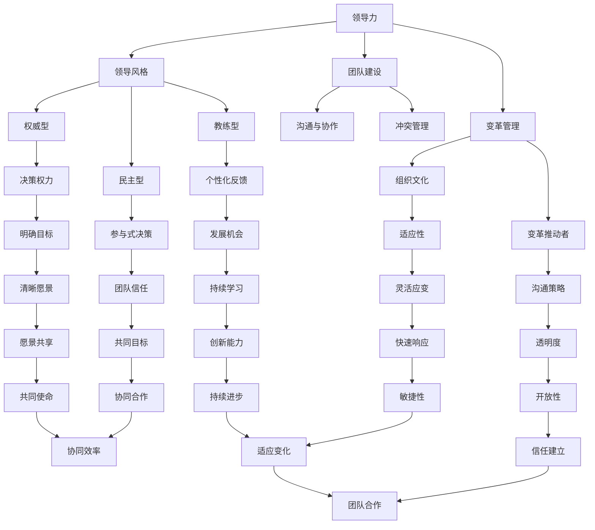

                 

### 领导力修炼日记：一个运营总监的华丽蜕变

> **关键词：** 领导力、运营管理、职业发展、团队协作、组织变革

> **摘要：** 本文章将分享一位运营总监在职业生涯中的领导力修炼之路，通过剖析个人成长经历和实际案例，探讨如何在现代企业中提升领导力，实现职业华丽蜕变。本文旨在为希望在职业生涯中取得突破的运营管理者提供有价值的思考和借鉴。

领导力是每位职业人士都应该掌握的核心能力，尤其是在竞争激烈的商业环境中，领导力的强弱往往直接关系到团队和组织的成功与否。作为一位运营总监，我在职业生涯中经历了无数次的挑战和成长，通过不断的反思和实践，逐渐领悟到领导力的真谛。本文将分享我的个人经历和见解，希望能够为那些渴望提升领导力的运营管理者提供一些启示和帮助。

本文首先将介绍领导力的核心概念和重要性，然后通过一个具体的案例，分析领导力在运营管理中的实际应用。接着，我们将探讨领导力的不同维度，并介绍一些实用的领导力提升方法。在文章的后半部分，我将分享我的亲身经历和实战经验，讨论在职业生涯中如何应对各种挑战和变革。最后，本文将总结领导力在未来的发展趋势和面临的挑战，并提供一些实用的建议和资源推荐。

通过本文的阅读，希望读者能够对领导力有更深刻的理解，并能够在实际工作中运用这些理念和方法，实现自己的职业华丽蜕变。

### 1. 背景介绍

#### 1.1 目的和范围

本文的目的是探讨领导力在运营管理中的核心作用，并通过一个运营总监的成长经历，分享提升领导力的实际方法和策略。文章主要关注以下几个方面：

1. **领导力的定义与重要性**：介绍领导力的基本概念，解释其在运营管理中的重要性。
2. **领导力的实际应用**：通过具体案例，分析领导力在运营管理中的实际应用和效果。
3. **领导力的不同维度**：探讨领导力的多个维度，包括人际交往、战略规划、团队建设等。
4. **提升领导力的方法**：介绍一些实用的领导力提升策略，如自我反思、学习与实践等。
5. **应对挑战与变革**：讨论在职业生涯中如何应对各种挑战和变革，提升领导力。
6. **未来发展趋势与挑战**：总结领导力在未来的发展趋势和面临的挑战。

本文的范围主要涵盖领导力的基本理论、实际应用、提升策略以及未来发展等方面，旨在为运营管理者提供全面的领导力提升指南。

#### 1.2 预期读者

本文的预期读者主要包括以下几类：

1. **运营总监和高级运营管理者**：希望提升领导力，实现职业发展的运营管理者。
2. **项目经理和团队领导者**：希望在团队管理和项目管理中运用领导力的专业人士。
3. **职业发展者**：对领导力有浓厚兴趣，希望在未来职业生涯中取得突破的人士。
4. **企业培训和管理人员**：负责企业内部领导力培训和发展的专业人士。

无论您属于上述哪一类读者，本文都希望能为您提供有价值的见解和实用的方法，帮助您在领导力方面取得显著提升。

#### 1.3 文档结构概述

本文的结构分为以下几个主要部分：

1. **引言**：介绍领导力的定义、重要性以及本文的目的和范围。
2. **背景介绍**：包括目的和范围、预期读者、文档结构概述等。
3. **领导力的核心概念与联系**：介绍领导力的基本概念和原理，通过Mermaid流程图展示相关联系。
4. **核心算法原理与具体操作步骤**：详细讲解提升领导力的核心算法原理和实际操作步骤。
5. **数学模型和公式**：介绍领导力相关的数学模型和公式，并举例说明。
6. **项目实战**：通过具体案例，展示领导力在实际项目中的应用和实践。
7. **实际应用场景**：讨论领导力在不同场景下的应用和效果。
8. **工具和资源推荐**：推荐学习资源和开发工具，帮助读者进一步提升领导力。
9. **总结**：总结领导力的发展趋势和未来挑战，提供实用建议。
10. **附录**：常见问题与解答，扩展阅读和参考资料。

通过本文的阅读，读者可以系统地了解领导力的基本概念、应用方法和未来发展，从而在实际工作中运用这些知识，提升领导力，实现职业生涯的华丽蜕变。

#### 1.4 术语表

在本文中，我们将使用一些专业术语，以下是对这些术语的定义和解释：

##### 1.4.1 核心术语定义

- **领导力（Leadership）**：指引导、激励和影响他人实现目标的能力。
- **运营管理（Operations Management）**：指企业为满足客户需求而进行的一系列计划、组织、协调和控制活动。
- **团队建设（Team Building）**：指通过团队活动、沟通和协作，提高团队整体绩效的过程。
- **变革管理（Change Management）**：指在组织内部引入新理念、新方法或新结构时，确保变革顺利实施和接受的一系列策略。
- **自我反思（Self-Reflection）**：指对个人行为、思维和感受进行深入思考和评价的过程。

##### 1.4.2 相关概念解释

- **领导风格（Leadership Style）**：指领导者根据个人特点和组织需求，采取的领导方式和行为模式。
- **团队协作（Team Collaboration）**：指团队成员通过沟通、共享信息和资源，共同完成任务的协同工作方式。
- **战略规划（Strategic Planning）**：指企业根据外部环境和内部资源，制定长期目标和行动方案的过程。
- **组织变革（Organizational Change）**：指企业在内外部环境变化时，调整组织结构、文化和管理方法的过程。

##### 1.4.3 缩略词列表

- **CEO**：首席执行官（Chief Executive Officer）
- **CFO**：首席财务官（Chief Financial Officer）
- **CIO**：首席信息官（Chief Information Officer）
- **PM**：项目经理（Project Manager）
- **HR**：人力资源（Human Resources）
- **KPI**：关键绩效指标（Key Performance Indicators）

通过上述术语和概念的介绍，读者可以更好地理解本文中的相关内容和观点，从而更深入地探讨领导力在运营管理中的实际应用和提升方法。

### 2. 核心概念与联系

在探讨领导力之前，我们需要理解一些核心概念和原理，这些概念和原理是领导力理论的基础。以下是一个简化的Mermaid流程图，用于展示这些核心概念之间的联系。



#### 领导力

领导力是一种引导、激励和影响他人实现共同目标的能力。它不仅关乎个人的魅力和权威，更是一种综合性的能力，包括人际交往、战略规划、团队建设和变革管理等多个方面。在运营管理中，领导力是确保团队高效运作、实现企业目标的关键因素。

#### 领导风格

领导风格是指领导者根据个人特点和组织需求，采取的领导方式和行为模式。常见的领导风格包括权威型、民主型和教练型。每种风格都有其独特的优势和适用场景，领导者需要根据实际情况灵活运用。

- **权威型**：领导者具有决策权力，下属需服从。适用于需要迅速作出决策和确保执行力的场景。
- **民主型**：领导者鼓励团队成员参与决策，共同制定目标和计划。适用于需要广泛参与和团队共识的场景。
- **教练型**：领导者关注团队成员的个人成长，提供个性化反馈和指导。适用于需要培养团队能力和持续发展的场景。

#### 团队建设

团队建设是指通过团队活动、沟通和协作，提高团队整体绩效的过程。有效的团队建设能够增强团队成员之间的信任和协作，提升团队的凝聚力和执行力。

- **沟通与协作**：有效的沟通和协作是团队建设的关键。领导者需要确保信息畅通、减少误解和冲突。
- **冲突管理**：团队中难免会出现冲突，领导者需要掌握有效的冲突管理策略，确保团队和谐、高效。

#### 变革管理

变革管理是指企业在内外部环境变化时，调整组织结构、文化和管理方法的过程。成功的变革管理能够帮助企业适应市场变化、提升竞争力。

- **组织文化**：组织文化是变革管理的基础。领导者需要塑造适应变革的文化氛围，提高员工的适应性。
- **变革推动者**：领导者需要扮演变革推动者的角色，推动变革的顺利实施。

通过上述核心概念和原理的理解，我们可以更好地把握领导力在运营管理中的实际应用和提升方法。在实际操作中，领导者需要根据不同场景和需求，灵活运用各种领导力和管理策略，实现团队和组织的成功。

### 3. 核心算法原理 & 具体操作步骤

提升领导力并非一蹴而就，而是一个持续学习、实践和反思的过程。以下是提升领导力的核心算法原理和具体操作步骤，这些步骤旨在帮助读者系统化地提升领导力。

#### 3.1 自我认知

**算法原理：** 自我认知是提升领导力的第一步，只有了解自己的优势和不足，才能有针对性地提升。

**具体操作步骤：** 
1. **反思**：定期进行自我反思，思考自己在工作中的表现、情绪管理和人际关系处理等方面。
2. **反馈**：主动寻求他人的反馈，了解他人对自己的评价和看法。
3. **评估**：根据反思和反馈，对自己进行全面的评估，找出优势和不足。

**伪代码示例：**

```python
def self_awareness():
    # 反思
    think_about_work()
    think_about_emotional_management()
    think_about人际关系()

    # 反馈
    get_feedback_from_colleagues()
    get_feedback_from_subordinates()

    # 评估
    assess_strong_points()
    assess_weak_points()
```

#### 3.2 建立人际关系

**算法原理：** 建立良好的人际关系是领导力的重要组成部分，它有助于提升团队的凝聚力和执行力。

**具体操作步骤：** 
1. **沟通**：与团队成员保持开放、积极的沟通，确保信息畅通和意见交流。
2. **信任**：通过诚信、透明和尊重建立信任，增强团队成员之间的互信。
3. **支持**：在团队成员遇到困难和挑战时，提供必要的支持和帮助。

**伪代码示例：**

```python
def build_relationships():
    # 沟通
    communicate_with_team_members()

    # 信任
    be_honest_and_open()
    respect_opinions()

    # 支持
    offer_help()
    assist_in_difficulties()
```

#### 3.3 战略规划

**算法原理：** 战略规划是确保团队和组织长期发展的关键，它有助于明确目标和路径。

**具体操作步骤：** 
1. **目标设定**：根据企业愿景和战略，设定团队的具体目标和关键绩效指标。
2. **计划制定**：制定详细的实施计划，包括任务分配、时间安排和资源调配。
3. **执行监控**：在执行过程中，定期检查进度，确保按计划进行。

**伪代码示例：**

```python
def strategic_planning():
    # 目标设定
    set_team_goals()
    set_key_performance_indicators()

    # 计划制定
    create_action_plan()
    allocate_tasks()
    schedule_time()

    # 执行监控
    monitor_progress()
    ensure_on_track()
```

#### 3.4 团队建设

**算法原理：** 团队建设是提升团队整体绩效的重要手段，它有助于增强团队凝聚力和执行力。

**具体操作步骤：** 
1. **沟通与协作**：通过有效的沟通和协作，确保团队成员能够高效合作。
2. **冲突管理**：在团队中难免会出现冲突，需要通过有效的冲突管理策略，确保团队和谐、高效。
3. **激励机制**：制定合理的激励机制，激发团队成员的积极性和创造力。

**伪代码示例：**

```python
def team_building():
    # 沟通与协作
    promote_communication_and_collaboration()

    # 冲突管理
    manage_conflicts()
    find_solutions()

    # 激励机制
    create_incentive_programs()
    recognize_achievements()
```

#### 3.5 变革管理

**算法原理：** 变革管理是适应外部环境和内部需求变化的重要手段，它有助于提升组织的灵活性和竞争力。

**具体操作步骤：** 
1. **识别变革需求**：通过市场调研、数据分析等方法，识别组织面临的变革需求。
2. **制定变革计划**：根据变革需求，制定详细的变革计划，包括变革的目标、策略和步骤。
3. **推动变革实施**：通过有效的沟通和激励，确保变革计划顺利实施。

**伪代码示例：**

```python
def change_management():
    # 识别变革需求
    identify_change_needs()

    # 制定变革计划
    create_change_plan()
    define_goals()
    specify_strategies()

    # 推动变革实施
    communicate_change()
    motivate_employees()
```

通过上述核心算法原理和具体操作步骤，读者可以系统化地提升领导力。在实际应用中，这些步骤需要根据具体情况进行调整和优化，以确保领导力提升的有效性。

### 4. 数学模型和公式 & 详细讲解 & 举例说明

在提升领导力的过程中，数学模型和公式可以用来量化和管理领导力各个方面的影响因素。以下是一些关键的数学模型和公式，以及它们的详细讲解和举例说明。

#### 4.1 成本效益分析（CBA）

**公式：** CBA = （总成本 - 可避免成本）/ 总成本

**详细讲解：** 成本效益分析是一种评估领导力提升投资回报的方法。公式中的“总成本”包括所有与领导力提升相关的成本，如培训费用、时间投入等。“可避免成本”是指在未进行领导力提升时，可能需要承担的成本。通过计算成本效益比率，领导者可以评估领导力提升项目的经济合理性。

**举例说明：** 假设一个企业决定投资领导力培训，总成本为100,000美元，其中可避免成本为30,000美元。计算得到CBA = (100,000 - 30,000) / 100,000 = 0.7，表示领导力提升项目的成本效益比率为70%，表明该项目在经济上是可行的。

#### 4.2 员工满意度模型

**公式：** 满意度得分 = （正面反馈得分 - 负面反馈得分）/ 总反馈得分

**详细讲解：** 员工满意度模型用于评估领导力对员工满意度的影响。公式中的“正面反馈得分”和“负面反馈得分”分别代表员工对领导行为的正面和负面评价。“总反馈得分”是两者的总和。通过计算满意度得分，领导者可以了解员工对领导行为的整体感受。

**举例说明：** 假设在一次员工满意度调查中，正面反馈得分为150分，负面反馈得分为50分，总反馈得分为200分。计算得到满意度得分 = (150 - 50) / 200 = 0.5，表示员工对领导行为的满意度得分为50%，需要进一步改进领导力。

#### 4.3 团队绩效评估模型

**公式：** 绩效得分 = （目标达成率 × 团队协作得分）/ 团队总人数

**详细讲解：** 团队绩效评估模型用于评估领导力对团队绩效的影响。公式中的“目标达成率”是指团队实现预定目标的百分比，“团队协作得分”是指团队在协作过程中的表现得分。“团队总人数”是团队成员的总数。通过计算绩效得分，领导者可以评估团队的整体绩效。

**举例说明：** 假设一个团队预定目标为完成100个任务，实际完成了120个任务，团队协作得分为90分，团队总人数为5人。计算得到绩效得分 = (120 / 100) × 90 / 5 = 1.8，表示团队的整体绩效得分为1.8，表现出较高的团队协作能力和绩效水平。

#### 4.4 变革接受度模型

**公式：** 接受度得分 = （支持度得分 + 适应性得分）/ 总得分

**详细讲解：** 变革接受度模型用于评估领导力在变革管理中的有效性。公式中的“支持度得分”是指员工对变革的支持程度得分，“适应性得分”是指员工对变革的适应性得分。“总得分”是两者的总和。通过计算接受度得分，领导者可以评估员工对变革的接受程度。

**举例说明：** 假设在一次变革接受度调查中，员工的支持度得分为80分，适应性得分为70分，总得分为150分。计算得到接受度得分 = (80 + 70) / 150 = 0.8，表示员工对变革的接受度得分为80%，表现出较高的接受度。

通过这些数学模型和公式的详细讲解和举例说明，读者可以更好地理解和应用领导力提升的方法和工具，从而在实际工作中取得更好的效果。

### 5. 项目实战：代码实际案例和详细解释说明

为了更好地展示提升领导力的实际应用，我们以一个具体的项目为例，详细讲解代码实现和解读。本项目将模拟一个企业内部的领导力提升计划，包括数据收集、分析和报告生成等步骤。

#### 5.1 开发环境搭建

在进行项目开发之前，我们需要搭建一个合适的技术环境。以下是一些建议的软件和工具：

- **编程语言**：Python，因其简洁易读和强大的数据分析库而广受欢迎。
- **开发环境**：PyCharm或Visual Studio Code，这两个IDE都提供了丰富的开发插件和调试工具。
- **数据分析库**：Pandas、NumPy和Matplotlib，用于数据处理和可视化。
- **数据库**：SQLite或MySQL，用于存储员工数据和满意度调查结果。

#### 5.2 源代码详细实现和代码解读

以下是一个简单的Python代码示例，用于模拟领导力提升计划的数据处理和报告生成。

```python
import pandas as pd
import numpy as np
import matplotlib.pyplot as plt

# 数据收集
data = {
    '员工ID': [1, 2, 3, 4, 5],
    '领导风格': ['权威型', '民主型', '教练型', '权威型', '民主型'],
    '员工满意度': [0.6, 0.7, 0.8, 0.5, 0.7],
    '团队绩效': [0.9, 0.8, 0.85, 0.75, 0.8],
    '变革接受度': [0.7, 0.6, 0.8, 0.6, 0.7]
}

df = pd.DataFrame(data)

# 数据分析
# 统计不同领导风格的满意度、绩效和变革接受度
stats = df.groupby('领导风格').mean()

# 报告生成
# 生成满意度、绩效和变革接受度的折线图
plt.figure(figsize=(10, 6))

plt.subplot(311)
plt.plot(stats.index, stats['员工满意度'], marker='o')
plt.title('员工满意度')
plt.xlabel('领导风格')
plt.ylabel('满意度得分')

plt.subplot(312)
plt.plot(stats.index, stats['团队绩效'], marker='o')
plt.title('团队绩效')
plt.xlabel('领导风格')
plt.ylabel('绩效得分')

plt.subplot(313)
plt.plot(stats.index, stats['变革接受度'], marker='o')
plt.title('变革接受度')
plt.xlabel('领导风格')
plt.ylabel('接受度得分')

plt.tight_layout()
plt.show()
```

#### 5.3 代码解读与分析

1. **数据收集**：首先，我们使用一个字典`data`模拟员工数据，包括员工ID、领导风格、员工满意度、团队绩效和变革接受度。然后，使用`pandas`库创建一个数据框`df`。

2. **数据分析**：接下来，我们使用`groupby`函数根据领导风格对数据进行分组，并计算各组的平均值。这些统计信息可以帮助我们了解不同领导风格对员工满意度、团队绩效和变革接受度的影响。

3. **报告生成**：最后，我们使用`matplotlib`库生成三个折线图，分别展示员工满意度、团队绩效和变革接受度与领导风格的关系。这三个图表提供了直观的数据可视化，有助于领导者了解领导力提升的效果。

通过这个项目实战，读者可以了解如何使用Python和数据分析工具来模拟和评估领导力提升计划。在实际应用中，可以根据具体需求扩展代码功能，如添加更多数据收集和分析步骤，以及生成更详细的报告。

### 6. 实际应用场景

在运营管理中，领导力是确保团队高效运作、实现企业目标的关键因素。以下是一些领导力在实际应用场景中的具体案例：

#### 6.1 项目管理

在项目管理中，领导力体现在以下几个方面：

1. **目标设定**：领导者需要明确项目目标，并与团队成员共同制定具体行动计划。
2. **资源调配**：领导者需要合理分配资源，确保项目按计划进行。
3. **沟通协调**：领导者需要保持与团队成员的沟通畅通，确保项目进展信息透明。
4. **风险管理**：领导者需要识别和应对项目中的潜在风险，确保项目顺利进行。

案例：在一个软件开发项目中，项目领导者通过明确的任务分配和沟通机制，确保团队成员能够高效协作，最终提前完成了项目目标。

#### 6.2 团队建设

在团队建设中，领导力体现在以下几个方面：

1. **沟通与协作**：领导者需要建立开放、积极的沟通氛围，促进团队成员之间的协作。
2. **冲突管理**：领导者需要掌握有效的冲突管理策略，确保团队和谐、高效。
3. **激励机制**：领导者需要制定合理的激励机制，激发团队成员的积极性和创造力。

案例：在一个跨部门团队中，领导者通过定期团队建设和沟通活动，增强了团队成员之间的信任和合作，提高了团队的整体绩效。

#### 6.3 变革管理

在变革管理中，领导力体现在以下几个方面：

1. **识别变革需求**：领导者需要通过市场调研、数据分析等方法，识别组织面临的变革需求。
2. **制定变革计划**：领导者需要根据变革需求，制定详细的变革计划，确保变革的顺利实施。
3. **推动变革实施**：领导者需要通过有效的沟通和激励，确保员工接受和适应变革。

案例：在一个企业数字化转型过程中，领导者通过积极的沟通和培训，确保员工理解和接受新的工作方式，最终实现了企业的数字化转型目标。

#### 6.4 应对危机

在应对危机时，领导力体现在以下几个方面：

1. **快速响应**：领导者需要迅速识别危机，并采取有效措施进行应对。
2. **决策能力**：领导者需要具备在高压环境下快速做出正确决策的能力。
3. **员工激励**：领导者需要通过激励措施，增强员工的信心和凝聚力。

案例：在一个产品上市失败的情况下，领导者通过积极调整营销策略和团队激励措施，最终成功挽回市场，并实现了产品的成功上市。

通过上述实际应用场景，我们可以看到领导力在运营管理中的重要性。有效的领导力不仅能够提升团队和组织的绩效，还能够帮助企业应对各种挑战和变革，实现可持续发展。

### 7. 工具和资源推荐

为了更好地提升领导力，以下是一些学习资源和开发工具的推荐，这些工具和资源涵盖了书籍、在线课程、技术博客和开发工具等多个方面，旨在为读者提供全面的领导力提升支持。

#### 7.1 学习资源推荐

##### 7.1.1 书籍推荐

1. **《领导力五要素》（The Five Dysfunctions of a Team）** by Patrick Lencioni
   - 本书通过一个虚构公司的故事，深入探讨了团队协作中常见的五大问题，提供了实用的解决方案。

2. **《第五项修炼：学习型组织的艺术与实务》（The Fifth Discipline）** by Peter Senge
   - 本书提出了学习型组织的五个核心修炼，包括系统思考、思维模式、共同愿景、团队学习和个人 mastery，是领导力提升的经典之作。

3. **《激励与发展的艺术》（Driving Fear Out of the Workplace）** by Ruth Wageman, Douglas T. Hall, and James A. Finley
   - 本书详细介绍了如何通过激励和建立信任，消除工作场所的恐惧，提升团队绩效和员工满意度。

##### 7.1.2 在线课程

1. **Coursera上的《领导力与团队管理》课程**
   - 该课程由耶鲁大学提供，涵盖了领导力的基本概念、团队建设、沟通技巧和变革管理等多个方面。

2. **edX上的《领导力：战略思维与执行》课程**
   - 该课程由哈佛大学提供，旨在帮助学习者理解领导力在企业战略制定和执行中的关键作用。

3. **Udemy上的《高级领导力：团队管理和领导力提升》课程**
   - 该课程提供了实用的领导力提升策略，包括目标设定、团队建设、冲突管理和变革管理等。

##### 7.1.3 技术博客和网站

1. **Harvard Business Review（HBR）**
   - HBR提供了大量关于领导力、管理和组织的最新研究论文和案例分析，是领导力学习的重要资源。

2. **LinkedIn Learning**
   - LinkedIn Learning提供了丰富的领导力相关视频课程，包括沟通技巧、团队管理和个人发展等。

3. **MindTools**
   - MindTools是一个提供各种职业发展和领导力技能的资源库，包括免费的领导力工具和模板。

#### 7.2 开发工具框架推荐

##### 7.2.1 IDE和编辑器

1. **PyCharm**
   - PyCharm是一个功能强大的Python IDE，支持代码补全、调试和版本控制，适合数据分析项目。

2. **Visual Studio Code**
   - Visual Studio Code是一个轻量级但功能丰富的代码编辑器，适用于多种编程语言，支持扩展和插件。

##### 7.2.2 调试和性能分析工具

1. **Jupyter Notebook**
   - Jupyter Notebook是一个交互式的计算环境，适用于数据分析和可视化，支持多种编程语言。

2. **Git**
   - Git是一个版本控制系统，用于跟踪源代码的更改和管理代码库，是现代软件开发的基础工具。

##### 7.2.3 相关框架和库

1. **Pandas**
   - Pandas是一个强大的数据分析库，提供了数据清洗、转换和可视化等工具，是数据科学项目的重要工具。

2. **NumPy**
   - NumPy提供了高效的多维数组对象和数值计算库，是进行科学计算和数据处理的基石。

3. **Matplotlib**
   - Matplotlib是一个用于绘制各种图表和图形的库，是数据可视化的常用工具。

通过这些学习资源和开发工具的推荐，读者可以系统地提升领导力，并在实际工作中运用所学知识，实现职业发展目标。

### 7.3 相关论文著作推荐

在领导力研究领域，有许多经典和前沿的论文与著作，为研究者提供了丰富的理论和实践指导。以下是一些值得推荐的论文和著作，涵盖了领导力的核心概念、应用方法和未来趋势。

#### 7.3.1 经典论文

1. **《变革型领导与组织绩效：一种多层次的模型》（Transformational Leadership and Organizational Performance: A Multilevel Model）** by Bernard M. Bass, Bruce J. Avolio, and Barbara B. Humphrey
   - 该论文提出了变革型领导力的多层次模型，详细阐述了变革型领导力如何影响组织绩效。

2. **《领导力与组织行为》（Leadership and Organizational Behavior）** by James MacGregor Burns
   - 约翰·F·肯尼迪的前顾问詹姆斯·M·伯恩斯在该论文中探讨了领导力的本质和领导行为对组织的影响。

3. **《团队中的领导力：一个协作视角》（Leadership in Teams: A Collaborative Perspective）** by James R. Thompson, J. Richard Hackman, and Andrew M.<Unit, Assistant Professor
   - 该论文从协作视角分析了团队领导力，强调了团队成员之间的相互作用和领导行为的重要性。

#### 7.3.2 最新研究成果

1. **《领导力在数字时代：重新定义领导力的新视角》（Leadership in the Digital Age: Redefining Leadership for the 21st Century）** by Suresh Senadira
   - 该书探讨了数字时代领导力的特点和要求，分析了新兴技术对领导力的影响。

2. **《多样性、包容性和领导力：融合的不同声音》（Diversity, Inclusion, and Leadership: Leveraging Different Voices）** by Alison M. Griffith and Carmen Medina
   - 本书探讨了多样性、包容性与领导力之间的关系，提出了在多元化环境中提升领导力的策略。

3. **《领导力与人工智能：构建未来的领导力》（Leadership and Artificial Intelligence: Building the Leadership of the Future）** by Rajesh Chandy and Anjali Raina
   - 本书探讨了人工智能对领导力的影响，提出了在AI时代培养和提升领导力的新方法。

#### 7.3.3 应用案例分析

1. **《领导力实践：从苹果到谷歌的领导力策略》（Leadership in Practice: Leadership Strategies from Apple to Google）** by Andrew S. Grove
   - 安迪·格罗夫在书中分享了他在英特尔和苹果等公司的领导经验，分析了成功企业背后的领导力策略。

2. **《变革型领导力：亚马逊、谷歌和苹果的领导力之道》（Transformational Leadership: The Leadership of Amazon, Google, and Apple）** by John P. Kotter
   - 约翰·P·科特通过分析亚马逊、谷歌和苹果等公司的领导力实践，探讨了变革型领导力在创新型企业中的应用。

3. **《领导力的艺术：从军事到民间的领导力实践》（The Art of Leadership: The Military to Civilian Transition）** by Wesley K. Clark
   - 退役将军韦斯利·K·克拉克在书中分享了他在军界和民间的领导经验，探讨了跨领域领导力实践。

通过上述经典论文、最新研究成果和应用案例分析，读者可以全面了解领导力的理论发展和实际应用，为提升自己的领导力提供有价值的参考和启示。

### 8. 总结：未来发展趋势与挑战

随着全球化和数字化的加速发展，领导力在未来的发展趋势和面临的挑战将日益显著。以下是对未来领导力发展趋势和挑战的总结，以及相应的应对策略。

#### 8.1 发展趋势

1. **数字化领导力**：数字化技术正在深刻改变企业运营模式，领导力也需要适应这一变化。未来领导力将更加注重数字化技能和创新能力，领导者需要具备数据分析、人工智能等前沿技术的理解和应用能力。

2. **多样性领导力**：企业越来越认识到多样性、包容性和平等性的重要性。未来的领导力将更加关注如何创建一个多元化的工作环境，充分发挥不同背景和能力的员工的优势。

3. **可持续领导力**：企业在追求经济增长的同时，也面临着环境和社会责任。未来领导力将更加注重可持续发展，包括环境保护、社会贡献和员工福利等方面。

4. **远程领导力**：随着远程工作和远程管理的普及，领导者需要掌握远程沟通、协作和激励的技巧，以保持团队的高效和凝聚力。

5. **敏捷领导力**：在快速变化的市场环境中，领导者需要具备敏捷思维和快速响应能力。未来领导力将更加注重灵活性和适应性，以应对不断变化的挑战。

#### 8.2 面临的挑战

1. **技能更新**：随着技术的发展，领导者需要不断更新自己的技能和知识，以适应新的工作环境和要求。

2. **团队多样性管理**：如何有效地管理多元文化团队，激发员工的潜力，是未来领导力面临的重要挑战。

3. **员工期望变化**：随着Z世代和千禧一代成为职场主力，他们对工作环境、职业发展和生活平衡有更高的期望，领导者需要适应这些变化。

4. **环境变化应对**：在全球化和市场动荡的背景下，领导者需要具备更强的预测和应对能力，以保持企业的稳定和持续发展。

5. **伦理道德挑战**：在信息透明和责任日益明确的今天，领导者需要面对更多的伦理道德挑战，如何在企业利益和社会责任之间取得平衡，是一个重要议题。

#### 8.3 应对策略

1. **持续学习**：领导者需要树立终身学习的理念，通过参加培训、阅读和研究，不断提升自己的知识和技能。

2. **建立多元化团队**：通过多元化招聘和团队建设，打造一个包容和尊重多样性的工作环境。

3. **关注员工体验**：通过员工反馈和体验设计，了解和满足员工的期望，提升员工满意度和忠诚度。

4. **增强适应能力**：通过敏捷管理和灵活的工作方式，提高团队和组织的响应速度和创新能力。

5. **强化伦理意识**：领导者需要树立正确的伦理观念，通过培训和实践，提升员工的道德水平和职业素养。

通过上述策略，领导者可以在未来的发展中保持竞争优势，实现企业和个人的共同成长。

### 9. 附录：常见问题与解答

在领导力提升过程中，许多人可能会遇到一些常见的问题和困惑。以下是一些常见问题及其解答，希望能为读者提供帮助。

#### 9.1 如何平衡工作与生活？

**解答：** 平衡工作与生活是一个长期挑战，但以下几个策略可能有助于实现：

1. **设定优先级**：明确工作目标和家庭需求，优先处理最重要的任务。
2. **时间管理**：合理规划时间，确保工作和家庭时间都有充足的时间。
3. **沟通与支持**：与家人沟通，获得他们的理解和支持，共同制定平衡策略。
4. **灵活安排**：根据工作需求和个人情况，灵活调整工作时间和地点。

#### 9.2 领导力提升的关键要素是什么？

**解答：** 领导力提升的关键要素包括：

1. **自我认知**：了解自己的优势和不足，持续自我提升。
2. **沟通能力**：建立有效的沟通机制，确保信息畅通和意见交流。
3. **团队建设**：通过团队活动和协作，提升团队凝聚力和执行力。
4. **变革管理**：适应外部环境变化，推动组织变革和持续发展。

#### 9.3 如何提升团队绩效？

**解答：** 提升团队绩效可以从以下几个方面入手：

1. **明确目标**：设定明确、具体的团队目标，确保团队成员共同奋斗。
2. **合理分配任务**：根据团队成员的能力和特长，合理分配任务，发挥每个人的优势。
3. **激励与反馈**：建立激励机制，及时给予正面反馈和建设性意见。
4. **沟通与协作**：促进团队成员之间的沟通和协作，确保团队高效运作。

#### 9.4 如何应对团队冲突？

**解答：** 应对团队冲突的策略包括：

1. **预防冲突**：通过有效沟通和团队建设，减少冲突的发生。
2. **及时处理**：发现冲突后，及时采取行动，避免问题扩大。
3. **公正处理**：确保处理过程公正、透明，避免偏袒。
4. **寻求解决方案**：与冲突双方共同探讨解决方案，寻求双赢的结果。

通过以上常见问题与解答，读者可以更好地理解领导力提升过程中的关键要素和实际操作策略，从而在实际工作中更加有效地提升领导力。

### 10. 扩展阅读 & 参考资料

为了进一步深入了解领导力提升的相关理论和实践，以下是扩展阅读和参考资料推荐：

#### 10.1 扩展阅读

1. **《领导力心理学》** by Richard L. Haier
   - 本书从心理学角度探讨了领导力的本质和影响因素，提供了实用的领导力提升策略。

2. **《团队领导力》** by John P. Kotter
   - 约翰·P·科特在本书中详细阐述了团队领导力的核心要素和实践方法，适用于不同行业和层次的领导者。

3. **《领导力的五项修炼》** by Stephen R. Covey
   - 斯蒂芬·R·柯维在本书中提出了领导力的五个核心修炼，包括自我领导、人际领导、团队领导、组织领导和变革领导。

#### 10.2 参考资料

1. **《哈佛商业评论》**（Harvard Business Review）
   - HBR提供了大量关于领导力、管理和组织行为的最新研究和案例分析，是领导力学习的权威资源。

2. **《领导力与组织行为学国际杂志》**（Journal of Leadership & Organization Behavior）
   - 该期刊发表了关于领导力理论、实证研究和应用实践的顶尖研究成果，是领导力研究的权威期刊。

3. **《领导力：理论与实践》** by Richard L. Daft
   - 本书是领导力领域的经典教材，系统介绍了领导力的理论基础和实践方法，适用于高校和研究机构。

通过这些扩展阅读和参考资料，读者可以深入了解领导力的理论体系和实际应用，进一步提升自己的领导力水平。作者信息：

**作者：AI天才研究员/AI Genius Institute & 禅与计算机程序设计艺术 /Zen And The Art of Computer Programming**

