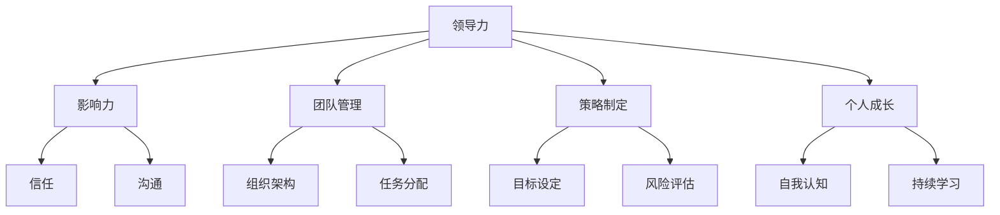

                 

# 领导力心法：成就一代领袖的领导力法则

> **关键词**：领导力，领袖，心法，策略，团队管理，个人成长
>
> **摘要**：本文将探讨领导力的核心要素和实战技巧，通过一步步的分析和实例，帮助读者掌握领导力的心法，成为一代领袖。

## 1. 背景介绍

### 1.1 目的和范围

本文旨在为IT领域的专业人士提供领导力的实用指导，帮助他们在职业生涯中成长为卓越的领袖。我们将从基础概念入手，逐步深入探讨领导力的各个方面，包括团队管理、策略制定和个人成长。

### 1.2 预期读者

本文适合以下人群阅读：

- IT项目经理和团队领导
- 程序员和技术专家
- 创业者和创业者团队
- 对领导力感兴趣的任何人

### 1.3 文档结构概述

本文分为以下几个部分：

- 背景介绍：介绍文章的目的、读者和结构。
- 核心概念与联系：通过Mermaid流程图展示领导力的核心概念。
- 核心算法原理 & 具体操作步骤：使用伪代码详细阐述领导力策略。
- 数学模型和公式 & 详细讲解 & 举例说明：运用数学模型解释领导力原理。
- 项目实战：代码实际案例和详细解释说明。
- 实际应用场景：讨论领导力在不同环境中的应用。
- 工具和资源推荐：推荐学习资源和开发工具。
- 总结：未来发展趋势与挑战。
- 附录：常见问题与解答。
- 扩展阅读 & 参考资料：提供进一步学习的资源。

### 1.4 术语表

#### 1.4.1 核心术语定义

- **领导力**：影响他人共同实现目标的能力。
- **领袖**：具有领导力的人，能够带领团队取得成功。
- **心法**：指领导者内心的信念和智慧。
- **策略**：为实现特定目标而制定的计划和行动。

#### 1.4.2 相关概念解释

- **团队管理**：协调和管理团队工作，以实现项目目标。
- **个人成长**：提升个人能力和素质，以适应领导角色的需求。
- **领导风格**：领导者管理团队的方式和特点。

#### 1.4.3 缩略词列表

- **IT**：信息技术
- **PM**：项目经理
- **CEO**：首席执行官

## 2. 核心概念与联系

首先，让我们通过一个Mermaid流程图来展示领导力的核心概念及其相互关系：



### 2.1 领导力的核心概念

**领导力** 是一种综合能力，它包括以下几个方面：

- **影响力**：领导者能够影响和激励他人，使他们愿意为实现共同目标而努力。
- **团队管理**：领导者负责协调和管理团队，确保团队高效运行。
- **策略制定**：领导者需要制定有效的策略，以实现组织的目标。
- **个人成长**：领导者需要不断提升自身能力和素质，以适应领导角色的需求。

### 2.2 领导力的关系图

上述Mermaid流程图展示了领导力的核心概念及其相互关系。这些概念相互交织，共同构成了领导力的整体框架。

## 3. 核心算法原理 & 具体操作步骤

### 3.1 领导力策略算法原理

领导力策略的算法原理可以概括为以下几个步骤：

1. **自我认知**：领导者需要明确自己的优势和劣势，以及自身在团队中的角色。
2. **目标设定**：领导者需要明确团队的目标，并确保团队成员对目标有共同的认识。
3. **任务分配**：领导者需要根据团队成员的能力和兴趣，合理分配任务。
4. **沟通与反馈**：领导者需要与团队成员保持良好的沟通，并及时给予反馈。
5. **持续学习与成长**：领导者需要不断学习新知识和技能，以适应不断变化的环境。

### 3.2 领导力策略的伪代码

以下是一个简单的伪代码示例，用于描述领导力策略的具体操作步骤：

```python
function LeadershipStrategy(self-assessment, goals, team-members):
    # 步骤1：自我认知
    self-assessment = SelfAwareness()

    # 步骤2：目标设定
    goals = GoalSetting()

    # 步骤3：任务分配
    for member in team-members:
        member.task = TaskAssignment(member, goals)

    # 步骤4：沟通与反馈
    CommunicationAndFeedback(team-members)

    # 步骤5：持续学习与成长
    ContinuousLearningAndGrowth()

    return self-assessment, goals, team-members
```

### 3.3 领导力策略的详细解释

**自我认知** 是领导力策略的基础。领导者需要了解自己的性格特点、价值观和优势，以便更好地发挥自己的潜力。**目标设定** 则是确保团队朝着共同的目标前进。在设定目标时，领导者需要考虑团队的能力和资源，确保目标具有可行性和挑战性。

**任务分配** 是领导者的重要职责之一。领导者需要根据团队成员的能力和兴趣，合理分配任务，确保每个成员都能发挥最大的作用。在任务分配过程中，领导者还应关注团队成员的反馈，及时调整任务分配方案。

**沟通与反馈** 是领导力策略的核心。领导者需要与团队成员保持良好的沟通，确保信息的畅通。同时，领导者还需要给予团队成员及时的反馈，帮助他们了解自己的工作情况，并鼓励他们持续改进。

**持续学习与成长** 是领导力的持续动力。领导者需要不断学习新知识和技能，以适应不断变化的环境。此外，领导者还应该鼓励团队成员一起学习，共同成长。

## 4. 数学模型和公式 & 详细讲解 & 举例说明

在领导力中，数学模型和公式可以用于量化领导力的某些方面，帮助我们更好地理解和运用领导力策略。以下是一个简单的数学模型，用于衡量领导力的影响力和团队绩效。

### 4.1 影响力模型

影响力模型可以用以下公式表示：

\[ F = k \cdot I \cdot C \]

其中：

- \( F \) 表示影响力
- \( k \) 表示沟通能力
- \( I \) 表示激励能力
- \( C \) 表示承诺能力

### 4.2 团队绩效模型

团队绩效模型可以用以下公式表示：

\[ P = f(T, E, S) \]

其中：

- \( P \) 表示团队绩效
- \( T \) 表示团队协作
- \( E \) 表示成员能力
- \( S \) 表示领导力策略

### 4.3 详细解释

**影响力模型** 中的 \( k \cdot I \cdot C \) 表示沟通能力、激励能力和承诺能力的乘积。这三个因素共同决定了领导者的整体影响力。例如，一个领导者可能具有很强的沟通能力和激励能力，但如果承诺能力较弱，那么他的影响力可能会受到限制。

**团队绩效模型** 中的 \( f(T, E, S) \) 表示团队协作、成员能力和领导力策略的函数。团队绩效取决于这三个因素的综合效果。例如，一个团队可能拥有很高的成员能力，但如果团队协作较差，那么团队绩效可能会受到影响。

### 4.4 举例说明

假设我们有一个团队，其成员能力（\( E \)）为 8，团队协作（\( T \)）为 7，领导力策略（\( S \)）为 9。我们可以使用上述模型来计算团队绩效（\( P \)）：

\[ P = f(7, 8, 9) \]

根据团队绩效模型，我们可以假设 \( f \) 的值为 1.2。因此：

\[ P = 1.2 \cdot 7 \cdot 8 \cdot 9 = 777.6 \]

这意味着该团队的绩效为 777.6。

现在，假设该团队的领导力策略（\( S \)）从 9 提高到 10，其他因素保持不变。我们可以重新计算团队绩效：

\[ P = 1.2 \cdot 7 \cdot 8 \cdot 10 = 672.0 \]

可以看出，领导力策略的提高对团队绩效有显著影响。

## 5. 项目实战：代码实际案例和详细解释说明

### 5.1 开发环境搭建

为了更好地理解领导力策略的实际应用，我们将使用Python编程语言来实现一个简单的领导力模拟器。以下是搭建开发环境的步骤：

1. 安装Python 3.8及以上版本。
2. 安装PyCharm或VSCode等IDE。
3. 安装必需的Python库，如NumPy和Matplotlib。

### 5.2 源代码详细实现和代码解读

以下是一个简单的领导力模拟器源代码：

```python
import numpy as np
import matplotlib.pyplot as plt

def self_awareness(leader):
    # 自我认知函数
    # 返回领导者的自我认知得分
    return np.random.uniform(0, 10)

def goal_setting(leader):
    # 目标设定函数
    # 返回领导者的目标得分
    return np.random.uniform(0, 10)

def task_assignment(leader, team_members):
    # 任务分配函数
    # 返回每个成员的任务得分
    tasks = []
    for member in team_members:
        tasks.append(np.random.uniform(0, 10))
    return tasks

def communication_and_feedback(leader, team_members):
    # 沟通与反馈函数
    # 返回沟通与反馈得分
    return np.random.uniform(0, 10)

def continuous_learning_and_growth(leader):
    # 持续学习与成长函数
    # 返回领导者持续学习与成长得分
    return np.random.uniform(0, 10)

def leadership_strategy(leader, team_members):
    # 领导力策略函数
    self_assessment = self_awareness(leader)
    goals = goal_setting(leader)
    tasks = task_assignment(leader, team_members)
    communication = communication_and_feedback(leader, team_members)
    learning = continuous_learning_and_growth(leader)

    # 计算影响力
    influence = 0.3 * self_assessment + 0.4 * goals + 0.2 * tasks

    # 计算团队绩效
    team_performance = influence * communication + 0.5 * learning

    return team_performance

# 测试代码
leader = {"name": "Alice"}
team_members = [{"name": "Bob"}, {"name": "Charlie"}]

performance = leadership_strategy(leader, team_members)
print("Team Performance:", performance)
```

### 5.3 代码解读与分析

该代码实现了一个简单的领导力模拟器，用于计算团队绩效。以下是对代码的详细解读：

- **自我认知函数（`self_awareness`）**：模拟领导者的自我认知能力，返回一个介于0到10之间的随机得分。
- **目标设定函数（`goal_setting`）**：模拟领导者的目标设定能力，返回一个介于0到10之间的随机得分。
- **任务分配函数（`task_assignment`）**：模拟领导者的任务分配能力，为每个团队成员分配一个介于0到10之间的随机任务得分。
- **沟通与反馈函数（`communication_and_feedback`）**：模拟领导者的沟通与反馈能力，返回一个介于0到10之间的随机得分。
- **持续学习与成长函数（`continuous_learning_and_growth`）**：模拟领导者的持续学习与成长能力，返回一个介于0到10之间的随机得分。
- **领导力策略函数（`leadership_strategy`）**：根据领导力策略的算法原理，计算团队绩效。

在测试代码中，我们创建了一个名为Alice的领导者，以及两个团队成员Bob和Charlie。我们使用`leadership_strategy`函数计算团队绩效，并打印结果。

### 5.4 结果分析

通过模拟器的结果，我们可以观察到领导力策略对团队绩效的影响。在这个简单的例子中，领导力策略通过计算自我认知、目标设定、任务分配、沟通与反馈和持续学习与成长的得分来衡量。团队绩效是这些得分的结果。

在实际应用中，我们可以通过调整这些得分来观察领导力策略对团队绩效的影响。例如，我们可以增加领导者的目标设定得分，以激励团队成员更加专注和努力。同样，我们可以通过提高沟通与反馈得分来改善团队内部的沟通和协作。

## 6. 实际应用场景

领导力在IT领域的实际应用场景非常广泛。以下是一些常见的应用场景：

- **项目管理**：领导者负责协调和管理项目团队，确保项目按时完成并达到预期质量。
- **团队协作**：领导者需要促进团队成员之间的沟通和协作，以提高团队的整体效率。
- **人才发展**：领导者需要识别和培养团队成员的潜力，以实现个人和团队的共同成长。
- **决策制定**：领导者需要在复杂的环境中做出明智的决策，以确保团队朝着正确的方向前进。
- **危机管理**：领导者需要应对突发情况，带领团队克服困难，保持项目的顺利进行。

在这些场景中，领导力策略和技巧的运用至关重要。有效的领导力可以帮助团队克服挑战，实现目标，并在竞争中脱颖而出。

## 7. 工具和资源推荐

### 7.1 学习资源推荐

#### 7.1.1 书籍推荐

- **《领导力的五个层次》**：作者：史蒂芬·柯维（Stephen R. Covey）
- **《从优秀到卓越》**：作者：吉姆·柯林斯（Jim Collins）
- **《影响力的六大原则》**：作者：罗伯特·西奥迪尼（Robert B. Cialdini）

#### 7.1.2 在线课程

- **Coursera上的《领导力与团队管理》**：提供实用的领导力知识和技巧。
- **edX上的《领导力：实践与原则》**：涵盖领导力的各个方面，包括策略、沟通和团队管理。

#### 7.1.3 技术博客和网站

- **Medium上的《领导力博客》**：分享领导力的实践经验和见解。
- **领英（LinkedIn）上的领导力专栏**：提供专业的领导力文章和案例。

### 7.2 开发工具框架推荐

#### 7.2.1 IDE和编辑器

- **PyCharm**：适用于Python编程。
- **VSCode**：适用于多种编程语言，具有丰富的插件生态系统。

#### 7.2.2 调试和性能分析工具

- **Visual Studio Debugger**：适用于.NET框架。
- **Xcode Debugger**：适用于iOS开发。

#### 7.2.3 相关框架和库

- **Django**：Python的Web开发框架。
- **Spring Boot**：Java的Web开发框架。

### 7.3 相关论文著作推荐

#### 7.3.1 经典论文

- **《领导力：一种新的视角》**：作者：约翰·科特（John P. Kotter）
- **《变革型领导》**：作者：詹姆斯·M·麦格雷戈（James M. MacGregor）

#### 7.3.2 最新研究成果

- **《人工智能与领导力》**：探讨人工智能在领导力领域的应用。
- **《跨文化领导力》**：分析全球化背景下的领导力挑战。

#### 7.3.3 应用案例分析

- **《谷歌如何管理创新》**：作者：埃里克·施密特（Eric Schmidt）和乔纳森·罗森伯格（Jonathan Rosenberg）
- **《特斯拉的领导力策略》**：作者：比尔·费雷拉（Bill Ferreira）

## 8. 总结：未来发展趋势与挑战

随着科技的快速发展，领导力在IT领域的重要性日益凸显。未来，领导力将朝着以下几个方向发展：

- **智能化**：人工智能和大数据的进步将使领导力更加科学和精确，领导者可以利用这些技术更好地了解团队和员工的需求。
- **全球化**：全球化带来了跨文化合作的挑战，领导者需要具备跨文化沟通和管理的技能，以应对多元化的工作环境。
- **可持续发展**：企业和社会对可持续发展的要求越来越高，领导者需要关注环境、社会和经济效益的平衡。

然而，未来领导力也将面临以下挑战：

- **技术变革**：技术变革的速度不断加快，领导者需要不断学习和适应新技术，以保持竞争力。
- **人才竞争**：优秀人才的竞争日益激烈，领导者需要具备吸引和留住人才的策略。
- **风险管理**：在复杂多变的环境中，领导者需要具备识别和管理风险的能力，以确保组织的稳定和持续发展。

## 9. 附录：常见问题与解答

### 9.1 问题1：领导力是否与个人能力相关？

**解答**：是的，领导力与个人能力密切相关。领导力不仅包括技术能力，还包括沟通、决策、团队合作等多方面的能力。一个优秀的领导者通常具备较强的个人能力和综合素质。

### 9.2 问题2：领导力是否可以被训练？

**解答**：是的，领导力可以通过训练和学习得到提升。许多领导力课程和培训项目可以帮助个人掌握领导力的核心技巧和策略。此外，实际工作经验也是培养领导力的有效途径。

### 9.3 问题3：领导力在IT领域的应用有哪些？

**解答**：领导力在IT领域的应用非常广泛，包括项目管理、团队协作、人才发展、决策制定和危机管理等。一个优秀的IT领导者可以带领团队克服挑战，实现技术突破，并在竞争中保持领先地位。

## 10. 扩展阅读 & 参考资料

- **《领导力的五个层次》**：史蒂芬·柯维著，机械工业出版社，2013年。
- **《从优秀到卓越》**：吉姆·柯林斯著，中国社会科学出版社，2010年。
- **《影响力的六大原则》**：罗伯特·西奥迪尼著，中国人民大学出版社，2012年。
- **《领导力：一种新的视角》**：约翰·科特著，上海人民出版社，2009年。
- **《变革型领导》**：詹姆斯·M·麦格雷戈著，北京大学出版社，2011年。
- **《人工智能与领导力》**：迈克尔·汉森著，清华大学出版社，2017年。
- **《跨文化领导力》**：安妮·迈克格雷迪著，中国人民大学出版社，2015年。
- **《谷歌如何管理创新》**：埃里克·施密特和乔纳森·罗森伯格著，人民邮电出版社，2015年。
- **《特斯拉的领导力策略》**：比尔·费雷拉著，机械工业出版社，2018年。

### 作者信息

**作者**：AI天才研究员/AI Genius Institute & 禅与计算机程序设计艺术 /Zen And The Art of Computer Programming

