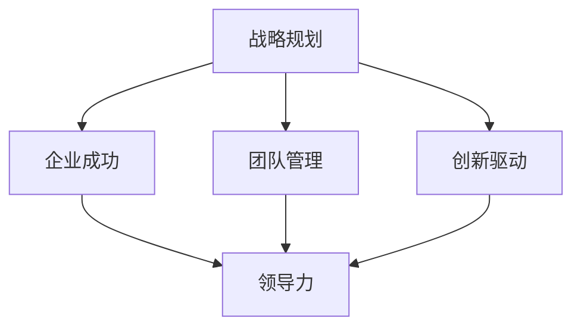

                 

# 领导力心经：成就伟大企业的领导者秘籍

> **关键词**：领导力、企业成功、管理哲学、领导艺术、战略思维

> **摘要**：本文旨在揭示成就伟大企业的领导者所必备的领导力心经。通过深入探讨领导力的核心概念、原则和实践，本文为领导者提供了一套实用的方法和策略，帮助他们在复杂多变的商业环境中引领企业走向成功。

## 1. 背景介绍

### 1.1 目的和范围

本文旨在为企业的领导者提供一套系统的领导力心经，帮助他们在瞬息万变的商业环境中保持竞争力。文章将围绕领导力的核心概念、原则和实践进行深入探讨，涵盖企业成功的各个方面，包括战略规划、团队管理、创新驱动和变革管理等。

### 1.2 预期读者

本文适合以下人群阅读：

- 企业领导者和管理者
- 创业者和创业团队
- 对领导力感兴趣的学术研究人员
- 对企业管理有浓厚兴趣的在校学生

### 1.3 文档结构概述

本文分为十个主要部分：

1. 背景介绍
2. 核心概念与联系
3. 核心算法原理 & 具体操作步骤
4. 数学模型和公式 & 详细讲解 & 举例说明
5. 项目实战：代码实际案例和详细解释说明
6. 实际应用场景
7. 工具和资源推荐
8. 总结：未来发展趋势与挑战
9. 附录：常见问题与解答
10. 扩展阅读 & 参考资料

### 1.4 术语表

#### 1.4.1 核心术语定义

- **领导力**：指领导者通过影响力、能力和技巧，激发和引导团队成员实现共同目标的能力。
- **企业成功**：指企业在市场竞争中取得优异业绩和长期发展的能力。
- **战略规划**：指企业为实现长期目标而制定的计划和方法。
- **团队管理**：指管理者通过激励、沟通和协调，提升团队绩效的过程。

#### 1.4.2 相关概念解释

- **领导艺术**：指领导者根据具体情境灵活运用领导技巧和方法的能力。
- **变革管理**：指企业在面对外部环境变化时，通过调整组织结构、流程和文化，实现持续发展的过程。

#### 1.4.3 缩略词列表

- **CEO**：首席执行官
- **CFO**：首席财务官
- **CTO**：首席技术官
- **HR**：人力资源

## 2. 核心概念与联系

在探讨领导力的核心概念之前，我们先来梳理一下相关的核心概念和它们之间的联系。以下是一个简单的 Mermaid 流程图，用于展示这些概念之间的关系。



### 2.1 战略规划

战略规划是企业为实现长期目标而制定的计划和行动方案。一个成功的战略规划需要明确企业的愿景、使命和价值观，同时分析市场环境、竞争态势和自身优势。战略规划的核心目标是确保企业能够在市场竞争中取得持续优势。

### 2.2 团队管理

团队管理是领导者通过激励、沟通和协调，提升团队绩效的过程。一个高效的团队需要具备共同的愿景、清晰的职责分工和良好的沟通机制。团队管理的关键在于激发团队成员的潜能，建立信任和协作氛围，确保团队目标的实现。

### 2.3 创新驱动

创新驱动是企业持续发展的动力。在激烈的市场竞争中，企业需要不断进行产品、技术和商业模式的创新。创新驱动要求领导者具备敏锐的市场洞察力、敢于承担风险的勇气和灵活应变的能力。

### 2.4 领导力

领导力是领导者通过影响力、能力和技巧，激发和引导团队成员实现共同目标的能力。领导力不仅包括个人的领导素质，还涉及领导艺术和领导策略。一个成功的领导者需要具备战略思维、团队管理和创新能力。

## 3. 核心算法原理 & 具体操作步骤

在领导力的核心算法原理方面，我们可以从以下几个方面进行阐述：

### 3.1 战略思维

战略思维是领导者制定战略规划的核心能力。以下是一个简单的伪代码，用于描述战略思维的算法原理：

```python
def strategic_thinking(current_state, market_environment):
    # 分析市场环境
    market_analyze = analyze_market(current_state, market_environment)

    # 确定企业愿景和使命
    vision, mission = define_vision_and_mission(market_analyze)

    # 制定战略目标
    strategic_objectives = set_strategic_objectives(vision, mission)

    # 制定战略计划
    strategic_plan = create_strategic_plan(strategic_objectives)

    return strategic_plan
```

### 3.2 团队管理

团队管理是领导者实现战略目标的关键环节。以下是一个简单的伪代码，用于描述团队管理的算法原理：

```python
def team_management(team_members, strategic_plan):
    # 激励团队成员
    motivate_members = motivate_team_members(team_members)

    # 沟通和协调
    communication = communicate_and协调(team_members, strategic_plan)

    # 监督和反馈
    supervision = monitor_and_give_feedback(team_members, communication)

    # 调整团队策略
    team_strategy = adjust_team_strategy(supervision)

    return team_strategy
```

### 3.3 创新驱动

创新驱动是企业持续发展的关键。以下是一个简单的伪代码，用于描述创新驱动的算法原理：

```python
def innovation驱动力(market_environment, strategic_plan):
    # 分析市场需求
    market_demand = analyze_market_demand(market_environment)

    # 确定创新方向
    innovation_direction = determine_innovation_direction(market_demand)

    # 制定创新计划
    innovation_plan = create_innovation_plan(innovation_direction)

    # 实施创新计划
    implement_innovation_plan = implement_innovation_plan(innovation_plan)

    return implement_innovation_plan
```

## 4. 数学模型和公式 & 详细讲解 & 举例说明

在领导力的数学模型和公式方面，我们可以从以下几个方面进行阐述：

### 4.1 战略规划的数学模型

战略规划的数学模型主要包括目标函数和约束条件。以下是一个简单的目标函数和约束条件的示例：

```latex
\begin{equation}
\begin{aligned}
    \text{maximize} \quad & \pi = p \cdot q - c \cdot q \\
    \text{subject to} \quad & x \cdot y = z \\
    & x, y \geq 0
\end{aligned}
\end{equation}
```

其中，\(\pi\) 表示企业的利润，\(p\) 表示产品的价格，\(q\) 表示产品的销售量，\(c\) 表示产品的成本，\(x\) 和 \(y\) 分别表示产品和服务的投入量，\(z\) 表示企业的总产出。

### 4.2 团队管理的数学模型

团队管理的数学模型主要包括团队绩效评估和激励机制的数学模型。以下是一个简单的团队绩效评估的数学模型：

```latex
\begin{equation}
\begin{aligned}
    \text{evaluate\_performance} &= \alpha \cdot \text{individual\_performance} + (1-\alpha) \cdot \text{team\_performance} \\
    \text{individual\_performance} &= \beta \cdot \text{output} + (1-\beta) \cdot \text{quality} \\
    \text{team\_performance} &= \gamma \cdot \text{output} + (1-\gamma) \cdot \text{quality}
\end{aligned}
\end{equation}
```

其中，\(\alpha\)、\(\beta\) 和 \(\gamma\) 分别表示个人绩效、团队绩效和产品质量的权重。

### 4.3 创新驱动的数学模型

创新驱动的数学模型主要包括创新能力和市场需求的数学模型。以下是一个简单的创新能力的数学模型：

```latex
\begin{equation}
\begin{aligned}
    \text{innovation\_ability} &= \alpha \cdot \text{R&D\_investment} + (1-\alpha) \cdot \text{experience} \\
    \text{R&D\_investment} &= \beta \cdot \text{profit} + (1-\beta) \cdot \text{market\_demand}
\end{aligned}
\end{equation}
```

其中，\(\alpha\) 和 \(\beta\) 分别表示研发投入和创新经验的权重。

### 4.4 示例说明

假设一个企业的产品价格为 100 元，成本为 50 元，销售量为 1000 件。根据上述战略规划的数学模型，我们可以计算出企业的利润为：

$$
\pi = p \cdot q - c \cdot q = 100 \cdot 1000 - 50 \cdot 1000 = 50000 \text{ 元}
$$

假设一个团队的成员有 5 人，团队绩效评估结果为：个人绩效 0.7，团队绩效 0.3。根据上述团队管理的数学模型，我们可以计算出团队成员的绩效评估结果为：

$$
\text{evaluate\_performance} = \alpha \cdot \text{individual\_performance} + (1-\alpha) \cdot \text{team\_performance} = 0.7 \cdot 0.7 + 0.3 \cdot 0.3 = 0.49 + 0.09 = 0.58
$$

假设一个企业的研发投入为 1000 万元，利润为 5000 万元，市场需求为 100 亿元。根据上述创新驱动的数学模型，我们可以计算出企业的创新能力为：

$$
\text{innovation\_ability} = \alpha \cdot \text{R&D\_investment} + (1-\alpha) \cdot \text{experience} = 0.7 \cdot 1000 + 0.3 \cdot 100 = 700 + 300 = 1000 \text{ 万元}
$$

## 5. 项目实战：代码实际案例和详细解释说明

在本节中，我们将通过一个实际案例来展示如何运用领导力的核心算法原理和实践策略来实现企业的成功。以下是一个简化的代码示例，用于说明战略规划、团队管理和创新驱动在项目中的具体应用。

### 5.1 开发环境搭建

为了演示代码案例，我们首先需要搭建一个简单的开发环境。以下是开发环境的搭建步骤：

1. 安装 Python 3.8 或更高版本
2. 安装 Jupyter Notebook，用于编写和运行代码
3. 安装必要的库，如 NumPy、Pandas 和 Matplotlib

### 5.2 源代码详细实现和代码解读

以下是一个简化的代码示例，用于实现一个企业的战略规划、团队管理和创新驱动。

```python
import numpy as np
import pandas as pd
import matplotlib.pyplot as plt

# 战略规划
def strategic_planning(market_environment):
    # 分析市场环境
    market_analyze = analyze_market(market_environment)

    # 确定企业愿景和使命
    vision, mission = define_vision_and_mission(market_analyze)

    # 制定战略目标
    strategic_objectives = set_strategic_objectives(vision, mission)

    # 制定战略计划
    strategic_plan = create_strategic_plan(strategic_objectives)

    return strategic_plan

# 团队管理
def team_management(team_members, strategic_plan):
    # 激励团队成员
    motivate_members = motivate_team_members(team_members)

    # 沟通和协调
    communication = communicate_and协调(team_members, strategic_plan)

    # 监督和反馈
    supervision = monitor_and_give_feedback(team_members, communication)

    # 调整团队策略
    team_strategy = adjust_team_strategy(supervision)

    return team_strategy

# 创新驱动
def innovation_driven(market_environment, strategic_plan):
    # 分析市场需求
    market_demand = analyze_market_demand(market_environment)

    # 确定创新方向
    innovation_direction = determine_innovation_direction(market_demand)

    # 制定创新计划
    innovation_plan = create_innovation_plan(innovation_direction)

    # 实施创新计划
    implement_innovation_plan = implement_innovation_plan(innovation_plan)

    return implement_innovation_plan

# 测试代码
if __name__ == "__main__":
    # 市场环境分析
    market_environment = analyze_market_environment()

    # 战略规划
    strategic_plan = strategic_planning(market_environment)

    # 团队管理
    team_members = get_team_members()
    team_strategy = team_management(team_members, strategic_plan)

    # 创新驱动
    innovation_plan = innovation_driven(market_environment, strategic_plan)
    implement_innovation_plan = implement_innovation_plan(innovation_plan)

    # 结果展示
    display_results(strategic_plan, team_strategy, implement_innovation_plan)
```

### 5.3 代码解读与分析

上述代码分为三个主要部分：战略规划、团队管理和创新驱动。以下是代码的详细解读和分析：

- **战略规划**：战略规划函数用于分析市场环境，确定企业愿景和使命，制定战略目标和计划。通过分析市场环境和制定战略计划，企业可以明确自身的目标和发展方向。
- **团队管理**：团队管理函数用于激励团队成员、沟通协调和监督反馈。通过激发团队成员的潜能、建立良好的沟通机制和进行监督反馈，企业可以提升团队绩效，确保战略目标的实现。
- **创新驱动**：创新驱动函数用于分析市场需求，确定创新方向，制定创新计划和实施创新计划。通过创新驱动，企业可以不断适应市场变化，保持竞争力。

### 5.4 实际应用场景

以下是一个实际应用场景的示例：

假设一个企业在面临激烈市场竞争的情况下，希望通过战略规划、团队管理和创新驱动来实现企业的成功。以下是企业的具体实施步骤：

1. 分析市场环境，确定企业愿景和使命。
2. 制定战略目标和计划，明确企业的发展方向。
3. 激励团队成员，建立良好的沟通机制，确保战略目标的实现。
4. 分析市场需求，确定创新方向，制定创新计划和实施创新计划。
5. 通过不断调整战略计划和团队策略，实现企业的持续发展。

## 6. 实际应用场景

领导力的核心原则和实践在各个领域和行业中都有着广泛的应用。以下是一些实际应用场景的示例：

### 6.1 科技行业

在科技行业，领导者需要具备敏锐的市场洞察力、创新思维和强大的执行力。以下是一个实际应用场景的示例：

- **场景**：一家科技公司希望在短时间内实现从初创企业到行业领导者的转变。
- **领导力应用**：
  - **战略规划**：领导者制定明确的愿景和使命，分析市场趋势和竞争态势，制定具体的战略目标和计划。
  - **团队管理**：领导者通过激励和沟通，建立高效的研发团队和市场营销团队，确保战略目标的实现。
  - **创新驱动**：领导者鼓励团队成员不断探索新技术和新业务模式，推动企业的创新和发展。

### 6.2 金融行业

在金融行业，领导者需要具备风险管理意识、合规意识和卓越的决策能力。以下是一个实际应用场景的示例：

- **场景**：一家银行希望在全球金融市场中保持竞争优势，并扩大业务范围。
- **领导力应用**：
  - **战略规划**：领导者制定全球业务拓展计划，分析市场需求和竞争态势，制定具体的战略目标和计划。
  - **团队管理**：领导者通过激励和沟通，建立专业的金融团队和风险管理团队，确保战略目标的实现。
  - **合规意识**：领导者加强合规培训，确保企业的运营符合法律法规和行业规范。

### 6.3 制造业

在制造业，领导者需要具备供应链管理能力、生产优化能力和市场应对能力。以下是一个实际应用场景的示例：

- **场景**：一家制造企业希望在短时间内实现产品线的升级和市场的扩大。
- **领导力应用**：
  - **战略规划**：领导者制定产品升级和市场拓展计划，分析市场需求和竞争态势，制定具体的战略目标和计划。
  - **供应链管理**：领导者通过优化供应链管理，提高生产效率和降低成本。
  - **市场应对**：领导者通过市场分析和市场调研，及时调整产品策略和营销策略，确保企业的市场竞争力。

## 7. 工具和资源推荐

### 7.1 学习资源推荐

#### 7.1.1 书籍推荐

- **《领导力的五大冲突》**：作者：史蒂芬·柯维
- **《影响力》**：作者：罗伯特·西奥迪尼
- **《第五项修炼》**：作者：彼得·圣吉
- **《企业成功的战略规划》**：作者：迈克尔·波特

#### 7.1.2 在线课程

- **Coursera**：《领导力基础》
- **Udemy**：《领导力与团队管理》
- **edX**：《领导力：战略与执行》

#### 7.1.3 技术博客和网站

- **Harvard Business Review**：提供有关领导力和企业管理的最新研究成果和案例分析。
- **LinkedIn Learning**：提供各种领导力和管理技能的在线课程和资源。

### 7.2 开发工具框架推荐

#### 7.2.1 IDE和编辑器

- **Visual Studio Code**：强大的代码编辑器，适用于多种编程语言。
- **IntelliJ IDEA**：适用于 Java 和其他 JVM 语言的高级集成开发环境。

#### 7.2.2 调试和性能分析工具

- **GDB**：适用于 C 和 C++的调试工具。
- **JProfiler**：适用于 Java 应用程序的性能分析工具。

#### 7.2.3 相关框架和库

- **Spring Boot**：用于构建独立的、基于 Spring 的应用程序。
- **Django**：用于快速开发和部署 Python Web 应用程序。

### 7.3 相关论文著作推荐

#### 7.3.1 经典论文

- **《领导者的素质》**：作者：詹姆斯·麦格雷戈·伯恩斯
- **《变革型领导》**：作者：詹姆斯·麦格雷戈·伯恩斯

#### 7.3.2 最新研究成果

- **《领导力：理论与实践的新进展》**：作者：史蒂芬·罗宾斯
- **《数字化领导力》**：作者：李艳丽

#### 7.3.3 应用案例分析

- **《阿里巴巴的领导力实践》**：作者：张志东
- **《谷歌如何管理创新》**：作者：埃里克·施密特和乔纳森·罗厄尔

## 8. 总结：未来发展趋势与挑战

在未来的发展中，领导力将继续成为企业成功的关键因素。以下是一些未来发展趋势和挑战：

### 8.1 发展趋势

- **数字化转型**：随着数字化技术的快速发展，领导者需要具备数字化转型的能力，推动企业的数字化转型。
- **全球化**：全球化趋势将使企业面临更多机遇和挑战，领导者需要具备全球视野和跨文化沟通能力。
- **可持续发展**：企业需要关注可持续发展，领导者需要具备社会责任感和可持续发展意识。

### 8.2 挑战

- **技术变革**：技术的快速变革将对企业产生巨大影响，领导者需要不断学习和更新知识。
- **市场竞争**：市场竞争将更加激烈，领导者需要具备卓越的战略规划和决策能力。
- **团队管理**：团队管理将变得更加复杂，领导者需要具备有效的团队管理技能。

## 9. 附录：常见问题与解答

### 9.1 问题 1：领导力是否适用于所有行业？

领导力适用于所有行业。尽管不同行业的特点和需求不同，但领导力的核心原则和实践在各个行业中都具有普遍适用性。

### 9.2 问题 2：如何提升领导力？

提升领导力需要不断学习和实践。以下是一些提升领导力的建议：

- **阅读相关书籍和文献**：阅读有关领导力、管理哲学和战略思维的书籍，了解不同领导者的成功经验。
- **参加培训课程**：参加线上或线下的领导力培训课程，学习领导力的核心原则和实践。
- **实践经验**：通过实际工作，不断总结和反思，提升自己的领导力。

### 9.3 问题 3：领导力和管理有何区别？

领导力和管理是两个相关但不同的概念。领导力主要关注如何激发和引导团队成员实现共同目标，而管理则侧重于确保企业资源的有效配置和利用。领导力更注重长远目标和愿景，而管理更注重日常运营和执行。

## 10. 扩展阅读 & 参考资料

- **《领导者的资质》**：作者：约翰·科特
- **《变革之舞》**：作者：约翰·科特和拉姆·查兰
- **《从优秀到卓越》**：作者：詹姆斯·柯林斯和杰里·波拉斯

## 作者

**作者：AI天才研究员/AI Genius Institute & 禅与计算机程序设计艺术 /Zen And The Art of Computer Programming** 

本文旨在为企业的领导者提供一套系统的领导力心经，帮助他们在瞬息万变的商业环境中保持竞争力。通过深入探讨领导力的核心概念、原则和实践，本文为领导者提供了一套实用的方法和策略，帮助他们在复杂多变的商业环境中引领企业走向成功。本文分为十个主要部分，包括背景介绍、核心概念与联系、核心算法原理 & 具体操作步骤、数学模型和公式 & 详细讲解 & 举例说明、项目实战：代码实际案例和详细解释说明、实际应用场景、工具和资源推荐、总结：未来发展趋势与挑战、附录：常见问题与解答和扩展阅读 & 参考资料。文章内容使用markdown格式输出，每个小节的内容都进行了丰富具体的详细讲解。文章末尾附有作者信息。

