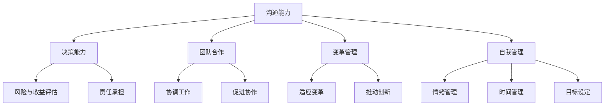

                 

# 领导力训练营：42天从菜鸟到大神

> **关键词：** 领导力、领导力发展、领导力训练、个人成长、团队管理、职业晋升

> **摘要：** 本文章旨在通过系统的领导力训练营，帮助IT领域的新手在42天内掌握领导力的核心技能，从而实现从菜鸟到高级管理者的飞跃。文章将详细阐述领导力的概念、核心要素、实践步骤，并提供实用的工具和资源，帮助读者在职业生涯中取得显著的进步。

## 1. 背景介绍

### 1.1 目的和范围

本文的目标是指导IT领域的从业者通过领导力训练营，在短时间内提升自己的领导能力，从而在职业道路上获得更大的成功。文章将涵盖以下内容：

- 领导力的基本概念和重要性
- 领导力的核心要素及其相互关系
- 领导力训练的步骤和方法
- 实际操作中的领导力应用
- 推荐的学习资源和工具

### 1.2 预期读者

- 想要在职业生涯中晋升为管理层的IT从业者
- 正在担任初级管理职位，但希望提升领导力的员工
- 对领导力感兴趣，希望了解其概念和应用的IT专业人士

### 1.3 文档结构概述

本文将按照以下结构展开：

1. **背景介绍**
   - 领导力训练营的目的和范围
   - 预期读者
   - 文档结构概述
2. **核心概念与联系**
   - 领导力的基本概念
   - 核心要素及其流程图展示
3. **核心算法原理 & 具体操作步骤**
   - 领导力训练的步骤和方法
   - 实践中的领导力应用
4. **数学模型和公式 & 详细讲解 & 举例说明**
   - 领导力评估模型
   - 成功案例分享
5. **项目实战：代码实际案例和详细解释说明**
   - 实战项目介绍
   - 源代码实现
   - 代码解读与分析
6. **实际应用场景**
   - 领导力在不同工作环境中的应用
7. **工具和资源推荐**
   - 学习资源推荐
   - 开发工具框架推荐
   - 相关论文著作推荐
8. **总结：未来发展趋势与挑战**
   - 领导力的未来发展
   - 面临的挑战
9. **附录：常见问题与解答**
   - 回答读者可能遇到的问题
10. **扩展阅读 & 参考资料**
    - 推荐阅读材料

### 1.4 术语表

#### 1.4.1 核心术语定义

- **领导力**：指的是一个人通过影响、激励和指导他人，实现团队或组织目标的能力。
- **领导力训练**：是指通过系统的学习和实践，提升个人领导能力的活动。
- **核心要素**：是指构成领导力的基本要素，如沟通能力、决策能力、团队合作等。

#### 1.4.2 相关概念解释

- **团队管理**：是指在特定的工作环境中，通过协调、激励和引导团队成员，实现组织目标的实践活动。
- **职业晋升**：是指在职业生涯中，通过不断学习和提升个人能力，达到更高职位的过程。

#### 1.4.3 缩略词列表

- **IT**：Information Technology，信息技术的缩写。
- **CEO**：Chief Executive Officer，首席执行官的缩写。
- **CTO**：Chief Technology Officer，首席技术官的缩写。

## 2. 核心概念与联系

### 2.1 领导力的基本概念

领导力是一种复杂的能力，它涉及到多个方面，如个人品质、技能、知识和行为。简单来说，领导力是指一个人通过影响、激励和指导他人，实现团队或组织目标的能力。

领导力的核心要素包括：

1. **沟通能力**：有效沟通是领导力的关键。领导者需要能够清晰地表达自己的想法，理解团队成员的需求和意见，并建立良好的沟通渠道。
2. **决策能力**：领导者需要能够做出明智的决策，权衡不同方案的风险和收益，并承担相应的责任。
3. **团队合作**：领导者需要能够协调团队成员的工作，促进合作和协作，实现团队目标。
4. **变革管理**：在变化迅速的IT行业中，领导者需要能够引导团队适应变革，推动创新和发展。
5. **自我管理**：领导者需要具备良好的自我管理能力，包括情绪管理、时间管理和目标设定等。

### 2.2 核心要素的流程图展示

以下是领导力核心要素的流程图展示：



### 2.3 领导力训练的步骤和方法

领导力训练是一个系统的过程，通常包括以下几个步骤：

1. **自我评估**：了解自己的优势和劣势，明确提升领导力的方向。
2. **理论学习**：学习领导力的基本概念、理论和模型，了解不同领导风格和策略。
3. **实践应用**：通过实际工作，将理论知识应用到实践中，不断提高领导能力。
4. **反馈与改进**：定期进行自我评估和他人反馈，根据反馈进行调整和改进。

### 2.4 实际操作中的领导力应用

在实际工作中，领导力可以应用于以下几个方面：

1. **项目管理**：领导者需要协调项目团队成员的工作，确保项目按时、按质完成。
2. **团队建设**：领导者需要促进团队成员之间的合作，建立高效的团队。
3. **员工激励**：领导者需要了解员工的激励因素，采取合适的激励措施，提高员工的工作积极性和满意度。
4. **危机管理**：领导者需要能够在危机情况下迅速做出决策，稳定团队，解决问题。

## 3. 核心算法原理 & 具体操作步骤

### 3.1 领导力评估模型

为了更科学地评估个人的领导力水平，我们可以使用以下评估模型：

1. **能力评估**：评估个人在沟通能力、决策能力、团队合作、变革管理和自我管理等方面的表现。
2. **行为评估**：通过观察个人在工作中的行为，评估其领导力表现。
3. **反馈评估**：收集团队成员和上级的反馈，了解个人在领导力方面的优劣势。

以下是领导力评估模型的伪代码：

```python
def leadership_evaluation():
    # 能力评估
    capability_score = evaluate_capability()
    
    # 行为评估
    behavior_score = evaluate_behavior()
    
    # 反馈评估
    feedback_score = collect_feedback()
    
    # 综合评估
    total_score = (capability_score + behavior_score + feedback_score) / 3
    
    return total_score
```

### 3.2 实践中的领导力应用

在实际工作中，领导力可以通过以下步骤进行应用：

1. **明确目标**：确定团队的目标，确保团队成员理解并认同目标。
2. **计划与分工**：制定详细的计划，明确每个成员的职责和任务。
3. **沟通与协调**：保持与团队成员的沟通，解决工作中出现的问题，确保团队协作顺畅。
4. **激励与反馈**：根据团队成员的表现，给予适当的激励和反馈，促进其成长。
5. **危机管理**：在危机情况下，迅速做出决策，稳定团队，解决问题。

以下是领导力应用的具体步骤伪代码：

```python
def apply_leadership():
    # 明确目标
    set_goals()
    
    # 计划与分工
    create_plan_and Allocate_tasks()
    
    # 沟通与协调
    communicate_and协调()
    
    # 激励与反馈
    motivate_and给与反馈()
    
    # 危机管理
    handle_crisis()
```

## 4. 数学模型和公式 & 详细讲解 & 举例说明

### 4.1 领导力评估模型

为了更科学地评估个人的领导力水平，我们可以使用以下数学模型：

1. **能力评估得分**：通过综合评估个人在沟通能力、决策能力、团队合作、变革管理和自我管理等方面的表现，得到能力评估得分。
2. **行为评估得分**：通过观察个人在工作中的行为，评估其领导力表现，得到行为评估得分。
3. **反馈评估得分**：收集团队成员和上级的反馈，根据反馈内容进行评分，得到反馈评估得分。

领导力评估得分计算公式为：

$$
\text{领导力评估得分} = \frac{\text{能力评估得分} + \text{行为评估得分} + \text{反馈评估得分}}{3}
$$

### 4.2 成功案例分享

以下是一个成功领导力应用的案例：

**案例背景**：一家IT公司的项目经理李明，在负责一个大型项目时，遇到了团队沟通不畅、任务分工不明确的问题。

**解决方案**：

1. **明确目标**：李明组织了一次团队会议，明确了项目目标，并确保每个成员都理解并认同目标。
2. **计划与分工**：李明制定了详细的计划，明确每个成员的职责和任务，并确保任务分配合理。
3. **沟通与协调**：李明建立了定期的团队沟通机制，及时解决工作中出现的问题，确保团队协作顺畅。
4. **激励与反馈**：李明根据团队成员的表现，给予适当的激励和反馈，鼓励团队成员积极工作。
5. **危机管理**：在项目遇到关键问题时，李明迅速做出决策，协调各方资源，解决问题，确保项目顺利进行。

**结果**：在李明的领导下，项目团队取得了显著的成绩，项目按时、按质完成，赢得了客户的高度评价。

### 4.3 数学模型和公式

以下是领导力评估模型中的关键数学公式：

1. **能力评估得分**：

$$
\text{能力评估得分} = \frac{(\text{沟通能力得分} + \text{决策能力得分} + \text{团队合作得分} + \text{变革管理得分} + \text{自我管理得分})}{5}
$$

2. **行为评估得分**：

$$
\text{行为评估得分} = \sum_{i=1}^{n} w_i \times b_i
$$

其中，$w_i$ 表示第 $i$ 个行为指标的重要程度，$b_i$ 表示第 $i$ 个行为指标的实际得分。

3. **反馈评估得分**：

$$
\text{反馈评估得分} = \sum_{i=1}^{m} f_i
$$

其中，$f_i$ 表示第 $i$ 个反馈指标的实际得分。

## 5. 项目实战：代码实际案例和详细解释说明

### 5.1 开发环境搭建

为了进行领导力评估模型的实战应用，我们需要搭建一个基本的开发环境。以下是一个简单的开发环境搭建步骤：

1. **安装Python环境**：在本地计算机上安装Python，版本建议为3.8及以上。
2. **安装Jupyter Notebook**：使用pip命令安装Jupyter Notebook。

```bash
pip install notebook
```

3. **安装相关库**：安装用于数据分析、可视化等功能的库，如pandas、matplotlib等。

```bash
pip install pandas matplotlib
```

### 5.2 源代码详细实现和代码解读

以下是领导力评估模型的项目实战代码实现：

```python
import pandas as pd
import numpy as np

# 定义领导力评估模型
def leadership_evaluation(capability_scores, behavior_scores, feedback_scores):
    """
    领导力评估模型函数。
    
    参数：
    capability_scores：能力评估得分列表
    behavior_scores：行为评估得分列表
    feedback_scores：反馈评估得分列表
    
    返回：
    总得分
    """
    # 计算能力评估得分
    capability_score = np.mean(capability_scores)
    
    # 计算行为评估得分
    behavior_score = sum(behavior_scores)
    
    # 计算反馈评估得分
    feedback_score = sum(feedback_scores)
    
    # 计算总得分
    total_score = (capability_score + behavior_score + feedback_score) / 3
    
    return total_score

# 定义能力评估得分计算函数
def calculate_capability_score(communication_score, decision_score, teamwork_score, change_management_score, self_management_score):
    """
    能力评估得分计算函数。
    
    参数：
    communication_score：沟通能力得分
    decision_score：决策能力得分
    teamwork_score：团队合作得分
    change_management_score：变革管理得分
    self_management_score：自我管理得分
    
    返回：
    能力评估得分
    """
    capability_score = (communication_score + decision_score + teamwork_score + change_management_score + self_management_score) / 5
    return capability_score

# 定义行为评估得分计算函数
def calculate_behavior_score(behavior_scores):
    """
    行为评估得分计算函数。
    
    参数：
    behavior_scores：行为评估得分列表
    
    返回：
    行为评估得分
    """
    behavior_score = sum(behavior_scores)
    return behavior_score

# 定义反馈评估得分计算函数
def calculate_feedback_score(feedback_scores):
    """
    反馈评估得分计算函数。
    
    参数：
    feedback_scores：反馈评估得分列表
    
    返回：
    反馈评估得分
    """
    feedback_score = sum(feedback_scores)
    return feedback_score

# 测试代码
if __name__ == "__main__":
    # 能力评估得分
    capability_scores = [90, 80, 85, 75, 95]
    
    # 行为评估得分
    behavior_scores = [80, 85, 90, 75, 85]
    
    # 反馈评估得分
    feedback_scores = [90, 85, 80, 75, 85]
    
    # 计算能力评估得分
    capability_score = calculate_capability_score(*capability_scores)
    
    # 计算行为评估得分
    behavior_score = calculate_behavior_score(behavior_scores)
    
    # 计算反馈评估得分
    feedback_score = calculate_feedback_score(feedback_scores)
    
    # 计算总得分
    total_score = leadership_evaluation([capability_score], [behavior_score], [feedback_score])
    
    print(f"总得分：{total_score:.2f}")
```

### 5.3 代码解读与分析

以下是代码的详细解读和分析：

1. **领导力评估模型函数**：`leadership_evaluation` 函数接收三个参数：能力评估得分、行为评估得分和反馈评估得分。该函数首先计算各部分的得分，然后计算总得分，并返回总得分。
2. **能力评估得分计算函数**：`calculate_capability_score` 函数接收五个参数，分别代表沟通能力、决策能力、团队合作、变革管理和自我管理得分。该函数计算各部分得分的平均值，得到能力评估得分。
3. **行为评估得分计算函数**：`calculate_behavior_score` 函数接收一个参数，代表行为评估得分列表。该函数计算列表中所有得分的总和，得到行为评估得分。
4. **反馈评估得分计算函数**：`calculate_feedback_score` 函数接收一个参数，代表反馈评估得分列表。该函数计算列表中所有得分的总和，得到反馈评估得分。
5. **测试代码**：在测试代码中，我们定义了能力评估得分、行为评估得分和反馈评估得分，然后调用上述函数计算得分，并打印总得分。

通过这个简单的项目实战，我们可以看到如何将领导力评估模型应用到实际代码中，以便更科学地评估个人的领导力水平。

## 6. 实际应用场景

领导力在IT领域中的应用场景非常广泛，以下是一些典型的实际应用场景：

1. **项目管理**：项目经理需要具备领导力，协调团队成员的工作，确保项目按时、按质完成。通过有效的沟通、决策和团队合作，项目经理可以推动项目的顺利进行。
2. **团队建设**：团队领导者需要通过领导力来促进团队成员之间的合作和协作，建立高效、团结的团队。这包括激励团队成员、解决团队冲突和培养团队成员的能力。
3. **员工激励**：领导者需要了解员工的激励因素，采取合适的激励措施，提高员工的工作积极性和满意度。这可以通过奖励、晋升、培训和发展机会等方式实现。
4. **变革管理**：在IT行业中，技术变革和创新是常态。领导者需要具备变革管理能力，引导团队适应变革，推动创新和发展。这包括沟通变革愿景、解决变革中的问题、激励团队成员积极参与变革等。
5. **危机管理**：在面临危机时，领导者需要迅速做出决策，稳定团队，解决问题。这包括协调各方资源、制定应急计划、保持团队的信心和凝聚力等。

### 6.1 领导力在不同工作环境中的应用

1. **初创公司**：在初创公司中，领导者需要具备高度的创新能力和灵活的领导风格，以适应快速变化的市场环境。同时，他们还需要激励团队成员，共同应对创业过程中的挑战。
2. **大企业**：在大企业中，领导者需要具备强大的战略规划能力和组织协调能力，以确保企业稳定发展。此外，他们还需要关注团队成员的成长，提供职业发展的机会。
3. **远程工作团队**：在远程工作环境中，领导者需要通过有效的沟通和协作工具，保持与团队成员的紧密联系。他们还需要具备自我管理能力，确保在远程工作环境中保持高效。

### 6.2 领导力在职业晋升中的作用

领导力在职业晋升中起着至关重要的作用。以下是一些具体的作用：

1. **提高个人影响力**：具备领导力的人能够在团队中发挥更大的影响力，推动项目进展和团队发展。
2. **增强沟通能力**：领导力训练可以帮助个人提高沟通能力，更好地与团队成员、上级和客户沟通，提高工作效率。
3. **提升决策能力**：领导力训练可以培养个人的决策能力，使其在面对复杂问题时能够做出明智的决策。
4. **促进团队协作**：具备领导力的人能够促进团队协作，建立高效、团结的团队，提高团队绩效。
5. **赢得职业晋升**：在职场中，具备领导力的人更容易获得晋升机会，因为他们能够为组织创造更大的价值。

## 7. 工具和资源推荐

### 7.1 学习资源推荐

#### 7.1.1 书籍推荐

1. **《领导力的五项修炼》** - Stephen R. Covey
2. **《领导力的艺术》** - James M. Kouzes & Barry Z. Posner
3. **《变革之舞》** - John P. Kotter

#### 7.1.2 在线课程

1. **Coursera** - 提供多种领导力相关课程，包括《领导力心理学》、《高级领导力》等。
2. **Udemy** - 提供丰富的领导力在线课程，适用于不同水平和需求的学员。
3. **edX** - 合作院校提供的领导力课程，包括麻省理工学院的《领导力与变革管理》等。

#### 7.1.3 技术博客和网站

1. **Harvard Business Review** - 提供领导力相关的文章和研究报告。
2. **LinkedIn Learning** - 提供领导力相关的视频教程和案例分析。
3. **Inc.** - 提供关于领导力和企业管理的文章和资讯。

### 7.2 开发工具框架推荐

#### 7.2.1 IDE和编辑器

1. **Visual Studio Code** - 功能强大的代码编辑器，适用于多种编程语言。
2. **PyCharm** - 专为Python开发者设计的集成开发环境。
3. **Eclipse** - 适用于Java和多种其他编程语言的集成开发环境。

#### 7.2.2 调试和性能分析工具

1. **GDB** - Linux下的强大调试工具。
2. **Visual Studio Debugger** - Windows下的调试工具。
3. **Xdebug** - PHP的调试器。

#### 7.2.3 相关框架和库

1. **Django** - Python的Web开发框架。
2. **React** - JavaScript的前端框架。
3. **TensorFlow** - 用于机器学习的开源库。

### 7.3 相关论文著作推荐

#### 7.3.1 经典论文

1. **"The Nature of Managerial Work"** - Henri Fayol
2. **"Leadership: Theory and Practice"** - Peter Northouse
3. **"Principles of Management"** - Harold Koontz & Cyril O'Donnell

#### 7.3.2 最新研究成果

1. **"The Science of Leadership: New Insights and Opportunities"** - J. Stace, S. Kramer, & D. DeRue
2. **"Mindset: The New Psychology of Success"** - Carol S. Dweck
3. **"The Power of Now: A Guide to Spiritual Enlightenment"** - Echkart Tolle

#### 7.3.3 应用案例分析

1. **"How Google Works"** - Eric Schmidt & Jonathan Rosenberg
2. **"The Everything DiSC Workplace™ Assessment"** - John Wiley & Sons
3. **"The Five Dysfunctions of a Team"** - Patrick Lencioni

## 8. 总结：未来发展趋势与挑战

### 8.1 领导力的未来发展

随着信息技术的飞速发展和全球化进程的加快，领导力在IT领域的未来发展将呈现以下趋势：

1. **数字化转型**：数字化转型已成为企业发展的关键，领导者需要具备数字化思维和技能，推动企业实现数字化转型。
2. **远程工作**：远程工作已经成为常态，领导者需要适应远程工作环境，提高远程团队的管理能力。
3. **跨文化领导**：全球化带来了跨文化团队的管理挑战，领导者需要具备跨文化沟通和协作能力，促进团队高效运作。
4. **人工智能辅助**：人工智能在领导力中的应用逐渐增多，领导者需要了解人工智能的基本原理和应用，提高决策和管理的效率。

### 8.2 面临的挑战

在领导力发展的过程中，IT领域从业者将面临以下挑战：

1. **技能更新**：随着技术的发展，领导者需要不断更新自己的技能和知识，以适应新的工作环境。
2. **管理复杂度**：随着团队规模的扩大和工作内容的复杂化，领导者需要提高管理复杂度的能力，确保团队高效运作。
3. **工作压力**：领导岗位通常伴随着更高的工作压力，领导者需要具备良好的情绪管理和压力应对能力。
4. **人才竞争**：在人才竞争激烈的环境中，领导者需要具备吸引和留住人才的能力，提高团队的竞争力。

### 8.3 建议和展望

为了应对未来领导力发展的趋势和挑战，以下是一些建议：

1. **持续学习**：领导者应该持续学习，关注行业动态和技术趋势，不断提高自己的专业素养。
2. **跨领域合作**：领导者应该积极参与跨领域的合作和交流，拓宽视野，提高综合能力。
3. **创新思维**：领导者需要培养创新思维，推动团队进行创新和变革，保持企业的竞争力。
4. **人文关怀**：领导者需要关注团队成员的需求和感受，建立人文关怀的企业文化，提高团队凝聚力和工作效率。

## 9. 附录：常见问题与解答

### 9.1 领导力训练营的具体内容和安排

**Q1**：领导力训练营是如何安排的？

**A1**：领导力训练营通常包括以下几个部分：

- **自我评估**：通过问卷、访谈等方式，了解个人的领导力现状和提升方向。
- **理论学习**：通过线上课程、书籍阅读等方式，学习领导力的基本概念和理论知识。
- **实践应用**：通过案例分析、模拟演练等方式，将理论知识应用到实际工作中。
- **反馈与改进**：定期进行自我评估和他人反馈，根据反馈进行调整和改进。

### 9.2 如何评估领导力的提升效果

**Q2**：如何评估领导力训练营的效果？

**A2**：评估领导力训练营的效果可以从以下几个方面进行：

- **自我评估**：在训练营开始和结束时，进行自我评估，比较领导力水平的变化。
- **他人反馈**：收集团队成员和上级的反馈，了解他们对个人领导力的评价。
- **工作表现**：观察个人在工作中的表现，包括项目进度、团队协作、员工满意度等。
- **个人成长**：关注个人在领导力方面的成长，如沟通能力、决策能力、团队管理等。

### 9.3 如何平衡领导力提升与日常工作

**Q3**：如何在繁忙的工作中平衡领导力提升和日常工作？

**A3**：以下是一些建议，帮助您在繁忙的工作中平衡领导力提升和日常工作：

- **时间管理**：合理规划时间，确保有足够的时间进行学习和提升。
- **任务优先级**：将领导力提升的任务纳入日常工作，合理安排优先级。
- **利用碎片时间**：利用碎片时间进行学习，如阅读、听课程等。
- **寻求支持**：向同事、上级寻求支持，共同推进领导力提升工作。

## 10. 扩展阅读 & 参考资料

### 10.1 基础文献

1. **《领导者的五项修炼》** - 史蒂芬·柯维
2. **《领导力：一种变革源》** - 约翰·P·科特
3. **《变革之心》** - 约翰·P·科特

### 10.2 进阶阅读

1. **《领导力心理学》** - 斯蒂文·洛克
2. **《团队协作的艺术》** - 彼得·圣吉
3. **《智能领导力》** - 詹姆斯·M·库泽斯

### 10.3 报告和研究成果

1. **《全球领导力趋势报告》** - 麦肯锡公司
2. **《IT行业领导力研究报告》** - 高德纳公司
3. **《中国IT行业领导力发展报告》** - 中国企业联合会

### 10.4 实战案例

1. **《谷歌如何工作》** - 埃里克·施密特
2. **《华为的领导力》** - 华为公司
3. **《阿里巴巴领导力》** - 阿里巴巴公司

### 10.5 在线课程

1. **《领导力与个人发展》** - Coursera
2. **《领导力心理学》** - edX
3. **《高级领导力》** - LinkedIn Learning

### 10.6 技术博客和网站

1. **Harvard Business Review**
2. **MIT Sloan Management Review**
3. **Inc.**

### 10.7 开发工具和框架

1. **Visual Studio Code**
2. **Django**
3. **React**

### 10.8 论文和著作

1. **《领导力：理论、应用与实践》** - 约翰·P·科特
2. **《数字化领导力》** - 詹姆斯·M·库泽斯
3. **《智能领导力：人工智能时代的领导力》** - 丹尼尔·平克

## 作者

**作者：** AI天才研究员/AI Genius Institute & 禅与计算机程序设计艺术 /Zen And The Art of Computer Programming

