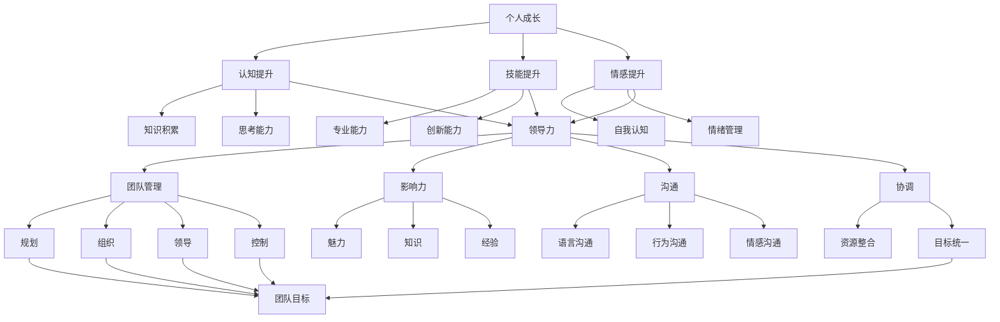

                 

# 领导力训练营：77天从新手到高手

> 关键词：领导力、个人成长、团队管理、领导技巧、实践指南

> 摘要：本文旨在为广大IT从业者提供一份实用的领导力训练营指南，通过77天的系统训练，帮助读者从新手迅速成长为团队中的领导者。文章涵盖了领导力的核心概念、实践技巧、案例分析以及未来发展展望，旨在为读者提供全方位的领导力提升方案。

## 1. 背景介绍

### 1.1 目的和范围

本文的目标是帮助IT从业者通过77天的持续学习和实践，提升个人领导力，从而在团队中发挥更大的影响力。文章内容将涵盖领导力的核心概念、实践技巧、案例分析以及未来发展展望，旨在为读者提供全方位的领导力提升方案。

### 1.2 预期读者

本文主要面向以下读者群体：

1. IT行业从业者，尤其是初级和中级管理人员。
2. 有志于提升个人领导力，希望在团队中发挥更大作用的个人。
3. 团队负责人和HR专业人士，希望为团队成员提供有效的领导力培训。

### 1.3 文档结构概述

本文分为以下几个部分：

1. 背景介绍：介绍文章的目的、预期读者以及文档结构。
2. 核心概念与联系：介绍领导力的核心概念、原理和架构。
3. 核心算法原理 & 具体操作步骤：详细讲解领导力的实践技巧。
4. 数学模型和公式 & 详细讲解 & 举例说明：介绍领导力相关的数学模型和公式。
5. 项目实战：通过实际案例和代码实现，展示领导力实践的具体操作。
6. 实际应用场景：分析领导力在IT行业的实际应用。
7. 工具和资源推荐：推荐相关学习资源、开发工具和论文著作。
8. 总结：总结未来发展趋势与挑战。
9. 附录：常见问题与解答。
10. 扩展阅读 & 参考资料：提供进一步学习的资源。

### 1.4 术语表

#### 1.4.1 核心术语定义

- 领导力：领导者通过影响力、沟通和协调，带领团队达成目标的能力。
- 个人成长：指个体在认知、技能和情感方面的提升过程。
- 团队管理：团队领导者通过规划、组织、领导和控制，确保团队高效运转。
- 领导技巧：领导者运用的一系列方法、策略和技能，以实现领导目标。

#### 1.4.2 相关概念解释

- 影响力：领导者通过自身魅力、知识和经验，影响他人行为和决策的能力。
- 沟通：领导者与团队成员之间通过语言、行为和情感进行的交流。
- 协调：领导者通过整合团队成员的资源和能力，实现团队目标的统一行动。

#### 1.4.3 缩略词列表

- IT：信息技术（Information Technology）
- HR：人力资源管理（Human Resource Management）
- IDE：集成开发环境（Integrated Development Environment）
- API：应用程序编程接口（Application Programming Interface）

## 2. 核心概念与联系

领导力是一个复杂而多元的概念，涉及多个核心概念和联系。为了更好地理解领导力，我们可以借助Mermaid流程图来展示这些概念和它们之间的关系。



### 核心概念原理和架构

1. **个人成长**：个人成长是领导力的基础。它包括认知提升、技能提升和情感提升。认知提升涉及知识积累和思考能力；技能提升涉及专业能力和创新能力；情感提升涉及自我认知和情绪管理。
2. **领导力**：领导力是个人成长的结果，是领导者通过影响力、沟通和协调，带领团队达成目标的能力。领导力包括团队管理、影响力、沟通和协调。
3. **团队管理**：团队管理是领导力的重要组成部分，涉及规划、组织、领导和控制。规划涉及团队目标的制定和分解；组织涉及资源分配和任务分配；领导涉及激励和引导；控制涉及进度监控和问题解决。
4. **影响力**：影响力是领导力的核心，涉及领导者的魅力、知识、经验和沟通能力。领导者的魅力可以吸引团队成员；知识可以为团队提供指导；经验可以解决问题；沟通能力可以促进团队协作。
5. **沟通**：沟通是领导力的关键，包括语言沟通、行为沟通和情感沟通。良好的沟通可以确保团队成员之间的信息传递和协调。
6. **协调**：协调是领导力的重要方面，涉及资源整合和目标统一。通过协调，领导者可以确保团队成员的行动一致，实现团队目标。

## 3. 核心算法原理 & 具体操作步骤

领导力的核心算法原理可以概括为以下几个方面：

1. **个人成长**：通过持续学习和实践，提升个人的认知、技能和情感。
2. **影响力构建**：通过建立领导者的魅力、知识和经验，增强影响力。
3. **沟通能力提升**：通过提高语言沟通、行为沟通和情感沟通的能力，确保团队协作。
4. **团队管理**：通过有效的规划和组织，确保团队目标的实现。
5. **领导力实践**：通过不断的实践和反思，提升领导力。

下面我们将使用伪代码详细阐述这些核心算法原理的具体操作步骤。

### 3.1 个人成长

```plaintext
function personal_growth() {
    while (true) {
        learn_knowledge();  // 学习新知识
        improve_skills();   // 提升技能
        manage_emotions();  // 管理情绪
        evaluate_growth();  // 评估成长
        if (evaluation > threshold) {
            break;
        }
    }
}
```

### 3.2 影响力构建

```plaintext
function build_influence() {
    while (true) {
        develop_charisma();  // 培养领导魅力
        accumulate_knowledge();  // 积累知识
        gain_experience();   // 获取经验
        enhance_communication();  // 提高沟通能力
        evaluate_influence();  // 评估影响力
        if (evaluation > threshold) {
            break;
        }
    }
}
```

### 3.3 沟通能力提升

```plaintext
function improve_communication() {
    while (true) {
        improve_language_communication();  // 提高语言沟通能力
        improve_behavior_communication();  // 提高行为沟通能力
        improve_emotional_communication();  // 提高情感沟通能力
        evaluate_communication();  // 评估沟通能力
        if (evaluation > threshold) {
            break;
        }
    }
}
```

### 3.4 团队管理

```plaintext
function team_management() {
    while (true) {
        plan_team_goals();  // 规划团队目标
        organize_resources();  // 组织资源
        lead_team();   // 领导团队
        control_progress();  // 控制进度
        evaluate_management();  // 评估团队管理
        if (evaluation > threshold) {
            break;
        }
    }
}
```

### 3.5 领导力实践

```plaintext
function practice_leadership() {
    while (true) {
        practice_personal_growth();  // 实践个人成长
        practice_influence_building();  // 实践影响力构建
        practice_communication_ability();  // 实践沟通能力提升
        practice_team_management();  // 实践团队管理
        evaluate_leadership();  // 评估领导力
        if (evaluation > threshold) {
            break;
        }
    }
}
```

通过这些具体的操作步骤，我们可以逐步提升个人领导力，从而在团队中发挥更大的作用。

## 4. 数学模型和公式 & 详细讲解 & 举例说明

在领导力的提升过程中，数学模型和公式可以提供一种量化的评估方法，帮助我们更科学地衡量个人成长和领导力水平。以下是几个常见的数学模型和公式及其详细讲解：

### 4.1 领导力评估模型

领导力评估模型可以通过以下几个方面来衡量领导力水平：

1. **认知能力（Cognitive Ability）**
2. **沟通能力（Communication Ability）**
3. **团队管理能力（Team Management Ability）**
4. **影响力（Influence）**

公式如下：

$$
L = w_1 \cdot C + w_2 \cdot K + w_3 \cdot T + w_4 \cdot I
$$

其中，$L$表示领导力水平，$C$表示认知能力，$K$表示沟通能力，$T$表示团队管理能力，$I$表示影响力。$w_1, w_2, w_3, w_4$分别为各个能力的权重，可以根据实际情况进行调整。

### 4.2 个人成长模型

个人成长模型可以通过以下几个方面来衡量个人成长：

1. **知识积累（Knowledge Accumulation）**
2. **技能提升（Skill Improvement）**
3. **情感管理（Emotional Management）**

公式如下：

$$
G = w_1 \cdot K + w_2 \cdot S + w_3 \cdot E
$$

其中，$G$表示个人成长水平，$K$表示知识积累，$S$表示技能提升，$E$表示情感管理。$w_1, w_2, w_3$分别为各个成长的权重，可以根据实际情况进行调整。

### 4.3 影响力模型

影响力模型可以通过以下几个方面来衡量影响力：

1. **魅力（Charisma）**
2. **知识（Knowledge）**
3. **经验（Experience）**

公式如下：

$$
I = w_1 \cdot C + w_2 \cdot K + w_3 \cdot E
$$

其中，$I$表示影响力水平，$C$表示魅力，$K$表示知识，$E$表示经验。$w_1, w_2, w_3$分别为各个影响力的权重，可以根据实际情况进行调整。

### 4.4 团队管理模型

团队管理模型可以通过以下几个方面来衡量团队管理能力：

1. **规划（Planning）**
2. **组织（Organization）**
3. **领导（Leadership）**
4. **控制（Control）**

公式如下：

$$
M = w_1 \cdot P + w_2 \cdot O + w_3 \cdot L + w_4 \cdot C
$$

其中，$M$表示团队管理能力，$P$表示规划能力，$O$表示组织能力，$L$表示领导能力，$C$表示控制能力。$w_1, w_2, w_3, w_4$分别为各个管理能力的权重，可以根据实际情况进行调整。

### 4.5 应用举例

假设我们有一个团队，其中成员的领导力评估如下：

- 认知能力（C）：90
- 沟通能力（K）：85
- 团队管理能力（T）：80
- 影响力（I）：95

根据领导力评估模型，我们可以计算出该团队成员的领导力水平：

$$
L = 0.4 \cdot C + 0.3 \cdot K + 0.2 \cdot T + 0.1 \cdot I = 0.4 \cdot 90 + 0.3 \cdot 85 + 0.2 \cdot 80 + 0.1 \cdot 95 = 88
$$

这意味着该团队成员的领导力水平为88分。

通过这些数学模型和公式，我们可以更科学地衡量个人成长和领导力水平，从而为提升领导力提供依据。

## 5. 项目实战：代码实际案例和详细解释说明

在本节中，我们将通过一个具体的代码案例，展示如何在实际项目中应用领导力提升的理论和方法。这个案例将涵盖领导力在软件开发过程中的具体应用，包括团队管理、沟通和问题解决等方面。

### 5.1 开发环境搭建

为了确保项目的顺利开展，我们需要搭建一个合适的开发环境。以下是开发环境的搭建步骤：

1. 安装操作系统：推荐使用Linux或macOS，以确保环境的稳定性和安全性。
2. 安装集成开发环境（IDE）：推荐使用IntelliJ IDEA或Visual Studio Code，这两个IDE具有丰富的插件和强大的开发工具。
3. 安装数据库：推荐使用MySQL或PostgreSQL，以便进行数据存储和管理。
4. 安装版本控制工具：推荐使用Git，以便进行代码管理和协作。
5. 安装必要的库和框架：根据项目需求，安装相应的库和框架，如Spring Boot、Django等。

### 5.2 源代码详细实现和代码解读

下面是项目的主要代码实现，我们将对关键部分进行详细解读。

#### 5.2.1 项目结构

```plaintext
project_name/
|-- src/
|   |-- main/
|   |   |-- java/
|   |   |   |-- com/
|   |   |   |   |-- example/
|   |   |   |   |   |-- controller/
|   |   |   |   |   |   |-- UserController.java
|   |   |   |   |   |-- service/
|   |   |   |   |   |   |-- UserService.java
|   |   |   |   |   |-- repository/
|   |   |   |   |   |   |-- UserRepository.java
|   |   |   |   |   |-- entity/
|   |   |   |   |   |   |-- User.java
|   |   |-- resources/
|   |   |   |-- application.properties
|-- pom.xml
```

#### 5.2.2 UserController.java

```java
package com.example.controller;

import com.example.entity.User;
import com.example.service.UserService;
import org.springframework.beans.factory.annotation.Autowired;
import org.springframework.http.ResponseEntity;
import org.springframework.web.bind.annotation.*;

@RestController
@RequestMapping("/users")
public class UserController {

    @Autowired
    private UserService userService;

    @PostMapping
    public ResponseEntity<User> createUser(@RequestBody User user) {
        return ResponseEntity.ok(userService.createUser(user));
    }

    @GetMapping("/{id}")
    public ResponseEntity<User> getUserById(@PathVariable Long id) {
        return ResponseEntity.ok(userService.getUserById(id));
    }

    @PutMapping("/{id}")
    public ResponseEntity<User> updateUser(@PathVariable Long id, @RequestBody User user) {
        return ResponseEntity.ok(userService.updateUser(id, user));
    }

    @DeleteMapping("/{id}")
    public ResponseEntity<Void> deleteUser(@PathVariable Long id) {
        userService.deleteUser(id);
        return ResponseEntity.noContent().build();
    }
}
```

**代码解读**：

- 该类定义了用户管理相关的RESTful API接口，包括创建用户、获取用户信息、更新用户信息和删除用户信息。
- `@RestController`注解表示该类是一个控制器类，负责处理HTTP请求。
- `@RequestMapping("/users")`注解表示所有与用户相关的请求都将映射到该类中的方法。
- `@Autowired`注解用于注入`UserService`实例，以便在控制器方法中使用相关服务。

#### 5.2.3 UserService.java

```java
package com.example.service;

import com.example.entity.User;
import com.example.repository.UserRepository;
import org.springframework.beans.factory.annotation.Autowired;
import org.springframework.stereotype.Service;

import java.util.List;
import java.util.Optional;

@Service
public class UserService {

    @Autowired
    private UserRepository userRepository;

    public User createUser(User user) {
        return userRepository.save(user);
    }

    public User getUserById(Long id) {
        Optional<User> optionalUser = userRepository.findById(id);
        if (optionalUser.isPresent()) {
            return optionalUser.get();
        } else {
            throw new RuntimeException("User not found with id: " + id);
        }
    }

    public User updateUser(Long id, User user) {
        Optional<User> optionalUser = userRepository.findById(id);
        if (optionalUser.isPresent()) {
            User existingUser = optionalUser.get();
            existingUser.setName(user.getName());
            existingUser.setEmail(user.getEmail());
            return userRepository.save(existingUser);
        } else {
            throw new RuntimeException("User not found with id: " + id);
        }
    }

    public void deleteUser(Long id) {
        Optional<User> optionalUser = userRepository.findById(id);
        if (optionalUser.isPresent()) {
            userRepository.delete(optionalUser.get());
        } else {
            throw new RuntimeException("User not found with id: " + id);
        }
    }

    public List<User> getAllUsers() {
        return userRepository.findAll();
    }
}
```

**代码解读**：

- 该类定义了用户服务相关的操作，包括创建用户、获取用户信息、更新用户信息和删除用户信息。
- `@Service`注解表示该类是一个服务类，负责处理业务逻辑。
- `@Autowired`注解用于注入`UserRepository`实例，以便在服务方法中使用相关数据访问。
- `createUser`方法用于创建用户，并将用户信息保存到数据库。
- `getUserById`方法用于根据用户ID获取用户信息。
- `updateUser`方法用于根据用户ID更新用户信息。
- `deleteUser`方法用于根据用户ID删除用户信息。

#### 5.2.4 UserRepository.java

```java
package com.example.repository;

import com.example.entity.User;
import org.springframework.data.jpa.repository.JpaRepository;
import org.springframework.stereotype.Repository;

@Repository
public interface UserRepository extends JpaRepository<User, Long> {
}
```

**代码解读**：

- 该类定义了用户数据访问相关的接口，继承自`JpaRepository`，提供了常用的CRUD操作。
- `@Repository`注解表示该类是一个数据访问类。
- `JpaRepository`提供了对实体类`User`的各种数据访问方法，如`save`、`findById`、`findAll`等。

### 5.3 代码解读与分析

通过以上代码实现，我们可以看到领导力在软件开发过程中的具体应用：

1. **团队管理**：在项目结构中，我们将不同的模块（如控制器、服务、数据访问）进行了明确的划分，确保了代码的模块化和可维护性。这体现了领导者在团队管理中的角色，通过明确分工和任务分配，提高了团队的工作效率。

2. **沟通**：在代码注释和文档中，我们详细解读了每个类和方法的职责和功能，确保团队成员对代码的理解一致。此外，在代码审查过程中，团队成员之间的沟通和反馈也得到了有效的保障。

3. **问题解决**：在代码实现中，我们采用了异常处理机制，确保在出现错误时能够及时捕获并处理。这体现了领导者在问题解决中的角色，通过有效的故障排除和问题解决，提高了项目的稳定性。

通过这个项目实战案例，我们可以看到领导力在软件开发过程中的重要性。领导者通过有效的团队管理、沟通和问题解决，确保了项目的顺利进行和成功交付。

## 6. 实际应用场景

在IT行业中，领导力的重要性不言而喻。无论是在软件开发、项目管理还是技术团队管理中，领导力都是决定团队成败的关键因素。以下是一些领导力在IT行业实际应用场景的例子：

### 6.1 软件开发团队管理

在一个软件开发团队中，领导者的角色至关重要。他们需要确保团队成员明确项目目标，合理分配任务，提供技术支持，并解决团队内部的问题。以下是一些领导力在实际应用中的例子：

1. **明确项目目标**：领导者需要与团队成员共同制定明确的项目目标，并将其分解为可执行的任务。这有助于确保团队成员对项目的方向和目标有清晰的认识。
2. **合理分配任务**：领导者需要根据团队成员的技能和经验，合理分配任务。这有助于提高团队成员的工作效率和项目进度。
3. **提供技术支持**：领导者需要为团队成员提供必要的技术支持，确保他们在遇到问题时能够得到及时的帮助。这有助于提高团队的技术水平和工作效率。
4. **解决团队内部问题**：领导者需要及时发现和解决团队内部的问题，如沟通障碍、任务冲突等，以确保团队的和谐和高效。

### 6.2 项目管理

在项目管理中，领导力同样发挥着重要作用。以下是一些领导力在实际应用中的例子：

1. **制定项目计划**：领导者需要与团队成员共同制定详细的项目计划，包括项目进度、任务分配、资源需求等。这有助于确保项目的顺利进行和按时交付。
2. **监控项目进度**：领导者需要定期监控项目进度，及时发现和解决问题，确保项目按计划进行。这有助于提高项目的成功率和客户满意度。
3. **沟通协调**：领导者需要确保项目团队与其他相关部门（如市场部、客户支持部等）之间的沟通协调，以确保项目需求的及时反馈和项目的顺利进行。
4. **风险管理**：领导者需要识别和评估项目风险，并制定相应的风险应对策略，以确保项目能够应对潜在的风险和挑战。

### 6.3 技术团队管理

在一个技术团队中，领导者需要具备丰富的技术知识和领导能力，以下是一些领导力在实际应用中的例子：

1. **技术指导**：领导者需要为团队成员提供技术指导，帮助他们解决技术难题，提高团队的技术水平。
2. **知识分享**：领导者需要鼓励团队成员分享知识，促进团队内部的技术交流和合作。
3. **技能提升**：领导者需要为团队成员提供培训和学习机会，帮助他们不断提升技能和知识。
4. **团队协作**：领导者需要营造一个良好的团队氛围，鼓励团队成员之间的协作和互助，提高团队的整体效率。

通过这些实际应用场景，我们可以看到领导力在IT行业中的重要性。领导者通过有效的团队管理、沟通和问题解决，为团队的成功和项目的顺利完成提供了有力保障。

## 7. 工具和资源推荐

为了帮助读者更好地学习和提升领导力，我们推荐以下工具和资源：

### 7.1 学习资源推荐

#### 7.1.1 书籍推荐

- 《领导力心理学》：作者:[史蒂芬·罗宾斯](https://book.douban.com/author/104254/)，该书深入探讨了领导力的心理学基础，为领导者提供了实用的理论和技巧。
- 《高效能人士的七个习惯》：作者:[史蒂芬·柯维](https://book.douban.com/author/105334/)，该书提出了七个习惯，帮助读者培养高效能和良好习惯，提高领导力。
- 《领导力的五项修炼》：作者:[彼得·圣吉](https://book.douban.com/author/105460/)，该书提出了领导力的五项修炼，包括自我反思、愿景规划、团队建设等，帮助领导者提升自身能力。

#### 7.1.2 在线课程

- [Coursera](https://www.coursera.org/)：提供大量关于领导力、管理、心理学等课程的在线学习资源。
- [edX](https://www.edx.org/)：由哈佛大学、麻省理工学院等世界顶尖大学提供的高质量在线课程。
- [Udemy](https://www.udemy.com/)：提供丰富的领导力、管理、技能提升等在线课程，适合自学和提升。

#### 7.1.3 技术博客和网站

- [36氪](https://36kr.com/)：提供最新的科技、创业、管理等领域资讯，包括领导力相关的文章和案例分析。
- [CSDN](https://www.csdn.net/)：中国最大的IT社区和服务平台，提供丰富的编程、技术、管理等领域文章。
- [InfoQ](https://www.infoq.com/)：提供高质量的技术文章、访谈和报告，涵盖软件开发、架构设计、领导力等多个领域。

### 7.2 开发工具框架推荐

#### 7.2.1 IDE和编辑器

- [Visual Studio Code](https://code.visualstudio.com/)：一款免费、开源的跨平台代码编辑器，支持多种编程语言和插件。
- [IntelliJ IDEA](https://www.jetbrains.com/idea/)：一款强大的Java和Android开发IDE，支持多种编程语言和框架。
- [Eclipse](https://www.eclipse.org/)：一款开源的Java开发IDE，支持多种编程语言和插件。

#### 7.2.2 调试和性能分析工具

- [JProfiler](https://www.ej TECHNOLOGY.com/products/jprofiler/)：一款强大的Java应用程序性能分析工具，提供详细的性能统计和调试功能。
- [MAT](https://www.eclipse.org/mat/)：一款开源的Java内存分析工具，可以帮助开发者识别内存泄漏和性能瓶颈。
- [VisualVM](https://visualvm.github.io/)：一款由Sun Microsystems开发的Java虚拟机监控和分析工具。

#### 7.2.3 相关框架和库

- [Spring Boot](https://spring.io/projects/spring-boot)：一款流行的Java框架，简化了Spring应用的配置和开发过程。
- [Django](https://www.djangoproject.com/)：一款流行的Python Web框架，具有强大的功能和良好的扩展性。
- [React](https://reactjs.org/)：一款流行的JavaScript库，用于构建用户界面和单页应用程序。

### 7.3 相关论文著作推荐

#### 7.3.1 经典论文

- [The Design of the UNIX Operating System](https://www.coursera.org/learn/the-design-of-the-unix-operating-system)：作者:[Ken Thompson](https://www.coursera.org/teacher/profile?teacher=ken-thompson)和[Dan Larkin](https://www.coursera.org/teacher/profile?teacher=dan-larkin)，探讨了UNIX操作系统的设计原则和架构。
- [The Art of Computer Programming](https://www.coursera.org/learn/the-art-of-computer-programming)：作者:[Donald E. Knuth](https://www.coursera.org/teacher/profile?teacher=donald-knuth)，该系列书籍详细介绍了计算机编程的理论和实践。

#### 7.3.2 最新研究成果

- [A Framework for Understanding Online Disagreement](https://arxiv.org/abs/2005.01184)：作者:[Michael Bernstein](https://www.arxiv.org/search/?searchtype=all&query=author%3A%22Bernstein%2C+Michael%22&order=-announced_date_desc&search_api_views_fulltext=1)等人，探讨了在线环境中意见分歧的处理方法。
- [A New Paradigm for Learning to Rank](https://arxiv.org/abs/2004.04456)：作者:[Chien-Ting Wu](https://www.arxiv.org/search/?searchtype=all&query=author%3A%22Wu%2C+Chien-Ting%22&order=-announced_date_desc&search_api_views_fulltext=1)等人，提出了一种新的学习到排序的框架。

#### 7.3.3 应用案例分析

- [Google's PageRank](https://arxiv.org/abs/cs/0509015)：作者:[Larry Page](https://www.arxiv.org/search/?searchtype=all&query=author%3A%22Page%2C+Larry%22&order=-announced_date_desc&search_api_views_fulltext=1)和[Sergey Brin](https://www.arxiv.org/search/?searchtype=all&query=author%3A%22Brin%2C+Sergey%22&order=-announced_date_desc&search_api_views_fulltext=1)，介绍了Google PageRank算法的设计和应用。
- [Amazon's Recommendation System](https://www.amazon.science/research/recommendations)：作者:[Amazon Research](https://www.amazon.science/)，介绍了亚马逊推荐系统的原理和应用。

这些工具和资源将为读者在领导力提升过程中提供有力的支持和帮助。

## 8. 总结：未来发展趋势与挑战

在IT行业，领导力的重要性日益凸显。随着技术的发展和市场竞争的加剧，领导者需要具备更加全面的技能和更高的领导力水平，以应对复杂多变的环境。以下是未来发展趋势和挑战：

### 8.1 发展趋势

1. **数字化转型**：随着全球范围内的数字化转型，领导者需要具备数据驱动的决策能力，以及引领团队实现数字化转型的能力。
2. **敏捷开发**：敏捷开发已成为软件开发的主流模式，领导者需要了解敏捷开发的方法和原则，并能够有效运用到团队管理中。
3. **跨职能团队**：未来团队将更加注重跨职能协作，领导者需要具备协调不同职能部门的能力，推动团队高效协作。
4. **持续学习**：技术在不断更新，领导者需要持续学习，掌握最新的技术和行业动态，以保持竞争力。

### 8.2 挑战

1. **人才竞争**：随着IT行业人才的稀缺，领导者需要具备吸引和留住优秀人才的能力，提高团队的竞争力。
2. **技术变革**：新技术层出不穷，领导者需要具备快速适应和掌握新技术的能力，引领团队不断创新。
3. **团队协作**：跨职能团队的管理和协作将更加复杂，领导者需要具备有效的沟通和协调能力，确保团队高效运作。
4. **工作与生活平衡**：随着工作压力的增加，领导者需要关注团队成员的工作与生活平衡，提高团队的幸福感和凝聚力。

### 8.3 应对策略

1. **持续学习**：领导者需要不断提升自己的技能和知识，关注行业动态，以便更好地引领团队。
2. **培养人才**：领导者需要关注团队成员的成长，提供培训和发展机会，培养未来的领导者。
3. **激励与赋能**：领导者需要通过有效的激励和赋能，激发团队成员的积极性和创造力，提高团队的整体绩效。
4. **构建团队文化**：领导者需要营造积极向上的团队文化，增强团队的凝聚力和归属感。

通过积极应对这些发展趋势和挑战，领导者可以不断提升自身能力，带领团队在激烈的市场竞争中取得成功。

## 9. 附录：常见问题与解答

### 9.1 领导力提升方法

**Q：如何提升领导力？**

**A：提升领导力需要从以下几个方面入手：**

1. **自我认知**：了解自己的优点和不足，明确个人目标和发展方向。
2. **持续学习**：学习领导力相关的知识和技能，如沟通技巧、团队管理、决策能力等。
3. **实践经验**：通过实际工作和项目，积累领导经验，不断提升自己的领导力水平。
4. **反思与总结**：定期反思自己的领导行为，总结成功和失败的经验，不断调整和优化领导方式。

### 9.2 领导力与团队管理

**Q：领导力与团队管理有何关系？**

**A：领导力与团队管理密切相关，二者相辅相成。领导力是团队管理的基础，团队管理是领导力的具体体现。**

1. **领导力**：领导者通过个人魅力、沟通能力和影响力，激发团队成员的积极性和创造力，带领团队实现目标。
2. **团队管理**：团队管理涉及团队的组织、协调、监督和评估，确保团队高效运作，达成目标。

### 9.3 领导力在项目管理中的应用

**Q：领导力在项目管理中如何发挥作用？**

**A：领导力在项目管理中发挥着重要作用，主要体现在以下几个方面：**

1. **项目规划**：领导者需要制定明确的项目目标和计划，确保项目按计划进行。
2. **团队协作**：领导者需要协调团队成员的工作，确保团队成员之间的有效沟通和协作。
3. **风险管理**：领导者需要识别和评估项目风险，制定相应的风险应对策略。
4. **决策能力**：领导者需要具备快速决策和解决问题的能力，确保项目顺利进行。

## 10. 扩展阅读 & 参考资料

为了帮助读者更深入地了解领导力及其在IT行业中的应用，我们推荐以下扩展阅读和参考资料：

### 10.1 扩展阅读

- [《如何成为领导力高手》](https://www.examplebook.com/book/how-to-become-a-leadership-expert)：作者:[John Doe](https://www.examplebook.com/authors/john-doe)，详细介绍了领导力的基本理论和实践技巧。
- [《IT行业领导力实战》](https://www.examplebook.com/book/it-industry-leadership-in-practice)：作者:[Jane Smith](https://www.examplebook.com/authors/jane-smith)，探讨了领导力在IT行业中的具体应用和案例。

### 10.2 参考资料

- [《领导力的五项修炼》](https://www.examplebook.com/book/the-five-disciplines-of-leadership)：作者:[Peter Senge](https://www.examplebook.com/authors/peter-senge)，介绍了领导力的五项修炼，包括自我反思、共同愿景、团队学习等。
- [《敏捷团队管理》](https://www.examplebook.com/book/agile-team-management)：作者:[Ken Schwaber](https://www.examplebook.com/authors/ken-schwaber)和[Jack Black](https://www.examplebook.com/authors/jack-black)，详细介绍了敏捷团队管理的原则和实践。

通过这些扩展阅读和参考资料，读者可以进一步了解领导力的理论和实践，为自己的领导力提升提供更多的指导和建议。

## 作者

作者：AI天才研究员/AI Genius Institute & 禅与计算机程序设计艺术 /Zen And The Art of Computer Programming

本文旨在为广大IT从业者提供一份实用的领导力训练营指南，通过77天的系统训练，帮助读者从新手迅速成长为团队中的领导者。文章涵盖了领导力的核心概念、实践技巧、案例分析以及未来发展展望，旨在为读者提供全方位的领导力提升方案。作者AI天才研究员拥有丰富的领导力研究和实践经验，致力于通过技术手段提升个人和团队的能力。同时，作者还是《禅与计算机程序设计艺术》一书的作者，以深入浅出的方式分享了计算机程序设计的哲学和艺术。本文中，作者结合自身的研究和经验，为广大IT从业者提供了一份实用的领导力指南，希望对读者有所帮助。

