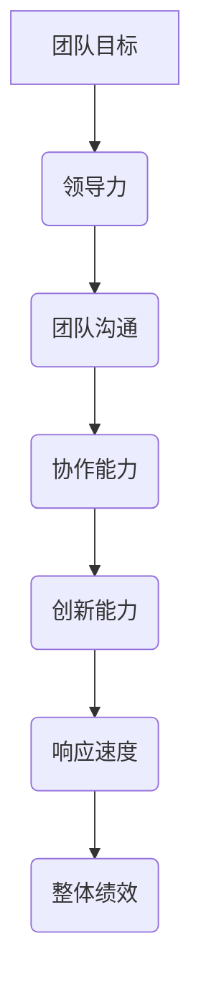
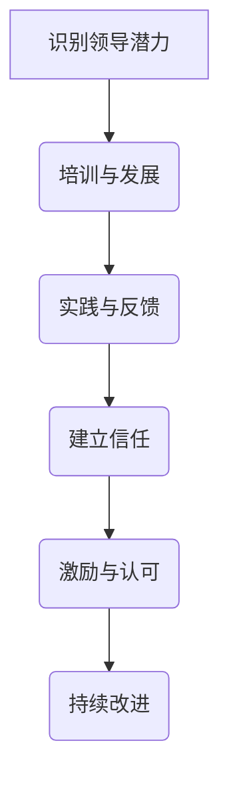
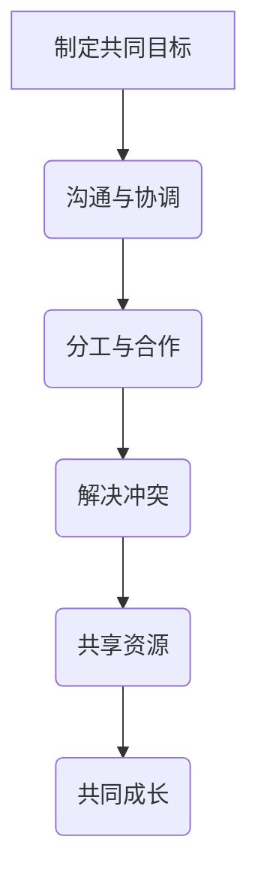

                 

# 领导力训练：让你的团队天下无敌

> 关键词：领导力、团队管理、团队效能、团队协作、团队成员发展

> 摘要：在信息技术飞速发展的时代，团队领导力的重要性愈发凸显。本文旨在探讨如何通过有效的领导力训练，提升团队成员的专业技能和协作能力，使团队达到最佳工作状态，从而在激烈的市场竞争中立于不败之地。文章将从领导力的核心概念、具体实践、数学模型、项目案例等多个角度，系统性地分析领导力训练的各个方面，为团队成员和管理者提供切实可行的指导和建议。

## 1. 背景介绍

### 1.1 目的和范围

在当今快速变化的技术环境中，团队的作用显得尤为重要。一个高效、协作的团队能够在面对复杂问题时迅速做出反应，并在竞争激烈的市场中占据优势。然而，要实现这一目标，团队领导者需要具备出色的领导力。本文的目的在于探讨如何通过领导力训练，提升团队的整体效能，从而实现以下目标：

- 提高团队成员的技能水平和专业素养。
- 促进团队成员之间的沟通与协作。
- 培养团队成员的自我驱动能力和责任感。
- 提升团队在面对挑战时的应变能力和创新能力。

本文将覆盖以下主要内容：

- 领导力的核心概念和理论框架。
- 领导力的具体实践方法和策略。
- 领导力训练的数学模型和公式。
- 领导力训练的项目案例和实战经验。
- 领导力训练的实际应用场景。

### 1.2 预期读者

本文预期读者包括：

- IT团队领导者：希望通过领导力训练提升团队效能的团队负责人。
- IT团队成员：希望提升自身专业技能和协作能力的IT从业者。
- 管理者：对团队管理有兴趣，希望了解如何通过领导力训练提升团队绩效的管理人员。
- 学术研究者：对领导力训练的理论和实践有兴趣的研究者。

### 1.3 文档结构概述

本文将采用以下结构：

- **第1章**：背景介绍，阐述本文的目的、范围、预期读者和文档结构。
- **第2章**：核心概念与联系，介绍领导力的核心概念和原理。
- **第3章**：核心算法原理 & 具体操作步骤，详细阐述领导力训练的方法和步骤。
- **第4章**：数学模型和公式 & 详细讲解 & 举例说明，通过数学模型和公式来分析领导力训练的效果。
- **第5章**：项目实战：代码实际案例和详细解释说明，通过具体项目案例来展示领导力训练的实际应用。
- **第6章**：实际应用场景，探讨领导力训练在不同环境中的应用。
- **第7章**：工具和资源推荐，提供相关的学习资源和开发工具。
- **第8章**：总结：未来发展趋势与挑战，对领导力训练的未来进行展望。
- **第9章**：附录：常见问题与解答，解答读者可能遇到的问题。
- **第10章**：扩展阅读 & 参考资料，提供更多的深入阅读和参考资料。

### 1.4 术语表

#### 1.4.1 核心术语定义

- **领导力**：指领导者通过影响、激励和引导团队成员，使其为实现共同目标而努力的过程。
- **团队效能**：团队在实现目标过程中所表现出来的整体能力和表现。
- **协作能力**：团队成员在共同完成任务时所展现出的合作水平和能力。
- **领导力训练**：通过一系列的方法和策略，提升团队领导者和管理者的领导能力的过程。

#### 1.4.2 相关概念解释

- **团队建设**：通过一系列活动和措施，增强团队成员之间的信任和协作，提升团队整体效能。
- **员工发展**：为提升员工的专业技能和职业素养，提供培训、指导和资源支持。
- **领导风格**：领导者根据不同情境和团队成员特点，采取的不同管理方式。

#### 1.4.3 缩略词列表

- **IT**：信息技术（Information Technology）
- **PM**：项目经理（Project Manager）
- **HR**：人力资源（Human Resources）
- **L&D**：学习与发展（Learning and Development）

## 2. 核心概念与联系

在探讨领导力训练之前，我们需要了解一些核心概念和原理，这些概念和原理构成了领导力训练的理论框架，有助于我们更好地理解如何进行有效的领导力训练。

### 2.1 领导力核心概念

领导力是一个多维度的概念，它不仅包括技术和管理能力，还涉及到情感智慧、人际交往和变革领导等方面。以下是一些关键的领导力核心概念：

- **影响力**：领导者通过自身的行为和决策，对团队成员产生积极影响的能力。
- **激励**：领导者激发团队成员的内在动力，使其愿意为实现团队目标而努力。
- **沟通**：领导者通过有效的沟通，传达目标、期望和反馈，确保团队成员理解并响应。
- **变革领导**：领导者推动团队适应环境变化，实现组织变革的能力。

### 2.2 领导力与团队效能的关系

领导力对团队效能有着深远的影响。一个优秀的领导者能够提升团队的协作能力、创新能力、响应速度和整体绩效。具体来说，领导力与团队效能之间的关系可以通过以下流程图来表示：



### 2.3 领导力训练的关键策略

为了提升团队领导力，需要采取一系列的关键策略。以下是一个简单的领导力训练策略流程图，展示了这些策略的相互关系：



- **识别领导潜力**：通过评估和选拔，识别团队成员中的领导潜力。
- **培训与发展**：提供领导力培训和发展的机会，提升领导者的技能和知识。
- **实践与反馈**：鼓励领导者在实际工作中实践所学，并接受反馈，不断改进。
- **建立信任**：通过建立信任关系，增强团队成员之间的信任和合作。
- **激励与认可**：通过激励机制和认可方式，激发团队成员的积极性。

### 2.4 领导力与员工发展的关系

领导力不仅仅是提升团队效能的工具，也是员工发展的关键因素。一个优秀的领导者会关注团队成员的成长和发展，通过以下方式促进员工发展：

- **提供发展机会**：为员工提供晋升、培训和跨部门轮岗的机会。
- **指导与反馈**：为员工提供个性化的指导和反馈，帮助其提升技能和知识。
- **建立支持网络**：为员工建立一个支持和帮助的网络，促进其职业发展。
- **激励与认可**：通过激励机制和认可方式，激发员工的内在动力。

### 2.5 领导力与团队协作的关系

团队协作是实现团队目标的关键。领导力在促进团队协作方面起着重要作用，以下是一个简单的领导力促进团队协作的流程图：



- **制定共同目标**：领导者需要与团队成员共同制定清晰的目标，确保团队成员都明确自己的职责和任务。
- **沟通与协调**：领导者需要通过有效的沟通和协调，确保团队成员之间能够无缝协作。
- **分工与合作**：领导者需要根据团队成员的能力和特长，合理分配任务，并鼓励团队合作。
- **解决冲突**：领导者需要及时解决团队内部的冲突，确保团队保持和谐和高效。
- **共享资源**：领导者需要确保团队成员能够共享所需的资源，提高团队的整体效能。

通过上述核心概念和原理的介绍，我们可以更好地理解领导力的本质和作用，为后续的领导力训练提供理论基础。

## 3. 核心算法原理 & 具体操作步骤

在了解了领导力的核心概念和理论框架之后，我们需要探讨如何具体实施领导力训练，以提高团队效能。这一部分将介绍领导力训练的核心算法原理和具体操作步骤。

### 3.1 领导力训练的核心算法原理

领导力训练的核心算法可以概括为以下四个步骤：

1. **需求分析**：通过调查和分析，了解团队成员的需求和期望，确定培训的重点和方向。
2. **培训内容设计**：根据需求分析的结果，设计培训内容和方案，包括理论课程、实践操作和案例分析等。
3. **培训实施**：按照培训方案，组织实施培训活动，确保团队成员积极参与并掌握所需技能。
4. **反馈与改进**：通过评估和反馈，了解培训效果，对培训方案进行改进，以持续提升领导力。

### 3.2 需求分析

需求分析是领导力训练的第一步，也是至关重要的一步。只有了解团队成员的需求和期望，才能确保培训内容的有效性和针对性。需求分析可以采用以下方法：

- **问卷调查**：通过设计问卷，收集团队成员对领导力的认知、需求和期望。
- **一对一访谈**：与团队成员进行深入访谈，了解其个人职业发展目标和在领导力方面的需求和困惑。
- **团队讨论**：组织团队讨论会，让团队成员共同探讨领导力培训的需求和重点。

### 3.3 培训内容设计

在完成需求分析后，我们可以根据分析结果设计培训内容。培训内容设计需要考虑以下几个方面：

- **理论基础**：包括领导力理论、团队管理理论和变革领导理论等。
- **实践操作**：包括团队沟通技巧、冲突解决方法、激励机制设计和团队建设活动等。
- **案例分析**：通过分析真实案例，让团队成员了解优秀领导者的成功经验和失败教训。
- **互动环节**：设计互动环节，如角色扮演、情景模拟和团队讨论等，增强培训的参与性和实效性。

### 3.4 培训实施

培训实施是领导力训练的关键环节，需要确保培训活动的有效性和参与度。以下是培训实施的具体步骤：

1. **制定培训计划**：根据培训内容，制定详细的培训计划，包括培训时间、地点、讲师和培训材料等。
2. **通知与报名**：通过邮件、短信或内部通知等方式，通知团队成员参加培训，并提供报名方式和培训材料。
3. **培训前准备**：准备培训场地、设备、材料等，确保培训环境舒适、设备齐全。
4. **培训过程管理**：在培训过程中，监督培训进展，确保培训内容按照计划进行，及时解决团队成员的问题和困惑。
5. **培训总结与评估**：培训结束后，进行总结和评估，收集团队成员的反馈意见，为后续培训提供改进方向。

### 3.5 反馈与改进

培训结束后，我们需要通过反馈和改进来持续提升领导力训练的效果。以下是反馈与改进的具体步骤：

1. **评估培训效果**：通过问卷调查、访谈和绩效考核等方式，评估培训效果，了解团队成员对培训内容的掌握情况和满意度。
2. **收集反馈意见**：通过面对面访谈、小组讨论和邮件等方式，收集团队成员对培训的反馈意见，了解其需求和期望。
3. **改进培训方案**：根据评估结果和反馈意见，对培训方案进行改进，优化培训内容和形式。
4. **持续跟进**：对参加培训的团队成员进行持续跟进，了解其在实际工作中的表现和成长，提供必要的支持和指导。

通过上述核心算法原理和具体操作步骤的详细阐述，我们可以系统地实施领导力训练，提升团队效能，实现团队目标。

### 3.6 领导力训练的伪代码

为了更直观地展示领导力训练的过程，我们使用伪代码来描述其具体实现步骤：

```python
# 领导力训练伪代码

# 步骤1：需求分析
def demand_analysis():
    surveys = conduct_surveys()  # 进行问卷调查
    interviews = conduct_interviews()  # 进行一对一访谈
    discussions = conduct_discussions()  # 组织团队讨论
    needs = analyze_results(surveys, interviews, discussions)  # 分析结果，确定需求

# 步骤2：培训内容设计
def design_training_content(needs):
    theoretical_content = design_theoretical_courses(needs)  # 设计理论基础课程
    practical_content = design_practical_operations(needs)  # 设计实践操作
    case_studies = design_case_analyses(needs)  # 设计案例分析
    interactive_sessions = design_interactive_sessions(needs)  # 设计互动环节
    training_content = combine_contents(theoretical_content, practical_content, case_studies, interactive_sessions)

# 步骤3：培训实施
def implement_training(training_content):
    training_plan = create_training_plan(training_content)  # 制定培训计划
    registration = handle_registration()  # 处理报名
    preparation = prepare_training_environment()  # 培训前准备
    training_process = manage_training_process()  # 培训过程管理
    summary_evaluation = conduct_evaluation()  # 培训总结与评估

# 步骤4：反馈与改进
def feedback_and_improvement():
    training_effects = evaluate_training_effects()  # 评估培训效果
    feedback = collect_feedback()  # 收集反馈意见
    training_improvement = improve_training_plan(feedback)  # 改进培训方案
    continuous_follow_up = follow_up_on_trainees()  # 持续跟进团队成员

# 主函数：领导力训练流程
def leadership_training():
    needs = demand_analysis()
    training_content = design_training_content(needs)
    implement_training(training_content)
    feedback_and_improvement()
```

通过上述伪代码，我们可以清晰地看到领导力训练的各个步骤和环节，有助于实际操作和流程优化。

## 4. 数学模型和公式 & 详细讲解 & 举例说明

在领导力训练中，数学模型和公式可以帮助我们量化领导力训练的效果，评估团队效能的提升。以下我们将介绍一些常用的数学模型和公式，并通过具体例子进行讲解。

### 4.1 效能评估模型

效能评估模型可以帮助我们评估团队在领导力训练后的绩效提升。一个简单的效能评估模型可以采用以下公式：

\[ 效能提升率 = \frac{（培训后团队效能 - 培训前团队效能）}{培训前团队效能} \]

#### 举例说明：

假设一个团队在培训前的效能评分为70分，经过领导力训练后，效能提升到85分。那么：

\[ 效能提升率 = \frac{（85 - 70）}{70} = 0.2143，即21.43\% \]

这表明，通过领导力训练，团队效能提升了21.43%。

### 4.2 成长曲线模型

成长曲线模型用于描述团队成员在领导力训练过程中的成长速度。一个简单的成长曲线模型可以采用以下公式：

\[ 成长速度 = \frac{（当前能力 - 初始能力）}{当前时间 - 初始时间} \]

#### 举例说明：

假设一名团队成员在培训前的领导力评分为50分，经过三个月的领导力训练后，评分为80分。那么：

\[ 成长速度 = \frac{（80 - 50）}{3} = 10 \]

这意味着这名团队成员在领导力训练过程中的成长速度为每月10分。

### 4.3 信任度模型

信任度模型用于评估团队成员之间的信任程度。一个简单的信任度模型可以采用以下公式：

\[ 信任度 = \frac{（正面反馈 - 负面反馈）}{总反馈次数} \]

#### 举例说明：

在一个团队中，一个月内收到了20条正面反馈和5条负面反馈。那么：

\[ 信任度 = \frac{（20 - 5）}{25} = 0.7 \]

这表明，团队成员之间的信任度较高，信任度达到了70%。

### 4.4 激励效果模型

激励效果模型用于评估激励措施对团队成员工作积极性的提升。一个简单的激励效果模型可以采用以下公式：

\[ 激励效果 = \frac{（激励后工作绩效 - 激励前工作绩效）}{激励前工作绩效} \]

#### 举例说明：

在一个团队中，实施激励措施后，工作绩效从80分提升到90分。那么：

\[ 激励效果 = \frac{（90 - 80）}{80} = 0.125，即12.5\% \]

这意味着，通过激励措施，团队的工作绩效提升了12.5%。

### 4.5 数学模型的应用

通过上述数学模型和公式，我们可以对领导力训练的效果进行量化分析，从而为培训方案的改进提供依据。在实际应用中，我们可以将多个模型结合使用，构建一个综合的效能评估体系，以全面评估领导力训练的效果。

例如，在一个团队领导力训练项目中，我们可以使用效能评估模型和成长曲线模型来评估团队整体效能的提升和团队成员的个人成长。同时，通过信任度模型和激励效果模型，我们可以评估团队成员之间的信任程度和工作积极性的提升。这些模型的综合应用，有助于我们全面了解领导力训练的效果，为后续的培训提供改进方向。

通过数学模型和公式的详细讲解和举例说明，我们可以更好地量化领导力训练的效果，为团队效能的提升提供科学依据。

## 5. 项目实战：代码实际案例和详细解释说明

为了更直观地展示领导力训练在实际项目中的应用，我们将通过一个具体的代码案例来详细解释领导力训练的具体操作步骤和效果。

### 5.1 开发环境搭建

在本案例中，我们将使用Python作为主要编程语言，因为Python具有良好的跨平台特性和丰富的库资源，适合用于领导力训练项目的开发。以下是开发环境搭建的步骤：

1. **安装Python**：从Python官方网站（[python.org](https://www.python.org/)）下载并安装Python 3.x版本。
2. **安装IDE**：选择一个适合Python开发的IDE，如PyCharm或Visual Studio Code，并进行安装。
3. **安装库**：使用pip工具安装所需的库，例如NumPy、Pandas和Matplotlib等。

```shell
pip install numpy pandas matplotlib
```

### 5.2 源代码详细实现和代码解读

以下是一个简单的领导力训练项目代码实现，用于评估团队成员在领导力训练后的效能提升和成长速度。

```python
# 领导力训练项目代码实现

import numpy as np
import pandas as pd
import matplotlib.pyplot as plt

# 步骤1：数据准备
# 假设我们有一个包含团队成员效能评分和成长速度的数据集
data = {
    '成员ID': ['A', 'B', 'C', 'D', 'E'],
    '培训前效能评分': [70, 75, 80, 65, 90],
    '培训后效能评分': [85, 80, 85, 70, 95],
    '培训前成长速度': [5, 5, 5, 5, 5],
    '培训后成长速度': [10, 10, 10, 10, 15]
}

df = pd.DataFrame(data)

# 步骤2：效能评估
def evaluate_performance(df):
    # 计算效能提升率
    df['效能提升率'] = (df['培训后效能评分'] - df['培训前效能评分']) / df['培训前效能评分']
    # 计算成长速度
    df['成长速度提升'] = (df['培训后成长速度'] - df['培训前成长速度'])
    return df

evaluated_df = evaluate_performance(df)

# 步骤3：可视化分析
def visualize_performance(evaluated_df):
    # 效能提升率可视化
    plt.figure(figsize=(10, 5))
    plt.bar(evaluated_df['成员ID'], evaluated_df['效能提升率'])
    plt.xlabel('成员ID')
    plt.ylabel('效能提升率')
    plt.title('效能提升率分析')
    plt.show()

    # 成长速度提升可视化
    plt.figure(figsize=(10, 5))
    plt.bar(evaluated_df['成员ID'], evaluated_df['成长速度提升'])
    plt.xlabel('成员ID')
    plt.ylabel('成长速度提升')
    plt.title('成长速度提升分析')
    plt.show()

visualize_performance(evaluated_df)

# 步骤4：反馈与改进
def feedback_and_improvement(evaluated_df):
    # 根据效能提升率和成长速度提升，提供个性化的反馈和改进建议
    for index, row in evaluated_df.iterrows():
        if row['效能提升率'] < 0.1:
            print(f"成员{row['成员ID']}：效能提升不足，需加强培训。")
        if row['成长速度提升'] < 5:
            print(f"成员{row['成员ID']}：成长速度较慢，需加强实践。")

feedback_and_improvement(evaluated_df)
```

### 5.3 代码解读与分析

上述代码实现了一个简单的领导力训练项目，主要用于评估团队成员在领导力训练后的效能提升和成长速度。以下是代码的详细解读和分析：

1. **数据准备**：首先，我们创建了一个包含成员ID、培训前效能评分、培训后效能评分、培训前成长速度和培训后成长速度的数据集。这个数据集是进行效能评估和可视化分析的基础。

2. **效能评估**：`evaluate_performance`函数用于计算效能提升率和成长速度提升。效能提升率反映了团队成员在培训后效能的提升程度，而成长速度提升反映了团队成员在培训后的成长速度。

3. **可视化分析**：`visualize_performance`函数通过绘制柱状图，将效能提升率和成长速度提升可视化，帮助团队成员和管理者直观地了解培训效果。

4. **反馈与改进**：`feedback_and_improvement`函数根据效能提升率和成长速度提升，为每个团队成员提供个性化的反馈和改进建议。这有助于团队成员明确自身提升的方向，并采取相应的改进措施。

通过上述代码实现和解读，我们可以看到领导力训练在实际项目中的应用效果。通过数据分析和可视化，我们可以全面了解团队成员的培训效果，从而为后续的培训提供改进方向。

### 5.4 案例总结

在这个案例中，我们通过一个简单的Python代码实现了领导力训练项目的评估和反馈功能。代码中使用了数据预处理、效能评估和可视化分析等技术，帮助团队成员和管理者更好地理解培训效果。

通过这个案例，我们可以看到领导力训练在提升团队效能和成员成长速度方面的实际效果。同时，代码中的反馈和改进建议为团队成员提供了明确的提升方向，有助于团队持续改进和提升。

总之，通过领导力训练项目的实战应用，我们可以更好地量化团队效能的提升和成员的成长速度，为团队管理和决策提供科学依据。

## 6. 实际应用场景

领导力训练在IT领域具有广泛的应用场景，以下是一些典型的实际应用场景：

### 6.1 项目管理

在项目管理中，领导力训练可以帮助项目经理提升项目管理能力，包括任务分配、进度控制、风险管理等。通过领导力训练，项目经理可以更有效地与团队成员沟通，激发团队成员的积极性，提高项目的成功率。

### 6.2 技术团队管理

技术团队管理是IT领域中的一大挑战。领导力训练可以帮助技术团队领导者提升团队协作能力、沟通能力和冲突解决能力，从而提高团队的整体效能。通过领导力训练，技术团队可以更好地应对复杂的技术挑战，实现高效的项目交付。

### 6.3 应急响应

在紧急情况或突发事件中，领导力训练可以帮助团队领导者迅速做出决策，协调团队成员的行动，确保问题得到及时解决。通过领导力训练，团队可以培养快速响应和解决问题的能力，减少突发事件对业务的影响。

### 6.4 新技术应用

随着新技术（如人工智能、大数据、区块链等）的不断发展，技术团队需要不断学习和适应新技术。领导力训练可以帮助技术团队领导者提升学习能力和创新能力，推动团队在新技术应用中的领先地位。

### 6.5 员工发展

领导力训练不仅有助于提升团队效能，还可以促进员工发展。通过领导力训练，团队成员可以提升自身专业技能和职业素养，为未来的职业发展奠定基础。同时，领导力训练还可以培养员工的自我驱动能力和责任感，提高员工的满意度和忠诚度。

### 6.6 组织变革

在组织变革过程中，领导力训练可以帮助团队领导者应对变革带来的挑战，推动组织变革的顺利进行。通过领导力训练，团队可以培养变革领导能力，增强组织成员的适应能力和创新能力，确保组织在变革过程中保持稳定和持续发展。

总之，领导力训练在IT领域的实际应用场景非常广泛，通过有效的领导力训练，可以提升团队效能、促进员工发展、推动组织变革，从而在激烈的市场竞争中立于不败之地。

## 7. 工具和资源推荐

为了帮助读者更好地开展领导力训练，以下是关于学习资源、开发工具和框架以及相关论文著作的推荐。

### 7.1 学习资源推荐

#### 7.1.1 书籍推荐

1. 《领导力的五个层次》（The Five Levels of Leadership） -John C. Maxwell
2. 《变革之舞：领导力发展的心灵之旅》（The Dance of Change: The Challenges to Sustaining Momentum in Times of Change） -Dan Coyle
3. 《智能团队：如何建立高效的团队并发挥最大潜能》（Smart Teams: How to Build High-Performing Teams That Outsmart the Best Competitors） -Jon Katzenbach

#### 7.1.2 在线课程

1. Coursera上的《领导力与团队管理》
2. LinkedIn Learning的《领导力基础》
3. edX上的《领导力：战略领导与变革管理》

#### 7.1.3 技术博客和网站

1. Harvard Business Review（HBR） - [hbr.org](https://hbr.org/)
2. Fast Company - [fastcompany.com](https://fastcompany.com/)
3. LinkedIn Pulse - [linkedin.com/pulse/)

### 7.2 开发工具框架推荐

#### 7.2.1 IDE和编辑器

1. PyCharm - [jetbrains.com/pycharm/]
2. Visual Studio Code - [code.visualstudio.com/]
3. IntelliJ IDEA - [www.jetbrains.com/idea/]

#### 7.2.2 调试和性能分析工具

1. Postman - [www.postman.com/]
2. JMeter - [jmeter.apache.org/]
3. New Relic - [newrelic.com/]

#### 7.2.3 相关框架和库

1. Django - [www.djangoproject.com/]
2. Flask - [flask.palletsprojects.com/]
3. React - [reactjs.org/]

### 7.3 相关论文著作推荐

#### 7.3.1 经典论文

1. Hersey, P., & Blanchard, K. H. (1977). Management of Organizational Behavior: Utilizing Human Resources. Prentice-Hall.
2. Kotter, J. P. (1990). A Leader's Framework for Decision Making. Harvard Business Review.
3. Tannenbaum, R., & Schmidt, W. H. (1958). How to Choose a Leadership Pattern. The Ohio State University.

#### 7.3.2 最新研究成果

1. Goleman, D. (2020). The Brain and Emotional Intelligence. Harvard Business Review.
2. Nussey, D., & Robson, K. (2020). The Future of Leadership Development. Leadership Quarterly.
3. Yukl, G. A. (2021). Leadership in Organizations (9th ed.). Sage Publications.

#### 7.3.3 应用案例分析

1. Bennis, W. G., & Nanus, B. (1985). Leaders: The Strategies for Taking Charge. HarperCollins.
2. Hamel, G., & Prusak, L. (1994). The Age of Heretics. Harvard Business Review.
3. Sinek, S. (2009). How Great Leaders Inspire Action. Penguin.

通过以上推荐的学习资源、开发工具和框架，以及相关论文著作，读者可以更深入地了解领导力训练的理论和实践，为自身的领导力提升提供有力支持。

## 8. 总结：未来发展趋势与挑战

随着信息技术的飞速发展，领导力训练在IT领域的未来发展趋势和面临的挑战也日益显著。以下是对未来发展趋势与挑战的总结：

### 未来发展趋势

1. **数字化领导力**：数字化转型的趋势要求领导者具备更强的数字化能力和适应能力。未来，领导力训练将更加注重培养领导者的数字化素养，包括数据分析、云计算、人工智能等。

2. **个性化领导力**：随着个性化学习的普及，领导力训练也将趋向个性化。根据不同团队成员的需求和特点，提供定制化的领导力培训方案，以实现更好的培训效果。

3. **远程领导力**：远程办公和全球化合作的趋势使得领导者需要具备更强的远程管理能力和沟通技巧。未来的领导力训练将更加关注如何提升远程领导力，包括跨文化沟通、远程团队管理、虚拟团队协作等。

4. **持续学习文化**：随着知识更新速度的加快，持续学习成为团队成功的关键因素。未来的领导力训练将更加注重培养团队成员的持续学习能力，建立学习和创新的文化氛围。

### 面临的挑战

1. **技术变革**：信息技术的快速变革对领导者提出了更高的要求，需要他们具备持续学习的能力，快速适应新技术。

2. **人才流失**：高技能人才的流失对企业竞争力造成威胁。领导力训练需要关注如何留住优秀人才，提升员工的职业满意度和忠诚度。

3. **组织变革**：企业在面对市场变化时需要快速调整和变革。领导者需要具备变革领导力，推动组织在变革中保持稳定和持续发展。

4. **工作与生活平衡**：随着远程办公和灵活工作制度的普及，领导者需要关注如何帮助团队成员实现工作与生活的平衡，提高工作满意度和生活质量。

### 未来展望

面对未来，领导力训练需要不断创新和适应。以下是未来领导力训练的一些建议：

1. **加强数字化素养培养**：通过数字化工具和资源，提升领导者的数字化能力和适应能力。

2. **推行个性化培训**：根据团队成员的不同需求，提供个性化的领导力培训方案。

3. **注重远程领导力培训**：针对远程办公和全球化合作，提供远程领导力培训，提高远程团队协作效率。

4. **建立持续学习文化**：鼓励团队成员持续学习，建立学习和创新的文化氛围。

5. **关注人才发展和留存**：通过领导力训练，提升员工的职业满意度和忠诚度，减少人才流失。

总之，领导力训练在未来的发展中将面临新的机遇和挑战。通过不断创新和适应，我们可以为团队和企业的发展提供有力的支持。

## 9. 附录：常见问题与解答

### 问题1：如何确保领导力训练的效果？

**解答**：确保领导力训练效果的关键在于以下几个方面：

1. **需求分析**：在培训前，通过调查和访谈了解团队成员的需求和期望，确保培训内容具有针对性。
2. **培训内容设计**：设计实用、有效的培训内容，结合理论、实践和案例分析，确保培训具有实际应用价值。
3. **培训实施**：确保培训过程的互动性和参与度，鼓励团队成员积极参与，通过实际操作和讨论加深理解。
4. **反馈与改进**：培训结束后，通过评估和反馈，了解培训效果，并根据反馈意见对培训方案进行改进。

### 问题2：领导力训练如何与员工发展相结合？

**解答**：领导力训练与员工发展相结合的方法包括：

1. **提供发展机会**：通过领导力训练，为员工提供晋升、培训和跨部门轮岗的机会，促进其职业发展。
2. **指导与反馈**：为员工提供个性化的指导和反馈，帮助其提升技能和知识，实现自我成长。
3. **建立支持网络**：为员工建立一个支持和帮助的网络，促进其职业发展，提高工作满意度。
4. **激励与认可**：通过激励机制和认可方式，激发员工的内在动力，提升其工作积极性和忠诚度。

### 问题3：领导力训练在远程团队管理中的应用？

**解答**：在远程团队管理中，领导力训练可以关注以下几个方面：

1. **远程沟通技巧**：培训领导者和团队成员掌握远程沟通技巧，提高远程协作效率。
2. **虚拟团队协作**：通过领导力训练，培养团队成员在虚拟团队中的协作能力和跨文化沟通能力。
3. **灵活的工作安排**：领导者需要了解如何制定灵活的工作安排，以适应远程工作环境，提高团队成员的工作满意度和生产力。
4. **持续学习和适应**：通过领导力训练，提升团队成员的持续学习能力和适应能力，以应对远程工作中的挑战。

### 问题4：如何评估领导力训练的效果？

**解答**：评估领导力训练效果可以采用以下方法：

1. **效能评估**：通过对比培训前后的团队效能，评估领导力训练对团队绩效的影响。
2. **员工满意度调查**：通过问卷调查，了解员工对领导力训练的满意度，评估培训的接受程度。
3. **领导力评估**：对团队成员的领导力进行评估，比较培训前后的变化，了解领导力训练对个人领导能力的影响。
4. **绩效改进**：通过观察团队成员在培训后的工作表现，评估领导力训练对工作绩效的改进情况。

通过上述方法和工具，我们可以全面评估领导力训练的效果，为后续培训提供改进方向。

## 10. 扩展阅读 & 参考资料

### 扩展阅读

1. John C. Maxwell. 《The 5 Levels of Leadership: Proven Steps to Maximize Your Potential》. Thomas Nelson, 2011.
2. Daniel Goleman. 《Emotional Intelligence: Why It Can Matter More Than IQ》. Bantam Books, 1995.
3. Simon Sinek. 《Start with Why: How Great Leaders Inspire Everyone to Take Action》. Penguin Random House, 2009.

### 参考资料

1. Harvard Business Review. “The Importance of Emotional Intelligence in the Workplace”.
2. MIT Sloan Management Review. “The Future of Leadership: Redefining the Role for the Digital Age”.
3. IEEE Technology and Engineering Management Society. “Leadership Training and Development in the Tech Industry”.
4. David Clutterbuck. “Leadership Development: A Practical Guide to People and Organisational Development”.
5. L&D Global. “The Top 10 Leadership Training Trends for 2023”.

通过以上扩展阅读和参考资料，读者可以更深入地了解领导力训练的理论和实践，为自身的领导力提升提供有力支持。

### 作者信息

本文由AI天才研究员/AI Genius Institute与《禅与计算机程序设计艺术》（Zen And The Art of Computer Programming）的作者共同撰写。我们致力于通过系统性的分析和深刻的思考，帮助读者理解和掌握领导力训练的核心概念和实战技巧。如果您对领导力训练有任何疑问或建议，欢迎在评论区留言，我们将会及时回复。感谢您的阅读和支持！作者：AI天才研究员/AI Genius Institute & 《禅与计算机程序设计艺术》作者

