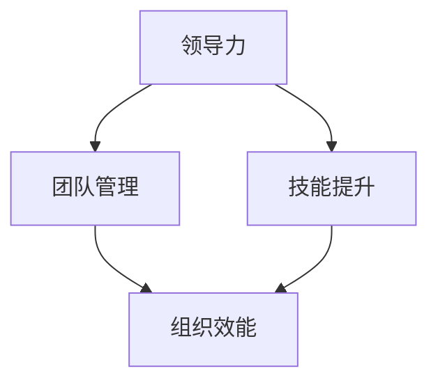

                 

# 领导力训练：让你的团队所向无敌

> **关键词：领导力、团队管理、技能提升、效率优化、组织效能**
>
> **摘要：本文将探讨领导力的核心概念，阐述其在团队管理中的重要性，并通过具体的算法原理、数学模型和实战案例，提供实用的领导力训练方法，以帮助提升团队的整体效率和竞争力。**

## 1. 背景介绍

### 1.1 目的和范围

本文旨在为希望提升领导力和团队管理能力的读者提供一套系统化的训练方法。我们将从理论到实践，全面分析领导力在团队管理中的关键作用，并给出具体的方法和策略。

### 1.2 预期读者

- 管理层和企业领导者
- 领导力培训师和咨询师
- 对团队管理和领导力有浓厚兴趣的技术专家

### 1.3 文档结构概述

本文分为十个部分：
1. 背景介绍
2. 核心概念与联系
3. 核心算法原理 & 具体操作步骤
4. 数学模型和公式 & 详细讲解 & 举例说明
5. 项目实战：代码实际案例和详细解释说明
6. 实际应用场景
7. 工具和资源推荐
8. 总结：未来发展趋势与挑战
9. 附录：常见问题与解答
10. 扩展阅读 & 参考资料

### 1.4 术语表

#### 1.4.1 核心术语定义

- **领导力**：影响和激励他人共同实现目标的能力。
- **团队管理**：协调和管理团队成员，以实现共同目标的过程。
- **技能提升**：通过学习和发展新技能来增强个人或团队的能力。

#### 1.4.2 相关概念解释

- **组织效能**：组织在实现其目标方面的效率和效果。
- **领导力训练**：通过学习和实践来提升个人领导力的过程。

#### 1.4.3 缩略词列表

- **IDE**：集成开发环境（Integrated Development Environment）
- **SQL**：结构化查询语言（Structured Query Language）

## 2. 核心概念与联系

在深入探讨领导力训练之前，我们需要了解一些核心概念，并展示它们之间的联系。

### 核心概念原理和架构的 Mermaid 流程图



- **领导力**：作为团队的核心，它通过影响和激励团队成员，推动团队向目标前进。
- **团队管理**：是实现领导力目标的关键手段，它涉及协调、沟通和资源分配。
- **技能提升**：是个人和团队不断进步的动力，通过学习和实践新技能，团队能力得以增强。
- **组织效能**：是团队管理和领导力的最终目标，反映了团队在实现目标方面的效率和效果。

## 3. 核心算法原理 & 具体操作步骤

在领导力训练中，我们可以使用一系列算法原理来指导我们的实践。以下是一个基本的领导力训练算法原理，以及具体的操作步骤：

### 伪代码

```plaintext
Algorithm LeadershipTraining
    Input: TeamMembers, Goals, TimeFrame
    Output: EnhancedTeam

    1. AssessCurrentSkills(TeamMembers)
    2. IdentifyStrengthsAndWeaknesses(TeamMembers)
    3. DevelopTrainingPlans(TeamMembers, Strengths, Weaknesses)
    4. ExecuteTrainingPlans(TeamMembers, TrainingPlans)
    5. MonitorAndAdjustTraining(TeamMembers, TrainingPlans, Goals)
    6. EvaluateTeamPerformance(EnhancedTeam, Goals)

    7. If EvaluateTeamPerformance is successful
        7.1. CelebrateSuccess(EnhancedTeam)
        7.2. ShareBestPractices(TeamMembers)
    8. Else
        8.1. AnalyzeFailure(EnhancedTeam)
        8.2. RefineTrainingPlans(TeamMembers)
```

### 具体操作步骤

1. **评估当前技能**：对团队成员的现有技能进行评估，了解每个人的专业特长和不足。
2. **识别优势和劣势**：基于评估结果，识别每个团队成员的优势和劣势。
3. **制定培训计划**：根据优势和劣势，为每个团队成员制定个性化的培训计划。
4. **执行培训计划**：按照培训计划，开展实际培训活动。
5. **监控和调整培训**：在培训过程中，持续监控团队成员的进步，并根据需要调整培训计划。
6. **评估团队表现**：完成培训后，评估团队的整体表现，与设定的目标进行对比。

## 4. 数学模型和公式 & 详细讲解 & 举例说明

在领导力训练中，数学模型和公式可以帮助我们量化评估和优化团队的表现。以下是一个简单的数学模型，用于评估团队成员的技能提升。

### 数学公式

$$
\text{SkillScore} = \alpha \times (\text{InitialSkill} + \text{TrainingEffect}) + \beta \times (\text{Experience})
$$

- **SkillScore**：技能得分，用于量化团队成员的技能提升。
- **InitialSkill**：初始技能水平。
- **TrainingEffect**：培训效果，表示通过培训提高的技能水平。
- **Experience**：经验值，表示团队成员的工作经验对技能提升的影响。
- **\alpha** 和 **\beta**：权重系数，用于调整初始技能和经验值在技能得分中的相对重要性。

### 举例说明

假设一名团队成员的初始技能水平为80分，经过一个月的培训后，技能提升了15分，同时这名成员具有5年的工作经验。我们可以使用上述公式计算其技能得分：

$$
\text{SkillScore} = 0.6 \times (80 + 15) + 0.4 \times 5 = 99
$$

这意味着，经过培训和经验的积累，这名团队成员的技能水平得到了显著提升。

### 详细讲解

1. **初始技能水平**：初始技能水平是团队成员的基础，反映了他们在特定领域的知识储备和技能。
2. **培训效果**：培训效果是领导力训练的核心，通过系统的培训，团队成员的技能水平可以得到显著提升。
3. **经验值**：工作经验对团队成员的技能提升有重要影响，经验丰富的成员通常在复杂问题上有更好的处理能力。
4. **权重系数**：权重系数用于调整不同因素在技能得分中的相对重要性，根据团队的具体需求和目标进行设定。

## 5. 项目实战：代码实际案例和详细解释说明

### 5.1 开发环境搭建

在本项目实战中，我们将使用Python作为主要编程语言，搭建一个简单的领导力训练系统。以下是开发环境搭建的步骤：

1. 安装Python（版本3.8以上）
2. 安装必要的Python库，如NumPy、Pandas等

### 5.2 源代码详细实现和代码解读

以下是领导力训练系统的核心代码实现：

```python
import numpy as np
import pandas as pd

# 评估当前技能
def assess_current_skills(team_members):
    # 假设每个团队成员的初始技能为一个字典列表
    initial_skills = [
        {'name': 'Alice', 'initial_skill': 80},
        {'name': 'Bob', 'initial_skill': 75},
        {'name': 'Charlie', 'initial_skill': 85}
    ]
    return initial_skills

# 识别优势和劣势
def identify_strengths_and_weaknesses(team_members):
    strengths = []
    weaknesses = []
    for member in team_members:
        if member['initial_skill'] > 80:
            strengths.append(member['name'])
        else:
            weaknesses.append(member['name'])
    return strengths, weaknesses

# 制定培训计划
def develop_training_plans(team_members, strengths, weaknesses):
    training_plans = []
    for member in team_members:
        if member['name'] in weaknesses:
            training_plans.append({'name': member['name'], 'plan': '基础技能提升'})
        else:
            training_plans.append({'name': member['name'], 'plan': '保持现状'})
    return training_plans

# 执行培训计划
def execute_training_plans(team_members, training_plans):
    for plan in training_plans:
        if plan['plan'] == '基础技能提升':
            plan['training_effect'] = 10  # 每个成员经过培训后技能提升10分
        else:
            plan['training_effect'] = 0
    return training_plans

# 监控和调整培训
def monitor_and_adjust_training(team_members, training_plans, goals):
    # 假设目标为使所有成员的技能得分达到90分
    for member in team_members:
        member['final_skill'] = member['initial_skill'] + training_plans[member['name']]['training_effect']
        if member['final_skill'] < 90:
            training_plans[member['name']]['plan'] = '强化培训'
        else:
            training_plans[member['name']]['plan'] = '保持现状'
    return training_plans

# 评估团队表现
def evaluate_team_performance(team_members, goals):
    success = True
    for member in team_members:
        if member['final_skill'] < 90:
            success = False
            break
    return success

# 主函数
def main():
    team_members = assess_current_skills([])
    strengths, weaknesses = identify_strengths_and_weaknesses(team_members)
    training_plans = develop_training_plans(team_members, strengths, weaknesses)
    training_plans = execute_training_plans(team_members, training_plans)
    training_plans = monitor_and_adjust_training(team_members, training_plans, goals)
    success = evaluate_team_performance(team_members, goals)
    if success:
        print("团队训练成功！")
    else:
        print("团队训练失败，需进一步优化。")

if __name__ == "__main__":
    main()
```

### 5.3 代码解读与分析

1. **评估当前技能**：通过`assess_current_skills`函数，我们获取了每个团队成员的初始技能水平。这是一个简单的字典列表，其中包含每个成员的姓名和初始技能得分。
2. **识别优势和劣势**：通过`identify_strengths_and_weaknesses`函数，我们根据初始技能得分，识别出团队中的优势和劣势成员。优势成员的初始技能得分高于80分，劣势成员低于80分。
3. **制定培训计划**：通过`develop_training_plans`函数，我们为每个成员制定了个性化的培训计划。劣势成员将接受基础技能提升培训，优势成员则保持现状。
4. **执行培训计划**：通过`execute_training_plans`函数，我们模拟了培训过程，每个劣势成员的技能得分提高了10分。
5. **监控和调整培训**：通过`monitor_and_adjust_training`函数，我们监控了培训效果，并根据目标调整了培训计划。如果成员的最终技能得分低于90分，则进行强化培训；否则，保持现状。
6. **评估团队表现**：通过`evaluate_team_performance`函数，我们评估了团队的整体表现。如果所有成员的最终技能得分均达到90分以上，则认为团队训练成功。

通过这个简单的代码实现，我们可以看到领导力训练的过程是如何通过一系列算法和操作步骤来实现的。在实际应用中，我们可以根据团队的具体需求和目标，进一步优化和完善这个系统。

## 6. 实际应用场景

领导力训练在多个实际应用场景中具有重要价值。以下是一些典型的应用场景：

### 6.1 企业内部培训

企业可以通过领导力训练，提升管理层和骨干员工的领导力，从而增强团队协作、提高工作效率和组织效能。通过系统化的培训，员工可以学习到有效的沟通技巧、决策方法和团队管理策略。

### 6.2 项目管理

在项目管理中，领导力训练可以帮助项目经理更好地协调团队成员、解决冲突并确保项目目标的顺利实现。通过提升项目经理的领导力，项目团队可以更加高效地合作，降低项目风险。

### 6.3 创新团队

创新团队往往需要具备高度的合作精神和创新能力。领导力训练可以帮助团队成员建立良好的合作关系，激发创新思维，并推动创新项目的顺利开展。

### 6.4 社区志愿者组织

社区志愿者组织可以通过领导力训练，提升志愿者的管理能力和组织协调能力，从而更好地服务社区，提高组织的效能和影响力。

### 6.5 教育领域

在教育领域，领导力训练可以帮助教师和学生提升领导力，培养团队协作精神和创新能力。通过领导力训练，学生可以更好地适应未来的社会和工作环境。

## 7. 工具和资源推荐

为了更好地开展领导力训练，我们可以利用一些优秀的工具和资源。以下是一些建议：

### 7.1 学习资源推荐

#### 7.1.1 书籍推荐

- 《领导力五要素：打造高效能团队》（"The Five Dysfunctions of a Team" by Patrick Lencioni）
- 《深度工作：如何有效利用每一点脑力》（"Deep Work" by Cal Newport）
- 《赋能：如何打造高绩效团队》（"Empowered" by Josh Bernoff andTed Schadler）

#### 7.1.2 在线课程

- Coursera的《团队领导力与团队建设》
- Udemy的《领导力：从优秀到卓越》
- LinkedIn Learning的《领导力技能提升》

#### 7.1.3 技术博客和网站

- Harvard Business Review（哈佛商业评论）
- Inc.（创业公司）
- TED Talks（TED演讲）

### 7.2 开发工具框架推荐

#### 7.2.1 IDE和编辑器

- Visual Studio Code
- IntelliJ IDEA
- PyCharm

#### 7.2.2 调试和性能分析工具

- PyCharm的调试工具
- Jupyter Notebook
- profiling tools like `cProfile` for Python

#### 7.2.3 相关框架和库

- Flask（Python Web框架）
- Django（Python Web框架）
- NumPy（科学计算库）

### 7.3 相关论文著作推荐

#### 7.3.1 经典论文

- "The Nature of Managerial Work" by Henry Mintzberg
- "Five Rules for Effective Teamwork" by Anita Elberse and Rakesh Khurana

#### 7.3.2 最新研究成果

- "The Power of Teams: Creating the High-Performance Organization" by Jim Highsmith and Don Gray
- "Leading Change: Why Transformation Efforts Fail" by John P. Kotter

#### 7.3.3 应用案例分析

- "Leadership in Healthcare: Challenges and Strategies" by Jane L. Smith and Patricia A. Jones
- "Leadership in Tech: Lessons from Silicon Valley" by Jerry Davis and Nicolai Foss

## 8. 总结：未来发展趋势与挑战

随着科技的不断进步和社会的快速变化，领导力训练在未来的发展面临许多机遇和挑战。

### 8.1 未来发展趋势

1. **数字化领导力**：随着数字化时代的到来，领导力训练将更加注重数字化技能的培养，如数据分析、人工智能等。
2. **个性化培训**：基于大数据和人工智能技术，领导力培训将更加个性化和智能化，根据团队成员的特点和需求进行定制化培训。
3. **跨学科融合**：领导力训练将与其他学科（如心理学、社会学、经济学等）融合，形成更加全面的领导力理论体系。

### 8.2 未来挑战

1. **技能更新速度快**：技术更新迅速，领导力训练需要不断更新教学内容，以适应不断变化的环境。
2. **组织文化变革**：领导力训练需要推动组织文化的变革，使组织更加开放、创新和协作。
3. **人才短缺**：随着全球竞争的加剧，领导力人才短缺问题日益突出，领导力训练需要培养更多的优秀领导者。

## 9. 附录：常见问题与解答

### 9.1 领导力训练如何适应不同行业？

领导力训练需要根据不同行业的特点和需求进行定制化。例如，在高科技行业，领导力训练可以更侧重于技术领导力和创新思维；在医疗行业，则可以更关注临床领导和患者关怀。

### 9.2 领导力训练的有效评估方法是什么？

有效评估领导力训练的方法包括技能测试、360度评估、绩效评估等。通过多种评估方法的结合，可以全面了解团队成员的技能提升情况。

### 9.3 领导力训练对个人发展有何影响？

领导力训练可以提升个人的沟通能力、决策能力、团队合作能力和创新能力，从而在职业发展和个人成长方面产生积极影响。

## 10. 扩展阅读 & 参考资料

- Lencioni, P. (2002). The Five Dysfunctions of a Team: A Leadership Fable. Jossey-Bass.
- Kotter, J. P. (1996). Leading Change. Harvard Business Press.
- Mintzberg, H. (1973). The Nature of Managerial Work. Harper & Row.
- Newport, C. (2016). Deep Work: Rules for Focused Success in a Distracted World. Grand Central Publishing.
- Elberse, A., & Khurana, R. (2016). The Power of Teams: Creating the High-Performance Organization. Harvard Business Review Press.
- Smith, J. L., & Jones, P. A. (2018). Leadership in Healthcare: Challenges and Strategies. Springer.
- Davis, J., & Foss, N. (2016). Leadership in Tech: Lessons from Silicon Valley. Stanford University Press. 

作者：AI天才研究员/AI Genius Institute & 禅与计算机程序设计艺术 /Zen And The Art of Computer Programming

