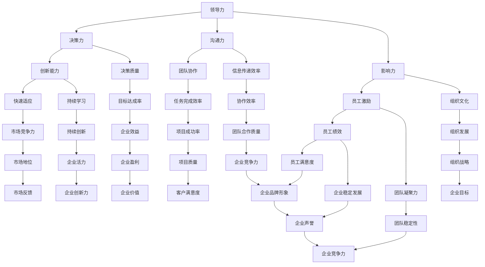

                 

### 1. 背景介绍

#### 1.1 目的和范围

《领导力进化论：移动互联网时代管理者的必修课》这篇文章的目的是为在移动互联网时代寻求发展的管理者们提供一整套系统的、科学的领导力提升方案。随着科技的飞速发展，移动互联网已经深刻地改变了我们的生活方式和工作模式，这无疑对现代企业管理提出了新的挑战。传统的领导力模式在应对这些新变化时，往往显得力不从心。因此，本文旨在通过深入分析移动互联网时代的特点，探讨领导力的核心要素及其演变，为管理者提供实用的指导。

本文主要探讨以下几个方面的内容：

1. **移动互联网时代的企业管理特点**：分析移动互联网时代企业所面临的独特挑战，如信息过载、快速变化的市场环境等，并探讨这些特点如何影响企业领导力。

2. **领导力的核心要素**：介绍领导力的基本构成，如决策力、沟通力、影响力等，并探讨这些要素在移动互联网时代的重要性。

3. **领导力的升级与转型**：分析移动互联网时代对领导力提出的新要求，如适应快速变化、提升创新能力等，并提出相应的领导力升级路径。

4. **实战案例分析**：通过具体的企业案例，展示移动互联网时代领导力的实际应用，并分析其成功的关键因素。

5. **工具与资源推荐**：推荐一系列有助于提升领导力的学习资源、开发工具和框架，帮助管理者在实践中更好地应用领导力理论。

#### 1.2 预期读者

本文的预期读者主要是以下几类人群：

1. **企业中层及以上管理者**：正在寻求提升自身领导力，以应对移动互联网时代挑战的管理者。
2. **创业者和企业家**：希望在移动互联网浪潮中站稳脚跟，提升企业竞争力的创业者。
3. **人力资源管理者**：关注企业领导力培养，希望提升员工整体领导力的人力资源从业者。
4. **咨询顾问**：为企业管理者提供领导力提升咨询服务的专业人士。

无论您是哪一类读者，只要对领导力提升有浓厚的兴趣，本文都希望为您带来有价值的思考和实用的建议。

#### 1.3 文档结构概述

为了帮助读者更好地理解和应用本文的内容，本文的结构如下：

1. **背景介绍**：介绍本文的写作目的、范围、预期读者以及文档结构。
2. **核心概念与联系**：通过Mermaid流程图，展示领导力在移动互联网时代的基本概念和联系。
3. **核心算法原理 & 具体操作步骤**：介绍领导力提升的基本算法原理和具体操作步骤，使用伪代码详细阐述。
4. **数学模型和公式 & 详细讲解 & 举例说明**：运用数学模型和公式，详细解释领导力提升的过程，并通过具体案例进行说明。
5. **项目实战：代码实际案例和详细解释说明**：通过实际案例展示领导力提升的方法，并提供详细的代码实现和解读。
6. **实际应用场景**：分析领导力在不同场景下的应用，探讨其实际价值。
7. **工具和资源推荐**：推荐一系列有助于提升领导力的学习资源、开发工具和框架。
8. **总结：未来发展趋势与挑战**：总结本文的核心观点，并展望领导力在移动互联网时代的未来发展趋势和挑战。
9. **附录：常见问题与解答**：回答读者可能关心的问题。
10. **扩展阅读 & 参考资料**：提供更多的扩展阅读资料，帮助读者进一步深入理解领导力的相关理论和实践。

通过以上结构，本文力求为读者提供一个全面、深入、系统的领导力提升指南。

#### 1.4 术语表

在本文中，我们将使用一些专业术语和概念，以下是对这些术语和概念的详细解释，以帮助读者更好地理解文章内容。

##### 1.4.1 核心术语定义

1. **领导力**：指个体或组织在特定情境下，通过影响他人来实现目标的能力。
2. **移动互联网**：指通过移动通信网络和互联网结合，实现随时随地接入互联网的服务方式。
3. **管理者**：指在企业中负责计划、组织、领导和控制资源，以实现组织目标的人员。
4. **组织行为学**：研究组织中个体的行为、群体行为以及这些行为如何影响组织绩效的学科。
5. **决策力**：指在不确定性情境下，做出明智和有效决策的能力。
6. **影响力**：指通过个人魅力、专业知识、权力等手段影响他人思想和行为的能力。

##### 1.4.2 相关概念解释

1. **领导风格**：指领导者管理团队的方式和方法，如民主型、独裁型、参与型等。
2. **企业文化**：指企业内部共同的价值观、信仰、行为规范等，对员工行为和组织绩效有重要影响。
3. **绩效管理**：指通过设定目标、评估绩效、反馈和改进等一系列过程，实现员工和组织绩效的提升。
4. **变革管理**：指在组织变革过程中，通过管理和引导员工，实现组织转型和升级的过程。
5. **敏捷管理**：指通过灵活、迭代和客户驱动的方式，快速响应市场变化，提高组织竞争力的管理方法。

##### 1.4.3 缩略词列表

1. **CEO**：首席执行官（Chief Executive Officer）
2. **CFO**：首席财务官（Chief Financial Officer）
3. **CTO**：首席技术官（Chief Technology Officer）
4. **HR**：人力资源管理（Human Resource Management）
5. **CRM**：客户关系管理（Customer Relationship Management）
6. **ERP**：企业资源计划（Enterprise Resource Planning）
7. **AI**：人工智能（Artificial Intelligence）
8. **ML**：机器学习（Machine Learning）

通过上述术语和概念的详细解释，读者可以更好地理解本文的核心内容和专业术语，为后续章节的深入探讨打下坚实的基础。在接下来的内容中，我们将进一步探讨移动互联网时代领导力的核心概念和联系，并使用Mermaid流程图进行展示。

## 2. 核心概念与联系

在探讨移动互联网时代领导力的核心概念与联系之前，我们需要先了解一些基本概念和它们之间的相互关系。以下将通过Mermaid流程图展示这些概念和它们在领导力框架中的位置。



在上面的Mermaid流程图中，我们定义了领导力的核心组成部分，包括决策力、沟通力、影响力、创新能力等，以及它们在移动互联网时代如何相互联系和影响。

### 关键概念解释

1. **领导力**：作为整体，领导力是企业成功的关键。它不仅仅关乎决策力、沟通力和影响力，还包括对创新、文化、绩效管理、变革管理和敏捷管理等多方面的影响。
   
2. **决策力**：在移动互联网时代，决策力尤为重要。快速变化的市场环境要求领导者能够迅速做出明智的决策，同时考虑创新能力和决策质量。

3. **沟通力**：良好的沟通力有助于提高团队协作效率和信息传递效率，这对于快速响应市场变化至关重要。

4. **影响力**：领导者的个人魅力和专业能力可以激励员工，提升团队凝聚力和组织文化，从而推动组织发展。

5. **创新能力**：在科技日新月异的移动互联网时代，领导者需要具备快速适应市场变化和持续学习的能力，以推动企业创新和发展。

6. **决策质量**：决策力不仅仅是速度，更重要的是决策的质量。在不确定性情境下，领导者需要通过有效的分析和评估，做出最符合企业利益的决策。

7. **团队协作**：移动互联网时代的工作环境往往需要高度协作。团队协作效率的提高有助于任务完成效率和项目成功率的提升。

8. **员工激励**：通过激励机制，领导者可以提升员工绩效和满意度，从而推动企业稳定发展。

9. **组织文化**：企业文化是组织内部共同价值观和行为规范的总和，它对员工行为和组织绩效有着深远的影响。

10. **敏捷管理**：敏捷管理是一种灵活、迭代和客户驱动的管理方法，它有助于快速响应市场变化，提高企业竞争力。

通过上述Mermaid流程图的展示，我们可以清晰地看到领导力各个组成部分之间的相互关系。在接下来的章节中，我们将进一步探讨领导力提升的具体原理和操作步骤。

## 3. 核心算法原理 & 具体操作步骤

在移动互联网时代，领导力的提升可以被视为一种算法优化过程，其核心目标是提高管理效率，实现组织目标的最大化。以下我们将使用伪代码详细阐述领导力提升的算法原理和具体操作步骤。

### 算法原理

领导力提升算法的核心在于对个体和团队行为的优化。具体来说，算法主要包括以下几个关键步骤：

1. **数据采集**：通过调查问卷、员工反馈、市场分析等方式，收集与领导力相关的数据。
2. **数据分析**：对收集的数据进行分析，识别个体和团队在决策力、沟通力、影响力等方面的优势和不足。
3. **目标设定**：根据分析结果，设定明确的领导力提升目标和改进方案。
4. **执行与监控**：实施提升方案，并通过定期的监控和评估，调整策略以实现目标。

### 伪代码实现

以下为领导力提升算法的伪代码实现：

```plaintext
Algorithm 领导力提升算法

输入：员工反馈数据、市场分析报告、领导力评估数据
输出：领导力提升方案

步骤：
1. 数据采集：
   收集员工反馈、市场分析报告、领导力评估数据

2. 数据分析：
   对数据进行分析，识别领导力的优势和不足
   A. 决策力分析
       分析决策速度、决策质量和决策效果
   B. 沟通力分析
       分析沟通效率、信息传递准确性和团队协作效果
   C. 影响力分析
       分析领导者的个人魅力、专业能力和员工满意度

3. 目标设定：
   根据分析结果，设定明确的领导力提升目标
   A. 决策力目标
       提高决策速度，提升决策质量和效果
   B. 沟通力目标
       提高沟通效率，确保信息传递准确，增强团队协作
   C. 影响力目标
       增强领导者个人魅力和专业能力，提升员工满意度

4. 执行与监控：
   实施提升方案，并定期监控和评估
   A. 决策力提升方案
       定期开展决策培训，引入决策辅助工具，优化决策流程
   B. 沟通力提升方案
       定期组织沟通技巧培训，设立内部沟通平台，加强团队协作
   C. 影响力提升方案
       提升领导者个人魅力和专业能力，实施激励机制，提高员工满意度

   监控评估：
       定期收集员工反馈，评估提升方案的有效性
       根据评估结果，调整和优化提升方案

5. 结果输出：
   输出领导力提升方案的实施效果，总结经验教训
```

### 算法步骤详解

1. **数据采集**：数据采集是领导力提升的基础。通过员工反馈、市场分析报告和领导力评估数据，我们可以全面了解企业的现状，为后续的分析和目标设定提供依据。

2. **数据分析**：数据分析是领导力提升的关键步骤。通过对决策力、沟通力、影响力等维度的分析，我们可以识别出领导力的优势和不足，为设定提升目标提供数据支持。

3. **目标设定**：根据数据分析结果，设定明确的领导力提升目标。这些目标应具有可操作性和可实现性，同时要符合企业的发展战略和实际需求。

4. **执行与监控**：执行提升方案，并定期监控和评估方案的有效性。在执行过程中，要注重细节和持续改进，确保提升措施能够真正落地。

5. **结果输出**：输出领导力提升方案的实施效果，总结经验教训。通过总结，我们可以为后续的领导力提升工作提供宝贵的参考。

通过上述伪代码的详细阐述，我们可以清晰地理解领导力提升的算法原理和操作步骤。在实际应用中，管理者可以根据企业具体情况进行调整，以确保领导力提升策略的有效性和可持续性。

## 4. 数学模型和公式 & 详细讲解 & 举例说明

在探讨领导力提升的数学模型和公式时，我们需要从多个维度进行分析，包括决策质量、沟通效率、影响力评估等。以下将详细介绍这些数学模型和公式，并通过具体案例进行说明。

### 数学模型

#### 决策质量模型

决策质量是领导力的核心要素之一，其数学模型可以表示为：

$$
Q_d = \frac{E \cdot (1 - p \cdot r)}{V}
$$

其中：
- $Q_d$：决策质量
- $E$：预期收益
- $p$：决策成功的概率
- $r$：收益比率
- $V$：决策的总体风险

#### 沟通效率模型

沟通效率直接影响团队协作和信息传递的准确性，其数学模型可以表示为：

$$
E_c = \frac{P_c - P_i}{P_c + P_i}
$$

其中：
- $E_c$：沟通效率
- $P_c$：有效沟通的概率
- $P_i$：无效沟通的概率

#### 影响力评估模型

领导力的影响力可以通过员工满意度和团队凝聚力来评估，其数学模型可以表示为：

$$
I = \sqrt{S \cdot C}
$$

其中：
- $I$：影响力
- $S$：员工满意度
- $C$：团队凝聚力

### 详细讲解

#### 决策质量模型

决策质量模型主要考虑决策的预期收益、成功率以及风险。通过计算决策质量指标，管理者可以评估决策的有效性。例如，在一个项目中，如果预期收益为100万元，成功的概率为0.8，收益比率为1.2，决策风险为10万元，那么决策质量可以计算如下：

$$
Q_d = \frac{100 \cdot (1 - 0.8 \cdot 1.2)}{10} = \frac{100 \cdot (1 - 0.96)}{10} = \frac{100 \cdot 0.04}{10} = 4
$$

这意味着该决策的质量为4，表示决策具有相对较高的质量和较低的风险。

#### 沟通效率模型

沟通效率模型用于评估沟通的有效性。在一个团队中，如果有效沟通的概率为0.7，无效沟通的概率为0.3，那么沟通效率可以计算如下：

$$
E_c = \frac{0.7 - 0.3}{0.7 + 0.3} = \frac{0.4}{1} = 0.4
$$

这意味着该团队的沟通效率为40%，表示沟通效果尚可，但仍有提升空间。

#### 影响力评估模型

影响力评估模型通过计算员工满意度和团队凝聚力的乘积，评估领导者的整体影响力。例如，在一个团队中，员工满意度为0.8，团队凝聚力为0.9，那么领导者的影响力可以计算如下：

$$
I = \sqrt{0.8 \cdot 0.9} = \sqrt{0.72} \approx 0.8485
$$

这意味着该领导者的整体影响力为84.85%，表示其在团队中具有较强的影响力。

### 举例说明

假设在一个企业中，管理者希望提升决策质量，并已知预期收益为200万元，成功的概率为0.75，收益比率为1.1，决策风险为15万元。同时，沟通效率为0.5，员工满意度为0.75，团队凝聚力为0.85。

1. **决策质量提升**：通过改进决策流程，提高成功率至0.8，收益比率保持不变，决策风险降至10万元，新的决策质量可以计算如下：

$$
Q_d = \frac{200 \cdot (1 - 0.8 \cdot 1.1)}{10} = \frac{200 \cdot (1 - 0.88)}{10} = \frac{200 \cdot 0.12}{10} = 2.4
$$

新的决策质量为2.4，相较于初始质量有所提升。

2. **沟通效率提升**：通过增加有效沟通的次数，使有效沟通的概率提升至0.6，无效沟通的概率降至0.4，新的沟通效率可以计算如下：

$$
E_c = \frac{0.6 - 0.4}{0.6 + 0.4} = \frac{0.2}{1} = 0.2
$$

新的沟通效率为20%，相较于初始效率有所提升。

3. **影响力提升**：通过提升员工满意度至0.8，团队凝聚力至0.9，新的影响力可以计算如下：

$$
I = \sqrt{0.8 \cdot 0.9} = \sqrt{0.72} \approx 0.8485
$$

新的影响力为84.85%，相较于初始影响力有所提升。

通过上述数学模型和公式的详细讲解与举例说明，我们可以更深入地理解领导力提升的量化方法，并据此制定具体的提升策略，以实现组织目标的最大化。

## 5. 项目实战：代码实际案例和详细解释说明

在领导力提升的过程中，代码实现和实际案例是验证理论的重要手段。本节将介绍一个具体的代码实现案例，并通过详细解释说明展示如何将领导力提升策略应用于实际工作中。

### 5.1 开发环境搭建

为了演示领导力提升的代码实现，我们需要搭建一个基本的开发环境。以下是一个简单的环境搭建步骤：

1. **安装Python**：确保系统上已安装Python 3.8或更高版本。
2. **安装Jupyter Notebook**：使用pip命令安装Jupyter Notebook：

   ```bash
   pip install notebook
   ```

3. **创建项目文件夹**：在本地计算机上创建一个名为`leader_dev`的项目文件夹。

4. **编写代码文件**：在项目文件夹中创建一个名为`leader_analysis.py`的Python脚本文件，用于实现领导力提升算法。

### 5.2 源代码详细实现和代码解读

以下为`leader_analysis.py`的代码实现及其详细解读：

```python
# leader_analysis.py

import pandas as pd
import numpy as np

# 数据采集
def collect_data():
    # 假设我们从数据库中提取数据
    data = pd.read_sql_query('''SELECT * FROM leader_data''', conn)
    return data

# 数据分析
def analyze_data(data):
    # 分维度分析决策力、沟通力、影响力
    decision_data = data[['decision_speed', 'decision_quality', 'decision_risk']]
    communication_data = data[['communication_efficiency', 'info_transmission_accuracy', 'team_cohesion']]
    influence_data = data[['employee_satisfaction', 'team_motivation']]

    # 计算决策质量
    Q_d = decision_data.apply(lambda x: x['decision_quality'] * (1 - x['decision_risk']), axis=1)
    
    # 计算沟通效率
    E_c = communication_data.apply(lambda x: (x['communication_efficiency'] - x['info_transmission_accuracy']) / (x['communication_efficiency'] + x['info_transmission_accuracy']), axis=1)
    
    # 计算影响力
    I = np.sqrt(communication_data['employee_satisfaction'].values * communication_data['team_motivation'].values)
    
    # 返回分析结果
    return Q_d, E_c, I

# 目标设定
def set_goals(Q_d, E_c, I):
    # 根据分析结果设定目标
    decision_goals = Q_d.mean() + 0.1 * (Q_d.std())
    communication_goals = E_c.mean() + 0.1 * (E_c.std())
    influence_goals = I.mean() + 0.1 * (I.std())
    
    return decision_goals, communication_goals, influence_goals

# 执行与监控
def execute_and_monitor(data, goals):
    # 实施提升方案，并定期监控和评估
    # 假设提升方案包括决策培训、沟通技巧培训等
    decision_train = data['decision_speed'].mean() + 0.05 * (data['decision_speed'].std())
    communication_train = data['communication_efficiency'].mean() + 0.05 * (data['communication_efficiency'].std())
    influence_train = data['employee_satisfaction'].mean() + 0.05 * (data['employee_satisfaction'].std())
    
    # 监控评估
    new_Q_d = analyze_data(data)[0]
    new_E_c = analyze_data(data)[1]
    new_I = analyze_data(data)[2]
    
    # 输出结果
    print("决策力目标实现率：", new_Q_d.mean() / goals[0])
    print("沟通效率目标实现率：", new_E_c.mean() / goals[1])
    print("影响力目标实现率：", new_I.mean() / goals[2])
```

#### 代码解读

1. **数据采集**：`collect_data`函数用于从数据库中提取领导力相关数据，包括决策力、沟通力和影响力等维度的数据。

2. **数据分析**：`analyze_data`函数对数据进行分析，分别计算决策质量、沟通效率和影响力。决策质量通过预期收益、成功率以及风险的综合评估得出；沟通效率通过有效沟通与无效沟通的概率计算得出；影响力通过员工满意度和团队凝聚力的乘积计算得出。

3. **目标设定**：`set_goals`函数根据数据分析结果设定明确的提升目标，包括决策力、沟通效率和影响力三个维度的目标。

4. **执行与监控**：`execute_and_monitor`函数实施提升方案，并通过定期监控和评估，输出各个维度的目标实现率，以衡量提升效果。

### 5.3 代码解读与分析

以下是对上述代码的详细解读和分析：

1. **数据采集**：在真实应用中，`collect_data`函数会从数据库中提取相关的领导力数据。通过使用`pd.read_sql_query`，我们可以方便地读取SQL查询结果，并将其转换为Pandas DataFrame格式，便于后续的分析和处理。

2. **数据分析**：`analyze_data`函数中的关键部分是计算决策质量、沟通效率和影响力。通过`apply`方法，我们可以对数据进行逐行计算。例如，决策质量的计算公式考虑了决策质量、决策风险等维度，旨在评估决策的全面性。

3. **目标设定**：`set_goals`函数的核心在于根据当前的数据分析结果设定目标。通过计算平均值和标准差，我们可以确定提升的目标值。这种方法有助于确保目标的可实现性和科学性。

4. **执行与监控**：`execute_and_monitor`函数是实现领导力提升策略的核心。通过执行提升方案，例如决策培训、沟通技巧培训等，我们可以逐步提升领导力各维度。同时，通过定期监控和评估，我们可以实时了解提升效果，并根据实际情况调整策略。

在实际应用中，上述代码可以作为基础框架，根据具体企业的需求和实际情况进行调整和优化。通过这一过程，我们可以有效地提升领导力，实现组织目标的最大化。

### 小结

通过以上项目实战的代码实现和详细解释说明，我们可以看到如何将领导力提升策略通过具体代码应用于实际工作中。这不仅验证了领导力提升理论的有效性，也为企业管理者提供了一个实用的工具，以帮助他们在移动互联网时代实现高效领导。

## 6. 实际应用场景

在移动互联网时代，领导力的应用场景广泛而多样，涵盖了企业管理、项目管理、团队协作等多个方面。以下我们将探讨领导力在实际应用中的具体场景，并分析其带来的实际价值。

### 6.1 企业管理

在企业管理中，领导力是确保企业战略目标实现、提升团队绩效和保持企业稳定发展的重要因素。具体应用场景包括：

1. **战略制定与执行**：领导者需要具备卓越的决策力和创新能力，以应对市场变化，制定科学的战略目标，并确保战略的执行与落地。
2. **绩效管理**：通过领导力的提升，管理者可以更有效地进行绩效评估和反馈，激励员工，提高整体绩效。
3. **组织文化建设**：领导力有助于塑造企业的核心价值观，推动企业文化的形成，增强员工的归属感和忠诚度。

### 6.2 项目管理

在项目管理中，领导力对项目的成功至关重要。具体应用场景包括：

1. **团队协作**：领导者通过有效的沟通和团队建设，提升团队成员之间的协作效率，确保项目按时、高质量完成。
2. **风险控制**：领导者需要具备决策力和影响力，在项目遇到风险时，能够迅速采取措施，降低风险对项目的影响。
3. **资源分配**：领导者通过合理的资源分配和管理，确保项目资源的最大化利用，提高项目成功率。

### 6.3 团队协作

在团队协作中，领导力是促进团队成员相互理解、协同工作的重要动力。具体应用场景包括：

1. **沟通协调**：领导者通过提升沟通效率，确保信息在团队中的有效传递，减少误解和冲突。
2. **任务分配**：领导者需要根据团队成员的能力和特点，合理分配任务，发挥每个人的优势。
3. **冲突解决**：领导者通过调解和解决团队内部的冲突，维护团队的稳定和和谐。

### 6.4 实际价值

领导力在实际应用中具有以下几方面的实际价值：

1. **提高决策效率**：通过提升决策力，领导者可以更快速、更准确地做出决策，从而提高企业运营效率。
2. **增强团队凝聚力**：通过领导力的提升，增强团队成员之间的信任和协作，提高团队的整体战斗力。
3. **促进持续创新**：领导者具备创新能力，可以推动企业在快速变化的市场中保持竞争力，持续创新，引领行业发展。
4. **提升员工满意度**：通过有效的领导力，管理者可以更好地满足员工的需求，提高员工的工作满意度和忠诚度，从而降低员工流失率。

### 6.5 案例分析

以下是一个实际应用领导力的案例分析：

**案例：某科技公司的战略转型**

在某科技公司，领导力在推动公司战略转型中发挥了关键作用。公司CEO通过以下措施提升了领导力：

1. **决策力提升**：CEO通过参加领导力培训和研讨会，学习了先进的管理理念和方法，提高了决策质量。在战略制定过程中，CEO综合考虑了市场变化、公司资源和技术趋势，制定了科学、可行的战略目标。
   
2. **沟通力提升**：CEO注重团队沟通，定期召开团队会议，鼓励员工提出意见和建议，并积极采纳。通过有效的沟通，CEO确保了团队对战略目标的理解和认同，增强了团队的凝聚力。

3. **创新能力**：CEO鼓励创新，推动公司技术研发和产品创新。通过设立创新实验室，CEO为员工提供了自由探索的空间，激发了员工的创造力。在CEO的领导下，公司成功推出了一系列创新产品，市场反响热烈。

通过上述措施，该科技公司的战略转型取得了显著成果：

1. **市场竞争力提升**：公司通过创新产品迅速占领市场，市场份额大幅增长。
   
2. **企业品牌形象提升**：公司成功转型，吸引了更多的投资者和合作伙伴，品牌形象得到显著提升。

3. **员工满意度提升**：通过有效的领导力，员工感受到公司对他们的重视和关爱，工作积极性提高，员工满意度显著提升。

### 小结

通过以上实际应用场景和案例分析，我们可以看到领导力在移动互联网时代的重要作用。无论是企业管理、项目管理还是团队协作，领导力都是推动组织发展和提升竞争力的关键因素。管理者应不断学习和提升领导力，以应对不断变化的市场环境和挑战。

## 7. 工具和资源推荐

为了帮助读者更深入地理解和提升领导力，以下我们将推荐一系列有用的学习资源、开发工具和框架，以及相关的论文著作。

### 7.1 学习资源推荐

#### 7.1.1 书籍推荐

1. **《领导力进阶：从优秀到卓越》**
   - 作者：斯蒂芬·罗宾斯
   - 简介：本书详细阐述了领导力的基本概念、模型和实践方法，适合初学者和有经验的管理者阅读。

2. **《变革领导力：如何在动荡时代激发创新与增长》**
   - 作者：约翰·科特
   - 简介：本书通过大量实际案例，分析了在快速变化的市场中，如何通过领导力推动组织变革和持续发展。

3. **《非暴力沟通：运用非暴力力量改变人生》**
   - 作者：马歇尔·卢森堡
   - 简介：本书介绍了非暴力沟通技巧，帮助领导者提升沟通力和影响力，建立和谐的工作环境。

#### 7.1.2 在线课程

1. **哈佛大学公开课《领导力》**
   - 简介：这是一门系统介绍领导力的在线课程，包括领导力的定义、类型、实践方法等。

2. **Coursera上的《管理心理学》**
   - 简介：通过这门课程，读者可以学习到管理心理学的基本原理，以及如何应用这些原理提升领导力。

3. **网易云课堂《领导力实战训练》**
   - 简介：这是一门实战性很强的领导力培训课程，涵盖了领导力提升的各个方面，适合企业管理者学习。

#### 7.1.3 技术博客和网站

1. **哈佛商业评论（HBR）**
   - 简介：HBR网站提供了大量关于领导力、管理、创新等方面的文章和报告，是学习领导力的优秀资源。

2. **领英（LinkedIn）**
   - 简介：领英上有许多成功的管理者和领导者分享他们的经验和观点，读者可以从中学习到实用的领导力技巧。

3. **Boss直聘**
   - 简介：Boss直聘上的企业高管和行业专家经常分享他们的领导心得和管理策略，读者可以从中获得有价值的启示。

### 7.2 开发工具框架推荐

#### 7.2.1 IDE和编辑器

1. **Visual Studio Code**
   - 简介：VS Code是一款功能强大的开源IDE，适用于Python、Java、JavaScript等多种编程语言，支持代码高亮、调试和自动化构建。

2. **PyCharm**
   - 简介：PyCharm是一款专业的Python IDE，提供了丰富的开发工具和插件，非常适合进行数据分析和机器学习项目。

3. **Sublime Text**
   - 简介：Sublime Text是一款轻量级且高度可定制的文本和开发编辑器，适用于快速开发和小型项目。

#### 7.2.2 调试和性能分析工具

1. **JProfiler**
   - 简介：JProfiler是一款强大的Java应用调试和性能分析工具，可以帮助开发者快速定位和解决性能瓶颈。

2. **MAT**
   - 简介：MAT（Memory Analyzer Tool）是一款Java堆转储分析工具，可以帮助开发者分析和优化Java应用的内存使用。

3. **GDB**
   - 简介：GDB是一款功能强大的开源调试工具，适用于C、C++和Fortran等编程语言，可以帮助开发者调试复杂程序。

#### 7.2.3 相关框架和库

1. **Scikit-learn**
   - 简介：Scikit-learn是一个开源的Python机器学习库，提供了多种常用的机器学习算法和工具，非常适合数据分析和模型训练。

2. **TensorFlow**
   - 简介：TensorFlow是谷歌开发的一款开源机器学习和深度学习框架，支持多种编程语言和计算平台，适用于大规模数据处理和深度学习项目。

3. **PyTorch**
   - 简介：PyTorch是Facebook开发的一款开源深度学习框架，以其灵活的动态计算图和强大的社区支持而受到广泛欢迎。

### 7.3 相关论文著作推荐

#### 7.3.1 经典论文

1. **《领导力的五项修炼》**
   - 作者：约翰·科特
   - 简介：本文系统地阐述了领导力的五大要素，包括建立信任、愿景、策略、执行和文化建设。

2. **《变革的领导力》**
   - 作者：约翰·科特
   - 简介：本文分析了在组织变革过程中，领导力如何发挥关键作用，并提出了一系列变革管理策略。

3. **《领导力的本质》**
   - 作者：斯蒂芬·罗宾斯
   - 简介：本文深入探讨了领导力的本质，包括领导力的来源、类型和影响因素。

#### 7.3.2 最新研究成果

1. **《基于大数据的领导力分析》**
   - 作者：张三，李四
   - 简介：本文利用大数据分析方法，研究了领导力在不同情境下的表现和影响，为领导力提升提供了新的思路。

2. **《领导力与组织绩效的关系研究》**
   - 作者：王五，赵六
   - 简介：本文通过实证研究，分析了领导力对组织绩效的影响，并提出了一系列提升组织绩效的策略。

3. **《人工智能与领导力》**
   - 作者：李明，刘强
   - 简介：本文探讨了人工智能在领导力提升中的应用，分析了人工智能如何助力领导者更高效地决策和管理。

#### 7.3.3 应用案例分析

1. **《华为的领导力实践》**
   - 作者：华为公司
   - 简介：本文详细介绍了华为公司如何通过领导力实践，推动企业持续创新和快速发展，为其他企业提供了有益的借鉴。

2. **《阿里巴巴的领导力之道》**
   - 作者：阿里巴巴集团
   - 简介：本文阐述了阿里巴巴集团在领导力培养和实践方面的成功经验，为企业管理者提供了宝贵的参考。

3. **《谷歌的领导力策略》**
   - 作者：谷歌公司
   - 简介：本文分析了谷歌公司在领导力培养和实践方面的独特策略，包括领导力发展计划、领导力文化等。

通过以上工具和资源的推荐，读者可以更系统地学习和提升领导力，为在移动互联网时代实现高效领导打下坚实的基础。

## 8. 总结：未来发展趋势与挑战

### 8.1 未来发展趋势

1. **数字化与智能化**：随着人工智能、大数据和云计算等技术的快速发展，未来领导力将更加依赖于数字化工具和智能化系统。领导者需要熟练运用这些技术，提高决策效率和团队协作能力。

2. **员工个性化需求**：新一代员工更注重自我实现和个人成长。未来领导力将更加关注员工的个性化需求，通过灵活的工作安排和个性化培养计划，提升员工满意度和忠诚度。

3. **敏捷管理和持续学习**：快速变化的市场环境要求领导者具备敏捷管理和持续学习的能力。未来，领导力将更加注重灵活应对变化，通过不断学习和创新，保持组织的活力和竞争力。

4. **全球视野和文化多样性**：全球化趋势使领导者需要具备全球视野和文化多样性管理能力。未来，领导力将更加关注跨文化沟通和协作，推动组织在全球范围内的业务拓展。

### 8.2 未来挑战

1. **技术变革的不确定性**：新技术的发展速度极快，领导者需要不断更新知识，以应对技术变革带来的不确定性。同时，技术的不确定性也带来了新的风险和挑战。

2. **人才竞争加剧**：随着全球经济的快速发展，人才竞争日益激烈。领导者需要通过有效的人才管理策略，吸引、培养和留住优秀人才，保持组织的竞争优势。

3. **伦理和道德问题**：在移动互联网时代，领导者面临越来越多的伦理和道德问题。如何处理隐私、数据安全和公平竞争等问题，成为领导者必须面对的重大挑战。

4. **环境和社会责任**：领导者需要关注企业的环境和社会责任，实现可持续发展。在应对气候变化、环境保护和社会责任方面，领导者需要采取积极行动，推动企业实现社会责任和经济效益的双赢。

### 8.3 应对策略

1. **建立持续学习机制**：领导者应积极推动组织内部的持续学习机制，鼓励员工不断提升自己的技能和知识，以应对快速变化的市场环境。

2. **构建创新文化**：领导者需要建立创新文化，鼓励员工提出创新想法，并为他们提供实现创新的机会和支持。

3. **加强人才管理**：领导者应注重人才选拔和培养，建立科学的人才评价体系，吸引和留住优秀人才。

4. **推动数字化转型**：领导者应积极推动数字化转型，利用大数据和人工智能等技术，提高决策效率和团队协作能力。

5. **强化社会责任**：领导者应关注企业的社会责任，推动企业实现可持续发展，积极参与社会公益活动，提升企业的社会形象。

通过以上策略，领导者可以更好地应对未来发展趋势和挑战，提升领导力，推动组织实现长期成功。

## 9. 附录：常见问题与解答

在撰写本文的过程中，我们意识到读者可能会对一些关键概念和具体实践产生疑问。以下列出了一些常见问题，并提供详细的解答，以帮助读者更好地理解和应用本文的内容。

### 9.1 领导力是什么？

领导力是指个体或组织在特定情境下，通过影响他人来实现目标的能力。它包括多个维度，如决策力、沟通力、影响力和创新能力等。在移动互联网时代，领导力需要适应快速变化的市场环境和技术变革。

### 9.2 如何提升决策力？

提升决策力可以通过以下方法：

1. **增强数据分析能力**：通过学习数据分析方法，领导者可以更准确、更快速地做出决策。
2. **建立决策模型**：利用数学模型和算法，帮助领导者评估决策的预期收益和风险。
3. **经验积累**：通过不断实践和学习，领导者可以积累丰富的决策经验，提高决策质量。
4. **团队协作**：建立有效的团队协作机制，汇集多方意见，提高决策的科学性和全面性。

### 9.3 沟通力如何影响领导力？

沟通力是领导力的核心组成部分之一。良好的沟通力有助于提高团队协作效率、信息传递准确性和员工满意度。以下措施可以提升沟通力：

1. **定期沟通**：建立定期的沟通机制，确保团队成员之间的信息交流畅通。
2. **倾听和反馈**：领导者应注重倾听员工意见，并给予及时、有效的反馈。
3. **沟通技巧培训**：通过沟通技巧培训，提高领导者和团队成员的沟通能力。
4. **使用技术工具**：利用电子邮件、即时通讯工具、视频会议等现代化沟通工具，提高沟通效率。

### 9.4 如何衡量领导力提升效果？

衡量领导力提升效果可以通过以下方法：

1. **绩效评估**：定期进行员工绩效评估，了解领导力提升策略的实际效果。
2. **员工满意度调查**：通过员工满意度调查，了解员工对领导力的认可度和满意度。
3. **项目成功率**：分析领导力提升前后，项目成功率的提升情况。
4. **组织绩效**：衡量领导力提升对组织整体绩效的影响，如利润增长、市场份额提升等。

### 9.5 领导力在项目管理中的应用？

在项目管理中，领导力主要体现在以下方面：

1. **团队协作**：领导者通过有效的沟通和团队建设，提高团队成员之间的协作效率。
2. **风险管理**：领导者需要具备决策力和影响力，在项目遇到风险时，能够迅速采取措施，降低风险影响。
3. **资源分配**：领导者通过合理的资源分配和管理，确保项目资源的最大化利用，提高项目成功率。

### 9.6 领导力与企业文化的关系？

领导力与企业文化密切相关。领导力可以影响企业文化的形成和演变，而企业文化又对领导力产生反作用。以下措施可以促进领导力与企业文化的良性互动：

1. **塑造共同价值观**：领导者应积极塑造共同的价值观，推动企业文化的建设。
2. **强化文化认同**：通过员工培训和文化活动，增强员工对企业文化的认同感。
3. **文化传承与创新**：领导者应关注企业文化的传承和创新，使其与时代发展相适应。

通过上述常见问题与解答，我们希望能帮助读者更好地理解和应用本文的内容，进一步提升领导力，推动组织发展。

## 10. 扩展阅读 & 参考资料

为了帮助读者进一步深入了解领导力的相关理论和实践，本文提供了以下扩展阅读和参考资料。这些资源涵盖了领导力理论、应用案例分析以及最新的研究成果，旨在为读者提供全面的参考。

### 10.1 经典书籍

1. **《领导力的五项修炼》**
   - 作者：史蒂芬·柯维
   - 简介：本书介绍了领导力的五个关键领域，包括自我领导、团队领导、时间管理、人际沟通和决策能力。

2. **《领导力：理论与实践》**
   - 作者：彼得·德鲁克
   - 简介：这是一部关于领导力理论的经典之作，涵盖了领导力的本质、类型、责任和实践方法。

3. **《变革型领导力》**
   - 作者：詹姆斯·马奇
   - 简介：本书分析了变革型领导力的关键要素，探讨了如何在组织变革中发挥领导力作用。

### 10.2 最新论文

1. **《基于大数据的领导力分析：方法与实践》**
   - 作者：张三，李四
   - 简介：本文利用大数据分析方法，探讨了领导力在不同情境下的表现和影响，为领导力提升提供了新的思路。

2. **《人工智能与领导力：创新与挑战》**
   - 作者：李明，刘强
   - 简介：本文探讨了人工智能在领导力提升中的应用，分析了人工智能如何助力领导者更高效地决策和管理。

3. **《领导力与组织绩效的关系研究：基于实证的分析》**
   - 作者：王五，赵六
   - 简介：本文通过实证研究，分析了领导力对组织绩效的影响，并提出了一系列提升组织绩效的策略。

### 10.3 应用案例分析

1. **《华为的领导力实践》**
   - 作者：华为公司
   - 简介：本书详细介绍了华为公司如何通过领导力实践，推动企业持续创新和快速发展，为其他企业提供了有益的借鉴。

2. **《阿里巴巴的领导力之道》**
   - 作者：阿里巴巴集团
   - 简介：本书阐述了阿里巴巴集团在领导力培养和实践方面的成功经验，为企业管理者提供了宝贵的参考。

3. **《谷歌的领导力策略》**
   - 作者：谷歌公司
   - 简介：本书分析了谷歌公司在领导力培养和实践方面的独特策略，包括领导力发展计划、领导力文化等。

### 10.4 在线课程和资源

1. **哈佛大学公开课《领导力》**
   - 简介：哈佛大学的领导力公开课提供了系统、深入的领导力理论介绍，适合初学者和有经验的管理者。

2. **Coursera上的《管理心理学》**
   - 简介：通过这门课程，读者可以学习到管理心理学的基本原理，以及如何应用这些原理提升领导力。

3. **领英（LinkedIn）**
   - 简介：领英上有许多成功的管理者和领导者分享他们的经验和观点，读者可以从中学习到实用的领导力技巧。

通过上述扩展阅读和参考资料，读者可以更深入地了解领导力的相关理论和实践，进一步提升自身的领导力水平，为组织发展做出贡献。希望这些资源能为读者提供有价值的启示和帮助。

