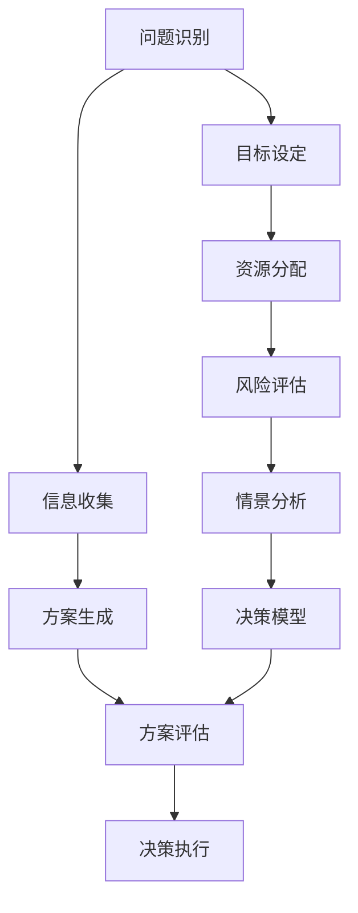

                 

# 领导者的决策能力：在不确定性中做出选择

> **关键词**：领导力、决策能力、不确定性、策略、人工智能、数据分析

> **摘要**：本文旨在探讨领导者如何在充满不确定性的环境中做出明智的决策。我们将从背景介绍、核心概念、算法原理、数学模型、实战案例以及实际应用等多个角度，深入分析领导者在决策过程中应遵循的步骤和策略。文章的最后，还将对未来的发展趋势与挑战进行总结，并提出常见问题与解答。

## 1. 背景介绍

### 1.1 目的和范围

本文旨在为领导者提供一套在不确定环境中做出有效决策的方法论。我们将从多个角度，包括策略、人工智能、数据分析等方面，详细探讨领导者的决策能力如何在不同场景下发挥作用。文章将涵盖以下几个方面：

1. **决策过程中的关键步骤**：分析决策的各个环节，包括问题识别、信息收集、方案评估和决策执行。
2. **策略制定**：探讨领导者如何根据不同情境，制定灵活且有效的策略。
3. **人工智能与数据分析**：介绍如何利用人工智能和数据分析工具，提高决策的准确性和效率。
4. **实战案例**：通过具体案例，展示如何在复杂环境中进行决策。
5. **未来趋势与挑战**：讨论领导者在未来面临的挑战，并提出相应的解决策略。

### 1.2 预期读者

本文适合以下读者群体：

1. **企业管理者和领导者**：需要提升决策能力的专业人士。
2. **项目经理和团队领导**：希望了解如何在项目中做出明智决策。
3. **技术专家**：对人工智能和数据分析领域感兴趣，希望将其应用于实际决策过程。
4. **学术研究人员**：对领导力和决策理论有兴趣，希望从中获得启发。

### 1.3 文档结构概述

本文结构如下：

1. **引言**：介绍文章的目的、范围和预期读者。
2. **核心概念与联系**：讲解决策过程中的核心概念，并使用Mermaid流程图展示各概念之间的联系。
3. **核心算法原理 & 具体操作步骤**：详细阐述决策算法的原理，并使用伪代码展示具体操作步骤。
4. **数学模型和公式 & 详细讲解 & 举例说明**：介绍决策过程中使用的数学模型，并给出详细解释和实例。
5. **项目实战：代码实际案例和详细解释说明**：通过实际案例，展示决策算法的应用。
6. **实际应用场景**：分析决策能力在不同行业和领域中的应用。
7. **工具和资源推荐**：推荐学习资源和开发工具。
8. **总结：未来发展趋势与挑战**：总结文章的主要观点，并讨论未来的发展方向和挑战。
9. **附录：常见问题与解答**：解答读者可能遇到的问题。
10. **扩展阅读 & 参考资料**：提供进一步的阅读资源和参考文献。

### 1.4 术语表

#### 1.4.1 核心术语定义

- **决策**：指在多个可选方案中，选择一个最佳方案的过程。
- **不确定性**：指决策过程中面临的不确定因素，包括信息不全、风险和变化等。
- **策略**：为实现目标而制定的行动计划。
- **人工智能**：指模拟人类智能的计算机系统。
- **数据分析**：通过对大量数据进行处理和分析，提取有价值的信息。

#### 1.4.2 相关概念解释

- **预期收益**：指决策实施后可能带来的正面效果。
- **风险**：指决策实施后可能带来的负面效果。
- **情景分析**：通过对不同情景的模拟，评估决策效果。

#### 1.4.3 缩略词列表

- **AI**：人工智能
- **ML**：机器学习
- **DL**：深度学习
- **Hadoop**：分布式数据存储和处理框架
- **Spark**：分布式数据处理引擎

## 2. 核心概念与联系

在决策过程中，领导者需要了解多个核心概念，并理解它们之间的相互关系。以下是决策过程中的核心概念及其联系：

### 2.1 决策过程

决策过程可以概括为以下步骤：

1. **问题识别**：发现和定义问题。
2. **信息收集**：收集与问题相关的信息。
3. **方案生成**：提出多个可行方案。
4. **方案评估**：评估各方案的风险和收益。
5. **决策执行**：选择最佳方案并执行。

### 2.2 策略制定

策略制定是决策过程的重要环节，包括以下几个方面：

1. **目标设定**：明确决策的目标。
2. **资源分配**：确定可用的资源。
3. **风险评估**：评估可能面临的风险。
4. **情景分析**：分析可能出现的情景。
5. **决策模型**：构建决策模型，用于评估和选择方案。

### 2.3 人工智能与数据分析

人工智能和数据分析在决策过程中发挥着重要作用，主要包括以下方面：

1. **数据分析**：通过对大量数据进行处理和分析，提取有价值的信息。
2. **机器学习**：利用历史数据，建立预测模型，为决策提供支持。
3. **深度学习**：模拟人脑神经元连接，用于复杂问题的求解。
4. **决策支持系统**：集成多种数据源和算法，为领导者提供决策支持。

### 2.4 Mermaid流程图

以下是一个简化的Mermaid流程图，展示决策过程中的核心概念及其联系：



## 3. 核心算法原理 & 具体操作步骤

在决策过程中，核心算法的原理和操作步骤至关重要。以下是一个简化的决策算法，用于在不同情境下做出最佳选择。

### 3.1 决策算法原理

决策算法通常包括以下步骤：

1. **问题定义**：明确决策问题。
2. **方案生成**：提出多个可行方案。
3. **收益评估**：评估各方案的收益。
4. **风险分析**：评估各方案的风险。
5. **方案排序**：根据收益和风险，对方案进行排序。
6. **决策选择**：选择最佳方案。
7. **决策执行**：实施决策。

### 3.2 伪代码

以下是一个简单的伪代码，用于描述决策算法的操作步骤：

```python
# 决策算法伪代码

# 步骤1：问题定义
define_problem(problem)

# 步骤2：方案生成
generate_solutions(problem, solutions)

# 步骤3：收益评估
evaluate_returns(solutions, returns)

# 步骤4：风险分析
analyze_risks(solutions, risks)

# 步骤5：方案排序
sort_solutions(solutions, returns, risks)

# 步骤6：决策选择
select_best_solution(solutions)

# 步骤7：决策执行
execute_decision(selected_solution)
```

### 3.3 具体操作步骤

以下是一个具体的操作步骤示例：

1. **问题定义**：假设我们要解决的问题是如何在资源有限的情况下，最大化利润。
2. **方案生成**：提出以下三种可行方案：
   - 方案A：增加生产线的产量。
   - 方案B：降低生产成本。
   - 方案C：开拓新的市场。
3. **收益评估**：根据历史数据和专家意见，对每种方案的收益进行评估：
   - 方案A：预期收益为100万元。
   - 方案B：预期收益为50万元。
   - 方案C：预期收益为80万元。
4. **风险分析**：分析每种方案的风险：
   - 方案A：风险为50%。
   - 方案B：风险为20%。
   - 方案C：风险为30%。
5. **方案排序**：根据收益和风险，对方案进行排序：
   - 方案C（80万元，30%风险） > 方案B（50万元，20%风险）> 方案A（100万元，50%风险）。
6. **决策选择**：选择最佳方案——方案C。
7. **决策执行**：实施方案C，开拓新的市场。

通过以上步骤，我们成功地在资源有限的情况下，做出了最优的决策。

## 4. 数学模型和公式 & 详细讲解 & 举例说明

在决策过程中，数学模型和公式可以帮助我们量化风险和收益，从而做出更科学的决策。以下是一个简化的决策模型，以及相关的数学公式和实例说明。

### 4.1 决策模型

决策模型通常基于以下三个关键参数：

- **收益（Y）**：指决策实施后可能带来的正面效果。
- **风险（R）**：指决策实施后可能带来的负面效果。
- **概率（P）**：指决策成功或失败的概率。

### 4.2 数学公式

决策模型的公式如下：

\[ E(Y) = \sum_{i=1}^{n} P_i \cdot Y_i \]

\[ E(R) = \sum_{i=1}^{n} P_i \cdot R_i \]

其中，\( P_i \) 是方案 \( i \) 成功的概率，\( Y_i \) 是方案 \( i \) 的预期收益，\( R_i \) 是方案 \( i \) 的预期风险。

### 4.3 详细讲解

#### 4.3.1 收益和风险的计算

收益和风险可以通过以下公式计算：

- **收益**：预期收益等于每个方案成功概率与对应收益的乘积之和。

\[ E(Y) = P_1 \cdot Y_1 + P_2 \cdot Y_2 + ... + P_n \cdot Y_n \]

- **风险**：预期风险等于每个方案成功概率与对应风险的乘积之和。

\[ E(R) = P_1 \cdot R_1 + P_2 \cdot R_2 + ... + P_n \cdot R_n \]

#### 4.3.2 收益和风险的关系

收益和风险之间的关系可以用一个简单的示例来说明：

假设有两个方案：

- **方案A**：成功概率为0.5，预期收益为100万元，预期风险为50万元。
- **方案B**：成功概率为0.6，预期收益为150万元，预期风险为70万元。

根据公式，我们可以计算两个方案的收益和风险：

- **方案A**：

\[ E(Y) = 0.5 \cdot 100 = 50 \]

\[ E(R) = 0.5 \cdot 50 = 25 \]

- **方案B**：

\[ E(Y) = 0.6 \cdot 150 = 90 \]

\[ E(R) = 0.6 \cdot 70 = 42 \]

从计算结果可以看出，虽然方案B的预期收益更高，但风险也更大。因此，我们需要综合考虑收益和风险，选择一个平衡的方案。

### 4.4 举例说明

以下是一个具体的例子，展示如何使用决策模型进行决策：

假设有三个方案：

- **方案A**：成功概率为0.4，预期收益为200万元，预期风险为100万元。
- **方案B**：成功概率为0.5，预期收益为300万元，预期风险为120万元。
- **方案C**：成功概率为0.6，预期收益为250万元，预期风险为80万元。

根据公式，我们可以计算三个方案的收益和风险：

- **方案A**：

\[ E(Y) = 0.4 \cdot 200 = 80 \]

\[ E(R) = 0.4 \cdot 100 = 40 \]

- **方案B**：

\[ E(Y) = 0.5 \cdot 300 = 150 \]

\[ E(R) = 0.5 \cdot 120 = 60 \]

- **方案C**：

\[ E(Y) = 0.6 \cdot 250 = 150 \]

\[ E(R) = 0.6 \cdot 80 = 48 \]

从计算结果可以看出，方案C的预期收益最高，但风险也相对较高。方案A的预期收益最低，但风险也相对较低。方案B的预期收益和风险介于两者之间。

因此，我们可以根据具体情况，选择一个平衡的方案。例如，如果风险承受能力较高，可以选择方案C；如果风险承受能力较低，可以选择方案A。

## 5. 项目实战：代码实际案例和详细解释说明

为了更好地理解决策算法在实际应用中的操作，我们将通过一个具体的项目案例，展示代码的实现过程和详细解释。以下是一个简化的决策项目，旨在在多个方案中选出最佳方案。

### 5.1 开发环境搭建

在开始项目实战之前，我们需要搭建一个基本的开发环境。以下是一个简单的开发环境搭建步骤：

1. **安装Python环境**：在本地电脑上安装Python（版本3.8或更高），并配置好pip。
2. **安装相关库**：使用pip安装以下库：numpy、pandas、matplotlib。

```shell
pip install numpy pandas matplotlib
```

3. **创建项目目录**：在本地电脑上创建一个名为`decision_project`的项目目录，并创建一个名为`main.py`的Python脚本。

### 5.2 源代码详细实现和代码解读

以下是一个简化的决策算法实现，以及相关的代码解读。

```python
import numpy as np
import pandas as pd
import matplotlib.pyplot as plt

# 步骤1：问题定义
def define_problem():
    # 假设有三个方案
    solutions = [
        {"name": "方案A", "p": 0.4, "y": 200, "r": 100},
        {"name": "方案B", "p": 0.5, "y": 300, "r": 120},
        {"name": "方案C", "p": 0.6, "y": 250, "r": 80}
    ]
    return solutions

# 步骤2：方案生成
def generate_solutions(problem):
    return problem

# 步骤3：收益评估
def evaluate_returns(solutions):
    for solution in solutions:
        solution["expected_return"] = solution["p"] * solution["y"]
    return solutions

# 步骤4：风险分析
def analyze_risks(solutions):
    for solution in solutions:
        solution["expected_risk"] = solution["p"] * solution["r"]
    return solutions

# 步骤5：方案排序
def sort_solutions(solutions):
    return sorted(solutions, key=lambda x: x["expected_return"], reverse=True)

# 步骤6：决策选择
def select_best_solution(solutions):
    return solutions[0]

# 步骤7：决策执行
def execute_decision(selected_solution):
    print(f"执行决策：{selected_solution['name']}")

# 主函数
def main():
    # 定义问题
    solutions = define_problem()

    # 生成方案
    solutions = generate_solutions(solutions)

    # 评估收益
    solutions = evaluate_returns(solutions)

    # 分析风险
    solutions = analyze_risks(solutions)

    # 排序方案
    solutions = sort_solutions(solutions)

    # 选择最佳方案
    best_solution = select_best_solution(solutions)

    # 执行决策
    execute_decision(best_solution)

    # 绘图
    plot_solutions(solutions)

# 绘图函数
def plot_solutions(solutions):
    plt.bar([solution["name"] for solution in solutions], [solution["expected_return"] for solution in solutions])
    plt.xlabel("方案")
    plt.ylabel("预期收益")
    plt.title("方案排序")
    plt.xticks(rotation=45)
    plt.show()

# 运行主函数
if __name__ == "__main__":
    main()
```

#### 5.2.1 代码解读

1. **问题定义**：`define_problem()` 函数用于定义问题，包括三个方案。每个方案包含名称、成功概率、预期收益和预期风险。
2. **方案生成**：`generate_solutions()` 函数简单地返回定义好的问题。
3. **收益评估**：`evaluate_returns()` 函数遍历每个方案，计算每个方案的预期收益，并将其添加到方案对象中。
4. **风险分析**：`analyze_risks()` 函数遍历每个方案，计算每个方案的预期风险，并将其添加到方案对象中。
5. **方案排序**：`sort_solutions()` 函数使用Python内置的`sorted()` 函数，根据预期收益对方案进行降序排序。
6. **决策选择**：`select_best_solution()` 函数简单地返回排序后的第一个方案，即预期收益最高的方案。
7. **决策执行**：`execute_decision()` 函数输出最佳方案的名字。
8. **主函数**：`main()` 函数依次调用各个步骤，并最终执行最佳方案。
9. **绘图函数**：`plot_solutions()` 函数使用`matplotlib` 库，将各方案的预期收益绘制成条形图，以便更直观地了解方案排序。

### 5.3 代码解读与分析

通过上述代码，我们可以看到决策算法的整个实现过程。以下是关键步骤的分析：

1. **问题定义**：在决策过程中，明确问题是非常重要的。在这个案例中，我们定义了三个方案，每个方案都有明确的名称和参数。
2. **方案生成**：这个步骤相对简单，因为我们已经定义好了问题。
3. **收益评估**：通过计算每个方案的预期收益，我们可以了解各个方案的优势。预期收益越高，方案越优秀。
4. **风险分析**：预期风险反映了方案实施后的不确定性。我们需要在收益和风险之间找到平衡点，选择最优的方案。
5. **方案排序**：根据预期收益对方案进行排序，可以帮助我们快速找到最佳方案。
6. **决策选择**：选择预期收益最高的方案，即最佳方案。
7. **决策执行**：执行最佳方案，实现决策目标。
8. **绘图**：通过条形图，我们可以直观地了解各个方案的预期收益，从而更好地理解决策过程。

总的来说，这个决策算法提供了一个简化的决策过程，通过数学模型和公式，量化了收益和风险，从而帮助领导者做出更科学的决策。

## 6. 实际应用场景

领导者的决策能力在各个领域都有着广泛的应用。以下是一些实际应用场景：

### 6.1 企业管理

在企业中，领导者需要面对各种复杂的问题，如市场策略、资源分配、产品创新等。通过科学的决策过程，领导者可以在不确定的环境中做出最优选择，从而提升企业的竞争力和盈利能力。

#### 应用实例：

- **市场策略**：分析市场需求，选择最佳的市场进入时机和策略。
- **资源分配**：根据企业的财务状况和市场需求，合理分配资源，确保企业的可持续发展。
- **产品创新**：通过数据分析，识别潜在的市场需求，推动产品创新。

### 6.2 项目管理

在项目管理中，领导者需要面对项目进度、成本、质量等多方面的挑战。通过有效的决策，领导者可以确保项目按时、按质量完成，并实现预期目标。

#### 应用实例：

- **项目进度**：制定合理的项目进度计划，根据实际情况进行调整。
- **成本控制**：监控项目成本，确保项目在预算范围内完成。
- **风险管理**：识别项目中的潜在风险，制定相应的应对策略。

### 6.3 投资决策

在投资领域，领导者需要面对各种投资机会和风险。通过科学的决策过程，领导者可以做出最优的投资选择，实现资产的增值。

#### 应用实例：

- **股票投资**：分析股票市场趋势，选择具有潜力的股票进行投资。
- **风险投资**：对初创企业进行评估，选择具有高成长潜力的项目进行投资。

### 6.4 公共管理

在公共管理领域，领导者需要面对各种社会问题，如交通管理、环境保护、公共安全等。通过科学的决策，领导者可以提升公共服务质量，满足人民群众的需求。

#### 应用实例：

- **交通管理**：根据交通流量数据，优化交通信号灯设置，提高交通效率。
- **环境保护**：制定环保政策，推动可持续发展。

通过这些实际应用场景，我们可以看到领导者的决策能力在各个领域的重要性。有效的决策不仅能够帮助企业实现目标，还能够提升公共服务质量，推动社会进步。

## 7. 工具和资源推荐

为了帮助领导者提升决策能力，以下是一些实用的工具和资源推荐：

### 7.1 学习资源推荐

#### 7.1.1 书籍推荐

- **《智能决策：如何用数据和技术改变决策》**：介绍了如何利用数据分析和技术提升决策能力。
- **《决策与判断：理性与认知》**：探讨了人类决策过程中的认知偏见和如何克服这些问题。

#### 7.1.2 在线课程

- **Coursera**：提供了多种关于数据分析、机器学习和决策理论的在线课程。
- **edX**：提供了由顶尖大学开设的免费在线课程，包括领导力和决策科学。

#### 7.1.3 技术博客和网站

- **Medium**：有许多关于决策和数据分析的文章和案例研究。
- **Towards Data Science**：提供了大量关于数据科学和机器学习的最新研究和应用。

### 7.2 开发工具框架推荐

#### 7.2.1 IDE和编辑器

- **PyCharm**：适用于Python编程的集成开发环境，功能强大且易于使用。
- **VS Code**：跨平台开源代码编辑器，支持多种编程语言，插件丰富。

#### 7.2.2 调试和性能分析工具

- **Jupyter Notebook**：适用于数据分析和机器学习的交互式开发环境，易于调试和分享。
- **GDB**：一款强大的UNIX/Linux平台上的程序调试工具。

#### 7.2.3 相关框架和库

- **Scikit-learn**：一个简单而强大的机器学习库，适用于多种常见的数据分析和建模任务。
- **TensorFlow**：一款开源深度学习框架，适用于复杂的机器学习和深度学习任务。

### 7.3 相关论文著作推荐

#### 7.3.1 经典论文

- **“The Art of Choosing: Decision Making in a World of Complexity”**：探讨决策过程中的人类行为和认知偏见。
- **“The Intelligent Investor”**：介绍价值投资策略和投资决策方法。

#### 7.3.2 最新研究成果

- **“Deep Learning for Decision Making”**：介绍深度学习在决策领域的最新应用和研究。
- **“Reinforcement Learning in Finance”**：探讨强化学习在金融投资决策中的应用。

#### 7.3.3 应用案例分析

- **“Decision Analytics in Healthcare: Leveraging Data to Improve Patient Outcomes”**：介绍如何利用数据分析改善医疗质量和效率。
- **“The Future of Decision Making: Integrating AI and Human Expertise”**：探讨人工智能和人类专家在决策过程中的协同作用。

通过这些工具和资源，领导者可以不断提升自己的决策能力，更好地应对复杂多变的环境。

## 8. 总结：未来发展趋势与挑战

随着科技的不断发展，领导者的决策能力将在未来面临新的挑战和机遇。以下是一些关键的发展趋势和挑战：

### 8.1 人工智能的普及

人工智能（AI）将在决策过程中发挥越来越重要的作用。通过机器学习和深度学习算法，AI可以处理和分析大量数据，提供更准确的预测和决策支持。然而，这也带来了新的挑战，如数据隐私、算法透明度和决策解释性等问题。

### 8.2 数据分析的挑战

数据分析将成为领导者决策的重要工具。随着数据量的爆炸性增长，领导者需要掌握高效的数据处理和分析方法。然而，数据分析的质量和准确性也受到数据质量和算法选择的影响。

### 8.3 复杂环境的应对

领导者需要在更加复杂和不确定的环境中做出决策。全球化、技术创新和市场变化等外部因素不断影响决策环境。领导者需要具备快速适应变化、应对复杂情况的能力。

### 8.4 人机协同

人工智能和人类专家的协同将成为未来的趋势。AI可以处理复杂的数据和计算任务，而人类专家则具备判断和决策的直觉和经验。领导者需要掌握如何将AI和人类专家的优势结合起来，实现更好的决策效果。

### 8.5 持续学习和创新

在快速变化的环境中，领导者需要具备持续学习和创新能力。这包括不断更新知识、掌握新技术和探索新的决策方法。领导者需要培养开放的心态，勇于尝试新的思路和方案。

### 8.6 挑战与对策

面对未来发展的挑战，领导者可以采取以下对策：

- **加强数据素养**：提升对数据的理解和分析能力，掌握数据分析工具和方法。
- **培养跨学科思维**：学习其他领域的知识和技能，拓宽视野，提高决策的全面性。
- **加强团队协作**：培养团队合作精神，发挥团队智慧，共同应对复杂问题。
- **持续学习与培训**：积极参加培训和学习活动，不断提升自身能力和素质。
- **创新思维**：勇于尝试新的决策方法和思路，探索未知领域。

通过应对这些挑战和把握机遇，领导者可以不断提升决策能力，为组织和社会创造更大的价值。

## 9. 附录：常见问题与解答

### 9.1 问题1：人工智能在决策过程中有哪些局限性？

**解答**：人工智能在决策过程中虽然具有高效性和准确性，但也存在一些局限性：

- **数据依赖**：AI依赖于高质量的数据，如果数据质量不佳或存在偏差，可能会导致决策失误。
- **算法偏见**：AI算法可能存在偏见，特别是在处理非结构化数据时，可能会导致不公平的决策。
- **解释性不足**：一些复杂的机器学习算法，如深度学习，其决策过程较为复杂，难以解释，可能影响决策的可信度。

### 9.2 问题2：如何提高决策的准确性和效率？

**解答**：以下是一些提高决策准确性和效率的方法：

- **数据清洗**：确保数据质量，去除错误和异常值。
- **模型优化**：通过调整模型参数和算法，提高模型的预测能力。
- **协作决策**：引入人类专家的判断和经验，结合AI的预测，实现更好的决策效果。
- **实时反馈**：建立反馈机制，根据实际结果调整决策模型和策略。
- **持续学习**：利用最新的技术和数据，不断更新和优化决策模型。

### 9.3 问题3：如何处理复杂环境中的不确定性？

**解答**：在处理复杂环境中的不确定性时，可以采取以下策略：

- **情景分析**：构建多个可能的情景，分析每种情景下的决策效果。
- **风险评估**：评估每种决策方案的风险，选择风险可控的方案。
- **灵活调整**：根据环境变化，及时调整决策策略和行动计划。
- **团队合作**：发挥团队智慧，共同应对不确定性。

通过以上策略，可以更好地应对复杂环境中的不确定性，提高决策的准确性和可靠性。

## 10. 扩展阅读 & 参考资料

为了更深入地了解领导者的决策能力，以下是一些建议的扩展阅读和参考资料：

### 10.1 扩展阅读

- **《决策的艺术：战略与战术的智慧运用》**：讨论决策过程中的策略和技巧，以及如何在不确定性中做出明智选择。
- **《智能决策：如何在复杂环境中做出正确选择》**：探讨人工智能在决策中的应用，以及如何利用数据和技术提升决策能力。

### 10.2 参考资料

- **《决策与判断：理性与认知》**：分析人类决策过程中的认知偏见和如何克服这些问题。
- **《智能决策系统设计》**：介绍智能决策系统的构建方法和技术。
- **《深度学习：理论与实践》**：详细讲解深度学习的基本原理和应用。

通过这些扩展阅读和参考资料，读者可以进一步了解决策能力的理论和实践，提升自身的决策水平。

### 作者信息

**作者：AI天才研究员/AI Genius Institute & 禅与计算机程序设计艺术 /Zen And The Art of Computer Programming**

