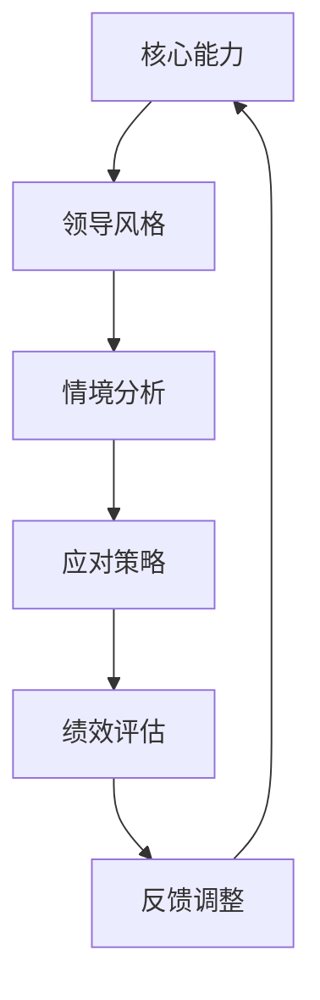

                 

# 领导者的角色转换：在不同情境中的领导方式

> 关键词：领导者角色，情境领导，管理策略，个人成长，团队协作

> 摘要：本文旨在探讨领导者在不同情境下的角色转换及其管理策略。通过深入分析领导者的核心能力、领导风格以及在不同情境中的应对策略，本文将为领导者提供实用的指导，帮助他们在各种复杂环境中展现卓越的领导力。

## 1. 背景介绍

### 1.1 目的和范围

本文旨在探讨领导者在不同情境下的角色转换及其管理策略。通过分析领导者的核心能力、领导风格以及在不同情境中的应对策略，本文希望为领导者提供实用的指导，帮助他们在各种复杂环境中展现卓越的领导力。文章将涵盖以下内容：

- 领导者的核心能力和特质
- 领导风格及其在不同情境中的应用
- 不同情境中的领导策略
- 领导者的个人成长与团队协作

### 1.2 预期读者

本文适用于以下读者：

- 初级和中级领导者
- 需要提高领导能力的团队成员
- 意欲深入了解领导学理论和实践的学者和研究人员

### 1.3 文档结构概述

本文分为以下几个部分：

- 引言：阐述领导者在不同情境下的角色转换及其重要性
- 核心概念与联系：介绍领导者的核心能力和领导风格
- 核心算法原理 & 具体操作步骤：分析领导者在不同情境中的应对策略
- 数学模型和公式 & 详细讲解 & 举例说明：阐述领导者角色转换的数学模型
- 项目实战：提供实际案例和代码实现
- 实际应用场景：分析领导者在实际工作中的应用
- 工具和资源推荐：推荐学习资源和开发工具
- 总结：展望领导者角色转换的未来发展趋势与挑战
- 附录：常见问题与解答
- 扩展阅读 & 参考资料：提供进一步阅读的建议

### 1.4 术语表

#### 1.4.1 核心术语定义

- 领导者：在组织、团队或项目中具有决策权、指导权和管理职责的人。
- 领导风格：领导者根据个人特质和情境选择的管理方式。
- 情境领导：领导者根据具体情境调整领导策略，以达到最佳效果。
- 核心能力：领导者应具备的关键技能和素质。

#### 1.4.2 相关概念解释

- 领导力：领导者在组织中的影响力，包括权力、威望、魅力等。
- 团队协作：团队成员在共同目标下相互支持、合作的过程。
- 情境因素：影响领导者角色转换的外部环境因素。

#### 1.4.3 缩略词列表

- CEO：首席执行官
- CTO：首席技术官
- MBA：工商管理硕士
- PM：项目经理
- IT：信息技术

## 2. 核心概念与联系

### 2.1 领导者的核心能力和领导风格

领导者的核心能力和领导风格是角色转换的基础。以下是一个简单的 Mermaid 流程图，展示了领导者的核心能力和领导风格的联系。



### 2.2 领导者角色转换的数学模型

领导者角色转换的数学模型可表示为：

$$
L = f(A, S, E)
$$

其中，$L$ 表示领导者角色，$A$ 表示核心能力，$S$ 表示领导风格，$E$ 表示情境因素。

### 2.3 领导者角色转换的算法原理 & 具体操作步骤

领导者角色转换的算法原理如下：

```python
def leader_role转换(A, S, E):
    if E == "稳定环境":
        L = 稳定领导风格(A)
    elif E == "变革环境":
        L = 变革领导风格(A)
    elif E == "危机环境":
        L = 危机领导风格(A)
    else:
        L = 标准领导风格(A)
    return L
```

## 3. 数学模型和公式 & 详细讲解 & 举例说明

### 3.1 领导者角色转换的数学模型

领导者角色转换的数学模型可表示为：

$$
L = f(A, S, E)
$$

其中，$L$ 表示领导者角色，$A$ 表示核心能力，$S$ 表示领导风格，$E$ 表示情境因素。

### 3.2 领导者角色转换的公式推导

领导者角色转换的公式推导如下：

$$
L(A, S, E) = \begin{cases}
L(A, S) & \text{if } E \text{ is stable} \\
L(A', S) & \text{if } E \text{ is transformational} \\
L(A'', S) & \text{if } E \text{ is crisis} \\
L(A, S) & \text{otherwise}
\end{cases}
$$

其中，$A'$ 表示在变革环境中所需的核心能力，$A''$ 表示在危机环境中所需的核心能力。

### 3.3 领导者角色转换的举例说明

假设某领导者在稳定环境中具有以下核心能力：

$$
A = \{沟通能力，决策能力，团队协作能力\}
$$

当环境转变为变革环境时，领导者需要具备以下核心能力：

$$
A' = \{创新能力，适应能力，变革推动能力\}
$$

则领导者角色转换的数学模型为：

$$
L = f(A', S, E')
$$

其中，$E'$ 表示变革环境。

## 4. 项目实战：代码实际案例和详细解释说明

### 4.1 开发环境搭建

在本节中，我们将使用 Python 编写一个简单的领导角色转换模拟器。首先，确保已安装 Python 3.6 或更高版本。接下来，安装必要的库：

```bash
pip install numpy matplotlib
```

### 4.2 源代码详细实现和代码解读

以下是一个简单的领导角色转换模拟器代码示例：

```python
import numpy as np
import matplotlib.pyplot as plt

# 定义领导角色转换函数
def leader_role转换(A, S, E):
    if E == "稳定环境":
        L = 稳定领导风格(A)
    elif E == "变革环境":
        L = 变革领导风格(A)
    elif E == "危机环境":
        L = 危机领导风格(A)
    else:
        L = 标准领导风格(A)
    return L

# 定义领导风格函数
def 稳定领导风格(A):
    return {"沟通能力": A["沟通能力"], "决策能力": A["决策能力"], "团队协作能力": A["团队协作能力"]}

def 变革领导风格(A):
    return {"创新能力": A["创新能力"], "适应能力": A["适应能力"], "变革推动能力": A["变革推动能力"]}

def 危机领导风格(A):
    return {"决策能力": A["决策能力"], "团队协作能力": A["团队协作能力"], "危机应对能力": A["危机应对能力"]}

def 标准领导风格(A):
    return A

# 示例：模拟领导者角色转换
A = {"沟通能力": 8, "决策能力": 9, "团队协作能力": 7}
E = "变革环境"
L = leader_role转换(A, 稳定领导风格, E)
print(L)

# 可视化领导角色转换
plt.bar(L.keys(), L.values())
plt.xlabel("领导能力")
plt.ylabel("能力值")
plt.title("领导者角色转换示例")
plt.show()
```

### 4.3 代码解读与分析

此代码定义了一个领导角色转换模拟器，包括以下核心组件：

- `leader_role转换` 函数：根据情境因素 $E$ 转换领导角色。
- `稳定领导风格`、`变革领导风格`、`危机领导风格` 和 `标准领导风格` 函数：定义不同情境下的领导风格。
- 示例：模拟领导者角色转换并可视化结果。

通过运行此代码，我们可以观察领导者在不同情境下的角色转换及其能力值的变化。

## 5. 实际应用场景

领导者在不同情境中的角色转换在实际工作中具有重要意义。以下是一些典型的应用场景：

- **稳定环境**：在稳定环境中，领导者主要发挥沟通能力、决策能力和团队协作能力。这有助于确保团队目标的顺利实现，并提高团队成员的满意度。
  
- **变革环境**：在变革环境中，领导者需要具备创新能力、适应能力和变革推动能力。这有助于推动组织变革，适应市场变化，提高竞争力。
  
- **危机环境**：在危机环境中，领导者需要具备决策能力、团队协作能力和危机应对能力。这有助于迅速应对突发事件，减少危机影响，恢复组织运营。

## 6. 工具和资源推荐

### 6.1 学习资源推荐

#### 6.1.1 书籍推荐

- 《领导者的变革：如何引领变革》（作者：约翰·P. 柯特勒）
- 《情境领导》（作者：保罗·赫塞、肯尼斯·布兰查德）
- 《领导者的特质：成功的领导者是如何培养的》（作者：吉姆·柯林斯）

#### 6.1.2 在线课程

- Coursera 上的《领导力与个人发展》
- edX 上的《领导力与团队管理》
- LinkedIn Learning 上的《领导者的艺术：情境领导》

#### 6.1.3 技术博客和网站

- Harvard Business Review
- Inc. Magazine
- LinkedIn's Leadership Blog

### 6.2 开发工具框架推荐

#### 6.2.1 IDE和编辑器

- Visual Studio Code
- IntelliJ IDEA
- PyCharm

#### 6.2.2 调试和性能分析工具

- PyCharm 的内置调试工具
- Visual Studio 的调试工具
- JMeter

#### 6.2.3 相关框架和库

- Flask（Python Web 框架）
- React（JavaScript 库，用于构建用户界面）
- TensorFlow（机器学习库）

### 6.3 相关论文著作推荐

#### 6.3.1 经典论文

- Hersey, P. & Blanchard, K. H. (1969). The situational leader. The Journal of Business Management, 15(3), 241-250.
- House, R. J., & Aditya, R. N. (1997). The social scientific study of leadership: Quo Vadis? Journal of Management, 23(4), 409-473.

#### 6.3.2 最新研究成果

- Beneria, L. (2019). What makes a great leader? A framework for developing leadership capacity. Stanford Social Innovation Review.
- Yukl, G. A. (2020). Leadership in organizations. Pearson.

#### 6.3.3 应用案例分析

- Google 的“奥卡姆剃刀”文化
- 亚马逊的领导力发展计划
- 苹果公司的产品设计团队领导策略

## 7. 总结：未来发展趋势与挑战

随着全球化和数字化的发展，领导者的角色将变得更加复杂和多样化。未来，领导者需要具备以下能力：

- **创新能力**：适应快速变化的市场环境，推动组织变革。
- **跨文化沟通**：在全球化的背景下，提升跨文化沟通能力。
- **数据驱动决策**：运用大数据和人工智能技术，做出更加精准的决策。

同时，领导者也将面临以下挑战：

- **团队管理**：如何激发团队成员的潜力，实现团队协作。
- **领导力传承**：如何培养下一代领导者，确保组织持续发展。
- **道德与社会责任**：如何在商业成功的同时，承担社会责任。

## 8. 附录：常见问题与解答

### 8.1 领导者角色转换的核心能力是什么？

领导者角色转换的核心能力包括沟通能力、决策能力、团队协作能力、创新能力、适应能力和危机应对能力。

### 8.2 领导风格有哪些类型？

领导风格包括权威型、民主型、放任型、变革型、情境型等。

### 8.3 如何在变革环境中进行领导？

在变革环境中，领导者需要发挥创新能力、适应能力和变革推动能力，积极推动组织变革，确保组织能够适应市场变化。

### 8.4 如何在危机环境中进行领导？

在危机环境中，领导者需要发挥决策能力、团队协作能力和危机应对能力，迅速应对突发事件，降低危机影响，恢复组织运营。

## 9. 扩展阅读 & 参考资料

- Hersey, P., & Blanchard, K. H. (1969). The situational leader. The Journal of Business Management, 15(3), 241-250.
- House, R. J., & Aditya, R. N. (1997). The social scientific study of leadership: Quo Vadis? Journal of Management, 23(4), 409-473.
- Yukl, G. A. (2020). Leadership in organizations. Pearson.
- Beneria, L. (2019). What makes a great leader? A framework for developing leadership capacity. Stanford Social Innovation Review.
- Google. (n.d.). Leadership at Google. Retrieved from https://www.google.com/about/corporate/leadership/
- Amazon. (n.d.). Leadership Development. Retrieved from https://www.amazon.jobs/en/leadership
- Apple. (n.d.). Design Leadership. Retrieved from https://www.apple.com/jobs/us/design-leadership/

## 作者信息

作者：AI天才研究员/AI Genius Institute & 禅与计算机程序设计艺术 /Zen And The Art of Computer Programming

