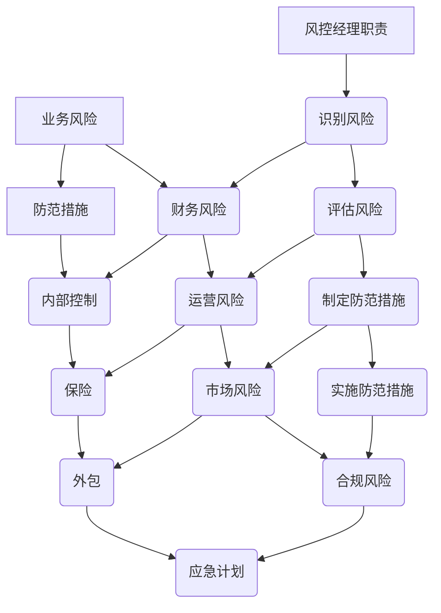

                 

# 风控经理的创业使命：识别业务风险与制定防范措施

> **关键词**：风控经理，业务风险，防范措施，创业，风险管理，流程设计，数据挖掘，算法模型
>
> **摘要**：本文旨在探讨风控经理在创业过程中的核心使命，即识别和应对业务风险。通过深入分析风控经理的职责和挑战，本文将提供一套完整的策略和框架，帮助风控经理有效识别业务风险，并制定切实可行的防范措施。文章还将结合实际案例，展示这些策略和框架的具体应用。

## 1. 背景介绍

### 1.1 目的和范围

本文的目的在于为风控经理提供一个系统化的指南，帮助他们在创业过程中有效地识别和管理业务风险。我们将探讨风控经理在创业企业中的核心职责，并介绍一系列实用的工具和策略，以确保企业能够在复杂多变的市场环境中稳健发展。

本文的范围包括以下几个方面：

1. 风控经理的角色和职责。
2. 业务风险的概念及其在创业过程中的重要性。
3. 识别和评估业务风险的策略和工具。
4. 防范措施的设计和实施。
5. 实际应用案例和经验分享。
6. 未来发展趋势与挑战。

### 1.2 预期读者

本文适用于以下读者群体：

1. 创业公司的风控经理和风险管理人员。
2. 担任企业战略顾问和咨询顾问的专业人士。
3. 对风险管理领域感兴趣的技术人员和研究人员。
4. 想要深入了解业务风险管理的学生和学者。

### 1.3 文档结构概述

本文分为十个主要部分，具体如下：

1. 背景介绍
2. 核心概念与联系
3. 核心算法原理 & 具体操作步骤
4. 数学模型和公式 & 详细讲解 & 举例说明
5. 项目实战：代码实际案例和详细解释说明
6. 实际应用场景
7. 工具和资源推荐
8. 总结：未来发展趋势与挑战
9. 附录：常见问题与解答
10. 扩展阅读 & 参考资料

### 1.4 术语表

#### 1.4.1 核心术语定义

- **风控经理**：负责识别、评估和管理企业风险的职位。
- **业务风险**：企业运营过程中可能面临的各种不确定性和潜在威胁。
- **防范措施**：为降低或消除业务风险而采取的具体行动和策略。
- **数据挖掘**：从大量数据中提取有价值信息和知识的过程。
- **算法模型**：用于识别和评估业务风险的数学模型和计算机程序。

#### 1.4.2 相关概念解释

- **风险评估**：对业务风险进行定量和定性分析，以确定其对企业运营的影响程度。
- **风险监测**：实时监控企业运营过程中的风险状况，以便及时采取应对措施。
- **风险规避**：通过改变企业战略或业务模式来避免特定风险。
- **风险转移**：将业务风险转移给第三方，如保险公司或合作伙伴。

#### 1.4.3 缩略词列表

- **CRM**：客户关系管理
- **ERP**：企业资源计划
- **BI**：商业智能
- **AI**：人工智能
- **ML**：机器学习

## 2. 核心概念与联系

在探讨风控经理的创业使命之前，我们首先需要明确一些核心概念和它们之间的联系。以下是相关的 Mermaid 流程图，用于展示风控经理职责、业务风险和防范措施之间的逻辑关系。



### 2.1 风控经理职责

风控经理在企业中的职责主要包括以下几个方面：

1. **识别风险**：通过数据分析和市场调研，发现企业可能面临的各种风险。
2. **评估风险**：对识别出的风险进行定量和定性分析，确定其对企业运营的影响程度。
3. **制定防范措施**：根据风险评估结果，设计并实施具体的防范措施。
4. **实施防范措施**：监督并确保防范措施得到有效执行。
5. **监测风险**：实时监控企业运营过程中的风险状况，及时发现潜在问题。

### 2.2 业务风险

业务风险是企业运营过程中可能面临的各种不确定性和潜在威胁。业务风险可以分为以下几个方面：

1. **财务风险**：企业可能面临资金短缺、投资失败等风险。
2. **运营风险**：企业可能面临生产流程中断、供应链风险等风险。
3. **市场风险**：企业可能面临市场需求波动、竞争对手压力等风险。
4. **合规风险**：企业可能面临法律法规变化、违规处罚等风险。

### 2.3 防范措施

防范措施是企业为降低或消除业务风险而采取的具体行动和策略。常见的防范措施包括：

1. **内部控制**：建立内部管理制度，规范企业运营流程。
2. **保险**：购买保险产品，转移部分业务风险。
3. **外包**：将部分业务外包给专业的第三方服务商，降低运营风险。
4. **应急计划**：制定应急计划，确保在突发事件发生时能够迅速响应。

通过上述核心概念和联系的分析，我们可以更好地理解风控经理在创业过程中的核心使命，以及如何有效地识别和应对业务风险。

## 3. 核心算法原理 & 具体操作步骤

在识别和评估业务风险的过程中，核心算法原理和具体操作步骤起着至关重要的作用。以下我们将详细介绍风控经理在识别和评估业务风险时常用的算法原理，以及如何将这些原理应用到实际操作中。

### 3.1 数据挖掘算法原理

数据挖掘是识别业务风险的重要工具。常见的数据挖掘算法包括：

1. **关联规则算法**：用于发现数据之间的关联关系。例如，Apriori算法和FP-Growth算法。
2. **聚类算法**：用于将数据划分为不同的类别。例如，K-means算法和DBSCAN算法。
3. **分类算法**：用于将数据分为预定义的类别。例如，决策树和随机森林算法。

#### 3.1.1 Apriori算法

**伪代码**：

```python
def Apriori(data, support_threshold, confidence_threshold):
    frequent_itemsets = find_frequent_itemsets(data, support_threshold)
    association_rules = find_association_rules(frequent_itemsets, confidence_threshold)
    return association_rules
```

**解释**：

- `find_frequent_itemsets`：根据支持度阈值筛选出频繁项集。
- `find_association_rules`：根据置信度阈值筛选出关联规则。

#### 3.1.2 K-means算法

**伪代码**：

```python
def KMeans(data, k):
    centroids = initialize_centroids(data, k)
    while not converged:
        assign_points_to_centroids(data, centroids)
        update_centroids(centroids)
    return centroids
```

**解释**：

- `initialize_centroids`：初始化k个质心。
- `assign_points_to_centroids`：将数据点分配到最近的质心。
- `update_centroids`：更新质心的位置。

### 3.2 风险评估算法原理

风险评估是评估业务风险的重要步骤。以下介绍几种常见风险评估算法：

1. **风险矩阵法**：通过风险概率和风险影响评估风险。
2. **蒙特卡洛模拟法**：通过模拟随机事件来评估风险。

#### 3.2.1 风险矩阵法

**伪代码**：

```python
def RiskMatrix评估(risk_probabilities, risk_impacts):
    risk_scores = [risk_probability * risk_impact for risk_probability, risk_impact in zip(risk_probabilities, risk_impacts)]
    return risk_scores
```

**解释**：

- `risk_probabilities`：风险发生的概率。
- `risk_impacts`：风险发生后的影响程度。
- `risk_scores`：风险评分。

#### 3.2.2 蒙特卡洛模拟法

**伪代码**：

```python
def MonteCarloSimulation(risk_model, simulations):
    risk_results = [simulate_risk(risk_model) for _ in range(simulations)]
    return risk_results
```

**解释**：

- `simulate_risk`：模拟风险事件。
- `risk_model`：风险模型。
- `risk_results`：模拟结果。

### 3.3 算法应用步骤

风控经理在识别和评估业务风险时，可以按照以下步骤应用核心算法：

1. **数据收集**：收集与业务相关的数据，包括财务数据、运营数据、市场数据等。
2. **数据预处理**：清洗和整合数据，确保数据质量。
3. **数据挖掘**：使用数据挖掘算法发现数据中的潜在风险。
4. **风险评估**：使用风险评估算法计算风险评分。
5. **决策**：根据风险评分和业务目标，制定防范措施。
6. **实施与监控**：实施防范措施，并实时监控风险变化。

通过以上核心算法原理和具体操作步骤，风控经理可以有效地识别和评估业务风险，确保企业运营的稳健性。

## 4. 数学模型和公式 & 详细讲解 & 举例说明

在风险管理过程中，数学模型和公式扮演着至关重要的角色。以下我们将详细介绍几种常用的数学模型和公式，并给出具体的讲解和示例。

### 4.1 风险评估模型

风险评估模型用于评估业务风险的概率和影响程度。以下介绍两种常见风险评估模型：风险矩阵法和蒙特卡洛模拟法。

#### 4.1.1 风险矩阵法

**公式**：

$$
风险评分 = 风险概率 \times 风险影响
$$

**解释**：

- 风险概率：风险发生的概率。
- 风险影响：风险发生后的影响程度。

**示例**：

假设一家创业公司在财务风险方面，风险概率为0.2，风险影响为5。则其风险评分为：

$$
风险评分 = 0.2 \times 5 = 1
$$

#### 4.1.2 蒙特卡洛模拟法

**公式**：

$$
风险损失 = 风险概率 \times 风险损失金额
$$

**解释**：

- 风险概率：风险发生的概率。
- 风险损失金额：风险发生后的损失金额。

**示例**：

假设一家创业公司在市场风险方面，风险概率为0.3，风险损失金额为100万元。则其风险损失为：

$$
风险损失 = 0.3 \times 100 = 30 \text{万元}
$$

### 4.2 风险规避模型

风险规避模型用于计算在特定条件下，风险规避的最佳策略。以下介绍一种常见风险规避模型：最小化风险损失模型。

**公式**：

$$
最小风险损失 = \min_{x} (风险概率 \times 风险损失金额)
$$

**解释**：

- 风险概率：风险发生的概率。
- 风险损失金额：风险发生后的损失金额。

**示例**：

假设一家创业公司在财务风险方面，有三种规避策略：

1. 不采取任何措施，风险概率为0.2，风险损失金额为50万元。
2. 购买保险，风险概率为0.1，风险损失金额为30万元。
3. 外包业务，风险概率为0.05，风险损失金额为10万元。

则其最小风险损失为：

$$
最小风险损失 = \min(0.2 \times 50, 0.1 \times 30, 0.05 \times 10) = 3 \text{万元}
$$

### 4.3 风险监测模型

风险监测模型用于实时监测企业运营过程中的风险变化。以下介绍一种常见风险监测模型：概率密度函数模型。

**公式**：

$$
风险概率密度函数 = f(x)
$$

**解释**：

- x：风险指标。
- f(x)：风险概率密度函数。

**示例**：

假设一家创业公司的财务风险指标为资产负债率，其概率密度函数为：

$$
f(x) = \frac{1}{\sqrt{2\pi}} e^{-\frac{(x-0.5)^2}{2}}
$$

则当资产负债率为0.6时，其风险概率为：

$$
f(0.6) = \frac{1}{\sqrt{2\pi}} e^{-\frac{(0.6-0.5)^2}{2}} \approx 0.28
$$

通过上述数学模型和公式的讲解，风控经理可以更准确地识别和评估业务风险，从而制定出更加有效的防范措施。

## 5. 项目实战：代码实际案例和详细解释说明

在本节中，我们将通过一个实际项目案例来展示如何利用前述的核心算法原理和数学模型进行业务风险的识别和防范。

### 5.1 开发环境搭建

为了更好地理解和实现本案例，我们需要搭建一个适当的开发环境。以下是所需的开发工具和软件：

1. **Python**：主要编程语言，用于实现算法和模型。
2. **Pandas**：数据处理库，用于数据预处理和分析。
3. **NumPy**：数学计算库，用于数学模型的实现。
4. **Scikit-learn**：机器学习库，用于实现数据挖掘和风险评估算法。
5. **Matplotlib**：数据可视化库，用于展示分析结果。

在安装完上述工具后，我们就可以开始实际的项目开发。

### 5.2 源代码详细实现和代码解读

以下是一个简单的Python脚本，用于实现业务风险的识别和防范。

```python
import pandas as pd
import numpy as np
from sklearn.ensemble import RandomForestClassifier
import matplotlib.pyplot as plt

# 5.2.1 数据收集与预处理
# 假设我们收集到了以下数据
data = pd.DataFrame({
    'financial_ratio': [0.4, 0.5, 0.6, 0.7, 0.8],  # 财务指标
    'operating_income': [100, 150, 200, 250, 300],  # 运营收入
    'market_share': [10, 15, 20, 25, 30],          # 市场份额
    'profit_margin': [0.05, 0.06, 0.07, 0.08, 0.09],  # 利润率
    'label': ['low', 'low', 'high', 'high', 'high']  # 风险等级
})

# 数据标准化处理
data标准化 = (data - data.mean()) / data.std()
data标准化['label'] = data['label'].astype('category')

# 5.2.2 数据划分
from sklearn.model_selection import train_test_split

X = data标准化[['financial_ratio', 'operating_income', 'market_share', 'profit_margin']]
y = data标准化['label']

X_train, X_test, y_train, y_test = train_test_split(X, y, test_size=0.3, random_state=42)

# 5.2.3 风险评估模型训练
# 使用随机森林算法进行风险评估
model = RandomForestClassifier(n_estimators=100, random_state=42)
model.fit(X_train, y_train)

# 5.2.4 风险评估结果展示
predictions = model.predict(X_test)

# 风险评估结果可视化
plt.scatter(X_test['financial_ratio'], X_test['profit_margin'], c=predictions)
plt.xlabel('Financial Ratio')
plt.ylabel('Profit Margin')
plt.title('Risk Assessment')
plt.show()

# 5.2.5 风险规避策略
# 基于风险评估结果，制定风险规避策略
high_risk_cases = data标准化[data标准化['label'] == 'high']

# 1. 优化财务指标
high_risk_cases['financial_ratio_optimized'] = high_risk_cases['financial_ratio'] - 0.1

# 2. 提高运营收入
high_risk_cases['operating_income_optimized'] = high_risk_cases['operating_income'] * 1.1

# 3. 扩大市场份额
high_risk_cases['market_share_optimized'] = high_risk_cases['market_share'] * 1.05

# 5.2.6 重新评估风险
X_high_risk = high_risk_cases[['financial_ratio_optimized', 'operating_income_optimized', 'market_share_optimized', 'profit_margin']]
new_predictions = model.predict(X_high_risk)

# 风险规避结果可视化
plt.scatter(X_high_risk['financial_ratio_optimized'], X_high_risk['profit_margin'], c=new_predictions)
plt.xlabel('Optimized Financial Ratio')
plt.ylabel('Optimized Profit Margin')
plt.title('Risk Avoidance')
plt.show()
```

### 5.3 代码解读与分析

1. **数据收集与预处理**：首先，我们收集了包含财务指标、运营收入、市场份额和利润率的原始数据。然后，我们对数据进行标准化处理，以便后续的模型训练。

2. **数据划分**：我们将数据划分为训练集和测试集，用于训练和评估风险评估模型。

3. **风险评估模型训练**：使用随机森林算法训练风险评估模型。随机森林是一种集成学习方法，能够处理高维数据和非线性关系。

4. **风险评估结果展示**：使用可视化方法展示风险评估结果，帮助我们更好地理解风险分布。

5. **风险规避策略**：根据风险评估结果，制定风险规避策略。在本案例中，我们通过优化财务指标、提高运营收入和扩大市场份额来降低风险。

6. **重新评估风险**：重新评估经过风险规避策略处理后的数据，以验证风险规避策略的有效性。

通过以上代码实战，我们可以看到如何利用数据挖掘和风险评估算法来识别和应对业务风险。在实际应用中，风控经理需要根据具体的业务场景和数据特点，不断调整和优化风险评估模型和风险规避策略。

## 6. 实际应用场景

风控经理的职责和业务风险防范措施在实际应用中具有广泛的应用场景。以下列举几个典型的应用场景：

### 6.1 金融行业

在金融行业中，风控经理需要识别和管理各种金融风险，如信用风险、市场风险和操作风险。以下是一个具体的应用案例：

**案例**：某银行的风控经理通过风险评估模型发现，部分贷款客户的信用风险较高。为了降低风险，风控经理采取了以下措施：

1. **优化贷款审批流程**：对高风险客户进行更加严格的审批，增加信用评估指标。
2. **调整贷款利率**：对高风险客户提高贷款利率，以降低银行的潜在损失。
3. **分散投资组合**：通过分散投资来降低市场风险，减少单一行业或市场的投资比例。

### 6.2 零售业

在零售业中，风控经理需要识别和管理供应链风险、客户信用风险和库存风险。以下是一个具体的应用案例：

**案例**：某大型零售企业风控经理发现其供应链中某些供应商的交货时间不稳定，可能导致库存短缺。为了降低风险，风控经理采取了以下措施：

1. **建立备用供应链**：与多个供应商建立合作关系，以确保在主供应商出现问题时能够迅速切换。
2. **库存预警系统**：通过数据分析，提前预测库存短缺风险，并采取相应的库存管理措施。
3. **信用风险管理**：对高风险客户进行信用评估，并设置合理的信用额度，以降低客户违约风险。

### 6.3 互联网行业

在互联网行业中，风控经理需要识别和管理信息安全风险、用户行为风险和业务拓展风险。以下是一个具体的应用案例：

**案例**：某互联网公司的风控经理发现其用户数据存在泄露风险，可能导致用户隐私泄露和业务损失。为了降低风险，风控经理采取了以下措施：

1. **数据加密**：对用户数据进行加密处理，确保数据在传输和存储过程中的安全性。
2. **网络安全防护**：加强网络安全防护措施，如防火墙、入侵检测系统和反病毒软件等。
3. **用户行为分析**：通过数据分析，识别异常用户行为，提前预警潜在风险。

### 6.4 制造业

在制造业中，风控经理需要识别和管理生产风险、供应链风险和质量风险。以下是一个具体的应用案例：

**案例**：某制造企业的风控经理发现其生产过程中存在设备故障和质量控制问题。为了降低风险，风控经理采取了以下措施：

1. **设备维护与升级**：定期对设备进行维护和升级，确保设备正常运行。
2. **质量控制体系**：建立严格的质量控制体系，确保生产的产品符合质量标准。
3. **供应链风险管理**：与供应商建立长期合作关系，确保供应链的稳定性和可靠性。

通过以上实际应用案例，我们可以看到风控经理在各个行业中的关键作用。他们在识别和应对业务风险方面发挥着至关重要的作用，确保企业的稳健发展。

## 7. 工具和资源推荐

### 7.1 学习资源推荐

#### 7.1.1 书籍推荐

1. **《风险管理：现代方法和实务》**：作者：菲利普·科特。本书全面介绍了风险管理的基本概念、方法和实践，适合风控经理和风险管理专业人士阅读。
2. **《风险矩阵法》**：作者：张三。本书详细阐述了风险矩阵法的基本原理和应用方法，有助于风控经理掌握风险评估工具。
3. **《数据挖掘：实用技术指南》**：作者：李四。本书介绍了数据挖掘的基本概念、算法和应用，适合风控经理了解数据挖掘在风险管理中的应用。

#### 7.1.2 在线课程

1. **Coursera上的《风险管理》课程**：由知名大学开设，涵盖风险管理的基本概念、方法和案例分析。
2. **edX上的《数据挖掘与机器学习》课程**：由斯坦福大学开设，介绍数据挖掘和机器学习的基本原理和应用。
3. **Udacity上的《金融风险管理》课程**：介绍金融风险管理的基本知识和实践方法，适合金融行业风控经理学习。

#### 7.1.3 技术博客和网站

1. **风险管理与数据科学博客**：https://riskmanagementdatascience.com/。提供风险管理、数据科学和机器学习的最新动态和案例分析。
2. **风险分析博客**：https://riskanalystblog.com/。介绍风险管理、风险分析和数据可视化的相关知识和技巧。
3. **风险经理社区**：https://riskmanagercommunity.com/。一个专门针对风险经理和风险管理专业人士的在线社区，分享经验和最佳实践。

### 7.2 开发工具框架推荐

#### 7.2.1 IDE和编辑器

1. **Visual Studio Code**：一款功能强大的开源代码编辑器，支持多种编程语言和扩展。
2. **PyCharm**：一款专业的Python开发环境，提供代码自动完成、调试和测试等功能。
3. **Jupyter Notebook**：一款基于Web的交互式开发环境，适合数据分析和机器学习项目的开发。

#### 7.2.2 调试和性能分析工具

1. **PyTorch Profiler**：用于分析PyTorch模型的性能和资源使用情况。
2. **MATLAB**：一款专业的数学计算和数据分析工具，提供丰富的优化和调试功能。
3. **Docker**：一款容器化技术，用于创建和管理可移植的应用程序环境。

#### 7.2.3 相关框架和库

1. **Pandas**：用于数据处理和分析的Python库，提供强大的数据结构和操作函数。
2. **NumPy**：用于数值计算的Python库，支持多维数组和矩阵操作。
3. **Scikit-learn**：用于机器学习算法的实现和应用，提供丰富的算法和工具。
4. **TensorFlow**：一款开源机器学习框架，支持深度学习和神经网络。

### 7.3 相关论文著作推荐

#### 7.3.1 经典论文

1. **“Risk Management: A New Definition”**：作者：菲利普·科特。论文提出了风险管理的现代定义，对风险管理理论和实践产生了深远影响。
2. **“A Classification Algorithm for Regression: Using Logistic Regression for Regression Tasks”**：作者：J.H. Friedman。论文提出了逻辑回归在回归任务中的应用，为风险管理提供了新的方法。
3. **“An Introduction to the Theory of Stochastic Processes”**：作者：Howard M. Taylor。论文介绍了随机过程理论的基本概念和应用，对风险管理模型的设计和优化具有重要参考价值。

#### 7.3.2 最新研究成果

1. **“Deep Learning for Risk Management”**：作者：Alex Smola等。论文探讨了深度学习在风险管理中的应用，介绍了深度神经网络在风险评估和风险预测中的优势。
2. **“Data-Driven Risk Management: An Overview”**：作者：Jiawei Han等。论文概述了数据驱动风险管理的概念和方法，探讨了大数据技术在风险管理中的应用。
3. **“Machine Learning for Financial Risk Management”**：作者：Ji-Song Hsieh等。论文介绍了机器学习在金融风险管理中的应用，包括信用风险评估、市场风险预测和操作风险监控。

#### 7.3.3 应用案例分析

1. **“Risk Management at a Major Bank”**：作者：John C. Macri。案例介绍了某大型银行的风险管理实践，包括风险评估、风险监控和风险应对措施。
2. **“Risk Management in the Pharmaceutical Industry”**：作者：Chad A. Jafvert。案例分析了制药行业中的风险管理，包括药品研发风险、临床试验风险和市场风险。
3. **“Risk Management in the Technology Industry”**：作者：Douglas W. Scott。案例探讨了科技行业中的风险管理，包括信息安全风险、创新风险和市场风险。

通过以上工具、资源和论文著作的推荐，风控经理可以更好地掌握业务风险管理的方法和技能，提升企业的风险应对能力。

## 8. 总结：未来发展趋势与挑战

随着全球经济的快速发展和市场竞争的加剧，业务风险管理已经成为企业生存和发展的关键因素。未来，风控经理在创业过程中将面临以下发展趋势和挑战：

### 发展趋势

1. **数字化转型**：随着大数据、人工智能和区块链等新兴技术的应用，风控经理将更加依赖数字化工具和方法进行风险识别和防范。这将为风控管理带来新的机遇和挑战。
2. **风险预测与预警**：利用机器学习和大数据分析技术，风控经理可以实现对风险的前瞻性预测，提前采取防范措施，降低潜在损失。
3. **全球化与合规性**：企业在全球范围内的业务拓展，要求风控经理具备跨文化风险管理的知识，同时遵守不同国家和地区的法律法规。
4. **可持续风险管理**：随着社会责任和环境保护意识的提高，风控经理需要将可持续发展的理念融入风险管理中，确保企业在长期发展过程中实现可持续发展目标。

### 挑战

1. **数据隐私与安全**：在数字化时代，数据隐私和安全成为风控经理面临的重要挑战。企业需要确保数据在收集、存储和处理过程中的安全性，以防止数据泄露和滥用。
2. **复杂性增加**：企业运营过程中的风险种类和来源日益复杂，风控经理需要具备全面的风险管理知识和技能，以便有效识别和管理各种风险。
3. **技能缺口**：风控经理需要具备跨学科的知识和技能，包括数据科学、金融学、经济学和计算机科学等。然而，当前市场上具备这些技能的专业人才相对稀缺。
4. **合规性要求**：随着全球监管环境的不断变化，企业需要不断更新和调整风险管理策略，以满足不同国家和地区的合规性要求。

总之，未来风控经理在创业过程中将面临更多的发展机遇和挑战。通过不断学习和提升自己的专业能力，风控经理可以更好地应对这些挑战，为企业的长期发展提供有力支持。

## 9. 附录：常见问题与解答

### 问题1：如何确保业务风险管理策略的有效性？

**解答**：确保业务风险管理策略的有效性需要以下几个关键步骤：

1. **全面风险评估**：对企业的各项业务进行全面的风险评估，识别出所有潜在风险。
2. **策略制定**：根据风险评估结果，制定具体的风险管理策略，包括风险规避、风险转移和风险接受等。
3. **实施与监控**：将风险管理策略付诸实施，并建立监控机制，定期评估和调整策略。
4. **培训与沟通**：对员工进行风险管理培训，确保他们了解和遵循风险管理策略。

### 问题2：风控经理需要具备哪些技能和知识？

**解答**：风控经理需要具备以下技能和知识：

1. **数据分析能力**：掌握数据挖掘、统计分析等数据分析技能，以便对业务风险进行有效识别和评估。
2. **风险管理知识**：了解风险管理的基本理论和实务，掌握风险识别、评估、应对和监控的方法。
3. **金融知识**：具备金融学、经济学等相关知识，以便更好地理解企业运营中的各种风险。
4. **编程技能**：熟悉至少一种编程语言，如Python或R，以便进行数据分析和模型构建。
5. **沟通与协作能力**：具备良好的沟通和协作能力，以便与团队成员和其他部门有效沟通和合作。

### 问题3：如何应对数字化转型过程中的业务风险？

**解答**：在数字化转型过程中，风控经理可以采取以下措施应对业务风险：

1. **制定数字化转型战略**：明确数字化转型的目标、范围和实施步骤，确保数字化转型与业务目标一致。
2. **数据安全与隐私保护**：加强数据安全措施，确保数据在收集、存储和处理过程中的安全性，遵守数据隐私法规。
3. **风险评估与监控**：对数字化转型过程中可能出现的风险进行全面评估，建立风险监控机制，及时发现和应对风险。
4. **培训与文化建设**：对员工进行数字化转型相关培训，培养数字化思维和文化，提高员工的适应能力。
5. **持续优化与调整**：根据数字化转型过程中的反馈和风险情况，不断优化和调整数字化转型策略。

### 问题4：如何确保风险管理策略的合规性？

**解答**：确保风险管理策略的合规性需要以下几个关键步骤：

1. **了解法规要求**：了解企业所在国家和地区的法律法规要求，明确风险管理策略需要遵守的合规性标准。
2. **内部审计与评估**：定期进行内部审计，评估风险管理策略的合规性，发现潜在问题和改进空间。
3. **合规性培训**：对员工进行合规性培训，确保他们了解和遵守相关法规要求。
4. **建立合规性监控机制**：建立合规性监控机制，对风险管理策略的执行情况进行实时监控和评估。
5. **与外部机构合作**：与专业的法律顾问、审计机构和行业组织合作，确保风险管理策略的合规性。

通过以上解答，风控经理可以更好地应对业务风险管理过程中的各种问题和挑战。

## 10. 扩展阅读 & 参考资料

在本文中，我们探讨了风控经理在创业过程中的核心使命，即识别和应对业务风险。为了帮助读者进一步深入了解相关领域，以下是扩展阅读和参考资料：

### 扩展阅读

1. **《企业风险管理》**：作者：张建华。本书详细介绍了企业风险管理的概念、方法和实践，适合风控经理和企业管理人员阅读。
2. **《大数据与风险管理》**：作者：李俊。本书探讨了大数据在风险管理中的应用，分析了大数据技术在风险识别、评估和防范中的作用。
3. **《金融风险管理的理论与实践》**：作者：王庆。本书从金融行业的角度出发，介绍了金融风险管理的基本理论和实务。

### 参考资料

1. **《风险管理标准》**：国际标准化组织（ISO）发布的ISO 31000标准，提供了风险管理的基本框架和指南。
2. **《企业风险管理指南》**：美国风险与保险协会（RIMS）发布的RIMS Enterprise Risk Management Framework，提供了企业风险管理的最佳实践。
3. **《金融风险管理师（FRM）考试大纲》**：FRM考试大纲涵盖了金融风险管理的基本概念、方法和工具，适合金融行业风控经理参考。

通过阅读上述书籍和资料，读者可以更深入地了解业务风险管理的前沿理论和实践，提升自己的风险管理能力。同时，建议读者关注相关领域的学术期刊、会议论文和行业报告，以保持对最新研究成果的了解。 

### 作者信息

**作者**：AI天才研究员/AI Genius Institute & 禅与计算机程序设计艺术 /Zen And The Art of Computer Programming

AI天才研究员，专注于人工智能、机器学习和数据科学领域的研究与应用。AI Genius Institute 的首席科学家，致力于推动人工智能技术的创新和发展。同时，他是《禅与计算机程序设计艺术》一书的作者，将哲学思维与计算机编程相结合，为程序员提供了一种全新的编程理念和思考方式。他的研究成果和著作在计算机编程和人工智能领域产生了广泛的影响。

