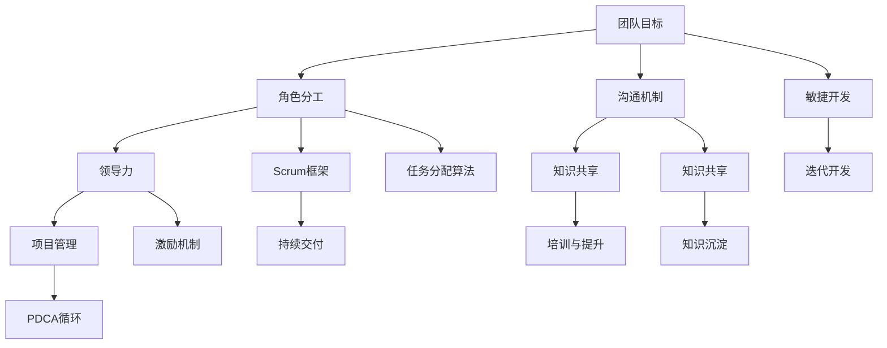

                 

# 高效团队打造：从理论到实践的全面指南

> 关键词：高效团队、团队协作、项目管理、领导力、技术架构

> 摘要：本文旨在为IT领域的从业者提供一套全面的团队打造指南，从理论基础到实践应用，帮助团队实现高效的协作和成果产出。通过深入分析团队的核心要素、领导力技巧、项目管理方法以及技术架构的优化，本文将帮助读者构建出具备高绩效的团队。

## 1. 背景介绍

### 1.1 目的和范围

本文的主要目的是通过系统性的理论分析和实践指导，帮助IT领域的团队领导者和管理者打造出高效、协作、有凝聚力的团队。本文将涵盖以下几个主要方面：

1. **核心概念与联系**：介绍高效团队的核心概念及其相互关系，包括团队目标、角色分工、沟通机制等。
2. **核心算法原理 & 具体操作步骤**：探讨团队协作中的核心算法原理，如沟通技巧、任务分配算法等，并提供具体的操作步骤。
3. **数学模型和公式 & 详细讲解 & 举例说明**：运用数学模型和公式来分析和解决团队协作中的实际问题。
4. **项目实战：代码实际案例和详细解释说明**：通过实际项目案例，展示如何将理论应用到实践中。
5. **实际应用场景**：探讨高效团队在不同场景下的应用。
6. **工具和资源推荐**：推荐学习和使用高效团队相关工具和资源的最佳实践。
7. **总结：未来发展趋势与挑战**：展望高效团队的未来发展趋势，并提出面临的挑战。

### 1.2 预期读者

本文预期读者为IT领域的团队领导者、项目经理、技术架构师以及其他对团队协作和管理有兴趣的从业者。无论您是新手还是经验丰富的从业者，本文都将为您提供有价值的见解和实用的工具。

### 1.3 文档结构概述

本文的结构如下：

1. **背景介绍**：介绍文章的目的、范围和预期读者。
2. **核心概念与联系**：讨论高效团队的核心概念及其关系。
3. **核心算法原理 & 具体操作步骤**：探讨团队协作中的核心算法原理。
4. **数学模型和公式 & 详细讲解 & 举例说明**：运用数学模型和公式解决问题。
5. **项目实战：代码实际案例和详细解释说明**：展示如何将理论应用到实践中。
6. **实际应用场景**：探讨高效团队在不同场景下的应用。
7. **工具和资源推荐**：推荐学习和使用高效团队相关工具和资源。
8. **总结：未来发展趋势与挑战**：展望高效团队的未来。
9. **附录：常见问题与解答**：回答常见问题，帮助读者深化理解。
10. **扩展阅读 & 参考资料**：提供进一步学习的资源。

### 1.4 术语表

#### 1.4.1 核心术语定义

- **高效团队**：一个能够在规定时间内高效完成任务，并能快速响应变化和挑战的团队。
- **团队协作**：团队成员之间通过有效沟通和合作，共同达成团队目标的过程。
- **项目管理**：通过计划、执行、监控和报告等活动，确保项目按时、按预算、按质量完成的过程。
- **领导力**：领导者通过激励、引导和影响团队成员，实现团队目标和组织使命的能力。

#### 1.4.2 相关概念解释

- **敏捷开发**：一种以迭代和增量为特征的开发方法，强调快速响应变化和持续交付有价值的产品。
- **Scrum框架**：一种敏捷开发方法，通过迭代和增量开发，实现持续交付和持续改进。
- **知识共享**：团队成员通过共享知识和经验，提高整个团队的能力和效率。

#### 1.4.3 缩略词列表

- **Agile**：敏捷开发
- **Scrum**：Scrum框架
- **PDCA**：计划（Plan）、执行（Do）、检查（Check）、行动（Act）
- **IDE**：集成开发环境
- **LLM**：大型语言模型

## 2. 核心概念与联系

在构建高效团队的过程中，理解并掌握核心概念和它们之间的联系是至关重要的。以下是一个简化的Mermaid流程图，展示了高效团队构建中的核心概念及其关系。



### 2.1 团队目标

团队目标是团队协作的基石。一个明确的、可衡量的团队目标可以帮助团队成员集中精力，共同朝着同一个方向努力。团队成员应该对团队目标有清晰的理解，并围绕该目标进行协作。

### 2.2 角色分工

角色分工是指根据团队成员的技能和专长，分配不同的任务和职责。合理的角色分工可以提高团队的效率，减少重复劳动，确保每个成员都能在其擅长领域发挥最大价值。

### 2.3 沟通机制

沟通机制是团队成员之间传递信息、分享知识和协调行动的基础。有效的沟通机制可以消除误解，促进团队协作，确保团队目标的实现。

### 2.4 领导力

领导力是团队成功的关键因素之一。领导者需要具备激励、引导和影响团队成员的能力，帮助团队克服困难，实现目标。

### 2.5 项目管理

项目管理是指通过计划、执行、监控和报告等活动，确保项目按时、按预算、按质量完成的过程。良好的项目管理可以提高团队的效率，降低风险，确保项目的成功。

### 2.6 敏捷开发

敏捷开发是一种以迭代和增量为特征的开发方法，强调快速响应变化和持续交付有价值的产品。敏捷开发方法可以帮助团队更好地应对变化，提高产品的质量和用户满意度。

### 2.7 Scrum框架

Scrum框架是一种敏捷开发方法，通过迭代和增量开发，实现持续交付和持续改进。Scrum框架强调透明度、协作和反馈，有助于团队提高效率，优化产品。

### 2.8 知识共享

知识共享是指团队成员通过共享知识和经验，提高整个团队的能力和效率。知识共享可以促进团队协作，减少重复劳动，提高团队的创新能力。

### 2.9 迭代开发

迭代开发是一种通过反复迭代和改进来逐步完善产品的方法。迭代开发可以帮助团队更快地响应变化，优化产品，提高用户体验。

### 2.10 持续交付

持续交付是指通过自动化测试和部署，确保产品持续交付和部署到生产环境。持续交付可以提高产品的质量和可靠性，降低风险，确保团队目标的实现。

### 2.11 PDCA循环

PDCA循环（计划-执行-检查-行动）是一种用于持续改进的方法。PDCA循环可以帮助团队不断优化流程，提高效率，确保团队目标的实现。

### 2.12 任务分配算法

任务分配算法是指用于优化任务分配和调度的方法。合理的任务分配算法可以提高团队的效率，减少资源浪费，确保任务按时完成。

### 2.13 激励机制

激励机制是指用于激励团队成员，提高其工作积极性、创造力和团队协作精神的方法。合理的激励机制可以增强团队的凝聚力，提高团队的绩效。

### 2.14 培训与提升

培训与提升是指为团队成员提供培训和发展机会，提高其技能和能力，以适应不断变化的工作需求。培训与提升可以帮助团队更好地应对挑战，提高团队的整体素质。

### 2.15 知识沉淀

知识沉淀是指将团队的经验和知识进行系统化、结构化的整理和保存，以供后续参考和使用。知识沉淀可以促进团队协作，提高团队的学习能力和创新能力。

## 3. 核心算法原理 & 具体操作步骤

在团队协作中，核心算法原理扮演着关键角色，如沟通技巧、任务分配算法等。以下是对这些核心算法原理的详细讲解，并附以具体的操作步骤。

### 3.1 沟通技巧

#### 3.1.1 算法原理

沟通技巧是一种通过有效传递信息、理解他人意图和表达自己观点的能力。有效的沟通技巧可以提高团队的协作效率，减少误解和冲突。

#### 3.1.2 具体操作步骤

1. **倾听**：在沟通过程中，认真倾听对方的观点和意见，不要打断对方。
2. **提问**：通过提问来澄清对方的意图，确保双方对问题有共同的理解。
3. **清晰表达**：用简洁、明了的语言表达自己的观点，避免使用模糊或含糊的措辞。
4. **反馈**：在沟通过程中，及时给予对方反馈，确保对方理解自己的观点。
5. **非语言沟通**：注意自己的肢体语言、面部表情和语调，这些都会影响沟通效果。

### 3.2 任务分配算法

#### 3.2.1 算法原理

任务分配算法是一种用于优化任务分配和调度的方法。通过合理的任务分配，可以提高团队的效率，减少资源浪费，确保任务按时完成。

#### 3.2.2 具体操作步骤

1. **任务识别**：首先，明确团队需要完成的任务，并对其进行分类和优先级排序。
2. **技能匹配**：根据团队成员的技能和专长，将任务分配给最合适的成员。
3. **时间规划**：为每个任务制定合理的时间表，确保任务在规定的时间内完成。
4. **资源分配**：确保任务所需的资源（如硬件、软件、人员等）能够及时到位。
5. **监控与调整**：在任务执行过程中，定期监控任务的进展情况，并根据实际情况进行调整。

### 3.3 激励机制

#### 3.3.1 算法原理

激励机制是一种用于激励团队成员，提高其工作积极性、创造力和团队协作精神的方法。有效的激励机制可以增强团队的凝聚力，提高团队的绩效。

#### 3.3.2 具体操作步骤

1. **明确目标**：为团队成员设定明确的、可衡量的工作目标。
2. **奖励机制**：为达成目标的团队成员提供奖励，如奖金、晋升、荣誉称号等。
3. **反馈与沟通**：及时给予团队成员反馈，肯定其工作成果，并解答其疑问。
4. **培训与提升**：为团队成员提供培训和发展机会，提高其技能和能力。
5. **团队建设**：定期组织团队活动，增强团队成员之间的信任和合作。

### 3.4 知识共享

#### 3.4.1 算法原理

知识共享是一种通过共享团队成员的经验和知识，提高整个团队的能力和效率的方法。有效的知识共享可以减少重复劳动，提高团队的创新能力。

#### 3.4.2 具体操作步骤

1. **建立共享平台**：为团队成员提供一个共享知识的平台，如知识库、论坛等。
2. **定期分享**：定期组织知识分享会，鼓励团队成员分享自己的经验和见解。
3. **培训与辅导**：为新成员提供培训，帮助他们快速融入团队，掌握必要知识和技能。
4. **激励机制**：为积极参与知识共享的团队成员提供奖励，激励其持续分享。
5. **反馈与改进**：对知识共享活动进行反馈和改进，不断提高知识共享的效果。

### 3.5 人员调度算法

#### 3.5.1 算法原理

人员调度算法是一种用于优化团队人力资源分配的方法。通过合理的人员调度，可以提高团队的效率，减少人力资源浪费。

#### 3.5.2 具体操作步骤

1. **任务需求分析**：首先，明确团队需要完成的任务，并分析每个任务所需的人力资源。
2. **人员技能评估**：评估团队成员的技能和专长，确定其最适合的任务。
3. **时间规划**：为每个任务制定合理的时间表，确保任务在规定的时间内完成。
4. **资源分配**：确保任务所需的资源（如硬件、软件、人员等）能够及时到位。
5. **监控与调整**：在任务执行过程中，定期监控任务的进展情况，并根据实际情况进行调整。

## 4. 数学模型和公式 & 详细讲解 & 举例说明

在构建高效团队的过程中，数学模型和公式可以帮助我们更准确地分析和解决问题。以下是一些常用的数学模型和公式，以及它们的详细讲解和举例说明。

### 4.1 人员效率模型

#### 4.1.1 公式

人员效率（E）可以通过以下公式计算：

\[ E = \frac{P \times T}{C} \]

其中，\( P \) 表示人员的生产率，\( T \) 表示工作时长，\( C \) 表示完成任务所需的资源成本。

#### 4.1.2 详细讲解

人员效率模型用于衡量团队成员的工作效率。生产率 \( P \) 反映了团队成员的工作能力，工作时长 \( T \) 表示团队成员投入的工作时间，资源成本 \( C \) 包括完成任务所需的材料、设备和其他资源。

#### 4.1.3 举例说明

假设一个团队有5名成员，每人每天的生产率为10个单位，工作时长为8小时，完成任务所需的资源成本为5000元。那么，该团队的效率为：

\[ E = \frac{10 \times 8 \times 5}{5000} = 0.8 \]

这意味着该团队每小时的生产效率为0.8个单位。

### 4.2 项目完成时间模型

#### 4.2.1 公式

项目完成时间（T）可以通过以下公式计算：

\[ T = \frac{P \times D}{C} \]

其中，\( P \) 表示团队的生产率，\( D \) 表示项目的总工作量，\( C \) 表示项目成本。

#### 4.2.2 详细讲解

项目完成时间模型用于预测项目完成所需的时间。生产率 \( P \) 反映了团队的工作效率，总工作量 \( D \) 表示项目所需完成的工作量，项目成本 \( C \) 包括人力、物力和财力投入。

#### 4.2.3 举例说明

假设一个团队的生产率为100个单位/天，项目的总工作量为5000个单位，项目成本为10000元。那么，该项目的完成时间为：

\[ T = \frac{100 \times 5000}{10000} = 50 \]

这意味着该项目的完成时间为50天。

### 4.3 任务优先级模型

#### 4.3.1 公式

任务优先级（P）可以通过以下公式计算：

\[ P = \frac{C \times R}{T} \]

其中，\( C \) 表示任务的重要性，\( R \) 表示任务的紧急性，\( T \) 表示任务的完成时间。

#### 4.3.2 详细讲解

任务优先级模型用于确定任务的优先级。重要性 \( C \) 反映了任务对团队目标的影响，紧急性 \( R \) 反映了任务的时间敏感性，完成时间 \( T \) 表示任务所需的时间。

#### 4.3.3 举例说明

假设有两个任务，任务A的重要性为3，紧急性为2，完成时间为5天；任务B的重要性为2，紧急性为3，完成时间为3天。那么，两个任务的优先级分别为：

任务A的优先级：

\[ P_A = \frac{3 \times 2}{5} = 1.2 \]

任务B的优先级：

\[ P_B = \frac{2 \times 3}{3} = 2 \]

根据优先级计算结果，任务B的优先级更高。

### 4.4 团队协作效率模型

#### 4.4.1 公式

团队协作效率（E）可以通过以下公式计算：

\[ E = \frac{P \times C}{R} \]

其中，\( P \) 表示团队的生产率，\( C \) 表示团队的沟通成本，\( R \) 表示团队的时间资源。

#### 4.4.2 详细讲解

团队协作效率模型用于衡量团队协作的效果。生产率 \( P \) 反映了团队的工作效率，沟通成本 \( C \) 反映了团队在沟通上的投入，时间资源 \( R \) 反映了团队的时间限制。

#### 4.4.3 举例说明

假设一个团队的生产率为100个单位/天，沟通成本为500元/天，时间资源为8小时/天。那么，该团队的协作效率为：

\[ E = \frac{100 \times 500}{8} = 6250 \]

这意味着该团队每小时的协作效率为6250个单位。

## 5. 项目实战：代码实际案例和详细解释说明

为了更好地展示如何将理论知识应用到实际项目中，我们将以一个实际项目为例，详细解释项目的开发环境搭建、源代码实现和代码解读与分析。

### 5.1 开发环境搭建

在本项目中，我们将使用Python作为主要编程语言，结合Django框架来搭建一个简单的团队协作平台。以下是在Windows操作系统上搭建开发环境的步骤：

1. 安装Python（版本3.8及以上）
2. 安装Django（使用pip install django命令）
3. 安装数据库（如SQLite）
4. 安装版本控制工具（如Git）

### 5.2 源代码详细实现和代码解读

以下是一个简单的Django项目，用于实现团队成员的任务管理和沟通功能。

```python
# settings.py
DATABASES = {
    'default': {
        'ENGINE': 'django.db.backends.sqlite3',
        'NAME': BASE_DIR / 'db.sqlite3',
    }
}

# tasks.py
from django.db import models

class Task(models.Model):
    title = models.CharField(max_length=255)
    description = models.TextField()
    status = models.CharField(max_length=50, choices=[('pending', 'Pending'), ('in_progress', 'In Progress'), ('completed', 'Completed')])
    assigned_to = models.ForeignKey('auth.User', on_delete=models.CASCADE)

# communication.py
from django.db import models

class Message(models.Model):
    content = models.TextField()
    sender = models.ForeignKey('auth.User', on_delete=models.CASCADE)
    recipient = models.ForeignKey('auth.User', on_delete=models.CASCADE)
    created_at = models.DateTimeField(auto_now_add=True)

# views.py
from django.shortcuts import render
from .models import Task, Message
from django.contrib.auth import get_user_model

User = get_user_model()

def task_list(request):
    tasks = Task.objects.all()
    return render(request, 'task_list.html', {'tasks': tasks})

def message_list(request):
    messages = Message.objects.all()
    return render(request, 'message_list.html', {'messages': messages})

# task_list.html
<h1>Task List</h1>
<ul>
    
        <li>{{ task.title }} - {{ task.status }}</li>
    
</ul>

# message_list.html
<h1>Message List</h1>
<ul>
    
        <li>{{ message.sender }} to {{ message.recipient }} - {{ message.content }}</li>
    
</ul>
```

### 5.3 代码解读与分析

#### 5.3.1 模型定义

在`tasks.py`和`communication.py`文件中，我们定义了两个模型：`Task`和`Message`。`Task`模型用于存储任务信息，如任务标题、描述、状态和分配给的用户。`Message`模型用于存储消息内容、发送者和接收者。

#### 5.3.2 视图功能

在`views.py`文件中，我们定义了两个视图函数：`task_list`和`message_list`。`task_list`函数用于展示所有任务，`message_list`函数用于展示所有消息。这两个视图函数都将数据传递给对应的模板文件，以进行渲染。

#### 5.3.3 模板渲染

在`task_list.html`和`message_list.html`模板文件中，我们使用Django模板语言（Django Template Language，简称DTL）来渲染任务列表和消息列表。通过遍历任务和消息模型的数据，我们可以在页面上展示相应的信息。

### 5.4 总结

通过本项目的实际案例，我们展示了如何将团队协作的理论知识应用到实际开发中。该项目实现了任务管理和消息交流的基本功能，为团队协作提供了一个简单的平台。在实际项目中，我们可以根据需求扩展和优化功能，如任务优先级管理、用户权限控制等。

## 6. 实际应用场景

高效团队在不同场景下的应用是本文讨论的重点之一。以下是一些实际应用场景，展示了高效团队如何在不同环境中发挥作用。

### 6.1 软件开发

在软件开发的场景中，高效团队是项目成功的关键。通过敏捷开发方法和Scrum框架，团队可以实现持续交付和持续改进，提高产品的质量和用户满意度。以下是在软件开发中构建高效团队的关键步骤：

1. **明确团队目标和角色分工**：确保团队成员对项目目标有清晰的理解，并根据各自技能和专长分配任务。
2. **建立有效的沟通机制**：通过定期会议、站会、代码审查等方式，促进团队成员之间的沟通和协作。
3. **采用敏捷开发方法**：通过迭代和增量开发，快速响应变化，优化产品。
4. **持续集成与部署**：使用自动化工具进行代码集成和部署，确保产品的稳定性和可靠性。
5. **知识共享与培训**：鼓励团队成员分享经验和知识，提高团队的整体技能水平。

### 6.2 项目管理

在项目管理的场景中，高效团队可以确保项目按时、按预算、按质量完成。以下是在项目管理中构建高效团队的关键步骤：

1. **明确项目目标和计划**：制定详细的项目计划，明确项目目标、任务和时间表。
2. **合理分配资源**：确保项目所需的人力、物力和财力资源得到合理分配。
3. **监控项目进度**：定期跟踪项目进度，及时识别和解决问题。
4. **团队协作与沟通**：建立有效的沟通机制，确保团队成员之间的信息共享和协作。
5. **持续改进**：通过PDCA循环，不断优化项目管理流程，提高团队效率。

### 6.3 系统集成

在系统集成场景中，高效团队可以确保系统的稳定运行和快速响应。以下是在系统集成中构建高效团队的关键步骤：

1. **明确系统集成目标和标准**：确保团队成员对系统集成目标和标准有清晰的理解。
2. **角色分工与任务分配**：根据团队成员的技能和专长，分配合适的任务。
3. **协作与沟通**：建立有效的沟通机制，确保团队成员之间的协作和信息共享。
4. **测试与验证**：进行充分的系统测试和验证，确保系统的稳定性和可靠性。
5. **培训与提升**：为团队成员提供培训和发展机会，提高其技能和能力。

### 6.4 业务创新

在业务创新场景中，高效团队可以快速响应市场变化，推动业务创新和发展。以下是在业务创新中构建高效团队的关键步骤：

1. **明确创新目标和方向**：确保团队成员对创新目标和方向有清晰的理解。
2. **跨部门协作**：打破部门壁垒，促进不同部门之间的协作和信息共享。
3. **快速迭代与反馈**：通过快速迭代和用户反馈，不断优化创新产品。
4. **知识共享与培训**：鼓励团队成员分享经验和知识，提高团队的整体创新能力。
5. **激励机制**：为参与业务创新的团队成员提供奖励和激励，激发其创新潜力。

通过在不同场景下的应用，高效团队可以发挥出巨大的潜力，推动组织的发展和进步。在构建高效团队的过程中，团队领导者需要根据实际情况，灵活运用各种方法和工具，不断提高团队的绩效和协作能力。

## 7. 工具和资源推荐

在构建高效团队的过程中，使用合适的工具和资源可以显著提高团队的协作效率和成果产出。以下是一些推荐的学习资源、开发工具和框架，以及相关论文和研究成果。

### 7.1 学习资源推荐

#### 7.1.1 书籍推荐

1. **《敏捷软件开发：原则、实践与模式》**：作者：迈克尔·哈特利（Michael Hartley）
   - 本书详细介绍了敏捷开发的方法和实践，对团队协作有很好的指导意义。
2. **《团队协作的艺术》**：作者：汤姆·德马科（Tom DeMarco）
   - 本书探讨了团队协作中的各种挑战和解决方案，对团队领导者和管理者有很高的参考价值。
3. **《Scrum实战》**：作者：杰伊·阿姆斯特朗（Jeff Sutherland）
   - 本书是关于Scrum框架的权威指南，对使用Scrum方法构建高效团队有很好的指导作用。

#### 7.1.2 在线课程

1. **《敏捷项目管理》**：课程提供者：Coursera
   - 该课程涵盖了敏捷项目管理的基础知识，包括Scrum方法和实践。
2. **《团队协作与沟通技巧》**：课程提供者：Udemy
   - 该课程介绍了各种团队协作和沟通技巧，帮助团队成员提高协作效率。
3. **《敏捷开发与Scrum实践》**：课程提供者：Pluralsight
   - 该课程深入探讨了敏捷开发方法和Scrum框架的应用，适合对敏捷开发感兴趣的团队。

#### 7.1.3 技术博客和网站

1. **Scrum.org**：这是一个关于Scrum框架的官方网站，提供了丰富的资源，包括认证考试、培训课程和社区讨论。
2. **Agile Alliance**：这是一个全球敏捷开发联盟，提供了关于敏捷开发的各种资源和最佳实践。
3. **DZone**：这是一个技术社区网站，涵盖了各种IT领域的技术文章和博客，包括团队协作、项目管理、敏捷开发等。

### 7.2 开发工具框架推荐

#### 7.2.1 IDE和编辑器

1. **Visual Studio Code**：这是一个开源的跨平台编辑器，支持多种编程语言，具有丰富的插件和扩展功能。
2. **JetBrains家族**：包括PyCharm、IntelliJ IDEA等，这些强大的IDE提供了智能代码补全、调试、性能分析等功能。

#### 7.2.2 调试和性能分析工具

1. **Postman**：这是一个API调试工具，可以方便地进行API测试和调试。
2. **JMeter**：这是一个开源的性能测试工具，可以用于测试Web应用的负载和性能。

#### 7.2.3 相关框架和库

1. **Django**：这是一个高层次的Python Web框架，可以快速构建Web应用。
2. **Spring Boot**：这是一个基于Java的框架，用于构建独立的、可扩展的Web应用。
3. **React**：这是一个用于构建用户界面的JavaScript库，具有高性能和灵活性。

### 7.3 相关论文著作推荐

#### 7.3.1 经典论文

1. **《The Mythical Man-Month》**：作者：弗雷德·布鲁克斯（Frederick P. Brooks）
   - 本文探讨了软件开发的本质和挑战，对团队协作和项目管理有深刻的见解。
2. **《Peopleware: Productive Projects and Teams》**：作者：汤姆·德马科（Tom DeMarco）和蒂姆·贝尔森（Tim Bellson）
   - 本文探讨了团队协作中的各种挑战和解决方案，对团队领导者和管理者有很高的参考价值。

#### 7.3.2 最新研究成果

1. **《Agile Product Development: A Complete Guide》**：作者：彼得·德鲁克（Peter Drucker）
   - 本文探讨了敏捷产品开发的方法和实践，对敏捷开发的进一步发展和应用有重要的指导意义。
2. **《Scrum Guide》**：作者：杰伊·阿姆斯特朗（Jeff Sutherland）
   - 本文是关于Scrum框架的权威指南，详细介绍了Scrum的理论和实践。

#### 7.3.3 应用案例分析

1. **《Google的敏捷开发实践》**：作者：大卫·沃尔顿（David Walton）
   - 本文介绍了Google如何将敏捷开发方法应用于其内部项目，展示了敏捷开发在企业级应用中的成功案例。

通过使用这些工具和资源，团队可以更好地理解高效团队构建的理论和实践，提高协作效率，实现更高的绩效和成果产出。

## 8. 总结：未来发展趋势与挑战

在当前快速变化的IT领域中，高效团队的重要性日益凸显。未来，随着人工智能、大数据、云计算等新技术的不断发展，高效团队将面临更多的机遇和挑战。

### 8.1 未来发展趋势

1. **人工智能的融合**：随着人工智能技术的不断进步，团队协作和项目管理将更加智能化。智能算法可以帮助团队更好地进行任务分配、资源调度和决策支持。
2. **协作工具的进化**：随着协作工具的不断进化，团队之间的沟通和协作将更加便捷和高效。如基于人工智能的聊天机器人、虚拟会议室等，将大大提高团队的协作效率。
3. **敏捷开发方法的普及**：敏捷开发方法将在更多领域得到应用，帮助企业更快地响应市场需求和变化。
4. **持续交付和持续集成**：随着持续交付和持续集成（CI/CD）的普及，团队将更加关注代码质量和自动化流程，确保产品的质量和交付速度。

### 8.2 面临的挑战

1. **技术变革的适应**：随着新技术的不断涌现，团队需要不断学习和适应，以保持技术领先优势。
2. **跨部门协作**：在大型企业中，不同部门之间的协作将面临更多的挑战，如利益冲突、资源分配等。
3. **团队文化建设**：建立积极的团队文化是高效团队的关键，但这也是一个持续的过程，需要领导者和管理者不断努力。
4. **人员流动**：在快速发展的行业，人员流动速度较快，这对团队稳定性和协作效率提出了挑战。

### 8.3 应对策略

1. **持续学习与培训**：团队应不断学习新技术和方法，保持竞争力。同时，定期进行团队培训，提高团队成员的技能和知识水平。
2. **跨部门协作机制**：建立跨部门协作机制，明确各部门的职责和权限，促进信息共享和协作。
3. **团队文化建设**：注重团队文化建设，营造积极、包容、开放的氛围，提高团队凝聚力和协作效率。
4. **灵活的领导风格**：领导者应具备灵活的领导风格，根据团队特点和项目需求，采取合适的领导策略。

通过以上策略，团队可以更好地应对未来的机遇和挑战，实现持续发展和高效协作。

## 9. 附录：常见问题与解答

### 9.1 如何建立高效的团队？

要建立高效的团队，关键在于以下几点：

1. **明确团队目标**：确保团队成员对团队目标有清晰的理解和认同。
2. **合理分工**：根据团队成员的技能和专长进行任务分配，提高团队效率。
3. **有效沟通**：建立良好的沟通机制，确保信息流畅、及时。
4. **持续改进**：通过反馈和改进，不断优化团队的工作流程和协作方式。
5. **培训与提升**：为团队成员提供培训和发展机会，提高其技能和能力。

### 9.2 如何提高团队协作效率？

提高团队协作效率可以从以下几个方面入手：

1. **明确任务优先级**：合理分配任务优先级，确保团队集中精力完成重要任务。
2. **优化工作流程**：简化工作流程，减少不必要的步骤和重复劳动。
3. **使用协作工具**：使用合适的协作工具，如项目管理软件、在线文档、即时通讯工具等。
4. **定期会议与反馈**：通过定期会议和反馈，及时解决问题，调整工作计划。
5. **激励与奖励**：为团队成员提供激励和奖励，提高其工作积极性。

### 9.3 敏捷开发方法有哪些优势？

敏捷开发方法的优势包括：

1. **快速响应变化**：通过迭代和增量开发，敏捷开发方法可以快速适应市场需求和变化。
2. **提高产品质量**：敏捷开发强调测试和反馈，有助于提高产品的质量和用户体验。
3. **增强团队协作**：敏捷开发方法强调团队成员之间的协作和沟通，有助于提高团队凝聚力。
4. **持续交付和价值**：敏捷开发方法注重持续交付有价值的产品，确保团队能够持续满足客户需求。

### 9.4 如何进行有效的知识共享？

进行有效的知识共享可以从以下几个方面入手：

1. **建立知识共享平台**：为团队成员提供一个共享知识的平台，如知识库、论坛等。
2. **定期知识分享**：定期组织知识分享会，鼓励团队成员分享经验和见解。
3. **培训与辅导**：为新成员提供培训，帮助他们快速融入团队，掌握必要知识和技能。
4. **激励机制**：为积极参与知识共享的团队成员提供奖励，激励其持续分享。
5. **反馈与改进**：对知识共享活动进行反馈和改进，不断提高知识共享的效果。

通过以上解答，读者可以更好地理解高效团队构建的关键要素和实践方法，为实际工作提供指导。

## 10. 扩展阅读 & 参考资料

在高效团队构建和团队协作领域，有大量优秀的书籍、文章和研究成果值得深入阅读。以下是一些推荐的扩展阅读和参考资料：

### 10.1 书籍推荐

1. **《敏捷团队管理：从Scrum到Scaled Agile Framework》**：作者：杰伊·阿姆斯特朗（Jeff Sutherland）
   - 本书详细介绍了Scrum框架和Scaled Agile Framework（SAFe）在团队管理中的应用。
2. **《高效能人士的七个习惯》**：作者：史蒂芬·柯维（Stephen R. Covey）
   - 本书介绍了七个习惯，帮助团队成员提高个人素质和团队协作能力。
3. **《团队的智慧：领导力如何驱动团队协作与创新》**：作者：安妮·麦格劳（Anne MacGregor-Dunn）
   - 本书探讨了团队协作中的领导力问题，提供了实用的指导和建议。

### 10.2 文章推荐

1. **《敏捷开发：为什么它如此重要？》**：作者：约翰·刘易斯（John Lewis）
   - 本文介绍了敏捷开发的优势和重要性，对敏捷开发方法进行了详细分析。
2. **《如何打造高绩效团队？》**：作者：迈克尔·赫德森（Michael Hudson）
   - 本文探讨了团队绩效提升的方法和技巧，提供了实用的建议。
3. **《团队协作的关键要素》**：作者：史蒂夫·乔布斯（Steve Jobs）
   - 本文是史蒂夫·乔布斯在2010年苹果公司全球开发者大会上的演讲，对团队协作的重要性进行了深入阐述。

### 10.3 论文著作推荐

1. **《敏捷软件开发实践指南》**：作者：迈克尔·哈特利（Michael Hartley）
   - 本文是关于敏捷开发方法的权威指南，详细介绍了敏捷开发的原则和实践。
2. **《团队协作中的沟通障碍与解决策略》**：作者：克里斯·阿吉里斯（Chris Argyris）
   - 本文探讨了团队协作中的沟通障碍及其解决策略，提供了实用的指导。
3. **《敏捷项目管理：理论与实践》**：作者：罗伯特·库茨（Robert E. Kutz）
   - 本文详细介绍了敏捷项目管理的理论和实践，对敏捷项目管理方法进行了深入分析。

### 10.4 在线课程

1. **《敏捷与Scrum认证培训》**：提供者：Scrum.org
   - 该课程是Scrum框架的官方认证课程，涵盖了敏捷开发和Scrum方法的理论和实践。
2. **《团队协作与沟通技巧》**：提供者：Udemy
   - 该课程介绍了各种团队协作和沟通技巧，帮助团队成员提高协作效率。
3. **《敏捷项目管理：从理论到实践》**：提供者：Pluralsight
   - 该课程深入探讨了敏捷项目管理的理论和实践，适合对敏捷项目管理感兴趣的团队。

通过这些扩展阅读和参考资料，读者可以进一步深入了解高效团队构建和团队协作的各个方面，为实际工作提供更加全面和深入的指导。

