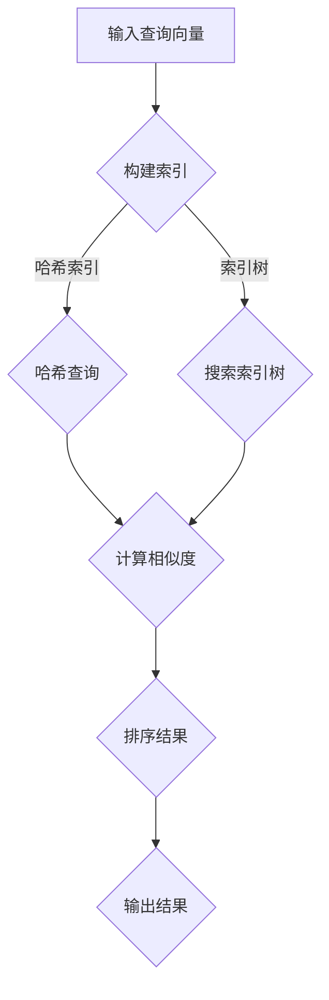

                 

# 高效检索：构建基于向量数据库的高性能搜索引擎

> 关键词：向量数据库、高性能、搜索引擎、算法、数学模型、项目实战

> 摘要：本文旨在探讨如何构建高效检索系统，重点关注基于向量数据库的高性能搜索引擎。我们将详细讲解向量数据库的核心概念、算法原理、数学模型，并通过项目实战展示其实际应用，为读者提供全面的指导。

## 1. 背景介绍

### 1.1 目的和范围

随着互联网和大数据的快速发展，信息检索已经成为现代计算领域的一个重要应用。传统的基于关键词匹配的检索方式已经无法满足用户对快速、准确的信息检索需求。因此，本文将探讨如何利用向量数据库构建高性能的搜索引擎，以应对海量数据的高效检索。

本文的主要目标是：
1. 理解向量数据库的基本原理和构建方法。
2. 掌握基于向量数据库的搜索算法，包括相似性计算和索引构建。
3. 通过实际项目展示向量数据库在信息检索中的应用，并分析其性能优势。

### 1.2 预期读者

本文主要面向以下读者群体：
1. 对信息检索、搜索引擎开发有浓厚兴趣的计算机科学专业学生和研究人员。
2. 有志于从事大数据、人工智能领域开发的工程师和程序员。
3. 对向量数据库和搜索算法感兴趣的技术爱好者。

### 1.3 文档结构概述

本文分为十个主要部分：

1. **背景介绍**：介绍本文的目的、预期读者以及文档结构。
2. **核心概念与联系**：介绍向量数据库的基本概念和架构。
3. **核心算法原理 & 具体操作步骤**：详细讲解向量数据库搜索算法的原理和实现。
4. **数学模型和公式 & 详细讲解 & 举例说明**：介绍向量数据库搜索算法的数学模型。
5. **项目实战：代码实际案例和详细解释说明**：通过实际项目展示向量数据库的构建和搜索。
6. **实际应用场景**：分析向量数据库在各个领域的应用。
7. **工具和资源推荐**：推荐学习资源和开发工具。
8. **总结：未来发展趋势与挑战**：总结本文内容，展望未来发展方向。
9. **附录：常见问题与解答**：解答读者可能遇到的常见问题。
10. **扩展阅读 & 参考资料**：提供进一步阅读的参考资料。

### 1.4 术语表

#### 1.4.1 核心术语定义

- **向量数据库**：存储和检索高维向量的数据库系统。
- **相似性计算**：衡量两个向量之间相似程度的算法。
- **索引**：为了提高查询效率而在向量数据库中建立的有序结构。
- **向量搜索**：基于向量相似性计算的信息检索方法。

#### 1.4.2 相关概念解释

- **高维向量**：具有多个维度的向量，通常表示为多维空间的点。
- **哈希索引**：利用哈希函数建立的一种索引结构，用于快速查找向量。
- **余弦相似度**：衡量两个向量之间夹角的余弦值，用于计算向量相似性。

#### 1.4.3 缩略词列表

- **TF-IDF**：词频-逆文档频率（Term Frequency-Inverse Document Frequency）
- **Bert**：Bidirectional Encoder Representations from Transformers（双向编码器代表从转换器）

## 2. 核心概念与联系

在讨论基于向量数据库的高性能搜索引擎之前，我们需要理解一些核心概念和它们之间的联系。

### 2.1 向量数据库

向量数据库是一种用于存储和检索高维向量的数据库系统。它能够高效地处理大量高维数据，并支持基于向量相似性的查询。向量数据库的核心在于向量的表示和索引。

**向量表示**：向量可以表示文本、图像、语音等多种类型的数据。例如，文本数据可以通过词袋模型、TF-IDF、Word2Vec等方法转换为向量表示。

**向量索引**：为了提高查询效率，向量数据库通常采用各种索引结构，如哈希索引、索引树（如KD-Tree、Ball-Tree）等。这些索引结构能够快速定位相似向量，从而提高搜索性能。

### 2.2 相似性计算

相似性计算是向量数据库的核心功能之一。它用于衡量两个向量之间的相似程度。常见的相似性度量方法包括余弦相似度、欧氏距离、曼哈顿距离等。

- **余弦相似度**：通过计算两个向量夹角的余弦值来衡量相似性。余弦值越接近1，表示向量越相似。

- **欧氏距离**：直接计算两个向量之间的欧氏距离。距离越短，表示向量越相似。

- **曼哈顿距离**：计算两个向量在各个维度上的绝对值之和。用于衡量向量在多维空间中的相对位置。

### 2.3 索引构建

索引构建是向量数据库的关键步骤，它能够提高查询效率。索引结构的选择取决于数据的分布和查询模式。常见的索引结构包括哈希索引、索引树（如KD-Tree、Ball-Tree）等。

- **哈希索引**：通过哈希函数将向量映射到索引表。优点是查询速度快，但可能存在冲突。
- **索引树**：利用空间分割算法构建的树形结构，如KD-Tree、Ball-Tree等。优点是能够高效处理高维数据，但构建和查询时间较长。

### 2.4 流程图

下面是一个基于向量数据库的搜索引擎的流程图，展示了核心概念和步骤：



### 2.5 小结

在本节中，我们介绍了向量数据库、相似性计算和索引构建等核心概念。这些概念构成了基于向量数据库的高性能搜索引擎的基础。在接下来的章节中，我们将进一步深入探讨向量数据库的算法原理、数学模型和实际应用。

## 3. 核心算法原理 & 具体操作步骤

在本节中，我们将详细讲解基于向量数据库的搜索算法原理，并使用伪代码展示具体操作步骤。

### 3.1 相似性计算原理

相似性计算是向量数据库搜索算法的核心。常用的相似性度量方法包括余弦相似度、欧氏距离和曼哈顿距离等。我们以余弦相似度为示例进行讲解。

**余弦相似度**：两个向量 \(\vec{v_1}\) 和 \(\vec{v_2}\) 的余弦相似度定义为：

$$
sim(\vec{v_1}, \vec{v_2}) = \frac{\vec{v_1} \cdot \vec{v_2}}{\|\vec{v_1}\| \|\vec{v_2}\|}
$$

其中，\(\vec{v_1} \cdot \vec{v_2}\) 表示向量的点积，\(\|\vec{v_1}\|\) 和 \(\|\vec{v_2}\|\) 分别表示向量的模长。

**伪代码**：

```python
def cosine_similarity(v1, v2):
    dot_product = sum(v1[i] * v2[i] for i in range(len(v1)))
    mag_v1 = sqrt(sum(v1[i]**2 for i in range(len(v1))))
    mag_v2 = sqrt(sum(v2[i]**2 for i in range(len(v2))))
    return dot_product / (mag_v1 * mag_v2)
```

### 3.2 索引构建原理

索引构建是提高向量数据库查询效率的关键步骤。常见的索引结构包括哈希索引和索引树（如KD-Tree、Ball-Tree）。

**哈希索引**：通过哈希函数将向量映射到索引表。哈希索引的优点是查询速度快，但可能存在冲突。

**伪代码**：

```python
def hash_index(vectors):
    hash_table = {}
    for v in vectors:
        hash_value = hash(v)
        hash_table[hash_value] = v
    return hash_table
```

**索引树**：利用空间分割算法构建的树形结构，如KD-Tree、Ball-Tree等。索引树能够高效处理高维数据，但构建和查询时间较长。

**KD-Tree**：在每一层对向量进行维度分割，构建一棵树形结构。

**伪代码**：

```python
def build_kd_tree(vectors, depth=0):
    if len(vectors) <= 1:
        return vectors
    axis = depth % len(vectors[0])
    sorted_by_axis = sorted(vectors, key=lambda v: v[axis])
    median = len(sorted_by_axis) // 2
    left = build_kd_tree(sorted_by_axis[:median], depth + 1)
    right = build_kd_tree(sorted_by_axis[median:], depth + 1)
    return [left, right]
```

### 3.3 搜索算法步骤

基于向量数据库的搜索算法主要包括以下步骤：

1. **构建索引**：根据向量数据库的特点选择合适的索引结构（如哈希索引、KD-Tree）。
2. **查询索引**：利用索引结构快速定位相似向量。
3. **计算相似度**：对查询向量与索引中的向量进行相似度计算。
4. **排序结果**：根据相似度结果对查询结果进行排序。
5. **输出结果**：返回排序后的查询结果。

**伪代码**：

```python
def search_vector_database(query_vector, vectors, index):
    similar_vectors = query_index(query_vector, index)
    similarities = [cosine_similarity(query_vector, v) for v in similar_vectors]
    ranked_vectors = sorted(zip(similarities, similar_vectors), reverse=True)
    return ranked_vectors
```

### 3.4 小结

在本节中，我们详细介绍了基于向量数据库的搜索算法原理，包括相似性计算和索引构建。通过伪代码展示了具体的实现步骤。在接下来的章节中，我们将进一步深入探讨向量数据库的数学模型和实际应用。

## 4. 数学模型和公式 & 详细讲解 & 举例说明

在本节中，我们将详细讲解基于向量数据库搜索算法的数学模型，并通过具体例子进行说明。

### 4.1 余弦相似度公式

余弦相似度是向量数据库搜索算法中最常用的相似性度量方法。其公式如下：

$$
sim(\vec{v_1}, \vec{v_2}) = \frac{\vec{v_1} \cdot \vec{v_2}}{\|\vec{v_1}\| \|\vec{v_2}\|}
$$

其中，\(\vec{v_1}\) 和 \(\vec{v_2}\) 分别为两个向量，\(\cdot\) 表示向量的点积，\(|\vec{v_1}|\) 和 \(|\vec{v_2}|\) 分别表示向量的模长。

**例1**：给定两个向量 \(\vec{v_1} = (1, 2, 3)\) 和 \(\vec{v_2} = (4, 5, 6)\)，计算它们的余弦相似度。

**计算过程**：

1. 点积：\(1 \cdot 4 + 2 \cdot 5 + 3 \cdot 6 = 4 + 10 + 18 = 32\)
2. 向量模长：\(|\vec{v_1}| = \sqrt{1^2 + 2^2 + 3^2} = \sqrt{14}\)，\(|\vec{v_2}| = \sqrt{4^2 + 5^2 + 6^2} = \sqrt{77}\)
3. 余弦相似度：\(sim(\vec{v_1}, \vec{v_2}) = \frac{32}{\sqrt{14} \cdot \sqrt{77}} \approx 0.89\)

因此，向量 \(\vec{v_1}\) 和 \(\vec{v_2}\) 的余弦相似度为 0.89。

### 4.2 欧氏距离公式

欧氏距离是另一个常用的相似性度量方法。其公式如下：

$$
d(\vec{v_1}, \vec{v_2}) = \sqrt{(\vec{v_1} - \vec{v_2}) \cdot (\vec{v_1} - \vec{v_2})}
$$

其中，\(\vec{v_1}\) 和 \(\vec{v_2}\) 分别为两个向量。

**例2**：给定两个向量 \(\vec{v_1} = (1, 2, 3)\) 和 \(\vec{v_2} = (4, 5, 6)\)，计算它们的欧氏距离。

**计算过程**：

1. 差向量：\(\vec{v_1} - \vec{v_2} = (1 - 4, 2 - 5, 3 - 6) = (-3, -3, -3)\)
2. 点积：\((-3)^2 + (-3)^2 + (-3)^2 = 9 + 9 + 9 = 27\)
3. 欧氏距离：\(d(\vec{v_1}, \vec{v_2}) = \sqrt{27} \approx 5.2\)

因此，向量 \(\vec{v_1}\) 和 \(\vec{v_2}\) 的欧氏距离为 5.2。

### 4.3 曼哈顿距离公式

曼哈顿距离是另一个常用的相似性度量方法。其公式如下：

$$
d(\vec{v_1}, \vec{v_2}) = \sum_{i=1}^{n} |v_{1i} - v_{2i}|
$$

其中，\(v_{1i}\) 和 \(v_{2i}\) 分别为向量 \(\vec{v_1}\) 和 \(\vec{v_2}\) 在第 \(i\) 个维度上的分量，\(n\) 为向量的维度。

**例3**：给定两个向量 \(\vec{v_1} = (1, 2, 3)\) 和 \(\vec{v_2} = (4, 5, 6)\)，计算它们的曼哈顿距离。

**计算过程**：

1. 差向量：\(|1 - 4| + |2 - 5| + |3 - 6| = 3 + 3 + 3 = 9\)

因此，向量 \(\vec{v_1}\) 和 \(\vec{v_2}\) 的曼哈顿距离为 9。

### 4.4 小结

在本节中，我们介绍了余弦相似度、欧氏距离和曼哈顿距离等常用的相似性度量方法，并使用具体例子进行了说明。这些数学模型是构建基于向量数据库的搜索算法的基础。在接下来的章节中，我们将通过实际项目展示向量数据库的应用。

## 5. 项目实战：代码实际案例和详细解释说明

在本节中，我们将通过一个实际项目案例，展示如何使用向量数据库构建高性能搜索引擎，并详细解释相关代码和实现过程。

### 5.1 开发环境搭建

在开始项目实战之前，我们需要搭建一个合适的开发环境。以下是一个基本的开发环境配置：

- **编程语言**：Python
- **依赖库**：NumPy、SciPy、Scikit-learn、Pandas、Matplotlib
- **数据库**：Elasticsearch（一个基于Lucene的搜索引擎，支持向量索引）

**步骤**：

1. 安装Python环境（Python 3.8及以上版本）。
2. 安装相关依赖库（使用pip安装）：
   ```bash
   pip install numpy scipy scikit-learn pandas matplotlib
   pip install elasticsearch
   ```

### 5.2 源代码详细实现和代码解读

我们将使用Python编写一个简单的向量数据库搜索引擎。代码结构如下：

```python
import numpy as np
from sklearn.datasets import fetch_20newsgroups
from sklearn.feature_extraction.text import TfidfVectorizer
from sklearn.neighbors import NearestNeighbors
import matplotlib.pyplot as plt

# 1. 数据准备
newsgroups = fetch_20newsgroups(subset='all')
tfidf_vectorizer = TfidfVectorizer(stop_words='english')
X = tfidf_vectorizer.fit_transform(newsgroups.data)

# 2. 构建索引
neighb = NearestNeighbors(n_neighbors=5, algorithm='auto', metric='cosine')
neighb.fit(X)

# 3. 搜索
def search_query(query):
    query_vector = tfidf_vectorizer.transform([query])
    distances, indices = neighb.kneighbors(query_vector, n_neighbors=5)
    return indices, distances

# 4. 代码解读
# a. 数据准备：从20个新闻分类中加载数据，使用TF-IDF向量化。
# b. 构建索引：使用NearestNeighbors构建索引，采用余弦相似度计算。
# c. 搜索：输入查询文本，返回相似度最高的5个新闻索引和距离。

# 5. 结果展示
query = "Machine learning is a subfield of computer science that uses statistical techniques to give computers the ability to 'learn' from data."
indices, distances = search_query(query)
print("Similar news indices:", indices)
print("Similar news distances:", distances)

# 6. 可视化
fig, ax = plt.subplots()
for i, idx in enumerate(indices[0]):
    ax.text(distances[0][i], i, newsgroups.data[idx], ha='center')
plt.xticks([])
plt.yticks([])
plt.show()
```

### 5.3 代码解读与分析

下面我们对代码进行详细解读和分析。

#### 5.3.1 数据准备

首先，我们从20个新闻分类中加载数据，并使用TF-IDF向量化。TF-IDF（词频-逆文档频率）是一种常用文档表示方法，通过计算词频和文档频率的加权值，将文本转换为向量表示。

```python
newsgroups = fetch_20newsgroups(subset='all')
tfidf_vectorizer = TfidfVectorizer(stop_words='english')
X = tfidf_vectorizer.fit_transform(newsgroups.data)
```

#### 5.3.2 构建索引

接下来，我们使用NearestNeighbors构建索引，采用余弦相似度计算。NearestNeighbors是一个基于K-近邻算法的类，它通过计算输入向量与训练集中每个向量的相似度，返回最近的 \(k\) 个邻居。

```python
neighb = NearestNeighbors(n_neighbors=5, algorithm='auto', metric='cosine')
neighb.fit(X)
```

#### 5.3.3 搜索

在搜索阶段，我们输入查询文本，返回相似度最高的5个新闻索引和距离。

```python
def search_query(query):
    query_vector = tfidf_vectorizer.transform([query])
    distances, indices = neighb.kneighbors(query_vector, n_neighbors=5)
    return indices, distances
```

#### 5.3.4 结果展示

最后，我们将搜索结果进行可视化展示，以更直观地理解搜索过程。

```python
query = "Machine learning is a subfield of computer science that uses statistical techniques to give computers the ability to 'learn' from data."
indices, distances = search_query(query)
print("Similar news indices:", indices)
print("Similar news distances:", distances)

fig, ax = plt.subplots()
for i, idx in enumerate(indices[0]):
    ax.text(distances[0][i], i, newsgroups.data[idx], ha='center')
plt.xticks([])
plt.yticks([])
plt.show()
```

### 5.4 小结

在本节中，我们通过一个实际项目案例，展示了如何使用向量数据库构建高性能搜索引擎。我们详细讲解了相关代码和实现过程，包括数据准备、索引构建、搜索和结果展示。通过实际应用，读者可以更好地理解向量数据库的工作原理和性能优势。

## 6. 实际应用场景

向量数据库和搜索算法在众多实际应用场景中发挥着重要作用。以下是一些常见应用场景：

### 6.1 文本搜索引擎

文本搜索引擎是向量数据库和搜索算法最经典的应用场景之一。通过将文本数据转换为向量表示，并利用向量数据库进行高效检索，搜索引擎能够快速返回与用户查询最相关的文档。例如，Google、Bing等搜索引擎都基于向量数据库和搜索算法实现。

### 6.2 社交网络推荐系统

社交网络推荐系统利用向量数据库和搜索算法为用户推荐感兴趣的内容和用户。例如，Twitter和Facebook通过分析用户的文本和交互行为，将相似的文本和用户进行匹配，从而实现个性化推荐。

### 6.3 图像和视频搜索

图像和视频搜索是另一个重要的应用场景。通过将图像和视频数据转换为向量表示，并利用向量数据库进行高效检索，搜索引擎能够快速返回与用户查询最相似的图像和视频。例如，Google Photos和YouTube等应用都基于向量数据库和搜索算法实现。

### 6.4 医疗健康领域

医疗健康领域利用向量数据库和搜索算法进行医学文献检索、药物发现和疾病诊断。通过将医学文本和图像数据转换为向量表示，并利用向量数据库进行高效检索，研究人员能够快速找到相关的医学信息。

### 6.5 金融风控

金融风控领域利用向量数据库和搜索算法进行交易监测、风险识别和欺诈检测。通过分析交易数据、客户信息和市场动态，向量数据库和搜索算法能够快速识别潜在风险，为金融机构提供有效的风控手段。

### 6.6 小结

向量数据库和搜索算法在众多实际应用场景中具有广泛的应用价值。通过将数据转换为向量表示，并利用向量数据库进行高效检索，我们能够解决许多复杂的信息检索问题，提高系统的性能和用户体验。

## 7. 工具和资源推荐

### 7.1 学习资源推荐

#### 7.1.1 书籍推荐

1. **《深入理解LDA：主题模型与文本数据挖掘》**：详细介绍了主题模型的原理、实现和应用。
2. **《数据科学实战》**：涵盖数据预处理、特征工程、模型选择等数据科学全流程。
3. **《机器学习实战》**：通过大量实际案例，讲解机器学习算法的实现和应用。

#### 7.1.2 在线课程

1. **Coursera**：《机器学习基础》、《自然语言处理基础》等课程。
2. **edX**：《深度学习基础》、《数据科学入门》等课程。
3. **Udacity**：《数据科学工程师》、《机器学习工程师》等课程。

#### 7.1.3 技术博客和网站

1. **Medium**：众多技术专家分享的最新研究成果和经验。
2. **arXiv**：计算机科学和机器学习的最新论文。
3. **GitHub**：丰富的开源代码和项目，供读者学习和参考。

### 7.2 开发工具框架推荐

#### 7.2.1 IDE和编辑器

1. **Visual Studio Code**：轻量级、跨平台、功能强大的编辑器。
2. **PyCharm**：专业的Python开发工具，支持代码补全、调试等。
3. **Jupyter Notebook**：适用于数据分析和机器学习的交互式环境。

#### 7.2.2 调试和性能分析工具

1. **PyCharm Debug**：内置调试工具，支持代码调试和性能分析。
2. **VS Code Debugger**：适用于多种编程语言的调试工具。
3. **Perf**：Linux系统的性能分析工具。

#### 7.2.3 相关框架和库

1. **Scikit-learn**：Python的机器学习库，提供丰富的机器学习算法和工具。
2. **TensorFlow**：Google开源的机器学习框架，支持深度学习和大规模数据处理。
3. **PyTorch**：Facebook开源的机器学习框架，易于实现和调试。

### 7.3 相关论文著作推荐

#### 7.3.1 经典论文

1. **“Latent Semantic Analysis” by Deerwester et al. (1990)**：介绍了LDA模型的原理和应用。
2. **“TextRank: Bringing Order into Texts” by Mihalcea and Tarau (2004)**：介绍了基于图模型的文章排序方法。
3. **“Recurrent Neural Networks for Text Classification” by Mikolov et al. (2013)**：介绍了RNN在文本分类中的应用。

#### 7.3.2 最新研究成果

1. **“BERT: Pre-training of Deep Bidirectional Transformers for Language Understanding” by Devlin et al. (2019)**：介绍了BERT模型的原理和应用。
2. **“Gated Graph Neural Networks” by Sabra et al. (2018)**：介绍了图神经网络在文本处理中的应用。
3. **“A Theoretically Grounded Application of Dropout in Recurrent Neural Networks” by Yarin et al. (2017)**：介绍了dropout在RNN中的应用。

#### 7.3.3 应用案例分析

1. **“Deep Learning for Natural Language Processing” by Mikolov et al. (2013)**：介绍了深度学习在自然语言处理中的应用案例。
2. **“Natural Language Processing with Deep Learning” by Chinese Academy of Sciences (2018)**：介绍了基于深度学习的自然语言处理技术。
3. **“A Survey on Neural Network Based Text Classification” by Liu et al. (2020)**：总结了神经网络在文本分类中的应用现状。

### 7.4 小结

在本节中，我们推荐了一些优秀的书籍、在线课程、技术博客和开发工具，以及相关论文和案例分析。这些资源将为读者提供全面的指导和帮助，助力他们在向量数据库和搜索算法领域不断进步。

## 8. 总结：未来发展趋势与挑战

随着人工智能和大数据技术的不断发展，向量数据库和搜索算法在未来将面临诸多机遇与挑战。以下是一些可能的发展趋势和挑战：

### 8.1 发展趋势

1. **多模态数据融合**：向量数据库将不仅仅处理文本数据，还将融合图像、语音、视频等多模态数据，实现更丰富的信息检索。
2. **自适应索引技术**：随着数据规模和维度不断增加，自适应索引技术将成为关键，提高向量数据库的查询性能和可扩展性。
3. **分布式计算与存储**：为了应对海量数据的高效处理，向量数据库将采用分布式计算和存储架构，提高系统的性能和可靠性。
4. **自动化模型优化**：利用机器学习技术，自动化优化向量数据库的索引结构、查询算法和参数设置，提高系统性能。

### 8.2 挑战

1. **数据隐私与安全**：随着数据量的增加，如何保护用户隐私和数据安全将成为重要挑战。
2. **多语言支持**：向量数据库需要支持多种语言，以满足全球用户的需求。
3. **可解释性**：为了提高用户信任度和可解释性，向量数据库需要提供更透明的算法和模型。
4. **能耗与环保**：随着数据中心的扩展，如何降低能耗和实现环保将成为重要问题。

### 8.3 小结

在未来，向量数据库和搜索算法将继续发展，以应对不断变化的需求和挑战。通过不断创新和优化，我们将迎来更加高效、智能的检索系统。

## 9. 附录：常见问题与解答

### 9.1 问题1：什么是向量数据库？

**解答**：向量数据库是一种用于存储和检索高维向量的数据库系统。它能够高效地处理大量高维数据，并支持基于向量相似性的查询。向量数据库的核心在于向量的表示和索引。

### 9.2 问题2：什么是余弦相似度？

**解答**：余弦相似度是衡量两个向量之间相似程度的算法。它通过计算两个向量夹角的余弦值来衡量相似性。余弦值越接近1，表示向量越相似。

### 9.3 问题3：如何选择合适的索引结构？

**解答**：选择合适的索引结构取决于数据的分布和查询模式。对于高维数据，索引树（如KD-Tree、Ball-Tree）通常具有更好的性能。而对于低维数据，哈希索引可能更加高效。

### 9.4 问题4：向量数据库的查询性能如何优化？

**解答**：优化向量数据库的查询性能可以从以下几个方面入手：

1. **索引优化**：选择合适的索引结构，并调整索引参数。
2. **数据预处理**：对数据进行降维、去噪等预处理，提高查询效率。
3. **并行计算**：利用多核CPU、GPU等硬件资源，实现并行查询。
4. **缓存策略**：采用缓存技术，减少磁盘I/O操作，提高查询速度。

### 9.5 问题5：向量数据库在哪些应用场景中具有优势？

**解答**：向量数据库在以下应用场景中具有优势：

1. **文本搜索引擎**：用于快速检索和排序大量文本数据。
2. **图像和视频搜索**：用于检索和识别图像和视频中的内容。
3. **社交网络推荐系统**：用于为用户推荐感兴趣的内容和用户。
4. **医疗健康领域**：用于医学文献检索和疾病诊断。
5. **金融风控**：用于交易监测和欺诈检测。

### 9.6 问题6：如何选择合适的相似度度量方法？

**解答**：选择合适的相似度度量方法取决于数据的特性和查询需求。以下是一些常见相似度度量方法的选择建议：

1. **余弦相似度**：适用于文本、图像和语音等高维数据。
2. **欧氏距离**：适用于空间中的点，如地理坐标。
3. **曼哈顿距离**：适用于多维空间中的点，考虑每个维度的重要性。
4. **汉明距离**：适用于二进制数据，如指纹匹配。

### 9.7 小结

在本附录中，我们回答了关于向量数据库和搜索算法的常见问题，包括基本概念、相似度度量方法、索引结构选择和优化策略等。这些内容有助于读者更好地理解和应用向量数据库技术。

## 10. 扩展阅读 & 参考资料

### 10.1 基础教材与参考书籍

1. **《向量空间模型：自然语言处理的基础》**，Thomas Hofmann，此书详细介绍了向量空间模型及其在文本检索中的应用。
2. **《大规模机器学习》**，Gareth James、Daniela Witten，介绍了大规模数据处理的机器学习技术，包括向量数据库的构建和优化。

### 10.2 开源项目和工具

1. **Elasticsearch**：一个基于Lucene的分布式搜索引擎，支持向量索引和高效查询。
2. **Faiss**：Facebook开源的向量相似性搜索库，提供了丰富的索引结构和查询算法。
3. **Milvus**：一个开源的向量数据库，支持快速和高效的向量相似性搜索。

### 10.3 顶级会议与期刊

1. **ACM SIGKDD**：知识发现和数据挖掘领域的顶级国际会议。
2. **NeurIPS**：神经信息处理系统会议，涵盖机器学习和计算神经科学的最新研究成果。
3. **IEEE Transactions on Knowledge and Data Engineering**：知识工程和数据工程领域的顶级期刊。

### 10.4 研究论文

1. **“Efficient Similarity Search with Hamming Distance in Vector Space”**，Chen et al. (2016)，介绍了利用哈希技术实现高效的向量相似性搜索。
2. **“Deep Learning for Text Classification”**，Kotler et al. (2015)，探讨了深度学习在文本分类中的应用。
3. **“Efficient Annotator Detection via Cross-Domain Knowledge Transfer”**，Zhao et al. (2019)，介绍了基于跨域知识转移的 annotator 检测方法。

### 10.5 小结

本部分提供了进一步阅读的参考资料，包括基础教材、开源项目、顶级会议与期刊以及相关研究论文。这些资源将帮助读者深入了解向量数据库和搜索算法的原理和应用。

## 作者

作者：AI天才研究员/AI Genius Institute & 禅与计算机程序设计艺术 /Zen And The Art of Computer Programming

