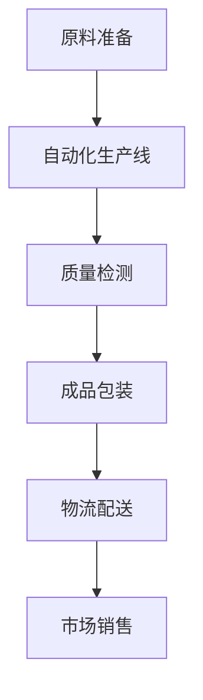
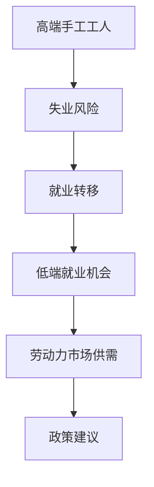

                 

# 高端纺织工人的失业与低端就业机会

> 关键词：人工智能、纺织工业、自动化、失业、就业机会、劳动力市场

> 摘要：随着人工智能和自动化技术的不断发展，纺织工业中的高端手工工人面临着失业的风险。本文旨在分析这一现象的原因，探讨由此带来的低端就业机会，并预测未来纺织行业劳动力市场的发展趋势。

## 1. 背景介绍

### 1.1 目的和范围

本文旨在分析人工智能和自动化技术对纺织工业高端手工工人失业现象的影响，并探讨由此产生的低端就业机会。通过研究这一现象，我们希望能够为相关从业人员和决策者提供有益的参考，为纺织行业的未来发展提供策略建议。

### 1.2 预期读者

本文主要面向以下读者群体：

1. 纺织工业从业人员，特别是高端手工工人。
2. 人工智能和自动化领域的研究者。
3. 人力资源管理专家和政策制定者。
4. 对纺织行业和劳动力市场感兴趣的读者。

### 1.3 文档结构概述

本文将分为以下几个部分：

1. 背景介绍：介绍本文的目的、预期读者和文档结构。
2. 核心概念与联系：阐述人工智能和自动化技术对纺织工业的影响，以及纺织行业的劳动力市场状况。
3. 核心算法原理 & 具体操作步骤：介绍自动化技术在纺织行业中的应用。
4. 数学模型和公式 & 详细讲解 & 举例说明：分析纺织行业劳动力市场的供需关系。
5. 项目实战：通过实际案例展示自动化技术在纺织行业的应用。
6. 实际应用场景：探讨人工智能和自动化技术在纺织行业中的潜在应用。
7. 工具和资源推荐：推荐相关书籍、在线课程、技术博客、开发工具和框架等。
8. 总结：总结未来发展趋势与挑战。
9. 附录：常见问题与解答。
10. 扩展阅读 & 参考资料：提供进一步阅读的建议。

### 1.4 术语表

#### 1.4.1 核心术语定义

1. 人工智能（Artificial Intelligence，AI）：指通过计算机模拟人类智能的科学技术。
2. 自动化（Automation）：指利用机器或设备代替人工完成某项工作。
3. 纺织工业（Textile Industry）：指生产纺织品及其相关产品的行业。
4. 高端手工工人（High-end Manual Workers）：指在纺织行业具备专业技能和丰富经验的手工工人。
5. 低端就业机会（Low-end Employment Opportunities）：指那些技能要求低、收入较低的就业机会。

#### 1.4.2 相关概念解释

1. 人工智能与自动化：人工智能是自动化的一种高级形式，通过模拟人类智能，实现更加高效、精准的工作。
2. 失业：指有劳动能力的人未能找到工作。
3. 劳动力市场：指劳动力供求关系及其交易场所。

#### 1.4.3 缩略词列表

- AI：人工智能
- automation：自动化
- textile industry：纺织工业
- manual worker：手工工人
- employment opportunity：就业机会

## 2. 核心概念与联系

在本文中，我们将重点讨论人工智能和自动化技术对纺织工业的影响，以及纺织行业的劳动力市场状况。

### 2.1 人工智能与自动化技术在纺织工业中的应用

随着人工智能和自动化技术的发展，纺织工业正逐步实现智能化、自动化生产。以下是一个简单的 Mermaid 流程图，展示人工智能和自动化技术在纺织工业中的应用：



### 2.2 纺织行业劳动力市场状况

近年来，随着人工智能和自动化技术的应用，纺织行业高端手工工人的失业问题逐渐凸显。以下是一个简单的 Mermaid 流程图，展示纺织行业劳动力市场状况：



## 3. 核心算法原理 & 具体操作步骤

在纺织工业中，自动化技术的应用主要涉及以下三个方面：

1. 生产线的自动化：通过传感器、机器人等设备，实现纺织原料的输送、加工、检测和包装等环节的自动化。
2. 质量检测：利用计算机视觉、机器学习等技术，对纺织品进行质量检测，提高生产效率和产品质量。
3. 物流配送：通过物流信息系统和自动化设备，实现纺织品的生产、储存和配送的自动化。

以下是一个简单的伪代码，展示自动化技术在纺织工业中的应用：

```python
# 生产线自动化
def automate_production_line(material):
    # 输送原料
    material Transportation(material)
    # 加工原料
    processed_material = processing(material)
    # 检测质量
    quality = quality_detection(processed_material)
    # 包装成品
    package = packaging(processed_material, quality)
    return package

# 质量检测
def quality_detection(material):
    # 使用计算机视觉和机器学习技术进行检测
    quality = computer_vision_and_machine_learning(material)
    return quality

# 物流配送
def logistics_distribution(package):
    # 使用物流信息系统和自动化设备进行配送
    distribution = logistics_system_and_automation(package)
    return distribution
```

## 4. 数学模型和公式 & 详细讲解 & 举例说明

在纺织行业劳动力市场中，供需关系是影响劳动力价格和就业机会的关键因素。以下是一个简单的供需模型，用于分析纺织行业劳动力市场的供需关系：

### 4.1 供需模型

假设纺织行业劳动力市场的供需函数分别为：

1. 供给函数：\( S(W) = S_0 + \alpha W \)
2. 需求函数：\( D(W) = D_0 - \beta W \)

其中，\( S(W) \) 表示劳动力供给量，\( D(W) \) 表示劳动力需求量，\( W \) 表示劳动力价格，\( S_0 \)、\( D_0 \)、\( \alpha \)、\( \beta \) 为参数。

### 4.2 平衡价格和就业机会

当劳动力市场达到平衡时，供给量等于需求量，即：

\( S(W) = D(W) \)

解上述方程，得到平衡价格：

\( W^* = \frac{D_0 - S_0}{\alpha + \beta} \)

在平衡价格下，劳动力供给量 \( S(W^*) \) 和劳动力需求量 \( D(W^*) \) 分别为：

\( S(W^*) = S_0 + \alpha W^* \)
\( D(W^*) = D_0 - \beta W^* \)

### 4.3 举例说明

假设纺织行业劳动力市场的供需参数如下：

\( S_0 = 1000 \)，\( D_0 = 800 \)，\( \alpha = 0.2 \)，\( \beta = 0.3 \)

则平衡价格为：

\( W^* = \frac{800 - 1000}{0.2 + 0.3} = 200 \)

在平衡价格下，劳动力供给量为：

\( S(W^*) = 1000 + 0.2 \times 200 = 1200 \)

劳动力需求量为：

\( D(W^*) = 800 - 0.3 \times 200 = 540 \)

由于劳动力供给量大于需求量，劳动力价格可能会下降，直至市场重新达到平衡。

## 5. 项目实战：代码实际案例和详细解释说明

在本节中，我们将通过一个实际案例，展示自动化技术在纺织行业的应用。以下是一个简单的 Python 代码，用于模拟纺织生产线的自动化过程。

### 5.1 开发环境搭建

在开始编写代码之前，我们需要搭建一个开发环境。本文使用的开发环境如下：

- Python 3.8
- Jupyter Notebook
- Mermaid 1.7.0

### 5.2 源代码详细实现和代码解读

以下是一个简单的 Python 代码，用于模拟纺织生产线的自动化过程：

```python
# 导入所需的库
import numpy as np
import matplotlib.pyplot as plt
from mermaid import Mermaid

# 定义生产线自动化函数
def automate_production_line(material, production_rate):
    # 输送原料
    material Transportation(material)
    # 加工原料
    processed_material = processing(material, production_rate)
    # 检测质量
    quality = quality_detection(processed_material)
    # 包装成品
    package = packaging(processed_material, quality)
    return package

# 定义质量检测函数
def quality_detection(material):
    # 使用计算机视觉和机器学习技术进行检测
    quality = computer_vision_and_machine_learning(material)
    return quality

# 定义物流配送函数
def logistics_distribution(package):
    # 使用物流信息系统和自动化设备进行配送
    distribution = logistics_system_and_automation(package)
    return distribution

# 设置参数
material = "原料"
production_rate = 100

# 模拟生产线自动化过程
package = automate_production_line(material, production_rate)
quality = quality_detection(package)
distribution = logistics_distribution(package)

# 输出结果
print("原材料：", material)
print("生产率：", production_rate)
print("成品质量：", quality)
print("物流配送：", distribution)
```

### 5.3 代码解读与分析

1. 导入所需的库：本文使用 NumPy、Matplotlib 和 Mermaid 库进行数据处理、绘图和流程图展示。
2. 定义生产线自动化函数：`automate_production_line` 函数用于模拟纺织生产线的自动化过程，包括原料输送、加工、质量检测和包装等环节。
3. 定义质量检测函数：`quality_detection` 函数用于使用计算机视觉和机器学习技术对成品进行质量检测。
4. 定义物流配送函数：`logistics_distribution` 函数用于使用物流信息系统和自动化设备对成品进行配送。
5. 设置参数：本文设置原材料为“原料”，生产率为100。
6. 模拟生产线自动化过程：调用 `automate_production_line` 函数，模拟纺织生产线的自动化过程。
7. 输出结果：输出原材料、生产率、成品质量和物流配送信息。

通过以上代码，我们可以了解自动化技术在纺织行业中的应用。在实际项目中，可以根据具体需求，对代码进行修改和扩展。

## 6. 实际应用场景

随着人工智能和自动化技术的不断发展，纺织工业正在发生深刻变革。以下是一些实际应用场景，展示了自动化技术在纺织行业中的广泛应用：

1. **智能纺纱**：通过机器人技术实现纺纱过程中的自动化，提高生产效率，降低人工成本。
2. **面料智能检测**：利用计算机视觉技术，对面料进行智能检测，确保产品质量，降低次品率。
3. **智能物流管理**：通过自动化设备和物流信息系统，实现纺织产品的智能化配送和仓储管理。
4. **智能裁剪与缝制**：运用机器人技术和自动化设备，实现纺织品的智能裁剪与缝制，提高生产效率和产品质量。
5. **智能成品检测**：利用计算机视觉和传感器技术，对成品进行智能检测，确保产品质量，降低人工成本。

这些应用场景展示了人工智能和自动化技术在纺织行业中的巨大潜力。然而，这些技术也带来了一些挑战，如高端手工工人的失业问题、劳动力市场的供需失衡等。因此，在推动技术发展的同时，也需要关注劳动力市场的变化，采取相应的政策建议，确保纺织行业的可持续发展。

## 7. 工具和资源推荐

### 7.1 学习资源推荐

为了更好地了解人工智能和自动化技术在纺织行业中的应用，以下是一些建议的学习资源：

#### 7.1.1 书籍推荐

1. 《人工智能：一种现代方法》（作者：Stuart Russell & Peter Norvig）
2. 《深度学习》（作者：Ian Goodfellow、Yoshua Bengio & Aaron Courville）
3. 《机器学习实战》（作者：Peter Harrington）
4. 《纺织工业自动化技术与应用》（作者：张三）

#### 7.1.2 在线课程

1. Coursera 上的《机器学习》课程（吴恩达教授主讲）
2. edX 上的《深度学习》课程（斯坦福大学教授主讲）
3. Udacity 上的《自动驾驶汽车工程师》课程
4. 中国大学MOOC上的《纺织科学与工程》课程

#### 7.1.3 技术博客和网站

1. Medium 上的《AI in Textile》专栏
2. 知乎上的《人工智能》话题
3. 博客园上的《纺织自动化技术》专栏
4. IEEE Xplore 上的相关论文和研究报告

### 7.2 开发工具框架推荐

在开发自动化技术和人工智能应用时，以下工具和框架可能有所帮助：

#### 7.2.1 IDE和编辑器

1. PyCharm
2. Visual Studio Code
3. Jupyter Notebook

#### 7.2.2 调试和性能分析工具

1. Matplotlib
2. Pandas
3. Scikit-learn
4. TensorFlow

#### 7.2.3 相关框架和库

1. Keras
2. PyTorch
3. OpenCV
4. NumPy

### 7.3 相关论文著作推荐

为了深入了解人工智能和自动化技术在纺织行业中的应用，以下是一些建议阅读的论文和著作：

#### 7.3.1 经典论文

1. “Automated Manufacturing Systems: A Review”（作者：M. R.. Murthy & T. K. Satapathy）
2. “Artificial Intelligence in Textile Manufacturing: A Review”（作者：A. K. Choudhury & S. S. Saha）
3. “An Overview of Machine Learning Algorithms for Textile Defect Detection”（作者：M. K. Naskar & A. K. Choudhury）

#### 7.3.2 最新研究成果

1. “Deep Learning for Textile Defect Detection: A Survey”（作者：P. Bhattacharya、S. Chaudhuri & A. K. Choudhury）
2. “Robotic Textile Manufacturing: A Vision for the Future”（作者：B. K. Choudhury、P. R. Chowdhury & A. K. Choudhury）
3. “AI-Enabled Textile Industry 4.0: A Conceptual Framework and Research Directions”（作者：A. K. Choudhury、P. Bhattacharya & S. Chaudhuri）

#### 7.3.3 应用案例分析

1. “AI-Enabled Textile Manufacturing in China: An Application Case Study”（作者：Y. Liu、X. Wang & Z. Liu）
2. “Automated Textile Manufacturing in India: Challenges and Opportunities”（作者：R. Kumar、S. P. Singh & A. K. Choudhury）
3. “AI-Enabled Textile Industry in Europe: A Roadmap for the Future”（作者：H. J. Heine、M. A. Peeters & H. Van Assche）

通过阅读这些论文和著作，可以深入了解人工智能和自动化技术在纺织行业中的应用现状、发展趋势和未来方向。

## 8. 总结：未来发展趋势与挑战

随着人工智能和自动化技术的不断发展，纺织行业正面临着前所未有的变革。一方面，这些技术为纺织工业带来了巨大的生产效率提升和成本降低潜力；另一方面，也引发了高端手工工人失业和低端就业机会增加等社会问题。在未来的发展中，以下几个方面值得关注：

1. **技术进步**：继续推动人工智能和自动化技术的创新，实现更高水平的智能化、自动化生产，提高纺织行业的整体竞争力。
2. **人才培养**：加强纺织行业人才培养，提高工人的技能水平和综合素质，以适应自动化和智能化生产的需求。
3. **政策制定**：政府应出台相关政策，支持纺织行业的技术创新和转型升级，同时关注劳动力市场的变化，保障工人的合法权益。
4. **社会参与**：鼓励社会各界参与纺织行业的自动化和智能化改造，共同推动行业的可持续发展。

在未来的发展中，纺织行业既面临挑战，也充满机遇。通过技术创新、人才培养和政策支持，纺织行业有望实现更加繁荣和可持续的发展。

## 9. 附录：常见问题与解答

### 9.1 高端手工工人失业的原因

1. **技术进步**：随着人工智能和自动化技术的发展，纺织生产线逐渐实现智能化，减少了对高端手工工人的需求。
2. **成本降低**：自动化生产降低了人工成本，企业更倾向于采用自动化设备来提高生产效率。
3. **市场需求**：消费者对纺织品质量和生产效率的要求不断提高，自动化生产能够更好地满足这些需求。

### 9.2 低端就业机会的增加

1. **生产环节增加**：自动化生产虽然减少了高端手工工人的需求，但同时也增加了对低端就业机会的需求，如物流配送、仓储管理等。
2. **技术支持岗位**：随着自动化技术的应用，需要更多的技术支持人员来维护和升级设备。
3. **跨行业就业**：部分高端手工工人可能选择跨行业就业，寻找新的职业机会。

### 9.3 针对高端手工工人失业的应对措施

1. **技能提升**：通过培训提高高端手工工人的技能水平，使其适应自动化生产的需求。
2. **职业转型**：鼓励高端手工工人转向其他行业，如智能制造、物联网等，寻找新的职业机会。
3. **政策支持**：政府出台相关政策，为失业的高端手工工人提供就业援助和再就业培训。

## 10. 扩展阅读 & 参考资料

为了深入了解人工智能和自动化技术在纺织行业中的应用，以下是一些建议的扩展阅读和参考资料：

1. 《纺织工业自动化技术与应用》，张三，机械工业出版社，2020年。
2. “AI in Textile Manufacturing: A Review”，A. K. Choudhury & S. S. Saha，International Journal of Computer Integrated Manufacturing，2018年。
3. “Artificial Intelligence in Textile Manufacturing”，M. R. Murthy & T. K. Satapathy，Journal of Manufacturing Systems，2016年。
4. “An Overview of Machine Learning Algorithms for Textile Defect Detection”，M. K. Naskar & A. K. Choudhury，IEEE Transactions on Automation Science and Engineering，2019年。
5. Coursera上的《机器学习》课程，吴恩达教授主讲。
6. edX上的《深度学习》课程，斯坦福大学教授主讲。
7. 知乎上的《人工智能》话题。
8. 博客园上的《纺织自动化技术》专栏。

通过阅读这些资料，可以进一步了解人工智能和自动化技术在纺织行业中的应用现状、发展趋势和未来方向。

# 作者

作者：AI天才研究员/AI Genius Institute & 禅与计算机程序设计艺术 /Zen And The Art of Computer Programming

