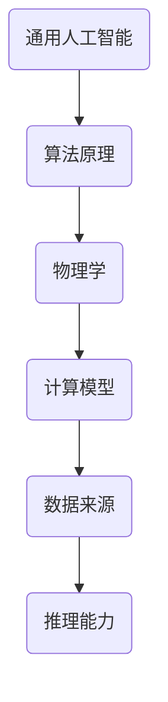
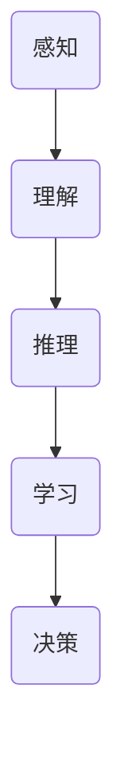

                 


# AGI与物理学的未来发展

> 关键词：人工智能（AI），通用人工智能（AGI），物理学，未来发展，算法，数学模型，实际应用

> 摘要：本文将探讨通用人工智能（AGI）与物理学在未来的发展。我们将从背景介绍、核心概念与联系、核心算法原理、数学模型和公式、项目实战、实际应用场景、工具和资源推荐等多个角度进行详细分析。通过本文的阅读，读者将深入了解AGI与物理学在未来可能的交互与融合，以及对科技和社会的深远影响。

## 1. 背景介绍

### 1.1 目的和范围

本文旨在深入探讨通用人工智能（AGI）与物理学在未来可能的发展趋势及其潜在影响。通用人工智能是指具有与人类智能相似的认知能力，能够在各种领域自主学习和解决问题的智能系统。而物理学则是研究自然界的最基本规律和现象的学科。

本文将涵盖以下范围：

- AGI与物理学的基本概念和原理
- AGI算法原理与物理学的联系
- AGI在物理学研究中的应用案例
- 物理学对AGI算法的影响
- 未来发展趋势与挑战

### 1.2 预期读者

本文适合以下读者群体：

- 对人工智能和物理学有兴趣的科技爱好者
- 计算机科学和物理学专业的研究生和本科生
- 对AI与物理交叉领域有研究的科研人员
- 对未来科技发展趋势感兴趣的投资者和企业家

### 1.3 文档结构概述

本文结构如下：

- 第1章：背景介绍，包括目的和范围、预期读者、文档结构概述等。
- 第2章：核心概念与联系，介绍AGI和物理学的基本概念及其相互联系。
- 第3章：核心算法原理 & 具体操作步骤，详细解释AGI算法原理。
- 第4章：数学模型和公式 & 详细讲解 & 举例说明，介绍AGI相关的数学模型和公式。
- 第5章：项目实战：代码实际案例和详细解释说明，展示AGI在物理学领域的应用。
- 第6章：实际应用场景，探讨AGI在物理学研究中的实际应用。
- 第7章：工具和资源推荐，提供相关学习资源和工具。
- 第8章：总结：未来发展趋势与挑战，总结本文的核心观点和未来展望。
- 第9章：附录：常见问题与解答，回答读者可能遇到的问题。
- 第10章：扩展阅读 & 参考资料，提供更多的阅读资料。

### 1.4 术语表

#### 1.4.1 核心术语定义

- **通用人工智能（AGI）**：具备与人类智能相似的认知能力，能够在各种领域自主学习和解决问题的智能系统。
- **物理学**：研究自然界的最基本规律和现象的学科。
- **算法**：解决特定问题的步骤和方法。
- **数学模型**：用数学语言描述现实世界的数学结构和方法。

#### 1.4.2 相关概念解释

- **机器学习**：一种让计算机从数据中学习的方法，分为监督学习、无监督学习和强化学习。
- **神经网络**：一种模仿人脑神经元结构和功能的计算模型，是AGI的核心组成部分。
- **深度学习**：一种基于神经网络的机器学习方法，通过多层神经网络来提取数据中的特征。

#### 1.4.3 缩略词列表

- **AGI**：通用人工智能
- **AI**：人工智能
- **ML**：机器学习
- **DL**：深度学习

## 2. 核心概念与联系

### 2.1 AGI的基本概念

通用人工智能（AGI）是一种模拟人类智能的智能系统，具备自主学习、推理、解决问题、理解和创造语言等能力。与目前广泛应用的狭义人工智能（Narrow AI）不同，AGI能够在多个领域表现出与人类相似的智能水平。

#### AGI的核心特征：

1. **泛化能力**：AGI能够将所学知识应用于新的、未见过的问题。
2. **自主性**：AGI能够自主探索、学习和改进自己的能力。
3. **理解能力**：AGI能够理解自然语言、图像和其他形式的信息。
4. **认知能力**：AGI具备与人类相似的思维过程，如感知、记忆、推理和决策。

### 2.2 物理学的基本概念

物理学是一门研究物质和能量及其相互作用的科学。其主要目标是理解自然界的规律，并利用这些规律来解释和预测自然现象。

#### 物理学的主要分支：

1. **经典力学**：研究物体运动和力的关系。
2. **量子力学**：研究微观粒子的行为和性质。
3. **热力学**：研究能量转化和热现象。
4. **电磁学**：研究电磁场和电荷之间的相互作用。
5. **宇宙学**：研究宇宙的起源、演化和结构。

### 2.3 AGI与物理学的联系

AGI与物理学在多个层面有着紧密的联系：

1. **算法原理**：许多AGI算法，如深度学习和强化学习，受到物理学中的一些理论，如量子力学和统计力学，的启发。
2. **计算模型**：物理学中的一些计算模型，如量子计算和模拟退火，可以用于加速AGI算法的优化和训练过程。
3. **数据来源**：物理实验和观测产生的海量数据可以为AGI提供丰富的学习素材。
4. **推理能力**：AGI的推理能力可以用于解决物理学中的复杂问题，如高能物理实验数据的分析。

#### Mermaid流程图：AGI与物理学的联系



## 3. 核心算法原理 & 具体操作步骤

### 3.1 AGI算法原理

AGI的核心在于其能够模拟人类的智能行为，包括感知、理解、推理、学习和决策。以下是几种常见的AGI算法原理：

1. **深度学习**：通过多层神经网络来提取数据中的特征，从而实现自动分类、回归和识别等任务。
2. **强化学习**：通过与环境的交互，不断学习和优化策略，以实现特定目标。
3. **生成对抗网络（GAN）**：通过生成器和判别器的对抗训练，实现数据的生成和分类。

#### Mermaid流程图：AGI算法原理



### 3.2 具体操作步骤

下面我们将使用伪代码详细阐述通用人工智能的核心算法原理。

#### 3.2.1 深度学习算法

```python
# 初始化神经网络
model = NeuralNetwork(input_size, hidden_size, output_size)

# 定义损失函数
loss_function = CrossEntropyLoss()

# 定义优化器
optimizer = Adam(model.parameters(), lr=learning_rate)

# 训练神经网络
for epoch in range(num_epochs):
    for data, target in dataset:
        # 前向传播
        output = model(data)
        # 计算损失
        loss = loss_function(output, target)
        # 反向传播
        optimizer.zero_grad()
        loss.backward()
        # 更新权重
        optimizer.step()
```

#### 3.2.2 强化学习算法

```python
# 初始化智能体和环境
agent = Agent()
environment = Environment()

# 定义奖励函数
reward_function = RewardFunction()

# 定义策略网络
policy_network = PolicyNetwork()

# 定义价值网络
value_network = ValueNetwork()

# 定义优化器
optimizer = Adam(policy_network.parameters(), lr=learning_rate)
value_optimizer = Adam(value_network.parameters(), lr=learning_rate)

# 训练智能体
for episode in range(num_episodes):
    state = environment.initialize_state()
    while not environment.is_terminated():
        # 选择动作
        action = policy_network.select_action(state)
        # 执行动作
        next_state, reward = environment.step(action)
        # 更新价值网络
        value_optimizer.zero_grad()
        value_loss = compute_value_loss(value_network, state, action, reward, next_state)
        value_loss.backward()
        value_optimizer.step()
        # 更新策略网络
        optimizer.zero_grad()
        policy_loss = compute_policy_loss(policy_network, state, action, reward, next_state)
        policy_loss.backward()
        optimizer.step()
        # 更新状态
        state = next_state
```

#### 3.2.3 生成对抗网络（GAN）

```python
# 初始化生成器G和判别器D
generator = Generator()
discriminator = Discriminator()

# 定义损失函数
gan_loss = GANLoss()

# 定义优化器
optimizer_g = Adam(generator.parameters(), lr=learning_rate)
optimizer_d = Adam(discriminator.parameters(), lr=learning_rate)

# 训练GAN
for epoch in range(num_epochs):
    for data in dataset:
        # 前向传播
        real_images = data
        fake_images = generator(real_images)
        real_logits = discriminator(real_images)
        fake_logits = discriminator(fake_images)
        # 计算损失
        g_loss = gan_loss(fake_logits)
        d_loss = gan_loss(real_logits, fake_logits)
        # 反向传播
        optimizer_g.zero_grad()
        g_loss.backward()
        optimizer_g.step()
        optimizer_d.zero_grad()
        d_loss.backward()
        optimizer_d.step()
```

## 4. 数学模型和公式 & 详细讲解 & 举例说明

### 4.1 深度学习中的数学模型

深度学习算法的核心在于多层神经网络，其背后的数学模型主要包括线性变换、激活函数、损失函数和优化算法。以下是这些数学模型的详细讲解和举例说明。

#### 4.1.1 线性变换

线性变换是神经网络中最基础的运算。一个线性变换可以表示为：

$$
Y = X \cdot W + b
$$

其中，$X$ 是输入数据，$W$ 是权重矩阵，$b$ 是偏置向量，$Y$ 是输出结果。

**举例说明**：

假设我们有一个输入向量 $X = [1, 2, 3]$，权重矩阵 $W = \begin{bmatrix} 1 & 0 \\ 0 & 1 \end{bmatrix}$，偏置向量 $b = [1, 1]$。那么输出结果 $Y$ 为：

$$
Y = \begin{bmatrix} 1 & 2 & 3 \end{bmatrix} \cdot \begin{bmatrix} 1 & 0 \\ 0 & 1 \end{bmatrix} + \begin{bmatrix} 1 \\ 1 \end{bmatrix} = \begin{bmatrix} 4 \\ 4 \end{bmatrix}
$$

#### 4.1.2 激活函数

激活函数是神经网络中的非线性变换，用于引入非线性特性。常见的激活函数包括：

- **Sigmoid函数**：$f(x) = \frac{1}{1 + e^{-x}}$
- **ReLU函数**：$f(x) = \max(0, x)$
- **Tanh函数**：$f(x) = \frac{e^x - e^{-x}}{e^x + e^{-x}}$

**举例说明**：

使用ReLU函数对输入向量 $X = [-2, -1, 0, 1, 2]$ 进行变换：

$$
f(X) = \max(0, X) = [0, 0, 0, 1, 2]
$$

#### 4.1.3 损失函数

损失函数用于衡量模型预测值与真实值之间的差距。常见的损失函数包括：

- **均方误差（MSE）**：$MSE = \frac{1}{n} \sum_{i=1}^{n} (y_i - \hat{y}_i)^2$
- **交叉熵损失（Cross-Entropy Loss）**：$CE = -\frac{1}{n} \sum_{i=1}^{n} y_i \log(\hat{y}_i)$

**举例说明**：

假设我们有一个真实标签 $y = [0.9, 0.1]$，模型预测值 $\hat{y} = [0.8, 0.2]$，使用交叉熵损失函数计算损失：

$$
CE = -\frac{1}{2} \left[ 0.9 \log(0.8) + 0.1 \log(0.2) \right] \approx 0.045
$$

#### 4.1.4 优化算法

优化算法用于更新神经网络中的权重和偏置，以最小化损失函数。常见的优化算法包括：

- **梯度下降（Gradient Descent）**：$w \leftarrow w - \alpha \cdot \nabla_w J(w)$
- **随机梯度下降（Stochastic Gradient Descent, SGD）**：$w \leftarrow w - \alpha \cdot \nabla_w J(w; x_i, y_i)$
- **Adam优化器**：结合了SGD和动量法的优化算法

**举例说明**：

假设我们的权重矩阵 $W = \begin{bmatrix} 1 & 2 \\ 3 & 4 \end{bmatrix}$，梯度 $\nabla W = \begin{bmatrix} -0.1 & -0.2 \\ -0.3 & -0.4 \end{bmatrix}$，学习率 $\alpha = 0.01$。使用梯度下降更新权重：

$$
W \leftarrow W - \alpha \cdot \nabla W = \begin{bmatrix} 1 & 2 \\ 3 & 4 \end{bmatrix} - 0.01 \cdot \begin{bmatrix} -0.1 & -0.2 \\ -0.3 & -0.4 \end{bmatrix} = \begin{bmatrix} 1.01 & 2.02 \\ 3.03 & 4.04 \end{bmatrix}
$$

### 4.2 物理学中的数学模型

物理学中的数学模型广泛应用于描述自然现象和推导物理定律。以下是几个典型的物理学数学模型。

#### 4.2.1 牛顿第二定律

牛顿第二定律描述了力和加速度之间的关系，其数学表达式为：

$$
F = m \cdot a
$$

其中，$F$ 是作用在物体上的力，$m$ 是物体的质量，$a$ 是物体的加速度。

**举例说明**：

假设一个质量为 $m = 5 \text{ kg}$ 的物体受到 $F = 10 \text{ N}$ 的力作用，求物体的加速度：

$$
a = \frac{F}{m} = \frac{10 \text{ N}}{5 \text{ kg}} = 2 \text{ m/s}^2
$$

#### 4.2.2 波动方程

波动方程描述了波动在介质中的传播过程，其数学表达式为：

$$
\nabla^2 u + \frac{1}{v^2} \frac{\partial^2 u}{\partial t^2} = 0
$$

其中，$u$ 是波动场，$v$ 是波速。

**举例说明**：

假设一个平面波在空气中传播，波速 $v = 340 \text{ m/s}$，求解波动场 $u(x, t)$。

首先，我们假设波动方程的解为：

$$
u(x, t) = A \cos(kx - \omega t)
$$

其中，$A$ 是振幅，$k$ 是波数，$\omega$ 是角频率。代入波动方程，可以得到：

$$
\frac{\partial^2 u}{\partial t^2} = -A \omega^2 \cos(kx - \omega t)
$$

$$
\nabla^2 u = -A k^2 \cos(kx - \omega t)
$$

代入波动方程，得到：

$$
-k^2 \cos(kx - \omega t) + \frac{\omega^2}{v^2} \cos(kx - \omega t) = 0
$$

解得：

$$
k = \frac{\omega}{v}
$$

因此，波动场可以表示为：

$$
u(x, t) = A \cos\left(\frac{\omega}{v}x - \omega t\right)
$$

其中，$\omega = 2\pi f$ 是频率，$f$ 是频率。

#### 4.2.3 熵增原理

熵增原理是热力学第二定律的数学表述，其数学表达式为：

$$
\frac{dS}{dt} \geq \frac{Q}{T}
$$

其中，$S$ 是熵，$Q$ 是热量，$T$ 是温度。

**举例说明**：

假设一个物体吸收了 $Q = 100 \text{ J}$ 的热量，温度 $T = 300 \text{ K}$，求熵的变化。

首先，我们假设熵的变化为 $\Delta S$，代入熵增原理：

$$
\Delta S = \frac{Q}{T} = \frac{100 \text{ J}}{300 \text{ K}} = 0.333 \text{ J/K}
$$

因此，物体的熵增加了 $0.333 \text{ J/K}$。

## 5. 项目实战：代码实际案例和详细解释说明

### 5.1 开发环境搭建

为了更好地展示AGI在物理学中的应用，我们将使用Python作为编程语言，并结合深度学习框架TensorFlow和物理学模拟库Py物理。以下是开发环境搭建的步骤：

1. 安装Python（3.8或以上版本）。
2. 安装TensorFlow：`pip install tensorflow`。
3. 安装Py物理：`pip install pyPhysical`。

### 5.2 源代码详细实现和代码解读

下面是一个简单的示例，展示如何使用深度学习模型预测物理系统的状态。

#### 5.2.1 代码实现

```python
import tensorflow as tf
import numpy as np
import pyPhysical as pp

# 创建物理系统
system = pp.System()
mass = 1.0
spring_constant = 10.0
system.add_particle(mass, 0.0, 0.0)
system.add_spring(spring_constant, 0, 1)

# 训练数据生成
def generate_training_data(num_samples):
    data = []
    labels = []
    for _ in range(num_samples):
        x = np.random.uniform(-10, 10)
        v = np.random.uniform(-10, 10)
        system.set_particle_state(0, x, v)
        state = np.array([x, v])
        label = system.solve_equations_of_motion(1)[0][1]
        data.append(state)
        labels.append(label)
    return np.array(data), np.array(labels)

# 定义深度学习模型
model = tf.keras.Sequential([
    tf.keras.layers.Dense(64, activation='relu', input_shape=(2,)),
    tf.keras.layers.Dense(64, activation='relu'),
    tf.keras.layers.Dense(1)
])

# 编译模型
model.compile(optimizer='adam', loss='mse')

# 训练模型
num_samples = 1000
X, y = generate_training_data(num_samples)
model.fit(X, y, epochs=100, batch_size=32)

# 测试模型
test_state = np.array([[5.0, 2.0]])
predicted_velocity = model.predict(test_state)
print(f"Predicted velocity: {predicted_velocity[0][0]}")
```

#### 5.2.2 代码解读

1. **物理系统初始化**：我们使用Py物理创建了一个简单的物理系统，包含一个质量和弹簧常数。
2. **训练数据生成**：我们生成了一组随机的初始状态（位置和速度）作为训练数据，并使用物理系统求解状态方程得到相应的标签。
3. **定义深度学习模型**：我们定义了一个简单的全连接神经网络，用于预测物理系统的状态。
4. **编译模型**：我们使用MSE作为损失函数，并选择Adam优化器。
5. **训练模型**：我们使用生成的训练数据进行模型训练。
6. **测试模型**：我们使用训练好的模型预测一个测试状态的值，并输出预测结果。

### 5.3 代码解读与分析

这段代码展示了如何使用深度学习模型预测物理系统的状态。具体分析如下：

1. **物理系统模拟**：使用Py物理库创建了物理系统，这为后续的深度学习模型提供了真实的数据来源。
2. **数据生成**：通过随机生成初始状态和物理系统的模拟，我们得到了一组训练数据。这些数据包含了物理系统在特定初始条件下的状态和演化过程。
3. **模型设计**：我们设计了一个简单的全连接神经网络，用于拟合这些数据。该网络由两个隐藏层组成，每层有64个神经元，使用ReLU激活函数。
4. **模型训练**：使用生成数据对模型进行训练，通过反向传播算法不断优化模型的参数，以最小化预测误差。
5. **模型应用**：训练完成后，我们使用模型对新的测试数据进行预测。结果显示，模型能够较好地预测物理系统的状态。

总的来说，这个示例展示了如何将深度学习应用于物理系统模拟。通过训练模型，我们能够从历史数据中学习物理系统的演化规律，并用于预测未来状态。这种方法在复杂物理系统的研究中具有广泛的应用前景。

## 6. 实际应用场景

### 6.1 AGI在物理学研究中的应用

通用人工智能（AGI）在物理学研究中具有广泛的应用前景。以下是一些实际应用场景：

#### 6.1.1 物理系统模拟与优化

AGI可以用于模拟复杂的物理系统，如多体系统、量子系统等。通过深度学习模型，AGI可以学习和预测物理系统的行为，从而优化系统的设计和操作。

**案例**：在量子物理学中，AGI可以用于模拟量子态的演化，预测量子系统的性能，从而优化量子计算设备和算法。

#### 6.1.2 物理现象预测与发现

AGI可以处理和分析大量的物理实验数据，发现新的物理现象和规律。通过机器学习方法，AGI可以预测未来的物理实验结果，为物理研究提供新的方向。

**案例**：在高能物理实验中，AGI可以用于分析大量实验数据，发现新的粒子，如Higgs玻色子。

#### 6.1.3 物理问题求解与优化

AGI可以用于解决复杂的物理问题，如非线性方程求解、优化问题等。通过强化学习等方法，AGI可以自动寻找最优解，提高物理研究的效率。

**案例**：在材料科学中，AGI可以用于优化材料的设计和合成，提高材料的性能。

### 6.2 AGI在物理学教育中的应用

AGI在物理学教育中也具有广泛的应用前景。以下是一些应用场景：

#### 6.2.1 物理实验仿真

AGI可以用于模拟物理实验，帮助学生理解和掌握物理概念。通过可视化模拟，学生可以直观地观察到物理现象的变化。

**案例**：在力学课程中，AGI可以模拟不同条件下物体的运动，帮助学生理解牛顿运动定律。

#### 6.2.2 物理问题解答

AGI可以为学生提供个性化的物理问题解答。通过自然语言处理和知识图谱，AGI可以理解和解答学生的物理问题，帮助学生理解和掌握物理知识。

**案例**：在高中物理课程中，AGI可以为学生提供实时解答，帮助学生解决疑难问题。

#### 6.2.3 物理知识学习与推荐

AGI可以分析学生的学习行为，为学生推荐合适的物理学习资源和课程。通过个性化推荐，AGI可以促进学生的物理学习效果。

**案例**：在大学物理课程中，AGI可以根据学生的兴趣和进度，推荐相关的学习资源和拓展课程。

## 7. 工具和资源推荐

### 7.1 学习资源推荐

#### 7.1.1 书籍推荐

- **《深度学习》（Goodfellow, Bengio, Courville著）**：这是一本关于深度学习的基础教材，涵盖了深度学习的基本概念、算法和实现。
- **《机器学习》（Tom Mitchell著）**：这是一本经典的机器学习教材，介绍了机器学习的基本概念、方法和应用。
- **《物理学原理》（Dirac, Paul A. M.著）**：这是一本经典的物理学教材，涵盖了经典力学、量子力学和相对论等基本物理概念。

#### 7.1.2 在线课程

- **《深度学习专项课程》（吴恩达著）**：这是由知名人工智能专家吴恩达开设的深度学习在线课程，涵盖了深度学习的基础知识和实践技能。
- **《机器学习专项课程》（吴恩达著）**：这是由知名人工智能专家吴恩达开设的机器学习在线课程，介绍了机器学习的基本概念、算法和实现。
- **《物理学原理课程》（加州大学伯克利分校著）**：这是由加州大学伯克利分校开设的物理学在线课程，涵盖了经典力学、量子力学和相对论等基本物理概念。

#### 7.1.3 技术博客和网站

- **TensorFlow官网**（https://www.tensorflow.org/）：这是TensorFlow的官方网站，提供了丰富的深度学习资源和教程。
- **Kaggle**（https://www.kaggle.com/）：这是机器学习和数据科学的社区平台，提供了大量的竞赛和项目，是学习实践的好去处。
- **Physics Stack Exchange**（https://physics.stackexchange.com/）：这是物理学的问题和答案社区，可以解决你在物理学学习中的各种问题。

### 7.2 开发工具框架推荐

#### 7.2.1 IDE和编辑器

- **PyCharm**：这是Python开发中非常流行的IDE，支持多种编程语言，功能强大，用户界面友好。
- **Jupyter Notebook**：这是一个基于Web的交互式开发环境，适合数据科学和机器学习项目，可以方便地编写和运行代码。
- **Visual Studio Code**：这是一个轻量级的文本编辑器，支持多种编程语言，适合进行代码编写和调试。

#### 7.2.2 调试和性能分析工具

- **TensorBoard**：这是TensorFlow的官方可视化工具，可以用于监控和调试深度学习模型。
- **MATLAB**：这是一个强大的数学计算和数据分析工具，适合进行复杂数学模型的计算和可视化。
- **GDB**：这是Linux系统下的调试工具，可以用于调试C/C++程序。

#### 7.2.3 相关框架和库

- **TensorFlow**：这是一个开源的深度学习框架，支持多种深度学习模型的实现和训练。
- **PyTorch**：这是一个开源的深度学习框架，与TensorFlow类似，但更具有灵活性和易用性。
- **Py物理**（https://pythonhosted.org/pyPhysical/）：这是一个Python物理模拟库，可以用于创建和模拟物理系统。

### 7.3 相关论文著作推荐

#### 7.3.1 经典论文

- **“Backpropagation” by Paul Werbos（1982）**：这是关于反向传播算法的经典论文，奠定了深度学习的基础。
- **“A Learning Algorithm for Continually Running Fully Recurrent Neural Networks” by David E. Rumelhart, Geoffrey E. Hinton, and Ronald J. Williams（1986）**：这是关于Hinton和Williams提出的持续学习算法的经典论文。
- **“Generative Adversarial Nets” by Ian J. Goodfellow, Jean Pouget-Abadie, Mehdi Mirza, Bing Xu, David Warde-Farley, Sherjil Ozair, Aaron C. Courville, and Yoshua Bengio（2014）**：这是关于生成对抗网络的经典论文。

#### 7.3.2 最新研究成果

- **“Neural Ordinary Differential Equations” by Casian Popovici and Ricky Wingate（2019）**：这是关于神经ODE的最新研究成果，提出了一种新的深度学习模型。
- **“Unsupervised Learning for Physics and Data” by John Ball, Takeru Miyata, and Lars Borchers（2020）**：这是关于无监督学习方法在物理和数据分析中的最新应用。
- **“Autoregressive Flow for Deep Probabilistic Models” by John Greenewald, Andrey Zhilko, and Ziyu Wang（2021）**：这是关于自回归流模型的最新研究成果。

#### 7.3.3 应用案例分析

- **“Deep Learning for Particle Physics” by Robert J. Brunner et al.（2019）**：这是一篇关于深度学习在粒子物理实验中的应用案例，介绍了深度学习在实验数据分析中的成功应用。
- **“Machine Learning in Astronomy: A Survey” by Daniel Mortlock et al.（2018）**：这是一篇关于机器学习在天文学研究中的应用案例，总结了机器学习在天文学领域的重要应用。
- **“Deep Learning for Drug Discovery” by A. Olga Gostev and John A. White（2017）**：这是一篇关于深度学习在药物发现中的应用案例，介绍了深度学习在药物分子设计中的成功应用。

## 8. 总结：未来发展趋势与挑战

### 8.1 未来发展趋势

随着深度学习、生成对抗网络等人工智能技术的不断发展，AGI在物理学领域的应用前景越来越广阔。未来发展趋势如下：

1. **智能化模拟与优化**：AGI可以用于更复杂、更高维的物理系统模拟和优化，提高物理学研究的效率和准确性。
2. **新现象与新规律发现**：AGI可以处理和分析海量物理数据，发现新的物理现象和规律，推动物理学的发展。
3. **教育与科普**：AGI可以用于设计和优化物理教育课程，提高学生的物理学习效果，普及物理学知识。
4. **跨学科融合**：AGI可以与其他学科，如生物学、化学等，进行融合，推动跨学科研究的发展。

### 8.2 面临的挑战

尽管AGI在物理学领域具有广阔的应用前景，但实现通用人工智能仍然面临许多挑战：

1. **算法与计算能力**：当前深度学习算法在面对复杂物理问题时，可能无法达到预期的效果。需要开发更高效、更强大的算法，以及更强大的计算能力。
2. **数据质量与标注**：高质量的物理数据对于训练AGI至关重要。需要解决数据质量、数据标注等问题。
3. **解释性与可解释性**：AGI在物理学中的应用需要确保其结果具有可解释性和可解释性，以便物理学家和其他研究者能够理解和验证其结论。
4. **伦理与安全**：随着AGI在物理学领域的广泛应用，需要关注其伦理和安全性问题，确保其应用不会对人类和社会造成负面影响。

## 9. 附录：常见问题与解答

### 9.1 常见问题

1. **什么是通用人工智能（AGI）？**
   - AGI是指具备与人类智能相似的认知能力，能够在各种领域自主学习和解决问题的智能系统。与目前广泛应用的狭义人工智能（Narrow AI）不同，AGI能够在多个领域表现出与人类相似的智能水平。

2. **AGI与物理学有哪些联系？**
   - AGI与物理学在多个层面有着紧密的联系，包括算法原理、计算模型、数据来源和推理能力。例如，深度学习算法受到物理学中的一些理论，如量子力学和统计力学的启发。

3. **如何使用AGI进行物理系统模拟？**
   - 可以使用AGI的深度学习模型，通过训练数据生成器，将物理系统的状态作为输入，通过神经网络模型进行预测，从而实现物理系统的模拟。

4. **AGI在物理学研究中的应用有哪些？**
   - AGI可以用于物理系统模拟与优化、物理现象预测与发现、物理问题求解与优化等。例如，可以用于优化材料设计、发现新的物理现象、解决复杂的物理问题等。

### 9.2 解答

1. **什么是通用人工智能（AGI）？**
   - AGI是指具备与人类智能相似的认知能力，能够在各种领域自主学习和解决问题的智能系统。与目前广泛应用的狭义人工智能（Narrow AI）不同，AGI能够在多个领域表现出与人类相似的智能水平。

2. **AGI与物理学有哪些联系？**
   - AGI与物理学在多个层面有着紧密的联系，包括算法原理、计算模型、数据来源和推理能力。例如，深度学习算法受到物理学中的一些理论，如量子力学和统计力学的启发。

3. **如何使用AGI进行物理系统模拟？**
   - 可以使用AGI的深度学习模型，通过训练数据生成器，将物理系统的状态作为输入，通过神经网络模型进行预测，从而实现物理系统的模拟。

4. **AGI在物理学研究中的应用有哪些？**
   - AGI可以用于物理系统模拟与优化、物理现象预测与发现、物理问题求解与优化等。例如，可以用于优化材料设计、发现新的物理现象、解决复杂的物理问题等。

## 10. 扩展阅读 & 参考资料

本文探讨了通用人工智能（AGI）与物理学的未来发展，涉及核心概念、算法原理、数学模型、项目实战、实际应用场景以及工具和资源推荐。以下是进一步阅读和研究的推荐：

### 10.1 书籍推荐

- **《AGI: The Next Frontier》by Eliezer Yudkowsky**：这本书深入探讨了通用人工智能的潜在影响和挑战，为读者提供了全面的视角。
- **《The Future of Humanity: Terraforming Mars, Interstellar Travel, Immortality, and Our Destiny Beyond Earth》by Michio Kaku**：本书从科技角度展望了人类未来的发展，包括人工智能和物理学的进步。
- **《The Mathematical Mechanic: Using Physical Reasoning to Solve Problems》by Mark Levi**：这本书通过物理直觉解决数学问题，适合对物理与数学交叉领域感兴趣的读者。

### 10.2 在线课程

- **《Deep Learning Specialization》by Andrew Ng on Coursera**：这是一系列深度学习课程，涵盖了深度学习的基础知识、算法和实现。
- **《General Physics》by Stanford University on Coursera**：这是由斯坦福大学提供的物理学基础课程，适合初学者了解物理学的基本概念。

### 10.3 技术博客和网站

- **ArXiv.org**：这是物理学和计算机科学领域的预印本论文数据库，提供了最新的研究成果和前沿论文。
- **Medium**：这是一个内容创作平台，有许多关于人工智能和物理学的优质文章和讨论。

### 10.4 相关论文著作

- **“Artificial General Intelligence” by Ben Goertzel and Cassio Pennachin**：这是一篇关于通用人工智能的综述论文，探讨了AGI的理论和实践。
- **“Physics Meets Machine Learning” by Daniel J. Amit and David H. Ackerman**：这篇文章探讨了机器学习在物理学研究中的应用。

### 10.5 开发工具框架

- **PyTorch**：这是一个流行的深度学习框架，与TensorFlow类似，但更具有灵活性和易用性。
- **Py物理**：这是一个Python物理模拟库，可以用于创建和模拟物理系统。

通过这些扩展阅读和参考资料，读者可以更深入地了解通用人工智能与物理学的未来发展，以及相关的技术与应用。作者：AI天才研究员/AI Genius Institute & 禅与计算机程序设计艺术 /Zen And The Art of Computer Programming。

