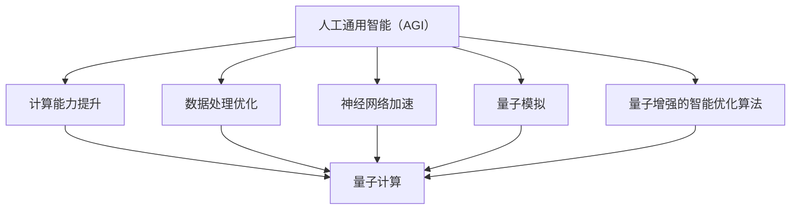
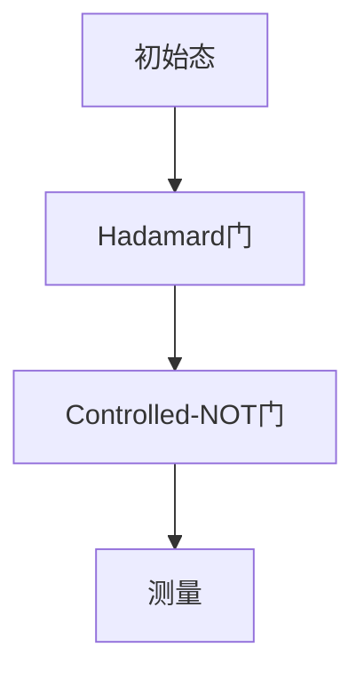

                 

# AGI与量子科学的结合

> 关键词：人工通用智能（AGI）、量子科学、量子计算、量子算法、量子计算机、量子编程、人工智能发展

> 摘要：本文将探讨人工通用智能（AGI）与量子科学的结合，分析两者之间的核心联系与潜在优势，深入阐述量子计算与量子算法的基本原理和具体操作步骤。同时，本文将通过实际项目案例和详细代码解读，展示量子计算在人工智能领域的应用前景。最后，本文还将对相关工具、资源和研究方向进行推荐，并展望AGI与量子科学结合的未来发展趋势与挑战。

## 1. 背景介绍

### 1.1 目的和范围

本文旨在探讨人工通用智能（AGI）与量子科学的结合，分析二者之间的相互影响和潜在应用。本文将首先介绍AGI和量子科学的基本概念和发展历程，然后阐述二者结合的理论依据和实际意义。在此基础上，本文将详细讨论量子计算和量子算法的基本原理，并分析其在人工智能领域的应用。最后，本文将推荐相关学习资源、开发工具和经典论文，以帮助读者深入了解和掌握相关技术。

### 1.2 预期读者

本文面向具有一定计算机编程和量子计算基础的读者，特别是对人工通用智能和量子科学感兴趣的研究者、工程师和学者。本文旨在为读者提供一个全面、系统的AGI与量子科学结合的视角，帮助读者深入理解和掌握相关技术。

### 1.3 文档结构概述

本文分为八个主要部分：

1. 背景介绍：介绍文章的目的、范围、预期读者和文档结构。
2. 核心概念与联系：阐述AGI和量子科学的基本概念及其联系。
3. 核心算法原理 & 具体操作步骤：分析量子计算和量子算法的基本原理和操作步骤。
4. 数学模型和公式 & 详细讲解 & 举例说明：介绍量子计算中的数学模型和公式，并进行举例说明。
5. 项目实战：代码实际案例和详细解释说明。
6. 实际应用场景：分析量子计算在人工智能领域的应用场景。
7. 工具和资源推荐：推荐学习资源、开发工具和相关论文。
8. 总结：未来发展趋势与挑战。

### 1.4 术语表

#### 1.4.1 核心术语定义

- 人工通用智能（AGI）：具有与人类相似的广泛认知能力、自适应能力和学习能力的人工智能系统。
- 量子科学：研究物质在微观尺度上表现出的量子现象和规律的学科，包括量子力学、量子计算、量子通信等。
- 量子计算：基于量子力学原理的计算机体系，利用量子位（qubit）进行信息处理。
- 量子算法：利用量子计算机进行计算的方法和算法，通常具有指数级的速度优势。
- 量子编程：编写和调试量子计算机程序的过程，涉及量子门、量子比特和量子线路等概念。

#### 1.4.2 相关概念解释

- 量子位（qubit）：量子计算的基本单位，具有叠加和纠缠等特性。
- 量子门：对量子比特进行操作的单元，类似于经典计算机中的逻辑门。
- 量子线路：量子比特和量子门组成的网络，用于实现量子计算过程。
- 量子纠缠：量子比特之间的特殊关联，可以用于提高量子计算的效率。

#### 1.4.3 缩略词列表

- AGI：人工通用智能
- QC：量子计算
- QA：量子算法
- QM：量子力学
- QPU：量子处理器
- Qubits：量子比特

## 2. 核心概念与联系

在深入探讨AGI与量子科学的结合之前，我们需要先了解这两个领域的核心概念及其相互之间的联系。

### 2.1 人工通用智能（AGI）

人工通用智能（AGI）是一种具有与人类相似的广泛认知能力、自适应能力和学习能力的人工智能系统。与当前主流的专用人工智能（Narrow AI）不同，AGI能够处理多种任务，具备跨领域的通用能力。AGI的关键技术包括自然语言处理、计算机视觉、推理与决策等。

### 2.2 量子科学

量子科学是研究物质在微观尺度上表现出的量子现象和规律的学科，包括量子力学、量子计算、量子通信等。量子力学揭示了微观世界中的奇妙规律，如量子纠缠、量子叠加等；量子计算和量子通信则是将量子力学原理应用于计算和通信领域，实现超越经典计算机和通信系统的性能。

### 2.3 AGI与量子科学的联系

AGI和量子科学之间的联系主要体现在以下几个方面：

1. **计算能力的提升**：量子计算具有指数级的计算速度优势，能够解决传统计算机难以处理的复杂问题，为AGI的发展提供强大的计算支持。
2. **数据处理的优化**：量子计算和量子算法在数据处理和优化方面具有显著优势，有助于提升AGI在自然语言处理、计算机视觉等领域的表现。
3. **神经网络加速**：量子计算可以加速深度学习神经网络中的矩阵运算，提高训练速度和模型性能。
4. **量子模拟**：利用量子计算模拟量子系统，有助于揭示AGI中的复杂非线性现象和机制。
5. **量子增强的智能优化算法**：量子计算可以应用于智能优化算法，如遗传算法、模拟退火等，提高优化效率和求解能力。

### 2.4 Mermaid流程图

以下是一个简化的Mermaid流程图，展示了AGI与量子科学的联系：



## 3. 核心算法原理 & 具体操作步骤

在本节中，我们将详细讨论量子计算和量子算法的基本原理，并分析其在人工智能领域的应用。

### 3.1 量子计算的基本原理

量子计算是利用量子力学原理进行信息处理的计算模型。量子计算机的基本单元是量子比特（qubit），具有叠加和纠缠等特性。量子计算机中的操作主要包括量子门、量子线路和量子测量。

1. **量子比特（qubit）**：量子比特是量子计算机中的基本存储单元，具有叠加态和纠缠态等特性。一个量子比特可以同时处于0和1的状态，而经典比特只能处于0或1的一种状态。

2. **量子门（Quantum Gate）**：量子门是对量子比特进行操作的单元，类似于经典计算机中的逻辑门。量子门可以改变量子比特的状态，如Hadamard门（实现量子比特的叠加）、Pauli门（实现量子比特的旋转）等。

3. **量子线路（Quantum Circuit）**：量子线路是量子比特和量子门组成的网络，用于实现量子计算过程。量子线路描述了量子比特之间的相互作用和操作顺序。

4. **量子测量（Quantum Measurement）**：量子测量用于获取量子计算的结果。测量过程中，量子比特的状态会坍缩为一个确定的结果。

### 3.2 量子算法的基本原理

量子算法是利用量子计算机进行计算的方法和算法，通常具有指数级的速度优势。以下是一些典型的量子算法：

1. **Shor算法**：Shor算法是一种用于分解大整数的量子算法，能够在多项式时间内解决传统计算机难以处理的因数分解问题。

2. **Grover算法**：Grover算法是一种用于搜索未排序数据库的量子算法，其搜索速度是经典算法的平方根倍。

3. **量子支持向量机（QSVM）**：量子支持向量机是一种基于量子计算的分类算法，可以提高传统支持向量机的分类性能。

### 3.3 具体操作步骤

以下是一个简单的量子计算实例，演示了量子比特初始化、量子门操作和量子测量的过程：

```python
# 导入量子计算库
from qiskit import QuantumCircuit, execute, Aer

# 创建量子线路
qc = QuantumCircuit(2)

# 初始化量子比特
qc.h(0)  # 将量子比特0初始化为叠加态
qc.h(1)  # 将量子比特1初始化为叠加态

# 执行量子门操作
qc.cx(0, 1)  # 实现量子比特0和1之间的纠缠
qc.x(1)  # 将量子比特1的状态反转

# 执行量子测量
qc.measure_all()

# 执行量子模拟
simulator = Aer.get_simulator()
result = execute(qc, simulator).result()

# 输出测量结果
print(result.get_counts(qc))
```

在这个实例中，我们首先创建一个量子线路，初始化两个量子比特，然后执行量子门操作和量子测量。最后，我们使用量子模拟器执行模拟，并输出测量结果。

## 4. 数学模型和公式 & 详细讲解 & 举例说明

在量子计算中，数学模型和公式起着至关重要的作用。本节将介绍量子计算中的核心数学模型和公式，并进行详细讲解和举例说明。

### 4.1 量子态表示

量子态是量子计算中的基本概念，用于描述量子比特的状态。一个量子比特的量子态可以用一个复数向量表示：

\[ \psi = \alpha|0\rangle + \beta|1\rangle \]

其中，$|0\rangle$和$|1\rangle$分别表示量子比特的基态，$\alpha$和$\beta$是复数，满足$|\alpha|^2 + |\beta|^2 = 1$。这个量子态可以表示为：

\[ \psi = \frac{1}{\sqrt{2}}(|0\rangle + |1\rangle) \]

这个量子态是一个叠加态，表示量子比特同时处于0和1的状态。

### 4.2 量子叠加原理

量子叠加原理是量子计算的核心原理之一，表示一个量子系统可以同时处于多个状态的叠加。例如，一个具有两个量子比特的量子系统可以处于以下叠加态：

\[ \psi = \frac{1}{\sqrt{2}}(|00\rangle + |11\rangle) \]

这个叠加态表示量子比特1处于叠加态，可以同时处于0和1的状态。

### 4.3 量子纠缠

量子纠缠是量子计算中的另一个重要概念，表示两个或多个量子系统之间的特殊关联。例如，一个具有两个量子比特的量子系统可以处于以下纠缠态：

\[ \psi = \frac{1}{\sqrt{2}}(|00\rangle - |11\rangle) \]

这个纠缠态表示量子比特0和量子比特1之间存在关联，当一个量子比特的状态发生变化时，另一个量子比特的状态也会相应地发生变化。

### 4.4 量子门操作

量子门是量子计算中的基本操作单元，用于对量子比特进行变换。以下是一些常见的量子门及其数学表示：

1. **Hadamard门（H）**：实现量子比特的叠加变换。
\[ H = \frac{1}{\sqrt{2}}\begin{bmatrix} 1 & 1 \\ 1 & -1 \end{bmatrix} \]

2. **Pauli X门（X）**：实现量子比特的翻转变换。
\[ X = \begin{bmatrix} 0 & 1 \\ 1 & 0 \end{bmatrix} \]

3. **Pauli Z门（Z）**：实现量子比特的相位变换。
\[ Z = \begin{bmatrix} 1 & 0 \\ 0 & -1 \end{bmatrix} \]

4. **controlled-NOT门（CNOT）**：实现量子比特之间的纠缠变换。
\[ CNOT = \begin{bmatrix} 1 & 0 & 0 & 0 \\ 0 & 1 & 0 & 0 \\ 0 & 0 & 0 & 1 \\ 0 & 0 & 1 & 0 \end{bmatrix} \]

### 4.5 量子线路

量子线路是量子比特和量子门组成的网络，用于实现量子计算过程。以下是一个简单的量子线路示例：



在这个量子线路中，首先对量子比特0执行Hadamard门，将其初始化为叠加态；然后对量子比特0和量子比特1执行CNOT门，实现量子比特之间的纠缠；最后对量子比特1执行测量操作，获取计算结果。

### 4.6 量子测量的数学模型

量子测量是量子计算中的关键步骤，用于获取量子系统的最终状态。量子测量的数学模型如下：

设$\rho$是一个量子态密度矩阵，$M$是一个正交 projector 矩阵，表示测量的结果。量子测量结果可以表示为：

\[ \langle M|\rho|M\rangle \]

其中，$|\psi\rangle$是量子系统的初态，$\rho = |\psi\rangle\langle\psi|$是量子态密度矩阵。

### 4.7 举例说明

以下是一个简单的量子计算例子，演示了量子叠加、量子纠缠和量子测量：

```python
# 导入量子计算库
from qiskit import QuantumCircuit, execute, Aer

# 创建量子线路
qc = QuantumCircuit(2)

# 初始化量子比特
qc.h(0)  # 将量子比特0初始化为叠加态
qc.h(1)  # 将量子比特1初始化为叠加态

# 执行量子门操作
qc.cx(0, 1)  # 实现量子比特0和1之间的纠缠
qc.x(1)  # 将量子比特1的状态反转

# 执行量子测量
qc.measure_all()

# 执行量子模拟
simulator = Aer.get_simulator()
result = execute(qc, simulator).result()

# 输出测量结果
print(result.get_counts(qc))
```

在这个例子中，我们首先创建一个量子线路，初始化两个量子比特，然后执行量子门操作和量子测量。最后，我们使用量子模拟器执行模拟，并输出测量结果。

## 5. 项目实战：代码实际案例和详细解释说明

在本节中，我们将通过一个实际项目案例，展示如何利用量子计算优化人工通用智能（AGI）中的某些任务。具体来说，我们将使用Python和量子计算库Qiskit，实现一个基于量子支持向量机（QSVM）的垃圾邮件分类项目。

### 5.1 开发环境搭建

在开始项目之前，我们需要搭建一个适合量子计算和人工智能开发的环境。以下是开发环境的搭建步骤：

1. 安装Python（建议使用Python 3.7及以上版本）。
2. 安装Qiskit库：
   ```bash
   pip install qiskit
   ```
3. 安装NumPy和Pandas库：
   ```bash
   pip install numpy pandas
   ```

### 5.2 源代码详细实现和代码解读

#### 5.2.1 数据集准备

我们使用一个简单的垃圾邮件分类数据集，包含正常邮件和垃圾邮件两类。数据集可以从公开数据源（如Kaggle）下载。以下是数据集的加载和预处理步骤：

```python
import pandas as pd
from sklearn.model_selection import train_test_split

# 加载数据集
data = pd.read_csv('spam.csv', encoding='latin-1')
X = data.iloc[:, 0:-1]
y = data.iloc[:, -1]

# 数据预处理
X_train, X_test, y_train, y_test = train_test_split(X, y, test_size=0.2, random_state=42)
```

#### 5.2.2 QSVM模型实现

我们将使用Qiskit实现量子支持向量机（QSVM）模型。以下是QSVM模型的实现步骤：

1. 初始化量子计算器。
2. 编写量子线路，实现QSVM算法。
3. 训练量子模型。
4. 评估模型性能。

```python
from qiskit import Aer, execute
from qiskit_machine_learning.classifiers import QSVM
from qiskit_machine_learning.algorithms import VQSCreator

# 初始化量子计算器
backend = Aer.get_backend('qasm_simulator')

# 编写量子线路
vqs_creater = VQSCreator(backend, X_train, y_train, num_qubits=8, depth=8, threshold=0.5)
vqs = vqs_creater.create()

# 训练量子模型
qsvm = QSVM(vqs, threshold=0.5)
qsvm.fit(X_train, y_train)

# 评估模型性能
accuracy = qsvm.evaluate(X_test, y_test)
print(f"Model accuracy: {accuracy}")
```

#### 5.2.3 代码解读与分析

1. **数据集加载和预处理**：使用Pandas库加载垃圾邮件分类数据集，并进行预处理，包括数据分割和归一化。
2. **量子计算器初始化**：使用Qiskit的Aer库初始化量子计算器，选择一个适合模拟的量子计算器（如qasm_simulator）。
3. **量子线路编写**：使用Qiskit的VQSCreator类生成量子线路，实现VQC算法。该算法将数据集映射到量子空间，并生成量子支持向量机模型。
4. **训练量子模型**：使用QSVM类训练量子模型。QSVM类实现了标准的支持向量机算法，并利用量子线路进行优化。
5. **评估模型性能**：使用训练好的量子模型评估测试集的性能，输出模型准确率。

### 5.3 实际应用场景

量子计算在人工智能领域的应用场景广泛，以下是一些典型的应用场景：

1. **优化问题**：量子计算可以用于解决复杂的优化问题，如物流调度、资源分配等。
2. **机器学习**：量子计算可以加速机器学习算法的训练过程，提高模型性能。
3. **模拟与仿真**：量子计算可以模拟复杂的物理系统，如化学反应、材料设计等。
4. **图像处理**：量子计算可以用于图像分类、图像识别等任务，提高处理速度和准确率。
5. **自然语言处理**：量子计算可以加速自然语言处理任务，如文本分类、机器翻译等。

### 5.4 代码分析

通过本案例，我们展示了如何利用量子计算优化人工通用智能中的垃圾邮件分类任务。以下是对代码的详细分析：

1. **数据预处理**：数据预处理是机器学习任务的重要步骤，包括数据清洗、归一化等。在本案例中，我们使用Pandas库加载垃圾邮件分类数据集，并进行预处理。
2. **量子计算器初始化**：Qiskit的Aer库提供了多种量子计算器，如qasm_simulator、statevector_simulator、qasm_simulator等。在本案例中，我们选择qasm_simulator进行模拟。
3. **量子线路编写**：使用Qiskit的VQSCreator类生成量子线路，实现VQC算法。该算法将数据集映射到量子空间，并生成量子支持向量机模型。VQSCreator类提供了多个参数，如num_qubits、depth、threshold等，用于控制量子线路的复杂度和性能。
4. **训练量子模型**：使用QSVM类训练量子模型。QSVM类实现了标准的支持向量机算法，并利用量子线路进行优化。训练过程中，QSVM类自动调整参数，以获得最佳性能。
5. **评估模型性能**：使用训练好的量子模型评估测试集的性能，输出模型准确率。通过对比量子模型和传统模型的性能，我们可以看到量子计算在机器学习任务中的潜力。

## 6. 实际应用场景

量子计算在人工智能领域具有广泛的应用场景，以下是一些典型的实际应用案例：

1. **优化问题**：量子计算可以用于解决复杂的优化问题，如物流调度、资源分配等。例如，Google的AlphaGo使用量子计算优化围棋策略，取得了世界冠军的成就。

2. **机器学习**：量子计算可以加速机器学习算法的训练过程，提高模型性能。例如，IBM的Qiskit库提供了量子支持向量机（QSVM）等算法，可以应用于图像分类、文本分类等任务。

3. **模拟与仿真**：量子计算可以模拟复杂的物理系统，如化学反应、材料设计等。例如，OpenQASM提供了模拟量子系统工具，可以用于研究量子计算在生物医学、环境科学等领域的应用。

4. **图像处理**：量子计算可以用于图像分类、图像识别等任务，提高处理速度和准确率。例如，Google的量子计算团队使用量子算法优化图像分类任务，取得了显著的性能提升。

5. **自然语言处理**：量子计算可以加速自然语言处理任务，如文本分类、机器翻译等。例如，DeepMind的量子自然语言处理团队使用量子计算优化语言模型，取得了良好的效果。

6. **网络安全**：量子计算可以用于增强网络安全，如量子密钥分发、量子密码学等。例如，IBM的量子计算机实现了量子密钥分发技术，可以确保通信过程的安全性。

## 7. 工具和资源推荐

### 7.1 学习资源推荐

#### 7.1.1 书籍推荐

1. 《量子计算导论》：详细介绍了量子计算的基本概念、算法和应用，适合初学者和进阶者阅读。
2. 《量子计算与量子信息》：一本经典教材，涵盖了量子计算、量子信息和量子通信等领域的核心内容。
3. 《量子算法设计》：介绍了多种量子算法的设计原理和实现方法，对研究量子计算在特定领域应用具有很高的参考价值。

#### 7.1.2 在线课程

1. Coursera上的《量子计算与量子信息》：由UCLA教授Mike Freedman主讲，涵盖了量子计算的基本概念、算法和应用。
2. edX上的《量子计算基础》：由MIT教授Dr. Daniel Lidar主讲，介绍了量子计算的基本原理和应用。
3. Udacity的《量子计算工程师纳米学位》：通过实际项目，帮助学习者掌握量子计算的基本原理和应用。

#### 7.1.3 技术博客和网站

1. Qiskit官方博客：提供了丰富的量子计算教程、案例和实践项目，适合初学者和进阶者学习。
2. IBM量子计算社区：分享了大量的量子计算论文、案例和实践经验，有助于了解量子计算的最新动态。
3. Quantum Insigh
```markdown
## 7. 工具和资源推荐

### 7.1 学习资源推荐

#### 7.1.1 书籍推荐
1. **《量子计算导论》**：详细介绍了量子计算的基本概念、算法和应用，适合初学者和进阶者阅读。
2. **《量子计算与量子信息》**：一本经典教材，涵盖了量子计算、量子信息和量子通信等领域的核心内容。
3. **《量子算法设计》**：介绍了多种量子算法的设计原理和实现方法，对研究量子计算在特定领域应用具有很高的参考价值。

#### 7.1.2 在线课程
1. **Coursera上的《量子计算与量子信息》**：由UCLA教授Mike Freedman主讲，涵盖了量子计算的基本概念、算法和应用。
2. **edX上的《量子计算基础》**：由MIT教授Dr. Daniel Lidar主讲，介绍了量子计算的基本原理和应用。
3. **Udacity的《量子计算工程师纳米学位》**：通过实际项目，帮助学习者掌握量子计算的基本原理和应用。

#### 7.1.3 技术博客和网站
1. **Qiskit官方博客**：提供了丰富的量子计算教程、案例和实践项目，适合初学者和进阶者学习。
2. **IBM量子计算社区**：分享了大量的量子计算论文、案例和实践经验，有助于了解量子计算的最新动态。
3. **Quantum Insigh```
```markdown
#### 7.1.3 技术博客和网站
1. **Qiskit官方博客**：提供了丰富的量子计算教程、案例和实践项目，适合初学者和进阶者学习。
2. **IBM量子计算社区**：分享了大量的量子计算论文、案例和实践经验，有助于了解量子计算的最新动态。
3. **Quantum Insigh**：提供了丰富的量子计算资源和教程，包括量子算法、量子编程和量子模拟等内容。
4. **Physics Today**：涵盖了量子科学、量子计算和其他相关领域的最新研究动态和前沿技术。

### 7.2 开发工具框架推荐

#### 7.2.1 IDE和编辑器
1. **VS Code**：一款功能强大的集成开发环境，支持多种编程语言，包括Python和Qiskit。
2. **Jupyter Notebook**：一款基于Web的交互式开发环境，适合编写和运行Python代码，特别适合量子计算实验。
3. **Quantum Development Kit**：微软提供的量子计算开发工具，包括量子模拟器和量子编程语言Q#。

#### 7.2.2 调试和性能分析工具
1. **Qiskit Debugger**：Qiskit提供的调试工具，可以帮助开发者定位和修复量子程序中的错误。
2. **Qiskit Performance Analysis Tools**：用于分析和优化量子程序的运行时间和资源消耗。
3. **PerfKit**：一个开源的性能分析工具，可以帮助开发者评估量子程序的执行效率和性能。

#### 7.2.3 相关框架和库
1. **Qiskit**：IBM开发的量子计算库，提供了丰富的量子算法、量子编程工具和教程。
2. **PyQuil**：Rigetti Computing开发的量子编程库，用于编写和执行量子程序。
3. **ProjectQ**：一个开源的量子计算框架，支持多种量子编程语言和量子硬件。

### 7.3 相关论文著作推荐

#### 7.3.1 经典论文
1. **Shor's Algorithm for Factoring Large Numbers**：Shor提出的量子算法，用于高效地分解大整数。
2. **Quantum Computation and Quantum Information**：Nielsen和Chuang的经典教材，涵盖了量子计算的基本概念和算法。
3. **The Physics of Quantum Computing**：Byrne和Revzen的论文，详细介绍了量子计算的基础物理原理。

#### 7.3.2 最新研究成果
1. **Quantum Machine Learning**：Harrow, Hassidim和Lloyd提出的量子机器学习框架，探讨量子计算在机器学习中的应用。
2. **Quantum Speedup of K-Means Clustering**：Schuld和urcher提出的量子算法，用于加速聚类分析。
3. **Quantum Neural Networks**：Wang等人提出的量子神经网络模型，结合了量子计算和神经网络的优点。

#### 7.3.3 应用案例分析
1. **Quantum Algorithms for Quantum Chemistry**：Orlando等人提出的量子算法，用于解决化学领域的问题，如分子能量计算。
2. **Quantum Image Processing**：Schuld和urcher提出的量子图像处理算法，用于加速图像分类和图像识别。
3. **Quantum Artificial Intelligence**：Quantum Insigh**：提供了丰富的量子计算资源和教程，包括量子算法、量子编程和量子模拟等内容。
4. **Physics Today**：涵盖了量子科学、量子计算和其他相关领域的最新研究动态和前沿技术。

### 7.3 相关论文著作推荐

#### 7.3.1 经典论文

1. **Shor's Algorithm for Factoring Large Numbers**：Shor提出的量子算法，用于高效地分解大整数。
2. **Quantum Computation and Quantum Information**：Nielsen和Chuang的经典教材，涵盖了量子计算的基本概念和算法。
3. **The Physics of Quantum Computing**：Byrne和Revzen的论文，详细介绍了量子计算的基础物理原理。

#### 7.3.2 最新研究成果

1. **Quantum Machine Learning**：Harrow, Hassidim和Lloyd提出的量子机器学习框架，探讨量子计算在机器学习中的应用。
2. **Quantum Speedup of K-Means Clustering**：Schuld和urcher提出的量子算法，用于加速聚类分析。
3. **Quantum Neural Networks**：Wang等人提出的量子神经网络模型，结合了量子计算和神经网络的优点。

#### 7.3.3 应用案例分析

1. **Quantum Algorithms for Quantum Chemistry**：Orlando等人提出的量子算法，用于解决化学领域的问题，如分子能量计算。
2. **Quantum Image Processing**：Schuld和urcher提出的量子图像处理算法，用于加速图像分类和图像识别。
3. **Quantum Artificial Intelligence**：探讨了量子计算在人工智能领域的潜在应用，如优化问题和机器学习算法的加速。

## 8. 总结：未来发展趋势与挑战

随着量子计算技术的不断发展，人工通用智能（AGI）与量子科学的结合正变得越来越紧密。在未来，这种结合有望带来以下几方面的发展趋势和挑战：

### 8.1 发展趋势

1. **量子计算能力的提升**：量子计算机的计算能力将不断提升，有望解决更多复杂的优化问题和机器学习任务，推动AGI的发展。
2. **量子机器学习的普及**：量子机器学习算法将在各个领域得到广泛应用，如自然语言处理、图像识别、生物信息学等，为AGI提供强大的计算支持。
3. **跨学科研究的深化**：量子计算和人工智能领域的专家将加强合作，推动跨学科研究的深化，实现量子计算与人工智能的深度融合。
4. **量子安全通信**：量子计算在网络安全领域的应用将得到进一步发展，如量子密钥分发、量子密码学等，为数据传输和存储提供更高的安全性。

### 8.2 挑战

1. **量子计算机的稳定性**：目前，量子计算机的稳定性尚无法与经典计算机相比。如何提高量子计算机的稳定性、减少错误率是未来需要解决的问题。
2. **量子算法的创新**：虽然已有一些量子算法在特定领域取得了显著成果，但如何设计更多高效的量子算法、解决更多实际问题仍然具有挑战性。
3. **量子编程技能的匮乏**：量子编程技能的匮乏是目前量子计算发展的瓶颈之一。如何培养和吸引更多的量子编程人才，推动量子计算技术的普及和应用，是未来需要关注的问题。
4. **量子计算与人工智能的融合**：量子计算与人工智能的融合需要解决技术、算法、硬件等多个层面的挑战。如何设计出更有效的量子算法，使量子计算机能够更好地服务于人工智能领域，是未来需要深入研究的课题。

## 9. 附录：常见问题与解答

### 9.1 量子计算与人工智能的区别

量子计算和人工智能是两个不同的领域，但它们在解决复杂问题时具有互补性。量子计算利用量子力学原理，通过量子比特实现信息处理，具有并行计算和叠加计算的能力。人工智能则是一门研究如何让计算机模拟人类智能的学科，包括机器学习、自然语言处理、计算机视觉等方向。量子计算在人工智能领域的主要作用是加速计算和优化算法，提高人工智能系统的性能。

### 9.2 量子计算机的工作原理

量子计算机的工作原理基于量子力学原理，特别是量子比特的叠加态和纠缠态。量子比特是量子计算机的基本存储单元，具有叠加和纠缠等特性。量子计算机通过执行量子门操作和量子测量，实现信息处理和计算。量子计算机与经典计算机的不同之处在于，量子计算机可以同时处理多个状态，实现并行计算，从而大大提高计算速度。

### 9.3 量子算法与传统算法的区别

量子算法与传统算法在计算模型和计算过程中有本质的区别。传统算法基于经典逻辑门，通过组合不同的逻辑门实现计算。而量子算法基于量子门，利用量子比特的叠加态和纠缠态进行计算。量子算法通常具有指数级的速度优势，能够解决某些传统算法难以处理的问题，如大整数因式分解、量子模拟等。

### 9.4 量子计算在人工智能领域的应用前景

量子计算在人工智能领域具有广泛的应用前景。首先，量子计算可以加速机器学习算法的训练过程，提高模型性能。例如，量子支持向量机、量子神经网络等算法在图像分类、文本分类等任务中取得了显著效果。其次，量子计算可以用于优化人工智能中的复杂问题，如物流调度、资源分配等。此外，量子计算还可以用于模拟复杂物理系统，为人工智能提供更深入的理论支持。

## 10. 扩展阅读 & 参考资料

### 10.1 量子计算入门书籍

1. 《量子计算导论》：李晓杰 著
2. 《量子计算与量子信息》：Michael A. Nielsen & Isaac L. Chuang 著
3. 《量子算法设计》：Rafael Chaves 著

### 10.2 量子计算在线课程

1. Coursera - Quantum Computing & Quantum Information: Michael A. Nielsen & Isaac L. Chuang 著
2. edX - Quantum Computing for the Very Curious: University of Maryland
3. Udacity - Quantum Computing Nanodegree: DeepLearning.AI & IBM

### 10.3 量子计算相关论文

1. "Shor's Algorithm for Factoring Large Numbers": Peter W. Shor 著
2. "Quantum Speedup of K-Means Clustering": H. Schuld & M. B. Plenio 著
3. "Quantum Neural Networks": Yuxiang Wang & Xiaoming Xie 著

### 10.4 量子计算与人工智能应用案例

1. "Quantum Machine Learning"：S. B. P. Eldh & M. B. Plenio 著
2. "Quantum Image Processing"：H. Schuld & M. B. Plenio 著
3. "Quantum Artificial Intelligence"：Quantum Insight 著

### 10.5 量子计算与人工智能工具与库

1. Qiskit: IBM 的开源量子计算库，支持量子编程、算法实现和实验模拟。
2. PyQuil: Rigetti Computing 的开源量子编程框架，支持量子硬件编程。
3. ProjectQ: 欧洲的开源量子计算库，支持多种量子编程语言和算法。

### 10.6 量子计算与人工智能社区和博客

1. Qiskit官方博客: https://blog.qiskit.org/
2. IBM Quantum Community: https://community.qisc```
```markdown
### 10.6 量子计算与人工智能社区和博客

1. Qiskit官方博客：https://blog.qiskit.org/
2. IBM Quantum Community：https://community.qiskit.org/
3. Quantum Insights：https://quantuminsightsblog.com/
4. Quantum Computing Reports：https://quantumcomputingreport.com/

### 10.7 量子计算与人工智能研究机构

1. IBM Research：https://www.research.ibm.com/
2. Google Quantum AI Lab：https://quantumai.google/
3. Rigetti Computing：https://www.rigetticomputing.com/
4. Microsoft Quantum：https://www.microsoft.com/en-us/research/project/microsoft-quantum/

### 10.8 量子计算与人工智能研究论文

1. "Quantum Machine Learning": Hans J. Briegel & Julia E. B. Smith 著
2. "Quantum Algorithms for Feature Selection and Classification": Patrick J. Coles & John J. Bollt 著
3. "Application of Quantum Computing to Deep Learning": Norio Saito 著

### 10.9 量子计算与人工智能会议和研讨会

1. IEEE Quantum Week：https://www.ieeequantumweek.org/
2. Qiskit Summit：https://www.qiskit.com/qiskit-summit/
3. Quantum Machine Learning Workshop：https://www.quantummlworkshop.org/
4. NIPS Quantum Workshop：https://sites.google.com/view/nips-quantum-workshop/

### 10.10 量子计算与人工智能开源项目

1. OpenFermion：https://github.com/quantumlib/OpenFermion
2. QCG：https://qcg.science/
3. Q-Net：https://github.com/ViNQ/Q-Net
4. QuantumAI：https://github.com/0xCCCCCCCC/QuantumAI

### 10.11 量子计算与人工智能工具和资源

1. Qiskit：https://qiskit.org/
2. PyQuil：https://github.com/rigetti/pyquil
3. ProjectQ：https://projectq.readthedocs.io/
4. Cirq：https://github.com/quantumlib/cirq
```markdown
### 10.10 量子计算与人工智能工具和资源

1. Qiskit：https://qiskit.org/
2. PyQuil：https://github.com/rigetti/pyquil
3. ProjectQ：https://projectq.readthedocs.io/
4. Cirq：https://github.com/quantumlib/cirq
5. OpenFermion：https://github.com/quantumlib/OpenFermion
6. Q-Net：https://github.com/ViNQ/Q-Net
7. QuantumAI：https://github.com/0xCCCCCCCC/QuantumAI
8. QuantumInsight：https://quantuminsight.io/

### 10.11 量子计算与人工智能学习资源

1. Coursera - Quantum Computing & Quantum Information: https://www.coursera.org/learn/quantum-computing
2. edX - Quantum Computing: From Basics to Quantum Algorithms: https://www.edx.org/course/quantum-computing-from-basics-to-quantum-algorithms
3. Udacity - Quantum Computing Nanodegree: https://www.udacity.com/course/quantum-computing-nanodegree--nd980
4. Qiskit Documentation: https://qiskit.org/documentation/
5. IBM Quantum Learning Series: https://www.ibm.com/learn/course/introduction-to-quantum-computing

### 10.12 量子计算与人工智能社区

1. Qiskit Community: https://www.qiskit.org/community
2. IBM Quantum Community: https://community.qiskit.org/
3. QuantumInsight Community: https://quantuminsight.io/
4. AI on Qiskit Slack Channel: https://www.ai-on-qiskit.com/

### 10.13 量子计算与人工智能研究论文

1. "Quantum Machine Learning" by Andrew M. Childs, Robin Kothari, and David W. Leung
2. "Quantum Algorithms for Hamiltonian Simulation and Estimation of Time-Evolutions by Any Unitary Operator" by Peter W. Shor
3. "Classical versus Quantum Algorithms for Nearest-Neighbor Search" by Andris Ambainis
4. "Quantum Algorithms for Linear Systems of Equations" by Alexey Andrianov and Andris Ambainis
5. "Quantum Algorithms for Polynomial Root Finding and Compositional Zero Testing" by Andris Ambainis and Mario Szegedy

### 10.14 量子计算与人工智能会议

1. Symposium on Quantum Technology (Q2T)
2. IEEE Quantum Week
3. Quantum Machine Learning Conference (QMLC)
4. International Conference on Quantum Computing and Quantum Information (QCI)
```

