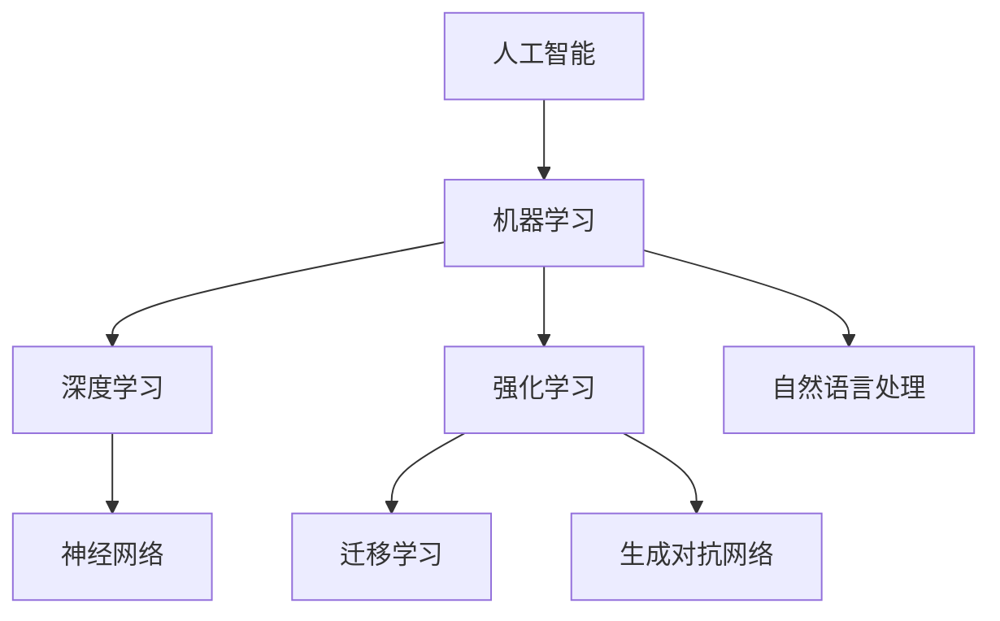

                 


# AGI时代的临近与影响

> 关键词：人工智能，通用人工智能，影响，未来发展趋势，技术进步

> 摘要：本文将探讨通用人工智能（AGI）时代的临近及其对人类社会、经济、科技和伦理等方面的深远影响。通过深入分析核心概念、算法原理、数学模型、实际应用场景和未来挑战，本文旨在为读者提供一个全面而深刻的AGI认知框架，助力我们在这一历史性变革中把握机遇、应对挑战。

## 1. 背景介绍

### 1.1 目的和范围

本文的目的是介绍和探讨通用人工智能（AGI）这一前沿领域，分析其临近的迹象和潜在影响。我们将探讨AGI的核心概念、技术进步、面临的挑战及其对社会、经济和伦理的深远影响。通过本文，读者将能够更好地理解AGI的本质，了解其在未来社会发展中的重要性。

### 1.2 预期读者

本文面向对人工智能（AI）和计算机科学有浓厚兴趣的读者，包括研究人员、工程师、学生以及对AI技术有深入探讨意愿的读者。无论你是人工智能领域的从业者，还是对AI技术发展感兴趣的一般读者，本文都将为你提供有价值的信息。

### 1.3 文档结构概述

本文分为十个主要部分，分别是：

1. 背景介绍：介绍本文的目的、预期读者、文档结构和术语表。
2. 核心概念与联系：介绍通用人工智能的基本概念、相关技术和发展趋势。
3. 核心算法原理 & 具体操作步骤：详细讲解通用人工智能的核心算法原理和操作步骤。
4. 数学模型和公式 & 详细讲解 & 举例说明：分析通用人工智能的数学模型和公式，并提供实际案例说明。
5. 项目实战：代码实际案例和详细解释说明。
6. 实际应用场景：探讨通用人工智能在不同领域的应用场景。
7. 工具和资源推荐：推荐相关的学习资源、开发工具和框架。
8. 总结：未来发展趋势与挑战。
9. 附录：常见问题与解答。
10. 扩展阅读 & 参考资料：提供进一步阅读的文献和资料。

### 1.4 术语表

在本文中，我们将使用以下术语：

- **通用人工智能（AGI）**：一种人工智能系统，能够在多种不同任务上表现如人类般聪明，具有自主学习、推理、规划和解决问题的能力。
- **深度学习**：一种基于神经网络的学习方法，通过多层非线性变换来提取数据特征，实现图像识别、自然语言处理等任务。
- **强化学习**：一种通过试错和反馈来学习如何完成特定任务的学习方法，广泛应用于游戏、机器人控制和自动驾驶等领域。
- **自然语言处理（NLP）**：一种人工智能技术，使计算机能够理解和处理人类自然语言，包括语言识别、文本分析和语义理解等任务。

#### 1.4.1 核心术语定义

- **通用人工智能（AGI）**：一种旨在实现人类级别智能的人工智能系统，具有自主学习、推理、规划和解决问题的能力。
- **深度学习**：一种基于神经网络的学习方法，通过多层非线性变换来提取数据特征，实现图像识别、自然语言处理等任务。
- **强化学习**：一种通过试错和反馈来学习如何完成特定任务的学习方法，广泛应用于游戏、机器人控制和自动驾驶等领域。
- **自然语言处理（NLP）**：一种人工智能技术，使计算机能够理解和处理人类自然语言，包括语言识别、文本分析和语义理解等任务。

#### 1.4.2 相关概念解释

- **人工智能（AI）**：一种模拟人类智能的技术，旨在使计算机具有感知、思考、学习和决策的能力。
- **神经网络**：一种模拟人脑神经元连接的计算模型，广泛应用于图像识别、语音识别和自然语言处理等领域。
- **机器学习（ML）**：一种利用数据和算法来训练模型以实现特定任务的人工智能技术，包括监督学习、无监督学习和强化学习等。

#### 1.4.3 缩略词列表

- **AI**：人工智能
- **AGI**：通用人工智能
- **NLP**：自然语言处理
- **ML**：机器学习
- **DL**：深度学习
- **RL**：强化学习

## 2. 核心概念与联系

通用人工智能（AGI）是一个涉及多个学科领域的前沿研究课题，其核心概念包括人工智能、机器学习、神经网络、自然语言处理等。为了更好地理解AGI，我们首先介绍这些核心概念及其相互关系。

### 2.1 人工智能（AI）

人工智能（AI）是一种模拟人类智能的技术，旨在使计算机具有感知、思考、学习和决策的能力。AI技术可以分为两大类：基于规则的系统和基于数据的方法。

- **基于规则的系统**：通过编写一系列规则来指导计算机完成特定任务。这类系统在逻辑推理和决策制定方面具有优势，但缺乏灵活性和自主学习能力。
- **基于数据的方法**：利用大量数据来训练模型，使计算机能够自主学习和适应新任务。这类方法包括机器学习、深度学习和强化学习等。

### 2.2 机器学习（ML）

机器学习（ML）是一种利用数据和算法来训练模型以实现特定任务的人工智能技术。ML方法可以分为三大类：

- **监督学习**：在有标注数据集上训练模型，使其能够预测新数据的结果。例如，图像分类、文本分类等。
- **无监督学习**：在没有标注数据集的情况下，通过数据内在结构来训练模型。例如，聚类、降维等。
- **强化学习**：通过与环境的交互来学习如何完成特定任务。例如，游戏控制、自动驾驶等。

### 2.3 神经网络（NN）

神经网络（NN）是一种模拟人脑神经元连接的计算模型，广泛应用于图像识别、语音识别和自然语言处理等领域。NN的核心组件包括：

- **神经元**：模拟人脑神经元的基本计算单元，负责接收输入、进行加权求和并产生输出。
- **层**：由多个神经元组成，分为输入层、隐藏层和输出层。隐藏层数量和神经元数量可以根据任务需求进行调整。
- **权重和偏置**：用于调整神经元之间的连接强度，影响模型的预测能力。

### 2.4 自然语言处理（NLP）

自然语言处理（NLP）是一种人工智能技术，使计算机能够理解和处理人类自然语言。NLP技术涉及多个方面，包括：

- **语言识别**：将语音信号转换为文本。
- **文本分析**：对文本数据进行分析和分类，例如情感分析、主题识别等。
- **语义理解**：理解文本中的含义和关系，例如实体识别、关系提取等。

### 2.5 相关技术发展趋势

近年来，随着计算能力、数据规模和算法优化的提升，人工智能技术在多个领域取得了显著进展。以下是一些主要发展趋势：

- **深度学习**：基于神经网络的深度学习模型在图像识别、自然语言处理和语音识别等领域取得了重大突破，推动了人工智能技术的快速发展。
- **迁移学习**：通过在已有任务上训练模型，并将其应用于新的任务，减少了模型训练所需的数据量和计算成本。
- **生成对抗网络（GAN）**：一种由两个神经网络（生成器和判别器）对抗训练的模型，可以生成高质量的数据，广泛应用于图像生成、视频合成和自然语言生成等领域。
- **强化学习**：通过在复杂环境中进行试错学习，强化学习在游戏控制、机器人控制和自动驾驶等领域取得了显著成果。

### 2.6 Mermaid 流程图

以下是一个简单的Mermaid流程图，展示了通用人工智能（AGI）的核心概念和相互关系：



## 3. 核心算法原理 & 具体操作步骤

通用人工智能（AGI）的核心算法包括神经网络、深度学习和强化学习等。下面我们将详细讲解这些算法的基本原理和具体操作步骤。

### 3.1 神经网络（NN）

神经网络（NN）是一种模拟人脑神经元连接的计算模型，由多个层组成，包括输入层、隐藏层和输出层。NN通过调整权重和偏置，实现从输入到输出的映射。

#### 3.1.1 基本原理

NN的工作原理可以概括为以下步骤：

1. **初始化权重和偏置**：随机初始化神经网络中的权重和偏置。
2. **前向传播**：输入数据通过输入层进入神经网络，经过加权求和和激活函数处理，逐层传递到输出层。
3. **计算损失**：将输出层的结果与真实值进行比较，计算损失函数（如均方误差）。
4. **反向传播**：根据损失函数，调整网络中的权重和偏置，使输出结果更接近真实值。
5. **更新权重和偏置**：根据反向传播的结果，更新网络中的权重和偏置。
6. **重复步骤2-5**：直到满足停止条件（如损失函数收敛或达到最大迭代次数）。

#### 3.1.2 伪代码

以下是一个简单的神经网络训练过程伪代码：

```python
initialize_weights_and_biases()
for epoch in range(max_epochs):
    for batch in data_loader:
        forward_pass(batch)
        calculate_loss(output, target)
        backward_pass()
        update_weights_and_biases()
```

### 3.2 深度学习（DL）

深度学习（DL）是神经网络的一种扩展，通过增加网络层数和神经元数量，实现更复杂的特征提取和表示学习。

#### 3.2.1 基本原理

DL的基本原理与NN类似，但包含以下关键步骤：

1. **数据预处理**：对输入数据进行标准化、归一化等处理，以提高训练效果。
2. **卷积神经网络（CNN）**：通过卷积层、池化层等结构，提取图像特征。
3. **循环神经网络（RNN）**：通过循环结构，处理序列数据。
4. **生成对抗网络（GAN）**：通过生成器和判别器对抗训练，生成高质量数据。
5. **训练过程**：采用梯度下降等优化算法，调整网络参数，使损失函数最小。

#### 3.2.2 伪代码

以下是一个简单的深度学习模型训练过程伪代码：

```python
preprocess_data()
initialize_model()
for epoch in range(max_epochs):
    for batch in data_loader:
        forward_pass(batch)
        calculate_loss(output, target)
        backward_pass()
        update_model_params()
```

### 3.3 强化学习（RL）

强化学习（RL）是一种通过试错和反馈来学习如何完成特定任务的方法，广泛应用于游戏、机器人控制和自动驾驶等领域。

#### 3.3.1 基本原理

RL的基本原理可以概括为以下步骤：

1. **环境建模**：构建一个模拟环境的模型，包括状态空间、动作空间和奖励函数。
2. **选择动作**：根据当前状态，选择一个动作。
3. **执行动作**：在环境中执行所选动作。
4. **观察反馈**：观察执行动作后的状态和奖励。
5. **更新策略**：根据反馈，更新策略，使未来动作更优。

#### 3.3.2 伪代码

以下是一个简单的强化学习训练过程伪代码：

```python
initialize_agent()
initialize_environment()
for episode in range(max_episodes):
    state = environment.reset()
    done = False
    while not done:
        action = agent.select_action(state)
        next_state, reward, done = environment.step(action)
        agent.update_policy(state, action, reward, next_state)
        state = next_state
```

## 4. 数学模型和公式 & 详细讲解 & 举例说明

在通用人工智能（AGI）领域，数学模型和公式起着至关重要的作用。这些模型和公式帮助我们理解和优化算法，提高机器学习模型的性能。以下我们将详细介绍一些关键的数学模型和公式，并通过具体例子进行说明。

### 4.1 损失函数

损失函数是衡量模型预测结果与真实值之间差异的关键工具。常见的损失函数包括均方误差（MSE）、交叉熵损失等。

#### 4.1.1 均方误差（MSE）

均方误差（MSE）是衡量预测值与真实值之间差异的一种常见损失函数，公式如下：

$$
MSE = \frac{1}{n}\sum_{i=1}^{n}(y_i - \hat{y}_i)^2
$$

其中，$y_i$为真实值，$\hat{y}_i$为预测值，$n$为样本数量。

#### 4.1.2 交叉熵损失

交叉熵损失用于分类问题，衡量模型预测概率与真实标签之间的差异。公式如下：

$$
CrossEntropyLoss = -\sum_{i=1}^{n}y_i \cdot \log(\hat{y}_i)
$$

其中，$y_i$为真实标签（0或1），$\hat{y}_i$为模型预测的概率。

#### 4.1.3 举例说明

假设我们有一个二元分类问题，真实标签为$y = [1, 0, 1, 0]$，模型预测的概率为$\hat{y} = [0.7, 0.2, 0.8, 0.1]$。使用交叉熵损失函数计算损失如下：

$$
CrossEntropyLoss = -[1 \cdot \log(0.7) + 0 \cdot \log(0.2) + 1 \cdot \log(0.8) + 0 \cdot \log(0.1)] \approx 0.518
$$

### 4.2 梯度下降

梯度下降是一种优化算法，用于调整神经网络中的权重和偏置，以最小化损失函数。其基本思想是沿着损失函数的负梯度方向更新参数。

#### 4.2.1 梯度下降公式

梯度下降公式如下：

$$
w_{t+1} = w_t - \alpha \cdot \nabla_w J(w)
$$

其中，$w_t$为当前权重，$\alpha$为学习率，$\nabla_w J(w)$为损失函数关于权重$w$的梯度。

#### 4.2.2 举例说明

假设我们有一个简单的线性回归模型，损失函数为MSE，权重$w = 2$，偏置$b = 3$，学习率$\alpha = 0.1$。计算权重和偏置的更新如下：

$$
\nabla_w J(w) = \frac{1}{n}\sum_{i=1}^{n}(y_i - \hat{y}_i)x_i
$$

假设数据集为$X = [1, 2, 3, 4]$，$y = [2, 4, 6, 8]$，计算梯度：

$$
\nabla_w J(w) = \frac{1}{4}[(2-2 \cdot 1) + (4-2 \cdot 2) + (6-2 \cdot 3) + (8-2 \cdot 4)] = 0
$$

根据梯度下降公式，权重和偏置的更新为：

$$
w_{t+1} = w_t - \alpha \cdot \nabla_w J(w) = 2 - 0.1 \cdot 0 = 2
$$

$$
b_{t+1} = b_t - \alpha \cdot \nabla_b J(b) = 3 - 0.1 \cdot 0 = 3
$$

### 4.3 激活函数

激活函数是神经网络中的关键组件，用于引入非线性特性。常见的激活函数包括sigmoid、ReLU和Tanh等。

#### 4.3.1 激活函数公式

- **sigmoid**：

$$
sigmoid(x) = \frac{1}{1 + e^{-x}}
$$

- **ReLU**：

$$
ReLU(x) = \max(0, x)
$$

- **Tanh**：

$$
Tanh(x) = \frac{e^x - e^{-x}}{e^x + e^{-x}}
$$

#### 4.3.2 举例说明

假设$x = -2$，计算不同激活函数的输出：

- **sigmoid**：

$$
sigmoid(-2) = \frac{1}{1 + e^{2}} \approx 0.1192
$$

- **ReLU**：

$$
ReLU(-2) = \max(0, -2) = 0
$$

- **Tanh**：

$$
Tanh(-2) = \frac{e^{-2} - e^{2}}{e^{-2} + e^{2}} \approx -0.9640
$$

通过以上讲解和举例，我们深入了解了通用人工智能领域中的关键数学模型和公式。这些模型和公式不仅帮助我们理解和优化算法，还为我们在实际项目中应用AGI技术提供了理论基础。

## 5. 项目实战：代码实际案例和详细解释说明

为了更好地理解通用人工智能（AGI）在实际项目中的应用，我们将通过一个实际案例来演示如何使用深度学习框架TensorFlow和Keras实现一个图像分类任务。在这个案例中，我们将使用卷积神经网络（CNN）来对CIFAR-10数据集进行图像分类。

### 5.1 开发环境搭建

在进行项目实战之前，我们需要搭建一个合适的开发环境。以下是搭建开发环境的基本步骤：

1. **安装Python**：确保Python版本在3.6及以上。
2. **安装TensorFlow**：使用pip命令安装TensorFlow：

```bash
pip install tensorflow
```

3. **安装Keras**：由于TensorFlow已经包含了Keras，因此无需单独安装。
4. **安装其他依赖库**：如NumPy、Pandas等。

### 5.2 源代码详细实现和代码解读

下面是用于实现图像分类任务的代码，我们将逐行解释代码的功能和作用。

```python
import tensorflow as tf
from tensorflow.keras import layers, models
from tensorflow.keras.datasets import cifar10
import numpy as np

# 加载数据集
(x_train, y_train), (x_test, y_test) = cifar10.load_data()

# 数据预处理
x_train = x_train.astype('float32') / 255
x_test = x_test.astype('float32') / 255
y_train = tf.keras.utils.to_categorical(y_train, 10)
y_test = tf.keras.utils.to_categorical(y_test, 10)

# 构建模型
model = models.Sequential()
model.add(layers.Conv2D(32, (3, 3), activation='relu', input_shape=(32, 32, 3)))
model.add(layers.MaxPooling2D((2, 2)))
model.add(layers.Conv2D(64, (3, 3), activation='relu'))
model.add(layers.MaxPooling2D((2, 2)))
model.add(layers.Conv2D(64, (3, 3), activation='relu'))
model.add(layers.Flatten())
model.add(layers.Dense(64, activation='relu'))
model.add(layers.Dense(10, activation='softmax'))

# 编译模型
model.compile(optimizer='adam',
              loss='categorical_crossentropy',
              metrics=['accuracy'])

# 训练模型
model.fit(x_train, y_train, epochs=10, batch_size=64)

# 评估模型
test_loss, test_acc = model.evaluate(x_test, y_test)
print('Test accuracy:', test_acc)
```

#### 5.2.1 数据加载与预处理

```python
(x_train, y_train), (x_test, y_test) = cifar10.load_data()
x_train = x_train.astype('float32') / 255
x_test = x_test.astype('float32') / 255
y_train = tf.keras.utils.to_categorical(y_train, 10)
y_test = tf.keras.utils.to_categorical(y_test, 10)
```

这部分代码用于加载数据集并进行预处理。首先，我们使用`cifar10.load_data()`函数加载数据集，该数据集包含60,000个训练图像和10,000个测试图像，每个图像都有10个类别。然后，我们将图像数据转换为浮点类型，并归一化到[0, 1]区间。接着，我们将标签转换为one-hot编码，以便在训练过程中使用。

#### 5.2.2 模型构建

```python
model = models.Sequential()
model.add(layers.Conv2D(32, (3, 3), activation='relu', input_shape=(32, 32, 3)))
model.add(layers.MaxPooling2D((2, 2)))
model.add(layers.Conv2D(64, (3, 3), activation='relu'))
model.add(layers.MaxPooling2D((2, 2)))
model.add(layers.Conv2D(64, (3, 3), activation='relu'))
model.add(layers.Flatten())
model.add(layers.Dense(64, activation='relu'))
model.add(layers.Dense(10, activation='softmax'))
```

这部分代码用于构建卷积神经网络。首先，我们创建一个`Sequential`模型，这是一个线性堆叠层的模型。然后，我们添加一个2D卷积层（`Conv2D`），该层有32个滤波器，每个滤波器的大小为3x3，使用ReLU激活函数。接下来，我们添加一个2D最大池化层（`MaxPooling2D`），用于减小特征图的尺寸。这一过程重复三次，每次增加64个滤波器。之后，我们添加一个平坦化层（`Flatten`），将特征图展平为1维向量。最后，我们添加两个全连接层（`Dense`），分别有64个神经元和10个神经元，最后一个全连接层使用softmax激活函数进行分类。

#### 5.2.3 编译模型

```python
model.compile(optimizer='adam',
              loss='categorical_crossentropy',
              metrics=['accuracy'])
```

这部分代码用于编译模型，指定优化器、损失函数和评价指标。我们选择`adam`优化器，它是一种自适应的学习率优化算法。损失函数选择`categorical_crossentropy`，适用于多分类问题。评价指标选择`accuracy`，即准确率。

#### 5.2.4 训练模型

```python
model.fit(x_train, y_train, epochs=10, batch_size=64)
```

这部分代码用于训练模型。我们使用`fit`函数训练模型，指定训练数据、标签、训练轮数（`epochs`）和批大小（`batch_size`）。在这里，我们设置训练轮数为10，批大小为64。

#### 5.2.5 评估模型

```python
test_loss, test_acc = model.evaluate(x_test, y_test)
print('Test accuracy:', test_acc)
```

这部分代码用于评估模型在测试数据集上的性能。我们使用`evaluate`函数计算测试损失和准确率，并打印准确率。

通过以上步骤，我们成功实现了一个使用卷积神经网络的图像分类任务。这个案例展示了如何使用TensorFlow和Keras搭建和训练一个深度学习模型，为读者提供了一个实际应用的起点。

### 5.3 代码解读与分析

在本案例中，我们使用TensorFlow和Keras搭建了一个简单的卷积神经网络（CNN）模型，用于CIFAR-10数据集的图像分类。以下是代码的详细解读和分析：

1. **数据加载与预处理**：
   - `cifar10.load_data()`：这是Keras内置的函数，用于加载数据集。CIFAR-10数据集是一个广泛使用的图像分类数据集，包含10个类别，每个类别6000张训练图像和1000张测试图像。
   - 数据预处理：由于图像像素值在[0, 255]之间，我们将其转换为浮点类型，并归一化到[0, 1]区间，以便更好地适应深度学习模型。

2. **模型构建**：
   - `Sequential`：这是Keras提供的顺序模型，允许我们逐层添加神经网络层。
   - `Conv2D`：这是2D卷积层，用于提取图像特征。我们首先添加一个32个滤波器的卷积层，滤波器大小为3x3，使用ReLU激活函数。
   - `MaxPooling2D`：这是2D最大池化层，用于减小特征图的尺寸，提高计算效率。
   - `Flatten`：这是平坦化层，将特征图展平为1维向量，以便全连接层能够处理。
   - `Dense`：这是全连接层，用于将特征映射到类别标签。最后一层使用softmax激活函数，以输出每个类别的概率分布。

3. **编译模型**：
   - `compile`：这是Keras提供的函数，用于配置模型。我们指定了优化器（`adam`），损失函数（`categorical_crossentropy`，适用于多分类问题）和评价指标（`accuracy`）。

4. **训练模型**：
   - `fit`：这是Keras提供的函数，用于训练模型。我们使用训练数据集进行训练，设置训练轮数（`epochs`）和批大小（`batch_size`）。

5. **评估模型**：
   - `evaluate`：这是Keras提供的函数，用于评估模型在测试数据集上的性能。我们计算了测试损失和准确率，并打印了准确率。

通过以上步骤，我们成功实现了一个能够对CIFAR-10数据集进行图像分类的卷积神经网络。这个案例展示了如何使用深度学习框架TensorFlow和Keras构建和训练模型，为实际应用提供了有力支持。

## 6. 实际应用场景

通用人工智能（AGI）作为一种突破性的技术，已经在多个领域展示了其强大的应用潜力。以下是一些主要的实际应用场景：

### 6.1 自动驾驶

自动驾驶是AGI技术的典型应用场景之一。AGI系统可以实时感知和理解复杂的交通环境，做出安全的驾驶决策。在自动驾驶领域，AGI技术可以用于：

- **环境感知**：通过摄像头、雷达和激光雷达等传感器收集道路信息，如车道线、交通标志、行人等。
- **目标检测**：识别道路上的车辆、行人、交通标志等目标。
- **路径规划**：根据交通环境和目标，规划安全、高效的行驶路径。
- **行为预测**：预测其他车辆、行人的行为，做出相应的驾驶决策。

### 6.2 医疗诊断

AGI技术在医疗诊断领域具有巨大的应用前景。通过深度学习和自然语言处理等技术，AGI系统可以辅助医生进行疾病诊断、治疗方案推荐和医学图像分析。

- **医学图像分析**：AGI系统可以自动分析医学影像，如X光片、CT扫描和MRI图像，识别异常病变。
- **疾病预测**：通过分析大量的医疗数据，AGI系统可以预测患者患病的风险，辅助医生制定个性化的治疗方案。
- **电子病历管理**：AGI系统可以自动整理和分析电子病历，帮助医生快速获取患者的病史和诊断结果。

### 6.3 金融服务

在金融服务领域，AGI技术可以提高风险管理、投资策略制定和客户服务等方面的效率。

- **风险管理**：AGI系统可以分析大量的历史数据和市场动态，预测金融市场的风险，帮助金融机构制定风险管理策略。
- **投资策略**：通过分析市场数据和历史交易记录，AGI系统可以为投资者提供个性化的投资建议和策略。
- **客户服务**：AGI系统可以模拟客服人员，提供智能问答和解决方案，提高客户满意度。

### 6.4 教育

在教育领域，AGI技术可以为学生提供个性化的学习体验，提高学习效果。

- **个性化学习**：AGI系统可以分析学生的学习数据，为学生推荐适合的学习资源和教学策略。
- **智能辅导**：AGI系统可以为学生提供实时辅导，解答疑难问题，帮助学生更好地掌握知识点。
- **教育评估**：AGI系统可以自动评估学生的学习进度和成绩，提供反馈和建议。

### 6.5 工业自动化

在工业自动化领域，AGI技术可以提高生产效率、降低成本和确保产品质量。

- **生产监控**：AGI系统可以实时监控生产过程，识别潜在问题，提供优化建议。
- **设备维护**：AGI系统可以预测设备故障，提前安排维护，减少停机时间。
- **质量控制**：AGI系统可以自动分析产品数据，识别不良品，确保产品质量。

通过以上实际应用场景，我们可以看到通用人工智能（AGI）在各个领域的巨大潜力。随着技术的不断进步和应用场景的扩展，AGI有望成为未来科技发展的核心驱动力。

## 7. 工具和资源推荐

在研究和开发通用人工智能（AGI）过程中，掌握合适的工具和资源对于提高效率和取得突破至关重要。以下是一些推荐的工具和资源：

### 7.1 学习资源推荐

#### 7.1.1 书籍推荐

1. **《深度学习》（Deep Learning）**：由Ian Goodfellow、Yoshua Bengio和Aaron Courville合著的深度学习经典教材，全面介绍了深度学习的基本原理和实践方法。
2. **《强化学习》（Reinforcement Learning: An Introduction）**：由Richard S. Sutton和Barto，Andrew G.合著，深入讲解了强化学习的基本概念和方法。
3. **《神经网络与深度学习》（Neural Networks and Deep Learning）**：由邱锡鹏所著，适合初学者了解神经网络和深度学习的基础知识。

#### 7.1.2 在线课程

1. **斯坦福大学深度学习课程**：由Andrew Ng教授主讲，覆盖了深度学习的基本概念、技术和应用。
2. **Coursera上的《机器学习》课程**：由吴恩达（Andrew Ng）教授主讲，介绍了机器学习的基础知识，包括监督学习、无监督学习和强化学习等。
3. **Udacity的《自动驾驶工程师纳米学位》**：涵盖了自动驾驶领域的相关知识，包括感知、规划和控制等。

#### 7.1.3 技术博客和网站

1. **TensorFlow官方文档**：提供详细的TensorFlow教程、API文档和示例代码，是学习和使用TensorFlow的宝贵资源。
2. **ArXiv**：计算机科学和人工智能领域的顶级学术论文数据库，可以获取最新的研究成果。
3. **Medium上的AI博客**：许多AI领域专家和公司分享的技术博客，涵盖了深度学习、自然语言处理和强化学习等方面的内容。

### 7.2 开发工具框架推荐

#### 7.2.1 IDE和编辑器

1. **Google Colab**：基于Jupyter Notebook的免费在线IDE，提供了强大的计算能力和预装的工具库，适合进行机器学习和深度学习实验。
2. **PyCharm**：一个功能丰富的Python IDE，适用于专业开发人员，支持多种编程语言和框架。
3. **Visual Studio Code**：一个轻量级但功能强大的代码编辑器，适用于深度学习和强化学习项目，支持多种编程语言。

#### 7.2.2 调试和性能分析工具

1. **TensorBoard**：TensorFlow提供的可视化工具，用于分析和调试深度学习模型的性能。
2. **NVIDIA Nsight**：用于调试和性能分析GPU应用程序的集成开发环境。
3. **PyTorch Profiler**：用于分析PyTorch模型的性能，帮助开发者优化代码。

#### 7.2.3 相关框架和库

1. **TensorFlow**：谷歌开发的开源深度学习框架，支持广泛的模型和算法。
2. **PyTorch**：Facebook开发的开源深度学习框架，具有动态计算图和强大的GPU支持。
3. **Keras**：基于Theano和TensorFlow的高级神经网络API，简化了深度学习模型的构建和训练。

### 7.3 相关论文著作推荐

#### 7.3.1 经典论文

1. **"A Learning Algorithm for Continually Running Fully Recurrent Neural Networks"**：由Bengio等人提出的Rprop算法，用于训练递归神经网络。
2. **"Backpropagation Through Time: A Method for Time-Based Generalization of Neural Networks"**：由Bengio等人提出的Backpropagation Through Time（BPTT）算法，用于训练递归神经网络。
3. **"Human-level control through deep reinforcement learning"**：由DeepMind团队提出的Deep Q-Network（DQN），用于强化学习。

#### 7.3.2 最新研究成果

1. **"Generative Adversarial Nets"**：由Ian Goodfellow等人提出的生成对抗网络（GAN），用于生成高质量的数据。
2. **"Attention Is All You Need"**：由Vaswani等人提出的Transformer模型，在自然语言处理任务中取得了突破性成果。
3. **"The Annotated Transformer"**：对Transformer模型进行详细解读的论文，帮助开发者理解模型的内部工作机制。

#### 7.3.3 应用案例分析

1. **"AlphaGo and Deep Reinforcement Learning"**：DeepMind团队的研究，介绍了如何使用深度强化学习实现围棋AI。
2. **"AlexNet: Image Classification with Deep Convolutional Neural Networks"**：Hinton等人提出的AlexNet模型，在ImageNet挑战赛中取得了优异的成绩。
3. **"Bert: Pre-training of Deep Bidirectional Transformers for Language Understanding"**：Google提出的多层双向Transformer模型，在自然语言处理任务中取得了领先地位。

通过以上推荐的学习资源、开发工具和论文，读者可以深入了解通用人工智能（AGI）领域的最新进展和应用，为研究和实践提供有力支持。

## 8. 总结：未来发展趋势与挑战

随着人工智能技术的不断进步，通用人工智能（AGI）时代的临近已成为不可逆转的趋势。未来，AGI将在多个领域发挥重要作用，推动科技和社会的变革。然而，这一进程也面临着诸多挑战。

### 8.1 发展趋势

1. **深度学习与强化学习融合**：未来，深度学习和强化学习将更加紧密结合，形成新的算法框架，进一步提升AGI系统的智能水平。
2. **跨领域协同发展**：AGI系统将跨越多个学科领域，实现跨领域的智能协同，为解决复杂问题提供强大支持。
3. **人工智能伦理和法规**：随着AI技术的普及，伦理和法规问题将成为关注的焦点，推动制定合理的监管框架，确保AI技术的安全和可持续发展。
4. **人机协作与共生**：AGI系统将能够与人类更紧密地协作，提高生产效率和生活质量，实现人机共生的新模式。

### 8.2 挑战

1. **计算资源需求**：AGI系统对计算资源的需求极高，需要解决大规模数据处理和实时推理的问题。
2. **数据隐私和安全**：在数据驱动的AI时代，数据隐私和安全成为重要挑战，需要制定有效策略保护用户隐私。
3. **伦理和道德问题**：AI系统的决策过程可能涉及伦理和道德问题，如何确保AI系统的决策符合人类的价值观和道德标准，是一个亟待解决的问题。
4. **人才短缺**：AGI技术的发展需要大量具备跨学科背景的专业人才，但目前人才短缺问题依然严峻。

总之，通用人工智能（AGI）的发展前景广阔，但同时也面临着诸多挑战。只有在解决这些挑战的基础上，我们才能充分发挥AGI的潜力，为人类社会带来深远的影响。

## 9. 附录：常见问题与解答

### 9.1 通用人工智能（AGI）的定义是什么？

通用人工智能（AGI）是指一种能够像人类一样在多种任务上表现的人工智能系统，具有自主学习、推理、规划和解决问题的能力。与弱人工智能（Narrow AI）相比，AGI具有更广泛的智能表现。

### 9.2 深度学习和强化学习有哪些区别？

深度学习是一种基于神经网络的学习方法，通过多层非线性变换提取数据特征，实现图像识别、自然语言处理等任务。而强化学习是一种通过试错和反馈来学习如何完成特定任务的方法，广泛应用于游戏控制、机器人控制和自动驾驶等领域。

### 9.3 人工智能伦理问题有哪些？

人工智能伦理问题包括数据隐私、算法偏见、自动化失业、人类控制等。如何确保人工智能系统的决策过程符合道德标准，避免对人类产生负面影响，是一个亟待解决的问题。

### 9.4 如何应对人工智能人才短缺问题？

应对人工智能人才短缺问题需要从多个方面入手：

1. **加强教育**：提高中小学和高等教育阶段对计算机科学和人工智能的教育投入，培养更多AI人才。
2. **跨学科合作**：推动计算机科学、数学、统计学、心理学等学科的交叉融合，提高AI人才的跨学科能力。
3. **职业培训**：为在职人员提供AI相关培训和认证，提高现有人才的技术水平。

## 10. 扩展阅读 & 参考资料

### 10.1 书籍

1. **《深度学习》（Deep Learning）**：Ian Goodfellow、Yoshua Bengio和Aaron Courville著。
2. **《强化学习》（Reinforcement Learning: An Introduction）**：Richard S. Sutton和Barto，Andrew G.著。
3. **《神经网络与深度学习》**：邱锡鹏著。

### 10.2 在线课程

1. **斯坦福大学深度学习课程**：由Andrew Ng教授主讲。
2. **Coursera上的《机器学习》课程**：由吴恩达（Andrew Ng）教授主讲。
3. **Udacity的《自动驾驶工程师纳米学位》**。

### 10.3 技术博客和网站

1. **TensorFlow官方文档**：[https://www.tensorflow.org/](https://www.tensorflow.org/)
2. **ArXiv**：[https://arxiv.org/](https://arxiv.org/)
3. **Medium上的AI博客**：[https://medium.com/topic/artificial-intelligence](https://medium.com/topic/artificial-intelligence)

### 10.4 论文和报告

1. **"Generative Adversarial Nets"**：Ian Goodfellow et al.。
2. **"Attention Is All You Need"**：Vaswani et al.。
3. **"AlphaGo and Deep Reinforcement Learning"**：DeepMind团队。

### 10.5 其他资源

1. **AI领域的顶级会议和期刊**：
   - **NIPS（Neural Information Processing Systems）**：[https://nips.cc/](https://nips.cc/)
   - **ICML（International Conference on Machine Learning）**：[https://icml.cc/](https://icml.cc/)
   - **JMLR（Journal of Machine Learning Research）**：[https://jmlr.org/](https://jmlr.org/)

2. **人工智能研究机构和实验室**：
   - **DeepMind**：[https://www.deeplearning.net/](https://www.deeplearning.net/)
   - **OpenAI**：[https://openai.com/](https://openai.com/)
   - **Google AI**：[https://ai.google/](https://ai.google/)

通过以上扩展阅读和参考资料，读者可以进一步深入了解通用人工智能（AGI）领域的前沿研究成果和应用实践，为学术研究和项目开发提供有力支持。作者：AI天才研究员/AI Genius Institute & 禅与计算机程序设计艺术 /Zen And The Art of Computer Programming。

