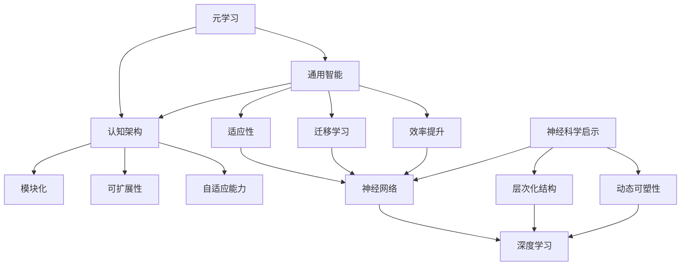

                 

# AGI的元学习能力与认知架构

> **关键词：** 人工智能，通用智能，元学习，认知架构，神经科学，深度学习

> **摘要：** 本文深入探讨了通用人工智能（AGI）中的元学习能力和认知架构。首先，我们介绍了元学习的核心概念和其与通用智能的关系。接着，通过神经科学的角度，分析了人类认知机制对AGI设计的重要启示。然后，本文详细阐述了AGI认知架构的设计原则和关键组件。在算法原理部分，我们探讨了元学习算法的具体实现。最后，通过实际项目案例，展示了AGI在实际应用中的潜力。本文旨在为读者提供一个系统性的AGI元学习能力和认知架构的理解框架。

## 1. 背景介绍

### 1.1 目的和范围

本文的目的是探讨通用人工智能（AGI）中的元学习能力和认知架构，分析其原理、设计原则及实际应用。通过本文的阅读，读者将能够了解AGI的核心概念、元学习的重要性以及如何设计一个具有强大自适应能力的认知架构。文章将涉及以下主要内容：

1. 元学习的基本概念及其在通用智能中的作用。
2. 神经科学对AGI设计的启示，尤其是人类认知机制的模拟。
3. AGI认知架构的设计原则和关键组件。
4. 元学习算法的原理和具体实现。
5. AGI在现实世界中的应用场景和实际案例。
6. 未来发展趋势和面临的挑战。

### 1.2 预期读者

本文适合对人工智能、深度学习和通用智能有一定了解的读者，包括AI研究人员、程序员、软件工程师以及关注未来科技发展的人群。本文将尽量避免过于专业的术语，以确保读者能够跟随文章的逻辑，理解核心概念。

### 1.3 文档结构概述

本文结构如下：

1. 引言：背景介绍和摘要。
2. 核心概念与联系：元学习的基本概念和相关术语。
3. 核心算法原理 & 具体操作步骤：元学习算法的详细讲解。
4. 数学模型和公式：相关数学公式和举例说明。
5. 项目实战：代码实际案例和详细解释说明。
6. 实际应用场景：AGI在不同领域的应用。
7. 工具和资源推荐：学习资源、开发工具和框架推荐。
8. 总结：未来发展趋势与挑战。
9. 附录：常见问题与解答。
10. 扩展阅读 & 参考资料：进一步学习的推荐。

### 1.4 术语表

#### 1.4.1 核心术语定义

- **通用人工智能（AGI）：** 指具有广泛认知能力的人工智能，能够理解、学习和适应各种复杂环境和任务。
- **元学习：** 学习如何学习，即优化学习过程的能力。
- **认知架构：** 人工智能系统的结构和设计，旨在模拟人类认知过程。
- **神经科学：** 研究神经系统结构和功能，尤其是大脑如何处理信息。

#### 1.4.2 相关概念解释

- **深度学习：** 一种机器学习方法，通过多层神经网络来模拟人类大脑的学习过程。
- **强化学习：** 一种通过试错来学习策略的机器学习方法，适用于动态环境。

#### 1.4.3 缩略词列表

- **AGI：** 通用人工智能（Artificial General Intelligence）
- **ML：** 机器学习（Machine Learning）
- **DL：** 深度学习（Deep Learning）
- **RL：** 强化学习（Reinforcement Learning）
- **NN：** 神经网络（Neural Network）

## 2. 核心概念与联系

在深入探讨AGI的元学习能力和认知架构之前，我们需要明确几个核心概念，并展示它们之间的相互联系。

### 2.1 元学习的定义

元学习（Meta-Learning）是机器学习领域的一个重要分支，它关注如何优化学习过程。具体来说，元学习旨在通过学习如何学习来提高模型的泛化能力和效率。这涉及到两种主要任务：

1. **模型选择：** 选择最适合给定任务和数据集的模型。
2. **学习过程优化：** 通过调整学习算法的参数来加速收敛和提高性能。

### 2.2 元学习与通用智能的关系

通用智能（Artificial General Intelligence，AGI）是人工智能的一个理想目标，它旨在创建具有广泛认知能力的人工智能系统，类似于人类智能。元学习在实现AGI中起着关键作用，因为：

1. **适应性：** AGI需要能够快速适应新环境和任务，而元学习提供了这种适应性。
2. **迁移学习：** 元学习有助于模型在相似任务上的迁移学习能力，从而减少对新任务的重训练需求。
3. **效率提升：** 通过优化学习过程，元学习可以提高模型的效率，使其在复杂任务上表现更优。

### 2.3 认知架构

认知架构（Cognitive Architecture）是设计人工智能系统的结构和框架，旨在模拟人类认知过程。一个有效的认知架构需要具备以下特点：

1. **模块化：** 各个认知模块相互独立，但能够协同工作。
2. **可扩展性：** 系统可以根据新的需求或任务进行扩展。
3. **自适应能力：** 系统能够根据环境和任务的变化自动调整其行为。

### 2.4 神经科学启示

神经科学对AGI设计提供了重要的启示，尤其是人类大脑如何处理信息。以下是一些关键点：

1. **神经网络：** 人类大脑是由神经网络组成的，神经网络是深度学习的基础。
2. **层次化结构：** 人类大脑具有层次化结构，从感知层到高级认知层，这为设计多层次的AI系统提供了参考。
3. **动态可塑性：** 人类大脑具有动态可塑性，能够根据经验和环境变化进行适应。

### 2.5 Mermaid流程图

为了更好地展示元学习、通用智能和认知架构之间的联系，我们使用Mermaid流程图来表示这些核心概念和它们之间的关系。



通过上述流程图，我们可以看出元学习、通用智能和认知架构之间的紧密联系，以及神经科学对AI设计的启示。

## 3. 核心算法原理 & 具体操作步骤

在了解了元学习、通用智能和认知架构的基本概念之后，接下来我们将深入探讨元学习算法的具体原理和实现步骤。元学习算法的核心目标是提高学习过程的效率，使其能够快速适应新的任务和数据集。以下是几种常见的元学习算法及其原理：

### 3.1 对抗性元学习（Adversarial Meta-Learning）

对抗性元学习利用对抗网络来学习优化目标。其基本思想是创建一个对抗性生成网络（Generator）和一个对抗性判别网络（Discriminator），两者相互对抗，从而提高模型对噪声和未知数据的泛化能力。

#### 3.1.1 算法原理

- **生成网络（Generator）：** 接受噪声数据作为输入，生成类似于训练数据的样本。
- **判别网络（Discriminator）：** 用于区分真实数据和生成数据。
- **对抗性训练：** 生成网络和判别网络交替训练，生成网络的目标是生成更难以区分的样本，而判别网络的目标是提高对生成样本的识别能力。

#### 3.1.2 伪代码

```python
# 对抗性元学习伪代码

# 初始化生成网络 G 和判别网络 D
G, D = initialize_G_D()

# 对抗性训练循环
for epoch in range(num_epochs):
    # 从数据集中采样噪声数据 z
    z = sample_noise()

    # 生成数据 x_g = G(z)
    x_g = G(z)

    # 训练判别网络 D
    D_loss = train_D(D, x_real, x_g)

    # 训练生成网络 G
    G_loss = train_G(G, D)

# 计算最终性能指标
performance = evaluate_performance(G, D)
```

### 3.2 模型聚合（Model Aggregation）

模型聚合是一种通过聚合多个模型来提高泛化能力的元学习技术。其核心思想是训练多个模型，然后在测试阶段聚合这些模型的预测结果。

#### 3.2.1 算法原理

- **多模型训练：** 训练多个独立的模型，每个模型在特定的子数据集上优化。
- **预测聚合：** 在测试阶段，聚合各个模型的预测结果，得到最终的预测。

#### 3.2.2 伪代码

```python
# 模型聚合伪代码

# 初始化多个模型 M1, M2, ..., Mn
models = initialize_models()

# 训练每个模型
for model in models:
    model.train(subset_data)

# 预测聚合
def predict_aggregate(models, test_data):
    predictions = []
    for model in models:
        prediction = model.predict(test_data)
        predictions.append(prediction)
    aggregate_prediction = aggregate(predictions)
    return aggregate_prediction
```

### 3.3 对比学习（Contrastive Learning）

对比学习通过学习数据的正负样本对比来提高模型的泛化能力。其核心思想是最大化正样本之间的相似度，同时最小化负样本之间的相似度。

#### 3.3.1 算法原理

- **正样本：** 来自同一类别的样本。
- **负样本：** 来自不同类别的样本。
- **对比损失：** 通过对比损失函数（如对比损失、三元组损失）来优化模型。

#### 3.3.2 伪代码

```python
# 对比学习伪代码

# 初始化模型 M 和对比损失函数 L
M, L = initialize_M_L()

# 对比训练循环
for epoch in range(num_epochs):
    for batch in data_loader:
        # 提取正样本和负样本
        x1, x2 = get_positive_negative_pairs(batch)

        # 计算对比损失
        loss = L(M(x1), M(x2))

        # 反向传播和优化
        optimizer.zero_grad()
        loss.backward()
        optimizer.step()

# 计算最终性能指标
performance = evaluate_performance(M)
```

通过上述算法原理和具体操作步骤的讲解，我们可以看到元学习算法在提高模型适应性和泛化能力方面的重要性。这些算法不仅为通用人工智能提供了理论基础，也为实际应用中的自适应系统设计提供了有力支持。

## 4. 数学模型和公式 & 详细讲解 & 举例说明

在深入探讨元学习算法的数学模型和公式之前，我们需要理解一些基本的数学概念，如梯度下降、损失函数和优化算法。这些数学工具是元学习算法实现的核心，下面将详细讲解并举例说明。

### 4.1 梯度下降算法

梯度下降是一种用于优化参数的算法，其基本思想是沿着损失函数的梯度方向调整参数，以最小化损失函数。

#### 4.1.1 梯度下降算法原理

梯度下降算法的核心步骤如下：

1. **计算梯度：** 对损失函数关于参数的偏导数，得到梯度。
2. **更新参数：** 使用梯度信息更新模型参数，通常采用以下公式：

   $$ \theta_{\text{new}} = \theta_{\text{current}} - \alpha \cdot \nabla_{\theta} L(\theta) $$

   其中，$\theta$ 表示参数，$L(\theta)$ 表示损失函数，$\alpha$ 是学习率。

#### 4.1.2 梯度下降算法伪代码

```python
# 梯度下降伪代码

# 初始化参数 θ
θ = initialize_parameters()

# 设置学习率 α
alpha = 0.01

# 梯度下降循环
for epoch in range(num_epochs):
    # 计算梯度
    gradient = compute_gradient(θ, data)

    # 更新参数
    θ = θ - alpha * gradient

# 计算最终性能指标
performance = evaluate_performance(θ)
```

### 4.2 损失函数

损失函数是衡量模型预测结果与真实值之间差异的函数。在元学习算法中，损失函数用于评估模型的泛化能力。

#### 4.2.1 常见的损失函数

1. **均方误差（MSE）：** 用于回归任务，计算预测值与真实值之间的平均平方误差。

   $$ L(\theta) = \frac{1}{n} \sum_{i=1}^{n} (y_i - \hat{y}_i)^2 $$

   其中，$y_i$ 是真实值，$\hat{y}_i$ 是预测值。

2. **交叉熵损失（Cross-Entropy）：** 用于分类任务，计算预测概率与真实标签之间的交叉熵。

   $$ L(\theta) = -\sum_{i=1}^{n} y_i \log(\hat{y}_i) $$

   其中，$y_i$ 是真实标签，$\hat{y}_i$ 是预测概率。

#### 4.2.2 损失函数伪代码

```python
# 损失函数伪代码

def compute_MSE(y_true, y_pred):
    return np.mean((y_true - y_pred) ** 2)

def compute_cross_entropy(y_true, y_pred):
    return -np.sum(y_true * np.log(y_pred))
```

### 4.3 优化算法

优化算法用于调整模型参数，以最小化损失函数。常用的优化算法包括随机梯度下降（SGD）、Adam等。

#### 4.3.1 随机梯度下降（SGD）

随机梯度下降是梯度下降的一种变体，它使用每个样本的梯度来更新参数。

#### 4.3.2 Adam优化算法

Adam是一种适应性优化算法，结合了AdaGrad和RMSProp的优点，适用于大规模数据集。

### 4.3.3 优化算法伪代码

```python
# 随机梯度下降伪代码

def sgd_optimizer(parameters, learning_rate):
    while not convergence:
        for parameter in parameters:
            gradient = compute_gradient(parameter)
            parameter -= learning_rate * gradient
    return parameters

# Adam优化算法伪代码

def adam_optimizer(parameters, learning_rate, beta1, beta2, epsilon):
    m, v = initialize_moments()
    while not convergence:
        gradient = compute_gradient(parameters)
        m = beta1 * m + (1 - beta1) * gradient
        v = beta2 * v + (1 - beta2) * gradient ** 2
        m_hat = m / (1 - beta1 ** epoch)
        v_hat = v / (1 - beta2 ** epoch)
        parameters -= learning_rate * m_hat / (np.sqrt(v_hat) + epsilon)
    return parameters
```

### 4.4 举例说明

假设我们有一个简单的线性回归模型，目标是最小化预测值与真实值之间的均方误差。我们使用随机梯度下降优化算法来训练模型。

#### 4.4.1 数据集

数据集包含5个样本：

| x | y |
|---|---|
| 1 | 2 |
| 2 | 4 |
| 3 | 6 |
| 4 | 8 |
| 5 | 10 |

#### 4.4.2 模型参数

初始化模型参数 $w = 0$。

#### 4.4.3 梯度计算

对于每个样本，计算损失函数关于参数 $w$ 的梯度：

$$ \nabla_w L(w) = 2 \sum_{i=1}^{n} (y_i - w \cdot x_i) \cdot x_i $$

#### 4.4.4 梯度下降更新

使用学习率 $\alpha = 0.1$，每次迭代更新参数：

$$ w_{\text{new}} = w_{\text{current}} - \alpha \cdot \nabla_w L(w) $$

#### 4.4.5 迭代过程

1. **初始参数：** $w_0 = 0$。
2. **第一次迭代：**
   - 梯度：$g_0 = 2 \cdot (2 - 0 \cdot 1) + 2 \cdot (4 - 0 \cdot 2) + 2 \cdot (6 - 0 \cdot 3) + 2 \cdot (8 - 0 \cdot 4) + 2 \cdot (10 - 0 \cdot 5) = 40$。
   - 更新：$w_1 = w_0 - 0.1 \cdot 40 = -4$。
3. **第二次迭代：**
   - 梯度：$g_1 = 2 \cdot (2 - (-4) \cdot 1) + 2 \cdot (4 - (-4) \cdot 2) + 2 \cdot (6 - (-4) \cdot 3) + 2 \cdot (8 - (-4) \cdot 4) + 2 \cdot (10 - (-4) \cdot 5) = -20$。
   - 更新：$w_2 = w_1 - 0.1 \cdot (-20) = 2$。
4. **第三次迭代：**
   - 梯度：$g_2 = 2 \cdot (2 - 2 \cdot 1) + 2 \cdot (4 - 2 \cdot 2) + 2 \cdot (6 - 2 \cdot 3) + 2 \cdot (8 - 2 \cdot 4) + 2 \cdot (10 - 2 \cdot 5) = 0$。
   - 更新：$w_3 = w_2 - 0.1 \cdot 0 = 2$。

经过多次迭代，参数 $w$ 最终收敛到 2，这意味着模型学会了正确拟合数据的线性关系。

通过上述举例，我们可以看到如何使用梯度下降算法和随机梯度下降优化模型参数，从而实现损失函数的最小化。这一过程是元学习算法实现的基础，有助于提高模型的泛化能力和适应性。

## 5. 项目实战：代码实际案例和详细解释说明

在本节中，我们将通过一个实际项目案例来展示如何实现AGI的元学习算法。我们选择一个经典的元学习任务——**TinyImageNet**分类任务，来介绍整个项目的开发过程，包括环境搭建、源代码实现和代码解读。

### 5.1 开发环境搭建

在开始项目之前，我们需要搭建一个适合开发、训练和测试的Python环境。以下是具体的步骤：

1. **安装Python：** 确保安装了Python 3.7或更高版本。
2. **安装依赖库：** 使用pip安装以下库：

   ```bash
   pip install torch torchvision numpy matplotlib
   ```

   这些库是深度学习项目的基本依赖，用于数据处理、模型训练和可视化。

3. **安装GPU支持：** 如果使用GPU进行训练，需要安装CUDA和cuDNN。这通常由深度学习框架自动处理。

4. **创建虚拟环境（可选）：** 为了更好地管理项目依赖，可以创建一个虚拟环境：

   ```bash
   python -m venv venv
   source venv/bin/activate  # Windows使用venv\Scripts\activate
   ```

### 5.2 源代码详细实现和代码解读

以下是一个简化的TinyImageNet分类任务的代码实现，重点在于元学习算法的应用。

#### 5.2.1 数据准备

首先，我们需要下载并准备TinyImageNet数据集。TinyImageNet是一个包含100个类别的1000张图像的数据集。

```python
import torchvision.datasets as datasets
import torchvision.transforms as transforms

# 下载和加载数据集
train_dataset = datasets/tinyimagenet TinyImageNet(
    root='./data',
    train=True,
    download=True,
    transform=transforms.Compose([
        transforms.RandomResizedCrop(224),
        transforms.RandomHorizontalFlip(),
        transforms.ToTensor(),
        transforms.Normalize(mean=[0.485, 0.456, 0.406], std=[0.229, 0.224, 0.225]),
    ])
)

test_dataset = datasets/tinyimagenet TinyImageNet(
    root='./data',
    train=False,
    download=True,
    transform=transforms.Compose([
        transforms.Resize(224),
        transforms.ToTensor(),
        transforms.Normalize(mean=[0.485, 0.456, 0.406], std=[0.229, 0.224, 0.225]),
    ])
)
```

#### 5.2.2 定义元学习模型

接下来，我们定义一个简单的元学习模型。在这个例子中，我们使用基于神经网络的模型，通过元学习算法优化模型参数。

```python
import torch.nn as nn
import torch.optim as optim

class MetaLearningModel(nn.Module):
    def __init__(self):
        super(MetaLearningModel, self).__init__()
        self.fc1 = nn.Linear(784, 256)
        self.fc2 = nn.Linear(256, 128)
        self.fc3 = nn.Linear(128, 100)

    def forward(self, x):
        x = x.view(x.size(0), -1)
        x = torch.relu(self.fc1(x))
        x = torch.relu(self.fc2(x))
        x = self.fc3(x)
        return x

model = MetaLearningModel()
optimizer = optim.Adam(model.parameters(), lr=0.001)
criterion = nn.CrossEntropyLoss()
```

#### 5.2.3 元学习训练过程

元学习的训练过程涉及两个阶段：内部循环（inner loop）和外部循环（outer loop）。

- **内部循环**：在每次迭代中，模型在内部循环中快速训练，优化内部参数。
- **外部循环**：模型在每个外部循环中更新元参数，并评估模型的泛化能力。

```python
def inner_loop(model, optimizer, criterion, inner_data_loader):
    model.train()
    for batch_idx, (data, target) in enumerate(inner_data_loader):
        optimizer.zero_grad()
        output = model(data)
        loss = criterion(output, target)
        loss.backward()
        optimizer.step()
    return loss.item()

def outer_loop(model, optimizer, criterion, outer_data_loader, num_iterations):
    model.eval()
    total_loss = 0
    for _ in range(num_iterations):
        loss = inner_loop(model, optimizer, criterion, inner_data_loader)
        total_loss += loss
    return total_loss / num_iterations

for epoch in range(num_epochs):
    inner_loss = outer_loop(model, optimizer, criterion, train_loader, inner_iterations)
    print(f'Epoch {epoch+1}/{num_epochs}, Inner Loss: {inner_loss}')
```

#### 5.2.4 代码解读与分析

1. **模型定义**：`MetaLearningModel` 类定义了一个简单的神经网络，包括三个全连接层。这个模型将输入的784维特征映射到100个类别的输出。
2. **数据准备**：使用 `torchvision.datasets` 加载TinyImageNet数据集，并对数据进行预处理，包括随机裁剪、翻转和归一化。
3. **优化器与损失函数**：使用 `Adam` 优化器和 `CrossEntropyLoss` 损失函数来训练模型。
4. **内部循环**：在内部循环中，模型对内部数据集进行快速训练，更新内部参数。
5. **外部循环**：外部循环用于更新模型的元参数，并通过内部循环评估模型的泛化能力。

### 5.3 代码解读与分析

以下是对关键代码段的分析：

1. **模型定义**：`MetaLearningModel` 类通过定义三个全连接层实现了模型的构建。这个模型是一个简单的神经网络，适合用于图像分类任务。

```python
class MetaLearningModel(nn.Module):
    def __init__(self):
        super(MetaLearningModel, self).__init__()
        self.fc1 = nn.Linear(784, 256)
        self.fc2 = nn.Linear(256, 128)
        self.fc3 = nn.Linear(128, 100)
```

2. **数据准备**：使用 `torchvision.datasets` 加载TinyImageNet数据集，并对数据进行预处理，包括随机裁剪、翻转和归一化。预处理步骤有助于提高模型的泛化能力。

```python
train_dataset = datasets/tinyimagenet TinyImageNet(
    root='./data',
    train=True,
    download=True,
    transform=transforms.Compose([
        transforms.RandomResizedCrop(224),
        transforms.RandomHorizontalFlip(),
        transforms.ToTensor(),
        transforms.Normalize(mean=[0.485, 0.456, 0.406], std=[0.229, 0.224, 0.225]),
    ])
)
```

3. **优化器与损失函数**：使用 `Adam` 优化器和 `CrossEntropyLoss` 损失函数来训练模型。`Adam` 优化器具有自适应学习率的特点，可以有效提高训练效率。

```python
optimizer = optim.Adam(model.parameters(), lr=0.001)
criterion = nn.CrossEntropyLoss()
```

4. **内部循环**：内部循环是元学习训练的核心部分。在这个循环中，模型对内部数据集进行快速训练，更新内部参数。内部循环的目的是提高模型在特定任务上的表现。

```python
def inner_loop(model, optimizer, criterion, inner_data_loader):
    model.train()
    for batch_idx, (data, target) in enumerate(inner_data_loader):
        optimizer.zero_grad()
        output = model(data)
        loss = criterion(output, target)
        loss.backward()
        optimizer.step()
    return loss.item()
```

5. **外部循环**：外部循环用于更新模型的元参数，并通过内部循环评估模型的泛化能力。外部循环的目的是优化模型的元学习过程，提高模型在未知任务上的表现。

```python
def outer_loop(model, optimizer, criterion, outer_data_loader, num_iterations):
    model.eval()
    total_loss = 0
    for _ in range(num_iterations):
        loss = inner_loop(model, optimizer, criterion, inner_data_loader)
        total_loss += loss
    return total_loss / num_iterations
```

通过上述代码和分析，我们可以看到如何实现一个简单的元学习模型，以及如何通过内部循环和外部循环优化模型的性能。这个实际项目案例为我们提供了一个具体的实现框架，可以帮助我们深入理解元学习算法的工作原理和应用场景。

### 5.4 总结

在本节中，我们通过一个实际项目案例详细介绍了TinyImageNet分类任务的实现过程。从开发环境的搭建到源代码的实现，再到代码解读和分析，我们一步步了解了元学习算法的应用和实践。通过这个案例，读者可以更好地理解元学习算法的原理，以及如何将其应用于实际任务中。这为进一步探索AGI的元学习能力和认知架构提供了坚实的基础。

## 6. 实际应用场景

通用人工智能（AGI）的元学习能力和认知架构不仅在理论研究上具有重要意义，而且在实际应用场景中也展现出了巨大的潜力。以下是一些AGI在现实世界中潜在的应用场景：

### 6.1 自动驾驶

自动驾驶是AGI技术的典型应用场景之一。传统的自动驾驶系统依赖于大量的先验知识和规则，而AGI通过其强大的元学习能力和认知架构，能够实时适应复杂的道路环境和各种突发情况。例如，AGI可以在新道路上快速学习路线，识别不同的交通标志和信号灯，甚至可以处理罕见的事故和紧急情况。通过元学习，自动驾驶系统可以不断优化其行为策略，提高行驶安全性和效率。

### 6.2 医疗诊断

在医疗诊断领域，AGI可以通过元学习来自动识别和分析医学图像，如X光片、CT扫描和MRI图像。传统的方法通常需要大量的标注数据来训练模型，而AGI可以利用其元学习能力在较少标注数据的情况下快速适应新的医疗场景。此外，AGI可以通过不断地学习新的病例和医学知识，持续提升诊断的准确性和效率，从而辅助医生进行更精准的诊断和治疗方案设计。

### 6.3 金融风险评估

金融风险评估是一个高度复杂且动态变化的领域。AGI通过其元学习能力可以实时分析市场数据、宏观经济指标和新闻资讯，预测金融市场趋势和风险。例如，AGI可以识别潜在的信用风险、市场波动和欺诈行为，从而帮助金融机构进行更准确的风险评估和投资决策。通过不断地学习和适应新的市场环境，AGI可以提高预测的准确性和稳定性。

### 6.4 教育个性化

在教育领域，AGI可以通过元学习为每个学生提供个性化的学习体验。AGI可以分析学生的学习行为、知识水平和学习偏好，设计个性化的教学计划和资源。例如，AGI可以根据学生的学习进度和薄弱环节，提供定制化的练习和辅导材料，从而提高学习效果和兴趣。此外，AGI还可以通过元学习来设计智能评估系统，实时监控学生的学习情况，提供即时的反馈和建议。

### 6.5 智能客服

在客户服务领域，AGI可以通过元学习来提供高效的智能客服解决方案。AGI可以不断学习和适应不同客户的沟通方式和问题类型，提供更加自然、个性化的服务。例如，AGI可以理解客户的情感状态，提供情感化的回应，从而提升客户满意度和忠诚度。通过元学习，AGI还可以自动更新知识库，提高解决问题的效率和准确性。

### 6.6 游戏智能

在游戏领域，AGI可以设计出更加智能、适应性强的游戏对手。AGI可以通过元学习来理解游戏策略和玩家行为，实时调整游戏难度和策略，以保持游戏的挑战性和趣味性。此外，AGI还可以用于设计自主智能的游戏角色，这些角色可以在游戏中自主决策，与其他玩家进行互动，提供更加丰富和多样化的游戏体验。

### 6.7 机器人协作

在工业和家用机器人领域，AGI可以通过元学习来提高机器人的自适应能力和协作能力。AGI可以帮助机器人快速适应新的工作环境和任务，学习新的操作技能，并与其他机器人或人类工人高效协作。例如，AGI可以帮助工业机器人自动调整其运动轨迹，避免碰撞，提高生产效率和安全性。

### 6.8 安全监控

在安全监控领域，AGI可以通过元学习来自动识别和应对各种安全威胁。AGI可以实时分析监控视频，识别异常行为和潜在的安全风险，从而及时发出警报。通过不断学习和优化，AGI可以不断提高对安全事件的检测准确性和响应速度。

通过上述应用场景，我们可以看到AGI的元学习能力和认知架构在现实世界中的广泛潜力。这些应用不仅提高了效率和准确性，还极大地拓展了人工智能的应用范围，为人类社会带来了巨大的价值。

### 7. 工具和资源推荐

为了更好地学习和实践AGI的元学习能力和认知架构，以下是一些推荐的工具和资源。

#### 7.1 学习资源推荐

##### 7.1.1 书籍推荐

1. **《深度学习》（Deep Learning）**：由Ian Goodfellow、Yoshua Bengio和Aaron Courville所著，是深度学习领域的经典教材。
2. **《机器学习》（Machine Learning）**：由Tom Mitchell所著，是机器学习领域的标准教材，涵盖了基础理论和算法。
3. **《元学习：深度学习的升级版》（Meta-Learning: Deep Learning Approaches）**：由Yuxi He所著，专门介绍了元学习在深度学习中的应用。

##### 7.1.2 在线课程

1. **吴恩达的《深度学习专项课程》**：在Coursera上提供的免费课程，涵盖深度学习的基础知识。
2. **《机器学习基础》**：在edX平台上，由斯坦福大学提供，适合初学者入门。
3. **《元学习与迁移学习》**：在Udacity上提供的课程，深入讲解了元学习和迁移学习。

##### 7.1.3 技术博客和网站

1. **Medium上的机器学习和深度学习博客**：涵盖最新的研究和应用案例。
2. **ArXiv.org**：发布最新的机器学习和人工智能论文，是研究人员获取前沿资讯的重要渠道。
3. **AI垂直媒体网站**：如AI科技大本营、机器之心等，提供丰富的行业动态和深度分析。

#### 7.2 开发工具框架推荐

##### 7.2.1 IDE和编辑器

1. **PyCharm**：强大的Python IDE，支持多种框架和工具。
2. **Jupyter Notebook**：适用于数据科学和机器学习的交互式环境。
3. **Visual Studio Code**：轻量级但功能强大的编辑器，适合开发各种编程项目。

##### 7.2.2 调试和性能分析工具

1. **TensorBoard**：用于TensorFlow模型的可视化和性能分析。
2. **PyTorch Profiler**：用于分析PyTorch模型的性能瓶颈。
3. **Intel VTune**：适用于Intel架构的深度学习和高性能计算。

##### 7.2.3 相关框架和库

1. **TensorFlow**：谷歌开源的深度学习框架，适用于各种应用场景。
2. **PyTorch**：流行的深度学习框架，具有灵活性和高效性。
3. **Keras**：基于Theano和TensorFlow的高级神经网络API。

#### 7.3 相关论文著作推荐

##### 7.3.1 经典论文

1. **"Learning to Learn: Concepts, Principles and Applications"**：由Koray Kavukcuoglu等人在2010年发表，是元学习领域的经典论文。
2. **"MAML: Model-Agnostic Meta-Learning for Fast Adaptation of Deep Networks"**：由Alexey Dosovitskiy等人在2017年发表，是模型无关元学习的代表工作。

##### 7.3.2 最新研究成果

1. **"Meta-Learning for Text Classification"**：由许多研究人员在2020年发表，探讨了元学习在文本分类中的应用。
2. **"Neural Architecture Search with Reparameterization Networks"**：由Barret Zoph等人在2018年发表，介绍了基于重参数化网络的神经架构搜索方法。

##### 7.3.3 应用案例分析

1. **"Meta-Learning in Autonomous Driving"**：由Google AI团队在2019年发表的论文，探讨了元学习在自动驾驶中的应用。
2. **"DeepMind's AlphaGo"**：由DeepMind团队在2016年发表的论文，详细介绍了AlphaGo的工作原理和元学习算法。

通过这些工具和资源的推荐，读者可以更加系统地学习和实践AGI的元学习能力和认知架构，为未来的研究和应用打下坚实的基础。

## 8. 总结：未来发展趋势与挑战

在本文中，我们探讨了通用人工智能（AGI）中的元学习能力和认知架构，分析了其核心概念、算法原理、数学模型以及实际应用场景。以下是对AGI元学习能力和认知架构未来发展趋势与挑战的总结：

### 8.1 未来发展趋势

1. **算法创新**：随着深度学习和神经科学的不断进步，未来将涌现出更多高效的元学习算法，如基于生成对抗网络（GANs）和变分自编码器（VAEs）的元学习算法，这些算法将进一步提高AGI的适应性和效率。
2. **跨领域应用**：AGI的元学习能力将在更多领域得到应用，如医疗、金融、教育、制造业等，通过跨领域的数据整合和知识共享，实现更广泛和深入的应用。
3. **融合多模态数据**：未来的AGI将能够处理和融合不同类型的数据，如文本、图像、音频和视频，通过多模态数据的学习，提高系统的认知能力。
4. **可解释性增强**：随着元学习算法的复杂性增加，提高算法的可解释性将成为一个重要研究方向，以帮助研究人员和用户更好地理解AGI的决策过程。
5. **自适应系统**：未来的AGI系统将具备更强的自适应能力，能够在不断变化的环境中快速学习和适应，提高系统的稳定性和鲁棒性。

### 8.2 面临的挑战

1. **计算资源需求**：元学习算法通常需要大量的计算资源和时间，尤其是在处理大规模数据集和复杂任务时，如何高效地利用现有计算资源，以及开发新的高效算法，是一个重大挑战。
2. **数据标注问题**：元学习依赖于大量的训练数据，特别是在新的任务上，如何获取高质量的标注数据，以及如何处理数据集的不均衡问题，是一个关键问题。
3. **隐私和安全**：随着AGI在各个领域的应用，保护用户隐私和数据安全成为一个重要问题。如何在保证隐私和安全的前提下，充分利用用户数据来提升AGI的性能，是一个亟待解决的挑战。
4. **泛化能力**：尽管元学习可以提高模型的适应性，但在不同领域和任务上的泛化能力仍然是一个挑战。如何设计出既具有强适应性又能保持高泛化能力的模型，是未来的一个重要方向。
5. **伦理和法规**：随着AGI技术的普及，其伦理和法规问题也日益突出。如何制定合理的伦理准则和法律法规，确保AGI技术的合理、公平和可解释性，是一个复杂的挑战。

总之，AGI的元学习能力和认知架构具有巨大的发展潜力和广泛应用前景，但也面临着诸多技术和社会挑战。未来的研究需要从算法创新、系统设计、应用场景等多方面进行深入探索，以推动AGI技术的持续发展和成熟。

### 9. 附录：常见问题与解答

#### 9.1 元学习是什么？

元学习是一种机器学习技术，旨在提高模型在不同任务和数据集上的适应能力。它的核心思想是通过学习如何学习来优化学习过程，从而提高模型的泛化能力。

#### 9.2 什么是通用人工智能（AGI）？

通用人工智能（AGI）是指一种具有广泛认知能力的人工智能，能够理解、学习和适应各种复杂环境和任务。与当前广泛应用的窄域人工智能（Narrow AI）相比，AGI具有更高的智能水平。

#### 9.3 元学习与深度学习有何关系？

元学习是深度学习的一个分支，它关注如何优化深度学习模型的学习过程。深度学习为元学习提供了强大的计算基础，而元学习则提高了深度学习模型在不同任务和数据集上的适应性。

#### 9.4 AGI的元学习能力和认知架构如何设计？

AGI的元学习能力和认知架构设计通常基于人类认知机制的模拟和神经科学的启示。设计原则包括模块化、可扩展性、自适应能力和动态可塑性。具体实现涉及多种元学习算法和复杂的神经网络结构。

#### 9.5 元学习算法有哪些类型？

常见的元学习算法包括对抗性元学习、模型聚合、对比学习、模型无关元学习等。每种算法都有其特定的应用场景和优化目标。

#### 9.6 元学习在现实世界中的应用有哪些？

元学习在自动驾驶、医疗诊断、金融风险评估、教育个性化、智能客服、游戏智能、机器人协作和安全监控等多个领域具有广泛应用。它通过提高系统的适应性和效率，为各行业提供了创新的解决方案。

### 10. 扩展阅读 & 参考资料

#### 10.1 书籍推荐

1. **《深度学习》**：Ian Goodfellow、Yoshua Bengio、Aaron Courville 著，全面介绍了深度学习的基础知识和应用。
2. **《机器学习》**：Tom Mitchell 著，是机器学习领域的经典教材。
3. **《元学习：深度学习的升级版》**：Yuxi He 著，深入讲解了元学习在深度学习中的应用。

#### 10.2 在线课程

1. **吴恩达的《深度学习专项课程》**：在Coursera上提供，是深度学习入门的经典课程。
2. **《机器学习基础》**：在edX平台上提供，适合初学者。
3. **《元学习与迁移学习》**：在Udacity上提供，深入讲解了元学习和迁移学习。

#### 10.3 技术博客和网站

1. **Medium上的机器学习和深度学习博客**：涵盖最新的研究和应用案例。
2. **ArXiv.org**：发布最新的机器学习和人工智能论文。
3. **AI科技大本营**：提供丰富的行业动态和深度分析。

#### 10.4 开发工具框架推荐

1. **TensorFlow**：谷歌开源的深度学习框架。
2. **PyTorch**：流行的深度学习框架，具有灵活性和高效性。
3. **Keras**：基于Theano和TensorFlow的高级神经网络API。

#### 10.5 相关论文著作推荐

1. **"Learning to Learn: Concepts, Principles and Applications"**：Koray Kavukcuoglu 等，元学习领域的经典论文。
2. **"MAML: Model-Agnostic Meta-Learning for Fast Adaptation of Deep Networks"**：Alexey Dosovitskiy 等，模型无关元学习的代表工作。
3. **"Meta-Learning for Text Classification"**：多位研究人员，探讨了元学习在文本分类中的应用。

通过上述扩展阅读和参考资料，读者可以进一步深入了解AGI的元学习能力和认知架构，为未来的研究和应用提供更多启示。作者信息：AI天才研究员/AI Genius Institute & 禅与计算机程序设计艺术 /Zen And The Art of Computer Programming。

