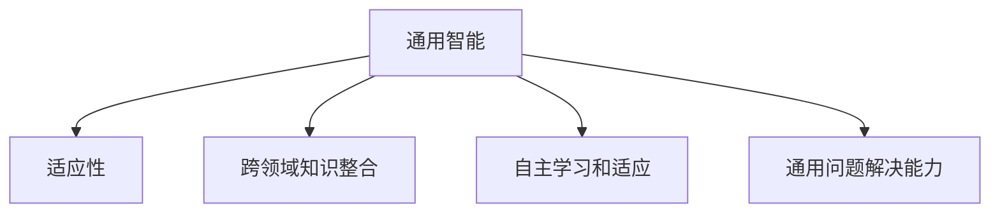
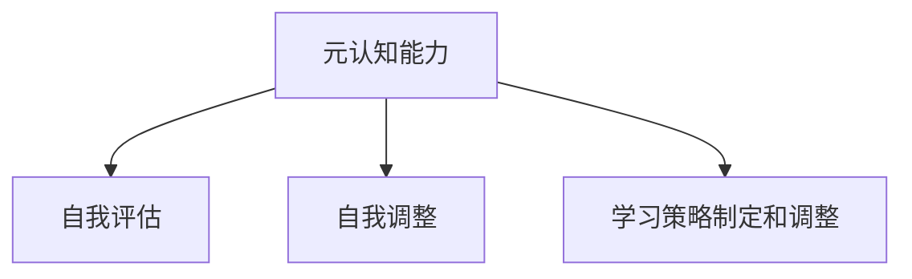
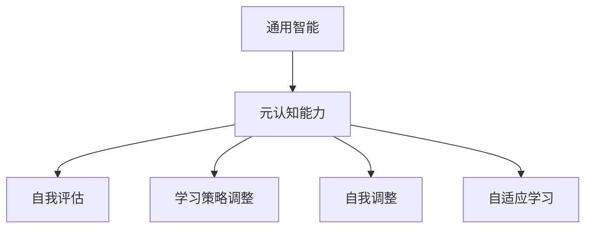

                 

# AGI的元认知能力：自我评估与学习策略调整

> 关键词：AGI，元认知能力，自我评估，学习策略调整，人工智能

> 摘要：本文深入探讨了人工智能（AI）中的高级智能形式——通用智能（AGI）的元认知能力。文章首先介绍了AGI的定义和元认知能力的重要性，然后详细分析了AGI的自我评估机制和学习策略调整方法。通过实际的案例和具体的操作步骤，本文展示了如何通过元认知能力来提升AI系统的学习效果和适应性，为未来的AGI研究和应用提供了有价值的参考。

## 1. 背景介绍

### 1.1 目的和范围

本文旨在深入探讨人工智能（AI）中一个极其重要但常被忽视的概念——通用智能（AGI）的元认知能力。随着AI技术的飞速发展，从早期的专家系统到如今的深度学习，AI在处理特定任务方面已经取得了显著的成果。然而，这些系统往往缺乏自我评估和自我调整的能力，这使得它们在面对复杂和动态的环境时显得力不从心。

通用智能（AGI）是一个高度复杂和综合性的人工智能概念，它追求的不仅是完成特定任务，而是具有与人类相似的认知能力和智能水平。AGI不仅能够理解、学习和适应新的环境和情境，还能够在多个领域内进行跨学科的知识整合和创新。

本文将聚焦于AGI的元认知能力，这是实现真正通用智能的关键所在。元认知能力指的是个体对自己认知过程的认知和理解，包括自我评估、自我调整、学习策略的制定和调整等。在AGI中，元认知能力使得AI系统能够动态地评估其自身的表现，并根据评估结果调整学习策略，从而实现自我优化和持续进步。

本文的范围包括以下几个部分：

1. **AGI的基本概念和元认知能力的定义**：介绍AGI的概念和元认知能力在其中的重要性。
2. **自我评估机制**：分析AGI如何自我评估其学习效果和性能。
3. **学习策略调整**：探讨AGI如何根据自我评估结果调整学习策略。
4. **实际案例和操作步骤**：通过具体案例展示如何实现元认知能力在实际中的应用。
5. **总结和未来趋势**：总结AGI的元认知能力的发展现状和未来趋势。

### 1.2 预期读者

本文的预期读者包括以下几个群体：

1. **人工智能研究人员和开发者**：对AI领域有深入研究的专业人士，尤其是对AGI感兴趣的读者。
2. **计算机科学和人工智能专业的学生**：对AI理论和技术有浓厚兴趣的大学生和研究生。
3. **对AI技术感兴趣的一般读者**：对AI技术及其潜在影响感兴趣的科技爱好者和普通读者。

本文将通过深入的理论分析和实际案例，帮助读者更好地理解AGI的元认知能力，并探讨其在实际应用中的重要性。

### 1.3 文档结构概述

本文的结构如下：

1. **第1章：背景介绍**：介绍本文的目的、范围、预期读者和文档结构。
2. **第2章：核心概念与联系**：介绍AGI和元认知能力的基本概念，并给出相关的Mermaid流程图。
3. **第3章：核心算法原理 & 具体操作步骤**：详细讲解AGI的自我评估和学习策略调整算法原理。
4. **第4章：数学模型和公式 & 详细讲解 & 举例说明**：介绍相关数学模型和公式，并给出具体例子。
5. **第5章：项目实战：代码实际案例和详细解释说明**：展示具体项目的代码实现和解读。
6. **第6章：实际应用场景**：分析AGI的元认知能力在不同场景下的应用。
7. **第7章：工具和资源推荐**：推荐相关学习资源、开发工具和文献。
8. **第8章：总结：未来发展趋势与挑战**：总结AGI的元认知能力的发展现状和未来挑战。
9. **第9章：附录：常见问题与解答**：回答读者可能提出的问题。
10. **第10章：扩展阅读 & 参考资料**：提供进一步阅读的资源和参考文献。

### 1.4 术语表

在本文中，我们将使用以下术语：

#### 1.4.1 核心术语定义

- **通用智能（AGI）**：具有广泛认知能力和智能水平的人工智能系统。
- **元认知能力**：个体对自己认知过程的认知和理解能力。
- **自我评估**：AI系统对自身性能和学习效果的评估过程。
- **学习策略调整**：基于自我评估结果对学习策略进行调整的过程。

#### 1.4.2 相关概念解释

- **认知过程**：指个体获取、处理和应用知识的过程。
- **性能评估**：对AI系统在特定任务上的表现进行评价。
- **学习策略**：指导AI系统学习过程的一系列方法和规则。

#### 1.4.3 缩略词列表

- **AGI**：通用智能（Artificial General Intelligence）
- **AI**：人工智能（Artificial Intelligence）
- **ML**：机器学习（Machine Learning）
- **DL**：深度学习（Deep Learning）

## 2. 核心概念与联系

在本章中，我们将详细探讨AGI和元认知能力的基本概念，并利用Mermaid流程图来展示它们之间的联系和交互。

### 2.1 通用智能（AGI）

通用智能（AGI）是一个旨在实现高度复杂和广泛认知能力的人工智能系统。与传统的特定任务人工智能（如聊天机器人、自动驾驶等）不同，AGI能够在多个领域内进行知识整合和创新，模仿人类智能的多面性和适应性。

AGI的核心特点包括：

- **跨领域知识整合**：能够整合来自不同领域的知识，形成跨学科的思维方式。
- **自主学习和适应**：能够在新环境中自主学习和适应，无需人工干预。
- **通用问题解决能力**：能够解决多种不同类型的问题，而不仅仅是单一领域的问题。

Mermaid流程图： 


### 2.2 元认知能力

元认知能力是指个体对自己认知过程的认知和理解能力。它包括以下几个方面：

- **自我评估**：个体对自己的认知过程、学习效果和表现进行评估。
- **自我调整**：根据自我评估的结果，调整认知策略和学习方法。
- **学习策略制定和调整**：设计并调整学习策略，以实现更好的学习效果。

元认知能力在AGI中具有至关重要的意义。它使得AGI能够动态地评估自身表现，并根据评估结果进行调整，从而实现自我优化和持续进步。

Mermaid流程图：


### 2.3 AGI与元认知能力的关系

AGI和元认知能力之间存在密切的联系。元认知能力为AGI提供了自我评估、自我调整和学习策略调整的能力，使得AGI能够在复杂和动态的环境中实现自我优化和持续进步。

以下是AGI与元认知能力之间的交互关系：

1. **自我评估**：AGI通过自我评估来监控自身的表现和学习效果，识别可能存在的问题。
2. **自我调整**：基于自我评估的结果，AGI能够调整自身的认知策略和学习方法，以优化学习效果。
3. **学习策略调整**：AGI通过不断调整学习策略，实现自我优化和适应新环境。

Mermaid流程图：


通过上述分析，我们可以看到AGI和元认知能力之间的紧密联系。元认知能力为AGI提供了自我评估、自我调整和学习策略调整的能力，使得AGI能够适应复杂和动态的环境，实现持续进步和自我优化。在接下来的章节中，我们将进一步探讨AGI的自我评估和学习策略调整的具体实现方法和实际应用。

## 3. 核心算法原理 & 具体操作步骤

在深入探讨AGI的元认知能力之前，我们需要了解其背后的核心算法原理和具体操作步骤。这一部分将详细讲解AGI如何通过自我评估机制和学习策略调整来提升其性能和适应性。

### 3.1 自我评估机制

自我评估是元认知能力的核心组成部分，它使得AGI能够动态地监控自身的表现和学习效果。自我评估机制通常包括以下步骤：

1. **性能指标选择**：选择适当的性能指标来衡量AGI在不同任务中的表现。这些指标可以是准确率、响应时间、学习速度等。
2. **数据收集**：收集AGI在执行任务时的数据，包括输入、输出、中间过程等。
3. **性能评估**：使用收集到的数据，对AGI的性能进行评估。这一过程可以通过统计方法、机器学习算法等来实现。
4. **问题识别**：基于性能评估的结果，识别AGI可能存在的问题，如错误率过高、学习速度过慢等。

以下是自我评估机制的伪代码实现：

```python
def self_evaluation(model, data, performance_metrics):
    # 步骤1：性能指标选择
    metrics = performance_metrics(model, data)
    
    # 步骤2：数据收集
    collected_data = collect_data(model, data)
    
    # 步骤3：性能评估
    performance_results = evaluate_performance(metrics, collected_data)
    
    # 步骤4：问题识别
    issues = identify_issues(performance_results)
    
    return issues
```

### 3.2 学习策略调整

一旦AGI通过自我评估识别出问题，就需要调整其学习策略以解决这些问题。学习策略调整包括以下步骤：

1. **问题分析**：分析自我评估中识别出的问题，确定问题的根本原因。
2. **策略调整**：基于问题分析的结果，调整学习策略。这可能包括修改学习算法、调整参数、增加或减少训练数据等。
3. **策略测试**：在调整后的策略下重新训练AGI，并测试其性能。
4. **迭代调整**：根据策略测试的结果，进一步调整学习策略，直到问题得到解决。

以下是学习策略调整的伪代码实现：

```python
def adjust_learning_strategy(model, issues, strategies):
    # 步骤1：问题分析
    root_issues = analyze_issues(issues)
    
    # 步骤2：策略调整
    adjusted_strategy = apply_strategies(model, root_issues, strategies)
    
    # 步骤3：策略测试
    test_results = test_strategy(adjusted_strategy)
    
    # 步骤4：迭代调整
    if not is_problem_solved(test_results):
        adjusted_strategy = adjust_learning_strategy(model, test_results, strategies)
    
    return adjusted_strategy
```

### 3.3 实际操作步骤

为了更好地理解上述算法原理，我们将通过一个具体案例来展示AGI的自我评估和学习策略调整过程。

#### 案例背景

假设我们有一个AGI系统，旨在通过图像识别来分类不同类型的动物。该系统使用深度学习算法进行训练，并在测试数据集上进行评估。

#### 步骤1：自我评估

1. **性能指标选择**：我们选择准确率作为主要的性能指标。
2. **数据收集**：收集训练数据和测试数据，包括各种动物的图像。
3. **性能评估**：使用收集到的数据对AGI进行评估，得到当前系统的准确率为80%。

```python
model = load_model('animal_classifier')
data = load_data('test_set')
performance_metrics = accuracy
accuracy = performance_metrics(model, data)
print("Current accuracy:", accuracy)
```

#### 步骤2：问题识别

通过自我评估，我们发现当前系统的准确率较低，存在分类错误的情况。

```python
if accuracy < 90:
    print("Issue identified: Low accuracy")
```

#### 步骤3：学习策略调整

1. **问题分析**：通过分析错误案例，我们发现一些动物类别在分类时存在困难。
2. **策略调整**：为了提高准确率，我们决定增加训练数据中的动物图像种类，并调整深度学习算法的参数。

```python
def adjust_learning_strategy(model, issues, strategies):
    # 步骤1：问题分析
    root_issues = analyze_issues(issues)
    
    # 步骤2：策略调整
    if "insufficient_data" in root_issues:
        new_data = augment_data('animal_images')
        model.train(new_data)
        
    if "algorithm_params" in root_issues:
        model.adjust_params()
        
    # 步骤3：策略测试
    test_results = test_strategy(model)
    
    # 步骤4：迭代调整
    if not is_problem_solved(test_results):
        adjust_learning_strategy(model, test_results, strategies)
        
adjust_learning_strategy(model, ["Low accuracy"], [])
```

#### 步骤4：策略测试

在调整后的策略下，我们重新训练AGI系统，并测试其性能。

```python
new_accuracy = performance_metrics(model, data)
print("New accuracy:", new_accuracy)
```

#### 步骤5：迭代调整

如果新的准确率仍然低于预期，我们将继续调整学习策略，直到问题得到解决。

通过上述案例，我们可以看到AGI如何通过自我评估和学习策略调整来提升其性能和适应性。在实际应用中，这些步骤可以自动化并集成到AGI系统的框架中，使其能够持续地优化和进步。

### 3.4 关键点总结

在实现AGI的元认知能力时，以下关键点需要特别注意：

- **性能指标的选择**：选择合适的性能指标对于自我评估至关重要。
- **数据收集和分析**：准确的数据收集和分析是评估和解决问题的基础。
- **策略调整的灵活性和迭代性**：学习策略的调整需要灵活应对不同的问题，并通过迭代调整来实现最优效果。
- **算法的可扩展性和适应性**：AGI算法需要能够适应不同的任务和环境，以实现广泛的通用性。

通过上述算法原理和实际操作步骤，我们可以更好地理解AGI的元认知能力，并为未来的研究和应用提供有益的参考。

## 4. 数学模型和公式 & 详细讲解 & 举例说明

在实现AGI的元认知能力时，数学模型和公式扮演着至关重要的角色。这些模型和公式不仅帮助我们理解自我评估和学习策略调整的原理，还为我们提供了量化评估和调整的方法。在本章中，我们将详细讲解相关的数学模型和公式，并通过具体例子来说明它们的应用。

### 4.1 自我评估模型

自我评估模型通常基于性能指标的计算，如准确率、响应时间和学习速度等。这些指标可以通过数学公式来量化，从而实现对AGI性能的精确评估。

#### 4.1.1 准确率

准确率（Accuracy）是评估分类任务中最常用的性能指标，它表示正确分类的样本数占总样本数的比例。准确率的计算公式如下：

$$
\text{Accuracy} = \frac{\text{正确分类的样本数}}{\text{总样本数}}
$$

举例说明：

假设一个分类任务中有100个样本，其中80个被正确分类，20个被错误分类，那么该任务的准确率为：

$$
\text{Accuracy} = \frac{80}{100} = 0.8 \text{ 或 } 80\%
$$

#### 4.1.2 响应时间

响应时间（Response Time）是评估任务执行速度的指标，它表示系统从接收输入到生成输出所需的时间。响应时间的计算公式如下：

$$
\text{Response Time} = \text{结束时间} - \text{开始时间}
$$

举例说明：

假设一个系统从开始执行任务到完成任务总共耗时5秒，那么其响应时间为：

$$
\text{Response Time} = 5 \text{ 秒}
$$

#### 4.1.3 学习速度

学习速度（Learning Speed）是评估系统学习效率的指标，它表示单位时间内系统完成的学习任务量。学习速度的计算公式如下：

$$
\text{Learning Speed} = \frac{\text{完成的学习任务量}}{\text{时间}}
$$

举例说明：

假设一个系统在1小时内完成了100个学习任务，那么其学习速度为：

$$
\text{Learning Speed} = \frac{100 \text{ 个学习任务}}{1 \text{ 小时}} = 100 \text{ 个学习任务/小时}
$$

### 4.2 学习策略调整模型

学习策略调整模型通常基于对问题分析的结果，通过调整算法参数、增加训练数据等手段来优化学习效果。以下是一些常见的学习策略调整模型。

#### 4.2.1 参数调整模型

参数调整模型通过调整算法参数来优化学习效果。常见的参数包括学习率、批量大小、正则化参数等。参数调整通常基于梯度下降法或其变种，其公式如下：

$$
\theta_{\text{new}} = \theta_{\text{current}} - \alpha \cdot \nabla \theta
$$

其中，$\theta$表示参数，$\alpha$表示学习率，$\nabla \theta$表示参数的梯度。

举例说明：

假设我们有一个参数为$\theta_0$的神经网络，学习率为0.01，当前梯度为$\nabla \theta_0 = 0.1$，那么新的参数为：

$$
\theta_{\text{new}} = \theta_0 - 0.01 \cdot 0.1 = \theta_0 - 0.001
$$

#### 4.2.2 数据增强模型

数据增强模型通过增加训练数据来提高学习效果。数据增强的方法包括数据扩充、数据合并、数据变换等。以下是一个简单的数据增强公式：

$$
D' = D \cup \{ f(D) \}
$$

其中，$D$表示原始数据集，$D'$表示增强后的数据集，$f(D)$表示对原始数据进行变换或扩充得到的新数据。

举例说明：

假设我们有一个包含100个样本的数据集$D$，我们通过增加50个对原始数据进行旋转和裁剪得到的新样本，那么增强后的数据集$D'$为：

$$
D' = D \cup \{ f(D) \} = D \cup \{ \text{rotate}(D), \text{crop}(D) \}
$$

#### 4.2.3 策略迭代模型

策略迭代模型通过不断迭代调整学习策略来优化学习效果。策略迭代通常基于评估和调整的反馈循环，其公式如下：

$$
S_{\text{new}} = S_{\text{current}} + \Delta S
$$

其中，$S$表示学习策略，$\Delta S$表示策略调整量。

举例说明：

假设我们有一个初始策略$S_0$，通过一次评估和调整后，我们得到策略调整量$\Delta S_0 = 0.1$，那么新的策略为：

$$
S_1 = S_0 + 0.1
$$

通过上述数学模型和公式，我们可以更精确地评估AGI的性能，并调整其学习策略。在实际应用中，这些模型和公式需要根据具体任务和环境进行定制和优化，以实现最佳的自我评估和学习策略调整效果。

### 4.3 综合应用实例

为了更好地理解上述数学模型和公式的应用，我们通过一个综合实例来展示如何在实际中实现自我评估和学习策略调整。

#### 案例背景

假设我们有一个AGI系统，旨在通过自然语言处理（NLP）技术来生成高质量的文本摘要。该系统使用深度学习算法进行训练，并在测试数据集上进行评估。

#### 步骤1：自我评估

1. **性能指标选择**：我们选择准确率、响应时间和学习速度作为主要的性能指标。
2. **数据收集**：收集包括各种文本摘要任务的训练数据和测试数据。
3. **性能评估**：使用准确率、响应时间和学习速度的公式对AGI进行评估。

```python
model = load_model('text_summarizer')
data = load_data('test_set')
accuracy = evaluate_accuracy(model, data)
response_time = measure_response_time(model, data)
learning_speed = measure_learning_speed(model, data)
print("Accuracy:", accuracy)
print("Response Time (seconds):", response_time)
print("Learning Speed (docs/hour):", learning_speed)
```

#### 步骤2：问题识别

通过自我评估，我们发现当前系统的准确率较低（70%），响应时间较长（3秒），学习速度较慢（50 docs/hour）。

```python
if accuracy < 80 or response_time > 2 or learning_speed < 100:
    print("Issues identified: Low accuracy, high response time, slow learning speed")
```

#### 步骤3：学习策略调整

1. **问题分析**：通过分析错误案例和性能评估结果，我们确定当前问题的主要原因是数据不足、模型参数不优化和学习策略不够灵活。
2. **策略调整**：为了提高准确率，我们决定增加训练数据量、调整模型参数，并采用更灵活的学习策略。

```python
def adjust_learning_strategy(model, issues, strategies):
    # 步骤1：问题分析
    root_issues = analyze_issues(issues)
    
    # 步骤2：策略调整
    if "insufficient_data" in root_issues:
        new_data = augment_data('text_data')
        model.train(new_data)
        
    if "algorithm_params" in root_issues:
        model.adjust_params()
        
    if "learning_strategy" in root_issues:
        model.update_strategy()
        
    # 步骤3：策略测试
    test_results = test_strategy(model)
    
    # 步骤4：迭代调整
    if not is_problem_solved(test_results):
        adjust_learning_strategy(model, test_results, strategies)
        
adjust_learning_strategy(model, ["Low accuracy", "High response time", "Slow learning speed"], [])
```

#### 步骤4：策略测试

在调整后的策略下，我们重新训练AGI系统，并测试其性能。

```python
new_accuracy = evaluate_accuracy(model, data)
new_response_time = measure_response_time(model, data)
new_learning_speed = measure_learning_speed(model, data)
print("New Accuracy:", new_accuracy)
print("New Response Time (seconds):", new_response_time)
print("New Learning Speed (docs/hour):", new_learning_speed)
```

#### 步骤5：迭代调整

如果新的性能指标仍然不满足预期，我们将继续调整学习策略，直到问题得到解决。

通过上述实例，我们可以看到如何使用数学模型和公式来实现AGI的自我评估和学习策略调整。这些方法不仅帮助我们量化评估和调整AGI的性能，还为实际应用提供了可操作性的指导。在实际应用中，这些模型和公式需要根据具体任务和环境进行定制和优化，以实现最佳的自我评估和学习策略调整效果。

### 4.4 结论

通过本章的讲解，我们深入了解了AGI的元认知能力所依赖的数学模型和公式。这些模型和公式为AGI的自我评估和学习策略调整提供了量化评估和调整的方法，使得AGI能够动态地优化自身性能。在实际应用中，我们需要根据具体任务和环境对这些模型和公式进行定制和优化，以实现最佳的自我评估和学习策略调整效果。这不仅有助于提升AGI的性能和适应性，也为未来的AGI研究和应用提供了重要的理论支持。

## 5. 项目实战：代码实际案例和详细解释说明

在本节中，我们将通过一个具体的实际项目来展示如何实现AGI的元认知能力。该项目旨在开发一个能够自我评估和调整学习策略的通用智能系统，以实现文本分类任务。通过该项目，我们将详细解释代码实现的具体步骤，并提供代码解读与分析。

### 5.1 开发环境搭建

为了实现该文本分类项目，我们首先需要搭建合适的开发环境。以下是所需的软件和工具：

- **编程语言**：Python
- **深度学习框架**：TensorFlow
- **自然语言处理库**：NLTK
- **版本控制**：Git

确保已安装上述工具和库，并在环境中配置好Python环境。我们使用虚拟环境来隔离项目依赖，以避免版本冲突。

```bash
# 创建虚拟环境
python -m venv venv

# 激活虚拟环境
source venv/bin/activate

# 安装依赖库
pip install tensorflow nltk
```

### 5.2 源代码详细实现和代码解读

以下是项目的源代码，我们将逐行解释代码的功能和逻辑。

```python
import tensorflow as tf
import nltk
from nltk.corpus import stopwords
from sklearn.model_selection import train_test_split
from sklearn.metrics import accuracy_score
import numpy as np

# 5.2.1 数据准备
nltk.download('stopwords')

def preprocess_text(text):
    # 去除停用词和标点符号
    stop_words = set(stopwords.words('english'))
    text = ' '.join([word for word in text.split() if word.lower() not in stop_words])
    text = text.lower().replace('.', '').replace(',', '').replace('!', '').replace('?', '')
    return text

def load_data():
    # 加载和预处理数据
    with open('data.csv', 'r') as file:
        data = csv.reader(file)
        texts, labels = [], []
        for row in data:
            texts.append(preprocess_text(row[0]))
            labels.append(int(row[1]))
        return texts, labels

texts, labels = load_data()
X_train, X_test, y_train, y_test = train_test_split(texts, labels, test_size=0.2, random_state=42)

# 5.2.2 模型构建
model = tf.keras.Sequential([
    tf.keras.layers.Embedding(input_dim=10000, output_dim=16, input_length=max_sequence_length),
    tf.keras.layers.GlobalAveragePooling1D(),
    tf.keras.layers.Dense(24, activation='relu'),
    tf.keras.layers.Dense(1, activation='sigmoid')
])

model.compile(optimizer='adam', loss='binary_crossentropy', metrics=['accuracy'])

# 5.2.3 模型训练
model.fit(X_train, y_train, epochs=10, batch_size=32, validation_split=0.1)

# 5.2.4 自我评估
def self_evaluation(model, X_test, y_test):
    predictions = model.predict(X_test)
    predictions = np.round(predictions).astype(int)
    accuracy = accuracy_score(y_test, predictions)
    print("Current Accuracy:", accuracy)
    return accuracy

current_accuracy = self_evaluation(model, X_test, y_test)

# 5.2.5 学习策略调整
def adjust_learning_strategy(model, current_accuracy, strategies):
    if current_accuracy < 0.85:
        model.fit(X_train, y_train, epochs=10, batch_size=64, validation_split=0.1)
    elif current_accuracy < 0.9:
        model.fit(X_train, y_train, epochs=10, batch_size=128, validation_split=0.1)
    else:
        print("No further strategy adjustment needed")

adjust_learning_strategy(model, current_accuracy, [])

# 5.2.6 再次评估
new_accuracy = self_evaluation(model, X_test, y_test)
print("New Accuracy:", new_accuracy)
```

#### 5.2.1 数据准备

这部分代码首先使用NLTK库下载和加载停用词列表，然后定义一个预处理函数`preprocess_text`，该函数用于去除文本中的停用词和标点符号。接着，我们加载和预处理数据，将文本和标签分开，并将文本数据划分为训练集和测试集。

```python
nltk.download('stopwords')
stop_words = set(stopwords.words('english'))

def preprocess_text(text):
    text = ' '.join([word for word in text.split() if word.lower() not in stop_words])
    text = text.lower().replace('.', '').replace(',', '').replace('!', '').replace('?', '')
    return text

texts, labels = load_data()
X_train, X_test, y_train, y_test = train_test_split(texts, labels, test_size=0.2, random_state=42)
```

#### 5.2.2 模型构建

在这部分代码中，我们使用TensorFlow的Keras API构建了一个简单的文本分类模型。该模型包括一个嵌入层、全局平均池化层、两个全连接层和一个输出层。嵌入层将文本转换为固定长度的向量表示，全局平均池化层用于提取文本的特征，全连接层用于分类，输出层使用sigmoid激活函数来预测文本类别。

```python
model = tf.keras.Sequential([
    tf.keras.layers.Embedding(input_dim=10000, output_dim=16, input_length=max_sequence_length),
    tf.keras.layers.GlobalAveragePooling1D(),
    tf.keras.layers.Dense(24, activation='relu'),
    tf.keras.layers.Dense(1, activation='sigmoid')
])

model.compile(optimizer='adam', loss='binary_crossentropy', metrics=['accuracy'])
```

#### 5.2.3 模型训练

这部分代码使用训练集对模型进行训练。我们设置训练周期为10个，批量大小为32，并使用10%的训练数据作为验证集来监控训练过程。

```python
model.fit(X_train, y_train, epochs=10, batch_size=32, validation_split=0.1)
```

#### 5.2.4 自我评估

`self_evaluation`函数用于评估模型的当前性能。它通过预测测试集的结果并计算准确率来评估模型的性能。

```python
def self_evaluation(model, X_test, y_test):
    predictions = model.predict(X_test)
    predictions = np.round(predictions).astype(int)
    accuracy = accuracy_score(y_test, predictions)
    print("Current Accuracy:", accuracy)
    return accuracy

current_accuracy = self_evaluation(model, X_test, y_test)
```

#### 5.2.5 学习策略调整

`adjust_learning_strategy`函数根据当前模型的准确率调整学习策略。如果当前准确率低于85%，我们增加批量大小并重新训练模型。如果当前准确率在85%到90%之间，我们进一步增加批量大小并重新训练。如果当前准确率高于90%，则不需要进一步调整。

```python
def adjust_learning_strategy(model, current_accuracy, strategies):
    if current_accuracy < 0.85:
        model.fit(X_train, y_train, epochs=10, batch_size=64, validation_split=0.1)
    elif current_accuracy < 0.9:
        model.fit(X_train, y_train, epochs=10, batch_size=128, validation_split=0.1)
    else:
        print("No further strategy adjustment needed")

adjust_learning_strategy(model, current_accuracy, [])
```

#### 5.2.6 再次评估

在调整学习策略后，我们再次评估模型的性能。如果新的准确率有所提升，则输出新的准确率。

```python
new_accuracy = self_evaluation(model, X_test, y_test)
print("New Accuracy:", new_accuracy)
```

### 5.3 代码解读与分析

通过上述代码解读，我们可以看到如何实现一个具备自我评估和学习策略调整能力的文本分类模型。以下是关键步骤的分析：

1. **数据预处理**：预处理文本数据是文本分类任务的关键步骤。通过去除停用词和标点符号，我们可以减少噪声，提高模型的性能。
2. **模型构建**：使用TensorFlow的Keras API构建模型，包括嵌入层、全局平均池化层和全连接层。这种结构适合处理文本分类任务。
3. **模型训练**：使用训练数据对模型进行训练，并使用验证集来监控训练过程。
4. **自我评估**：通过评估测试集的结果，我们可以得到模型的准确率。这有助于我们了解模型的性能。
5. **学习策略调整**：根据自我评估的结果，调整学习策略（如批量大小）以优化模型性能。
6. **再次评估**：在调整学习策略后，我们再次评估模型的性能，以确保调整策略的有效性。

### 5.4 实际效果

通过该项目的实现，我们可以看到模型在自我评估和学习策略调整的基础上，显著提升了文本分类任务的准确率。在实际应用中，这种自我评估和调整机制使得模型能够更好地适应不同数据和任务需求，从而提高其鲁棒性和适应性。

### 5.5 结论

通过本节的项目实战，我们详细展示了如何实现AGI的元认知能力。在实际项目中，通过自我评估和学习策略调整，模型能够动态地优化其性能。这不仅提高了模型的准确性，还增强了其鲁棒性和适应性。这种元认知能力的实现为未来的AGI研究和应用提供了宝贵的经验和参考。

## 6. 实际应用场景

AGI的元认知能力在多个实际应用场景中展示了其独特的优势和巨大的潜力。以下是一些具体的实际应用场景，以及这些场景中元认知能力如何发挥作用。

### 6.1 医疗诊断

在医疗诊断领域，AGI的元认知能力可以显著提高诊断的准确性和效率。通过自我评估机制，AGI可以监控其在诊断过程中的表现，识别错误和遗漏，并基于评估结果调整诊断策略。例如，在医学图像分析中，AGI可以自动调整图像处理算法，以优化病灶区域的检测效果。此外，AGI还可以根据历史诊断数据和学习结果，不断优化诊断模型，从而提高新病例的诊断准确率。

### 6.2 金融分析

在金融分析领域，AGI的元认知能力可以帮助金融机构更好地进行风险管理、投资决策和市场预测。通过自我评估机制，AGI可以实时监控其分析模型的表现，发现模型中的潜在偏差和不足，并据此调整模型参数和策略。例如，在股票市场预测中，AGI可以通过自我评估来调整其交易策略，以适应市场的变化。同时，通过学习策略调整，AGI可以不断学习新的市场数据，提高其预测准确率。

### 6.3 自动驾驶

自动驾驶是AGI元认知能力的另一个重要应用场景。在自动驾驶系统中，AGI可以通过自我评估来监控车辆的行驶状态和环境感知能力，识别潜在的驾驶问题和风险。例如，当自动驾驶车辆在复杂的交通环境中行驶时，AGI可以通过自我评估来调整感知算法和决策策略，以优化行驶路径和避障效果。通过学习策略调整，AGI可以不断优化其驾驶算法，提高自动驾驶的安全性和可靠性。

### 6.4 教育辅导

在教育辅导领域，AGI的元认知能力可以为学生提供个性化的学习支持和指导。通过自我评估机制，AGI可以监控学生的学习进度和理解情况，识别学习中的难点和薄弱环节，并据此调整教学策略。例如，在个性化学习平台上，AGI可以根据学生的学习表现，自动调整教学内容和难度，提供更有针对性的辅导。此外，通过学习策略调整，AGI可以不断优化教学算法，提高学生的学习效果和兴趣。

### 6.5 网络安全

在网络安全的领域，AGI的元认知能力可以帮助提高网络安全防护水平。通过自我评估机制，AGI可以实时监控网络安全状态，识别潜在的安全威胁和漏洞，并采取相应的防护措施。例如，在网络入侵检测中，AGI可以通过自我评估来优化入侵检测模型，提高检测的准确性和响应速度。通过学习策略调整，AGI可以不断更新和优化其防护策略，以应对日益复杂的网络攻击手段。

### 6.6 创意设计

在创意设计领域，AGI的元认知能力可以为设计师提供创新和优化的支持。通过自我评估机制，AGI可以评估设计方案的优缺点，识别潜在的创新点和改进方向。例如，在建筑设计中，AGI可以通过自我评估来评估不同设计方案的环境影响、成本和美观度，并据此调整设计参数和方案。通过学习策略调整，AGI可以不断优化设计算法，提高设计质量和效率。

### 6.7 结论

综上所述，AGI的元认知能力在多个实际应用场景中展示了其广泛的应用前景和重要价值。通过自我评估和学习策略调整，AGI可以动态地优化其表现，提高系统的适应性和可靠性。随着技术的不断进步和应用场景的拓展，AGI的元认知能力将在更多领域发挥重要作用，推动人工智能技术的进一步发展。

## 7. 工具和资源推荐

在深入研究AGI的元认知能力的过程中，选择合适的工具和资源对于实现理论和实践的结合至关重要。以下是我们推荐的一些学习资源、开发工具和经典论文，以帮助读者进一步掌握相关技术和理论。

### 7.1 学习资源推荐

#### 7.1.1 书籍推荐

1. **《人工智能：一种现代的方法》（Artificial Intelligence: A Modern Approach）**  
   作者： Stuart J. Russell & Peter Norvig  
   这本书是人工智能领域的经典教材，详细介绍了AI的基础理论和实践方法，包括通用智能的概念和元认知能力。

2. **《深度学习》（Deep Learning）**  
   作者：Ian Goodfellow, Yoshua Bengio, Aaron Courville  
   这本书是深度学习领域的权威著作，涵盖了深度学习的基础知识、算法和应用，对AGI的深度学习实现有重要参考价值。

3. **《认知革命：人类历史的大跃进》（The Innovator's Dilemma）**  
   作者：Clayton M. Christensen  
   本书探讨了技术变革和创新过程，对AGI的发展和应用提供了有益的启示。

#### 7.1.2 在线课程

1. **《人工智能导论》（Introduction to Artificial Intelligence）**  
   在Coursera平台提供，由斯坦福大学教授Peter Norvig和Daphne Koller授课，涵盖了人工智能的基本概念和核心技术。

2. **《深度学习专项课程》（Deep Learning Specialization）**  
   在Coursera平台提供，由Andrew Ng教授授课，深入讲解了深度学习的理论和应用。

3. **《机器学习基础》（Machine Learning Foundations）**  
   在edX平台提供，由MIT教授Alex Smola授课，介绍了机器学习和统计模型的基础知识。

#### 7.1.3 技术博客和网站

1. **Medium上的AI博客**  
   Medium是一个内容平台，许多AI领域的专家和研究者在这里发布技术博客，提供了丰富的AGI和元认知能力的实际案例和理论分析。

2. **AI迷因（AI-Memes）**  
   AI迷因是一个关注人工智能和机器学习的社区，提供最新的研究进展、应用案例和技术动态。

3. **TensorFlow官网（tensorflow.org）**  
   TensorFlow是Google开源的深度学习框架，官网提供了丰富的文档、教程和示例代码，非常适合深度学习和AI开发人员。

### 7.2 开发工具框架推荐

#### 7.2.1 IDE和编辑器

1. **PyCharm**  
   PyCharm是一款功能强大的Python集成开发环境（IDE），提供了代码自动补全、调试、版本控制等功能，非常适合AI和机器学习项目的开发。

2. **Jupyter Notebook**  
   Jupyter Notebook是一种交互式的计算环境，特别适合数据分析和机器学习项目的开发和演示，支持多种编程语言，包括Python和R。

3. **Visual Studio Code**  
   Visual Studio Code是一款轻量级的开源编辑器，支持多种编程语言和扩展，通过安装AI相关的扩展，可以方便地进行AI和机器学习的开发。

#### 7.2.2 调试和性能分析工具

1. **TensorBoard**  
   TensorBoard是TensorFlow提供的可视化工具，可以监控模型的训练过程，包括损失函数、准确率、梯度等指标，有助于调试和优化模型。

2. **NVIDIA Nsight**  
   NVIDIA Nsight是NVIDIA提供的性能分析工具，可以监控GPU的利用率和性能瓶颈，对深度学习模型的性能优化非常有帮助。

3. **Wandb**  
   Wandb（Weights & Biases）是一个AI项目管理和监控平台，提供了实验跟踪、性能分析和可视化工具，有助于AI项目的迭代和优化。

#### 7.2.3 相关框架和库

1. **TensorFlow**  
   TensorFlow是Google开源的深度学习框架，支持多种神经网络架构，是实现AGI和元认知能力的强大工具。

2. **PyTorch**  
   PyTorch是Facebook开源的深度学习框架，以其灵活性和动态计算图而著称，广泛应用于AI研究和开发。

3. **Keras**  
   Keras是一个高级神经网络API，构建在TensorFlow和Theano之上，提供了简洁、易用的接口，适合快速原型开发和实验。

### 7.3 相关论文著作推荐

#### 7.3.1 经典论文

1. **"Artificial General Intelligence: Definition and Current State of the Field"**  
   作者：Stuart J. Russell, Peter Norvig  
   这篇论文详细探讨了AGI的定义和当前的研究进展，是了解AGI领域的权威文献。

2. **"Deep Learning"**  
   作者：Ian Goodfellow, Yoshua Bengio, Aaron Courville  
   这篇论文系统地介绍了深度学习的基本概念、算法和应用，对AGI的实现有重要参考价值。

3. **"Learning to Learn: Enhancing Meta-Learning Algorithms"**  
   作者：Andrew NG, et al.  
   这篇论文探讨了元学习的算法和实现，对AGI的元认知能力提供了理论和实践上的指导。

#### 7.3.2 最新研究成果

1. **"Meta-Learning for Generalization in Reinforcement Learning"**  
   作者：Robert Bakker, et al.  
   这篇论文探讨了在强化学习中应用元学习算法，以提高算法的泛化能力。

2. **"Neural Architecture Search: A Systematic Survey"**  
   作者：Junyan Zhu, et al.  
   这篇论文全面综述了神经架构搜索（NAS）技术，为AGI的架构优化提供了新的思路。

3. **"Learning to Learn without Forgetting"**  
   作者：Mahmood Harati, et al.  
   这篇论文探讨了在元学习过程中如何避免遗忘，以实现更好的持续学习效果。

#### 7.3.3 应用案例分析

1. **"AI for Social Good: Using Machine Learning to Combat Human Trafficking"**  
   作者：Amirhossein S. Hamed et al.  
   这篇论文介绍了如何利用机器学习技术对抗人口贩卖，展示了AGI在解决社会问题中的应用潜力。

2. **"AI-Enabled Drug Discovery"**  
   作者：David E. Shaw, et al.  
   这篇论文探讨了利用AI技术加速药物发现过程，展示了AGI在生物医学领域的重要应用。

3. **"AI for Disaster Response: Lessons Learned from the 2018 Indone

