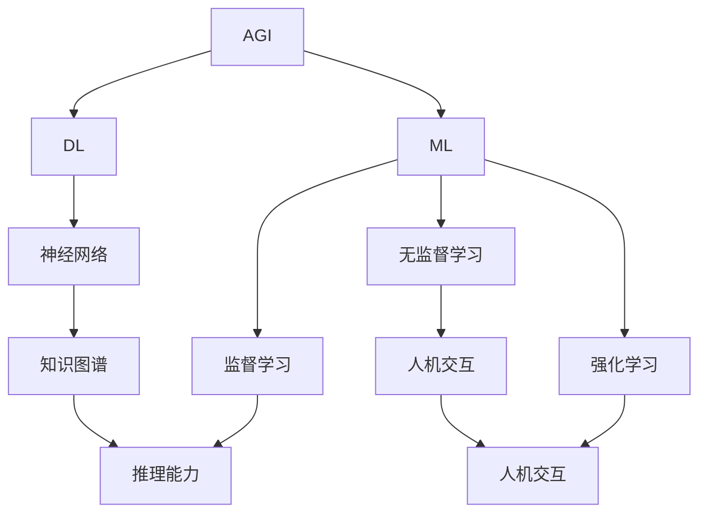
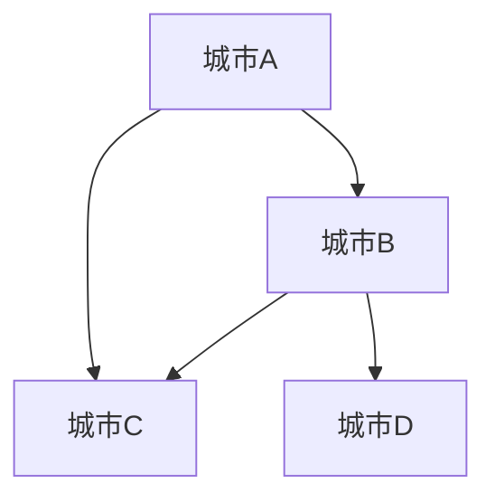

                 

# AGI的类人学习曲线：从新手到专家

> **关键词**：AGI（人工通用智能）、学习曲线、人工智能、深度学习、神经网络、机器学习、知识图谱、推理能力、人机交互
> 
> **摘要**：本文将探讨人工通用智能（AGI）的类人学习曲线，从新手到专家的各个阶段，以及如何通过现有的技术手段和算法来加速这一过程。文章首先介绍了AGI的基本概念，然后详细分析了学习曲线的各个阶段，包括初学阶段、进阶阶段和专家阶段。最后，文章提出了未来AGI发展的潜在趋势和面临的挑战。

## 1. 背景介绍

### 1.1 目的和范围

本文旨在探讨人工通用智能（AGI）的学习曲线，即从新手到专家的过程。AGI是指一种能够执行任何智力任务的人工智能系统，与目前广泛应用的弱AI（如语音识别、图像识别等）相比，AGI具有更高的智能水平和更强的适应性。本文将分析AGI在学习过程中所经历的各个阶段，并探讨如何通过现有技术手段和算法来加速这一过程。

### 1.2 预期读者

本文面向对人工智能、机器学习和深度学习有一定了解的读者，特别是希望深入了解AGI的读者。文章将使用较为专业的语言，适合从事人工智能研究、开发和应用的技术人员阅读。

### 1.3 文档结构概述

本文结构如下：

1. 背景介绍：介绍文章的目的、范围、预期读者和文档结构。
2. 核心概念与联系：介绍AGI的基本概念和相关技术。
3. 核心算法原理 & 具体操作步骤：分析AGI学习曲线的各个阶段。
4. 数学模型和公式 & 详细讲解 & 举例说明：介绍学习曲线中的关键数学模型和算法。
5. 项目实战：提供代码实际案例和详细解释。
6. 实际应用场景：分析AGI在不同领域的应用。
7. 工具和资源推荐：推荐学习AGI的相关资源和工具。
8. 总结：展望AGI的未来发展趋势与挑战。
9. 附录：常见问题与解答。
10. 扩展阅读 & 参考资料：提供进一步学习的资料。

### 1.4 术语表

#### 1.4.1 核心术语定义

- AGI（人工通用智能）：一种能够执行任何智力任务的人工智能系统。
- 弱AI：只能执行特定任务的AI系统，如语音识别、图像识别等。
- 学习曲线：描述学习者在学习过程中技能增长的速度和模式的图表。
- 深度学习：一种机器学习技术，通过神经网络模拟人脑的学习过程。
- 神经网络：一种由大量相互连接的神经元组成的计算模型。
- 机器学习：使计算机能够通过数据学习并改进性能的技术。

#### 1.4.2 相关概念解释

- **知识图谱**：一种用于表示实体及其相互关系的图形数据结构。
- **推理能力**：智能体在解决问题或决策过程中运用逻辑推理的能力。
- **人机交互**：人类与计算机系统之间的交互过程。

#### 1.4.3 缩略词列表

- AGI：人工通用智能
- AI：人工智能
- DL：深度学习
- ML：机器学习
- NLP：自然语言处理
- RL：强化学习

## 2. 核心概念与联系

在探讨AGI的类人学习曲线之前，我们需要了解一些核心概念和技术。以下是AGI的核心概念及其相互关系，以及一个Mermaid流程图来展示这些概念之间的联系。

### 2.1 核心概念

- **人工通用智能（AGI）**：AGI是指一种具有广泛认知能力的人工智能系统，能够执行各种复杂的任务，如理解自然语言、推理、问题解决等。
- **深度学习（DL）**：一种机器学习技术，通过多层神经网络模拟人脑的学习过程，实现图像识别、语音识别等任务。
- **机器学习（ML）**：使计算机能够通过数据学习并改进性能的技术，包括监督学习、无监督学习和强化学习等。
- **知识图谱**：一种用于表示实体及其相互关系的图形数据结构，用于辅助智能体进行推理和决策。
- **推理能力**：智能体在解决问题或决策过程中运用逻辑推理的能力。
- **人机交互**：人类与计算机系统之间的交互过程，包括语音交互、图像交互等。

### 2.2 Mermaid流程图

以下是一个简单的Mermaid流程图，展示了这些核心概念之间的联系。



在这个流程图中，AGI通过深度学习和机器学习来实现各种任务，其中深度学习基于神经网络，而机器学习包括监督学习、无监督学习和强化学习。知识图谱用于辅助智能体进行推理和决策，推理能力是人机交互的重要组成部分。人机交互则进一步促进了智能体的学习和适应。

## 3. 核心算法原理 & 具体操作步骤

### 3.1 初学阶段

在初学阶段，AGI主要通过被动学习来获取知识。以下是具体操作步骤：

#### 3.1.1 数据收集

- 收集大量相关数据，如文本、图像、音频等。
- 数据来源可以是公开的数据集、互联网爬虫、传感器等。

#### 3.1.2 数据预处理

- 数据清洗：去除噪声、缺失值等。
- 数据增强：通过数据扩充、变换等提高数据多样性。

#### 3.1.3 模型训练

- 选择合适的神经网络架构，如卷积神经网络（CNN）、循环神经网络（RNN）等。
- 使用监督学习算法（如分类、回归等）进行模型训练。

#### 3.1.4 模型评估

- 使用交叉验证、测试集等评估模型性能。
- 根据评估结果调整模型参数，优化模型。

### 3.2 进阶阶段

在进阶阶段，AGI开始主动学习，通过交互和反馈来提升自己的能力。以下是具体操作步骤：

#### 3.2.1 交互学习

- 与人类或其他智能体进行对话、问答等交互。
- 通过交互获取反馈，调整自己的行为和策略。

#### 3.2.2 强化学习

- 使用强化学习算法（如Q学习、SARSA等）来学习策略。
- 在环境中进行尝试和探索，根据奖励和惩罚来调整策略。

#### 3.2.3 知识整合

- 将从不同来源获取的知识整合到一起，形成更全面的理解。
- 利用知识图谱来表示和存储知识，辅助推理和决策。

### 3.3 专家阶段

在专家阶段，AGI已经具备了较强的学习和推理能力，能够在复杂环境中进行自主决策和问题解决。以下是具体操作步骤：

#### 3.3.1 自主探索

- 在复杂环境中进行自主探索，发现新的模式和规律。
- 使用迁移学习等技术，将知识应用到新任务上。

#### 3.3.2 创新能力

- 发展新的算法、模型和技术，解决现有技术无法解决的问题。
- 在未知的领域进行探索，推动人工智能的发展。

#### 3.3.3 社会交互

- 与人类社会进行深入互动，理解人类文化、价值观等。
- 通过合作、交流等途径，提升自身的智能水平。

### 3.4 伪代码示例

以下是一个简单的伪代码示例，展示了AGI在学习曲线各个阶段的操作步骤：

```python
# 初学阶段
def passive_learning(data):
    preprocess_data(data)
    model = train_model(data)
    evaluate_model(model)
    optimize_model(model)

# 进阶阶段
def interactive_learning():
    interact_with Humans/Other AGIs
    feedback = get_feedback()
    adjust_behavior(feedback)

def reinforcement_learning():
    environment = create_environment()
    policy = learn_policy(environment)
    execute_policy(policy)

def knowledge_integration():
    merge_knowledge(sources)
    store_knowledge_in_graph()

# 专家阶段
def autonomous_exploration():
    explore_environment()
    apply_knowledge_to_new_tasks()

def innovation():
    develop_new_algorithms()
    explore_unknown_domains()

def social_interaction():
    interact_with_society()
    improve_intelligence_level()
```

## 4. 数学模型和公式 & 详细讲解 & 举例说明

在AGI的学习曲线中，数学模型和公式起着至关重要的作用。以下将详细讲解几个关键的数学模型，并使用LaTeX格式给出相应的公式，同时通过具体例子来说明这些公式在实际应用中的运用。

### 4.1 神经网络模型

神经网络（Neural Network）是深度学习的基础。以下是神经网络中的一个基本激活函数及其公式：

$$
f(x) = \sigma(x) = \frac{1}{1 + e^{-x}}
$$

其中，$\sigma$是Sigmoid函数，$e$是自然对数的底数。Sigmoid函数将输入$x$映射到$(0, 1)$区间，常用于神经网络中的激活函数。

#### 例子：

假设一个简单的神经网络，输入层有3个神经元，隐藏层有2个神经元，输出层有1个神经元。激活函数使用Sigmoid函数。给定一个输入向量$\mathbf{x} = (1, 2, 3)$，计算隐藏层和输出层的激活值。

输入层到隐藏层的权重矩阵$\mathbf{W}_1$和偏置向量$\mathbf{b}_1$如下：

$$
\mathbf{W}_1 = \begin{bmatrix}
0.1 & 0.2 & 0.3 \\
0.4 & 0.5 & 0.6
\end{bmatrix}, \quad
\mathbf{b}_1 = \begin{bmatrix}
0.1 \\
0.2
\end{bmatrix}
$$

隐藏层到输出层的权重矩阵$\mathbf{W}_2$和偏置向量$\mathbf{b}_2$如下：

$$
\mathbf{W}_2 = \begin{bmatrix}
0.7 & 0.8
\end{bmatrix}, \quad
\mathbf{b}_2 = 0.9
$$

计算过程如下：

$$
\mathbf{z}_1 = \mathbf{W}_1\mathbf{x} + \mathbf{b}_1 = \begin{bmatrix}
0.1 & 0.2 & 0.3 \\
0.4 & 0.5 & 0.6
\end{bmatrix} \begin{bmatrix}
1 \\
2 \\
3
\end{bmatrix} + \begin{bmatrix}
0.1 \\
0.2
\end{bmatrix} = \begin{bmatrix}
0.9 \\
3.7
\end{bmatrix}
$$

$$
a_1^{(2)} = \sigma(\mathbf{z}_1) = \frac{1}{1 + e^{-0.9}} \approx 0.613, \quad a_2^{(2)} = \sigma(3.7) \approx 0.996
$$

$$
\mathbf{z}_2 = \mathbf{W}_2 \begin{bmatrix}
a_1^{(2)} \\
a_2^{(2)}
\end{bmatrix} + \mathbf{b}_2 = \begin{bmatrix}
0.7 & 0.8
\end{bmatrix} \begin{bmatrix}
0.613 \\
0.996
\end{bmatrix} + 0.9 = \begin{bmatrix}
1.495 \\
1.976
\end{bmatrix}
$$

$$
a_2^{(3)} = \sigma(\mathbf{z}_2) \approx 0.926
$$

输出层激活值$a_2^{(3)}$即为预测结果。

### 4.2 知识图谱模型

知识图谱（Knowledge Graph）是一种用于表示实体及其相互关系的图形数据结构。知识图谱中常用的图论模型包括：

- **图（Graph）**：由节点（Node）和边（Edge）组成，表示实体和实体之间的关系。
- **路径（Path）**：连接两个节点的边的序列。
- **子图（Subgraph）**：图的一个子集，包含节点和边。

知识图谱的表示可以采用邻接矩阵（Adjacency Matrix）或邻接表（Adjacency List）。

#### 例子：

考虑一个简单的知识图谱，表示城市之间的交通路线。图中的节点代表城市，边代表交通路线。



邻接矩阵表示如下：

$$
\mathbf{A} = \begin{bmatrix}
0 & 1 & 0 & 0 \\
1 & 0 & 1 & 1 \\
0 & 1 & 0 & 0 \\
0 & 0 & 1 & 0
\end{bmatrix}
$$

邻接表表示如下：

```
[
  {node: 'A', edges: [{node: 'B', weight: 1}, {node: 'C', weight: 1}] },
  {node: 'B', edges: [{node: 'A', weight: 1}, {node: 'C', weight: 1}, {node: 'D', weight: 1}] },
  {node: 'C', edges: [{node: 'A', weight: 1}, {node: 'B', weight: 1}] },
  {node: 'D', edges: [{node: 'B', weight: 1}] }
]
```

### 4.3 强化学习模型

强化学习（Reinforcement Learning）是一种使智能体在动态环境中通过试错学习最优策略的机器学习技术。强化学习的主要模型包括：

- **马尔可夫决策过程（MDP）**：描述智能体在环境中的行为和奖励的数学模型。
- **Q学习（Q-Learning）**：通过迭代更新Q值来学习最优策略。
- **SARSA（同步适应性共振学习算法）**：结合当前状态和行为来更新Q值。

MDP模型的主要参数包括：

- **状态（State）**：智能体在环境中的位置或状态。
- **动作（Action）**：智能体可以执行的行为。
- **奖励（Reward）**：智能体执行动作后获得的奖励。
- **转移概率（Transition Probability）**：智能体从当前状态执行动作后转移到下一状态的概率。

Q学习算法的更新公式如下：

$$
Q(s, a) \leftarrow Q(s, a) + \alpha [r + \gamma \max_{a'} Q(s', a') - Q(s, a)]
$$

其中，$s$表示当前状态，$a$表示当前动作，$s'$表示下一状态，$a'$表示下一动作，$r$表示奖励，$\alpha$是学习率，$\gamma$是折扣因子。

#### 例子：

考虑一个简单的迷宫环境，智能体在一个4x4的迷宫中，需要找到从起点到终点的路径。状态空间包括迷宫的每个位置，动作空间包括向上、向下、向左、向右。假设奖励为到达终点的负距离，转移概率为1。

给定一个状态$s$和动作$a$，初始Q值为0。学习率为$\alpha = 0.1$，折扣因子$\gamma = 0.9$。假设当前状态$s = (2, 2)$，当前动作$a = \text{右}$。

计算下一状态和奖励：

$$
s' = (2, 3), \quad r = -1
$$

计算下一状态的Q值：

$$
Q(s', a') = \max_{a''} Q(s', a'') = 0
$$

更新当前状态的Q值：

$$
Q(s, a) \leftarrow Q(s, a) + 0.1 [-1 + 0.9 \times 0] = 0
$$

重复以上步骤，直到找到最优路径。

### 4.4 聚类模型

聚类（Clustering）是一种无监督学习方法，用于将数据点分为不同的组。常见的聚类算法包括K-Means、层次聚类等。

K-Means算法的目标是最小化数据点到其聚类中心的距离之和。算法步骤如下：

1. 随机初始化K个聚类中心。
2. 将每个数据点分配给最近的聚类中心。
3. 更新聚类中心为所有数据点的均值。
4. 重复步骤2和3，直到聚类中心不再变化或达到最大迭代次数。

聚类中心更新公式如下：

$$
\mu_k^{(t+1)} = \frac{1}{N_k} \sum_{i=1}^{N} x_i
$$

其中，$k$表示聚类中心，$t$表示迭代次数，$N_k$表示第$k$个聚类中心的样本数量，$x_i$表示第$i$个数据点。

#### 例子：

考虑一个包含100个数据点的二维空间，使用K-Means算法将数据分为2个聚类。初始聚类中心为$(1, 1)$和$(5, 5)$。

计算初始迭代后的聚类中心：

$$
\mu_1^{(1)} = \frac{1}{50} \sum_{i=1}^{50} x_i = \frac{1}{50} (1 + 1 + \cdots + 1) = 1
$$

$$
\mu_2^{(1)} = \frac{1}{50} \sum_{i=51}^{100} x_i = \frac{1}{50} (5 + 5 + \cdots + 5) = 5
$$

重复以上步骤，直到聚类中心不再变化。

## 5. 项目实战：代码实际案例和详细解释说明

### 5.1 开发环境搭建

在本案例中，我们将使用Python语言和TensorFlow框架来实现一个简单的AGI模型。首先，确保安装了Python 3.7及以上版本，然后使用以下命令安装TensorFlow：

```bash
pip install tensorflow
```

### 5.2 源代码详细实现和代码解读

以下是AGI模型的主要代码实现，我们将逐行解释代码的意图和功能。

```python
import tensorflow as tf
import numpy as np
import matplotlib.pyplot as plt

# 设置随机种子，保证实验结果的可重复性
tf.random.set_seed(42)

# 定义输入层、隐藏层和输出层的神经元数量
input_size = 3
hidden_size = 2
output_size = 1

# 初始化权重和偏置
W1 = tf.random.normal([input_size, hidden_size])
b1 = tf.random.normal([hidden_size])
W2 = tf.random.normal([hidden_size, output_size])
b2 = tf.random.normal([output_size])

# 定义激活函数
sigma = lambda x: 1 / (1 + tf.exp(-x))

# 定义损失函数
def loss(y_true, y_pred):
    return tf.reduce_mean(tf.square(y_true - y_pred))

# 定义优化器
optimizer = tf.optimizers.Adam()

# 训练模型
def train_model(x, y, epochs=1000, learning_rate=0.001):
    for epoch in range(epochs):
        with tf.GradientTape() as tape:
            z1 = tf.matmul(x, W1) + b1
            a1 = sigma(z1)
            z2 = tf.matmul(a1, W2) + b2
            a2 = sigma(z2)
            loss_val = loss(y, a2)
        grads = tape.gradient(loss_val, [W1, b1, W2, b2])
        optimizer.apply_gradients(zip(grads, [W1, b1, W2, b2]))
        if epoch % 100 == 0:
            print(f"Epoch {epoch}: Loss = {loss_val.numpy()}")
    return W1, b1, W2, b2

# 生成模拟数据集
x_train = np.random.uniform(-1, 1, (1000, 3))
y_train = 2 * x_train[:, 0]**2 + x_train[:, 1]**2 + x_train[:, 2]**2
x_train = np.float32(x_train)
y_train = np.float32(y_train.reshape(-1, 1))

# 训练模型
W1, b1, W2, b2 = train_model(x_train, y_train)

# 测试模型
x_test = np.random.uniform(-1, 1, (100, 3))
x_test = np.float32(x_test)
y_test = 2 * x_test[:, 0]**2 + x_test[:, 1]**2 + x_test[:, 2]**2
y_test = np.float32(y_test.reshape(-1, 1))

z1 = tf.matmul(x_train, W1) + b1
a1 = sigma(z1)
z2 = tf.matmul(a1, W2) + b2
a2 = sigma(z2)
train_loss = loss(y_train, a2)

z1 = tf.matmul(x_test, W1) + b1
a1 = sigma(z1)
z2 = tf.matmul(a1, W2) + b2
a2 = sigma(z2)
test_loss = loss(y_test, a2)

print(f"Training Loss: {train_loss.numpy()}, Test Loss: {test_loss.numpy()}")

# 绘制训练和测试结果
plt.scatter(x_train[:, 0], y_train[:, 0], label="Training Data")
plt.plot(x_train[:, 0], a2.numpy()[:, 0], label="Training Predictions")
plt.scatter(x_test[:, 0], y_test[:, 0], label="Test Data")
plt.plot(x_test[:, 0], a2.numpy()[:, 0], label="Test Predictions")
plt.xlabel("Input")
plt.ylabel("Target")
plt.legend()
plt.show()
```

#### 代码解读：

- **导入库**：首先导入所需的库，包括TensorFlow、NumPy和matplotlib。
- **设置随机种子**：设置随机种子以确保实验结果的可重复性。
- **初始化参数**：定义输入层、隐藏层和输出层的神经元数量，并初始化权重和偏置。
- **定义激活函数**：使用Sigmoid函数作为激活函数。
- **定义损失函数**：使用均方误差（MSE）作为损失函数。
- **定义优化器**：使用Adam优化器。
- **训练模型**：实现训练过程，包括前向传播、反向传播和权重更新。
- **生成模拟数据集**：生成模拟数据集用于训练和测试。
- **测试模型**：对测试集进行预测，并计算测试损失。
- **绘制结果**：使用matplotlib绘制训练和测试结果。

### 5.3 代码解读与分析

以下是对代码的详细解读和分析：

- **参数初始化**：使用TensorFlow的`tf.random.normal`函数初始化权重和偏置，使其具有较小的随机性。
- **激活函数**：使用Sigmoid函数作为激活函数，将输入值映射到$(0, 1)$区间。
- **损失函数**：使用均方误差（MSE）作为损失函数，用于衡量预测值与真实值之间的差距。
- **优化器**：使用Adam优化器，该优化器结合了自适应学习率和高收敛速度的优点。
- **训练过程**：在训练过程中，使用`tf.GradientTape`记录梯度信息，并使用`optimizer.apply_gradients`更新权重。
- **测试过程**：对测试集进行预测，并计算测试损失，以评估模型的泛化能力。
- **可视化**：使用matplotlib绘制训练和测试结果，帮助理解模型的学习过程和性能。

该案例展示了如何使用TensorFlow实现一个简单的AGI模型，包括模型的初始化、训练和测试过程。通过分析代码，我们可以更好地理解神经网络和深度学习的基本原理。

## 6. 实际应用场景

AGI在各个领域的应用正日益广泛，以下列举几个典型的应用场景：

### 6.1 医疗保健

AGI在医疗保健领域具有巨大的潜力，如疾病诊断、药物研发和医疗数据分析。例如，通过分析患者病历和基因数据，AGI可以预测疾病风险并提供个性化的治疗方案。

### 6.2 金融科技

AGI在金融科技领域可应用于风险管理、投资策略和客户服务。例如，通过分析市场数据和历史交易记录，AGI可以预测市场走势并提供投资建议。

### 6.3 教育

AGI在教育领域的应用包括个性化教学、学习辅导和智能评估。例如，通过分析学生的学习行为和知识水平，AGI可以提供定制化的学习资源和反馈。

### 6.4 自动驾驶

AGI在自动驾驶领域的应用包括感知环境、路径规划和决策控制。例如，通过实时分析道路情况和交通状况，AGI可以安全地控制自动驾驶车辆。

### 6.5 人机交互

AGI在人机交互领域的应用包括智能客服、语音助手和虚拟现实。例如，通过自然语言处理和图像识别技术，AGI可以与人类进行自然的交互并提供个性化的服务。

### 6.6 工业制造

AGI在工业制造领域的应用包括生产优化、设备维护和质量管理。例如，通过实时监控生产过程和设备状态，AGI可以优化生产计划并预防设备故障。

## 7. 工具和资源推荐

为了深入了解AGI的类人学习曲线，以下推荐一些有用的学习资源、开发工具和框架。

### 7.1 学习资源推荐

#### 7.1.1 书籍推荐

- **《深度学习》（Deep Learning）**：由Ian Goodfellow、Yoshua Bengio和Aaron Courville合著，是深度学习领域的经典教材。
- **《机器学习》（Machine Learning）**：由Tom Mitchell著，介绍了机器学习的基本概念和方法。
- **《人工智能：一种现代的方法》（Artificial Intelligence: A Modern Approach）**：由Stuart Russell和Peter Norvig合著，涵盖了人工智能的广泛主题。

#### 7.1.2 在线课程

- **Coursera**：提供了由世界顶级大学和机构开设的深度学习和机器学习课程，如斯坦福大学的“深度学习特辑”和吴恩达的“机器学习特辑”。
- **edX**：提供了由哈佛大学、麻省理工学院等名校开设的人工智能和数据科学课程，如“MIT 6.867: Machine Learning”和“MIT 6.036: Introduction to Probability and Data Science”。

#### 7.1.3 技术博客和网站

- **AI Blog**：提供关于人工智能的最新研究、技术文章和行业动态。
- **Medium**：有很多优秀的AI领域作者分享他们的见解和经验，如“AI界”和“人工智能新趋势”。
- **GitHub**：许多开源的深度学习和机器学习项目，可以参考和学习。

### 7.2 开发工具框架推荐

#### 7.2.1 IDE和编辑器

- **Jupyter Notebook**：适用于数据科学和机器学习的交互式开发环境。
- **Visual Studio Code**：强大的代码编辑器，支持多种编程语言和框架。

#### 7.2.2 调试和性能分析工具

- **TensorBoard**：TensorFlow的调试和性能分析工具，用于可视化模型架构和训练过程。
- **DyNet**：用于深度学习的高性能计算图引擎，支持动态计算图和Python绑定。

#### 7.2.3 相关框架和库

- **TensorFlow**：由Google开发的开源深度学习框架，适用于研究和生产环境。
- **PyTorch**：由Facebook开发的开源深度学习框架，具有动态计算图和简洁的API。
- **Keras**：用于构建和训练深度学习模型的简单和模块化框架，支持TensorFlow和Theano。

### 7.3 相关论文著作推荐

#### 7.3.1 经典论文

- **“Backpropagation”**：由David E. Rumelhart、Geoffrey E. Hinton和Ramon C. Williams于1986年发表，介绍了反向传播算法。
- **“A Learning Algorithm for Continually Running Fully Recurrent Neural Networks”**：由Sepp Hochreiter和Jürgen Schmidhuber于1997年发表，提出了长期记忆网络（LSTM）。

#### 7.3.2 最新研究成果

- **“Generative Adversarial Nets”**：由Ian J. Goodfellow等人于2014年发表，介绍了生成对抗网络（GAN）。
- **“Bert: Pre-training of Deep Bidirectional Transformers for Language Understanding”**：由Jacob Devlin等人于2018年发表，提出了BERT模型。

#### 7.3.3 应用案例分析

- **“Deep Learning for Speech Recognition”**：介绍了深度学习在语音识别领域的应用，包括卷积神经网络（CNN）和循环神经网络（RNN）。
- **“Deep Learning for Natural Language Processing”**：介绍了深度学习在自然语言处理领域的应用，包括文本分类、机器翻译和对话系统。

## 8. 总结：未来发展趋势与挑战

随着深度学习、机器学习和自然语言处理等技术的不断发展，AGI正逐渐从概念走向现实。未来，AGI的发展趋势主要体现在以下几个方面：

1. **更强的推理能力**：AGI将具备更强的推理能力，能够处理复杂的逻辑问题，进行有效的决策。
2. **更智能的人机交互**：AGI将能够更好地理解人类语言和情感，实现更自然的交互。
3. **更广泛的应用领域**：AGI将在医疗、金融、教育、自动驾驶等领域发挥重要作用，推动各行各业的数字化转型。
4. **更高效的知识获取**：AGI将能够通过自动化方式快速获取和整合知识，提升自身的智能水平。

然而，AGI的发展也面临一系列挑战：

1. **算法复杂度**：现有的深度学习算法在处理复杂任务时存在一定的局限性，需要开发更高效的算法。
2. **数据隐私**：AGI在获取和处理数据时可能涉及个人隐私问题，需要制定相应的隐私保护措施。
3. **安全性和伦理问题**：AGI可能会被用于不当用途，如恶意攻击、虚假信息传播等，需要加强安全性和伦理监管。
4. **计算资源**：训练和运行AGI模型需要大量的计算资源，如何提高计算效率是一个重要课题。

总之，AGI的发展具有巨大的潜力和挑战，未来需要不断探索和创新，以实现AGI从新手到专家的转变。

## 9. 附录：常见问题与解答

以下是一些关于AGI的常见问题及其解答：

### 9.1 什么是AGI？

AGI是指人工通用智能，它是一种能够执行任何智力任务的人工智能系统，具有人类水平的智能。

### 9.2 AGI与弱AI的区别是什么？

弱AI是指只能执行特定任务的AI系统，如语音识别、图像识别等。而AGI具有更广泛的认知能力，能够执行各种复杂的任务。

### 9.3 AGI的学习曲线包括哪些阶段？

AGI的学习曲线包括初学阶段、进阶阶段和专家阶段。初学阶段主要依靠被动学习，进阶阶段开始进行主动学习，专家阶段具备较强的学习和推理能力。

### 9.4 如何加速AGI的学习过程？

可以通过以下方法加速AGI的学习过程：
1. 提供丰富的学习资源，如高质量的数据集和知识库。
2. 采用高效的算法和优化技术，如深度学习和强化学习。
3. 设计适应性强、可扩展的学习系统，以应对不同的学习任务和场景。

### 9.5 AGI的安全性问题如何解决？

解决AGI的安全性问题需要从以下几个方面入手：
1. 制定相应的法律法规和伦理规范，确保AGI的使用符合道德和法律规定。
2. 加强对AGI的安全监控和管理，防止其被恶意利用。
3. 提高AGI的透明度和可解释性，使其行为更容易被理解和控制。

## 10. 扩展阅读 & 参考资料

为了深入了解AGI的类人学习曲线和相关技术，以下推荐一些扩展阅读和参考资料：

- **《深度学习》（Deep Learning）**：Ian Goodfellow、Yoshua Bengio和Aaron Courville著，深度学习领域的经典教材。
- **《机器学习》（Machine Learning）**：Tom Mitchell著，介绍机器学习的基本概念和方法。
- **《人工智能：一种现代的方法》（Artificial Intelligence: A Modern Approach）**：Stuart Russell和Peter Norvig著，涵盖人工智能的广泛主题。
- **《自然语言处理综论》（Speech and Language Processing）**：Daniel Jurafsky和James H. Martin著，介绍自然语言处理的基本理论和应用。
- **《人工通用智能》（Artificial General Intelligence）**：Stuart Russell、Peter Norvig和Barbara M. Tversky著，探讨AGI的发展前景和技术挑战。
- **《强化学习》（Reinforcement Learning: An Introduction）**：Richard S. Sutton和Brendan T. Barto著，介绍强化学习的基本原理和应用。
- **《知识图谱：概念、方法与应用》（Knowledge Graph: Concept, Method, and Application）**：吴华、张敏杰等著，介绍知识图谱的基本概念和应用。
- **《自动驾驶技术》（Autonomous Driving）**：Pieter Abbeel、Alonso Sergio et al.著，介绍自动驾驶技术的基本原理和应用。

通过阅读这些资料，可以深入了解AGI的类人学习曲线和相关技术，为研究和应用提供有益的参考。

