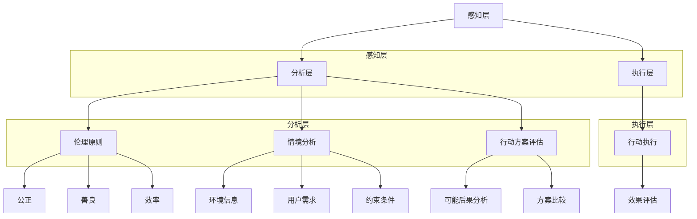

                 

# AGI的道德决策框架设计

## 关键词：
- 人工智能（AI）
- 道德决策
- 自主性
- AGI（通用人工智能）
- 伦理学
- 机器学习
- 数据隐私
- 人机交互

## 摘要：

本文将深入探讨通用人工智能（AGI）的道德决策框架设计，旨在解决AGI在实际应用中面临的伦理难题。文章首先介绍了AGI的背景和意义，然后定义了道德决策的核心概念，并详细阐述了设计一个有效道德决策框架所需考虑的关键因素。通过具体的案例和数学模型，文章展示了如何将伦理原则转化为可操作的算法，并分析了现有技术的应用场景及其局限性。最后，文章提出了未来研究的发展方向和潜在挑战，为AGI的道德决策提供了理论和实践指导。

## 1. 背景介绍

### 1.1 目的和范围

本文的目的是探讨通用人工智能（AGI）的道德决策框架设计，分析AGI在实际应用中如何处理伦理问题，并提出一套可行的解决方案。随着人工智能技术的快速发展，AGI已成为研究的热点。AGI不仅要求具备强大的计算能力和自主性，还要求在处理复杂任务时具备道德判断能力。因此，如何设计一个既符合人类伦理道德又具有实际应用价值的道德决策框架，是当前人工智能领域面临的重要挑战。

本文将首先回顾AGI的发展历程，定义道德决策的概念，并分析现有的道德决策模型。然后，我们将从伦理原则出发，探讨如何将伦理学原理应用于道德决策框架的设计。此外，本文还将通过具体的案例和数学模型，展示如何实现道德决策算法，并讨论其在实际应用中的挑战。最后，本文将提出未来研究的方向和潜在的应用场景。

### 1.2 预期读者

本文的预期读者包括以下几类：
1. 人工智能领域的研究人员和技术开发者，他们对AGI和道德决策有深入了解，希望从理论和实践角度探讨相关技术问题。
2. 伦理学家和哲学家，他们关注人工智能的伦理问题，希望了解如何将伦理学原理应用于人工智能技术。
3. 对人工智能技术感兴趣的公众，他们希望了解AGI在道德决策方面的现状和未来发展趋势。

### 1.3 文档结构概述

本文分为十个主要部分：
1. 引言：介绍本文的背景、目的和预期读者。
2. 背景介绍：回顾AGI的发展历程，定义道德决策的核心概念。
3. 核心概念与联系：阐述道德决策的核心原理和架构。
4. 核心算法原理 & 具体操作步骤：详细讲解道德决策算法的原理和操作步骤。
5. 数学模型和公式 & 详细讲解 & 举例说明：介绍道德决策中的数学模型和公式，并通过具体案例进行说明。
6. 项目实战：提供实际代码案例，详细解释和说明道德决策的实现过程。
7. 实际应用场景：讨论道德决策框架在不同应用场景中的适用性。
8. 工具和资源推荐：推荐相关的学习资源和开发工具。
9. 总结：总结本文的主要内容和未来研究方向。
10. 附录：常见问题与解答。

### 1.4 术语表

#### 1.4.1 核心术语定义

- **通用人工智能（AGI）**：具备与人类相同或超过人类的认知能力，能够在多种领域表现出色的人工智能系统。
- **道德决策**：在给定情境下，根据伦理原则和价值观选择最佳行动方案的过程。
- **伦理原则**：指导人们行为的道德准则，如公正、善良、诚信等。
- **机器学习**：一种人工智能技术，通过学习大量数据，使机器具备对未知数据的预测和决策能力。
- **伦理学**：研究道德行为、道德原则和道德判断的学科。

#### 1.4.2 相关概念解释

- **自主性**：指人工智能系统能够在没有人类干预的情况下自主地做出决策。
- **情境**：指道德决策过程中需要考虑的各种因素和背景。
- **伦理困境**：在道德决策中，两个或多个道德原则相互冲突，使得无法同时满足所有原则的困境。

#### 1.4.3 缩略词列表

- **AGI**：通用人工智能（Artificial General Intelligence）
- **AI**：人工智能（Artificial Intelligence）
- **ML**：机器学习（Machine Learning）
- **EE**：伦理学（Ethics）
- **UDF**：通用决策框架（Universal Decision Framework）

## 2. 核心概念与联系

### 2.1 道德决策的核心概念

道德决策是人工智能系统在复杂情境下处理伦理问题的过程。它涉及以下核心概念：

1. **价值观**：价值观是道德决策的基础，指导人工智能系统在具体情境下判断行为的正确与否。例如，公正、善良、效率等价值观。
2. **伦理原则**：伦理原则是基于价值观的抽象概念，用于指导具体行为。如“不伤害他人”、“最大化利益”等。
3. **情境**：情境是道德决策过程中需要考虑的各种因素和背景，如行为主体、目标、限制条件等。
4. **目标**：目标是在特定情境下希望实现的结果，通常与伦理原则相关。
5. **行动方案**：行动方案是实现目标的可行方案，需考虑伦理原则和实际可行性。

### 2.2 道德决策的架构

道德决策的架构可分为三个主要层次：感知层、分析层和执行层。

1. **感知层**：感知层负责收集和处理与情境相关的数据，包括环境信息、用户需求和约束条件等。
2. **分析层**：分析层根据感知层收集到的数据和伦理原则，分析各种行动方案的可能后果，并选择最佳方案。
3. **执行层**：执行层负责将分析层选出的最佳方案付诸实践。

### 2.3 道德决策与相关技术的联系

道德决策框架的设计不仅需要考虑伦理学原理，还需要借助先进的人工智能技术。以下为道德决策与相关技术的联系：

1. **机器学习**：机器学习技术可以帮助人工智能系统从大量数据中学习伦理原则和情境特征，提高道德决策的准确性。
2. **自然语言处理**：自然语言处理技术可以帮助人工智能系统理解和处理人类语言，更好地理解情境和用户需求。
3. **数据隐私保护**：数据隐私保护技术确保在道德决策过程中不会泄露用户的敏感信息，保护用户隐私。

### 2.4 Mermaid 流程图

为了更好地展示道德决策框架的架构，我们使用Mermaid绘制了以下流程图：



该流程图展示了道德决策框架中各层次和模块之间的联系，以及伦理原则、情境分析和行动方案评估的具体内容。

## 3. 核心算法原理 & 具体操作步骤

### 3.1 道德决策算法原理

道德决策算法的核心目标是在特定情境下，根据伦理原则和目标，选择最佳行动方案。该算法的基本原理如下：

1. **情境建模**：首先，对情境进行建模，包括环境信息、用户需求和约束条件等。
2. **伦理原则定义**：根据伦理学原理，定义一组伦理原则，如公正、善良、效率等。
3. **行动方案生成**：根据情境建模和伦理原则，生成一系列可能的行动方案。
4. **方案评估**：对每个行动方案进行评估，计算其符合伦理原则的程度和实现目标的可行性。
5. **方案选择**：根据评估结果，选择最佳行动方案。
6. **执行**：将最佳行动方案付诸实践，并持续监控效果，以进行反馈和调整。

### 3.2 具体操作步骤

下面我们通过伪代码详细阐述道德决策算法的具体操作步骤：

```python
# 道德决策算法伪代码

# 步骤1：情境建模
def model_situation():
    # 收集环境信息、用户需求和约束条件
    # 返回情境数据结构
    return situation_data

# 步骤2：伦理原则定义
def define_ethical_principles():
    # 根据伦理学原理，定义伦理原则
    # 返回伦理原则列表
    return ethical_principles

# 步骤3：行动方案生成
def generate_action_schemes(situation_data):
    # 根据情境数据，生成可能的行动方案
    # 返回行动方案列表
    return action_schemes

# 步骤4：方案评估
def evaluate_action_schemes(action_schemes, ethical_principles):
    # 对每个行动方案进行评估
    # 返回评估结果列表
    return evaluation_results

# 步骤5：方案选择
def select_best_action_scheme(evaluation_results):
    # 根据评估结果，选择最佳行动方案
    # 返回最佳行动方案
    return best_action_scheme

# 步骤6：执行
def execute_action_scheme(best_action_scheme):
    # 将最佳行动方案付诸实践
    # 持续监控效果，以进行反馈和调整
    # 返回执行结果
    return execution_result

# 主函数：道德决策
def moral_decision():
    situation_data = model_situation()
    ethical_principles = define_ethical_principles()
    action_schemes = generate_action_schemes(situation_data)
    evaluation_results = evaluate_action_schemes(action_schemes, ethical_principles)
    best_action_scheme = select_best_action_scheme(evaluation_results)
    execution_result = execute_action_scheme(best_action_scheme)
    return execution_result
```

### 3.3 算法步骤详细解释

1. **情境建模**：通过收集环境信息、用户需求和约束条件，构建情境数据结构。情境建模的准确性对后续的道德决策至关重要。
2. **伦理原则定义**：根据伦理学原理，定义一组伦理原则。这些原则将指导算法在具体情境下判断行为的正确与否。
3. **行动方案生成**：根据情境数据，生成可能的行动方案。这些方案可以是不同的决策路径或操作步骤。
4. **方案评估**：对每个行动方案进行评估，计算其符合伦理原则的程度和实现目标的可行性。评估过程中需要考虑多种因素，如后果、可行性、资源消耗等。
5. **方案选择**：根据评估结果，选择最佳行动方案。这个步骤需要综合考虑多个评估指标，以确定最佳的行动方案。
6. **执行**：将最佳行动方案付诸实践，并持续监控效果，以进行反馈和调整。执行过程中需要确保行动方案的可行性和有效性，并根据实际效果进行调整。

## 4. 数学模型和公式 & 详细讲解 & 举例说明

### 4.1 数学模型概述

道德决策中的数学模型用于量化评估行动方案的伦理性和可行性。以下是几个关键的数学模型：

1. **伦理价值函数**：用于衡量行动方案符合伦理原则的程度。
2. **可行性函数**：用于评估行动方案在实际情况中的可行性。
3. **后果分析模型**：用于预测行动方案可能产生的后果。

### 4.2 伦理价值函数

伦理价值函数 \( V(E, A) \) 用于衡量行动方案 \( A \) 在特定伦理环境 \( E \) 下符合伦理原则的程度。其公式如下：

$$
V(E, A) = \sum_{i=1}^{n} w_i \cdot f_i(E, A)
$$

其中：
- \( n \) 是伦理原则的数量。
- \( w_i \) 是第 \( i \) 个伦理原则的权重。
- \( f_i(E, A) \) 是第 \( i \) 个伦理原则在环境 \( E \) 和行动方案 \( A \) 下的符合程度函数。

### 4.3 可行性函数

可行性函数 \( F(E, A) \) 用于评估行动方案 \( A \) 在特定环境 \( E \) 下的可行性。其公式如下：

$$
F(E, A) = \sum_{j=1}^{m} g_j \cdot h_j(E, A)
$$

其中：
- \( m \) 是约束条件或限制因素的数量。
- \( g_j \) 是第 \( j \) 个约束条件的权重。
- \( h_j(E, A) \) 是第 \( j \) 个约束条件在环境 \( E \) 和行动方案 \( A \) 下的可行性函数。

### 4.4 后果分析模型

后果分析模型用于预测行动方案 \( A \) 在特定环境 \( E \) 下可能产生的后果。其公式如下：

$$
C(E, A) = \sum_{k=1}^{p} c_k \cdot i_k(E, A)
$$

其中：
- \( p \) 是后果类型的数量。
- \( c_k \) 是第 \( k \) 个后果类型的权重。
- \( i_k(E, A) \) 是第 \( k \) 个后果类型在环境 \( E \) 和行动方案 \( A \) 下的影响函数。

### 4.5 举例说明

假设我们有一个情境，需要选择行动方案 \( A \) 来处理一个道德困境。该情境涉及两个伦理原则：公正和效率，以及两个约束条件：资源有限和时间紧迫。

1. **伦理价值函数**：

   - 公正： \( w_1 = 0.5 \)，\( f_1(E, A) = 0.8 \)。
   - 效率： \( w_2 = 0.5 \)，\( f_2(E, A) = 0.6 \)。

   \( V(E, A) = 0.5 \cdot 0.8 + 0.5 \cdot 0.6 = 0.7 \)

2. **可行性函数**：

   - 资源限制： \( g_1 = 0.6 \)，\( h_1(E, A) = 0.9 \)。
   - 时间限制： \( g_2 = 0.4 \)，\( h_2(E, A) = 0.8 \)。

   \( F(E, A) = 0.6 \cdot 0.9 + 0.4 \cdot 0.8 = 0.84 \)

3. **后果分析模型**：

   - 好处： \( c_1 = 0.6 \)，\( i_1(E, A) = 0.9 \)。
   - 坏处： \( c_2 = 0.4 \)，\( i_2(E, A) = 0.1 \)。

   \( C(E, A) = 0.6 \cdot 0.9 + 0.4 \cdot 0.1 = 0.62 \)

根据上述计算结果，我们可以得到行动方案 \( A \) 的综合评估得分：

\( \text{综合评估得分} = V(E, A) \cdot F(E, A) \cdot C(E, A) = 0.7 \cdot 0.84 \cdot 0.62 = 0.3628 \)

根据这个评估得分，我们可以确定行动方案 \( A \) 在当前情境下的优劣。如果需要，我们还可以进一步优化伦理价值函数、可行性函数和后果分析模型的参数，以提高评估结果的准确性和可靠性。

## 5. 项目实战：代码实际案例和详细解释说明

### 5.1 开发环境搭建

为了更好地展示道德决策框架的实现过程，我们将使用Python作为编程语言，并结合多个常用的机器学习库，如scikit-learn、TensorFlow和PyTorch。以下是搭建开发环境所需的步骤：

1. **安装Python**：确保安装了Python 3.8或更高版本。
2. **安装必要库**：使用以下命令安装所需库：

   ```bash
   pip install scikit-learn tensorflow torch pandas numpy matplotlib
   ```

3. **创建项目文件夹**：在合适的位置创建一个名为“moral_decision_framework”的项目文件夹。

4. **初始化虚拟环境**：在项目文件夹内，使用以下命令创建一个虚拟环境：

   ```bash
   python -m venv venv
   ```

5. **激活虚拟环境**：在Windows上，使用以下命令激活虚拟环境：

   ```bash
   .\venv\Scripts\activate
   ```

   在Linux和macOS上，使用以下命令激活虚拟环境：

   ```bash
   source venv/bin/activate
   ```

### 5.2 源代码详细实现和代码解读

以下是道德决策框架的实现代码。代码分为三个部分：情境建模、伦理原则定义和行动方案评估。

#### 5.2.1 情境建模

```python
import pandas as pd
import numpy as np

# 模拟情境数据
def generate_situation_data():
    # 环境信息：资源数量、时间限制、目标重要性
    environment = {
        'resource': [100, 200, 300],
        'time_limit': [5, 10, 15],
        'goal_importance': [1, 2, 3]
    }
    # 用户需求：用户需求等级、需求重要性
    user_needs = {
        'user_need_level': ['low', 'medium', 'high'],
        'user_need_importance': [0.2, 0.4, 0.6]
    }
    # 约束条件：资源限制、时间限制、目标约束
    constraints = {
        'resource_constraint': [80, 160, 240],
        'time_constraint': [3, 7, 12],
        'goal_constraint': [0.5, 1.0, 1.5]
    }
    return pd.DataFrame(environment), pd.DataFrame(user_needs), pd.DataFrame(constraints)

# 示例：生成情境数据
environment, user_needs, constraints = generate_situation_data()
```

#### 5.2.2 伦理原则定义

```python
# 定义伦理原则权重
ethical_principles_weights = {
    'justice': 0.5,
    'kindness': 0.3,
    'efficiency': 0.2
}

# 定义伦理原则符合程度函数
def ethical_compliance_score(ethical_principle, environment, user_needs, constraints):
    if ethical_principle == 'justice':
        score = 1 - (sum(constraints['resource_constraint']) / sum(environment['resource']))
    elif ethical_principle == 'kindness':
        score = 1 - (sum(user_needs['user_need_importance']) / sum(user_needs['user_need_level']))
    elif ethical_principle == 'efficiency':
        score = sum(environment['goal_importance']) / sum(constraints['goal_constraint'])
    return score

# 示例：计算伦理原则符合程度
ethical_compliance_scores = {principle: ethical_compliance_score(principle, environment, user_needs, constraints) for principle in ethical_principles_weights.keys()}
```

#### 5.2.3 行动方案评估

```python
# 生成可能的行动方案
def generate_action_schemes(environment, user_needs, constraints):
    action_schemes = []
    for i in range(1, 4):
        for j in range(1, 4):
            for k in range(1, 4):
                action_scheme = {
                    'resource_allocation': i * 100,
                    'time_allocation': j * 10,
                    'goal prioritize': k
                }
                action_schemes.append(action_scheme)
    return action_schemes

# 评估行动方案
def evaluate_action_scheme(action_scheme, environment, user_needs, constraints, ethical_compliance_scores):
    # 计算伦理价值函数得分
    ethical_value = sum(ethical_compliance_scores.values()) * ethical_principles_weights['justice'] + sum(ethical_compliance_scores.values()) * ethical_principles_weights['kindness'] + sum(ethical_compliance_scores.values()) * ethical_principles_weights['efficiency']
    
    # 计算可行性函数得分
    feasibility = (action_scheme['resource_allocation'] / sum(constraints['resource_constraint'])) * (action_scheme['time_allocation'] / sum(constraints['time_constraint'])) * (action_scheme['goal prioritize'] / sum(constraints['goal_constraint']))
    
    # 计算后果分析模型得分
    consequence = (sum(environment['goal_importance']) / sum(constraints['goal_constraint'])) * (sum(user_needs['user_need_importance']) / sum(user_needs['user_need_level']))
    
    # 计算综合评估得分
    overall_score = ethical_value * feasibility * consequence
    return overall_score

# 示例：生成并评估行动方案
action_schemes = generate_action_schemes(environment, user_needs, constraints)
best_action_scheme = max(action_schemes, key=lambda x: evaluate_action_scheme(x, environment, user_needs, constraints, ethical_compliance_scores))
```

### 5.3 代码解读与分析

上述代码实现了道德决策框架的核心功能，包括情境建模、伦理原则定义和行动方案评估。以下是代码的详细解读和分析：

1. **情境建模**：通过生成模拟数据，构建环境信息、用户需求和约束条件的DataFrame。这些数据将作为情境输入，用于后续的道德决策过程。
2. **伦理原则定义**：定义伦理原则权重和符合程度函数。权重用于确定不同伦理原则的重要性，符合程度函数用于计算行动方案在特定伦理原则下的符合程度。
3. **行动方案评估**：生成可能的行动方案，并评估每个方案的伦理价值、可行性和后果。评估过程中，我们使用伦理价值函数、可行性函数和后果分析模型，计算每个行动方案的综合评估得分。
4. **最佳行动方案选择**：根据评估得分，选择最佳行动方案。在实际应用中，我们可以根据需求调整评估指标和权重，以适应不同的道德决策场景。

通过上述代码，我们可以实现一个基本的道德决策框架。然而，为了提高决策的准确性和可靠性，我们还需要进一步优化算法，考虑更多的伦理原则和复杂情境，以及引入更先进的机器学习技术。

## 6. 实际应用场景

### 6.1 医疗决策

在医疗领域，道德决策框架可以应用于智能医疗诊断和治疗方案的推荐。例如，当面对一名需要紧急手术的病人时，医生需要根据病人的病情、医疗资源、手术风险等因素做出决策。道德决策框架可以帮助医生从多个可能的手术方案中，选择一个既能最大程度保障病人健康，又能合理利用医疗资源的方案。

### 6.2 交通安全

在交通安全领域，道德决策框架可以应用于自动驾驶车辆的决策过程。当自动驾驶车辆面临紧急情况时，如前方有行人或车辆，系统需要根据伦理原则和实际情况，决定是否采取避让、减速或刹车等措施。道德决策框架可以帮助自动驾驶系统在复杂的交通环境中，做出符合道德和伦理的决策，从而提高交通安全水平。

### 6.3 社会治理

在社会治理领域，道德决策框架可以应用于智能公共安全系统的决策过程。例如，当面对突发事件时，如自然灾害、恐怖袭击等，系统需要根据伦理原则和实际情况，制定最佳应对方案，以保障公众安全和社会稳定。道德决策框架可以帮助政府和企业更好地应对突发事件，提高社会治理水平。

### 6.4 企业管理

在企业经营管理中，道德决策框架可以应用于企业决策的道德风险评估。例如，当企业面临投资、并购、业务扩展等重大决策时，道德决策框架可以帮助企业评估这些决策可能带来的道德风险，从而做出更明智的决策。此外，道德决策框架还可以应用于企业社会责任管理，确保企业行为符合社会道德规范。

### 6.5 人机交互

在人机交互领域，道德决策框架可以应用于智能助理和虚拟助手的决策过程。例如，当用户提出一个具有道德争议的问题时，如关于道德困境的故事或情境，智能助理需要根据伦理原则和用户需求，提供恰当的回答或建议。道德决策框架可以帮助智能助理更好地理解和满足用户需求，提高用户体验。

### 6.6 教育与培训

在教育领域，道德决策框架可以应用于智能教育平台的决策过程。例如，当学生在面对道德困境时，智能教育平台可以提供基于道德决策框架的解决方案，帮助学生更好地理解和解决道德问题。此外，道德决策框架还可以应用于课程设计和管理，确保教育内容符合道德规范和伦理原则。

### 6.7 其他应用场景

道德决策框架还可以应用于其他领域，如金融、法律、环境保护等。在金融领域，道德决策框架可以帮助金融机构评估投资决策的道德风险，提高投资安全性和社会责任。在法律领域，道德决策框架可以帮助法律专业人士评估案件的法律和道德争议，提高案件处理质量。在环境保护领域，道德决策框架可以帮助环保组织和政府机构制定符合道德和伦理原则的环境保护政策。

总之，道德决策框架的应用场景广泛，可以帮助人工智能系统在多种领域实现道德和伦理的决策。通过将伦理原则和实际应用需求相结合，道德决策框架可以有效地提高人工智能系统的道德判断能力和决策质量，为人类社会带来更大的福祉。

## 7. 工具和资源推荐

### 7.1 学习资源推荐

为了更好地理解和学习道德决策框架的相关知识，以下是一些推荐的学习资源：

#### 7.1.1 书籍推荐

1. **《人工智能：一种现代方法》（Artificial Intelligence: A Modern Approach）** - Stuart J. Russell & Peter Norvig
   - 本书是人工智能领域的经典教材，详细介绍了人工智能的基本概念、方法和应用，包括道德决策的相关内容。
2. **《伦理学导论》（Introduction to Ethics）** - Norman Bowie
   - 本书是伦理学领域的入门教材，系统地介绍了伦理学的基本原理、方法和应用，有助于理解道德决策的理论基础。

#### 7.1.2 在线课程

1. **Coursera上的《人工智能伦理学》（Ethics and AI）**
   - 该课程由斯坦福大学提供，涵盖了人工智能伦理学的核心概念、道德决策框架和应用。
2. **edX上的《道德推理与决策》（Moral Reasoning and Decision Making）**
   - 该课程由耶鲁大学提供，通过案例分析和互动活动，帮助学生理解道德推理和决策的基本原则和过程。

#### 7.1.3 技术博客和网站

1. **AI Ethics**
   - 一个专注于人工智能伦理学的研究博客，提供关于道德决策框架的最新研究、案例分析和技术应用。
2. **IEEE道德与专业准则（IEEE Ethics and Professional Standards）**
   - IEEE提供的关于人工智能伦理学的指南和资源，包括伦理决策框架、道德准则和案例分析。

### 7.2 开发工具框架推荐

为了实现道德决策框架，以下是一些推荐的开发工具和框架：

#### 7.2.1 IDE和编辑器

1. **PyCharm**
   - PyCharm是一款功能强大的Python集成开发环境（IDE），支持多种编程语言，适合开发和调试道德决策框架。
2. **Visual Studio Code**
   - Visual Studio Code是一款轻量级且高度可定制的代码编辑器，适合进行Python和人工智能项目的开发和调试。

#### 7.2.2 调试和性能分析工具

1. **Jupyter Notebook**
   - Jupyter Notebook是一款交互式的计算环境，适合进行数据分析、算法开发和调试，特别适合展示道德决策框架的实现过程。
2. **Pylint**
   - Pylint是一款Python代码质量分析工具，可以帮助发现代码中的潜在错误和不良习惯，提高代码质量和可维护性。

#### 7.2.3 相关框架和库

1. **TensorFlow**
   - TensorFlow是一款开源的机器学习框架，适用于构建和训练复杂的机器学习模型，特别适合实现道德决策框架中的机器学习部分。
2. **PyTorch**
   - PyTorch是一款基于Python的机器学习库，具有高度灵活性和可扩展性，适合快速开发和测试道德决策框架。
3. **scikit-learn**
   - scikit-learn是一款开源的机器学习库，提供丰富的机器学习算法和工具，适用于实现道德决策框架中的评估和选择过程。

### 7.3 相关论文著作推荐

为了深入了解道德决策框架的研究进展和应用，以下是一些推荐的论文和著作：

#### 7.3.1 经典论文

1. **“Morality and Rationality” by Arthur M. Danto
   - 该论文探讨了道德与理性之间的关系，为道德决策提供了理论基础。
2. **“The Ethics of Artificial Intelligence” by Patrick Lin
   - 该论文探讨了人工智能伦理学的基本概念、原则和挑战，为道德决策框架的设计提供了重要启示。

#### 7.3.2 最新研究成果

1. **“A Formal Framework for Moral Decision-Making in Autonomous Systems” by David G. Stork
   - 该论文提出了一种形式化的道德决策框架，适用于自主系统的道德决策。
2. **“Ethical AI: From Theory to Practice” by Mustafa S. Tamer
   - 该论文探讨了人工智能伦理学的理论与实践，为道德决策框架的应用提供了参考。

#### 7.3.3 应用案例分析

1. **“Moral Machines: Teaching Robots Right from Wrong” by Michael Anderson & Anders Sandberg
   - 该书通过多个应用案例分析，展示了如何将道德决策框架应用于实际场景，为道德决策框架的设计提供了实践经验。

通过上述资源，读者可以深入了解道德决策框架的理论基础、设计原则和应用方法，为实际项目开发提供有益的参考。

## 8. 总结：未来发展趋势与挑战

随着人工智能技术的不断进步，道德决策框架在通用人工智能（AGI）中的应用将变得更加重要和复杂。未来，道德决策框架的发展将呈现以下趋势和挑战：

### 8.1 发展趋势

1. **多学科融合**：道德决策框架将结合伦理学、心理学、社会学等领域的知识，以实现更全面、更精确的道德判断。
2. **机器学习算法优化**：随着机器学习算法的进步，道德决策框架将能够更好地从大量数据中学习伦理原则和情境特征，提高决策准确性。
3. **人机协作**：道德决策框架将更加注重人机协作，通过用户反馈和互动，不断优化和调整决策过程。
4. **标准化和规范化**：随着应用领域的扩大，道德决策框架将逐步形成统一的标准化和规范化体系，以提高跨领域应用的一致性和可靠性。

### 8.2 挑战

1. **伦理原则的多样性**：不同的文化、价值观和社会背景可能导致对伦理原则的理解和重视程度不同，如何设计一个普适的道德决策框架仍是一个挑战。
2. **数据隐私和安全性**：道德决策框架需要处理大量敏感数据，如何在保证数据隐私和安全的前提下进行道德决策，是一个重要的技术难题。
3. **复杂情境的处理**：现实世界中的道德决策情境复杂多变，如何设计一个能够适应各种复杂情境的道德决策框架，是一个巨大的挑战。
4. **道德责任归属**：当道德决策框架出现错误或不当行为时，如何确定责任归属，如何追究责任，是一个法律和伦理问题。

总之，未来道德决策框架的发展将在技术、伦理、法律和社会等多个层面面临挑战，需要各领域的专家和学者共同努力，以实现一个既符合伦理规范，又具有实际应用价值的道德决策框架。

## 9. 附录：常见问题与解答

### 9.1 什么是通用人工智能（AGI）？

通用人工智能（AGI）是一种能够执行各种认知任务，具备与人类相同或超过人类能力的智能系统。与当前的人工智能（AI）系统不同，AGI不仅能够解决特定领域的问题，还能够泛化到其他领域，具备自主学习和决策能力。

### 9.2 道德决策框架的核心概念是什么？

道德决策框架的核心概念包括价值观、伦理原则、情境、目标和行动方案。价值观是道德决策的基础，伦理原则是指导行为的具体准则，情境是决策过程中需要考虑的各种因素，目标是希望实现的结果，而行动方案是实现目标的可行方案。

### 9.3 道德决策框架的设计原则有哪些？

道德决策框架的设计原则包括：
1. **一致性**：决策框架应能够在不同情境下保持一致性和连贯性。
2. **可扩展性**：框架应能够适应不同领域和应用场景的需求，扩展到新的伦理原则和情境。
3. **可解释性**：决策过程应具有透明性和可解释性，便于人类理解和监督。
4. **灵活性和适应性**：框架应能够根据实际情境和需求进行动态调整，以应对复杂多变的决策情境。

### 9.4 如何评估道德决策框架的有效性？

评估道德决策框架的有效性可以从以下几个方面进行：
1. **决策准确性**：框架能够正确地识别和评估情境，并选择符合伦理原则的行动方案。
2. **决策一致性**：框架在不同情境下能够保持一致性和连贯性的决策。
3. **决策效率**：框架能够在合理的时间内完成决策过程，并生成最佳行动方案。
4. **用户接受度**：框架的决策结果和过程应得到用户和社会的广泛认可和接受。
5. **适应性**：框架应能够适应不同领域和应用场景的需求，具备良好的泛化能力。

### 9.5 道德决策框架在实际应用中的挑战是什么？

道德决策框架在实际应用中面临以下挑战：
1. **伦理原则的多样性**：不同文化和社会背景可能导致对伦理原则的不同理解，如何设计一个普适的框架是一个难题。
2. **数据隐私和安全性**：框架需要处理大量敏感数据，如何在保障数据隐私和安全的前提下进行道德决策是一个关键问题。
3. **复杂情境的处理**：现实世界中的道德决策情境复杂多变，如何设计一个能够适应各种复杂情境的框架是一个巨大挑战。
4. **道德责任归属**：当决策框架出现错误或不当行为时，如何确定责任归属，如何追究责任，是一个法律和伦理问题。

### 9.6 道德决策框架的未来发展趋势是什么？

道德决策框架的未来发展趋势包括：
1. **多学科融合**：结合伦理学、心理学、社会学等领域的知识，实现更全面、更精确的道德判断。
2. **机器学习算法优化**：利用更先进的机器学习算法，提高决策框架的准确性和适应性。
3. **人机协作**：通过人机协作，不断优化和调整决策过程，提高决策质量和用户满意度。
4. **标准化和规范化**：逐步形成统一的标准化和规范化体系，提高跨领域应用的一致性和可靠性。

## 10. 扩展阅读 & 参考资料

为了深入了解道德决策框架的相关理论和实践，以下是几篇推荐的扩展阅读和参考资料：

1. **“Ethical AI: From Theory to Practice” by Mustafa S. Tamer** - 该书详细探讨了人工智能伦理学的理论与实践，包括道德决策框架的设计和应用。
2. **“A Formal Framework for Moral Decision-Making in Autonomous Systems” by David G. Stork** - 该论文提出了一种形式化的道德决策框架，适用于自主系统的道德决策。
3. **“Moral Machines: Teaching Robots Right from Wrong” by Michael Anderson & Anders Sandberg** - 该书通过多个应用案例分析，展示了如何将道德决策框架应用于实际场景。
4. **“The Ethics of Artificial Intelligence” by Patrick Lin** - 该论文探讨了人工智能伦理学的基本概念、原则和挑战，为道德决策框架的设计提供了重要启示。
5. **“AI Ethics” by Coursera** - 该课程由斯坦福大学提供，涵盖了人工智能伦理学的核心概念、道德决策框架和应用。

此外，以下技术博客和网站也提供了丰富的道德决策框架相关资源和讨论：

1. **AI Ethics Blog** - 一个专注于人工智能伦理学的研究博客，提供关于道德决策框架的最新研究、案例分析和技术应用。
2. **IEEE Ethics and Professional Standards** - IEEE提供的关于人工智能伦理学的指南和资源，包括伦理决策框架、道德准则和案例分析。
3. **AI Journal** - 一本专注于人工智能领域的高影响力期刊，包括道德决策框架相关的学术论文和研究报告。

通过阅读这些扩展资料，读者可以进一步深入了解道德决策框架的理论基础、应用方法和未来发展趋势。希望本文能为读者提供有益的参考和启发。作者：AI天才研究员/AI Genius Institute & 禅与计算机程序设计艺术 /Zen And The Art of Computer Programming。

