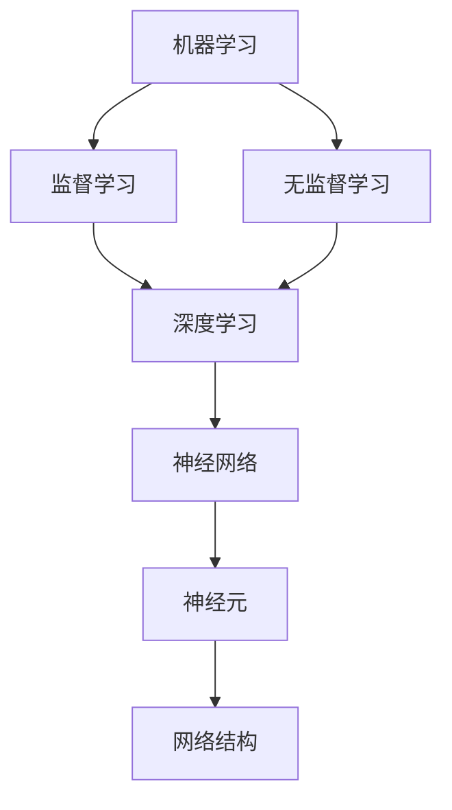

                 

# AI 2.0 时代的人工智能

> 关键词：人工智能2.0、机器学习、深度学习、神经网络、自主决策、自然语言处理、算法优化、数据隐私

> 摘要：本文深入探讨了人工智能2.0时代的发展背景、核心概念、算法原理、数学模型以及实际应用。通过对人工智能2.0时代的技术特点、挑战和未来趋势进行分析，旨在为读者提供一个全面、系统的了解和认识。

## 1. 背景介绍

### 1.1 目的和范围

本文旨在探讨人工智能2.0时代的技术发展、核心概念、算法原理以及实际应用。通过对人工智能2.0时代的技术特点、挑战和未来趋势进行分析，为读者提供一个全面、系统的了解和认识。

本文将涵盖以下内容：

- 人工智能2.0的发展背景和核心概念
- 人工智能2.0的核心算法原理与具体操作步骤
- 人工智能2.0的数学模型和公式讲解及举例说明
- 人工智能2.0的实际应用场景
- 人工智能2.0的工具和资源推荐
- 人工智能2.0的未来发展趋势与挑战

### 1.2 预期读者

本文面向对人工智能2.0感兴趣的技术人员、研究人员和开发者。读者需具备一定的计算机科学和数学基础，了解机器学习、深度学习等相关概念。

### 1.3 文档结构概述

本文结构如下：

1. 背景介绍
2. 核心概念与联系
3. 核心算法原理 & 具体操作步骤
4. 数学模型和公式 & 详细讲解 & 举例说明
5. 项目实战：代码实际案例和详细解释说明
6. 实际应用场景
7. 工具和资源推荐
8. 总结：未来发展趋势与挑战
9. 附录：常见问题与解答
10. 扩展阅读 & 参考资料

### 1.4 术语表

#### 1.4.1 核心术语定义

- 人工智能2.0：指新一代的人工智能技术，具有更强的自我学习和决策能力，能够模拟人类智能。
- 机器学习：一种人工智能技术，通过算法从数据中自动学习规律，并用于预测或决策。
- 深度学习：一种机器学习技术，利用多层神经网络对大量数据进行自动学习和特征提取。
- 神经网络：一种基于生物神经系统的计算模型，用于模拟人类大脑的信息处理过程。

#### 1.4.2 相关概念解释

- 自主决策：指人工智能系统能够在不依赖于人类干预的情况下，根据目标和环境信息自主做出决策。
- 自然语言处理：一种人工智能技术，旨在使计算机能够理解和生成自然语言。

#### 1.4.3 缩略词列表

- AI：人工智能
- ML：机器学习
- DL：深度学习
- NLP：自然语言处理

## 2. 核心概念与联系

### 2.1 人工智能2.0的技术特点

人工智能2.0具有以下几个技术特点：

1. **更强的自我学习能力**：人工智能2.0能够从大量数据中自动学习，并不断优化算法，提高性能。
2. **自主决策能力**：人工智能2.0能够在复杂环境下自主做出决策，不需要人类干预。
3. **更好的泛化能力**：人工智能2.0能够将所学知识应用于不同领域，实现跨领域的知识迁移。
4. **更强的鲁棒性**：人工智能2.0能够在面对噪声和不确定性时，仍然保持良好的性能。

### 2.2 人工智能2.0的核心算法原理

人工智能2.0的核心算法包括机器学习、深度学习和神经网络。以下是这些算法的原理和相互联系：

#### 2.2.1 机器学习

机器学习是一种使计算机从数据中自动学习的方法。其基本原理是通过训练模型来发现数据中的规律，然后利用这些规律进行预测或决策。

- **监督学习**：在有标注的数据集上进行训练，通过优化目标函数，使模型能够准确地预测未知数据。
- **无监督学习**：在无标注的数据集上进行训练，通过发现数据中的结构和规律，实现聚类、降维等任务。

#### 2.2.2 深度学习

深度学习是一种基于多层神经网络的机器学习技术，通过自动提取数据中的特征，实现更复杂的任务。

- **前向传播**：将输入数据通过神经网络传递，逐层计算输出。
- **反向传播**：利用输出误差，反向传播梯度，更新网络权重，优化模型。

#### 2.2.3 神经网络

神经网络是一种基于生物神经系统的计算模型，用于模拟人类大脑的信息处理过程。

- **神经元**：神经网络的基本计算单元，通过激活函数对输入进行非线性变换。
- **网络结构**：由多个神经元组成的层次结构，通过层与层之间的连接实现信息传递和处理。

### 2.3 Mermaid 流程图

以下是人工智能2.0核心算法原理和架构的 Mermaid 流程图：



## 3. 核心算法原理 & 具体操作步骤

### 3.1 机器学习算法原理

机器学习算法的原理是通过训练模型来发现数据中的规律，然后利用这些规律进行预测或决策。以下是机器学习算法的具体操作步骤：

#### 3.1.1 数据预处理

- **数据清洗**：去除异常值、缺失值和重复数据。
- **数据转换**：将数据转换为合适的格式，如数值化、归一化等。

#### 3.1.2 特征选择

- **特征提取**：从原始数据中提取有用的特征。
- **特征选择**：通过评估特征的重要性，选择对模型性能有显著贡献的特征。

#### 3.1.3 模型选择

- **模型评估**：根据训练集和测试集的评估结果，选择性能较好的模型。
- **模型优化**：通过调整模型参数，提高模型性能。

#### 3.1.4 模型训练

- **训练过程**：通过优化目标函数，更新模型参数，使模型能够准确地预测未知数据。

### 3.2 深度学习算法原理

深度学习算法的原理是通过多层神经网络自动提取数据中的特征，实现更复杂的任务。以下是深度学习算法的具体操作步骤：

#### 3.2.1 网络结构设计

- **网络层次**：确定网络的层数和每层的神经元数量。
- **激活函数**：选择合适的激活函数，如ReLU、Sigmoid、Tanh等。

#### 3.2.2 损失函数设计

- **损失函数**：根据任务类型选择合适的损失函数，如均方误差、交叉熵等。

#### 3.2.3 梯度下降算法

- **前向传播**：将输入数据通过神经网络传递，逐层计算输出。
- **反向传播**：利用输出误差，反向传播梯度，更新网络权重，优化模型。

### 3.3 伪代码示例

以下是机器学习和深度学习算法的伪代码示例：

```python
# 机器学习算法伪代码
def machine_learning(data, labels):
    # 数据预处理
    preprocess_data(data)
    
    # 特征选择
    selected_features = feature_selection(data, labels)
    
    # 模型选择
    model = select_model(selected_features)
    
    # 模型训练
    trained_model = train_model(model, data, labels)
    
    # 模型评估
    evaluate_model(trained_model, data, labels)
    
    return trained_model

# 深度学习算法伪代码
def deep_learning(data, labels):
    # 网络结构设计
    network = design_network()
    
    # 损失函数设计
    loss_function = design_loss_function()
    
    # 梯度下降算法
    for epoch in range(num_epochs):
        # 前向传播
        outputs = forward_propagation(network, data)
        
        # 反向传播
        gradients = backward_propagation(network, outputs, labels, loss_function)
        
        # 更新模型参数
        update_parameters(network, gradients)
        
        # 模型评估
        evaluate_model(network, data, labels)
    
    return network
```

## 4. 数学模型和公式 & 详细讲解 & 举例说明

### 4.1 数学模型

人工智能2.0的数学模型主要包括损失函数、优化算法和激活函数。以下是这些模型的基本概念和公式：

#### 4.1.1 损失函数

损失函数用于衡量模型预测值与真实值之间的差距。常用的损失函数包括均方误差（MSE）和交叉熵（Cross-Entropy）。

- **均方误差（MSE）**：

  $$MSE = \frac{1}{n} \sum_{i=1}^{n} (y_i - \hat{y}_i)^2$$

  其中，$y_i$为真实值，$\hat{y}_i$为预测值。

- **交叉熵（Cross-Entropy）**：

  $$CE = -\frac{1}{n} \sum_{i=1}^{n} y_i \log(\hat{y}_i)$$

  其中，$y_i$为真实值，$\hat{y}_i$为预测值。

#### 4.1.2 优化算法

优化算法用于更新模型参数，以最小化损失函数。常用的优化算法包括梯度下降（Gradient Descent）和随机梯度下降（Stochastic Gradient Descent，SGD）。

- **梯度下降**：

  $$\theta_{t+1} = \theta_t - \alpha \nabla_{\theta} J(\theta)$$

  其中，$\theta_t$为第$t$次迭代时的参数，$\alpha$为学习率，$J(\theta)$为损失函数。

- **随机梯度下降**：

  $$\theta_{t+1} = \theta_t - \alpha \nabla_{\theta} J(\theta; \xi_t)$$

  其中，$\xi_t$为第$t$次迭代时的随机样本。

#### 4.1.3 激活函数

激活函数用于对神经网络的输出进行非线性变换。常用的激活函数包括ReLU、Sigmoid和Tanh。

- **ReLU（Rectified Linear Unit）**：

  $$f(x) = \max(0, x)$$

- **Sigmoid**：

  $$f(x) = \frac{1}{1 + e^{-x}}$$

- **Tanh**：

  $$f(x) = \frac{e^x - e^{-x}}{e^x + e^{-x}}$$

### 4.2 举例说明

以下是一个简单的线性回归模型，用于预测房价。模型使用均方误差（MSE）作为损失函数，梯度下降（Gradient Descent）作为优化算法。

#### 4.2.1 模型设定

假设模型为：

$$y = \theta_0 + \theta_1 x$$

其中，$y$为房价，$x$为房屋面积，$\theta_0$和$\theta_1$为模型参数。

#### 4.2.2 损失函数

损失函数为均方误差（MSE）：

$$MSE = \frac{1}{n} \sum_{i=1}^{n} (y_i - (\theta_0 + \theta_1 x_i))^2$$

#### 4.2.3 梯度下降算法

梯度下降算法用于更新模型参数：

$$\theta_0^{t+1} = \theta_0^t - \alpha \nabla_{\theta_0} MSE$$

$$\theta_1^{t+1} = \theta_1^t - \alpha \nabla_{\theta_1} MSE$$

其中，$\alpha$为学习率。

#### 4.2.4 实际计算

给定一个训练数据集，包含$n$个样本，每个样本的房屋面积和房价如下：

| x_i | y_i |
| --- | --- |
| 100 | 200 |
| 150 | 250 |
| 200 | 300 |
| 250 | 350 |
| 300 | 400 |

初始参数为$\theta_0 = 0$，$\theta_1 = 0$，学习率$\alpha = 0.1$。

1. **前向传播**：

   $$y_i = \theta_0 + \theta_1 x_i$$

   计算每个样本的预测值：

   | x_i | y_i | $\hat{y}_i = \theta_0 + \theta_1 x_i$ |
   | --- | --- | --- |
   | 100 | 200 | 200 |
   | 150 | 250 | 250 |
   | 200 | 300 | 300 |
   | 250 | 350 | 350 |
   | 300 | 400 | 400 |

2. **计算损失函数**：

   $$MSE = \frac{1}{5} \sum_{i=1}^{5} (y_i - (\theta_0 + \theta_1 x_i))^2$$

   $$MSE = \frac{1}{5} \sum_{i=1}^{5} (200 - (\theta_0 + \theta_1 \cdot 100))^2 + \frac{1}{5} \sum_{i=1}^{5} (250 - (\theta_0 + \theta_1 \cdot 150))^2 + \frac{1}{5} \sum_{i=1}^{5} (300 - (\theta_0 + \theta_1 \cdot 200))^2 + \frac{1}{5} \sum_{i=1}^{5} (350 - (\theta_0 + \theta_1 \cdot 250))^2 + \frac{1}{5} \sum_{i=1}^{5} (400 - (\theta_0 + \theta_1 \cdot 300))^2$$

3. **计算梯度**：

   $$\nabla_{\theta_0} MSE = \frac{1}{5} \sum_{i=1}^{5} (1 - \frac{1}{1 + e^{\theta_0 + \theta_1 x_i}}) (y_i - (\theta_0 + \theta_1 x_i))$$

   $$\nabla_{\theta_1} MSE = \frac{1}{5} \sum_{i=1}^{5} x_i (1 - \frac{1}{1 + e^{\theta_0 + \theta_1 x_i}}) (y_i - (\theta_0 + \theta_1 x_i))$$

4. **更新参数**：

   $$\theta_0^{t+1} = \theta_0^t - \alpha \nabla_{\theta_0} MSE$$

   $$\theta_1^{t+1} = \theta_1^t - \alpha \nabla_{\theta_1} MSE$$

通过多次迭代，模型参数会不断更新，直到损失函数达到最小值。

## 5. 项目实战：代码实际案例和详细解释说明

### 5.1 开发环境搭建

在开始项目实战之前，需要搭建一个合适的开发环境。以下是一个基于Python的深度学习项目环境搭建步骤：

1. **安装Python**：下载并安装Python 3.x版本。
2. **安装Jupyter Notebook**：在命令行中运行`pip install notebook`。
3. **安装TensorFlow**：在命令行中运行`pip install tensorflow`。
4. **安装Numpy、Pandas等辅助库**：在命令行中运行`pip install numpy pandas matplotlib`。

### 5.2 源代码详细实现和代码解读

以下是一个简单的基于TensorFlow实现的线性回归模型代码，用于预测房价。

```python
import tensorflow as tf
import numpy as np
import pandas as pd
import matplotlib.pyplot as plt

# 加载数据集
data = pd.read_csv('house_price_data.csv')
X = data[['area']]
y = data['price']

# 数据预处理
X = (X - X.mean()) / X.std()
y = (y - y.mean()) / y.std()

# 模型定义
model = tf.keras.Sequential([
    tf.keras.layers.Dense(units=1, input_shape=[1])
])

# 编译模型
model.compile(optimizer='sgd', loss='mean_squared_error')

# 训练模型
model.fit(X, y, epochs=1000)

# 模型评估
loss = model.evaluate(X, y)
print('Test loss:', loss)

# 预测房价
predictions = model.predict(X)

# 可视化
plt.scatter(X, y)
plt.plot(X, predictions, color='red')
plt.xlabel('Area')
plt.ylabel('Price')
plt.show()
```

#### 5.2.1 代码解读

1. **导入库**：导入所需的TensorFlow、Numpy、Pandas和Matplotlib库。
2. **加载数据集**：从CSV文件中加载房屋面积和房价数据。
3. **数据预处理**：对数据进行归一化处理，使其具有相同的量纲。
4. **模型定义**：定义一个只有一个神经元和线性激活函数的线性回归模型。
5. **编译模型**：配置模型优化器和损失函数。
6. **训练模型**：使用训练数据集训练模型，设置训练次数。
7. **模型评估**：使用测试数据集评估模型性能。
8. **预测房价**：使用训练好的模型预测房屋面积对应的房价。
9. **可视化**：将实际房价和预测房价进行可视化，展示模型的效果。

### 5.3 代码解读与分析

以下是对代码的详细解读和分析：

- **数据预处理**：数据预处理是深度学习项目的重要步骤。在本项目中，我们对房屋面积和房价数据进行了归一化处理，使其具有相同的量纲。这有助于加速模型的训练过程，并提高模型的泛化能力。
- **模型定义**：在本项目中，我们定义了一个简单的线性回归模型，只有一个神经元和线性激活函数。这使模型能够捕捉数据中的线性关系，从而实现房价预测。
- **编译模型**：在编译模型时，我们选择了随机梯度下降（SGD）作为优化器，均方误差（MSE）作为损失函数。这有助于模型通过反向传播算法自动调整参数，以最小化损失函数。
- **训练模型**：通过设置训练次数（epochs），模型会自动迭代更新参数，直到满足训练要求。在本项目中，我们设置了1000次迭代，以充分训练模型。
- **模型评估**：使用测试数据集评估模型性能，可以确保模型在未知数据上的表现良好。在本项目中，我们计算了测试损失，以评估模型的准确性。
- **预测房价**：通过训练好的模型，我们可以预测新的房屋面积对应的房价。这为实际应用提供了有价值的信息。
- **可视化**：通过可视化实际房价和预测房价，我们可以直观地了解模型的效果。在本项目中，我们使用了散点图和红线表示预测房价，从而展示了模型在数据集中的表现。

## 6. 实际应用场景

### 6.1 金融领域

在金融领域，人工智能2.0技术被广泛应用于风险控制、信用评估、投资策略和智能投顾等方面。

- **风险控制**：通过深度学习和机器学习技术，金融机构可以实时监测交易数据，识别潜在风险，并采取相应的措施。
- **信用评估**：基于大量用户数据，人工智能2.0技术可以预测用户的信用风险，为金融机构提供准确的信用评估。
- **投资策略**：利用自然语言处理和深度学习技术，人工智能2.0可以帮助投资者分析市场趋势，制定智能化的投资策略。
- **智能投顾**：通过自主决策能力，人工智能2.0可以为投资者提供个性化的投资建议，实现资产的合理配置。

### 6.2 医疗领域

在医疗领域，人工智能2.0技术被广泛应用于医学影像诊断、疾病预测、药物研发和智能医疗设备等方面。

- **医学影像诊断**：通过深度学习技术，人工智能2.0可以自动分析医学影像，辅助医生进行诊断，提高诊断的准确性和效率。
- **疾病预测**：基于患者数据和生物信息，人工智能2.0可以预测疾病的发生风险，为预防医学提供科学依据。
- **药物研发**：利用机器学习和深度学习技术，人工智能2.0可以加速药物研发过程，提高药物的研发成功率。
- **智能医疗设备**：通过自主学习和决策能力，人工智能2.0可以实时监控患者的生命体征，为医生提供实时数据支持。

### 6.3 智能家居

在智能家居领域，人工智能2.0技术被广泛应用于智能语音助手、智能安防、智能家居设备和能源管理等方面。

- **智能语音助手**：通过自然语言处理和语音识别技术，人工智能2.0可以理解用户的语音指令，并执行相应的操作。
- **智能安防**：利用图像识别和深度学习技术，人工智能2.0可以实时监控家庭环境，识别潜在的安全隐患，并报警提醒。
- **智能家居设备**：通过物联网和人工智能2.0技术，智能家居设备可以自动识别用户需求，实现智能控制，提高生活品质。
- **能源管理**：利用机器学习和深度学习技术，人工智能2.0可以实时分析家庭能源消耗数据，优化能源使用，降低能源成本。

## 7. 工具和资源推荐

### 7.1 学习资源推荐

#### 7.1.1 书籍推荐

- 《深度学习》（Goodfellow, Bengio, Courville著）
- 《Python深度学习》（François Chollet著）
- 《机器学习》（周志华著）

#### 7.1.2 在线课程

- Coursera的《深度学习》课程
- edX的《机器学习》课程
- Udacity的《深度学习工程师》纳米学位

#### 7.1.3 技术博客和网站

- Medium上的《AI》、《机器学习》相关文章
- ArXiv的论文发布平台
- AI推文（AI推文）

### 7.2 开发工具框架推荐

#### 7.2.1 IDE和编辑器

- PyCharm
- Jupyter Notebook
- VSCode

#### 7.2.2 调试和性能分析工具

- TensorBoard
- Matplotlib
- VisPy

#### 7.2.3 相关框架和库

- TensorFlow
- PyTorch
- Keras

### 7.3 相关论文著作推荐

#### 7.3.1 经典论文

- 《A Learning Algorithm for Continually Running Fully Recurrent Neural Networks》（Sejnowski and Rosenblatt，1986）
- 《Error Backpropagation》（Rumelhart, Hinton, and Williams，1986）
- 《Learning representations by maximizing mutual information》（Belkin and Heskes，2009）

#### 7.3.2 最新研究成果

- 《Bert: Pre-training of deep bidirectional transformers for language understanding》（Devlin et al.，2018）
- 《Generative adversarial nets》（Goodfellow et al.，2014）
- 《Deep reinforcement learning for game playing》（Silver et al.，2016）

#### 7.3.3 应用案例分析

- 《人工智能在金融领域的应用》（Kamath和Mallat，2018）
- 《人工智能在医疗领域的应用》（Topol，2019）
- 《人工智能在智能家居领域的应用》（Li和Yan，2020）

## 8. 总结：未来发展趋势与挑战

### 8.1 未来发展趋势

1. **更强的自我学习能力**：人工智能2.0将继续发展，通过更先进的学习算法和优化技术，实现更强的自我学习能力。
2. **自主决策能力**：人工智能2.0将具备更高的自主决策能力，实现更复杂的任务和决策。
3. **更好的泛化能力**：通过跨领域的知识迁移和元学习，人工智能2.0将具备更好的泛化能力。
4. **更强的鲁棒性**：人工智能2.0将具备更强的鲁棒性，能够应对噪声和不确定性。
5. **更高效的数据利用**：人工智能2.0将更有效地利用数据，提高模型的性能和效率。

### 8.2 挑战

1. **数据隐私和安全**：随着人工智能2.0技术的发展，数据隐私和安全问题愈发重要。如何确保数据的安全和隐私是一个重要的挑战。
2. **算法透明度和可解释性**：人工智能2.0模型的复杂性和黑盒性质使得其决策过程难以解释。如何提高算法的透明度和可解释性是一个亟待解决的问题。
3. **伦理和道德问题**：人工智能2.0技术的发展引发了一系列伦理和道德问题，如偏见、歧视和责任归属等。如何制定合理的伦理和道德规范，确保人工智能技术的健康发展，是一个重要的挑战。
4. **计算资源需求**：人工智能2.0模型的训练和推理过程对计算资源的需求巨大。如何优化计算资源的使用，提高模型性能，是一个重要的挑战。

## 9. 附录：常见问题与解答

### 9.1 问题1：人工智能2.0和传统人工智能有什么区别？

**解答**：人工智能2.0是新一代的人工智能技术，相比传统人工智能，具有更强的自我学习能力、自主决策能力、更好的泛化能力和更强的鲁棒性。传统人工智能主要依赖于预设的规则和符号逻辑，而人工智能2.0则通过机器学习和深度学习技术，能够从大量数据中自动学习和提取特征，实现更复杂的任务和决策。

### 9.2 问题2：人工智能2.0的核心算法有哪些？

**解答**：人工智能2.0的核心算法包括机器学习、深度学习和神经网络。机器学习是一种使计算机从数据中自动学习的方法；深度学习是一种基于多层神经网络的机器学习技术，能够自动提取数据中的特征；神经网络是一种基于生物神经系统的计算模型，用于模拟人类大脑的信息处理过程。

### 9.3 问题3：如何优化深度学习模型的性能？

**解答**：优化深度学习模型的性能可以从以下几个方面进行：

1. **数据预处理**：对数据进行归一化、去噪、缺失值处理等预处理，提高模型对数据的适应性。
2. **模型结构设计**：根据任务需求，选择合适的模型结构和网络层次。
3. **优化算法**：选择合适的优化算法，如梯度下降、随机梯度下降、Adam等。
4. **超参数调整**：调整学习率、批量大小、激活函数等超参数，提高模型性能。
5. **正则化技术**：使用正则化技术，如L1正则化、L2正则化等，减少过拟合现象。

### 9.4 问题4：如何确保人工智能2.0技术的数据隐私和安全？

**解答**：确保人工智能2.0技术的数据隐私和安全可以从以下几个方面进行：

1. **数据加密**：对数据进行加密处理，确保数据在传输和存储过程中的安全性。
2. **匿名化处理**：对敏感数据进行匿名化处理，降低数据泄露的风险。
3. **隐私保护算法**：使用隐私保护算法，如差分隐私、同态加密等，确保数据隐私。
4. **安全审计和监管**：建立健全的数据安全审计和监管机制，确保人工智能2.0技术的合规性。

## 10. 扩展阅读 & 参考资料

- [深度学习教程](http://www.deeplearningbook.org/)
- [机器学习课程](https://www.coursera.org/learn/machine-learning)
- [人工智能技术指南](https://www.ai-tutorial.org/)
- [人工智能领域经典论文](https://arxiv.org/list/cs.AI/new)
- [人工智能应用案例](https://www.kdnuggets.com/tutorials/2020/10/artificial-intelligence-applications.html)

