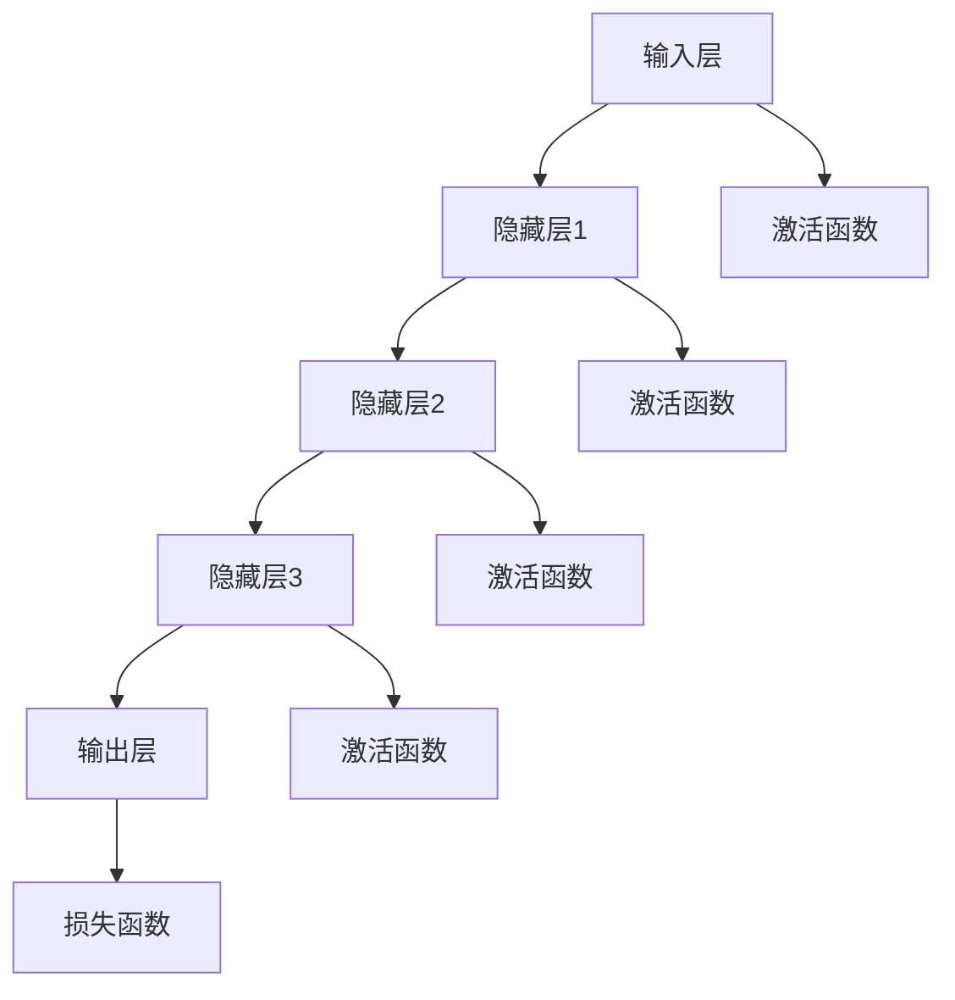

                 

# AI 2.0 时代的深度学习

> 关键词：AI 2.0、深度学习、神经网络、机器学习、人工智能、数据处理、算法优化

> 摘要：本文旨在深入探讨AI 2.0时代的深度学习技术，解析其核心概念、算法原理、数学模型以及实际应用场景。通过一步步的推理和分析，我们将揭示深度学习在当今人工智能领域中的关键作用，并展望其未来的发展趋势与挑战。

## 1. 背景介绍

### 1.1 目的和范围

本文的目标是系统地介绍AI 2.0时代的深度学习技术，帮助读者理解深度学习在人工智能领域的重要性和实际应用。文章将涵盖以下内容：

- 深度学习的核心概念和原理
- 深度学习算法的具体操作步骤
- 数学模型和公式的详细讲解
- 实际应用场景的探讨
- 工具和资源的推荐

### 1.2 预期读者

本文适合对人工智能和深度学习有一定了解的读者，特别是以下人群：

- 计算机科学和人工智能专业的学生和研究人员
- 深度学习和机器学习工程师
- 对人工智能和深度学习感兴趣的爱好者

### 1.3 文档结构概述

本文结构如下：

1. 背景介绍：介绍文章的目的、预期读者和文档结构。
2. 核心概念与联系：介绍深度学习的核心概念和相关架构。
3. 核心算法原理 & 具体操作步骤：详细讲解深度学习算法的原理和操作步骤。
4. 数学模型和公式 & 详细讲解 & 举例说明：介绍深度学习的数学模型和公式，并给出实际例子。
5. 项目实战：代码实际案例和详细解释说明。
6. 实际应用场景：探讨深度学习在各个领域的应用。
7. 工具和资源推荐：推荐学习资源和开发工具。
8. 总结：未来发展趋势与挑战。
9. 附录：常见问题与解答。
10. 扩展阅读 & 参考资料。

### 1.4 术语表

#### 1.4.1 核心术语定义

- 深度学习：一种机器学习技术，通过构建多层神经网络来对数据进行自动特征提取和模式识别。
- 神经网络：一种由神经元组成的计算模型，用于处理和分类数据。
- 机器学习：一种人工智能技术，通过数据训练模型来自动学习和改进性能。
- 数据预处理：在深度学习过程中，对数据进行清洗、归一化和特征提取等操作。
- 反向传播：一种用于训练神经网络的算法，通过计算损失函数的梯度来更新网络权重。

#### 1.4.2 相关概念解释

- 激活函数：神经网络中用于引入非线性性的函数，如ReLU、Sigmoid和Tanh等。
- 损失函数：用于衡量模型预测结果与真实值之间差距的函数，如均方误差（MSE）和交叉熵损失（CE）等。
- 批量大小：训练过程中一次迭代的样本数量。
- 学习率：用于控制模型参数更新速度的参数。

#### 1.4.3 缩略词列表

- AI：人工智能（Artificial Intelligence）
- ML：机器学习（Machine Learning）
- DL：深度学习（Deep Learning）
- CNN：卷积神经网络（Convolutional Neural Network）
- RNN：循环神经网络（Recurrent Neural Network）
- GAN：生成对抗网络（Generative Adversarial Network）

## 2. 核心概念与联系

### 2.1 深度学习的核心概念

深度学习是一种机器学习技术，通过构建多层神经网络来实现对数据的自动特征提取和模式识别。以下是深度学习的一些核心概念：

1. **神经网络**：神经网络是一种由神经元组成的计算模型，用于处理和分类数据。每个神经元都连接到其他神经元，并接收来自它们的输入信号。
2. **多层神经网络**：深度学习中的神经网络通常包含多层，每层都能对数据进行特征提取和转换。这种层次结构使得神经网络能够学习更复杂的特征。
3. **激活函数**：激活函数用于引入非线性性，使得神经网络能够更好地拟合数据。常见的激活函数有ReLU、Sigmoid和Tanh等。
4. **损失函数**：损失函数用于衡量模型预测结果与真实值之间的差距，并指导模型参数的更新。常见的损失函数有均方误差（MSE）和交叉熵损失（CE）等。
5. **反向传播**：反向传播是一种用于训练神经网络的算法，通过计算损失函数的梯度来更新网络权重。

### 2.2 深度学习的架构

深度学习的架构通常包括以下部分：

1. **输入层**：接收外部输入数据，如图片、文本或声音等。
2. **隐藏层**：对输入数据进行特征提取和转换，通常包含多层。
3. **输出层**：产生预测结果，如分类结果或回归值等。
4. **连接权重**：连接各层神经元的权重，用于传递输入信号。
5. **激活函数**：在每个神经元上应用激活函数，引入非线性性。

下面是深度学习架构的Mermaid流程图：



## 3. 核心算法原理 & 具体操作步骤

### 3.1 深度学习算法原理

深度学习算法的核心是通过多层神经网络对数据进行特征提取和模式识别。以下是深度学习算法的基本原理：

1. **输入数据**：输入数据经过预处理后，作为神经网络的输入。
2. **前向传播**：数据从输入层经过隐藏层，逐层传递，并在每个神经元上应用激活函数，得到输出。
3. **反向传播**：计算输出结果与真实值之间的差距，即损失函数的值，并通过反向传播算法计算每个神经元的梯度，用于更新连接权重。
4. **迭代优化**：重复前向传播和反向传播过程，不断更新模型参数，直到模型收敛。

### 3.2 深度学习算法的具体操作步骤

以下是深度学习算法的具体操作步骤，使用伪代码进行描述：

```python
# 深度学习算法的具体操作步骤

# 初始化参数
初始化权重和偏置
初始化学习率

# 前向传播
输入数据 = 预处理(原始数据)
输出 = 神经网络(输入数据)

# 计算损失函数
损失 = 损失函数(输出，真实值)

# 反向传播
梯度 = 计算梯度(神经网络，输出，损失)

# 更新参数
权重 = 权重 - 学习率 * 梯度
偏置 = 偏置 - 学习率 * 梯度

# 迭代优化
重复步骤2-5，直到模型收敛
```

## 4. 数学模型和公式 & 详细讲解 & 举例说明

### 4.1 数学模型和公式

深度学习中的数学模型主要包括神经网络中的前向传播和反向传播算法。以下是这些算法的详细公式和解释：

#### 4.1.1 前向传播

前向传播是指数据从输入层经过隐藏层，最终得到输出层的过程。以下是前向传播的公式：

$$
z_i = \sum_{j} w_{ij} * a_{j} + b_i
$$

其中，$z_i$ 是第 $i$ 个神经元的输入，$w_{ij}$ 是第 $i$ 个神经元与第 $j$ 个神经元的连接权重，$a_j$ 是第 $j$ 个神经元的激活值，$b_i$ 是第 $i$ 个神经元的偏置。

#### 4.1.2 激活函数

激活函数用于引入非线性性，常见的激活函数有ReLU、Sigmoid和Tanh等。以下是ReLU激活函数的公式：

$$
a_i = \max(0, z_i)
$$

其中，$a_i$ 是第 $i$ 个神经元的激活值。

#### 4.1.3 损失函数

损失函数用于衡量模型预测结果与真实值之间的差距。常见的损失函数有均方误差（MSE）和交叉熵损失（CE）等。以下是MSE损失函数的公式：

$$
损失 = \frac{1}{2} \sum_{i} (y_i - \hat{y_i})^2
$$

其中，$y_i$ 是第 $i$ 个样本的真实值，$\hat{y_i}$ 是第 $i$ 个样本的预测值。

#### 4.1.4 反向传播

反向传播是指从输出层开始，逆向计算每个神经元的梯度，并更新模型参数的过程。以下是反向传播的公式：

$$
\frac{\partial L}{\partial w_{ij}} = a_{i} * \frac{\partial a_i}{\partial z_i} * \frac{\partial z_i}{\partial w_{ij}}
$$

$$
\frac{\partial L}{\partial b_i} = a_{i} * \frac{\partial a_i}{\partial z_i}
$$

其中，$L$ 是损失函数，$w_{ij}$ 是第 $i$ 个神经元与第 $j$ 个神经元的连接权重，$a_i$ 是第 $i$ 个神经元的激活值，$\frac{\partial a_i}{\partial z_i}$ 是激活函数的导数。

### 4.2 详细讲解与举例说明

为了更好地理解深度学习中的数学模型和公式，下面通过一个简单的例子进行讲解。

#### 4.2.1 例子

假设我们有一个简单的神经网络，包含一个输入层、一个隐藏层和一个输出层，如图所示：

```
输入层：[x1, x2]
隐藏层：[h1, h2]
输出层：[y1, y2]
```

#### 4.2.2 前向传播

给定输入数据 $x_1 = 2, x_2 = 3$，连接权重 $w_{11} = 1, w_{12} = 2, w_{21} = 3, w_{22} = 4$，偏置 $b_1 = 0, b_2 = 1$，以及激活函数为ReLU，我们可以计算隐藏层和输出层的激活值：

$$
z_1 = w_{11} * x_1 + w_{21} * h_1 + b_1 = 1 * 2 + 3 * 0 + 0 = 2
$$

$$
z_2 = w_{12} * x_2 + w_{22} * h_2 + b_2 = 2 * 3 + 4 * 1 + 1 = 11
$$

$$
h_1 = \max(0, z_1) = \max(0, 2) = 2
$$

$$
h_2 = \max(0, z_2) = \max(0, 11) = 11
$$

$$
z_3 = w_{31} * h_1 + w_{32} * h_2 + b_3 = 1 * 2 + 2 * 11 + 1 = 25
$$

$$
z_4 = w_{41} * h_1 + w_{42} * h_2 + b_4 = 1 * 2 + 2 * 11 + 1 = 25
$$

$$
y_1 = \max(0, z_3) = \max(0, 25) = 25
$$

$$
y_2 = \max(0, z_4) = \max(0, 25) = 25
$$

#### 4.2.3 反向传播

给定真实输出值 $y_1 = 5, y_2 = 7$，我们可以计算输出层的损失函数：

$$
损失 = \frac{1}{2} \sum_{i} (y_i - \hat{y_i})^2 = \frac{1}{2} ((5 - 25)^2 + (7 - 25)^2) = 150
$$

然后，我们可以计算输出层和隐藏层的梯度：

$$
\frac{\partial L}{\partial w_{31}} = a_{3} * \frac{\partial a_3}{\partial z_3} * \frac{\partial z_3}{\partial w_{31}} = 25 * 1 * 2 = 50
$$

$$
\frac{\partial L}{\partial w_{32}} = a_{3} * \frac{\partial a_3}{\partial z_3} * \frac{\partial z_3}{\partial w_{32}} = 25 * 1 * 3 = 75
$$

$$
\frac{\partial L}{\partial w_{41}} = a_{4} * \frac{\partial a_4}{\partial z_4} * \frac{\partial z_4}{\partial w_{41}} = 25 * 1 * 2 = 50
$$

$$
\frac{\partial L}{\partial w_{42}} = a_{4} * \frac{\partial a_4}{\partial z_4} * \frac{\partial z_4}{\partial w_{42}} = 25 * 1 * 3 = 75
$$

$$
\frac{\partial L}{\partial b_{3}} = a_{3} * \frac{\partial a_3}{\partial z_3} = 25 * 1 = 25
$$

$$
\frac{\partial L}{\partial b_{4}} = a_{4} * \frac{\partial a_4}{\partial z_4} = 25 * 1 = 25
$$

$$
\frac{\partial L}{\partial w_{11}} = a_{1} * \frac{\partial a_1}{\partial z_1} * \frac{\partial z_1}{\partial w_{11}} = 2 * 1 * 1 = 2
$$

$$
\frac{\partial L}{\partial w_{12}} = a_{1} * \frac{\partial a_1}{\partial z_1} * \frac{\partial z_1}{\partial w_{12}} = 2 * 1 * 2 = 4
$$

$$
\frac{\partial L}{\partial w_{21}} = a_{2} * \frac{\partial a_2}{\partial z_2} * \frac{\partial z_2}{\partial w_{21}} = 11 * 1 * 3 = 33
$$

$$
\frac{\partial L}{\partial w_{22}} = a_{2} * \frac{\partial a_2}{\partial z_2} * \frac{\partial z_2}{\partial w_{22}} = 11 * 1 * 4 = 44
$$

$$
\frac{\partial L}{\partial b_{1}} = a_{1} * \frac{\partial a_1}{\partial z_1} = 2 * 1 = 2
$$

$$
\frac{\partial L}{\partial b_{2}} = a_{2} * \frac{\partial a_2}{\partial z_2} = 11 * 1 = 11
$$

最后，我们可以更新模型参数：

$$
w_{11} = w_{11} - 学习率 * \frac{\partial L}{\partial w_{11}} = 1 - 0.1 * 2 = 0.8
$$

$$
w_{12} = w_{12} - 学习率 * \frac{\partial L}{\partial w_{12}} = 2 - 0.1 * 4 = 1.6
$$

$$
w_{21} = w_{21} - 学习率 * \frac{\partial L}{\partial w_{21}} = 3 - 0.1 * 33 = 2.67
$$

$$
w_{22} = w_{22} - 学习率 * \frac{\partial L}{\partial w_{22}} = 4 - 0.1 * 44 = 3.56
$$

$$
w_{31} = w_{31} - 学习率 * \frac{\partial L}{\partial w_{31}} = 1 - 0.1 * 50 = 0.5
$$

$$
w_{32} = w_{32} - 学习率 * \frac{\partial L}{\partial w_{32}} = 2 - 0.1 * 75 = 1.25
$$

$$
w_{41} = w_{41} - 学习率 * \frac{\partial L}{\partial w_{41}} = 1 - 0.1 * 50 = 0.5
$$

$$
w_{42} = w_{42} - 学习率 * \frac{\partial L}{\partial w_{42}} = 2 - 0.1 * 75 = 1.25
$$

$$
b_{3} = b_{3} - 学习率 * \frac{\partial L}{\partial b_{3}} = 1 - 0.1 * 25 = 0.75
$$

$$
b_{4} = b_{4} - 学习率 * \frac{\partial L}{\partial b_{4}} = 1 - 0.1 * 25 = 0.75
$$

$$
b_{1} = b_{1} - 学习率 * \frac{\partial L}{\partial b_{1}} = 0 - 0.1 * 2 = -0.2
$$

$$
b_{2} = b_{2} - 学习率 * \frac{\partial L}{\partial b_{2}} = 1 - 0.1 * 11 = 0.89
$$

## 5. 项目实战：代码实际案例和详细解释说明

### 5.1 开发环境搭建

为了进行深度学习项目实战，我们需要搭建一个适合的开发环境。以下是所需的工具和步骤：

#### 5.1.1 工具安装

1. **Python**：安装Python 3.7或更高版本。
2. **Jupyter Notebook**：安装Jupyter Notebook用于交互式编程。
3. **TensorFlow**：安装TensorFlow，用于实现深度学习算法。
4. **Numpy**：安装Numpy，用于数学计算。

#### 5.1.2 环境配置

1. 打开终端或命令行。
2. 安装Python：`pip install python`
3. 安装Jupyter Notebook：`pip install notebook`
4. 安装TensorFlow：`pip install tensorflow`
5. 安装Numpy：`pip install numpy`

### 5.2 源代码详细实现和代码解读

下面是使用TensorFlow实现一个简单的深度学习模型的源代码，包括数据预处理、模型定义、训练和评估。

#### 5.2.1 数据预处理

```python
import numpy as np
import tensorflow as tf

# 加载数据集
(x_train, y_train), (x_test, y_test) = tf.keras.datasets.mnist.load_data()

# 数据预处理
x_train = x_train / 255.0
x_test = x_test / 255.0

# 将数据集展开为二维数组
x_train = x_train.reshape(-1, 784)
x_test = x_test.reshape(-1, 784)

# 转换标签为独热编码
y_train = tf.keras.utils.to_categorical(y_train, num_classes=10)
y_test = tf.keras.utils.to_categorical(y_test, num_classes=10)
```

#### 5.2.2 模型定义

```python
# 定义模型
model = tf.keras.Sequential([
    tf.keras.layers.Dense(128, activation='relu', input_shape=(784,)),
    tf.keras.layers.Dropout(0.2),
    tf.keras.layers.Dense(10, activation='softmax')
])

# 编译模型
model.compile(optimizer='adam',
              loss='categorical_crossentropy',
              metrics=['accuracy'])
```

#### 5.2.3 训练和评估

```python
# 训练模型
model.fit(x_train, y_train, epochs=10, batch_size=32, validation_split=0.2)

# 评估模型
test_loss, test_acc = model.evaluate(x_test, y_test)
print("Test accuracy:", test_acc)
```

### 5.3 代码解读与分析

1. **数据预处理**：加载数据集并对其进行预处理，包括归一化和标签编码。
2. **模型定义**：使用TensorFlow的Sequential模型定义一个简单的深度学习模型，包括一个全连接层（Dense）和一个输出层（softmax）。
3. **训练和评估**：使用fit方法训练模型，使用evaluate方法评估模型在测试数据集上的表现。

通过这个简单的例子，我们可以看到如何使用TensorFlow实现一个深度学习模型，并对其进行训练和评估。

## 6. 实际应用场景

深度学习技术已在各个领域得到了广泛应用，以下是几个典型的实际应用场景：

1. **计算机视觉**：深度学习被广泛用于图像分类、目标检测、图像分割等任务。例如，人脸识别、自动驾驶和医疗影像分析。
2. **自然语言处理**：深度学习在语言模型、机器翻译、情感分析等任务中发挥了重要作用。例如，搜索引擎、智能客服和语音助手。
3. **语音识别**：深度学习技术被用于语音信号的自动识别，应用于智能语音助手、实时翻译和语音控制系统。
4. **推荐系统**：深度学习被用于构建复杂的推荐系统，通过学习用户行为和偏好，为用户推荐个性化内容。
5. **游戏AI**：深度学习被用于构建智能游戏AI，使游戏更具挑战性和互动性。

## 7. 工具和资源推荐

### 7.1 学习资源推荐

#### 7.1.1 书籍推荐

- 《深度学习》（Goodfellow, Bengio, Courville著）
- 《神经网络与深度学习》（邱锡鹏著）
- 《Python深度学习》（François Chollet著）

#### 7.1.2 在线课程

- Coursera上的“深度学习专项课程”（吴恩达教授主讲）
- edX上的“深度学习基础”（微软研究院主讲）
- Udacity的“深度学习工程师纳米学位”

#### 7.1.3 技术博客和网站

- arXiv.org：论文数据库，提供最新的深度学习研究成果。
- Medium：许多深度学习专家和研究人员分享技术博客和文章。
- DeepLearning.AI：吴恩达教授的主页，提供深度学习课程和资源。

### 7.2 开发工具框架推荐

#### 7.2.1 IDE和编辑器

- PyCharm：一款功能强大的Python IDE，适用于深度学习开发。
- Jupyter Notebook：适用于交互式编程和数据可视化。
- VSCode：一款轻量级但功能强大的代码编辑器，支持多种编程语言。

#### 7.2.2 调试和性能分析工具

- TensorBoard：TensorFlow的图形化工具，用于可视化模型的性能指标。
- TensorFlow Profiler：用于分析TensorFlow模型的性能瓶颈。
- NVIDIA Nsight：适用于NVIDIA GPU的调试和分析工具。

#### 7.2.3 相关框架和库

- TensorFlow：一款流行的深度学习框架，适用于多种任务。
- PyTorch：一款易于使用的深度学习框架，适用于研究和开发。
- Keras：一款高级神经网络API，可以与TensorFlow和Theano兼容。

### 7.3 相关论文著作推荐

#### 7.3.1 经典论文

- “A Learning Algorithm for Continually Running Fully Recurrent Neural Networks” (1986)
- “Learning representations by minimizing contrastive divergence” (2006)
- “Gradient-Based Learning Applied to Document Classification” (2003)

#### 7.3.2 最新研究成果

- “Bert: Pre-training of deep bidirectional transformers for language understanding” (2018)
- “You Only Look Once: Unified, Real-Time Object Detection” (2016)
- “Generative adversarial networks” (2014)

#### 7.3.3 应用案例分析

- “Learning to Draw by Mining Prototypical Examples” (2019)
- “Attention Is All You Need” (2017)
- “Unsupervised representation learning for audio” (2018)

## 8. 总结：未来发展趋势与挑战

AI 2.0时代的深度学习在人工智能领域取得了巨大的成功，但仍面临一些挑战和未来发展趋势：

1. **计算资源的提升**：随着硬件技术的发展，深度学习模型将能够处理更大规模的数据和更复杂的任务。
2. **算法优化**：通过改进算法和优化技术，深度学习模型的效率和性能将进一步提高。
3. **数据隐私和安全性**：如何在保证数据隐私和安全的前提下进行深度学习是一个重要挑战。
4. **泛化能力**：提高深度学习模型的泛化能力，使其在更广泛的领域和应用中表现出色。
5. **可解释性**：增强深度学习模型的可解释性，使其更加透明和可信。
6. **伦理和法律问题**：随着深度学习技术的广泛应用，相关的伦理和法律问题也需要得到重视。

## 9. 附录：常见问题与解答

### 9.1 什么是深度学习？

深度学习是一种机器学习技术，通过构建多层神经网络来对数据进行自动特征提取和模式识别。深度学习模型由多个神经元组成，每个神经元都连接到其他神经元，并接收来自它们的输入信号。

### 9.2 深度学习算法如何工作？

深度学习算法通过前向传播和反向传播算法工作。在前向传播过程中，数据从输入层经过隐藏层，最终得到输出层。在反向传播过程中，计算输出结果与真实值之间的差距，并通过反向传播算法计算每个神经元的梯度，用于更新模型参数。

### 9.3 深度学习在哪些领域有应用？

深度学习在计算机视觉、自然语言处理、语音识别、推荐系统、游戏AI等众多领域都有广泛应用。

### 9.4 如何优化深度学习模型的性能？

可以通过增加网络层数、增加神经元数量、选择合适的激活函数和优化器、调整学习率等手段来优化深度学习模型的性能。

## 10. 扩展阅读 & 参考资料

- Goodfellow, I., Bengio, Y., & Courville, A. (2016). *Deep Learning*. MIT Press.
- Bengio, Y. (2009). *Learning Deep Architectures for AI*. Foundations and Trends in Machine Learning, 2(1), 1-127.
- LeCun, Y., Bengio, Y., & Hinton, G. (2015). *Deep Learning*. Nature, 521(7553), 436-444.
- Krizhevsky, A., Sutskever, I., & Hinton, G. E. (2012). *ImageNet classification with deep convolutional neural networks*. In *Advances in Neural Information Processing Systems* (pp. 1097-1105).

