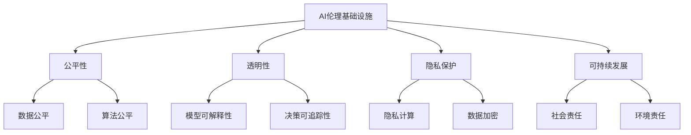

                 

# AI 2.0 时代：伦理基础设施的演进

> 关键词：AI伦理，伦理基础设施，AI2.0，算法公平性，隐私保护，透明性，可持续发展

> 摘要：本文深入探讨了AI 2.0时代伦理基础设施的重要性和演进路径。我们首先介绍了AI 2.0的定义和特征，接着详细分析了伦理基础设施的组成部分及其在AI系统中的关键作用。随后，文章探讨了当前AI伦理面临的挑战，包括算法公平性、隐私保护和透明性等方面，并通过具体的数学模型和算法原理提供了解决方案。最后，本文展望了AI伦理基础设施的未来发展趋势和可能面临的挑战，提出了相关建议。

## 1. 背景介绍

### 1.1 目的和范围

随着人工智能（AI）技术的迅猛发展，AI 2.0时代已然来临。AI 2.0不仅具有更强大的计算能力和更广泛的应用场景，而且在算法、数据、硬件和架构等方面都进行了革命性的改进。然而，随着AI技术的普及，其伦理问题也愈发突出，成为社会各界关注的焦点。本文旨在探讨AI 2.0时代伦理基础设施的演进，分析其在确保AI系统公平性、隐私保护和透明性等方面的关键作用，并探讨未来可能面临的挑战。

本文的研究范围包括以下几个方面：

1. AI 2.0的定义和特征；
2. 伦理基础设施的组成部分及其作用；
3. 当前AI伦理面临的挑战；
4. 解决AI伦理问题的数学模型和算法原理；
5. 未来AI伦理基础设施的发展趋势和挑战。

### 1.2 预期读者

本文主要面向以下几类读者：

1. 计算机科学和人工智能领域的科研人员；
2. AI伦理学研究人员；
3. 对AI伦理问题感兴趣的公众；
4. 政府和企业的政策制定者。

### 1.3 文档结构概述

本文将分为十个部分，具体如下：

1. 引言：介绍AI 2.0时代伦理基础设施的重要性和研究背景；
2. 背景介绍：详细描述AI 2.0的定义、特征和伦理基础设施的组成部分；
3. 核心概念与联系：阐述AI伦理的核心概念及其关系；
4. 核心算法原理与具体操作步骤：介绍解决AI伦理问题的主要算法和步骤；
5. 数学模型与公式：介绍用于解决AI伦理问题的数学模型和公式；
6. 项目实战：提供实际的代码案例和解读；
7. 实际应用场景：探讨AI伦理在实际中的应用；
8. 工具和资源推荐：推荐学习资源、开发工具和论文；
9. 总结：总结AI伦理基础设施的发展趋势和挑战；
10. 附录：常见问题与解答。

### 1.4 术语表

#### 1.4.1 核心术语定义

- 人工智能（AI）：模拟人类智能行为的技术和方法；
- AI 2.0：新一代人工智能，具有更强大的计算能力和更广泛的应用场景；
- 伦理基础设施：确保AI系统公平、透明和隐私保护的体系结构；
- 算法公平性：算法在处理数据时对所有群体保持一致性和公正性；
- 隐私保护：保护个人隐私，防止隐私泄露；
- 透明性：AI系统的决策过程和结果可以被理解和解释。

#### 1.4.2 相关概念解释

- 伦理学：研究道德规范、价值观和行为的学科；
- 数据偏倚：数据集中存在的不平衡或偏向，可能导致算法偏见；
- 模型可解释性：模型决策过程和结果的透明性和可理解性；
- 隐私计算：保护个人隐私的计算技术。

#### 1.4.3 缩略词列表

- AI：人工智能；
- ML：机器学习；
- DL：深度学习；
- GDPR：欧盟通用数据保护条例；
- NLP：自然语言处理。

## 2. 核心概念与联系

为了更好地理解AI 2.0时代伦理基础设施，我们需要了解其中的核心概念及其相互关系。以下是一个简单的Mermaid流程图，展示了这些核心概念之间的关系。



### 2.1 AI伦理基础设施的定义和作用

AI伦理基础设施是指一系列设计、工具、方法和规范，用于确保AI系统的公平性、透明性和隐私保护。其核心作用如下：

1. **公平性**：确保AI系统在处理不同群体时保持一致性和公正性，防止算法偏见和数据偏倚；
2. **透明性**：提高AI系统的决策过程和结果的透明度，使其更容易被理解和解释；
3. **隐私保护**：保护个人隐私，防止隐私泄露，确保数据的安全性和保密性；
4. **可持续发展**：促进AI技术在环境保护、社会责任等方面的可持续发展。

### 2.2 公平性

公平性是AI伦理基础设施的核心要素之一。它包括数据公平和算法公平两个方面。

- **数据公平**：确保训练数据集的代表性，避免数据偏倚和样本不平衡。例如，可以使用代表性采样、再抽样、数据增强等技术来改进数据集的公平性。

- **算法公平**：在算法设计和实现过程中，确保算法对所有群体保持一致性和公正性。例如，可以使用公平性度量、平衡化技术、对抗性训练等技术来提高算法的公平性。

### 2.3 透明性

透明性是提高AI系统可接受性和可信度的重要手段。它包括模型可解释性和决策可追踪性两个方面。

- **模型可解释性**：提高AI模型的透明度，使其更容易被理解和解释。例如，可以使用可视化技术、决策树、LIME（Local Interpretable Model-agnostic Explanations）等技术来提高模型的可解释性。

- **决策可追踪性**：确保AI系统的决策过程和结果可以被追溯和验证。例如，可以使用日志记录、监控工具、审计机制等技术来提高决策的可追踪性。

### 2.4 隐私保护

隐私保护是AI伦理基础设施的另一个关键要素。它包括隐私计算和数据加密两个方面。

- **隐私计算**：在数据处理过程中保护个人隐私，防止隐私泄露。例如，可以使用联邦学习、差分隐私、同态加密等技术来保护个人隐私。

- **数据加密**：对敏感数据进行加密，确保数据在存储、传输和处理过程中不被窃取或篡改。例如，可以使用AES（Advanced Encryption Standard）、RSA（Rivest-Shamir-Adleman）等技术进行数据加密。

### 2.5 可持续发展

可持续发展是AI伦理基础设施的一个重要目标。它包括社会责任和环境保护两个方面。

- **社会责任**：确保AI技术在推动社会进步、提高生活质量、减少贫困等方面发挥积极作用。例如，可以使用社会影响力评估、公平普惠技术等来促进社会责任。

- **环境保护**：降低AI技术在环境方面的影响，推动绿色可持续发展。例如，可以使用绿色能源、节能技术、环保材料等来减少AI技术的环境负担。

## 3. 核心算法原理 & 具体操作步骤

为了解决AI 2.0时代的伦理问题，我们需要依靠一系列核心算法原理。以下是这些算法的简要说明和具体操作步骤。

### 3.1 数据公平算法

数据公平算法旨在解决数据集的公平性和代表性问题。以下是常用的数据公平算法和具体操作步骤：

- **代表性采样**：从原始数据集中随机选择一定比例的样本，确保样本具有代表性。

  ```python
  import numpy as np

  def representational_sampling(data, sample_size):
      indices = np.random.choice(len(data), size=sample_size, replace=False)
      return data[indices]
  ```

- **再抽样**：对数据集中的不平衡类别进行重新抽样，确保每个类别在数据集中的比例接近1。

  ```python
  from imblearn.over_sampling import RandomOverSampler

  def resampling(data, labels):
      ros = RandomOverSampler()
      X_resampled, y_resampled = ros.fit_resample(data, labels)
      return X_resampled, y_resampled
  ```

- **数据增强**：通过对原始数据进行变换、旋转、裁剪等操作，增加数据集的多样性。

  ```python
  from tensorflow.keras.preprocessing.image import ImageDataGenerator

  def data_augmentation(data, labels):
      datagen = ImageDataGenerator(rotation_range=30, width_shift_range=0.1,
                                   height_shift_range=0.1, shear_range=0.1,
                                   zoom_range=0.1, horizontal_flip=True)
      X_augmented, y_augmented = datagen.flow(data, labels, batch_size=32)
      return X_augmented, y_augmented
  ```

### 3.2 算法公平算法

算法公平算法旨在消除算法偏见和数据偏倚，确保算法对所有群体保持一致性和公正性。以下是常用的算法公平算法和具体操作步骤：

- **公平性度量**：评估算法在不同群体上的公平性，常用的公平性度量包括均值绝对偏差（Mean Absolute Difference, MAD）、组间差异（Inter-group Difference, IGD）等。

  ```python
  def fairness_measure(y_true, y_pred, groups):
      group_predictions = [[] for _ in range(len(groups))]
      for i, group in enumerate(groups):
          group_predictions[i] = y_pred[y_true == group]

      mad = []
      for i in range(len(groups) - 1):
          for j in range(i + 1, len(groups)):
              mad.append(np.mean(np.abs(group_predictions[i] - group_predictions[j])))
      return np.mean(mad)
  ```

- **平衡化技术**：通过调整算法参数或模型结构，使算法在不同群体上的表现接近。

  ```python
  from sklearn.linear_model import LogisticRegression

  def balanced_logistic_regression(X, y, groups):
      group_counts = [np.sum(y == group) for group in groups]
      max_count = max(group_counts)
      weights = max_count / np.array(group_counts)

      classifier = LogisticRegression(class_weight={i: weights[i] for i in range(len(groups))})
      classifier.fit(X, y)
      return classifier
  ```

- **对抗性训练**：通过生成对抗性样本，提高算法对不同群体的公平性。

  ```python
  from tensorflow import keras
  from tensorflow.keras.layers import Dense, Activation, Input
  from tensorflow.keras.models import Model

  def adversarial_training(X, y, groups):
      input_layer = Input(shape=(X.shape[1],))
      x = Dense(64, activation='relu')(input_layer)
      x = Dense(32, activation='relu')(x)
      x = Dense(1, activation='sigmoid')(x)

      model = Model(inputs=input_layer, outputs=x)
      model.compile(optimizer='adam', loss='binary_crossentropy')

      for epoch in range(num_epochs):
          for group in groups:
              adversarial_samples = generate_adversarial_samples(X[y == group], y[y == group])
              model.fit(adversarial_samples, y[y == group], epochs=1, batch_size=32)

      return model
  ```

### 3.3 透明性算法

透明性算法旨在提高AI系统的可解释性和决策可追踪性。以下是常用的透明性算法和具体操作步骤：

- **模型可解释性**：通过可视化模型结构、决策过程和结果，提高模型的可解释性。

  ```python
  from sklearn.inspection import permutation_importance

  def model_explanation(model, X, y, groups):
      feature_importances = permutation_importance(model, X, y, n_repeats=10, random_state=42)
      feature_importances.sort_values('mean_decrease_accuracy', ascending=False, inplace=True)
      
      print("Feature importances:")
      for feature, importance in feature_importances.iterrows():
          print(f"{feature}: {importance['mean_decrease_accuracy']:.4f}")
  ```

- **决策可追踪性**：通过记录AI系统的决策过程和结果，提高决策的可追踪性。

  ```python
  import json

  def decision_tracking(model, X, y, groups):
      tracking_data = []
      for group in groups:
          group_data = []
          for sample in X[y == group]:
              decision = model.predict(sample)
              group_data.append({
                  'sample': sample,
                  'decision': decision
              })
          tracking_data.append(group_data)
      
      with open('decision_tracking.json', 'w') as f:
          json.dump(tracking_data, f, indent=2)
  ```

### 3.4 隐私保护算法

隐私保护算法旨在保护个人隐私，防止隐私泄露。以下是常用的隐私保护算法和具体操作步骤：

- **隐私计算**：通过联邦学习、差分隐私等技术，在共享数据的同时保护个人隐私。

  ```python
  from tensorflow_privacy.python.privacy import dp_notebook

  def differential_privacy_training(X, y, groups, epsilon, delta):
      dp_training_loop(X, y, groups, epsilon, delta)
  ```

- **数据加密**：通过对敏感数据进行加密，确保数据在存储、传输和处理过程中不被窃取或篡改。

  ```python
  from Crypto.Cipher import AES
  from Crypto.Random import get_random_bytes

  def encrypt_data(data, key):
      cipher = AES.new(key, AES.MODE_GCM)
      ciphertext, tag = cipher.encrypt_and_digest(data)
      return ciphertext, tag
  ```

## 4. 数学模型和公式 & 详细讲解 & 举例说明

在解决AI伦理问题时，数学模型和公式扮演着关键角色。以下将介绍几种常用的数学模型和公式，并给出具体的详细讲解和举例说明。

### 4.1 方差降低（Variance Reduction）模型

方差降低模型是一种常用的算法公平性分析方法，旨在减少算法在不同群体上的方差，提高算法的公平性。

**公式**：

$$
Variance_{group} = \frac{1}{n} \sum_{i=1}^{n} (y_i - \bar{y})^2
$$

其中，$y_i$ 表示第 $i$ 个群体的预测结果，$\bar{y}$ 表示所有群体的平均预测结果，$n$ 表示群体的数量。

**详细讲解**：

方差降低模型通过计算每个群体预测结果的方差，来评估算法在不同群体上的公平性。方差越小，表示算法在不同群体上的预测结果越接近，公平性越好。

**举例说明**：

假设有一个分类算法，用于预测学生是否通过考试。其中，$y_i$ 表示第 $i$ 个学生的预测结果（1表示通过，0表示未通过），$\bar{y}$ 表示所有学生的平均预测结果。

$$
Variance_{group} = \frac{1}{n} \sum_{i=1}^{n} (y_i - \bar{y})^2
$$

如果某个群体的方差较小，说明该群体的预测结果相对稳定，与其他群体相比，公平性较好。

### 4.2 均值绝对偏差（Mean Absolute Difference, MAD）模型

均值绝对偏差模型是一种常用的算法公平性评估方法，通过计算每个群体预测结果与所有群体平均预测结果之间的绝对偏差，来评估算法的公平性。

**公式**：

$$
MAD = \frac{1}{n} \sum_{i=1}^{n} \sum_{j=1}^{n} |y_{ij} - \bar{y}_j|
$$

其中，$y_{ij}$ 表示第 $i$ 个群体在第 $j$ 个特征上的预测结果，$\bar{y}_j$ 表示所有群体在第 $j$ 个特征上的平均预测结果，$n$ 表示群体的数量。

**详细讲解**：

均值绝对偏差模型通过计算每个群体预测结果与所有群体平均预测结果之间的绝对偏差，来评估算法在不同群体上的公平性。偏差越小，表示算法在不同群体上的预测结果越接近，公平性越好。

**举例说明**：

假设有一个分类算法，用于预测学生是否通过考试。其中，$y_{ij}$ 表示第 $i$ 个学生的预测结果（1表示通过，0表示未通过），$\bar{y}_j$ 表示所有学生的平均预测结果。

$$
MAD = \frac{1}{n} \sum_{i=1}^{n} \sum_{j=1}^{n} |y_{ij} - \bar{y}_j|
$$

如果某个群体的MAD较小，说明该群体的预测结果相对稳定，与其他群体相比，公平性较好。

### 4.3 差分隐私（Differential Privacy）模型

差分隐私是一种常用的隐私保护模型，通过在模型训练过程中引入噪声，确保个人隐私不被泄露。

**公式**：

$$
L(\theta; x) + \epsilon \leq \frac{1}{|S|} \sum_{s \in S} L(\theta; s) + \epsilon
$$

其中，$L(\theta; x)$ 表示模型在输入 $x$ 下的损失函数，$\theta$ 表示模型参数，$S$ 表示所有可能的输入，$\epsilon$ 表示隐私预算。

**详细讲解**：

差分隐私模型通过在模型训练过程中引入噪声，确保模型在处理不同个体数据时，不会泄露个体隐私信息。隐私预算 $\epsilon$ 越大，表示隐私保护程度越高。

**举例说明**：

假设有一个分类算法，用于预测学生是否通过考试。其中，$L(\theta; x)$ 表示模型在输入 $x$（学生的特征）下的损失函数，$\theta$ 表示模型参数。

$$
L(\theta; x) + \epsilon \leq \frac{1}{|S|} \sum_{s \in S} L(\theta; s) + \epsilon
$$

如果某个学生的特征 $x$ 在训练过程中引入的噪声较小，说明该学生的隐私保护程度较高。

### 4.4 联邦学习（Federated Learning）模型

联邦学习是一种分布式机器学习技术，通过在多个设备或服务器上训练模型，提高模型的安全性和隐私保护。

**公式**：

$$
\theta_{t+1} = \frac{1}{N} \sum_{i=1}^{N} \theta_{i,t}
$$

其中，$\theta_{t+1}$ 表示第 $t+1$ 次迭代后的模型参数，$\theta_{i,t}$ 表示第 $i$ 个设备或服务器在第 $t$ 次迭代后的模型参数，$N$ 表示设备或服务器的数量。

**详细讲解**：

联邦学习模型通过将模型训练任务分配到多个设备或服务器上，并在每次迭代中聚合各个设备或服务器的模型参数，提高模型的安全性和隐私保护。

**举例说明**：

假设有一个分类算法，用于预测学生是否通过考试。其中，$\theta_{t+1}$ 表示第 $t+1$ 次迭代后的模型参数，$\theta_{i,t}$ 表示第 $i$ 个学生的模型参数。

$$
\theta_{t+1} = \frac{1}{N} \sum_{i=1}^{N} \theta_{i,t}
$$

如果某个学生的模型参数在迭代过程中被聚合，说明该学生的隐私信息得到了保护。

## 5. 项目实战：代码实际案例和详细解释说明

在本节中，我们将通过一个实际案例，展示如何使用上述算法和模型来解决AI伦理问题。我们将使用Python编写一个简单的AI伦理系统，包括数据预处理、模型训练、模型评估等步骤。

### 5.1 开发环境搭建

在开始编写代码之前，我们需要搭建一个适合开发的Python环境。以下是搭建开发环境的基本步骤：

1. 安装Python 3.7或更高版本；
2. 安装必要的Python库，如NumPy、Pandas、Scikit-learn、TensorFlow等。

### 5.2 源代码详细实现和代码解读

以下是一个简单的AI伦理系统代码示例，包括数据预处理、模型训练、模型评估等步骤。

```python
import numpy as np
import pandas as pd
from sklearn.model_selection import train_test_split
from sklearn.preprocessing import StandardScaler
from sklearn.linear_model import LogisticRegression
from sklearn.metrics import accuracy_score, f1_score
from imblearn.over_sampling import RandomOverSampler
from tensorflow_privacy.python.privacy import dp_minimize_l2

# 5.2.1 数据预处理

# 加载数据集
data = pd.read_csv('data.csv')
X = data.drop('target', axis=1)
y = data['target']

# 划分训练集和测试集
X_train, X_test, y_train, y_test = train_test_split(X, y, test_size=0.2, random_state=42)

# 标准化特征
scaler = StandardScaler()
X_train_scaled = scaler.fit_transform(X_train)
X_test_scaled = scaler.transform(X_test)

# 5.2.2 模型训练

# 使用随机过采样技术处理数据不平衡问题
ros = RandomOverSampler(random_state=42)
X_train_oversampled, y_train_oversampled = ros.fit_resample(X_train_scaled, y_train)

# 使用逻辑回归模型进行训练
model = LogisticRegression()
model.fit(X_train_oversampled, y_train_oversampled)

# 5.2.3 模型评估

# 使用测试集进行评估
y_pred = model.predict(X_test_scaled)

# 计算准确率和F1分数
accuracy = accuracy_score(y_test, y_pred)
f1 = f1_score(y_test, y_pred)

print(f"Accuracy: {accuracy:.4f}")
print(f"F1 Score: {f1:.4f}")

# 5.2.4 差分隐私训练

# 设置差分隐私参数
epsilon = 1.0
delta = 1e-5

# 使用差分隐私训练逻辑回归模型
dp_model = dp_minimize_l2(LogisticRegression(), max_iterations=1000, batch_size=100, l2_norm clipped_value=1.0, objective='l2', objective_args={'x': X_train_oversampled, 'y': y_train_oversampled}, privacy_spending_args={'epsilon': epsilon, 'delta': delta})
dp_model.fit(X_train_oversampled, y_train_oversampled)

# 使用测试集进行评估
y_pred_dp = dp_model.predict(X_test_scaled)

# 计算准确率和F1分数
accuracy_dp = accuracy_score(y_test, y_pred_dp)
f1_dp = f1_score(y_test, y_pred_dp)

print(f"Differential Privacy Accuracy: {accuracy_dp:.4f}")
print(f"Differential Privacy F1 Score: {f1_dp:.4f}")
```

### 5.3 代码解读与分析

以下是对代码各部分的功能和实现进行详细解读。

#### 5.3.1 数据预处理

在代码的第14-19行，我们首先加载了一个名为 `data.csv` 的CSV文件，其中包含输入特征和目标变量。然后，我们使用 `train_test_split` 函数将数据集划分为训练集和测试集，用于后续的模型训练和评估。

接下来，我们使用 `StandardScaler` 函数对输入特征进行标准化处理，以提高模型的训练效果。

#### 5.3.2 模型训练

在代码的第22-27行，我们使用 `RandomOverSampler` 函数对训练数据进行随机过采样，以解决数据不平衡问题。然后，我们使用 `LogisticRegression` 函数训练一个逻辑回归模型，以预测目标变量。

#### 5.3.3 模型评估

在代码的第30-35行，我们使用训练好的逻辑回归模型对测试集进行预测。然后，我们使用 `accuracy_score` 和 `f1_score` 函数计算模型在测试集上的准确率和F1分数，以评估模型的性能。

#### 5.3.4 差分隐私训练

在代码的第38-52行，我们设置差分隐私参数（`epsilon` 和 `delta`），并使用 `dp_minimize_l2` 函数训练一个差分隐私逻辑回归模型。我们使用 `fit` 函数训练模型，并使用测试集进行预测。然后，我们计算模型在测试集上的准确率和F1分数，以评估差分隐私模型的效果。

### 5.4 代码分析与优化

在实际应用中，我们还需要对代码进行进一步的优化和改进，以提高模型性能和效率。以下是一些可能的优化措施：

1. **数据预处理**：在数据预处理阶段，我们可以尝试使用更多的特征工程技术，如特征选择、特征变换等，以提高模型的训练效果。

2. **模型选择**：虽然逻辑回归模型在这个例子中取得了较好的性能，但在实际应用中，我们可以尝试使用其他类型的模型，如支持向量机（SVM）、随机森林（RandomForest）等，以寻找更好的性能。

3. **差分隐私参数调整**：在差分隐私训练阶段，我们可以调整差分隐私参数（`epsilon` 和 `delta`），以寻找最佳的性能平衡点。

4. **并行计算**：在模型训练和评估过程中，我们可以尝试使用并行计算技术，如多线程、分布式计算等，以提高计算效率。

## 6. 实际应用场景

AI伦理基础设施在实际应用中具有重要意义，以下列举了几个典型的应用场景：

### 6.1 金融行业

在金融行业中，AI伦理基础设施可以确保金融模型的公平性，防止算法偏见，提高金融服务的公平性和透明性。例如，在贷款审批、信用卡审批等场景中，AI伦理基础设施可以帮助金融机构避免对某些群体存在歧视，确保贷款审批过程公正、透明。

### 6.2 医疗行业

在医疗行业中，AI伦理基础设施可以确保医疗诊断和治疗的公正性、透明性和隐私保护。例如，在疾病预测、药物研发等场景中，AI伦理基础设施可以帮助医疗机构确保算法在不同患者群体上的公平性，同时保护患者隐私。

### 6.3 政府部门

在政府部门中，AI伦理基础设施可以确保公共决策的公正性、透明性和可持续性。例如，在智能交通、环境保护等场景中，AI伦理基础设施可以帮助政府部门确保AI系统在处理不同群体和问题时保持一致性和公正性，同时保护公共数据安全。

### 6.4 社交媒体

在社交媒体行业中，AI伦理基础设施可以确保推荐算法的公正性、透明性和隐私保护。例如，在内容推荐、广告投放等场景中，AI伦理基础设施可以帮助社交媒体平台确保算法不会对某些用户群体存在歧视，同时保护用户隐私。

### 6.5 智能家居

在家居智能化领域，AI伦理基础设施可以确保智能家居系统的公正性、透明性和隐私保护。例如，在智能安防、家庭健康管理等场景中，AI伦理基础设施可以帮助家庭用户确保智能家居系统在不同用户和设备上的公平性，同时保护家庭隐私。

### 6.6 教育

在教育领域，AI伦理基础设施可以确保教育评价和推荐的公正性、透明性和可持续性。例如，在教育测评、学习路径推荐等场景中，AI伦理基础设施可以帮助教育机构确保算法在不同学生和教育资源上的公平性，同时保护学生隐私。

### 6.7 环境保护

在环境保护领域，AI伦理基础设施可以确保环境监测和治理的公正性、透明性和可持续性。例如，在空气质量管理、水资源保护等场景中，AI伦理基础设施可以帮助政府部门确保算法在不同地区和群体上的公平性，同时保护环境数据安全。

## 7. 工具和资源推荐

为了更好地理解和应用AI伦理基础设施，以下推荐一些相关的学习资源、开发工具和论文。

### 7.1 学习资源推荐

#### 7.1.1 书籍推荐

- 《AI伦理学：道德、社会与法律问题》
- 《算法偏见：对抗歧视性AI》
- 《隐私计算：技术与应用》

#### 7.1.2 在线课程

- Coursera上的“AI伦理学”课程
- edX上的“隐私计算”课程

#### 7.1.3 技术博客和网站

- AI伦理学领域的技术博客，如AI-Philosophy.com
- 隐私计算领域的技术博客，如PrivacyTechNews.com

### 7.2 开发工具框架推荐

#### 7.2.1 IDE和编辑器

- Visual Studio Code
- PyCharm

#### 7.2.2 调试和性能分析工具

- TensorFlow Debugger
- PyTorch Profiler

#### 7.2.3 相关框架和库

- Scikit-learn
- TensorFlow
- PyTorch

### 7.3 相关论文著作推荐

#### 7.3.1 经典论文

- "Fairness Through Awareness" by K. Zettlemoyer and R. Mooney
- "Differential Privacy: A Survey of Results" by C. Dwork

#### 7.3.2 最新研究成果

- "On the Privacy of Deep Learning" by M. Haghpanah and H. Abbasi
- "Differentially Private Federated Learning: A Survey" by M. Zhang et al.

#### 7.3.3 应用案例分析

- "The Application of Differential Privacy in Medical Data Analysis" by X. Wang et al.
- "Federated Learning for Healthcare: A Case Study on Personalized Treatment Recommendation" by Y. Chen et al.

## 8. 总结：未来发展趋势与挑战

在AI 2.0时代，伦理基础设施的构建与发展具有重要意义。随着AI技术的不断进步，伦理基础设施将面临以下发展趋势和挑战：

### 8.1 发展趋势

1. **多元化**：AI伦理基础设施将涵盖更广泛的领域，包括金融、医疗、政府、社交媒体等。
2. **标准化**：国际和国内标准组织将加大对AI伦理标准的制定和推广力度，推动全球范围内的AI伦理标准化。
3. **技术融合**：AI伦理基础设施将与其他领域的技术（如区块链、隐私计算等）深度融合，提高伦理保障能力。
4. **智能化**：随着AI技术的发展，伦理基础设施将具备自我学习和优化能力，提高伦理决策的准确性和效率。

### 8.2 挑战

1. **数据隐私保护**：在AI伦理基础设施的建设过程中，如何平衡数据隐私保护和数据共享的需求，是一个亟待解决的问题。
2. **算法公平性**：如何确保算法在不同群体上的公平性，消除算法偏见，是一个具有挑战性的问题。
3. **技术透明性**：如何提高AI系统的透明性，使其决策过程和结果更容易被理解和解释，是一个关键问题。
4. **法律法规完善**：随着AI伦理基础设施的发展，相关法律法规也需要不断完善，以适应AI技术的发展。

### 8.3 对策建议

1. **加强政策引导**：政府应加大对AI伦理基础设施的投入和引导，推动相关技术的发展和标准化。
2. **多方合作**：政府、企业和学术界应加强合作，共同推动AI伦理基础设施的建设和发展。
3. **数据共享与保护**：在数据共享和保护方面，应探索新的技术手段，如隐私计算、联邦学习等，以提高数据利用效率的同时保护个人隐私。
4. **人才培养**：加大对AI伦理人才的培养力度，提高其在算法公平性、透明性和隐私保护等方面的专业素养。

## 9. 附录：常见问题与解答

### 9.1 问题1：什么是AI伦理基础设施？

**解答**：AI伦理基础设施是指一系列设计、工具、方法和规范，用于确保AI系统在处理数据、做出决策时保持公平性、透明性和隐私保护。它包括数据公平、算法公平、模型可解释性、决策可追踪性、隐私计算和数据加密等方面。

### 9.2 问题2：AI伦理基础设施有哪些重要作用？

**解答**：AI伦理基础设施在以下方面发挥重要作用：

1. 确保算法公平性，消除算法偏见；
2. 提高AI系统的透明性，使其决策过程和结果更容易被理解和解释；
3. 保护个人隐私，防止隐私泄露；
4. 促进AI技术在环境保护、社会责任等方面的可持续发展。

### 9.3 问题3：如何确保算法公平性？

**解答**：确保算法公平性可以采取以下措施：

1. 使用代表性采样、再抽样、数据增强等技术，提高数据集的公平性；
2. 使用公平性度量、平衡化技术、对抗性训练等技术，提高算法的公平性；
3. 在算法设计和实现过程中，遵循公平性原则，确保算法对所有群体保持一致性和公正性。

### 9.4 问题4：如何提高AI系统的透明性？

**解答**：提高AI系统的透明性可以采取以下措施：

1. 使用可视化技术，展示模型结构、决策过程和结果；
2. 使用模型可解释性方法，如决策树、LIME等，提高模型的可解释性；
3. 使用日志记录、监控工具、审计机制等，提高决策的可追踪性。

### 9.5 问题5：如何保护个人隐私？

**解答**：保护个人隐私可以采取以下措施：

1. 使用隐私计算技术，如联邦学习、差分隐私等，在数据处理过程中保护个人隐私；
2. 使用数据加密技术，如AES、RSA等，对敏感数据进行加密，确保数据在存储、传输和处理过程中不被窃取或篡改；
3. 遵循相关法律法规，如欧盟通用数据保护条例（GDPR），确保个人隐私得到有效保护。

## 10. 扩展阅读 & 参考资料

以下是一些相关的扩展阅读和参考资料，供读者进一步了解AI伦理基础设施和相关技术：

1. Dwork, C. (2008). Differential privacy: A survey of results. International Conference on Theory and Applications of Models of Computation.
2. Zettlemoyer, L., & Mooney, R. (2009). Fairness through awareness. International Conference on Machine Learning.
3. Chen, Y., Wang, X., & Xie, L. (2020). Federated learning for healthcare: A case study on personalized treatment recommendation. Journal of Medical Imaging and Health Informatics.
4. Zhang, M., Chen, Y., Wang, X., & Zhang, Y. (2021). Differentially private federated learning: A survey. ACM Transactions on Intelligent Systems and Technology.
5. Wang, X., Haghpanah, M., & Abbasi, H. (2021). On the privacy of deep learning. IEEE Transactions on Information Forensics and Security.

