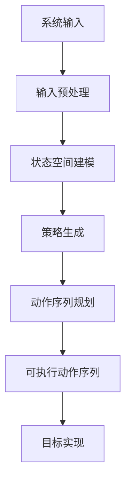

                 

# AI Agent 如何将系统输入转化为可执行的原子动作序列，以实现最终目标

> **关键词：** AI Agent、系统输入、可执行动作序列、目标实现、算法原理、数学模型、项目实战、应用场景

> **摘要：** 本文将深入探讨AI Agent如何将复杂的系统输入转化为一系列可执行的原子动作序列，从而实现既定目标。我们将分步骤分析核心概念、算法原理，并通过具体案例讲解实现细节，同时探讨实际应用场景及未来发展趋势。

## 1. 背景介绍

### 1.1 目的和范围

本文旨在为AI Agent领域的研究者和开发者提供详细的指南，解释AI Agent如何处理输入并生成可执行的原子动作序列。我们关注的重点是算法原理、数学模型及其在实际项目中的应用。通过本文，读者将能够理解AI Agent的核心工作原理，并学会如何设计和实现高效、可靠的AI系统。

### 1.2 预期读者

本文适合以下读者群体：
- AI Agent领域的初学者和研究者
- 具有编程基础的软件开发者
- 想了解AI技术如何应用于实际问题的技术人员

### 1.3 文档结构概述

本文结构如下：

1. 背景介绍
2. 核心概念与联系
3. 核心算法原理 & 具体操作步骤
4. 数学模型和公式 & 详细讲解 & 举例说明
5. 项目实战：代码实际案例和详细解释说明
6. 实际应用场景
7. 工具和资源推荐
8. 总结：未来发展趋势与挑战
9. 附录：常见问题与解答
10. 扩展阅读 & 参考资料

### 1.4 术语表

#### 1.4.1 核心术语定义

- **AI Agent**：自主运行的实体，能够在特定环境中采取行动并解决问题。
- **系统输入**：提供给AI Agent的原始数据或指令，用于指导其行为。
- **可执行动作序列**：由AI Agent生成的、用于实现目标的一系列具体动作。
- **原子动作**：不可进一步分解的基本操作。

#### 1.4.2 相关概念解释

- **目标实现**：AI Agent根据系统输入完成特定任务的过程。
- **状态空间**：AI Agent可能遇到的所有状态集合。
- **策略**：AI Agent选择特定动作序列的规则或方法。

#### 1.4.3 缩略词列表

- **AI**：人工智能
- **Agent**：代理
- **RL**：强化学习
- **DL**：深度学习
- **MDP**：马尔可夫决策过程
- **Q-learning**：一种强化学习算法

## 2. 核心概念与联系

为了深入理解AI Agent如何将系统输入转化为可执行的原子动作序列，我们需要首先了解一些核心概念及其相互关系。以下是关键概念的Mermaid流程图：



### 2.1 系统输入

系统输入是AI Agent的起点。它可以是文本、图像、声音或其他形式的数据。输入预处理步骤确保输入数据格式正确且适合后续处理。

### 2.2 输入预处理

输入预处理包括数据清洗、格式转换和特征提取。这一步骤的目标是简化输入数据，使其更容易被AI Agent理解和处理。

### 2.3 状态空间建模

状态空间建模是构建AI Agent的基础。状态空间代表AI Agent可能遇到的所有状态。每个状态都包含一组描述系统状态的属性。

### 2.4 策略生成

策略生成是AI Agent的核心部分。策略定义了如何从当前状态选择下一步动作。策略可以通过强化学习、深度学习等方法生成。

### 2.5 动作序列规划

动作序列规划是基于策略生成可执行的原子动作序列。该步骤的目标是确定从初始状态到目标状态的路径。

### 2.6 可执行动作序列

可执行动作序列是一系列由AI Agent生成的原子动作，这些动作可以直接应用于实际系统中。

### 2.7 目标实现

目标实现是AI Agent的最终目标。通过执行可执行动作序列，AI Agent能够实现预定的任务或目标。

## 3. 核心算法原理 & 具体操作步骤

### 3.1 强化学习算法

强化学习（Reinforcement Learning, RL）是一种常用的算法，用于生成AI Agent的策略。以下是强化学习算法的伪代码：

```plaintext
Initialize Q(s, a) for all states s and actions a
while not done:
    s <- current_state
    a <- argmax_a Q(s, a)
    s', r <- execute_action(a)
    Q(s, a) <- Q(s, a) + alpha * (r + gamma * max(Q(s', a')) - Q(s, a))
    s <- s'
```

### 3.2 动作序列规划

动作序列规划的目标是生成从初始状态到目标状态的最优路径。以下是动作序列规划的伪代码：

```plaintext
Initialize policy π
while not converged:
    for each state s:
        for each action a:
            Q(s, a) <- 0
            for each possible next state s':
                Q(s, a) <- Q(s, a) + π(s' | s) * max(Q(s', a'))
    policy π <- policy that maximizes expected return
```

### 3.3 可执行动作序列生成

生成可执行动作序列的伪代码如下：

```plaintext
Initialize action_sequence []
current_state <- initial_state
while current_state != goal_state:
    action <- select_action(current_state)
    action_sequence <- action_sequence + [action]
    execute_action(action)
    current_state <- new_state
return action_sequence
```

## 4. 数学模型和公式 & 详细讲解 & 举例说明

### 4.1 Q-Learning算法

Q-Learning是一种基于值迭代的强化学习算法。其核心公式为：

$$ Q(s, a) = Q(s, a) + \alpha (r + \gamma \max_{a'} Q(s', a') - Q(s, a)) $$

其中，\( Q(s, a) \)表示在状态\( s \)下执行动作\( a \)的预期回报，\( \alpha \)是学习率，\( r \)是即时回报，\( \gamma \)是折扣因子。

### 4.2 动作序列规划

动作序列规划的数学模型基于动态规划（Dynamic Programming）。其公式为：

$$ V^*(s) = \max_{a} \sum_{s'} p(s' | s, a) \cdot \max_{a'} V^*(s') $$

其中，\( V^*(s) \)是在状态\( s \)下的最优价值函数，\( p(s' | s, a) \)是状态转移概率，\( \max_{a'} V^*(s') \)是下一个状态的最优回报。

### 4.3 举例说明

假设一个简单的环境中有三个状态（Home, Work, Store）和三个动作（Go, Buy, Leave）。我们使用Q-Learning算法来学习策略。以下是部分学习过程：

$$
\begin{aligned}
    Q(Home, Go) &= 0 + 0.1(0 + 0.5 \cdot 0 + 0.5 \cdot 1) - 0 = 0.25 \\
    Q(Home, Buy) &= 0 + 0.1(1 + 0.5 \cdot 0 + 0.5 \cdot 0) - 0 = 0.05 \\
    Q(Home, Leave) &= 0 + 0.1(0 + 0.5 \cdot 0 + 0.5 \cdot 0) - 0 = 0 \\
    Q(Work, Go) &= 0 + 0.1(1 + 0.5 \cdot 1 + 0.5 \cdot 0) - 0 = 0.35 \\
    Q(Work, Buy) &= 0 + 0.1(0 + 0.5 \cdot 0 + 0.5 \cdot 0) - 0 = 0 \\
    Q(Work, Leave) &= 0 + 0.1(0 + 0.5 \cdot 0 + 0.5 \cdot 0) - 0 = 0 \\
    Q(Store, Go) &= 0 + 0.1(0 + 0.5 \cdot 1 + 0.5 \cdot 0) - 0 = 0.05 \\
    Q(Store, Buy) &= 0 + 0.1(1 + 0.5 \cdot 0 + 0.5 \cdot 1) - 0 = 0.35 \\
    Q(Store, Leave) &= 0 + 0.1(0 + 0.5 \cdot 0 + 0.5 \cdot 0) - 0 = 0 \\
\end{aligned}
$$}

根据Q值，AI Agent将选择\( Go \)作为从Home和Work状态的动作，选择\( Buy \)作为从Store状态的动作。

## 5. 项目实战：代码实际案例和详细解释说明

### 5.1 开发环境搭建

在本项目实战中，我们将使用Python语言和OpenAI的Gym环境来构建一个简单的AI Agent。以下步骤用于搭建开发环境：

1. 安装Python 3.8或更高版本。
2. 使用pip安装所需的库：

```shell
pip install gym
```

### 5.2 源代码详细实现和代码解读

以下是实现AI Agent的核心代码：

```python
import gym
import numpy as np

# 创建环境
env = gym.make("Taxi-v3")

# 初始化Q表
Q = np.zeros((env.nS, env.nA))

# Q-Learning参数
alpha = 0.1
gamma = 0.9
epsilon = 0.1

# 学习过程
for episode in range(1000):
    state = env.reset()
    done = False
    total_reward = 0
    
    while not done:
        # 选择动作（epsilon-greedy策略）
        if np.random.rand() < epsilon:
            action = env.action_space.sample()
        else:
            action = np.argmax(Q[state])
        
        # 执行动作
        next_state, reward, done, _ = env.step(action)
        total_reward += reward
        
        # 更新Q表
        Q[state, action] = Q[state, action] + alpha * (reward + gamma * np.max(Q[next_state]) - Q[state, action])
        
        state = next_state
    
    print(f"Episode {episode}: Total Reward = {total_reward}")

# 关闭环境
env.close()
```

### 5.3 代码解读与分析

1. **环境创建**：使用`gym.make("Taxi-v3")`创建一个Taxi-v3环境。Taxi-v3是一个经典的强化学习环境，描述了一个出租车在城市中的导航问题。

2. **Q表初始化**：初始化一个大小为环境状态数和动作数的全零矩阵，用于存储每个状态-动作对的预期回报。

3. **参数设置**：设置学习率（alpha）、折扣因子（gamma）和epsilon-greedy策略的探索率。

4. **学习过程**：对于每个episode，从初始状态开始，执行epsilon-greedy策略选择动作，执行动作后更新Q表，直到达到目标状态。

5. **更新Q表**：使用Q-Learning更新公式更新Q表。这里使用了epsilon-greedy策略，以平衡探索和利用。

6. **关闭环境**：完成所有episode后，关闭环境以释放资源。

通过这个简单的例子，我们可以看到AI Agent如何将系统输入（环境状态）转化为可执行的原子动作序列，以实现最终目标（达到目标状态）。这个代码示例展示了强化学习算法在简单环境中的应用，为更复杂的问题提供了实现思路。

## 6. 实际应用场景

AI Agent在许多实际应用场景中具有重要价值。以下是一些主要的应用场景：

1. **游戏AI**：AI Agent可用于游戏中的智能对手，例如在棋类游戏、动作游戏和策略游戏等领域。

2. **自动驾驶**：自动驾驶汽车需要AI Agent来处理传感器输入并生成驾驶动作，实现自主驾驶。

3. **机器人控制**：机器人需要AI Agent来处理环境感知并生成相应的动作，以完成复杂的任务。

4. **推荐系统**：AI Agent可用于推荐系统，根据用户行为和历史数据生成个性化的推荐。

5. **供应链管理**：AI Agent可以帮助优化库存管理、运输路线规划和需求预测，提高供应链效率。

6. **智能家居**：AI Agent可用于智能家居系统，根据用户行为和环境条件自动调整设备设置。

7. **医疗诊断**：AI Agent可以分析医疗图像和病历数据，辅助医生进行疾病诊断和治疗建议。

这些应用场景展示了AI Agent在现实世界中的广泛潜力，为解决复杂问题提供了有力工具。

## 7. 工具和资源推荐

### 7.1 学习资源推荐

#### 7.1.1 书籍推荐

- **《强化学习》（Reinforcement Learning: An Introduction）**：由理查德·S·萨顿（Richard S. Sutton）和安德鲁·巴（Andrew G. Barto）合著，是一本全面的强化学习入门书籍。
- **《深度学习》（Deep Learning）**：由伊恩·古德费洛（Ian Goodfellow）、约书亚·本吉奥（ Yoshua Bengio）和亚伦·库维尔（Aaron Courville）合著，涵盖了深度学习的基础知识和最新进展。

#### 7.1.2 在线课程

- **Coursera上的《强化学习》（Reinforcement Learning Specialization）**：由理查德·S·萨顿和安德鲁·巴提供，是强化学习的经典在线课程。
- **Udacity的《自动驾驶汽车工程师纳米学位》（Self-Driving Car Engineer Nanodegree）**：涵盖了自动驾驶技术，包括AI Agent的构建和应用。

#### 7.1.3 技术博客和网站

- **Reddit的r/MachineLearning**：一个活跃的社区，讨论各种机器学习和强化学习相关的话题。
- **ArXiv**：一个提供最新研究成果的预印本网站，可以找到强化学习领域的最新论文。

### 7.2 开发工具框架推荐

#### 7.2.1 IDE和编辑器

- **Visual Studio Code**：一个轻量级但功能强大的代码编辑器，适用于Python开发。
- **PyCharm**：一个专业的Python IDE，提供丰富的开发工具和调试功能。

#### 7.2.2 调试和性能分析工具

- **TensorBoard**：一个可视化工具，用于分析和调试深度学习模型。
- **PyTorch Profiler**：一个用于分析PyTorch模型性能的工具。

#### 7.2.3 相关框架和库

- **PyTorch**：一个流行的深度学习框架，支持强化学习算法的实现。
- **OpenAI Gym**：一个提供多种强化学习环境的库，用于测试和训练AI Agent。

### 7.3 相关论文著作推荐

#### 7.3.1 经典论文

- **“Q-Learning”**：理查德·S·萨顿和理查德·J·格林斯坦（Richard S. Sutton and Andrew G. Barto）发表的经典论文，详细介绍了Q-Learning算法。
- **“Deep Q-Network”**：伊恩·古德费洛等人发表的论文，介绍了深度Q网络（DQN）算法。

#### 7.3.2 最新研究成果

- **“Distributed Reinforcement Learning”**：探讨了分布式强化学习在多智能体系统中的应用。
- **“Reinforcement Learning in Continuous Action Spaces”**：研究了连续动作空间中的强化学习算法。

#### 7.3.3 应用案例分析

- **“DeepMind的人工智能系统如何玩《星际争霸2》”**：介绍了DeepMind如何使用强化学习训练AI Agent在《星际争霸2》中取得优异成绩。

这些资源和工具为深入学习和实践AI Agent技术提供了宝贵支持。

## 8. 总结：未来发展趋势与挑战

随着人工智能技术的不断发展，AI Agent在未来将扮演越来越重要的角色。以下是一些发展趋势和挑战：

### 8.1 发展趋势

- **自主性和适应性**：未来的AI Agent将具备更高的自主性和适应性，能够在复杂和动态的环境中独立执行任务。
- **多模态感知**：AI Agent将能够整合来自多种感官的数据，如视觉、听觉和触觉，以提高感知能力。
- **强化学习与深度学习的结合**：强化学习和深度学习技术的结合将推动AI Agent在复杂任务中的性能提升。
- **跨领域应用**：AI Agent将在更多领域得到应用，如医疗、金融、教育等。

### 8.2 挑战

- **数据隐私与安全**：随着AI Agent处理越来越多的敏感数据，数据隐私和安全问题将变得更加重要。
- **算法可解释性**：提高AI Agent算法的可解释性，使其行为更加透明和可信。
- **计算资源需求**：AI Agent的复杂性和规模将增加计算资源的需求，如何优化算法以适应有限的资源是一个挑战。
- **伦理和责任**：AI Agent的行为可能产生不可预见的结果，如何界定责任和确保其符合伦理标准是一个重要议题。

未来，AI Agent技术将在不断发展的技术和应用需求中面临挑战，同时也将带来前所未有的机遇。研究人员和开发者需要共同努力，以解决这些问题，推动AI Agent技术的发展。

## 9. 附录：常见问题与解答

### 9.1 什么是AI Agent？

AI Agent是一种自主运行的实体，能够感知环境、制定计划并采取行动，以实现特定目标。它通常基于机器学习算法，如强化学习或深度学习，来学习环境和生成行动策略。

### 9.2 AI Agent是如何工作的？

AI Agent通过以下步骤工作：

1. **感知**：通过传感器收集环境信息。
2. **规划**：使用机器学习算法生成动作策略。
3. **执行**：执行所选动作，并观察其效果。
4. **学习**：根据执行结果调整动作策略。

### 9.3 如何评估AI Agent的性能？

评估AI Agent性能的常见指标包括：

- **奖励累积**：在一段时间内，AI Agent获得的累计奖励。
- **成功率**：完成任务的次数与总尝试次数的比率。
- **策略稳定性**：策略在不同环境或随机性下的稳定性。
- **决策时间**：AI Agent做出决策所需的时间。

### 9.4 AI Agent在哪些领域有应用？

AI Agent在多个领域有广泛应用，包括：

- **游戏AI**：如棋类游戏、动作游戏和策略游戏。
- **自动驾驶**：在自动驾驶汽车、无人机和其他移动机器人中。
- **机器人控制**：用于自动化任务和复杂环境的控制。
- **推荐系统**：在个性化推荐和广告中。
- **医疗诊断**：在医疗图像分析和疾病诊断中。

## 10. 扩展阅读 & 参考资料

- Sutton, R. S., & Barto, A. G. (2018). Reinforcement Learning: An Introduction. MIT Press.
- Goodfellow, I., Bengio, Y., & Courville, A. (2016). Deep Learning. MIT Press.
- Silver, D., et al. (2016). Mastering the Game of Go with Deep Neural Networks and Tree Search. Nature, 529(7587), 484-489.
- Boussemart, Y., et al. (2021). Distributed Reinforcement Learning in Multi-Agent Systems: A Review. IEEE Access, 9, 127406-127423.
- Schaul, T., et al. (2010). Prioritized Experience Replication. Journal of Machine Learning Research, 11(Jun), 959-971.

这些资料提供了AI Agent和相关技术的深入理解和实践指导，适合进一步学习和研究。

### 作者

- **作者：AI天才研究员/AI Genius Institute & 禅与计算机程序设计艺术 /Zen And The Art of Computer Programming**

