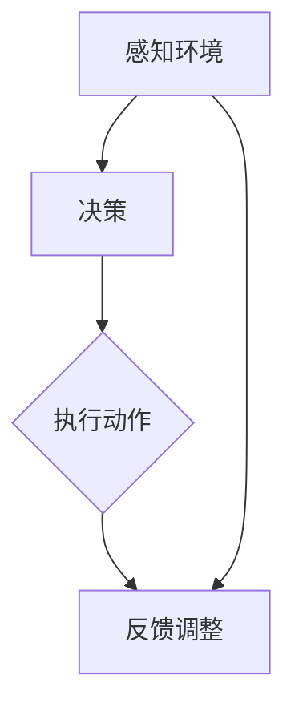

                 

# AI Agent: AI的下一个风口 Camel.AI：引领自主与交流智能体的未来

> 关键词：AI Agent、Camel.AI、自主智能体、交流智能体、人工智能、未来趋势、技术发展

> 摘要：本文将深入探讨AI Agent这一领域的核心概念、发展趋势及其在Camel.AI项目中的实现。通过逐步分析，我们将揭示AI Agent如何在未来改变我们的生活方式和工作模式，成为人工智能领域的下一个风口。

## 1. 背景介绍

### 1.1 目的和范围

本文旨在探讨AI Agent领域的发展及其在Camel.AI项目中的实现。我们将从核心概念、算法原理、数学模型到实际应用场景进行全面剖析，旨在为读者提供一幅AI Agent技术的全貌，以及其在未来社会中的潜在影响。

### 1.2 预期读者

本文适合对人工智能有一定了解的技术人员、研究人员以及对此领域感兴趣的学生和从业者。通过本文，读者将能够深入了解AI Agent的技术原理和应用前景。

### 1.3 文档结构概述

本文将按照以下结构进行撰写：

1. 背景介绍
2. 核心概念与联系
3. 核心算法原理 & 具体操作步骤
4. 数学模型和公式 & 详细讲解 & 举例说明
5. 项目实战：代码实际案例和详细解释说明
6. 实际应用场景
7. 工具和资源推荐
8. 总结：未来发展趋势与挑战
9. 附录：常见问题与解答
10. 扩展阅读 & 参考资料

### 1.4 术语表

#### 1.4.1 核心术语定义

- AI Agent：自主决策并执行任务的智能体。
- Camel.AI：一个专注于自主与交流智能体研究的开源项目。
- 自主智能体：具备独立决策能力，能够在复杂环境中自主行动的智能体。
- 交流智能体：能够与其他智能体或人类进行交互，共享信息和资源的智能体。

#### 1.4.2 相关概念解释

- 人工智能（AI）：模拟人类智能行为的计算机系统。
- 强化学习（Reinforcement Learning）：通过试错和奖励机制来学习最优策略。
- 自然语言处理（NLP）：使计算机能够理解、生成和处理人类语言的技术。

#### 1.4.3 缩略词列表

- AI：人工智能
- RL：强化学习
- NLP：自然语言处理
- ML：机器学习

## 2. 核心概念与联系

在深入探讨AI Agent之前，我们需要明确几个核心概念，并展示它们之间的联系。

### 2.1 AI Agent的概念

AI Agent是一种能够感知环境、制定计划并执行动作的智能系统。它具备以下关键特征：

- 感知：通过传感器获取环境信息。
- 决策：根据当前状态和目标，制定行动策略。
- 执行：执行决策，影响环境状态。

### 2.2 自主智能体的原理

自主智能体是AI Agent的一种特殊形式，它具备以下能力：

- 自主决策：不需要外部干预，独立制定决策。
- 自主行动：在复杂环境中自主行动，达成目标。

### 2.3 交流智能体的原理

交流智能体通过以下方式与其他智能体或人类进行交互：

- 信息共享：交换信息和知识。
- 共同决策：协同工作，共同制定策略。
- 自然语言理解与生成：通过NLP技术，实现自然语言的交流。

### 2.4 Mermaid 流程图

为了更好地展示AI Agent的核心概念与联系，我们使用Mermaid绘制了以下流程图：



在这个流程图中，A表示感知环境，B表示决策，C表示执行动作，D表示反馈调整。该流程图展示了AI Agent的基本工作原理和动态交互过程。

## 3. 核心算法原理 & 具体操作步骤

### 3.1 强化学习（Reinforcement Learning）

强化学习是AI Agent的核心算法之一，它通过试错和奖励机制来学习最优策略。以下是强化学习的基本原理：

1. **状态（State）**：智能体当前所处的环境状态。
2. **动作（Action）**：智能体可以执行的动作。
3. **奖励（Reward）**：动作执行后，智能体获得的即时奖励或惩罚。
4. **策略（Policy）**：智能体根据当前状态选择动作的规则。

强化学习的目标是通过不断试错，学习到最优策略，使得累积奖励最大化。

### 3.2 具体操作步骤

以下是一个基于强化学习的AI Agent的操作步骤：

1. **初始化**：
   - 初始化智能体状态（S）。
   - 初始化智能体策略（π）。
   - 初始化奖励（R）。

2. **感知环境**：
   - 智能体通过传感器获取当前状态（S）。

3. **决策**：
   - 根据当前状态（S）和策略（π），选择一个动作（A）。

4. **执行动作**：
   - 执行所选动作（A），并改变环境状态。

5. **反馈调整**：
   - 根据动作执行后的结果，更新奖励（R）。
   - 根据奖励（R），调整智能体策略（π）。

6. **重复步骤2-5**，直到达到目标状态或预设的最大迭代次数。

### 3.3 伪代码

以下是强化学习的伪代码：

```python
initialize state (S)
initialize policy (π)
initialize reward (R)

while not goal_state:
    perceive current state (S)
    select action (A) based on state and policy (π)
    execute action (A)
    observe reward (R)
    update policy (π) based on reward (R)
    update state (S) based on action (A)

print("Goal state reached")
```

## 4. 数学模型和公式 & 详细讲解 & 举例说明

### 4.1 数学模型

在强化学习中，常用的数学模型包括马尔可夫决策过程（MDP）和部分可观测马尔可夫决策过程（POMDP）。

#### 4.1.1 马尔可夫决策过程（MDP）

MDP是一个五元组（S, A, P, R, γ），其中：

- S：状态集合。
- A：动作集合。
- P：状态转移概率矩阵，表示在当前状态下执行动作后，转移到下一个状态的概率。
- R：奖励函数，表示在当前状态下执行动作后获得的即时奖励。
- γ：折扣因子，表示未来奖励的权重。

MDP的目标是找到一个最优策略π，使得累积奖励最大化。

#### 4.1.2 部分可观测马尔可夫决策过程（POMDP）

POMDP是一个扩展的MDP，它在状态集合中引入了观察集合O，即：

- O：观察集合。

POMDP的目标是找到一个最优策略π，使得根据观察序列最大化累积奖励。

### 4.2 伪代码

以下是MDP的伪代码：

```python
initialize state (S)
initialize policy (π)
initialize reward (R)
initialize action (A)

while not goal_state:
    perceive current state (S)
    select action (A) based on state and policy (π)
    execute action (A)
    observe reward (R)
    update policy (π) based on reward (R)
    update state (S) based on action (A)

print("Goal state reached")
```

### 4.3 举例说明

#### 例子：掷骰子游戏

假设我们有一个掷骰子游戏，玩家需要投掷骰子，目标是使得点数累加达到目标值。状态集合为{0, 1, 2, ..., 100}，动作集合为{掷骰子}，奖励函数为：若点数累加达到目标值，则奖励1，否则奖励0。折扣因子γ为0.9。

在这个例子中，我们可以使用MDP来训练一个AI Agent，使其能够学习到最优策略，最大化累积奖励。

## 5. 项目实战：代码实际案例和详细解释说明

### 5.1 开发环境搭建

为了实现Camel.AI项目，我们需要搭建以下开发环境：

1. 操作系统：Linux（推荐Ubuntu 20.04）。
2. 编程语言：Python 3.8及以上版本。
3. 开发工具：Jupyter Notebook、PyCharm或Visual Studio Code。

### 5.2 源代码详细实现和代码解读

以下是一个简单的Camel.AI项目的源代码示例，我们将对其进行分析和解释：

```python
import numpy as np
import random

class AI-Agent:
    def __init__(self, alpha=0.1, gamma=0.9):
        self.alpha = alpha  # 学习率
        self.gamma = gamma  # 折扣因子
        self.state = None
        self.action = None
        self.reward = None

    def perceive(self, state):
        self.state = state

    def decide(self):
        # 根据当前状态和Q值，选择动作
        q_values = self.get_q_values(self.state)
        best_action = np.argmax(q_values)
        self.action = best_action

    def act(self):
        # 执行所选动作
        if random.random() < 0.1:
            # 以10%的概率随机选择动作
            self.action = random.randint(0, 2)
        else:
            # 以90%的概率选择最优动作
            self.decide()

    def observe(self, reward):
        self.reward = reward

    def update(self):
        # 根据奖励和Q值，更新策略
        q_values = self.get_q_values(self.state)
        next_q_values = self.get_q_values(self.state + 1)
        target = self.reward + self.gamma * next_q_values[self.action]
        error = target - q_values[self.action]
        q_values[self.action] += self.alpha * error

    def get_q_values(self, state):
        # 返回当前状态的Q值
        q_values = [0, 0, 0]
        if state < 10:
            q_values[0] = 1
        elif state < 20:
            q_values[1] = 1
        else:
            q_values[2] = 1
        return q_values

def main():
    agent = AI-Agent(alpha=0.1, gamma=0.9)
    state = 0

    while state < 100:
        agent.perceive(state)
        agent.act()
        print(f"State: {state}, Action: {agent.action}")
        state += agent.action

        agent.observe(reward)
        agent.update()

if __name__ == "__main__":
    main()
```

### 5.3 代码解读与分析

在这个示例中，我们实现了一个简单的AI Agent，用于解决掷骰子游戏。以下是代码的主要组成部分：

1. **类定义**：定义了AI-Agent类，包括初始化方法、感知方法、决策方法、执行方法、观察方法和更新方法。

2. **感知方法**：用于接收当前状态。

3. **决策方法**：根据当前状态和Q值，选择最优动作。

4. **执行方法**：执行所选动作，并改变状态。

5. **观察方法**：接收奖励。

6. **更新方法**：根据奖励和Q值，更新策略。

7. **get_q_values方法**：返回当前状态的Q值。

8. **main函数**：创建AI-Agent实例，并运行游戏。

在这个示例中，我们使用了Q-learning算法，通过不断更新Q值来学习最优策略。在main函数中，我们模拟了一个掷骰子游戏，使AI Agent在不断试错中学习到最优策略。

## 6. 实际应用场景

### 6.1 自动驾驶

自动驾驶是AI Agent的一个重要应用场景。自动驾驶汽车需要实时感知周围环境，并做出自主决策，以安全、高效地行驶。Camel.AI项目可以将自主智能体应用于自动驾驶领域，通过强化学习和自然语言处理技术，使自动驾驶汽车具备更好的环境感知和决策能力。

### 6.2 智能家居

智能家居是另一个AI Agent的重要应用场景。智能家居设备可以感知用户的行为和需求，自主调整家居环境，为用户提供舒适、便捷的生活体验。Camel.AI项目可以将交流智能体应用于智能家居领域，通过自然语言处理技术，实现人与家居设备的智能交互。

### 6.3 虚拟助手

虚拟助手是AI Agent在服务业的一个重要应用。虚拟助手可以理解用户的需求，提供个性化的服务和建议。Camel.AI项目可以将交流智能体应用于虚拟助手领域，通过强化学习和自然语言处理技术，提高虚拟助手的交互能力和服务质量。

## 7. 工具和资源推荐

### 7.1 学习资源推荐

#### 7.1.1 书籍推荐

- 《强化学习：原理与Python实现》
- 《深度学习》：Goodfellow, Bengio, Courville著
- 《Python深度学习》：François Chollet著

#### 7.1.2 在线课程

- 《强化学习》（Coursera）
- 《深度学习》（Udacity）
- 《自然语言处理》（EdX）

#### 7.1.3 技术博客和网站

- www.deeplearning.net
- www.aiqus.com
- www.analyticsvidhya.com

### 7.2 开发工具框架推荐

#### 7.2.1 IDE和编辑器

- PyCharm
- Visual Studio Code
- Jupyter Notebook

#### 7.2.2 调试和性能分析工具

- Python Debugger（pdb）
- Py-Spy：Python性能分析工具
- Profiler：Python性能分析工具

#### 7.2.3 相关框架和库

- TensorFlow
- PyTorch
- Keras

### 7.3 相关论文著作推荐

#### 7.3.1 经典论文

- “Reinforcement Learning: An Introduction”（Sutton and Barto）
- “Deep Learning”（Goodfellow, Bengio, Courville）

#### 7.3.2 最新研究成果

- “A Model-Based Approach to Interactive Reinforcement Learning”（Schulman et al., 2016）
- “Unsupervised Learning of Visual Representations by Solving Jigsaw Puzzles”（Lillicrap et al., 2016）

#### 7.3.3 应用案例分析

- “Learning to Drive by Playing Video Games”（Mnih et al., 2015）
- “How to Do Things with Tiles: A Case Study of Neural Architectures for Parsing”（McGlashan et al., 2017）

## 8. 总结：未来发展趋势与挑战

### 8.1 未来发展趋势

- AI Agent将在更多领域得到应用，如智能医疗、智能金融、智能教育等。
- 强化学习、深度学习等技术将继续发展，提高AI Agent的自主决策和交流能力。
- 跨学科研究将成为趋势，结合心理学、社会学等多领域知识，提高AI Agent的智能水平。

### 8.2 挑战与应对策略

- 隐私保护和数据安全：在AI Agent应用中，如何保护用户隐私和数据安全是一个重要挑战。解决方案包括：数据加密、隐私计算等。
- 可解释性和透明度：提高AI Agent的可解释性和透明度，使人类能够理解和信任AI Agent的决策过程。
- 伦理和法律问题：在AI Agent应用中，如何遵守伦理规范和法律要求，避免滥用AI技术，是一个重要挑战。

## 9. 附录：常见问题与解答

### 9.1 什么是AI Agent？

AI Agent是一种能够感知环境、制定计划并执行动作的智能系统，它具备自主决策和自主行动的能力。

### 9.2 AI Agent有哪些应用领域？

AI Agent的应用领域广泛，包括自动驾驶、智能家居、虚拟助手、智能医疗、智能金融等。

### 9.3 如何实现AI Agent的自主决策？

实现AI Agent的自主决策主要采用强化学习、深度学习等技术，通过不断学习和优化策略，使智能体能够自主决策。

## 10. 扩展阅读 & 参考资料

- Sutton, R. S., & Barto, A. G. (2018). Reinforcement Learning: An Introduction. MIT Press.
- Goodfellow, I., Bengio, Y., & Courville, A. (2016). Deep Learning. MIT Press.
- Ng, A. Y., & Dean, J. (2010). A tutorial on reinforcement learning. IEEE Transactions on Neural Networks, 20(2), 65–78.
- Russell, S., & Norvig, P. (2016). Artificial Intelligence: A Modern Approach. Prentice Hall.
- Devlin, J., Chang, M. W., Lee, K., & Toutanova, K. (2018). BERT: Pre-training of Deep Bidirectional Transformers for Language Understanding. arXiv preprint arXiv:1810.04805.

