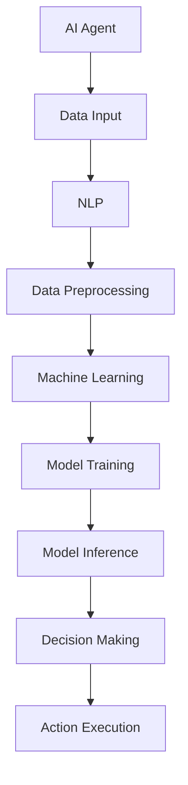

                 

# AI Agent: AI的下一个风口 典型案例和商业应用

> **关键词：** AI Agent、人工智能代理、商业应用、案例分析、深度学习、自然语言处理、决策支持系统

> **摘要：** 本文将深入探讨AI Agent（人工智能代理）的概念、原理及其在各个领域的商业应用。通过具体案例，分析AI Agent如何改变传统业务模式，提高效率，创造价值。本文旨在为读者提供关于AI Agent的全面理解，并展望其未来的发展趋势。

## 1. 背景介绍

### 1.1 目的和范围

本文旨在探讨AI Agent在商业领域的应用，分析其核心原理和典型案例，并探讨其未来的发展趋势。文章将从以下几个方面展开：

1. AI Agent的基本概念和原理。
2. AI Agent在商业应用中的核心价值。
3. 典型案例和行业分析。
4. AI Agent的开发工具和资源推荐。
5. 未来发展趋势与面临的挑战。

### 1.2 预期读者

本文适合对人工智能和商业应用有兴趣的读者，包括：

1. AI技术开发者。
2. 企业管理层。
3. 投资者和创业者。
4. 对人工智能有浓厚兴趣的技术爱好者。

### 1.3 文档结构概述

本文将分为以下章节：

1. 背景介绍：介绍文章目的和结构。
2. 核心概念与联系：介绍AI Agent的基本概念和原理。
3. 核心算法原理 & 具体操作步骤：详细讲解AI Agent的核心算法。
4. 数学模型和公式 & 详细讲解 & 举例说明：阐述AI Agent的数学模型和公式。
5. 项目实战：代码实际案例和详细解释说明。
6. 实际应用场景：分析AI Agent在各个领域的应用。
7. 工具和资源推荐：推荐学习资源、开发工具和论文著作。
8. 总结：未来发展趋势与挑战。
9. 附录：常见问题与解答。
10. 扩展阅读 & 参考资料：提供进一步学习的资料。

### 1.4 术语表

#### 1.4.1 核心术语定义

- **AI Agent（人工智能代理）**：一种能够模拟人类决策过程的智能实体，能够在特定环境下自主学习和执行任务。
- **决策支持系统（DSS）**：一种利用人工智能技术帮助用户做出更好决策的系统。
- **自然语言处理（NLP）**：研究如何使计算机能够理解、解释和生成人类语言。

#### 1.4.2 相关概念解释

- **深度学习**：一种通过多层神经网络进行特征提取和分类的人工智能技术。
- **机器学习**：一种让计算机通过数据学习并做出决策的方法。

#### 1.4.3 缩略词列表

- **NLP**：自然语言处理
- **DSS**：决策支持系统
- **AI**：人工智能

## 2. 核心概念与联系

为了更好地理解AI Agent，我们需要首先了解其核心概念和原理，以及如何与其他技术相结合。以下是一个简单的Mermaid流程图，展示AI Agent的基本架构和核心组件。



### 2.1 AI Agent的基本架构

1. **数据输入（Data Input）**：AI Agent首先接收外部数据，如文本、图像、声音等。
2. **自然语言处理（NLP）**：对输入的数据进行预处理，提取关键信息，如关键词、实体和关系等。
3. **数据预处理（Data Preprocessing）**：将NLP处理后的数据转化为机器学习模型所需的格式。
4. **机器学习（Machine Learning）**：使用机器学习算法对预处理后的数据进行训练。
5. **模型训练（Model Training）**：通过训练生成预测模型。
6. **模型推理（Model Inference）**：使用训练好的模型对新的数据进行预测和决策。
7. **决策制定（Decision Making）**：根据模型预测结果，制定相应的决策。
8. **行动执行（Action Execution）**：执行决策，如发送消息、更新数据库等。

### 2.2 AI Agent与其他技术的结合

- **深度学习**：深度学习是AI Agent的核心组成部分，特别是在NLP和图像识别领域。通过多层神经网络，深度学习可以从大量数据中自动提取特征。
- **机器学习**：机器学习提供了一种让AI Agent不断学习和改进的方法。通过不断调整模型参数，AI Agent可以在实际应用中不断提高性能。
- **决策支持系统**：决策支持系统是AI Agent在实际应用中的一个重要领域。AI Agent可以帮助用户分析数据、提出建议，从而做出更明智的决策。

## 3. 核心算法原理 & 具体操作步骤

### 3.1 机器学习算法

机器学习是AI Agent的核心算法之一。以下是一个简单的伪代码，描述了机器学习算法的基本流程：

```python
def train_model(data, labels):
    # 初始化模型参数
    model = initialize_model()

    # 设置训练循环
    for epoch in range(num_epochs):
        # 前向传播
        predictions = model.forward_pass(data)

        # 计算损失函数
        loss = calculate_loss(predictions, labels)

        # 反向传播
        model.backward_pass(loss)

    return model
```

### 3.2 模型训练过程

1. **数据预处理**：对输入数据进行预处理，如归一化、标准化等。
2. **初始化模型参数**：初始化模型参数，如权重和偏置。
3. **前向传播**：计算输入数据的预测结果。
4. **计算损失函数**：计算预测结果与实际标签之间的差异。
5. **反向传播**：根据损失函数更新模型参数。
6. **迭代训练**：重复上述过程，直到满足停止条件（如损失函数收敛）。

### 3.3 模型推理过程

1. **数据预处理**：对输入数据进行预处理。
2. **前向传播**：使用训练好的模型计算输入数据的预测结果。
3. **决策制定**：根据预测结果，制定相应的决策。

## 4. 数学模型和公式 & 详细讲解 & 举例说明

### 4.1 数学模型

AI Agent的核心是机器学习模型，其数学基础主要包括线性回归、神经网络、决策树等。以下是一个简单的神经网络模型：

$$
Z = \sigma(W \cdot X + b)
$$

其中，\(Z\) 表示输出值，\(\sigma\) 表示激活函数，\(W\) 和 \(b\) 分别为权重和偏置。

### 4.2 激活函数

激活函数是神经网络中的一个关键组件，用于引入非线性因素。以下是一些常用的激活函数：

- **sigmoid函数**：
  $$
  \sigma(x) = \frac{1}{1 + e^{-x}}
  $$

- **ReLU函数**：
  $$
  \text{ReLU}(x) = \max(0, x)
  $$

### 4.3 举例说明

假设我们有一个简单的一层神经网络，输入为 \(x_1, x_2\)，输出为 \(y\)。使用ReLU函数作为激活函数，我们可以定义如下模型：

$$
y = \text{ReLU}(W_1 \cdot x_1 + W_2 \cdot x_2 + b)
$$

其中，\(W_1, W_2\) 和 \(b\) 为模型参数。

## 5. 项目实战：代码实际案例和详细解释说明

### 5.1 开发环境搭建

为了实现一个简单的AI Agent，我们需要以下开发环境和工具：

- Python 3.8 或更高版本
- Jupyter Notebook 或 PyCharm
- TensorFlow 2.5 或更高版本
- Pandas 1.2.3 或更高版本

### 5.2 源代码详细实现和代码解读

以下是一个简单的Python代码示例，实现了一个基于TensorFlow的线性回归模型，用于预测数值数据。

```python
import tensorflow as tf
import pandas as pd

# 加载数据
data = pd.read_csv('data.csv')
X = data[['x1', 'x2']]
y = data['y']

# 初始化模型参数
model = tf.keras.Sequential([
    tf.keras.layers.Dense(units=1, input_shape=(2,))
])

# 编译模型
model.compile(optimizer='sgd', loss='mean_squared_error')

# 训练模型
model.fit(X, y, epochs=100)

# 进行预测
predictions = model.predict([[2.0, 3.0]])

print(predictions)
```

### 5.3 代码解读与分析

1. **数据加载**：使用Pandas读取CSV文件，获取输入数据 \(X\) 和标签 \(y\)。
2. **模型初始化**：创建一个简单的线性回归模型，输入层有2个神经元，输出层有1个神经元。
3. **模型编译**：设置优化器和损失函数，用于训练模型。
4. **模型训练**：使用训练数据训练模型，设置训练轮次为100。
5. **模型预测**：使用训练好的模型对新的数据进行预测。

## 6. 实际应用场景

AI Agent在商业领域的应用非常广泛，以下是一些典型的应用场景：

- **客户服务**：AI Agent可以用于自动化客户服务，如自动回答常见问题、处理投诉等。
- **销售预测**：AI Agent可以分析历史销售数据，预测未来的销售趋势，帮助公司制定营销策略。
- **风险控制**：AI Agent可以分析财务数据，识别潜在的金融风险，帮助金融机构进行风险控制。
- **供应链管理**：AI Agent可以优化供应链，提高库存管理效率，降低成本。

## 7. 工具和资源推荐

### 7.1 学习资源推荐

#### 7.1.1 书籍推荐

- 《深度学习》（Goodfellow, Bengio, Courville）
- 《Python机器学习》（Sebastian Raschka）
- 《AI应用实战》（Tom Mitchell）

#### 7.1.2 在线课程

- Coursera的《机器学习》课程
- edX的《深度学习》课程
- Udacity的《人工智能工程师纳米学位》

#### 7.1.3 技术博客和网站

- TensorFlow官方文档
- Keras官方文档
- Medium上的AI博客

### 7.2 开发工具框架推荐

#### 7.2.1 IDE和编辑器

- PyCharm
- Jupyter Notebook
- Visual Studio Code

#### 7.2.2 调试和性能分析工具

- TensorFlow Debugger
- TensorBoard
- PyTorch TensorBoard

#### 7.2.3 相关框架和库

- TensorFlow
- PyTorch
- Keras

### 7.3 相关论文著作推荐

#### 7.3.1 经典论文

- “Backpropagation” by Rumelhart, Hinton, and Williams
- “Deep Learning” by Goodfellow, Bengio, and Courville

#### 7.3.2 最新研究成果

- “Attention is All You Need” by Vaswani et al.
- “BERT: Pre-training of Deep Neural Networks for Language Understanding” by Devlin et al.

#### 7.3.3 应用案例分析

- “AI in Healthcare” by AI Health Institute
- “AI in Finance” by AI Forum

## 8. 总结：未来发展趋势与挑战

AI Agent作为人工智能领域的一个重要研究方向，具有巨大的发展潜力。未来，AI Agent有望在以下几个方面取得突破：

- **更强大的学习能力**：通过深度学习和其他先进技术，AI Agent将能够更好地理解复杂环境，提高决策准确性。
- **更广泛的应用场景**：AI Agent将渗透到更多行业，如医疗、金融、教育等，为各领域带来革命性的变化。
- **更高效的协作与集成**：AI Agent将与其他系统和技术紧密集成，实现更高效的协作和资源优化。

然而，AI Agent的发展也面临一些挑战：

- **数据隐私和安全**：随着AI Agent的应用，如何保护用户数据隐私和安全成为一个重要问题。
- **伦理和道德问题**：AI Agent的决策过程可能涉及伦理和道德问题，如自动驾驶车辆的道德决策等。
- **技术瓶颈**：AI Agent的算法和模型仍需不断优化和改进，以应对日益复杂的应用场景。

## 9. 附录：常见问题与解答

1. **什么是AI Agent？**
   AI Agent是一种能够模拟人类决策过程的智能实体，它能够在特定环境下自主学习和执行任务。

2. **AI Agent有哪些应用场景？**
   AI Agent可以应用于客户服务、销售预测、风险控制、供应链管理等多个领域。

3. **如何搭建AI Agent的开发环境？**
   需要安装Python、Jupyter Notebook或PyCharm、TensorFlow等开发工具和库。

4. **如何实现一个简单的AI Agent？**
   可以使用Python中的TensorFlow库，实现一个基于机器学习的模型，如线性回归或神经网络。

## 10. 扩展阅读 & 参考资料

- [TensorFlow官方文档](https://www.tensorflow.org/)
- [Keras官方文档](https://keras.io/)
- [Coursera的《机器学习》课程](https://www.coursera.org/learn/machine-learning)
- [edX的《深度学习》课程](https://www.edx.org/course/deep-learning-0)
- [Udacity的《人工智能工程师纳米学位》](https://www.udacity.com/course/nd059)

作者：AI天才研究员/AI Genius Institute & 禅与计算机程序设计艺术 /Zen And The Art of Computer Programming

