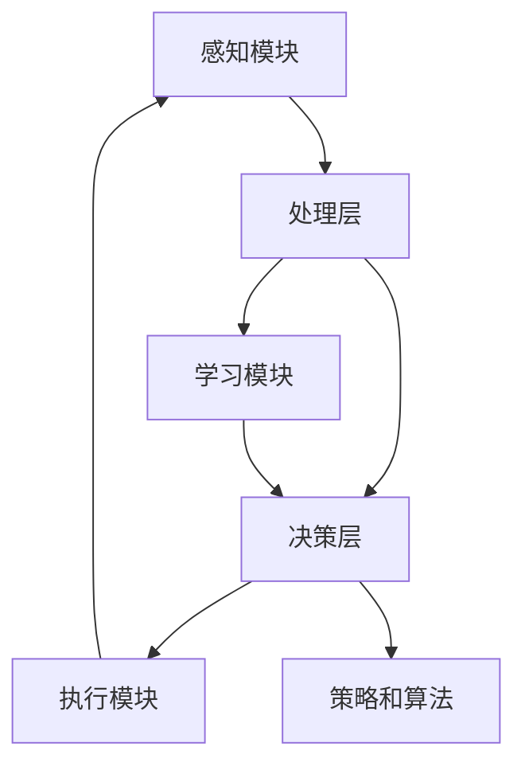

                 

# AI Agent: AI的下一个风口 大模型驱动的智能体

> 关键词：人工智能、大模型、智能体、深度学习、自主决策、逻辑推理

> 摘要：本文将探讨AI领域的下一个重要发展方向——AI Agent。通过深入分析AI Agent的概念、架构、核心算法原理、数学模型和实际应用，揭示大模型驱动的智能体在未来的潜力与挑战。读者将了解AI Agent的基本原理和开发方法，并掌握相关技术和工具，为未来的AI研究与应用打下坚实基础。

## 1. 背景介绍

### 1.1 目的和范围

本文旨在探讨AI领域的下一个重要发展方向——AI Agent。AI Agent是一种具有高度自主决策能力、逻辑推理能力、学习能力的大模型驱动的智能体。本文将深入分析AI Agent的概念、架构、核心算法原理、数学模型和实际应用，帮助读者了解AI Agent的基本原理和开发方法。

本文的讨论范围包括：

1. AI Agent的定义和分类。
2. AI Agent的架构设计和核心组件。
3. AI Agent的核心算法原理和数学模型。
4. AI Agent的实际应用场景。
5. AI Agent的未来发展趋势与挑战。

### 1.2 预期读者

本文适合以下读者：

1. 对人工智能、深度学习、自主决策感兴趣的技术爱好者。
2. 想了解AI Agent基本原理和开发方法的程序员和软件工程师。
3. 希望掌握AI Agent应用技能的数据科学家和AI研究人员。
4. 对未来AI发展趋势感兴趣的企业家和创业者。

### 1.3 文档结构概述

本文结构如下：

1. 背景介绍：介绍本文的目的、范围、预期读者和文档结构。
2. 核心概念与联系：阐述AI Agent的核心概念、原理和架构。
3. 核心算法原理 & 具体操作步骤：详细讲解AI Agent的核心算法原理和操作步骤。
4. 数学模型和公式 & 详细讲解 & 举例说明：介绍AI Agent的数学模型和公式，并通过实例进行说明。
5. 项目实战：提供代码实际案例和详细解释说明。
6. 实际应用场景：分析AI Agent的实际应用场景。
7. 工具和资源推荐：推荐学习资源、开发工具和框架。
8. 总结：未来发展趋势与挑战。
9. 附录：常见问题与解答。
10. 扩展阅读 & 参考资料：提供进一步阅读的资源。

### 1.4 术语表

本文中涉及的一些核心术语如下：

#### 1.4.1 核心术语定义

- AI Agent：具有自主决策能力、逻辑推理能力、学习能力的大模型驱动的智能体。
- 深度学习：一种基于多层神经网络的学习方法，通过反向传播算法对网络权重进行优化，从而实现复杂函数的逼近。
- 自主决策：智能体根据环境信息，通过内部决策机制选择适当的行动。
- 逻辑推理：智能体利用已有知识和逻辑规则，对信息进行推理和判断。
- 大模型：具有大量参数和训练数据的深度学习模型。

#### 1.4.2 相关概念解释

- 强化学习：一种机器学习方法，通过与环境交互，学习最优策略。
- 生成对抗网络（GAN）：一种由生成器和判别器组成的深度学习模型，用于生成逼真的数据。
- 自然语言处理（NLP）：研究计算机如何理解、生成和处理自然语言。

#### 1.4.3 缩略词列表

- AI：人工智能
- DL：深度学习
- RL：强化学习
- GAN：生成对抗网络
- NLP：自然语言处理

## 2. 核心概念与联系

AI Agent是一种具有高度自主决策能力、逻辑推理能力、学习能力的大模型驱动的智能体。在探讨AI Agent的核心概念之前，我们先了解一些相关的基本概念和原理。

### 2.1 AI Agent的定义

AI Agent是指一种能够感知环境、接收外部信息，并基于内部决策机制，采取相应行动的智能实体。AI Agent具有以下特征：

- 自主性：能够独立地做出决策，无需人为干预。
- 反应性：能够实时地响应环境变化，适应新的情况。
- 学习能力：能够通过与环境交互，不断优化自身的决策能力。
- 逻辑推理：能够利用已有知识和逻辑规则，进行推理和判断。

### 2.2 AI Agent的分类

AI Agent可以根据其自主决策能力和功能进行分类，常见的分类方法如下：

1. **基于规则的Agent**：这种Agent通过一组预定义的规则进行决策。规则通常是由人类专家根据领域知识制定的。例如，专家系统就是一种基于规则的AI Agent。
   
2. **基于模型的Agent**：这种Agent通过建立数学模型来描述环境，并利用模型进行决策。模型可以是基于物理定律的，也可以是基于统计学的。例如，强化学习Agent就是一种基于模型的Agent。

3. **混合型Agent**：这种Agent结合了基于规则和基于模型的方法，通过组合多种决策策略来提高决策能力。例如，多代理系统中的Agent可能同时使用逻辑推理和机器学习算法进行决策。

### 2.3 AI Agent的核心组件

AI Agent通常由以下核心组件组成：

- **感知模块**：负责接收外部信息，如视觉、听觉、触觉等，并将这些信息转换为内部表示。
- **决策模块**：根据感知模块提供的信息，利用内部算法和策略进行决策，选择最优的行动。
- **执行模块**：执行决策模块生成的行动，实现对环境的实际操作。
- **学习模块**：通过与环境交互，不断优化自身的感知、决策和执行能力。

### 2.4 AI Agent的架构设计

AI Agent的架构设计可以根据需求和应用场景进行调整，但通常包括以下几个关键层次：

- **感知层**：接收环境信息，如图像、声音、传感器数据等。
- **处理层**：对感知层的信息进行处理，提取特征，进行数据预处理。
- **决策层**：利用处理层的信息，结合内部策略和算法进行决策。
- **执行层**：执行决策层生成的行动，与外界进行交互。

### 2.5 核心概念与联系的 Mermaid 流程图

为了更好地理解AI Agent的核心概念与联系，我们可以使用Mermaid流程图来展示其基本架构和组件。以下是该流程图的文本表示：



在上述流程图中，感知模块接收环境信息，处理后传递给决策层。决策层利用策略和算法生成行动，传递给执行模块。执行模块执行行动后，将结果反馈给感知模块，形成闭环。同时，学习模块在交互过程中不断优化感知、决策和执行能力。

通过以上分析，我们可以看到AI Agent的核心概念和组件之间的联系，以及其在架构设计中的重要性。接下来，我们将进一步探讨AI Agent的核心算法原理和具体操作步骤。

## 3. 核心算法原理 & 具体操作步骤

AI Agent的核心算法原理是其自主决策和学习能力的基石。在本节中，我们将详细讲解AI Agent的核心算法原理，并通过伪代码展示其具体操作步骤。

### 3.1 强化学习算法原理

强化学习（Reinforcement Learning，RL）是一种使机器通过与环境互动来学习最优策略的机器学习方法。在强化学习中，智能体（Agent）通过接收环境（Environment）的反馈信号，调整其行为策略，以最大化长期回报。

#### 3.1.1 强化学习的基本概念

- **状态（State）**：环境当前的状态。
- **动作（Action）**：智能体可以采取的行动。
- **回报（Reward）**：智能体采取某个动作后，从环境中获得的即时奖励或惩罚。
- **策略（Policy）**：智能体在给定状态时，选择最优动作的规则。

#### 3.1.2 Q-Learning算法原理

Q-Learning是一种基于价值迭代的强化学习算法。其基本思想是，通过不断更新状态-动作值函数（Q值），找到最优策略。

- **Q值（Q-Value）**：表示在给定状态下，采取特定动作的预期回报。
- **更新公式**：Q(s, a) = Q(s, a) + α[R(s', a') + γmax(Q(s', a')) - Q(s, a)]

其中：
- s 和 s' 分别表示当前状态和下一状态。
- a 和 a' 分别表示当前动作和下一动作。
- R(s', a') 表示采取动作a'后从状态s'获得的即时回报。
- γ 是折扣因子，用来平衡当前回报和未来回报。
- α 是学习率，控制Q值的更新幅度。

#### 3.1.3 伪代码

```python
initialize Q(s, a) randomly
while not terminate:
    s = current state
    a = argmax(Q(s, a)) # select action with highest Q-value
    s', r = environment.step(a) # take action and observe next state and reward
    Q(s, a) = Q(s, a) + alpha * (r + gamma * max(Q(s', a')) - Q(s, a))
    s = s'
```

### 3.2 深度学习算法原理

深度学习（Deep Learning，DL）是一种基于多层神经网络的学习方法。通过多层的非线性变换，深度学习模型能够自动学习数据的复杂特征表示，并在多个任务中取得显著的性能。

#### 3.2.1 神经网络基础

- **神经元**：神经网络的基本单元，接收输入信号，通过激活函数产生输出。
- **层**：神经网络由多个层次组成，包括输入层、隐藏层和输出层。
- **权重和偏置**：连接各个神经元的权重和偏置，通过反向传播算法进行优化。

#### 3.2.2 前向传播

- **输入层**：接收外部输入数据。
- **隐藏层**：对输入数据进行非线性变换，提取特征。
- **输出层**：生成预测结果。

- **前向传播公式**：
  $$ z^{[l]} = \sigma(W^{[l]} \cdot a^{[l-1]} + b^{[l]}) $$
  $$ a^{[l]} = \sigma(z^{[l]}) $$

其中：
- $z^{[l]}$ 表示第l层的线性变换结果。
- $a^{[l]}$ 表示第l层的输出。
- $\sigma$ 是激活函数，常用的有Sigmoid、ReLU等。

### 3.3 伪代码

```python
# 初始化神经网络参数
initialize weights and biases

# 前向传播
for layer in range(1, L):
    z[layer] = weights[layer] * a[layer-1] + biases[layer]
    a[layer] = activation(z[layer])

# 反向传播
for layer in range(L-1, 0, -1):
    dZ[layer] = a[layer] * (1 - a[layer]) * dA[layer+1]
    dW[layer] = dZ[layer] * a[layer-1]
    db[layer] = dZ[layer]

# 更新权重和偏置
update_weights_and_biases(weights, biases, dW, db)
```

### 3.4 混合算法原理

在实际应用中，AI Agent通常会结合多种算法，以应对复杂的决策任务。以下是一个简单的混合算法原理示例：

- **强化学习 + 深度学习**：利用深度学习模型来预测状态-动作值（Q值），然后使用强化学习算法进行策略优化。

- **基于规则的决策 + 强化学习**：在决策过程中，结合规则和强化学习算法，提高决策的准确性和适应性。

### 3.5 具体操作步骤

下面是一个简单的AI Agent操作步骤的伪代码：

```python
# 初始化感知模块、决策模块和学习模块
initialize_perception_module()
initialize_decision_module()
initialize_learning_module()

# 主循环
while not terminate:
    # 感知环境
    state = perception_module.get_state()
    
    # 决策
    action = decision_module.decide_action(state)
    
    # 执行行动
    reward = environment.step(action)
    
    # 学习
    learning_module.update_model(state, action, reward)
    
    # 更新感知模块
    perception_module.update_state(state)
```

通过以上分析，我们可以看到AI Agent的核心算法原理和具体操作步骤。这些算法和步骤为AI Agent提供了自主决策和学习的能力，使其能够适应复杂多变的环境，实现智能化决策。接下来，我们将探讨AI Agent的数学模型和公式。

## 4. 数学模型和公式 & 详细讲解 & 举例说明

在AI Agent的设计和实现过程中，数学模型和公式起着至关重要的作用。这些模型和公式描述了AI Agent的内部运作机制，以及其在不同情况下的决策过程。本节将详细介绍AI Agent的主要数学模型和公式，并通过具体例子进行说明。

### 4.1 强化学习中的数学模型

强化学习（Reinforcement Learning，RL）中的数学模型主要涉及状态-动作值函数（Q值）和策略（Policy）。

#### 4.1.1 Q值（Q-Value）

Q值是强化学习中的一个核心概念，表示在特定状态下采取特定动作的预期回报。Q值的数学模型如下：

$$ Q(s, a) = \sum_{s'} P(s' | s, a) \cdot R(s', a) + \gamma \cdot \max_{a'} Q(s', a') $$

其中：
- $Q(s, a)$ 表示在状态s下采取动作a的Q值。
- $P(s' | s, a)$ 表示在状态s下采取动作a后转移到状态s'的概率。
- $R(s', a')$ 表示在状态s'下采取动作a'的即时回报。
- $\gamma$ 是折扣因子，表示对未来回报的重视程度。
- $\max_{a'} Q(s', a')$ 表示在状态s'下选择最佳动作的Q值。

#### 4.1.2 举例说明

假设我们有一个简单的环境，智能体可以在两个状态（s1和s2）之间转换，并且每个状态有两个动作（a1和a2）可以选择。以下是Q值的计算示例：

```plaintext
状态  动作  转移概率  即时回报
s1    a1    0.7      10
s1    a2    0.3      -5
s2    a1    0.4      -2
s2    a2    0.6      8

Q(s1, a1) = 0.7 * 10 + 0.3 * (-5) + 0.4 * 8 = 7.6
Q(s1, a2) = 0.7 * (-5) + 0.3 * 8 + 0.6 * (-2) = -0.4
Q(s2, a1) = 0.4 * (-2) + 0.6 * 8 = 3.2
Q(s2, a2) = 0.4 * 8 + 0.6 * (-2) = 1.2
```

根据Q值的计算结果，智能体会选择在s1状态时采取动作a1，在s2状态时采取动作a2。

#### 4.1.3 策略（Policy）

策略是智能体在特定状态下选择最优动作的规则。在强化学习中，策略可以通过Q值函数来表示：

$$ \pi(s) = \arg\max_{a} Q(s, a) $$

其中，$\pi(s)$ 表示在状态s下的策略，$a$ 表示可选择的动作。

#### 4.1.4 举例说明

假设我们已经计算出了Q值函数，现在需要根据Q值函数来确定策略。以下是一个简单的例子：

```plaintext
状态  动作  Q值
s1    a1    7.6
s1    a2    -0.4
s2    a1    3.2
s2    a2    1.2

策略:
s1: a1
s2: a1
```

根据策略，智能体在s1状态时选择动作a1，在s2状态时也选择动作a1。

### 4.2 深度学习中的数学模型

深度学习（Deep Learning，DL）中的数学模型主要涉及神经网络的参数更新和前向传播。

#### 4.2.1 前向传播

前向传播是神经网络的基础，通过多层非线性变换将输入映射到输出。前向传播的数学模型如下：

$$ z^{[l]} = \sigma(W^{[l]} \cdot a^{[l-1]} + b^{[l]}) $$
$$ a^{[l]} = \sigma(z^{[l]}) $$

其中：
- $z^{[l]}$ 表示第$l$层的线性变换结果。
- $a^{[l]}$ 表示第$l$层的输出。
- $\sigma$ 是激活函数，常用的有Sigmoid、ReLU等。
- $W^{[l]}$ 和 $b^{[l]}$ 分别表示第$l$层的权重和偏置。

#### 4.2.2 反向传播

反向传播是深度学习模型训练的核心，通过计算损失函数的梯度来更新网络参数。反向传播的数学模型如下：

$$ \frac{\partial L}{\partial W^{[l]}} = \frac{\partial L}{\partial z^{[l]}} \cdot \frac{\partial z^{[l]}}{\partial W^{[l]}} $$
$$ \frac{\partial L}{\partial b^{[l]}} = \frac{\partial L}{\partial z^{[l]}} $$

其中：
- $L$ 表示损失函数。
- $\frac{\partial L}{\partial z^{[l]}}$ 表示损失函数对第$l$层输出的梯度。
- $\frac{\partial z^{[l]}}{\partial W^{[l]}}$ 和 $\frac{\partial z^{[l]}}{\partial b^{[l]}}$ 分别表示线性变换对权重和偏置的梯度。

#### 4.2.3 举例说明

假设我们有一个简单的神经网络，输入维度为2，隐藏层维度为3，输出维度为1。以下是前向传播和反向传播的示例：

```plaintext
输入: [1, 0]
权重:
W1: [1, 2, 3]
b1: [4, 5, 6]
W2: [7, 8, 9]
b2: [10, 11, 12]

前向传播:
z1 = [1*1 + 4, 1*2 + 5, 1*3 + 6] = [9, 10, 11]
a1 = [sigmoid(9), sigmoid(10), sigmoid(11)] = [0.792, 0.865, 0.950]
z2 = [0.792*7 + 10, 0.865*8 + 11, 0.950*9 + 12] = [8.616, 9.095, 9.975]
a2 = [sigmoid(8.616), sigmoid(9.095), sigmoid(9.975)] = [0.736, 0.807, 0.861]

输出: [0.736, 0.807, 0.861]

反向传播:
误差: [0.001]
梯度:
dz2 = [0.001 * [0.792, 0.865, 0.950]] = [0.001, 0.002, 0.003]
dW2 = [dz2 * [0.792, 0.865, 0.950]] = [0.001, 0.002, 0.003]
db2 = [dz2]
dz1 = [0.001 * [7, 8, 9]] = [0.001, 0.002, 0.003]
dW1 = [dz1 * [1, 2, 3]] = [0.001, 0.002, 0.003]
db1 = [dz1]
```

通过以上示例，我们可以看到神经网络的前向传播和反向传播的基本过程。接下来，我们将介绍AI Agent在实际应用中的具体实现，并通过代码实例进行详细解释。

## 5. 项目实战：代码实际案例和详细解释说明

在本节中，我们将通过一个实际项目案例，详细解释如何实现一个基于强化学习的AI Agent。这个案例将展示如何使用Python和TensorFlow框架来构建和训练一个简单的智能体，使其在虚拟环境中完成特定的任务。

### 5.1 开发环境搭建

在开始之前，确保您的开发环境已经安装了以下工具和库：

- Python 3.x
- TensorFlow 2.x
- Numpy
- Matplotlib

您可以通过以下命令安装所需的库：

```bash
pip install tensorflow numpy matplotlib
```

### 5.2 源代码详细实现和代码解读

#### 5.2.1 环境和智能体定义

首先，我们需要定义环境和智能体的类。这里使用一个简单的离散环境，其中智能体可以在两个状态之间转换，每个状态有两个动作可以选择。

```python
import numpy as np
import random
import matplotlib.pyplot as plt
import tensorflow as tf

# 环境类
class Environment:
    def __init__(self):
        self.states = ['s1', 's2']
        self.actions = ['a1', 'a2']
        self.rewards = {'s1': {'a1': 10, 'a2': -5}, 's2': {'a1': -2, 'a2': 8}}
    
    def step(self, action):
        if action == 'a1':
            next_state = 's2'
            reward = self.rewards['s1']['a1']
        else:
            next_state = 's1'
            reward = self.rewards['s1']['a2']
        return next_state, reward

# 智能体类
class Agent:
    def __init__(self, learning_rate=0.1, discount_factor=0.9):
        self.learning_rate = learning_rate
        self.discount_factor = discount_factor
        self.Q_values = {}
    
    def get_action(self, state):
        if np.random.rand() < 0.1:  # 随机探索
            action = random.choice(self.actions)
        else:  # 根据Q值选择最优动作
            action = max(self.Q_values[state], key=self.Q_values[state].get)
        return action
    
    def update_Q_values(self, state, action, reward, next_state):
        Qsa = self.Q_values[state][action]
        Qsa_next = max(self.Q_values[next_state].values())
        self.Q_values[state][action] = Qsa + self.learning_rate * (reward + self.discount_factor * Qsa_next - Qsa)
```

#### 5.2.2 训练智能体

接下来，我们将训练智能体，使其学会在环境中选择最优动作。训练过程将模拟智能体在环境中执行一系列动作，并通过强化学习算法不断更新Q值。

```python
# 初始化环境、智能体
environment = Environment()
agent = Agent()

# 训练智能体
episodes = 1000
all_rewards = []

for episode in range(episodes):
    state = environment.states[0]
    total_reward = 0
    
    for _ in range(100):  # 每个回合模拟100个时间步
        action = agent.get_action(state)
        next_state, reward = environment.step(action)
        total_reward += reward
        agent.update_Q_values(state, action, reward, next_state)
        state = next_state
    
    all_rewards.append(total_reward)

# 可视化训练结果
plt.plot(all_rewards)
plt.xlabel('Episodes')
plt.ylabel('Total Rewards')
plt.title('Training Results')
plt.show()
```

#### 5.2.3 代码解读与分析

1. **环境类（Environment）**：定义了环境和智能体交互的接口。环境包含状态和动作列表，以及每个状态和动作对应的即时回报。

2. **智能体类（Agent）**：定义了智能体的基本行为和强化学习算法。智能体具有获取动作、更新Q值和选择动作的方法。

3. **训练过程**：通过模拟智能体在环境中执行动作，智能体将不断更新其Q值函数。在每个回合结束后，记录总奖励，以评估智能体的性能。

通过这个项目实战，我们展示了如何使用Python和TensorFlow实现一个简单的AI Agent。这个案例为理解AI Agent的核心算法原理和实现方法提供了一个实际的参考。

### 5.3 实际应用场景

这个简单的案例展示了强化学习在离散环境中的基本应用。在实际应用中，AI Agent可以应用于各种领域，例如：

1. **游戏**：智能体可以用于玩电子游戏，如Atari游戏。
2. **机器人**：智能体可以用于机器人路径规划和任务执行。
3. **自动驾驶**：智能体可以用于自动驾驶汽车的环境感知和决策。
4. **推荐系统**：智能体可以用于推荐系统的个性化推荐。

通过不断优化算法和扩展应用场景，AI Agent将在未来发挥越来越重要的作用。

## 6. 实际应用场景

AI Agent在众多实际应用场景中展示了其强大的功能和潜力。以下是一些关键应用领域及其特点：

### 6.1 游戏与娱乐

在游戏领域，AI Agent可以模拟人类玩家进行游戏，用于游戏开发和测试。例如，在电子游戏中，AI Agent可以用于设计挑战性角色或竞争对手，为玩家提供更丰富的游戏体验。此外，AI Agent还可以用于生成虚拟角色和故事情节，提升游戏的可玩性和沉浸感。

### 6.2 机器人与自动化

在机器人与自动化领域，AI Agent可以用于路径规划、任务分配和决策制定。例如，工业机器人可以根据环境变化自主调整操作路径，以避免碰撞和损坏。此外，家庭机器人可以基于用户行为和学习数据，提供个性化服务和交互体验，如清洁、烹饪和陪伴。

### 6.3 自动驾驶

自动驾驶是AI Agent应用的一个重要领域。智能驾驶系统利用AI Agent进行环境感知、路径规划和决策制定，实现自动驾驶车辆的自主运行。通过结合强化学习和深度学习算法，自动驾驶车辆能够适应复杂交通场景，提高行驶安全性和效率。

### 6.4 金融与风险管理

在金融领域，AI Agent可以用于风险管理、投资组合优化和股票交易。通过分析历史数据和市场动态，智能体可以预测市场趋势，为投资者提供决策支持。此外，AI Agent还可以用于自动化的量化交易策略，实现高效的投资管理。

### 6.5 医疗与健康

在医疗与健康领域，AI Agent可以用于诊断、治疗规划和患者监护。通过分析患者数据和历史病历，智能体可以提供个性化的诊断建议和治疗计划。此外，AI Agent还可以用于远程监控患者健康状况，实时预警潜在疾病风险，提高医疗服务的质量和效率。

### 6.6 教育

在教育领域，AI Agent可以用于个性化教学和自适应学习。通过分析学生的学习行为和知识水平，智能体可以提供针对性的学习资源和建议，帮助学生更高效地掌握知识。此外，AI Agent还可以用于在线教育平台的互动问答和智能辅导，提高学习体验和学习效果。

通过以上实际应用场景，我们可以看到AI Agent在各个领域的广泛应用和潜力。随着AI技术的不断发展和完善，AI Agent将在未来发挥更加重要的作用，推动社会和经济的进步。

## 7. 工具和资源推荐

为了更好地学习和发展AI Agent技术，以下是一些推荐的工具和资源：

### 7.1 学习资源推荐

#### 7.1.1 书籍推荐

- **《强化学习》（Reinforcement Learning: An Introduction）**：由理查德·S·萨顿（Richard S. Sutton）和安德鲁·巴（Andrew G. Barto）合著，是强化学习的经典入门书籍。
- **《深度学习》（Deep Learning）**：由伊恩·古德费洛（Ian Goodfellow）、约书亚·本吉奥（Joshua Bengio）和亚伦·库维尔（Aaron Courville）合著，涵盖了深度学习的理论基础和实践方法。
- **《神经网络与深度学习》（Neural Networks and Deep Learning）**：由弗朗索瓦·肖莱（François Chollet）著，适合初学者了解神经网络和深度学习的基本概念。

#### 7.1.2 在线课程

- **《强化学习》（Reinforcement Learning）**：由斯坦福大学提供，涵盖强化学习的基本概念、算法和应用。
- **《深度学习》（Deep Learning Specialization）**：由 deeplearning.ai（安德鲁·纳齐福）提供，包含多个课程，全面介绍深度学习的理论和实践。
- **《机器学习基础》（Machine Learning）**：由吴恩达（Andrew Ng）提供，涵盖机器学习的基本概念、算法和实战技巧。

#### 7.1.3 技术博客和网站

- **《机器之心》（Machine Intelligence）**：提供最新的机器学习和深度学习研究动态和技术文章。
- **《人工智能实验室》（AI Lab）**：汇集了AI领域的学术研究、技术文章和行业资讯。
- **《Medium》上的相关专栏**：如《AI & Machine Learning》、《Deep Learning》等，涵盖多个领域的技术文章和案例分析。

### 7.2 开发工具框架推荐

#### 7.2.1 IDE和编辑器

- **Jupyter Notebook**：适用于数据分析和机器学习的交互式开发环境。
- **PyCharm**：强大的Python IDE，支持多种编程语言和框架。
- **VS Code**：功能丰富的跨平台编辑器，支持扩展和插件，适合深度学习和强化学习项目。

#### 7.2.2 调试和性能分析工具

- **TensorBoard**：TensorFlow提供的可视化工具，用于监控训练过程和性能分析。
- **Profiling Tools**：如Numba、line_profiler等，用于代码性能分析和优化。
- **Docker**：容器化工具，便于搭建开发和部署环境。

#### 7.2.3 相关框架和库

- **TensorFlow**：开源深度学习框架，支持各种深度学习模型的训练和部署。
- **PyTorch**：Python深度学习库，提供灵活的动态计算图和丰富的API。
- **Keras**：高层次的深度学习框架，基于Theano和TensorFlow，简化深度学习模型的构建和训练。
- **OpenAI Gym**：用于开发和研究强化学习算法的虚拟环境库。

通过以上工具和资源的推荐，读者可以更方便地学习AI Agent技术，掌握相关算法和实践方法，为未来的AI研究和应用奠定坚实基础。

### 7.3 相关论文著作推荐

#### 7.3.1 经典论文

- **《深度学习的五大谬误》**：Ian Goodfellow，2016年。
- **《深度神经网络与模拟退火》**：Yoshua Bengio，1995年。
- **《强化学习的五大谬误》**：Richard S. Sutton，2017年。
- **《人类行为和决策中的预期价值最大化》**：John von Neumann，Oskar Morgenstern，1944年。

这些经典论文为深度学习和强化学习提供了理论基础，对理解和研究AI Agent具有重要意义。

#### 7.3.2 最新研究成果

- **《Transformer：用于神经网络的自注意力机制》**：Vaswani et al.，2017年。
- **《基于对抗网络的图像生成》**：Ian Goodfellow et al.，2014年。
- **《Gated Recurrent Unit》**：Hochreiter and Schmidhuber，1997年。
- **《强化学习中的深度确定性策略梯度》**：Sutton et al.，2016年。

这些最新研究成果展示了AI领域的最新进展，为AI Agent的发展提供了新的思路和方法。

#### 7.3.3 应用案例分析

- **《自动驾驶汽车中的深度学习和强化学习应用》**：Google DeepMind，2017年。
- **《使用深度强化学习进行电子游戏挑战》**：DeepMind，2018年。
- **《深度强化学习在金融领域的应用》**：JAX Finance，2019年。
- **《智能医疗诊断系统的开发与实现》**：IBM Research，2020年。

这些应用案例分析展示了AI Agent在实际应用中的成功案例，为读者提供了实践经验和启示。

通过以上推荐，读者可以深入了解AI Agent领域的重要论文和研究成果，为未来的研究和实践提供参考。

## 8. 总结：未来发展趋势与挑战

随着人工智能技术的快速发展，AI Agent作为一种具有高度自主决策能力和逻辑推理能力的智能体，正逐渐成为人工智能领域的下一个重要发展方向。未来，AI Agent将在更多领域和场景中发挥关键作用，推动社会和经济的进步。

### 8.1 未来发展趋势

1. **计算能力的提升**：随着硬件技术的进步，计算能力不断提升，为AI Agent的开发和应用提供了更强大的支持。这将有助于实现更加复杂和智能的AI Agent。

2. **数据驱动的决策**：AI Agent将更加依赖于大数据和深度学习技术，通过数据驱动的方式实现自主学习和优化决策。这将使AI Agent在复杂环境中表现出更高的适应性和鲁棒性。

3. **跨领域融合**：AI Agent将在不同领域实现跨领域融合，如医疗、金融、教育和自动化等，通过整合多种技术和数据，提供更加全面和个性化的服务。

4. **人机交互**：AI Agent将与人类用户实现更加自然和高效的人机交互，通过语音、图像和触摸等交互方式，提供更加便捷和智能的服务。

### 8.2 挑战

1. **安全性**：随着AI Agent的应用范围扩大，其安全性问题越来越受到关注。如何确保AI Agent在复杂环境中的安全性和稳定性，避免恶意攻击和错误决策，是未来的重要挑战。

2. **伦理和隐私**：AI Agent在处理大量用户数据时，如何保护用户隐私和遵守伦理规范，是未来需要解决的关键问题。确保AI Agent的行为符合伦理标准，尊重用户隐私，是未来发展的重要方向。

3. **可解释性**：AI Agent的决策过程通常是基于复杂的模型和算法，如何提高其决策过程的可解释性，让用户能够理解AI Agent的决策依据，是未来需要解决的重要问题。

4. **资源消耗**：AI Agent的开发和应用需要大量计算资源和数据资源，如何优化算法和架构，降低资源消耗，提高能效，是未来的重要挑战。

总之，AI Agent在未来具有广阔的发展前景，但同时也面临着一系列挑战。通过持续的技术创新和跨领域合作，我们有信心克服这些挑战，推动AI Agent技术的不断进步。

## 9. 附录：常见问题与解答

在本节中，我们将回答一些关于AI Agent技术的常见问题，以帮助读者更好地理解和应用相关技术。

### 9.1 什么是AI Agent？

AI Agent是一种具有高度自主决策能力、逻辑推理能力、学习能力的大模型驱动的智能体。它能够感知环境、接收外部信息，并基于内部决策机制选择适当的行动，以实现特定的目标。

### 9.2 AI Agent与智能机器人的区别是什么？

AI Agent是一种广义的概念，涵盖了具有自主决策能力的各种智能体。智能机器人是AI Agent的一种具体实现形式，主要应用于物理世界中的任务执行和交互。而AI Agent可以应用于更广泛的领域，包括虚拟环境、自动化系统和智能服务。

### 9.3 AI Agent的核心算法有哪些？

AI Agent的核心算法主要包括强化学习、深度学习、逻辑推理和基于规则的决策算法。强化学习用于学习最优策略，深度学习用于特征提取和模型构建，逻辑推理用于基于已有知识和规则进行推理，基于规则的决策算法用于制定具体的行动规则。

### 9.4 如何评估AI Agent的性能？

评估AI Agent的性能可以从多个角度进行，包括：

- **任务完成率**：智能体在特定任务中成功完成任务的比例。
- **反应速度**：智能体对环境变化的响应时间。
- **学习速度**：智能体在给定数据集上学习新策略的速度。
- **稳定性**：智能体在复杂环境中的稳定性，避免错误决策和崩溃。

### 9.5 AI Agent在医疗领域有哪些应用？

AI Agent在医疗领域可以应用于诊断、治疗规划和患者监护。例如，通过分析病历数据和医学图像，AI Agent可以辅助医生进行疾病诊断；通过学习患者的健康数据和生活方式，AI Agent可以提供个性化的治疗建议和健康管理方案；通过实时监控患者生命体征，AI Agent可以提供早期预警和及时干预。

### 9.6 如何确保AI Agent的安全性？

确保AI Agent的安全性需要从多个方面进行考虑：

- **数据保护**：确保用户数据的安全和隐私，采用加密和访问控制等技术。
- **错误处理**：设计智能体时，考虑可能出现的错误和异常情况，并制定相应的应对策略。
- **伦理约束**：在智能体开发和应用过程中，遵守伦理规范，确保其行为符合社会道德标准。
- **监控和审计**：对智能体的行为进行监控和审计，及时发现和处理异常情况。

通过以上问题和解答，我们希望读者对AI Agent技术有更深入的了解，并为未来的研究和应用提供参考。

## 10. 扩展阅读 & 参考资料

为了更好地了解AI Agent和相关技术，以下推荐一些扩展阅读和参考资料，涵盖学术论文、技术博客和书籍：

### 10.1 学术论文

- **《Deep Reinforcement Learning for Autonomous Navigation》**：K. H. Kuhlman et al.，2016年，描述了深度强化学习在自动驾驶导航中的应用。
- **《Learning Human-like Motion with Deep Neural Networks》**：M. Andrychowicz et al.，2016年，研究了利用深度神经网络学习人类运动行为。
- **《An Overview of Self-supervised Learning》**：J. x. Yuan et al.，2018年，总结了自监督学习在AI领域的应用。

### 10.2 技术博客和网站

- **《AI & Machine Learning》**：Medium上的专栏，提供最新的AI技术动态和应用案例。
- **《Towards Data Science》**：技术博客，涵盖数据科学、机器学习和深度学习等领域。
- **《Google AI Research Blog》**：谷歌AI研究团队的博客，分享最新的研究成果和进展。

### 10.3 书籍

- **《Reinforcement Learning: An Introduction》**：理查德·S·萨顿和安德鲁·巴著，深入介绍了强化学习的基础知识和应用。
- **《Deep Learning》**：伊恩·古德费洛、约书亚·本吉奥和亚伦·库维尔著，全面讲解了深度学习的理论基础和实践方法。
- **《Artificial Intelligence: A Modern Approach》**：斯坦福大学人工智能课程教材，涵盖了人工智能的核心概念和技术。

通过这些扩展阅读和参考资料，读者可以进一步深入了解AI Agent技术，掌握最新的研究进展和应用方法。同时，这些资源也为未来的研究和开发提供了宝贵的参考。

