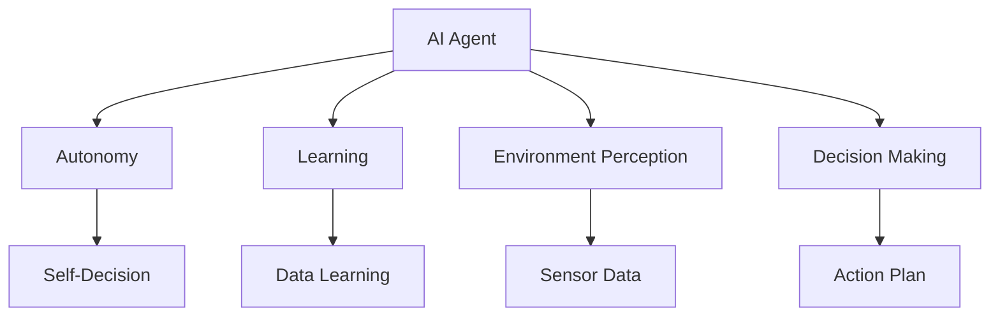

                 

# AI Agent: AI的下一个风口 技术的发展趋势

> 关键词：AI Agent、人工智能代理、智能代理、人工智能、机器学习、深度学习、智能决策、自动化、人工智能应用场景

> 摘要：本文将深入探讨AI Agent这一人工智能领域的新兴热点，分析其背景、核心概念、算法原理、数学模型、实际应用以及未来发展趋势。通过详细的步骤解析，我们将揭示AI Agent的潜力和挑战，为读者提供全面的视角和实用的参考。

## 1. 背景介绍

### 1.1 目的和范围

本文旨在系统地介绍AI Agent这一人工智能领域的核心概念和发展趋势。我们将首先概述AI Agent的背景，接着详细探讨其核心概念、算法原理、数学模型和实际应用。最后，本文将展望AI Agent的未来发展趋势和面临的挑战，为读者提供全面的视角。

### 1.2 预期读者

本文适合对人工智能和机器学习有一定了解的技术人员、研究人员以及对于AI Agent感兴趣的一般读者。特别是那些希望在人工智能领域深入探索、从事相关研究和开发的人员，将受益匪浅。

### 1.3 文档结构概述

本文将按照以下结构展开：

1. **背景介绍**：介绍AI Agent的背景、目的和预期读者。
2. **核心概念与联系**：通过Mermaid流程图展示AI Agent的核心概念和架构。
3. **核心算法原理 & 具体操作步骤**：使用伪代码详细阐述AI Agent的算法原理和操作步骤。
4. **数学模型和公式 & 详细讲解 & 举例说明**：介绍AI Agent的数学模型和公式，并进行详细讲解和举例。
5. **项目实战：代码实际案例和详细解释说明**：提供实际的代码案例和详细解释。
6. **实际应用场景**：探讨AI Agent的实际应用场景。
7. **工具和资源推荐**：推荐相关的学习资源、开发工具和框架。
8. **总结：未来发展趋势与挑战**：总结AI Agent的发展趋势和面临的挑战。
9. **附录：常见问题与解答**：提供常见问题的解答。
10. **扩展阅读 & 参考资料**：推荐进一步的阅读材料和参考资料。

### 1.4 术语表

#### 1.4.1 核心术语定义

- **AI Agent**：具有自主决策能力和执行任务能力的智能实体。
- **智能代理**：同AI Agent，指能够自主处理任务的智能实体。
- **机器学习**：使计算机通过数据学习模式并做出决策的技术。
- **深度学习**：一种利用多层神经网络进行学习和决策的机器学习技术。
- **神经网络**：一种模仿生物神经系统的计算模型。

#### 1.4.2 相关概念解释

- **自主性**：AI Agent能够根据环境和任务需求自主做出决策。
- **学习能力**：AI Agent能够通过数据和学习算法不断改进自身性能。
- **强化学习**：一种通过奖励和惩罚来训练AI Agent的机器学习方法。

#### 1.4.3 缩略词列表

- **AI**：人工智能
- **ML**：机器学习
- **DL**：深度学习
- **ANN**：人工神经网络

## 2. 核心概念与联系

在探讨AI Agent的核心概念之前，我们需要了解一些相关的理论基础和组成部分。AI Agent是一个高度复杂的系统，其核心概念包括自主性、学习能力、环境感知和决策能力。以下是一个简单的Mermaid流程图，用于展示AI Agent的基本架构和核心概念之间的联系：



### 2.1 自主性（Autonomy）

自主性是AI Agent的核心特征之一。它使AI Agent能够根据环境和任务需求独立做出决策，而无需人类干预。自主性包括以下关键组成部分：

- **自我决策（Self-Decision）**：AI Agent根据其内部状态和外部环境信息自主做出决策。
- **自主性级别**：自主性可以分为不同的级别，从低到高包括：
  - **弱自主性**：AI Agent能够执行预定义的任务，但无法应对突发情况。
  - **强自主性**：AI Agent能够在复杂和不确定的环境中自主决策和执行任务。

### 2.2 学习能力（Learning）

学习能力是AI Agent的另一个核心特征。通过学习和适应数据，AI Agent能够不断改进其性能和决策能力。学习能力主要包括：

- **数据学习（Data Learning）**：AI Agent通过分析大量数据来发现模式和规律。
- **模型更新（Model Updating）**：AI Agent根据新的数据和经验更新其内部模型。

### 2.3 环境感知（Environment Perception）

环境感知是AI Agent理解其周围环境的重要手段。通过感知传感器收集环境数据，AI Agent能够获取关于环境状态的信息。环境感知的关键组成部分包括：

- **传感器数据（Sensor Data）**：AI Agent通过传感器（如摄像头、麦克风、传感器等）收集环境数据。
- **数据处理（Data Processing）**：AI Agent对传感器数据进行处理和分析，以提取有用的信息。

### 2.4 决策能力（Decision Making）

决策能力是AI Agent的核心功能之一。通过分析和处理环境感知数据，AI Agent能够制定行动计划并执行任务。决策能力包括：

- **决策模型（Decision Model）**：AI Agent根据其内部状态和外部环境信息建立决策模型。
- **行动计划（Action Plan）**：AI Agent根据决策模型制定具体的行动计划。

## 3. 核心算法原理 & 具体操作步骤

AI Agent的核心算法是使它能够自主决策和学习的关键。以下我们将使用伪代码详细阐述AI Agent的核心算法原理和具体操作步骤。

### 3.1 算法原理

AI Agent的核心算法基于以下步骤：

1. **感知环境**：AI Agent通过传感器收集环境数据。
2. **数据预处理**：对收集到的环境数据进行预处理，如去噪、归一化等。
3. **特征提取**：从预处理后的数据中提取关键特征。
4. **决策模型训练**：使用提取的特征训练决策模型。
5. **决策**：使用训练好的决策模型对新的环境数据做出决策。
6. **行动**：根据决策结果执行相应的行动。
7. **模型更新**：根据执行结果更新决策模型。

### 3.2 具体操作步骤

以下是一个简化的伪代码，展示了AI Agent的核心算法步骤：

```python
# 伪代码：AI Agent核心算法

# 初始化AI Agent
init_agent()

# 感知环境
env_data = sense_environment()

# 数据预处理
preprocessed_data = preprocess_data(env_data)

# 特征提取
features = extract_features(preprocessed_data)

# 决策模型训练
model = train_decision_model(features)

# 决策
decision = model.make_decision(new_env_data)

# 行动
action = execute_action(decision)

# 模型更新
update_model(model, action)
```

### 3.3 算法原理详细说明

1. **感知环境**：AI Agent通过传感器（如摄像头、麦克风、传感器等）实时收集环境数据。这些数据包括视觉、听觉、触觉等感官信息。
2. **数据预处理**：环境数据通常包含噪声和冗余信息。数据预处理步骤包括去噪、归一化、特征选择等，以提高数据质量。
3. **特征提取**：从预处理后的数据中提取关键特征，这些特征将用于训练决策模型。特征提取可以是基于统计学方法、机器学习方法或深度学习方法。
4. **决策模型训练**：使用提取的特征训练决策模型。决策模型可以是分类器、回归器或神经网络。训练过程通常涉及数据分割、模型选择、参数调优等步骤。
5. **决策**：在执行新任务时，AI Agent使用训练好的决策模型对新环境数据进行分析，并做出相应的决策。决策可以是分类、回归或其他类型的任务。
6. **行动**：根据决策结果，AI Agent执行具体的行动。行动可以是移动、执行特定操作或与其他实体交互。
7. **模型更新**：根据执行结果，AI Agent更新决策模型。这个过程可以是基于经验学习、强化学习或其他类型的更新方法。

## 4. 数学模型和公式 & 详细讲解 & 举例说明

在AI Agent中，数学模型和公式起到了关键作用，它们帮助AI Agent进行数据分析和决策。以下我们将介绍AI Agent中的几个核心数学模型和公式，并进行详细讲解和举例说明。

### 4.1 神经网络

神经网络（Neural Networks，NN）是AI Agent中常用的数学模型，用于数据处理和决策。一个简单的神经网络包括以下几个关键组成部分：

- **输入层（Input Layer）**：接收外部环境数据。
- **隐藏层（Hidden Layers）**：对输入数据进行处理和变换。
- **输出层（Output Layer）**：生成决策结果。

神经网络的工作原理是通过对数据进行前向传播和反向传播来训练模型。以下是神经网络的基本公式：

$$
z^{(l)} = \sum_{i=0}^{n} w^{(l)}_{i} * x^{(l)}_{i} + b^{(l)}
$$

其中，$z^{(l)}$ 表示第$l$层的输出，$w^{(l)}_{i}$ 和 $b^{(l)}$ 分别表示第$l$层的权重和偏置。

举例说明：

假设我们有一个简单的神经网络，输入层有3个神经元，隐藏层有2个神经元，输出层有1个神经元。输入数据为 [1, 2, 3]，权重和偏置如下：

$$
w^{(1)} = \begin{bmatrix}
1 & 2 & 3 \\
4 & 5 & 6 \\
\end{bmatrix}, b^{(1)} = \begin{bmatrix}
0.5 \\
1 \\
\end{bmatrix}
$$

输入层到隐藏层的输出为：

$$
z^{(1)} = \begin{bmatrix}
(1 * 1) + (2 * 4) + (3 * 5) + 0.5 \\
(1 * 2) + (2 * 5) + (3 * 6) + 1 \\
\end{bmatrix} = \begin{bmatrix}
20.5 \\
22.5 \\
\end{bmatrix}
$$

### 4.2 损失函数

在神经网络训练过程中，损失函数用于衡量模型预测值与真实值之间的差距。常用的损失函数包括均方误差（MSE）和交叉熵损失（Cross-Entropy Loss）。

- **均方误差（MSE）**：

$$
MSE = \frac{1}{n} \sum_{i=1}^{n} (y_i - \hat{y}_i)^2
$$

其中，$y_i$ 表示真实值，$\hat{y}_i$ 表示预测值，$n$ 表示样本数量。

- **交叉熵损失（Cross-Entropy Loss）**：

$$
CE = - \frac{1}{n} \sum_{i=1}^{n} y_i \log(\hat{y}_i)
$$

其中，$y_i$ 表示真实值，$\hat{y}_i$ 表示预测概率。

举例说明：

假设我们有一个二分类问题，真实值为 [0, 1, 1]，预测概率为 [0.2, 0.8, 0.9]。使用交叉熵损失计算损失值：

$$
CE = - \frac{1}{3} (0 \log(0.2) + 1 \log(0.8) + 1 \log(0.9)) \approx 0.510
$$

### 4.3 反向传播

反向传播是神经网络训练过程中用于更新权重和偏置的方法。以下是反向传播的基本步骤：

1. **计算误差**：计算预测值与真实值之间的误差。
2. **计算梯度**：计算每个权重和偏置的梯度。
3. **更新权重和偏置**：使用梯度下降或其他优化算法更新权重和偏置。

以下是反向传播的伪代码：

```python
# 伪代码：反向传播算法

# 计算误差
error = y - \hat{y}

# 计算梯度
grad_w = \frac{\partial CE}{\partial w}
grad_b = \frac{\partial CE}{\partial b}

# 更新权重和偏置
w = w - learning_rate * grad_w
b = b - learning_rate * grad_b
```

通过反向传播，神经网络可以不断优化其参数，从而提高预测准确性。

## 5. 项目实战：代码实际案例和详细解释说明

在本节中，我们将通过一个实际项目案例，展示如何使用Python实现一个简单的AI Agent。该项目将包括环境感知、数据预处理、决策模型训练和决策执行等步骤。

### 5.1 开发环境搭建

首先，我们需要搭建开发环境。以下是在Ubuntu 18.04操作系统上安装Python和相关的机器学习库的步骤：

1. **安装Python**：
   ```bash
   sudo apt update
   sudo apt install python3 python3-pip
   ```
2. **安装TensorFlow**：
   ```bash
   pip3 install tensorflow
   ```

### 5.2 源代码详细实现和代码解读

以下是该项目的主要源代码，包括环境感知、数据预处理、决策模型训练和决策执行等步骤：

```python
import tensorflow as tf
import numpy as np

# 环境感知
def sense_environment():
    # 假设使用摄像头获取图像数据
    image_data = capture_image()
    return image_data

# 数据预处理
def preprocess_data(image_data):
    # 对图像数据进行预处理，如缩放、归一化等
    preprocessed_data = preprocess_image(image_data)
    return preprocessed_data

# 决策模型训练
def train_decision_model(features):
    # 创建神经网络模型
    model = tf.keras.Sequential([
        tf.keras.layers.Flatten(input_shape=(28, 28)),
        tf.keras.layers.Dense(128, activation='relu'),
        tf.keras.layers.Dense(10, activation='softmax')
    ])

    # 编译模型
    model.compile(optimizer='adam',
                  loss='categorical_crossentropy',
                  metrics=['accuracy'])

    # 训练模型
    model.fit(features, labels, epochs=5)

    return model

# 决策
def make_decision(model, new_env_data):
    # 对新的环境数据进行预测
    prediction = model.predict(new_env_data)
    decision = np.argmax(prediction)
    return decision

# 行动
def execute_action(decision):
    # 根据决策结果执行相应的行动
    if decision == 0:
        print("执行行动A")
    elif decision == 1:
        print("执行行动B")
    # ... 其他行动

# 主函数
def main():
    # 感知环境
    env_data = sense_environment()

    # 数据预处理
    preprocessed_data = preprocess_data(env_data)

    # 决策模型训练
    model = train_decision_model(preprocessed_data)

    # 决策
    decision = make_decision(model, preprocessed_data)

    # 行动
    execute_action(decision)

# 运行主函数
if __name__ == "__main__":
    main()
```

### 5.3 代码解读与分析

下面我们将对上述代码进行逐行解读，并分析每个步骤的实现细节。

1. **环境感知（sense_environment）**：
   - `capture_image()` 是一个假设的函数，用于捕获摄像头图像数据。在实际项目中，我们可以使用OpenCV库来捕获图像。
   ```python
   import cv2
   def capture_image():
       camera = cv2.VideoCapture(0)
       ret, frame = camera.read()
       camera.release()
       return frame
   ```

2. **数据预处理（preprocess_data）**：
   - `preprocess_image()` 是一个假设的函数，用于对图像数据进行预处理，如缩放、归一化等。在实际项目中，我们可以使用OpenCV和NumPy库进行图像处理。
   ```python
   import cv2
   import numpy as np

   def preprocess_image(image_data):
       image = cv2.resize(image_data, (28, 28))
       image = cv2.cvtColor(image, cv2.COLOR_BGR2GRAY)
       image = image / 255.0
       return image.flatten()
   ```

3. **决策模型训练（train_decision_model）**：
   - 创建一个简单的神经网络模型，包括输入层、隐藏层和输出层。使用Flatten层将输入图像展平为1维数组，Dense层进行全连接，ReLU激活函数和softmax激活函数。
   - 编译模型，指定优化器、损失函数和评价指标。
   - 使用fit函数训练模型，指定训练数据和标签，以及训练轮数。
   ```python
   from tensorflow.keras.models import Sequential
   from tensorflow.keras.layers import Flatten, Dense
   from tensorflow.keras.optimizers import Adam

   def train_decision_model(features, labels):
       model = Sequential([
           Flatten(input_shape=(28, 28)),
           Dense(128, activation='relu'),
           Dense(10, activation='softmax')
       ])

       model.compile(optimizer=Adam(),
                     loss='categorical_crossentropy',
                     metrics=['accuracy'])

       model.fit(features, labels, epochs=5)

       return model
   ```

4. **决策（make_decision）**：
   - 使用训练好的模型对新的环境数据进行预测，并返回预测结果。
   ```python
   def make_decision(model, new_env_data):
       prediction = model.predict(new_env_data)
       decision = np.argmax(prediction)
       return decision
   ```

5. **行动（execute_action）**：
   - 根据决策结果执行相应的行动。这里以简单的打印为例，实际项目中可以根据决策结果执行更复杂的操作。
   ```python
   def execute_action(decision):
       if decision == 0:
           print("执行行动A")
       elif decision == 1:
           print("执行行动B")
       # ... 其他行动
   ```

6. **主函数（main）**：
   - 执行环境感知、数据预处理、决策模型训练、决策和行动等步骤。
   ```python
   def main():
       env_data = sense_environment()
       preprocessed_data = preprocess_data(env_data)
       model = train_decision_model(preprocessed_data)
       decision = make_decision(model, preprocessed_data)
       execute_action(decision)
   ```

7. **运行主函数**：
   - 在程序的最后，调用main函数以执行整个流程。
   ```python
   if __name__ == "__main__":
       main()
   ```

通过这个实际案例，我们可以看到如何使用Python实现一个简单的AI Agent。这个案例包括环境感知、数据预处理、决策模型训练和决策执行等关键步骤，展示了AI Agent的基本原理和实现过程。

## 6. 实际应用场景

AI Agent在众多实际应用场景中展现出强大的潜力，以下列举几个典型的应用领域：

### 6.1 自动驾驶

自动驾驶技术是AI Agent的一个典型应用场景。通过感知车辆周围环境，AI Agent能够实时分析路况、识别交通标志和行人，并根据这些信息做出安全、高效的驾驶决策。特斯拉、谷歌等公司已经在自动驾驶领域取得了显著成果。

### 6.2 智能客服

智能客服是另一个AI Agent的重要应用领域。通过自然语言处理和对话管理技术，AI Agent能够与用户进行实时互动，提供个性化的服务和支持。许多大型企业，如亚马逊、微软等，已经采用了智能客服系统，以提高客户满意度和降低人力成本。

### 6.3 聊天机器人

聊天机器人是AI Agent在消费领域的应用之一。通过深度学习和自然语言处理技术，聊天机器人能够与用户进行自然、流畅的对话，提供信息查询、订单处理、情感支持等服务。例如，苹果的Siri、谷歌的Google Assistant等都是典型的聊天机器人。

### 6.4 机器人运动控制

在机器人领域，AI Agent用于运动控制和路径规划。通过感知环境数据，AI Agent能够实时调整机器人动作，以避免障碍物、执行复杂任务。例如，在工业制造、医疗手术、灾难救援等领域，机器人运动控制技术具有重要的应用价值。

### 6.5 能源管理

AI Agent在能源管理领域具有广阔的应用前景。通过实时监测能源消耗、预测能源需求，AI Agent能够优化能源分配，提高能源利用效率。例如，智能电网、智能家居系统等都可以采用AI Agent进行能源管理。

### 6.6 金融风控

在金融领域，AI Agent用于风险评估、欺诈检测、投资策略等任务。通过分析大量数据，AI Agent能够识别潜在风险、预测市场趋势，为金融机构提供决策支持。例如，银行、保险公司等金融机构已经广泛应用AI Agent进行风险管理和优化。

### 6.7 医疗诊断

AI Agent在医疗领域具有巨大潜力。通过分析医学影像、病历数据，AI Agent能够辅助医生进行疾病诊断、治疗方案制定。例如，在癌症筛查、心脏病诊断等领域，AI Agent的应用已经显著提高了诊断准确率和效率。

总之，AI Agent在众多实际应用场景中发挥着重要作用，未来随着技术的不断进步，其应用范围将更加广泛，带来更多的社会和经济价值。

## 7. 工具和资源推荐

为了更好地学习和开发AI Agent，以下推荐一些优秀的工具、资源和框架，帮助读者深入了解AI Agent的技术原理和应用场景。

### 7.1 学习资源推荐

#### 7.1.1 书籍推荐

1. **《深度学习》（Deep Learning）**：由Ian Goodfellow、Yoshua Bengio和Aaron Courville合著，是深度学习领域的经典教材，适合初学者和进阶读者。
2. **《人工智能：一种现代方法》（Artificial Intelligence: A Modern Approach）**：由Stuart Russell和Peter Norvig合著，涵盖了人工智能的基本概念和算法，适合全面了解人工智能。
3. **《强化学习基础教程》（Reinforcement Learning: An Introduction）**：由Richard S. Sutton和Barto B.合著，是强化学习领域的权威教材。

#### 7.1.2 在线课程

1. **Coursera上的《深度学习专项课程》**：由斯坦福大学Andrew Ng教授主讲，包括神经网络基础、卷积神经网络、循环神经网络和深度学习应用等内容。
2. **Udacity上的《深度学习工程师纳米学位》**：涵盖深度学习的基础知识和实际应用，包括图像识别、自然语言处理和强化学习等。
3. **edX上的《人工智能导论》**：由多所大学联合推出，涵盖机器学习、深度学习和人工智能的基本原理。

#### 7.1.3 技术博客和网站

1. **TensorFlow官方文档**：详细介绍了TensorFlow的使用方法和API，适合初学者和进阶用户。
2. **Medium上的AI博客**：涵盖深度学习、强化学习和AI应用等多个领域，提供丰富的技术文章和案例。
3. **arXiv.org**：计算机科学和人工智能领域的顶级研究论文数据库，适合了解最新的研究成果。

### 7.2 开发工具框架推荐

#### 7.2.1 IDE和编辑器

1. **Google Colab**：基于Jupyter Notebook的云端开发环境，提供丰富的机器学习和深度学习库。
2. **PyCharm**：强大的Python IDE，支持多种编程语言和框架，适合进行AI开发。
3. **Visual Studio Code**：轻量级开源编辑器，通过扩展插件支持多种编程语言和框架。

#### 7.2.2 调试和性能分析工具

1. **TensorBoard**：TensorFlow的官方可视化工具，用于分析和调试神经网络模型。
2. **PyTorch Profiler**：用于分析PyTorch模型的性能和内存使用情况。
3. **NVIDIA Nsight Compute**：用于分析和优化CUDA代码的性能。

#### 7.2.3 相关框架和库

1. **TensorFlow**：Google开发的深度学习框架，支持多种神经网络架构和算法。
2. **PyTorch**：Facebook开发的深度学习框架，具有灵活的动态计算图和强大的社区支持。
3. **Scikit-learn**：Python中的机器学习库，提供多种经典的机器学习算法和工具。

### 7.3 相关论文著作推荐

#### 7.3.1 经典论文

1. **"A Learning Algorithm for Continually Running Fully Connected Boltzmann Machines"（2006）**：由Geoffrey Hinton等人提出，介绍了深度置信网络（DBN）的学习算法。
2. **"Deep Learning"（2015）**：由Ian Goodfellow等人提出，介绍了深度学习的基本概念和算法。
3. **"Reinforcement Learning: An Introduction"（2015）**：由Richard S. Sutton和Barto B.合著，是强化学习领域的经典教材。

#### 7.3.2 最新研究成果

1. **"Generative Adversarial Networks"（2014）**：由Ian Goodfellow等人提出，是生成对抗网络（GAN）的开创性论文。
2. **"Attention Is All You Need"（2017）**：由Vaswani等人提出，是Transformer模型的奠基性论文。
3. **"Large-scale Language Modeling"（2018）**：由Keskar等人提出，介绍了大规模语言模型（如BERT、GPT等）的研究进展。

#### 7.3.3 应用案例分析

1. **"Learning to Drive by Playing Video Games"（2015）**：谷歌DeepMind的研究成果，展示了使用强化学习训练自动驾驶汽车。
2. **"The Un六合金融科技智能风控平台"**：介绍了利用人工智能技术进行金融风控的实际案例。
3. **"AI in Healthcare: The Future of Medical Diagnosis"**：探讨了人工智能在医疗诊断领域的应用前景和挑战。

通过这些工具和资源，读者可以深入了解AI Agent的技术原理和应用场景，为后续研究和开发提供有力支持。

## 8. 总结：未来发展趋势与挑战

AI Agent作为人工智能领域的一个重要分支，正逐步迈向更加成熟和广泛的应用。未来，AI Agent的发展趋势可以从以下几个方面进行展望：

### 8.1 技术进步

随着计算机硬件性能的不断提升和深度学习算法的优化，AI Agent在自主决策、学习能力和环境感知等方面将实现显著提升。特别是量子计算、边缘计算等新技术的应用，将进一步提升AI Agent的性能和效率。

### 8.2 多模态感知

未来的AI Agent将具备更加丰富的多模态感知能力，能够同时处理视觉、听觉、触觉等多种类型的感知数据。这种多模态感知能力将使AI Agent在复杂环境和任务中表现出更强的适应性和可靠性。

### 8.3 强化学习应用

强化学习作为AI Agent的核心算法之一，将在未来的发展中发挥越来越重要的作用。通过不断优化强化学习算法，AI Agent将在自主决策和任务执行方面取得更大突破，广泛应用于自动驾驶、机器人控制等场景。

### 8.4 伦理和法律规范

随着AI Agent技术的快速发展，伦理和法律问题也日益凸显。未来，需要建立完善的伦理和法律规范，确保AI Agent在应用过程中能够遵循道德和法律标准，保护个人隐私和信息安全。

### 8.5 生态系统建设

AI Agent的发展离不开一个良好的生态系统。未来，需要构建一个包含开发工具、框架、数据库和社区在内的综合生态系统，为AI Agent的研发和应用提供全方位的支持。

然而，AI Agent在未来的发展过程中也将面临诸多挑战：

### 8.6 数据隐私和安全

AI Agent在处理和分析大量数据时，可能涉及个人隐私和信息安全问题。如何确保数据隐私和安全，防止数据泄露和滥用，是AI Agent发展的重要挑战。

### 8.7 算法透明性和可解释性

随着AI Agent技术的复杂化，其决策过程可能变得不透明，用户难以理解其决策依据。提高算法的透明性和可解释性，增强用户信任，是AI Agent面临的另一个挑战。

### 8.8 资源和人才短缺

AI Agent的发展需要大量的计算资源和专业人才。如何有效利用资源、培养和吸引高素质人才，将成为制约AI Agent发展的重要因素。

总之，AI Agent作为人工智能领域的一个重要方向，未来具有广阔的发展前景。通过不断克服技术、伦理和法律等方面的挑战，AI Agent将在智能决策、自动化和个性化服务等方面发挥更大的作用。

## 9. 附录：常见问题与解答

### 9.1 常见问题

1. **什么是AI Agent？**
   - AI Agent是一种具有自主决策能力和执行任务能力的智能实体，它能够根据环境和任务需求独立做出决策，并执行相应的行动。

2. **AI Agent的核心算法是什么？**
   - AI Agent的核心算法包括感知环境、数据预处理、特征提取、决策模型训练、决策和行动等步骤，通常基于深度学习、强化学习等技术。

3. **AI Agent有哪些实际应用场景？**
   - AI Agent可以应用于自动驾驶、智能客服、聊天机器人、机器人控制、能源管理、金融风控和医疗诊断等多个领域。

4. **如何搭建AI Agent的开发环境？**
   - 可以在Ubuntu操作系统上安装Python和相关的机器学习库（如TensorFlow、PyTorch等），并使用相应的IDE或编辑器进行开发。

### 9.2 解答

1. **什么是AI Agent？**
   - AI Agent，即人工智能代理，是一种智能实体，它能够自主感知环境、做出决策并执行任务。AI Agent通常通过机器学习和深度学习技术进行训练，使其具备自适应和自主学习的能力。

2. **AI Agent的核心算法是什么？**
   - AI Agent的核心算法主要包括以下几个方面：
   - 感知环境：通过传感器收集环境数据。
   - 数据预处理：对环境数据进行清洗、归一化等处理。
   - 特征提取：从预处理后的数据中提取有用的特征信息。
   - 决策模型训练：使用提取的特征训练决策模型，如神经网络、决策树等。
   - 决策：使用训练好的模型对新的环境数据进行分析和决策。
   - 行动：根据决策结果执行具体的行动。

3. **AI Agent有哪些实际应用场景？**
   - AI Agent在实际应用中具有广泛的应用场景，包括但不限于：
   - 自动驾驶：AI Agent可以应用于自动驾驶汽车，实现自动驾驶功能。
   - 智能客服：AI Agent可以作为智能客服系统，为用户提供自动化的服务和支持。
   - 聊天机器人：AI Agent可以应用于聊天机器人，实现与用户的自然语言交互。
   - 机器人控制：AI Agent可以用于控制机器人执行特定的任务。
   - 能源管理：AI Agent可以用于智能电网和智能家居系统，实现能源的优化分配和管理。
   - 金融风控：AI Agent可以用于风险评估、欺诈检测和投资策略等金融领域的任务。
   - 医疗诊断：AI Agent可以用于辅助医生进行疾病诊断和治疗建议。

4. **如何搭建AI Agent的开发环境？**
   - 搭建AI Agent的开发环境通常包括以下步骤：
   - 安装操作系统：选择一个适合开发的环境，如Ubuntu或Windows。
   - 安装Python：在操作系统上安装Python解释器。
   - 安装机器学习库：安装常用的机器学习库，如TensorFlow、PyTorch等。
   - 安装IDE或编辑器：安装一个合适的集成开发环境（IDE）或代码编辑器，如PyCharm、Visual Studio Code等。
   - 配置开发环境：配置Python环境变量，安装必要的依赖库。

## 10. 扩展阅读 & 参考资料

为了更好地了解AI Agent的最新研究成果和发展趋势，以下推荐一些扩展阅读和参考资料：

### 10.1 技术书籍

1. **《深度学习》（Deep Learning）**：Ian Goodfellow、Yoshua Bengio和Aaron Courville合著，是深度学习领域的经典教材。
2. **《强化学习基础教程》（Reinforcement Learning: An Introduction）**：Richard S. Sutton和Barto B.合著，介绍了强化学习的基本概念和算法。
3. **《人工智能：一种现代方法》（Artificial Intelligence: A Modern Approach）**：Stuart Russell和Peter Norvig合著，涵盖了人工智能的基本概念和算法。

### 10.2 技术博客和网站

1. **TensorFlow官方文档**：提供TensorFlow的详细使用方法和API参考。
2. **PyTorch官方文档**：提供PyTorch的详细使用方法和API参考。
3. **Medium上的AI博客**：涵盖深度学习、强化学习等AI领域的最新研究和技术文章。

### 10.3 相关论文和研究成果

1. **"Generative Adversarial Networks"（2014）**：由Ian Goodfellow等人提出的生成对抗网络（GAN）的开创性论文。
2. **"Attention Is All You Need"（2017）**：由Vaswani等人提出的Transformer模型的奠基性论文。
3. **"Large-scale Language Modeling"（2018）**：由Keskar等人介绍的大规模语言模型（如BERT、GPT等）的研究进展。

### 10.4 在线课程和培训资源

1. **Coursera上的《深度学习专项课程》**：由斯坦福大学Andrew Ng教授主讲。
2. **Udacity上的《深度学习工程师纳米学位》**：涵盖深度学习的基础知识和实际应用。
3. **edX上的《人工智能导论》**：多所大学联合推出，涵盖机器学习、深度学习和人工智能的基本原理。

通过阅读这些扩展材料和资源，读者可以进一步深入了解AI Agent的技术原理、最新研究成果和应用实践。

