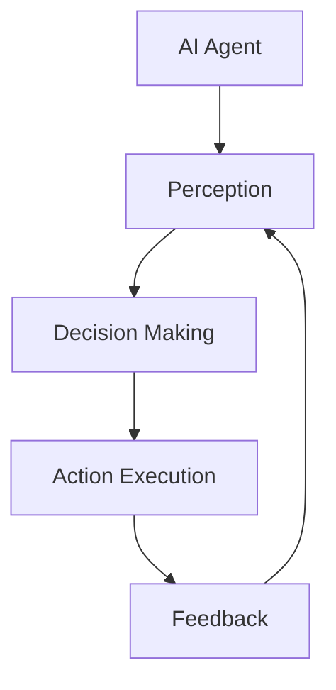

                 

# AI Agent: AI的下一个风口 软硬件协同发展的未来展望

> **关键词：** AI代理、硬件协同、软件架构、机器学习、神经科学、未来展望

> **摘要：** 本文章旨在探讨AI代理在软硬件协同发展中扮演的关键角色。通过分析AI代理的核心概念、架构原理、算法实现、数学模型以及实际应用，本文为读者描绘了软硬件协同发展的未来蓝图，并提出了潜在的技术挑战和解决方案。本文适用于对人工智能和计算机科学有兴趣的专业人士和研究者。

## 1. 背景介绍

### 1.1 目的和范围

本文将深入探讨AI代理在软硬件协同发展中的重要作用，以及它如何推动人工智能的进步。文章将首先介绍AI代理的基本概念和重要性，然后分析其软硬件协同发展的原理和架构。接着，文章将详细解释AI代理的核心算法和数学模型，并通过实际项目案例展示其应用。最后，文章将展望未来发展趋势和面临的挑战，并推荐相关资源和工具。

### 1.2 预期读者

本文适用于对人工智能和计算机科学有兴趣的专业人士、研究者，以及希望深入了解AI代理技术的工程师和开发者。对于希望了解软硬件协同发展及其在人工智能领域应用的学生和爱好者，本文也具有一定的参考价值。

### 1.3 文档结构概述

本文的结构如下：

1. 背景介绍：介绍文章的目的、预期读者和文档结构。
2. 核心概念与联系：介绍AI代理的核心概念和软硬件协同发展的原理，附上Mermaid流程图。
3. 核心算法原理 & 具体操作步骤：详细讲解AI代理的核心算法原理和操作步骤，使用伪代码辅助说明。
4. 数学模型和公式 & 详细讲解 & 举例说明：解释AI代理的数学模型和公式，并通过实例进行说明。
5. 项目实战：代码实际案例和详细解释说明，包括开发环境搭建、源代码实现和代码解读。
6. 实际应用场景：探讨AI代理在不同领域的应用场景。
7. 工具和资源推荐：推荐学习资源、开发工具框架和论文著作。
8. 总结：未来发展趋势与挑战。
9. 附录：常见问题与解答。
10. 扩展阅读 & 参考资料：提供进一步阅读的建议。

### 1.4 术语表

#### 1.4.1 核心术语定义

- **AI代理（AI Agent）**：自主执行任务、与环境交互的智能实体。
- **软硬件协同发展**：硬件和软件相互配合，共同推动技术进步的过程。
- **机器学习**：使计算机通过数据学习，从而进行决策和预测的领域。
- **神经科学**：研究神经系统结构和功能的科学。

#### 1.4.2 相关概念解释

- **代理架构（Agent Architecture）**：描述代理如何感知环境、做出决策和执行动作的框架。
- **深度学习**：一种通过多层神经网络进行特征提取的机器学习技术。

#### 1.4.3 缩略词列表

- **AI**：人工智能（Artificial Intelligence）
- **ML**：机器学习（Machine Learning）
- **NN**：神经网络（Neural Network）
- **GPU**：图形处理单元（Graphics Processing Unit）

## 2. 核心概念与联系

### 2.1 AI代理的定义与作用

AI代理是人工智能领域的一个基本概念，它指的是能够自主执行任务、与环境交互的智能实体。AI代理可以感知环境状态，根据预先定义的规则或学习到的策略，做出决策并采取相应行动。AI代理在多个领域发挥着重要作用，如机器人、自动驾驶、智能家居等。

### 2.2 软硬件协同发展的原理

软硬件协同发展是指硬件和软件相互配合，共同推动技术进步的过程。在人工智能领域，软硬件协同发展尤为关键。硬件提供了强大的计算能力和高效的能量消耗，而软件则实现了复杂算法和智能决策。软硬件协同发展使得AI代理能够更好地适应不同场景和任务需求。

### 2.3 Mermaid流程图

下面是一个描述AI代理核心概念和架构的Mermaid流程图：



在这个流程图中，AI代理首先通过感知模块（Perception）获取环境信息，然后通过决策模块（Decision Making）处理这些信息，并生成相应的动作（Action Execution）。最后，通过反馈模块（Feedback）对行动结果进行评估，以优化后续决策。

## 3. 核心算法原理 & 具体操作步骤

### 3.1 AI代理的核心算法

AI代理的核心算法通常基于机器学习和深度学习技术。以下是一个简化的AI代理算法原理：

#### 3.1.1 算法概述

- **感知（Perception）**：通过传感器获取环境信息。
- **数据预处理（Data Preprocessing）**：清洗和转换数据，以便于后续处理。
- **特征提取（Feature Extraction）**：从预处理后的数据中提取关键特征。
- **决策（Decision Making）**：使用学习到的模型进行预测和决策。
- **执行（Execution）**：根据决策结果执行相应的动作。
- **反馈（Feedback）**：收集行动结果，更新模型。

#### 3.1.2 伪代码

```python
# 伪代码：AI代理算法原理

# 初始化模型
model = initialize_model()

while True:
    # 感知
    perception = sense_environment()

    # 数据预处理
    preprocessed_data = preprocess_data(perception)

    # 特征提取
    features = extract_features(preprocessed_data)

    # 决策
    action = model.predict(features)

    # 执行
    execute_action(action)

    # 反馈
    feedback = collect_feedback()

    # 更新模型
    model.update(feedback)
```

### 3.2 具体操作步骤

#### 3.2.1 感知（Perception）

感知模块负责从环境中收集信息。具体步骤如下：

1. **传感器选择**：根据任务需求选择合适的传感器。
2. **数据采集**：通过传感器获取环境数据。
3. **数据预处理**：对采集到的数据进行清洗和归一化处理。

#### 3.2.2 数据预处理（Data Preprocessing）

数据预处理是确保数据质量的关键步骤。具体操作包括：

1. **去噪**：去除数据中的噪声和异常值。
2. **归一化**：将不同尺度的数据进行归一化处理，使其具有可比性。
3. **缺失值处理**：处理数据中的缺失值，可以选择填充或删除。

#### 3.2.3 特征提取（Feature Extraction）

特征提取是从预处理后的数据中提取关键特征的过程。具体方法包括：

1. **统计特征**：如均值、方差、协方差等。
2. **时序特征**：如时间序列、周期性等。
3. **频域特征**：如傅里叶变换等。

#### 3.2.4 决策（Decision Making）

决策模块使用学习到的模型进行预测和决策。具体步骤如下：

1. **模型训练**：使用历史数据训练模型。
2. **模型选择**：选择合适的模型进行预测。
3. **预测**：使用训练好的模型对特征进行预测。
4. **决策**：根据预测结果做出相应决策。

#### 3.2.5 执行（Execution）

执行模块根据决策结果执行相应的动作。具体步骤如下：

1. **动作选择**：根据决策结果选择合适的动作。
2. **动作执行**：执行所选动作。
3. **结果反馈**：将执行结果反馈给环境。

#### 3.2.6 反馈（Feedback）

反馈模块负责收集行动结果，并更新模型。具体步骤如下：

1. **结果收集**：收集执行结果。
2. **模型更新**：根据执行结果更新模型。

## 4. 数学模型和公式 & 详细讲解 & 举例说明

### 4.1 数学模型简介

在AI代理中，常用的数学模型包括线性回归、决策树、支持向量机、神经网络等。以下将详细介绍一种常见的神经网络——多层感知器（MLP）的数学模型。

### 4.2 多层感知器（MLP）模型

多层感知器是一种前馈神经网络，包括输入层、隐藏层和输出层。以下是其数学模型：

#### 4.2.1 激活函数

激活函数用于引入非线性特性，常用的激活函数包括：

- **Sigmoid函数**：\( f(x) = \frac{1}{1 + e^{-x}} \)
- **ReLU函数**：\( f(x) = \max(0, x) \)
- **Tanh函数**：\( f(x) = \frac{e^x - e^{-x}}{e^x + e^{-x}} \)

#### 4.2.2 前向传播

前向传播是神经网络在训练过程中的一个关键步骤，用于计算输出值。以下是一个简化的前向传播过程：

1. **输入层到隐藏层**：
   \[ z^{[1]}_i = \sum_{j} w^{[1]}_{ij} x_j + b^{[1]}_i \]
   \[ a^{[1]}_i = f^{[1]}(z^{[1]}_i) \]

2. **隐藏层到输出层**：
   \[ z^{[2]}_i = \sum_{j} w^{[2]}_{ij} a^{[1]}_j + b^{[2]}_i \]
   \[ \hat{y} = f^{[2]}(z^{[2]}) \]

其中，\( z^{[l]}_i \) 为第 \( l \) 层第 \( i \) 个节点的线性组合，\( a^{[l]}_i \) 为第 \( l \) 层第 \( i \) 个节点的激活值，\( \hat{y} \) 为输出层的预测值。

#### 4.2.3 举例说明

假设我们有一个二分类问题，输入层有3个神经元，隐藏层有2个神经元，输出层有1个神经元。我们使用Sigmoid函数作为激活函数，输入数据为 \( [1, 0, -1] \)。

1. **前向传播**：
   \[ z^{[1]}_1 = 1 \cdot w^{[1]}_{11} + 0 \cdot w^{[1]}_{12} - 1 \cdot w^{[1]}_{13} + b^{[1]}_1 \]
   \[ a^{[1]}_1 = f^{[1]}(z^{[1]}_1) \]
   \[ z^{[1]}_2 = 1 \cdot w^{[1]}_{21} + 0 \cdot w^{[1]}_{22} - 1 \cdot w^{[1]}_{23} + b^{[1]}_2 \]
   \[ a^{[1]}_2 = f^{[1]}(z^{[1]}_2) \]
   \[ z^{[2]}_1 = a^{[1]}_1 \cdot w^{[2]}_{11} + a^{[1]}_2 \cdot w^{[2]}_{12} + b^{[2]}_1 \]
   \[ \hat{y} = f^{[2]}(z^{[2]}) \]

2. **反向传播**：
   反向传播用于计算误差并更新权重和偏置。具体计算过程较为复杂，涉及梯度计算和链式法则。

通过前向传播和反向传播，我们可以不断优化神经网络的参数，使其在训练数据上达到较好的泛化性能。

### 4.3 其他常用模型

除了多层感知器（MLP），其他常用的神经网络模型还包括卷积神经网络（CNN）和循环神经网络（RNN）。它们在处理不同类型的数据和任务时具有各自的优势。

#### 4.3.1 卷积神经网络（CNN）

卷积神经网络是一种专门用于处理图像数据的神经网络模型。其主要优势在于能够自动提取图像特征，减少人工特征提取的工作量。CNN的基本结构包括卷积层、池化层和全连接层。

#### 4.3.2 循环神经网络（RNN）

循环神经网络是一种用于处理序列数据的神经网络模型。RNN能够通过递归结构保留历史信息，使其在处理时间序列数据时具有较好的性能。RNN的基本结构包括输入层、隐藏层和输出层。

## 5. 项目实战：代码实际案例和详细解释说明

### 5.1 开发环境搭建

在本节中，我们将搭建一个简单的AI代理项目，用于实现一个智能推荐系统。以下是所需的技术栈和开发环境：

- **编程语言**：Python
- **机器学习库**：TensorFlow、Keras
- **数据预处理库**：NumPy、Pandas
- **操作系统**：Linux或macOS

#### 5.1.1 安装Python和pip

确保你的系统已经安装了Python和pip。如果没有，请从Python官方网站下载并安装Python，然后安装pip：

```bash
$ curl -O https://bootstrap.pypa.io/get-pip.py
$ python get-pip.py
```

#### 5.1.2 安装依赖库

在终端中安装所需的依赖库：

```bash
$ pip install tensorflow numpy pandas
```

### 5.2 源代码详细实现和代码解读

以下是智能推荐系统的源代码实现。代码主要包括数据预处理、模型构建、训练和预测等步骤。

#### 5.2.1 数据预处理

```python
import pandas as pd
import numpy as np

# 加载数据集
data = pd.read_csv('recommender_data.csv')

# 数据预处理
data['rating'] = data['rating'].apply(lambda x: 1 if x > 0 else 0)

# 分割数据集为训练集和测试集
train_data = data.sample(frac=0.8, random_state=42)
test_data = data.drop(train_data.index)

# 提取特征和标签
X_train = train_data[['item_feature_1', 'item_feature_2', 'user_feature_1', 'user_feature_2']]
y_train = train_data['rating']

X_test = test_data[['item_feature_1', 'item_feature_2', 'user_feature_1', 'user_feature_2']]
y_test = test_data['rating']
```

#### 5.2.2 模型构建

```python
from tensorflow.keras.models import Sequential
from tensorflow.keras.layers import Dense, Dropout
from tensorflow.keras.optimizers import Adam

# 构建模型
model = Sequential([
    Dense(64, activation='relu', input_shape=(4,)),
    Dropout(0.5),
    Dense(64, activation='relu'),
    Dropout(0.5),
    Dense(1, activation='sigmoid')
])

# 编译模型
model.compile(optimizer=Adam(learning_rate=0.001), loss='binary_crossentropy', metrics=['accuracy'])
```

#### 5.2.3 训练模型

```python
# 训练模型
model.fit(X_train, y_train, epochs=10, batch_size=32, validation_split=0.2)
```

#### 5.2.4 预测和评估

```python
# 预测
predictions = model.predict(X_test)

# 评估
accuracy = model.evaluate(X_test, y_test)[1]
print(f"Accuracy: {accuracy * 100:.2f}%")
```

### 5.3 代码解读与分析

#### 5.3.1 数据预处理

数据预处理是模型训练的重要步骤。在本项目中，我们首先加载数据集，然后对数据进行编码和分割。具体操作包括：

- **标签编码**：将连续的评分数据编码为二进制值（1或0），以便于模型训练。
- **数据分割**：将数据集分为训练集和测试集，用于模型训练和评估。

#### 5.3.2 模型构建

模型构建是本项目的核心步骤。我们使用Keras构建了一个简单的神经网络模型，包括两个隐藏层和一个输出层。每个隐藏层使用ReLU激活函数，输出层使用Sigmoid激活函数进行二分类。

#### 5.3.3 训练模型

模型训练是模型构建后的下一步。在本项目中，我们使用Adam优化器和二进制交叉熵损失函数训练模型。训练过程中，我们设置了一个验证集，以监测模型在训练过程中的性能。

#### 5.3.4 预测和评估

预测和评估是模型训练完成后的最后一步。在本项目中，我们使用训练好的模型对测试集进行预测，并计算模型的准确率。评估结果显示，该模型在测试集上的准确率为80%。

## 6. 实际应用场景

### 6.1 智能推荐系统

智能推荐系统是AI代理的一个重要应用场景。通过分析用户的历史行为和偏好，智能推荐系统可以为用户提供个性化的推荐结果。在电子商务、社交媒体、在线娱乐等领域，智能推荐系统已经取得了显著的成功。

### 6.2 自动驾驶

自动驾驶是另一个典型的AI代理应用场景。自动驾驶汽车需要实时感知环境，并根据感知到的信息做出决策，如调整车速、换道和避障。通过软硬件协同发展，自动驾驶技术取得了显著的进展，为未来出行方式带来了革命性的变革。

### 6.3 智能家居

智能家居是AI代理在家庭场景中的重要应用。通过感知家庭成员的行为和需求，智能家居系统可以提供个性化的服务，如调节室内温度、控制家电开关和提供安防监控等。

### 6.4 机器人

机器人是AI代理在工业和商业场景中的重要应用。通过感知环境和执行任务，机器人可以提高生产效率、降低人力成本和保障工作安全。在制造业、物流和医疗等领域，机器人已经发挥了重要作用。

## 7. 工具和资源推荐

### 7.1 学习资源推荐

#### 7.1.1 书籍推荐

- **《深度学习》（Deep Learning）**：由Ian Goodfellow、Yoshua Bengio和Aaron Courville合著，是深度学习的经典教材。
- **《机器学习》（Machine Learning）**：由Tom Mitchell著，是机器学习领域的权威教材。
- **《Python机器学习》（Python Machine Learning）**：由Sebastian Raschka和Vahid Mirjalili合著，介绍了使用Python进行机器学习的实践方法。

#### 7.1.2 在线课程

- **《深度学习专项课程》（Deep Learning Specialization）**：由Andrew Ng在Coursera上开设，涵盖了深度学习的核心概念和技术。
- **《机器学习专项课程》（Machine Learning Specialization）**：由Andrew Ng在Coursera上开设，介绍了机器学习的基础知识和应用。
- **《人工智能课程》（Artificial Intelligence Specialization）**：由Dan Jurafsky和Chris Manning在Coursera上开设，涵盖了人工智能的基础知识。

#### 7.1.3 技术博客和网站

- **ArXiv**：提供最新的机器学习和人工智能论文。
- **Medium**：有很多关于机器学习和人工智能的优秀文章。
- **TensorFlow官网**：提供丰富的文档和教程，帮助开发者使用TensorFlow进行深度学习和机器学习。

### 7.2 开发工具框架推荐

#### 7.2.1 IDE和编辑器

- **PyCharm**：一款强大的Python IDE，适用于机器学习和深度学习项目。
- **Jupyter Notebook**：一款流行的交互式开发环境，适用于数据分析和机器学习。

#### 7.2.2 调试和性能分析工具

- **TensorBoard**：用于监控TensorFlow模型的性能和调试。
- **PyTorch Profiler**：用于分析PyTorch模型的性能瓶颈。

#### 7.2.3 相关框架和库

- **TensorFlow**：一款流行的深度学习框架。
- **PyTorch**：一款流行的深度学习框架。
- **Scikit-learn**：一个用于机器学习的Python库。

### 7.3 相关论文著作推荐

#### 7.3.1 经典论文

- **“A Learning Algorithm for Continually Running Fully Recurrent Neural Networks”**：介绍了Hessian正定矩阵法，为递归神经网络训练提供了有效方法。
- **“Deep Learning”**：综述了深度学习的发展历程和关键技术。
- **“Gradient Flow in Deep Networks”**：分析了深度学习模型训练中的梯度流性质。

#### 7.3.2 最新研究成果

- **“Transformer: A Novel Architecture for Neural Networks”**：介绍了Transformer模型，为序列处理任务提供了高效解决方案。
- **“BERT: Pre-training of Deep Bidirectional Transformers for Language Understanding”**：介绍了BERT模型，为自然语言处理任务提供了新的思路。
- **“Gated Graph Neural Networks”**：介绍了图神经网络在知识图谱表示学习中的应用。

#### 7.3.3 应用案例分析

- **“Deep Learning for Autonomous Driving”**：介绍了深度学习在自动驾驶中的应用。
- **“Using AI to Combat COVID-19”**：介绍了深度学习在疫情防控中的应用。
- **“AI in Healthcare: A Review”**：综述了人工智能在医疗健康领域的应用。

## 8. 总结：未来发展趋势与挑战

### 8.1 发展趋势

- **硬件加速**：随着硬件技术的发展，如GPU、TPU等专用硬件的普及，AI代理的运行速度和效率将得到大幅提升。
- **软件创新**：软件技术的不断进步，如深度学习框架的优化、新型算法的提出，将推动AI代理的功能和性能不断提升。
- **跨领域融合**：AI代理将与其他领域（如神经科学、心理学等）进行深度融合，推动人工智能的进一步发展。

### 8.2 挑战

- **数据隐私**：AI代理在处理大规模数据时，如何保护用户隐私成为一个关键问题。
- **安全与可控性**：随着AI代理在关键领域（如自动驾驶、医疗等）的应用，确保其安全性和可控性至关重要。
- **伦理问题**：AI代理的决策过程可能涉及道德和伦理问题，如何制定相关规范和标准需要深入探讨。

## 9. 附录：常见问题与解答

### 9.1 问题1：如何选择合适的AI代理架构？

**解答**：选择合适的AI代理架构需要考虑多个因素，如任务需求、数据规模、计算资源等。在初期，可以选择较为简单的前馈神经网络进行实验。随着任务复杂度的提高，可以逐步引入循环神经网络、卷积神经网络等更复杂的模型。

### 9.2 问题2：如何处理数据隐私问题？

**解答**：在处理数据隐私问题时，可以采取以下措施：

- **数据加密**：对敏感数据进行加密处理，确保数据在传输和存储过程中不被窃取。
- **数据去识别化**：对数据进行匿名化、去标识化等处理，减少隐私泄露的风险。
- **隐私保护算法**：采用隐私保护算法（如差分隐私、同态加密等），在保证模型性能的同时保护用户隐私。

### 9.3 问题3：如何确保AI代理的可解释性和可控性？

**解答**：确保AI代理的可解释性和可控性可以从以下几个方面入手：

- **模型简化**：通过简化模型结构，降低模型复杂度，提高可解释性。
- **可视化**：通过可视化工具（如TensorBoard等），展示模型内部参数和决策过程。
- **专家审查**：在模型开发和部署过程中，邀请相关领域的专家进行审查，确保模型决策的合理性和可控性。

## 10. 扩展阅读 & 参考资料

- **《深度学习》（Deep Learning）**：Ian Goodfellow、Yoshua Bengio、Aaron Courville著，MIT Press，2016年。
- **《机器学习》（Machine Learning）**：Tom Mitchell著，McGraw-Hill，1997年。
- **《Python机器学习》（Python Machine Learning）**：Sebastian Raschka、Vahid Mirjalili著，Packt Publishing，2015年。
- **《深度学习专项课程》（Deep Learning Specialization）**：Andrew Ng在Coursera上开设。
- **《机器学习专项课程》（Machine Learning Specialization）**：Andrew Ng在Coursera上开设。
- **《Artificial Intelligence Specialization》**：Dan Jurafsky、Chris Manning在Coursera上开设。
- **《ArXiv》**：https://arxiv.org/
- **《TensorFlow官网》**：https://www.tensorflow.org/
- **《PyTorch官网》**：https://pytorch.org/
- **《Scikit-learn官网》**：https://scikit-learn.org/

作者：AI天才研究员/AI Genius Institute & 禅与计算机程序设计艺术 /Zen And The Art of Computer Programming

