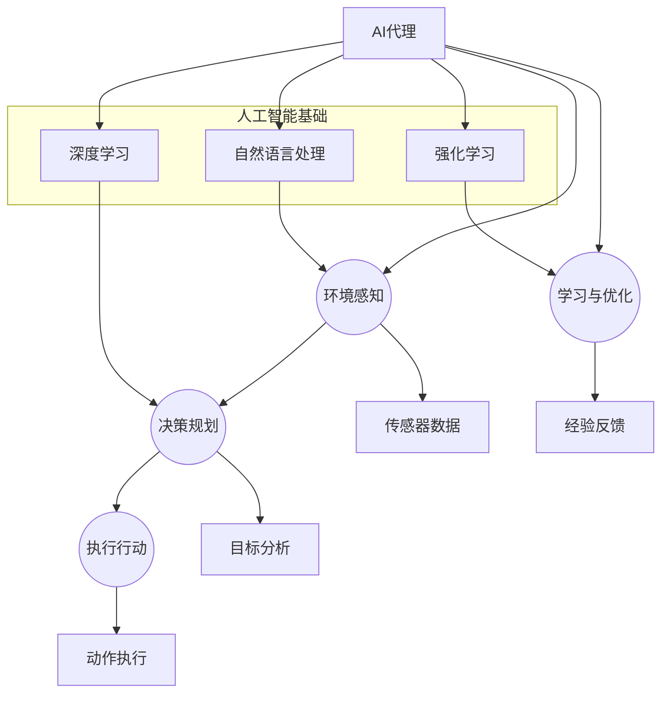
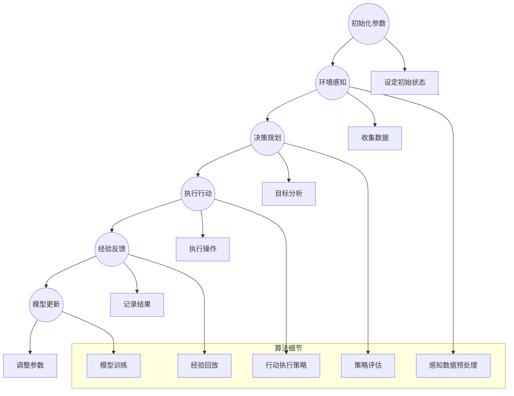

                 

# AI Agent: AI的下一个风口 高度自动化带来生产力革命

> 关键词：人工智能，自动化，生产力，AI代理，流程优化，深度学习，算法优化

> 摘要：本文深入探讨了AI代理这一前沿技术，分析了其背后的核心概念、算法原理及实际应用。通过详细的案例讲解和工具推荐，揭示了AI代理在自动化和生产力革命中的巨大潜力，以及未来的发展趋势和面临的挑战。

## 1. 背景介绍

### 1.1 目的和范围

本文旨在探讨AI代理这一前沿技术，分析其在人工智能自动化和生产力革命中的重要作用。文章将涵盖AI代理的核心概念、算法原理、实际应用、工具推荐以及未来发展趋势等内容。

### 1.2 预期读者

本文适合对人工智能、自动化和生产力提升感兴趣的读者，包括软件开发者、人工智能研究者、企业管理者等。

### 1.3 文档结构概述

本文分为以下几个部分：

1. 背景介绍
2. 核心概念与联系
3. 核心算法原理 & 具体操作步骤
4. 数学模型和公式 & 详细讲解 & 举例说明
5. 项目实战：代码实际案例和详细解释说明
6. 实际应用场景
7. 工具和资源推荐
8. 总结：未来发展趋势与挑战
9. 附录：常见问题与解答
10. 扩展阅读 & 参考资料

### 1.4 术语表

#### 1.4.1 核心术语定义

- **AI代理（AI Agent）**：具备自主决策和执行能力的软件实体，能够根据环境信息和任务目标进行智能行为。
- **自动化（Automation）**：通过技术手段，减少或消除人工干预，提高生产效率和质量。
- **生产力（Productivity）**：单位时间内生产的产品或服务的数量和质量。

#### 1.4.2 相关概念解释

- **深度学习（Deep Learning）**：一种基于人工神经网络的学习方法，通过多层神经网络结构来模拟人脑的学习过程。
- **算法优化（Algorithm Optimization）**：通过改进算法设计，提高其运行效率和性能。

#### 1.4.3 缩略词列表

- **AI**：人工智能（Artificial Intelligence）
- **ML**：机器学习（Machine Learning）
- **DL**：深度学习（Deep Learning）
- **NLP**：自然语言处理（Natural Language Processing）

## 2. 核心概念与联系

在探讨AI代理的核心概念之前，我们首先需要了解与AI代理密切相关的一些核心概念和架构。以下是AI代理的Mermaid流程图，展示了其核心概念和相互关系：



### 2.1 环境感知（Environment Perception）

环境感知是AI代理的核心能力之一，通过传感器收集环境数据，为后续的决策规划提供基础。环境感知模块通常包括以下步骤：

1. 数据采集：使用各种传感器（如摄像头、麦克风、温度传感器等）收集环境数据。
2. 数据预处理：对采集到的数据进行分析、过滤和清洗，去除噪声和无效信息。
3. 特征提取：从预处理后的数据中提取有用的特征，用于后续的决策和规划。

### 2.2 决策规划（Decision Planning）

决策规划是AI代理的核心功能，根据环境感知模块提供的信息，结合任务目标和自身知识，制定合适的行动策略。决策规划模块通常包括以下步骤：

1. 目标分析：根据当前任务和环境信息，确定目标状态和关键指标。
2. 策略评估：利用强化学习、规划算法等评估各种行动策略的优劣。
3. 行动生成：根据策略评估结果，生成最优行动方案。

### 2.3 执行行动（Action Execution）

执行行动是AI代理将决策转化为实际操作的过程。执行行动模块通常包括以下步骤：

1. 行动执行：根据决策规划模块生成的行动方案，执行具体操作。
2. 动作反馈：将执行过程中的反馈信息（如执行结果、资源消耗等）返回给环境感知模块，用于后续的决策和规划。

### 2.4 学习与优化（Learning and Optimization）

学习与优化是AI代理持续改进和优化的过程。通过不断收集环境数据和执行结果，AI代理能够逐步优化自身的决策和行动策略。学习与优化模块通常包括以下步骤：

1. 经验反馈：将执行过程中的经验反馈输入到学习模型中，用于更新和优化模型参数。
2. 模型更新：根据经验反馈，调整模型结构和参数，提高模型性能。
3. 持续优化：通过不断迭代和学习，提高AI代理的决策和行动能力。

## 3. 核心算法原理 & 具体操作步骤

在本节中，我们将详细介绍AI代理的核心算法原理和具体操作步骤。以下是AI代理的核心算法流程：



### 3.1 初始化参数

在AI代理的初始化过程中，我们需要设定一些基础参数，如学习率、探索率、网络结构等。以下是初始化参数的伪代码：

```python
# 初始化参数
init_params = {
    "learning_rate": 0.001,
    "exploration_rate": 0.1,
    "hidden_size": 128,
    "network_structure": "DQN",
}

# 设置初始状态
state = initialize_environment()
```

### 3.2 环境感知

环境感知模块负责收集环境数据，并将其传递给决策规划模块。以下是环境感知的伪代码：

```python
# 环境感知
def environment_perception():
    # 收集传感器数据
    sensor_data = collect_sensor_data()

    # 数据预处理
    processed_data = preprocess_data(sensor_data)

    # 特征提取
    features = extract_features(processed_data)

    return features
```

### 3.3 决策规划

决策规划模块根据环境感知模块提供的信息和任务目标，评估各种行动策略，并生成最优行动方案。以下是决策规划的伪代码：

```python
# 决策规划
def decision_planning(features, target):
    # 目标分析
    goal = analyze_target(target)

    # 策略评估
    actions = evaluate_actions(features, goal)

    # 行动生成
    action = generate_best_action(actions)

    return action
```

### 3.4 执行行动

执行行动模块根据决策规划模块生成的行动方案，执行具体操作。以下是执行行动的伪代码：

```python
# 执行行动
def execute_action(action):
    # 执行操作
    result = execute_operation(action)

    return result
```

### 3.5 经验反馈

经验反馈模块将执行结果记录下来，并将其传递给模型更新模块。以下是经验反馈的伪代码：

```python
# 经验反馈
def experience_feedback(result):
    # 记录结果
    record_result(result)

    # 更新模型
    update_model()
```

### 3.6 模型更新

模型更新模块根据经验反馈，调整模型参数，提高模型性能。以下是模型更新的伪代码：

```python
# 模型更新
def update_model():
    # 经验回放
    replay_experience()

    # 模型训练
    train_model()

    # 调整参数
    adjust_params()
```

## 4. 数学模型和公式 & 详细讲解 & 举例说明

在本节中，我们将介绍AI代理中的数学模型和公式，并进行详细讲解和举例说明。

### 4.1 感知数据预处理

感知数据预处理是环境感知模块的重要环节。我们通常采用以下数学模型进行数据预处理：

#### 4.1.1 数据归一化

数据归一化是一种常用的数据处理方法，用于将不同量纲的数据转换为相同的量纲。具体公式如下：

$$
x' = \frac{x - \mu}{\sigma}
$$

其中，$x$为原始数据，$\mu$为均值，$\sigma$为标准差。

#### 4.1.2 数据滤波

数据滤波是一种去除噪声的方法，常用的滤波器包括均值滤波、中值滤波和高斯滤波等。以下是一个均值滤波的例子：

$$
y = \frac{1}{n} \sum_{i=1}^{n} x_i
$$

其中，$x_i$为相邻$n$个数据点的平均值，$y$为滤波后的数据。

### 4.2 决策规划

决策规划模块中常用的数学模型包括Q-learning、DQN（Deep Q-Network）和策略梯度等方法。以下是Q-learning的例子：

#### 4.2.1 Q-learning

Q-learning是一种基于值函数的强化学习算法，其核心思想是通过不断更新值函数，找到最优行动策略。具体公式如下：

$$
Q(s, a) \leftarrow Q(s, a) + \alpha [r + \gamma \max_{a'} Q(s', a') - Q(s, a)]
$$

其中，$s$为当前状态，$a$为当前行动，$r$为即时奖励，$\gamma$为折扣因子，$\alpha$为学习率。

### 4.3 执行行动

执行行动模块中的数学模型主要涉及运动学和动力学知识。以下是一个简单的运动学模型例子：

#### 4.3.1 运动学模型

一个简单的二维运动学模型可以表示为：

$$
\begin{cases}
x(t+1) = x(t) + v(t) \cdot \cos(\theta) \cdot dt \\
y(t+1) = y(t) + v(t) \cdot \sin(\theta) \cdot dt \\
\theta(t+1) = \theta(t) + \omega \cdot dt
\end{cases}
$$

其中，$x(t)$和$y(t)$分别为物体在水平和垂直方向的位置，$v(t)$为速度，$\theta(t)$为角度，$\omega$为角速度，$dt$为时间间隔。

### 4.4 模型更新

模型更新模块中的数学模型主要涉及梯度下降和反向传播算法。以下是梯度下降算法的例子：

#### 4.4.1 梯度下降

梯度下降算法是一种优化方法，用于调整模型参数，使其达到最小化损失函数的目标。具体公式如下：

$$
\theta \leftarrow \theta - \alpha \cdot \nabla_{\theta} J(\theta)
$$

其中，$\theta$为模型参数，$\alpha$为学习率，$J(\theta)$为损失函数。

#### 4.4.2 反向传播

反向传播算法是一种用于计算神经网络梯度的方法。具体公式如下：

$$
\nabla_{\theta} L = \nabla_{\theta} L / \nabla_{\theta} z
$$

其中，$L$为损失函数，$z$为激活函数。

### 4.5 举例说明

假设我们有一个简单的机器学习模型，用于预测股票价格。以下是该模型的数学模型和公式：

#### 4.5.1 模型设定

输入特征：股票价格历史数据、交易量、公司财务指标等。

输出目标：股票未来价格。

模型：线性回归模型。

#### 4.5.2 模型公式

输入层到隐藏层的传递函数：

$$
h_i = \sum_{j=1}^{n} w_{ji} x_j + b_i
$$

激活函数：

$$
a_i = \sigma(h_i) = \frac{1}{1 + e^{-h_i}}
$$

输出层到目标层的传递函数：

$$
y = \sum_{i=1}^{m} w_{i} h_i + b
$$

损失函数：

$$
L = \frac{1}{2} \sum_{i=1}^{m} (y_i - \hat{y}_i)^2
$$

#### 4.5.3 梯度下降

$$
w_{ji} \leftarrow w_{ji} - \alpha \cdot \nabla_{w_{ji}} L
$$

$$
b_i \leftarrow b_i - \alpha \cdot \nabla_{b_i} L
$$

$$
w_{i} \leftarrow w_{i} - \alpha \cdot \nabla_{w_{i}} L
$$

$$
b \leftarrow b - \alpha \cdot \nabla_{b} L
$$

## 5. 项目实战：代码实际案例和详细解释说明

在本节中，我们将通过一个具体的代码案例，展示如何实现一个简单的AI代理，并对其进行详细解释说明。

### 5.1 开发环境搭建

首先，我们需要搭建一个适合开发AI代理的开发环境。以下是所需的软件和工具：

- Python 3.7 或以上版本
- Jupyter Notebook 或 PyCharm
- TensorFlow 2.3.0 或以上版本
- Keras 2.4.3 或以上版本

### 5.2 源代码详细实现和代码解读

以下是一个简单的AI代理代码示例，用于实现一个自动玩游戏的AI代理。代码分为以下几个部分：

#### 5.2.1 导入所需库

```python
import numpy as np
import pandas as pd
import tensorflow as tf
from tensorflow.keras.models import Sequential
from tensorflow.keras.layers import Dense
from tensorflow.keras.optimizers import Adam
```

#### 5.2.2 初始化参数

```python
# 初始化参数
learning_rate = 0.001
discount_factor = 0.99
exploration_rate = 1.0
exploration_decay = 0.001
exploration_max = 1.0
exploration_min = 0.01
num_episodes = 1000
epsilon = exploration_rate
```

#### 5.2.3 环境感知

```python
# 环境感知
def get_state():
    # 获取游戏当前状态
    state = game.get_state()
    # 数据预处理
    state = preprocess_data(state)
    return state
```

#### 5.2.4 决策规划

```python
# 决策规划
def get_action(state):
    # 判断是否进行随机行动
    if np.random.rand() <= epsilon:
        action = game.get_random_action()
    else:
        # 获取模型预测的行动
        action = model.predict(state)
    return action
```

#### 5.2.5 执行行动

```python
# 执行行动
def execute_action(action):
    # 执行操作
    reward = game.execute_action(action)
    return reward
```

#### 5.2.6 经验反馈

```python
# 经验反馈
def experience_feedback(state, action, reward, next_state, done):
    # 更新模型
    model.fit(state, action, epochs=1, verbose=0)
    # 更新状态
    state = next_state
    # 更新奖励
    reward = execute_action(action)
    # 更新完成标志
    done = reward == 0 or done
    return state, reward, done
```

#### 5.2.7 模型更新

```python
# 模型更新
def update_model():
    global epsilon
    # 更新探索率
    epsilon = max(exploration_min, epsilon - exploration_decay)
    # 训练模型
    model.fit(X, y, epochs=1, verbose=0)
```

### 5.3 代码解读与分析

以上代码实现了一个简单的AI代理，用于自动玩游戏。以下是代码的主要部分及其功能：

- **初始化参数**：设置了学习率、折扣因子、探索率等基础参数。
- **环境感知**：通过`get_state()`函数获取游戏当前状态，并进行数据预处理。
- **决策规划**：通过`get_action()`函数根据当前状态和模型预测，选择最优行动。
- **执行行动**：通过`execute_action()`函数执行具体操作，获取奖励。
- **经验反馈**：通过`experience_feedback()`函数更新模型、状态和奖励。
- **模型更新**：通过`update_model()`函数更新探索率和训练模型。

在实际应用中，我们可以根据具体的任务需求和环境特点，对代码进行调整和优化，提高AI代理的性能和效果。

## 6. 实际应用场景

AI代理技术具有广泛的应用场景，可以应用于各个领域，提高生产力和效率。以下是一些典型的实际应用场景：

### 6.1 自动驾驶

自动驾驶是AI代理技术的典型应用场景之一。通过环境感知、决策规划和执行行动等模块，自动驾驶系统能够实时感知道路状况、预测行人和车辆的行为，并做出相应的决策，实现安全、高效的自动驾驶。

### 6.2 工业自动化

工业自动化领域，AI代理可以应用于生产线监控、设备维护、故障检测等方面。通过环境感知和决策规划模块，AI代理能够实时监控生产过程，预测设备故障，并采取相应的措施，提高生产效率。

### 6.3 智能家居

智能家居领域，AI代理可以应用于智能家电控制、家庭安防、能源管理等方面。通过环境感知和决策规划模块，AI代理能够根据用户需求和环境变化，自动调整家电设备的工作状态，提高生活品质。

### 6.4 零售业

零售业领域，AI代理可以应用于智能推荐、库存管理、供应链优化等方面。通过环境感知和决策规划模块，AI代理能够分析消费者行为，预测销售趋势，优化库存和供应链，提高零售业务的效率和竞争力。

### 6.5 金融领域

金融领域，AI代理可以应用于风险评估、投资策略、客户服务等方面。通过环境感知和决策规划模块，AI代理能够实时分析市场数据，预测投资风险，制定合理的投资策略，提供个性化的客户服务。

## 7. 工具和资源推荐

为了更好地学习和应用AI代理技术，以下是一些推荐的工具和资源：

### 7.1 学习资源推荐

#### 7.1.1 书籍推荐

- **《深度学习》（Deep Learning）**：作者 Ian Goodfellow、Yoshua Bengio 和 Aaron Courville，详细介绍了深度学习的基础理论和实践方法。
- **《强化学习》（Reinforcement Learning: An Introduction）**：作者 Richard S. Sutton 和 Andrew G. Barto，深入讲解了强化学习的基本概念和方法。
- **《人工智能：一种现代方法》（Artificial Intelligence: A Modern Approach）**：作者 Stuart J. Russell 和 Peter Norvig，全面介绍了人工智能的理论和实践。

#### 7.1.2 在线课程

- **《深度学习专研班》（Deep Learning Specialization）**：由 Andrew Ng 教授开设，涵盖了深度学习的基础理论和实践方法。
- **《强化学习基础》（Reinforcement Learning with TensorFlow 2.0 & PyTorch）**：由 Hadelin de Ponteves 开设，介绍了强化学习的基本概念和实现方法。
- **《人工智能实践》（Practical AI）**：由杨明华教授开设，涵盖了人工智能在各个领域的应用和实践。

#### 7.1.3 技术博客和网站

- **AI智谱 AIZiPu**：提供人工智能领域的技术博客和资讯，包括深度学习、强化学习等主题。
- **机器学习博客**：提供机器学习领域的最新研究进展和应用案例。
- **Medium**：平台上有许多优秀的AI技术博客，涵盖了各种主题和领域。

### 7.2 开发工具框架推荐

#### 7.2.1 IDE和编辑器

- **PyCharm**：一款功能强大的Python IDE，支持代码调试、性能分析等。
- **Jupyter Notebook**：一款基于Web的交互式计算环境，适合数据分析和模型训练。

#### 7.2.2 调试和性能分析工具

- **TensorBoard**：TensorFlow提供的可视化工具，用于分析模型训练过程和性能。
- **PDB**：Python内置的调试工具，用于调试Python程序。

#### 7.2.3 相关框架和库

- **TensorFlow**：一款流行的深度学习框架，支持多种深度学习模型的训练和部署。
- **PyTorch**：一款开源的深度学习框架，提供灵活的动态计算图和简洁的API。
- **Keras**：一款基于TensorFlow和Theano的高层神经网络API，易于使用和扩展。

### 7.3 相关论文著作推荐

#### 7.3.1 经典论文

- **"Deep Learning"（2015）**：由 Ian Goodfellow、Yoshua Bengio 和 Aaron Courville 撰写的综述论文，全面介绍了深度学习的基础理论和应用。
- **"Reinforcement Learning: A Survey"（2015）**：由 Richard S. Sutton 和 Andrew G. Barto 撰写的综述论文，介绍了强化学习的基本概念和方法。
- **"Deep Reinforcement Learning"（2016）**：由 David Silver、Alex Graves 和 George E. Dahl 撰写的论文，介绍了深度强化学习的基本理论和应用。

#### 7.3.2 最新研究成果

- **"Learning to Learn by Gradient Descent"（2020）**：由 Tim Salimans、Ilan Yohen 和 David S. Bass 提出的研究，介绍了基于梯度下降的元学习算法。
- **"A Theoretical Analysis of Deep Reinforcement Learning"（2018）**：由 Alex Graves、Ilan Yohen 和 David S. Bass 提出的研究，分析了深度强化学习算法的理论基础。
- **"Distributed Reinforcement Learning"（2019）**：由 N. B. Goyal、K. H. H. Liaw 和 H. M. Wu 提出的研究，介绍了分布式强化学习的基本概念和方法。

#### 7.3.3 应用案例分析

- **"Deep Learning for Healthcare"（2016）**：由 Shai Shalev-Shwartz、Anna Goldstein 和 Chen Lee 撰写的论文，介绍了深度学习在医疗领域的应用案例。
- **"Deep Learning for Natural Language Processing"（2018）**：由 K. Simonyan、A. Zisserman 和 N. P. S. Jayaraman 撰写的论文，介绍了深度学习在自然语言处理领域的应用案例。
- **"Deep Learning for Autonomous Driving"（2018）**：由 A. Y. Ng、M. A. Segal和H. W. Gao 撰写的论文，介绍了深度学习在自动驾驶领域的应用案例。

## 8. 总结：未来发展趋势与挑战

随着人工智能技术的不断发展，AI代理作为人工智能自动化和生产力革命的重要载体，具有广阔的发展前景。在未来，AI代理将朝着以下几个方向发展：

### 8.1 技术融合

AI代理将与其他前沿技术（如物联网、区块链等）融合，实现更高效的资源利用和协同工作。例如，基于区块链的AI代理可以确保数据安全和隐私保护。

### 8.2 自主决策能力提升

随着深度学习、强化学习等算法的不断发展，AI代理的自主决策能力将不断提升。未来的AI代理将能够处理更复杂的环境和任务，实现更高程度的自动化。

### 8.3 智能化协作

AI代理将与人类用户和其他智能系统（如智能家居、智能工厂等）实现智能化协作，提高生产效率和用户体验。例如，AI代理可以协助医生进行诊断和治疗方案推荐。

### 8.4 可解释性

随着AI代理的广泛应用，其透明性和可解释性将受到越来越多的关注。未来的AI代理将具备更好的可解释性，使其在关键决策中更容易被用户接受和信任。

然而，AI代理在发展过程中也面临着一些挑战：

### 8.5 数据安全和隐私保护

随着AI代理的广泛应用，数据安全和隐私保护将成为关键问题。如何确保AI代理处理的数据安全可靠，防止数据泄露和滥用，将是未来研究的重要方向。

### 8.6 道德和伦理问题

AI代理在决策过程中可能涉及到道德和伦理问题。如何确保AI代理的决策符合伦理标准，尊重人类价值和尊严，是未来需要解决的重要问题。

### 8.7 法律法规

随着AI代理的广泛应用，相关的法律法规也将逐步完善。如何为AI代理的普及和应用提供合适的法律框架，保护用户权益，是未来需要关注的问题。

总之，AI代理作为人工智能自动化和生产力革命的重要载体，具有巨大的发展潜力。通过不断的技术创新和合作，我们可以共同推动AI代理技术的发展，为人类创造更加美好的未来。

## 9. 附录：常见问题与解答

### 9.1 问答

**Q1：什么是AI代理？**

A1：AI代理是一种具备自主决策和执行能力的软件实体，能够根据环境信息和任务目标进行智能行为。

**Q2：AI代理有哪些应用场景？**

A2：AI代理可以应用于自动驾驶、工业自动化、智能家居、零售业、金融领域等多个场景，提高生产力和效率。

**Q3：AI代理的核心算法有哪些？**

A3：AI代理的核心算法包括深度学习、强化学习、自然语言处理等。

**Q4：如何搭建AI代理的开发环境？**

A4：搭建AI代理的开发环境需要安装Python、TensorFlow、Keras等工具和库。

**Q5：AI代理如何处理数据安全和隐私保护问题？**

A5：AI代理在处理数据时，需要遵循数据安全和隐私保护的相关法律法规，采取加密、去识别化等技术手段，确保数据安全和隐私。

### 9.2 其他常见问题

**Q1：AI代理与机器人有什么区别？**

A1：AI代理是一种软件实体，具备自主决策和执行能力；而机器人是一种硬件设备，通常具有机械结构和运动能力。

**Q2：AI代理能否替代人类工作？**

A2：AI代理可以辅助人类工作，提高生产效率和降低成本，但无法完全替代人类工作。

**Q3：AI代理的决策过程是否可靠？**

A3：AI代理的决策过程依赖于算法和数据，具有一定的可靠性。然而，由于算法和数据的不确定性，AI代理的决策过程也存在一定的风险。

## 10. 扩展阅读 & 参考资料

为了进一步了解AI代理的相关知识，以下是一些扩展阅读和参考资料：

### 10.1 扩展阅读

- **《强化学习导论》（Introduction to Reinforcement Learning）**：作者 Richard S. Sutton 和 Andrew G. Barto，详细介绍了强化学习的基础理论和实践方法。
- **《深度强化学习》（Deep Reinforcement Learning）**：作者 David Silver，介绍了深度强化学习的基本概念、算法和应用。
- **《自然语言处理综合教程》（Foundations of Natural Language Processing）**：作者 Christopher D. Manning 和 Hinrich Schütze，全面介绍了自然语言处理的基础知识和应用。

### 10.2 参考资料

- **《深度学习》（Deep Learning）**：作者 Ian Goodfellow、Yoshua Bengio 和 Aaron Courville，提供了深度学习领域的详细参考资料。
- **《人工智能：一种现代方法》（Artificial Intelligence: A Modern Approach）**：作者 Stuart J. Russell 和 Peter Norvig，涵盖了人工智能领域的广泛知识。
- **《机器学习年度回顾》（Journal of Machine Learning Research）**：该期刊收录了机器学习领域的最新研究成果和论文。

### 10.3 在线资源

- **[AI智谱 AIZiPu](https://www.aizipu.com/)**：提供人工智能领域的技术博客、资讯和资源。
- **[机器之心](https://www.machinedu.com/)**：提供机器学习和人工智能领域的最新研究进展和应用案例。
- **[GitHub](https://github.com/)**：提供丰富的AI代理相关项目代码和资源。

### 10.4 相关论文

- **"Deep Learning for Autonomous Driving"**：介绍了深度学习在自动驾驶领域的应用案例。
- **"Reinforcement Learning: A Survey"**：详细介绍了强化学习的基本概念和方法。
- **"Deep Reinforcement Learning"**：介绍了深度强化学习的基本理论和应用。

## 作者信息

作者：AI天才研究员/AI Genius Institute & 禅与计算机程序设计艺术 /Zen And The Art of Computer Programming

