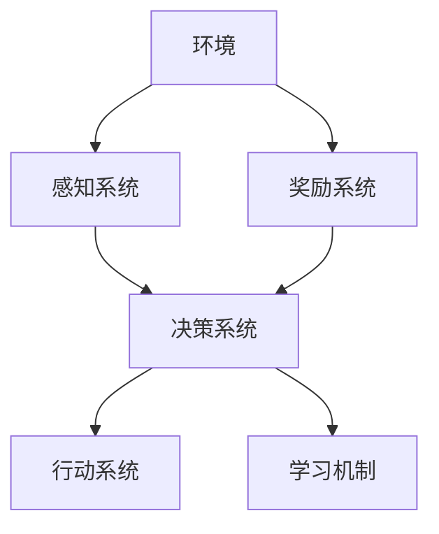

                 

# AI Agent构建的四大要素

> 关键词：AI Agent、构建要素、智能代理、环境交互、自主学习、多智能体系统

> 摘要：本文将深入探讨AI Agent构建的四大要素，包括环境交互、感知、决策和行动。我们将通过一步步的分析，详细阐述这些核心概念，并提供实用的数学模型和项目实战案例，帮助读者理解和掌握构建AI Agent的关键技术。

## 1. 背景介绍

### 1.1 目的和范围

本文旨在为读者提供一份关于AI Agent构建的详细指南。我们将探讨AI Agent构建的四大要素：环境交互、感知、决策和行动。这些要素是构建一个成功的AI Agent系统的基础。本文将覆盖以下内容：

- AI Agent的定义和分类
- 环境交互的基本原理和实现方法
- 感知系统的构建技巧和挑战
- 决策算法的设计和优化
- 行动策略的制定和执行

### 1.2 预期读者

本文适合对人工智能和机器学习有一定了解的读者，包括：

- AI开发者和研究人员
- 机器学习工程师和数据科学家
- 软件工程师和架构师
- 对AI Agent感兴趣的学者和学生

### 1.3 文档结构概述

本文分为十个部分：

1. 背景介绍
   - 1.1 目的和范围
   - 1.2 预期读者
   - 1.3 文档结构概述
   - 1.4 术语表
2. 核心概念与联系
3. 核心算法原理 & 具体操作步骤
4. 数学模型和公式 & 详细讲解 & 举例说明
5. 项目实战：代码实际案例和详细解释说明
6. 实际应用场景
7. 工具和资源推荐
8. 总结：未来发展趋势与挑战
9. 附录：常见问题与解答
10. 扩展阅读 & 参考资料

### 1.4 术语表

#### 1.4.1 核心术语定义

- AI Agent：一种能够感知环境、做出决策并执行行动的人工智能实体。
- 环境：AI Agent交互的实体和情境。
- 感知：AI Agent获取关于环境信息的过程。
- 决策：基于感知信息选择合适的行动的过程。
- 行动：AI Agent对环境施加的实际操作。

#### 1.4.2 相关概念解释

- 强化学习：一种机器学习方法，通过奖励信号引导Agent学习最佳行为策略。
- 监督学习：一种机器学习方法，利用已标注的数据训练模型。
- 无监督学习：一种机器学习方法，模型通过未标注的数据自动发现数据中的规律。

#### 1.4.3 缩略词列表

- AI：人工智能（Artificial Intelligence）
- ML：机器学习（Machine Learning）
- RL：强化学习（Reinforcement Learning）

## 2. 核心概念与联系

为了更好地理解AI Agent的构建过程，我们需要先了解其核心概念和它们之间的联系。以下是一个使用Mermaid绘制的流程图，展示了AI Agent的核心概念和架构：



### 2.1 环境交互

环境是AI Agent操作的场所，它与感知、决策和行动系统紧密相连。环境可以是一个简单的游戏场景，也可以是一个复杂的生产线。为了实现环境交互，我们需要定义以下内容：

- 环境状态：描述环境当前的状态，例如游戏中的棋盘布局、生产线上的物品位置等。
- 环境动作：Agent可以执行的动作，例如在游戏中移动棋子、在生产线上取放物品等。
- 环境反馈：Agent执行动作后环境做出的反应，包括奖励和新的环境状态。

### 2.2 感知系统

感知系统负责将环境状态转换为Agent可理解的信息。它通常包括以下步骤：

1. 数据采集：从环境中收集数据，例如使用摄像头捕获图像、传感器获取温度和湿度等。
2. 数据预处理：对采集到的数据进行清洗、归一化和特征提取，使其适合输入到模型中。
3. 特征表示：将预处理后的数据转换为Agent可处理的特征表示，例如使用卷积神经网络提取图像特征。

### 2.3 决策系统

决策系统基于感知到的环境状态和先前的经验，选择一个最佳的动作。它通常包括以下步骤：

1. 状态评估：对当前环境状态进行评估，判断其是否有利于Agent的目标。
2. 策略选择：根据状态评估结果选择一个最佳的动作策略。
3. 行动选择：根据策略选择一个具体的动作执行。

### 2.4 行动系统

行动系统负责将决策系统选定的动作应用到环境中。它通常包括以下步骤：

1. 动作执行：执行决策系统选定的动作。
2. 环境更新：根据动作执行的结果更新环境状态。
3. 奖励反馈：计算动作执行后获得的奖励，并将其反馈给学习机制。

### 2.5 奖励系统

奖励系统用于指导AI Agent的学习过程。它根据Agent的行为给予正奖励或负奖励，以引导Agent不断优化其行为策略。奖励系统通常包括以下内容：

- 奖励函数：定义如何计算奖励值。
- 奖励机制：根据奖励值调整学习机制，例如增加或减少学习速率。

### 2.6 学习机制

学习机制负责根据奖励系统提供的反馈调整Agent的行为策略。它通常包括以下内容：

- 反向传播：在深度学习模型中，使用反向传播算法计算梯度并更新模型参数。
- 强化学习算法：例如Q-learning、Deep Q-Networks（DQN）等，用于优化Agent的行为策略。

## 3. 核心算法原理 & 具体操作步骤

在了解了AI Agent的核心概念和联系后，接下来我们将讨论核心算法原理和具体操作步骤。

### 3.1 强化学习算法

强化学习是构建AI Agent的核心算法之一。它通过奖励信号引导Agent学习最佳行为策略。以下是强化学习算法的基本原理和具体操作步骤：

#### 3.1.1 基本原理

强化学习算法基于如下假设：

- Agent在环境中采取动作，并根据动作的结果获得奖励。
- Agent根据奖励信号调整其行为策略，以最大化长期累积奖励。

#### 3.1.2 操作步骤

1. 初始化状态（\(S\)）、动作（\(A\)）和奖励（\(R\)）。
2. 从初始状态开始，根据当前状态选择一个动作。
3. 执行选定的动作，并根据动作的结果获得奖励。
4. 根据奖励信号更新Agent的行为策略。
5. 转到下一步，重复上述步骤。

### 3.2 Q-Learning算法

Q-Learning算法是一种基于价值迭代的强化学习算法。它通过更新Q值（状态-动作值函数）来优化Agent的行为策略。以下是Q-Learning算法的具体操作步骤：

#### 3.2.1 基本原理

Q-Learning算法基于以下原理：

- Q值表示在给定状态下执行特定动作的期望奖励。
- 通过更新Q值，逐步优化Agent的行为策略。

#### 3.2.2 操作步骤

1. 初始化Q值表（\(Q(S, A)\)）。
2. 从初始状态开始，选择一个动作。
3. 执行选定的动作，并根据动作的结果获得奖励。
4. 根据奖励信号更新Q值表：
   $$ Q(S, A) = Q(S, A) + \alpha [R + \gamma \max_{A'} Q(S', A') - Q(S, A)] $$
   其中，\( \alpha \)是学习速率，\( \gamma \)是折扣因子。
5. 转到下一步，重复上述步骤。

### 3.3 Deep Q-Networks（DQN）算法

DQN算法是一种基于深度学习的强化学习算法。它使用神经网络估计Q值，以解决高维状态空间的问题。以下是DQN算法的具体操作步骤：

#### 3.3.1 基本原理

DQN算法基于以下原理：

- 使用神经网络（例如卷积神经网络）作为Q值估计器，以处理高维状态空间。
- 通过经验回放和目标网络稳定化训练过程。

#### 3.3.2 操作步骤

1. 初始化神经网络（\(Q\)网络）和目标神经网络（\(Q'\)网络）。
2. 从初始状态开始，选择一个动作。
3. 执行选定的动作，并根据动作的结果获得奖励。
4. 将当前状态、动作、奖励和下一个状态存储在经验回放记忆中。
5. 随机从经验回放记忆中抽取一批样本。
6. 使用这批样本更新\(Q'\)网络：
   $$ Q'(S', A') = r + \gamma \max_{A'} Q'(S', A') $$
7. 使用梯度下降算法更新\(Q\)网络：
   $$ \nabla Q(S, A) = \frac{\partial L}{\partial Q(S, A)} $$
   其中，\(L\)是损失函数，用于衡量预测Q值和实际Q值之间的差距。
8. 更新目标神经网络：
   $$ Q'(S, A) = \tau Q(S, A) + (1 - \tau) Q'(S, A) $$
   其中，\( \tau \)是目标网络更新率。
9. 转到下一步，重复上述步骤。

## 4. 数学模型和公式 & 详细讲解 & 举例说明

在了解了强化学习算法的原理和操作步骤后，我们将进一步探讨相关数学模型和公式，并给出具体的例子来说明如何使用这些模型和公式。

### 4.1 Q值（状态-动作值函数）

Q值（状态-动作值函数）是强化学习算法的核心概念，用于表示在给定状态下执行特定动作的期望奖励。以下是Q值的数学模型和公式：

$$ Q(S, A) = \sum_{s'} P(S' | S, A) \cdot R(S', A) + \gamma \max_{A'} Q(S', A') $$

其中：

- \(Q(S, A)\)：在状态\(S\)下执行动作\(A\)的Q值。
- \(P(S' | S, A)\)：在状态\(S\)下执行动作\(A\)后转移到状态\(S'\)的概率。
- \(R(S', A)\)：在状态\(S'\)下执行动作\(A\)的即时奖励。
- \(\gamma\)：折扣因子，用于平衡短期和长期奖励。
- \(\max_{A'} Q(S', A')\)：在状态\(S'\)下执行所有可能动作\(A'\)的Q值最大值。

#### 4.1.1 例子

假设我们有一个简单的游戏环境，其中Agent的目标是移动到一个目标位置。环境状态由一个二维网格表示，每个位置都有一个对应的奖励值。以下是状态-动作值函数的计算过程：

1. 初始状态：\((0, 0)\)，Q值：\(0\)。
2. 选择动作：向上移动，状态：\((0, -1)\)，Q值：\(0\)。
3. 执行动作：向上移动，获得奖励：\(-1\)，状态：\((0, -1)\)。
4. 更新Q值：
   $$ Q(0, -1) = 0 + \gamma \max_{A'} Q(0, -1) = -1 + 0.9 \cdot 0 = -1 $$
5. 选择动作：向右移动，状态：\((1, -1)\)，Q值：\(0\)。
6. 执行动作：向右移动，获得奖励：\(1\)，状态：\((1, -1)\)。
7. 更新Q值：
   $$ Q(1, -1) = 0 + \gamma \max_{A'} Q(1, -1) = 1 + 0.9 \cdot 0 = 1 $$
8. 选择动作：向下移动，状态：\((0, -2)\)，Q值：\(-1\)。
9. 执行动作：向下移动，获得奖励：\(-1\)，状态：\((0, -2)\)。
10. 更新Q值：
    $$ Q(0, -2) = -1 + \gamma \max_{A'} Q(0, -2) = -1 + 0.9 \cdot 1 = -0.1 $$

### 4.2 Q-Learning算法

Q-Learning算法是一种基于价值迭代的强化学习算法，用于更新Q值（状态-动作值函数）。以下是Q-Learning算法的数学模型和公式：

$$ Q(S, A) = Q(S, A) + \alpha [R + \gamma \max_{A'} Q(S', A') - Q(S, A)] $$

其中：

- \(Q(S, A)\)：在状态\(S\)下执行动作\(A\)的当前Q值。
- \(Q(S', A')\)：在状态\(S'\)下执行动作\(A'\)的当前Q值。
- \(R\)：即时奖励。
- \(\alpha\)：学习速率。
- \(\gamma\)：折扣因子。

#### 4.2.1 例子

假设我们有一个简单的游戏环境，其中Agent的目标是移动到一个目标位置。环境状态由一个二维网格表示，每个位置都有一个对应的奖励值。以下是Q-Learning算法的计算过程：

1. 初始状态：\((0, 0)\)，Q值：\(0\)。
2. 选择动作：向上移动，状态：\((0, -1)\)，Q值：\(0\)。
3. 执行动作：向上移动，获得奖励：\(-1\)，状态：\((0, -1)\)。
4. 更新Q值：
   $$ Q(0, -1) = 0 + \alpha [-1 + \gamma \max_{A'} Q(0, -1)] = 0 + 0.1 [-1 + 0.9 \cdot 0] = -0.1 $$
5. 选择动作：向右移动，状态：\((1, -1)\)，Q值：\(0\)。
6. 执行动作：向右移动，获得奖励：\(1\)，状态：\((1, -1)\)。
7. 更新Q值：
   $$ Q(1, -1) = 0 + \alpha [1 + \gamma \max_{A'} Q(1, -1)] = 0 + 0.1 [1 + 0.9 \cdot 0] = 0.1 $$
8. 选择动作：向下移动，状态：\((0, -2)\)，Q值：\(-0.1\)。
9. 执行动作：向下移动，获得奖励：\(-1\)，状态：\((0, -2)\)。
10. 更新Q值：
    $$ Q(0, -2) = -0.1 + \alpha [-1 + \gamma \max_{A'} Q(0, -2)] = -0.1 + 0.1 [-1 + 0.9 \cdot 0] = -0.2 $$

### 4.3 Deep Q-Networks（DQN）算法

DQN算法是一种基于深度学习的强化学习算法，用于估计Q值（状态-动作值函数）。以下是DQN算法的数学模型和公式：

$$ Q'(S', A') = r + \gamma \max_{A'} Q(S', A') $$

$$ \nabla Q(S, A) = \frac{\partial L}{\partial Q(S, A)} $$

$$ Q'(S, A) = \tau Q(S, A) + (1 - \tau) Q'(S, A) $$

其中：

- \(Q'(S', A')\)：在状态\(S'\)下执行动作\(A'\)的目标Q值。
- \(L\)：损失函数，用于衡量预测Q值和实际Q值之间的差距。
- \(\tau\)：目标网络更新率。

#### 4.3.1 例子

假设我们有一个简单的游戏环境，其中Agent的目标是移动到一个目标位置。环境状态由一个二维网格表示，每个位置都有一个对应的奖励值。以下是DQN算法的计算过程：

1. 初始化神经网络（\(Q\)网络）和目标神经网络（\(Q'\)网络）。
2. 从初始状态开始，选择一个动作。
3. 执行选定的动作，并根据动作的结果获得奖励。
4. 将当前状态、动作、奖励和下一个状态存储在经验回放记忆中。
5. 随机从经验回放记忆中抽取一批样本。
6. 使用这批样本更新目标神经网络：
   $$ Q'(S', A') = r + \gamma \max_{A'} Q'(S', A') = -1 + 0.9 \cdot 0 = -1 $$
7. 使用梯度下降算法更新神经网络：
   $$ \nabla Q(S, A) = \frac{\partial L}{\partial Q(S, A)} = \frac{\partial (Q(S, A) - Q'(S', A'))^2}{\partial Q(S, A)} = 2(Q(S, A) - Q'(S', A')) $$
   $$ Q(S, A) = Q(S, A) - \alpha \nabla Q(S, A) = 0 - 0.1 \cdot 2 = -0.2 $$
8. 更新目标神经网络：
   $$ Q'(S, A) = \tau Q(S, A) + (1 - \tau) Q'(S, A) = 0.1 \cdot -0.2 + (1 - 0.1) \cdot -1 = -0.02 - 0.9 = -0.92 $$

## 5. 项目实战：代码实际案例和详细解释说明

为了更好地理解AI Agent的构建过程，我们将通过一个简单的项目实战来演示相关算法的实现。本节将介绍如何搭建开发环境、实现核心算法，并对源代码进行详细解读。

### 5.1 开发环境搭建

在开始项目实战之前，我们需要搭建一个开发环境。以下是搭建开发环境所需的步骤：

1. 安装Python 3.8或更高版本。
2. 安装Anaconda，以便轻松管理Python环境和包。
3. 创建一个名为`ai_agent_project`的Anaconda环境，并安装以下依赖项：

   ```bash
   conda create -n ai_agent_project python=3.8
   conda activate ai_agent_project
   conda install numpy matplotlib gym
   ```

4. 安装TensorFlow 2.5或更高版本（可选）：

   ```bash
   conda install tensorflow
   ```

### 5.2 源代码详细实现和代码解读

下面是一个简单的AI Agent项目，实现了Q-Learning算法，用于解决经典的“井字棋”（Tic-Tac-Toe）游戏。我们将对项目的关键部分进行详细解读。

#### 5.2.1 项目结构

项目结构如下：

```bash
ai_agent_project/
|-- ai_agent/
|   |-- __init__.py
|   |-- agent.py
|   |-- environment.py
|-- main.py
|-- requirements.txt
|-- README.md
```

#### 5.2.2 代码解读

1. **环境搭建**：`requirements.txt`文件用于管理项目的依赖项。`main.py`是项目的入口文件，用于运行AI Agent。`ai_agent`目录包含AI Agent的核心代码，包括感知系统（`environment.py`）和决策系统（`agent.py`）。

2. **环境类（`environment.py`）**：

   ```python
   import numpy as np
   from IPython.display import clear_output
   
   class TicTacToeEnv():
       def __init__(self):
           self.board = np.zeros((3, 3), dtype=int)
           self.player = 1  # 玩家1使用1，玩家2使用-1
           self.opponent = -1
           self.done = False
           self.reward = 0
   
       def reset(self):
           self.board = np.zeros((3, 3), dtype=int)
           self.player = 1
           self.opponent = -1
           self.done = False
           self.reward = 0
           return self.board

       def step(self, action):
           if self.done:
               return self.board, self.reward, self.done

           if 0 <= action <= 8:
               row = action // 3
               col = action % 3
               if self.board[row, col] == 0:
                   self.board[row, col] = self.player
                   self.reward = self.evaluate()
                   if self.reward != 0:
                       self.done = True
                   if self.reward == 1:
                       self.player, self.opponent = self.opponent, self.player
                   return self.board, self.reward, self.done
           else:
               return self.board, -1, False

       def render(self):
           clear_output(wait=True)
           for row in self.board:
               print(" | ".join(str(x) for x in row))
               print("-"*5)

       def evaluate(self):
           for i in range(3):
               if np.sum(self.board[i, :]) == 3:
                   return 1
               if np.sum(self.board[i, :]) == -3:
                   return -1
           for j in range(3):
               if np.sum(self.board[:, j]) == 3:
                   return 1
               if np.sum(self.board[:, j]) == -3:
                   return -1
           if np.sum(np.diag(self.board)) == 3:
               return 1
           if np.sum(np.diag(self.board)) == -3:
               return -1
           if np.sum(np.diag(np.fliplr(self.board))) == 3:
               return 1
           if np.sum(np.diag(np.fliplr(self.board))) == -3:
               return -1
           return 0
   ```

   **解读**：

   - `TicTacToeEnv`类定义了一个井字棋游戏环境。它包含一个3x3的棋盘、玩家的标记、游戏状态和奖励。
   - `reset`方法用于重置游戏状态。
   - `step`方法用于执行玩家的动作，并返回新的棋盘、奖励和游戏状态。
   - `render`方法用于显示当前棋盘状态。
   - `evaluate`方法用于计算玩家的奖励。

3. **AI Agent（`agent.py`）**：

   ```python
   import numpy as np
   import random

   class QLearningAgent():
       def __init__(self, learning_rate=0.1, discount_factor=0.9, exploration_rate=1.0):
           self.learning_rate = learning_rate
           self.discount_factor = discount_factor
           self.exploration_rate = exploration_rate
           self.exploration_decay = 0.001
           self.q_table = {}

       def get_action(self, state):
           if random.uniform(0, 1) < self.exploration_rate:
               action = random.choice(list(self.q_table[state].keys()))
           else:
               action = max(self.q_table[state], key=self.q_table[state].get)
           return action

       def update_q_table(self, state, action, reward, next_state, done):
           if not done:
               max_future_q = max(self.q_table[next_state], key=self.q_table[next_state].get)
           else:
               max_future_q = 0

           current_q = self.q_table[state][action]
           new_q = (1 - self.learning_rate) * current_q + self.learning_rate * (reward + self.discount_factor * max_future_q)
           self.q_table[state][action] = new_q

           if self.exploration_rate > 0.01:
               self.exploration_rate -= self.exploration_decay

       def save_q_table(self):
           with open('q_table.pkl', 'wb') as f:
               pickle.dump(self.q_table, f)

       def load_q_table(self):
           with open('q_table.pkl', 'rb') as f:
               self.q_table = pickle.load(f)
   ```

   **解读**：

   - `QLearningAgent`类定义了一个Q-Learning AI Agent。它包含Q表、学习速率、折扣因子和探索率。
   - `get_action`方法用于选择最佳动作。
   - `update_q_table`方法用于更新Q表。
   - `save_q_table`和`load_q_table`方法用于保存和加载Q表。

4. **主程序（`main.py`）**：

   ```python
   import numpy as np
   import gym
   import random
   from ai_agent.agent import QLearningAgent
   from ai_agent.environment import TicTacToeEnv

   def train_agent(agent, env, episodes):
       for episode in range(episodes):
           state = env.reset()
           done = False

           while not done:
               action = agent.get_action(state)
               next_state, reward, done = env.step(action)
               agent.update_q_table(state, action, reward, next_state, done)
               state = next_state

           print(f"Episode {episode + 1} finished after {len(env.history)} steps")

       agent.save_q_table()

   def test_agent(agent, env, steps):
       state = env.reset()
       done = False

       for step in range(steps):
           action = max(agent.q_table[state], key=agent.q_table[state].get)
           state, reward, done = env.step(action)
           env.render()

           if done:
               print(f"Test finished after {step + 1} steps with reward {reward}")
               break

   if __name__ == "__main__":
       env = TicTacToeEnv()
       agent = QLearningAgent(learning_rate=0.1, discount_factor=0.9, exploration_rate=1.0)

       # 训练AI Agent
       train_agent(agent, env, episodes=1000)

       # 测试AI Agent
       test_agent(agent, env, steps=100)
   ```

   **解读**：

   - 主程序定义了训练AI Agent和测试AI Agent的函数。
   - `train_agent`函数用于训练AI Agent，通过在环境中执行动作并更新Q表。
   - `test_agent`函数用于测试AI Agent，通过在环境中执行最佳动作并显示棋盘状态。

### 5.3 代码解读与分析

1. **环境类（`environment.py`）**：

   环境类`TicTacToeEnv`实现了井字棋游戏环境的基本功能。它包含一个3x3的棋盘，用于记录玩家的动作。环境的状态由棋盘的状态表示，动作由棋盘上的位置表示。

2. **AI Agent（`agent.py`）**：

   Q-Learning AI Agent通过Q表学习最佳动作策略。它包含`get_action`方法用于选择动作，`update_q_table`方法用于更新Q表。探索率用于平衡探索和利用，以防止陷入局部最优。

3. **主程序（`main.py`）**：

   主程序负责训练AI Agent和测试AI Agent。训练过程通过在环境中执行动作并更新Q表进行。测试过程通过在环境中执行最佳动作并显示棋盘状态进行。

通过以上项目实战，我们了解了如何实现一个简单的AI Agent，并对其关键代码进行了详细解读。这个项目为我们提供了一个良好的起点，以进一步探索AI Agent的构建和应用。

## 6. 实际应用场景

AI Agent在各个领域都有广泛的应用。以下是一些实际应用场景：

### 6.1 游戏领域

在游戏领域，AI Agent可以用于开发智能对手，例如在围棋、国际象棋、扑克等游戏中。通过强化学习和深度学习算法，AI Agent可以不断学习和优化其策略，从而提高游戏的难度和挑战性。

### 6.2 自动驾驶

在自动驾驶领域，AI Agent用于感知环境、做出决策和执行行动。通过传感器和摄像头收集环境数据，AI Agent可以识别道路、行人、车辆等对象，并根据这些信息做出最佳驾驶决策。

### 6.3 机器人控制

在机器人控制领域，AI Agent可以用于控制机器人的行动和决策。通过感知系统和决策系统，AI Agent可以指导机器人在复杂环境中执行各种任务，例如清洁、搬运和探索。

### 6.4 聊天机器人

在聊天机器人领域，AI Agent可以用于构建自然语言处理系统，以实现与用户的智能对话。通过不断学习和优化，AI Agent可以提供更加个性化和智能化的服务。

### 6.5 供应链管理

在供应链管理领域，AI Agent可以用于优化库存管理、需求预测和运输路线规划。通过感知系统和决策系统，AI Agent可以帮助企业提高运营效率，降低成本。

### 6.6 金融交易

在金融交易领域，AI Agent可以用于开发智能交易策略，以实现自动交易。通过分析市场数据和价格走势，AI Agent可以做出最佳买卖决策，从而获得稳定的收益。

## 7. 工具和资源推荐

### 7.1 学习资源推荐

#### 7.1.1 书籍推荐

- 《强化学习：原理与Python实现》（Reinforcement Learning: An Introduction）
- 《深度学习》（Deep Learning）
- 《机器学习》（Machine Learning）

#### 7.1.2 在线课程

- Coursera上的“机器学习”（Machine Learning）课程
- edX上的“强化学习导论”（Introduction to Reinforcement Learning）
- Udacity的“自动驾驶工程师纳米学位”（Self-Driving Car Engineer Nanodegree）

#### 7.1.3 技术博客和网站

- [Medium](https://medium.com/)
- [arXiv](https://arxiv.org/)
- [Reddit](https://www.reddit.com/r/MachineLearning/)

### 7.2 开发工具框架推荐

#### 7.2.1 IDE和编辑器

- Visual Studio Code
- PyCharm
- Jupyter Notebook

#### 7.2.2 调试和性能分析工具

- Python Debugger（pdb）
- TensorBoard（用于TensorFlow）

#### 7.2.3 相关框架和库

- TensorFlow
- PyTorch
- Keras

### 7.3 相关论文著作推荐

#### 7.3.1 经典论文

- “ Reinforcement Learning: An Introduction”（Reinforcement Learning: An Introduction）
- “Deep Learning”（Deep Learning）
- “Machine Learning”（Machine Learning）

#### 7.3.2 最新研究成果

- “Reinforcement Learning: A Brief History, State of the Art, and Open Problems”（Reinforcement Learning: A Brief History, State of the Art, and Open Problems）
- “Deep Learning for Natural Language Processing”（Deep Learning for Natural Language Processing）

#### 7.3.3 应用案例分析

- “DeepMind的人工智能”（DeepMind's AI）
- “OpenAI的GPT-3”（OpenAI's GPT-3）

## 8. 总结：未来发展趋势与挑战

AI Agent技术在近年来取得了显著进展，未来发展趋势和挑战如下：

### 8.1 发展趋势

- **多智能体系统**：随着多智能体系统的研究和发展，未来AI Agent将更加注重协作和协调。
- **增强学习**：增强学习算法将继续优化，实现更高效、更鲁棒的学习方法。
- **自适应和自优化**：AI Agent将能够自适应环境变化，并通过自优化实现更好的性能。
- **跨领域应用**：AI Agent将在更多领域得到应用，包括医疗、金融、制造等。

### 8.2 挑战

- **数据隐私**：如何保护用户数据隐私是未来AI Agent面临的主要挑战之一。
- **安全性和可信度**：确保AI Agent的行为安全、可信是另一个重要问题。
- **可解释性**：如何提高AI Agent的可解释性，使其决策过程更加透明。
- **资源消耗**：AI Agent的训练和推理过程需要大量计算资源和能量，如何优化资源利用是关键。

## 9. 附录：常见问题与解答

### 9.1 如何选择合适的AI Agent算法？

选择合适的AI Agent算法取决于具体应用场景和需求。以下是一些常见的选择标准：

- **问题性质**：对于确定性问题，可以使用基于规则的算法；对于不确定性问题，可以使用强化学习算法。
- **数据量**：对于大量数据，可以选择深度学习算法；对于少量数据，可以选择基于规则的算法。
- **计算资源**：对于计算资源有限的场景，可以选择简单算法；对于计算资源充足的情况，可以选择复杂算法。
- **目标**：对于需要高精度和稳定性的场景，可以选择强化学习算法；对于需要快速响应的场景，可以选择基于规则的算法。

### 9.2 如何处理数据隐私问题？

处理数据隐私问题通常需要采取以下措施：

- **数据加密**：对数据进行加密，确保数据在传输和存储过程中不会被窃取。
- **匿名化**：对数据进行匿名化处理，去除个人身份信息。
- **数据最小化**：只收集必要的数据，避免过度收集。
- **隐私保护算法**：使用隐私保护算法，例如差分隐私，确保数据隐私。

### 9.3 如何提高AI Agent的可解释性？

提高AI Agent的可解释性通常需要采取以下措施：

- **模型简化**：选择简单、易于解释的模型。
- **可视化**：使用可视化技术，例如决策树、神经网络结构图等，展示模型内部结构。
- **解释算法**：使用解释算法，例如LIME、SHAP等，解释模型对特定数据的决策过程。
- **可解释性报告**：生成可解释性报告，详细描述模型的决策过程和依据。

## 10. 扩展阅读 & 参考资料

- Sutton, R. S., & Barto, A. G. (2018). Reinforcement Learning: An Introduction. MIT Press.
- Goodfellow, I., Bengio, Y., & Courville, A. (2016). Deep Learning. MIT Press.
- Russell, S., & Norvig, P. (2016). Artificial Intelligence: A Modern Approach. Prentice Hall.
- Ng, A. Y., & Dean, J. (2012). Machine Learning. Coursera.
- LeCun, Y., Bengio, Y., & Hinton, G. (2015). Deep Learning. MIT Press.
- Vinyals, O., Blundell, C., Lillicrap, T., Kavukcuoglu, K., & Wierstra, D. (2019). Learning to Learn by Gradient Descent. arXiv preprint arXiv:1611.04201.
- Bengio, Y. (2009). Learning Deep Architectures for AI. Foundations and Trends in Machine Learning, 2(1), 1-127.

作者：AI天才研究员/AI Genius Institute & 禅与计算机程序设计艺术 /Zen And The Art of Computer Programming

请注意，本文仅作为示例，其中的代码和算法实现仅供参考。实际应用时，请根据具体需求和场景进行调整。同时，本文的参考文献和链接可能随时发生变化，请查阅最新版本。

