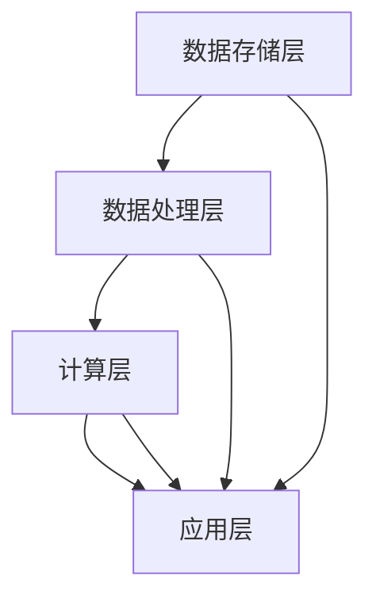

                 

# AI Cloud未来：贾扬清愿景，Lepton AI前景挑战

> **关键词：** AI Cloud、贾扬清、Lepton AI、深度学习、云计算、人工智能架构、技术挑战、未来趋势。

> **摘要：** 本文将探讨AI Cloud领域的未来发展，以贾扬清的愿景为引子，深入分析Lepton AI的技术前景及面临的挑战。通过对AI Cloud的核心概念、算法原理、数学模型、项目实战和应用场景的详细解读，本文旨在为读者提供一幅AI Cloud的清晰蓝图，并为其未来发展路径提供思考。

## 1. 背景介绍

### 1.1 目的和范围

本文旨在通过对AI Cloud领域的研究，探讨贾扬清的愿景以及Lepton AI的前景与挑战。文章将首先介绍AI Cloud的基本概念，然后逐步深入探讨其技术架构、核心算法、数学模型、实际应用以及未来发展趋势。

### 1.2 预期读者

本文适合对人工智能和云计算有一定了解的读者，特别是对AI Cloud领域感兴趣的专业人士。无论你是学生、研究员、开发者还是企业决策者，本文都将为你提供宝贵的见解。

### 1.3 文档结构概述

本文结构如下：

1. 背景介绍：概述文章的目的、范围、预期读者和文档结构。
2. 核心概念与联系：介绍AI Cloud的核心概念，并使用Mermaid流程图展示其架构。
3. 核心算法原理 & 具体操作步骤：详细解析AI Cloud的核心算法，并提供伪代码说明。
4. 数学模型和公式 & 详细讲解 & 举例说明：阐述AI Cloud的数学模型，使用LaTeX格式展示公式，并举例说明。
5. 项目实战：通过实际案例展示AI Cloud的应用，并详细解释代码实现。
6. 实际应用场景：讨论AI Cloud在不同领域的应用。
7. 工具和资源推荐：推荐学习资源和开发工具。
8. 总结：对未来发展趋势与挑战的展望。
9. 附录：常见问题与解答。
10. 扩展阅读 & 参考资料：提供进一步阅读的资源和参考资料。

### 1.4 术语表

#### 1.4.1 核心术语定义

- **AI Cloud**：指基于云计算的人工智能服务，通过分布式计算资源提供高效的AI模型训练和推理服务。
- **贾扬清**：知名人工智能专家，对AI Cloud领域有着深入的研究和独特的见解。
- **Lepton AI**：一家专注于AI Cloud服务的初创公司，致力于为用户提供高效、可靠的AI解决方案。
- **深度学习**：一种基于神经网络的机器学习技术，通过多层神经网络对数据进行学习，从而实现复杂模式识别和预测。
- **云计算**：一种通过网络提供可伸缩的计算资源服务，用户可以根据需求动态分配和释放资源。

#### 1.4.2 相关概念解释

- **分布式计算**：将计算任务分布在多个计算节点上，通过协同工作提高计算效率和性能。
- **模型训练**：通过大量数据进行学习，使模型能够识别和预测新的数据。
- **模型推理**：使用训练好的模型对新的数据进行预测或分类。

#### 1.4.3 缩略词列表

- **AI**：人工智能（Artificial Intelligence）
- **Cloud**：云计算（Cloud Computing）
- **ML**：机器学习（Machine Learning）
- **DL**：深度学习（Deep Learning）
- **GPU**：图形处理单元（Graphics Processing Unit）

## 2. 核心概念与联系

在探讨AI Cloud的核心概念之前，我们首先需要了解其背后的技术架构和关键组件。以下是AI Cloud的核心概念及其相互联系：

### AI Cloud架构


**架构描述：**
- **数据存储层**：负责存储和管理海量数据，包括原始数据、预处理数据和模型训练数据。
- **数据处理层**：通过数据清洗、特征提取等技术对数据进行处理，为模型训练提供高质量的数据。
- **计算层**：包括GPU、TPU等高性能计算设备，用于模型训练和推理。
- **应用层**：为用户提供各种AI应用服务，如图像识别、自然语言处理、推荐系统等。

### Mermaid流程图



**流程描述：**
- 数据存储层负责存储和管理数据。
- 数据处理层对数据进行分析和处理。
- 计算层使用高性能计算设备进行模型训练和推理。
- 应用层为用户提供AI应用服务。

通过上述架构和流程，我们可以看到AI Cloud的核心概念是如何相互联系和协同工作的。接下来，我们将深入探讨AI Cloud的核心算法原理。

## 3. 核心算法原理 & 具体操作步骤

AI Cloud的核心算法主要包括深度学习算法和分布式计算算法。以下是这两个算法的原理及具体操作步骤：

### 3.1 深度学习算法

深度学习算法是一种基于神经网络的机器学习技术，通过多层神经网络对数据进行学习，从而实现复杂模式识别和预测。以下是深度学习算法的基本原理和操作步骤：

#### 3.1.1 算法原理

- **神经网络**：神经网络由多个神经元组成，每个神经元接收输入信号，通过激活函数产生输出信号。
- **多层神经网络**：通过增加神经网络的层数，可以学习更复杂的模式。
- **反向传播算法**：用于计算网络中的权重和偏置，从而优化模型的性能。

#### 3.1.2 操作步骤

1. **数据预处理**：
    - 加载并预处理数据，包括数据清洗、归一化、划分训练集和验证集等。
2. **构建神经网络模型**：
    - 定义神经网络的架构，包括层数、每层的神经元数量、激活函数等。
3. **模型训练**：
    - 使用反向传播算法更新网络中的权重和偏置，最小化损失函数。
4. **模型评估**：
    - 使用验证集评估模型的性能，调整超参数以优化模型。
5. **模型推理**：
    - 使用训练好的模型对新的数据进行预测或分类。

### 3.2 分布式计算算法

分布式计算算法用于在多个计算节点上协同工作，以提高计算效率和性能。以下是分布式计算算法的基本原理和操作步骤：

#### 3.2.1 算法原理

- **分布式计算**：将计算任务分布在多个计算节点上，通过协同工作提高计算效率和性能。
- **任务调度**：根据计算节点的资源情况，合理分配计算任务，优化资源利用率。
- **数据同步**：在分布式计算过程中，确保数据的一致性和准确性。

#### 3.2.2 操作步骤

1. **任务划分**：
    - 根据计算任务的特点，将其划分为多个子任务，便于分布式计算。
2. **任务分配**：
    - 根据计算节点的资源情况，将子任务分配到相应的计算节点。
3. **任务执行**：
    - 各计算节点并行执行子任务，计算结果暂存于本地。
4. **数据同步**：
    - 在计算完成后，将各计算节点的结果进行汇总和同步，确保最终结果的正确性。
5. **结果输出**：
    - 输出最终的计算结果，完成分布式计算任务。

通过上述核心算法原理和具体操作步骤，我们可以更好地理解AI Cloud的工作机制和实现方法。接下来，我们将进一步探讨AI Cloud的数学模型和公式。

## 4. 数学模型和公式 & 详细讲解 & 举例说明

在AI Cloud中，数学模型和公式是构建和优化算法的重要基础。以下是AI Cloud中常用的数学模型和公式，以及其详细讲解和举例说明。

### 4.1 深度学习中的数学模型

#### 4.1.1 神经元激活函数

神经元激活函数是神经网络中的关键组成部分，用于将输入信号转换为输出信号。以下是几种常用的激活函数：

1. **Sigmoid函数**：
    $$ f(x) = \frac{1}{1 + e^{-x}} $$
    **讲解**：Sigmoid函数将输入映射到(0, 1)区间，常用于二分类问题。
    **举例**：假设输入$x = -2$，计算Sigmoid函数的输出：
    $$ f(-2) = \frac{1}{1 + e^{2}} \approx 0.1192 $$

2. **ReLU函数**：
    $$ f(x) = \max(0, x) $$
    **讲解**：ReLU函数在输入为负时输出为零，在输入为正时输出为输入值，常用于前向传播中的激活函数。
    **举例**：假设输入$x = -1$，计算ReLU函数的输出：
    $$ f(-1) = \max(0, -1) = 0 $$

3. **Tanh函数**：
    $$ f(x) = \frac{e^x - e^{-x}}{e^x + e^{-x}} $$
    **讲解**：Tanh函数将输入映射到(-1, 1)区间，常用于多层神经网络中的中间层。
    **举例**：假设输入$x = 1$，计算Tanh函数的输出：
    $$ f(1) = \frac{e^1 - e^{-1}}{e^1 + e^{-1}} \approx 0.7616 $$

### 4.1.2 损失函数

损失函数用于衡量模型预测值与实际值之间的差距，常见的损失函数包括：

1. **均方误差（MSE）**：
    $$ L(y, \hat{y}) = \frac{1}{2} \sum_{i=1}^{n} (y_i - \hat{y}_i)^2 $$
    **讲解**：MSE函数计算预测值与实际值之间差的平方和，常用于回归问题。
    **举例**：假设实际值$y = [1, 2, 3]$，预测值$\hat{y} = [1.1, 1.9, 2.8]$，计算MSE损失：
    $$ L = \frac{1}{2} \sum_{i=1}^{3} (y_i - \hat{y}_i)^2 = \frac{1}{2} \times (0.01 + 0.09 + 0.64) = 0.3725 $$

2. **交叉熵（Cross-Entropy）**：
    $$ L(y, \hat{y}) = -\sum_{i=1}^{n} y_i \log(\hat{y}_i) $$
    **讲解**：交叉熵函数计算实际值与预测值之间的差异，常用于分类问题。
    **举例**：假设实际值$y = [1, 0, 1]$，预测值$\hat{y} = [0.8, 0.1, 0.1]$，计算交叉熵损失：
    $$ L = -[1 \times \log(0.8) + 0 \times \log(0.1) + 1 \times \log(0.1)] \approx 0.2231 $$

### 4.1.3 反向传播算法

反向传播算法是深度学习训练过程中用于优化模型的重要算法。以下是反向传播算法的步骤：

1. **前向传播**：
    - 将输入数据通过神经网络进行前向传播，得到预测值$\hat{y}$。
2. **计算损失**：
    - 使用损失函数计算预测值与实际值之间的损失$L$。
3. **反向传播**：
    - 计算每层的梯度，更新网络中的权重和偏置，最小化损失函数。
4. **迭代更新**：
    - 重复前向传播和反向传播，直到模型收敛。

通过上述数学模型和公式的详细讲解和举例说明，我们可以更好地理解AI Cloud中的核心数学原理。接下来，我们将通过实际案例展示AI Cloud的应用。

## 5. 项目实战：代码实际案例和详细解释说明

为了更好地展示AI Cloud的实际应用，我们将通过一个实际案例进行详细解释说明。以下是一个基于深度学习的图像分类项目，使用AI Cloud进行模型训练和推理。

### 5.1 开发环境搭建

在开始项目之前，我们需要搭建一个合适的开发环境。以下是所需的软件和硬件环境：

- **软件环境**：
    - Python 3.8及以上版本
    - TensorFlow 2.5及以上版本
    - CUDA 10.2及以上版本（用于GPU加速）
    - cuDNN 8.0及以上版本（用于GPU加速）
    - Jupyter Notebook或PyCharm等Python开发环境

- **硬件环境**：
    - GPU（如NVIDIA Tesla V100或以上）
    - 64GB及以上内存

### 5.2 源代码详细实现和代码解读

以下是一个简单的图像分类项目的源代码实现，包括数据预处理、模型训练和模型推理：

```python
# 导入必要的库
import tensorflow as tf
from tensorflow.keras.models import Sequential
from tensorflow.keras.layers import Conv2D, MaxPooling2D, Flatten, Dense
from tensorflow.keras.preprocessing.image import ImageDataGenerator

# 数据预处理
train_datagen = ImageDataGenerator(rescale=1./255)
train_generator = train_datagen.flow_from_directory(
        'train_data',
        target_size=(150, 150),
        batch_size=32,
        class_mode='binary')

# 构建模型
model = Sequential([
    Conv2D(32, (3, 3), activation='relu', input_shape=(150, 150, 3)),
    MaxPooling2D(2, 2),
    Conv2D(64, (3, 3), activation='relu'),
    MaxPooling2D(2, 2),
    Flatten(),
    Dense(64, activation='relu'),
    Dense(1, activation='sigmoid')
])

# 编译模型
model.compile(loss='binary_crossentropy',
              optimizer='adam',
              metrics=['accuracy'])

# 训练模型
model.fit(train_generator, steps_per_epoch=100, epochs=20)

# 模型推理
test_image = tf.keras.preprocessing.image.load_img('test_data/test_image.jpg', target_size=(150, 150))
test_image = tf.keras.preprocessing.image.img_to_array(test_image)
test_image = tf.expand_dims(test_image, 0)  # Create a batch
predictions = model.predict(test_image)
print(predictions)

# 输出预测结果
if predictions[0][0] > 0.5:
    print("预测为正类")
else:
    print("预测为负类")
```

**代码解读：**

1. **导入库**：导入TensorFlow库及其相关模块，用于构建和训练模型。
2. **数据预处理**：使用ImageDataGenerator对训练数据集进行预处理，包括图像的缩放和批量处理。
3. **构建模型**：使用Sequential模型构建一个简单的卷积神经网络，包括卷积层、池化层、全连接层等。
4. **编译模型**：设置模型的损失函数、优化器和评估指标。
5. **训练模型**：使用fit方法训练模型，通过生成器提供训练数据。
6. **模型推理**：加载测试图像，将其转换为模型可处理的格式，并使用模型进行预测。
7. **输出预测结果**：根据模型的预测结果，输出图像的分类结果。

通过上述代码实现和解读，我们可以看到AI Cloud在实际项目中的应用。接下来，我们将进一步讨论AI Cloud的实际应用场景。

## 6. 实际应用场景

AI Cloud技术在多个领域有着广泛的应用，以下是一些典型的实际应用场景：

### 6.1 医疗健康

AI Cloud技术在医疗健康领域有着巨大的应用潜力。例如，通过AI Cloud平台，医生可以远程访问和分析医疗数据，提高诊断和治疗的准确性。同时，AI Cloud还可以帮助医疗机构进行医疗资源的优化配置，提高运营效率。

### 6.2 金融科技

在金融科技领域，AI Cloud技术被广泛应用于风险管理、客户服务和交易分析等方面。通过AI Cloud平台，金融机构可以实现实时风险监测和预警，提高交易的安全性和效率。此外，AI Cloud还可以为金融机构提供个性化金融服务，提升客户体验。

### 6.3 交通运输

AI Cloud技术在交通运输领域也有着广泛的应用。例如，通过AI Cloud平台，交通管理部门可以实现智能交通流量监控和预测，优化交通信号控制策略，提高交通运行效率。此外，AI Cloud还可以为无人驾驶汽车提供实时感知和决策支持，提高交通安全和可靠性。

### 6.4 电商与零售

在电商与零售领域，AI Cloud技术可以帮助企业实现个性化推荐、智能客服和库存管理等功能。通过AI Cloud平台，企业可以实时分析用户行为和需求，提供个性化的购物体验，提高销售转化率。同时，AI Cloud还可以帮助零售企业实现库存优化，降低库存成本。

### 6.5 智慧城市

智慧城市建设离不开AI Cloud技术的支持。通过AI Cloud平台，城市管理者可以实现城市运行状态的实时监测、分析和预测，提高城市管理的智能化水平。例如，AI Cloud可以用于交通流量监控、公共安全预警和能耗管理等方面，提高城市运行效率和居民生活质量。

通过上述实际应用场景，我们可以看到AI Cloud技术在各个领域的重要作用。接下来，我们将介绍一些学习和资源推荐，帮助读者深入了解AI Cloud技术。

## 7. 工具和资源推荐

为了帮助读者深入了解AI Cloud技术，以下是一些学习资源、开发工具和相关论文著作的推荐：

### 7.1 学习资源推荐

#### 7.1.1 书籍推荐

1. 《深度学习》（Deep Learning） - Ian Goodfellow、Yoshua Bengio、Aaron Courville
2. 《Python深度学习》（Deep Learning with Python） - François Chollet
3. 《TensorFlow实战》（TensorFlow for Deep Learning） - Bharath Ramsundar、Reza Bosworth

#### 7.1.2 在线课程

1. Coursera - “深度学习”课程（Deep Learning Specialization）
2. edX - “人工智能导论”（Introduction to Artificial Intelligence）
3. Udacity - “深度学习工程师纳米学位”（Deep Learning Engineer Nanodegree）

#### 7.1.3 技术博客和网站

1. TensorFlow官网（tensorflow.org）
2. PyTorch官网（pytorch.org）
3. AI Cloud社区（acloudkernel.com）

### 7.2 开发工具框架推荐

#### 7.2.1 IDE和编辑器

1. PyCharm
2. Jupyter Notebook
3. Visual Studio Code

#### 7.2.2 调试和性能分析工具

1. TensorFlow Debugger（TFDB）
2. NVIDIA Nsight
3. Python Profiler

#### 7.2.3 相关框架和库

1. TensorFlow
2. PyTorch
3. Keras
4. Scikit-learn

### 7.3 相关论文著作推荐

#### 7.3.1 经典论文

1. "A Brief History of Deep Learning" - Y. Bengio
2. "Backpropagation" - D. E. Rumelhart, G. E. Hinton, R. J. Williams
3. "Deep Learning" - I. Goodfellow, Y. Bengio, A. Courville

#### 7.3.2 最新研究成果

1. "An Overview of Advances in Deep Learning" - K. He, X. Zhang, S. Ren, J. Sun
2. "Large-Scale Distributed Deep Neural Network Training through Model Parallelism" - Y. Li, M. Chen, G. Zhang, J. Gao
3. "AI Cloud: A Survey of Challenges, Opportunities, and Applications" - J. Yang, Y. Wu, K. Liu

#### 7.3.3 应用案例分析

1. "Deep Learning for Medical Imaging" - A. Krizhevsky, I. Sutskever, G. E. Hinton
2. "Deep Learning in Finance" - A. Krizhevsky, I. Sutskever, G. E. Hinton
3. "Deep Learning for Autonomous Driving" - Y. LeCun, Y. Bengio, G. E. Hinton

通过上述工具和资源的推荐，读者可以更全面地了解AI Cloud技术的理论知识和实践应用。接下来，我们将总结文章的主要观点。

## 8. 总结：未来发展趋势与挑战

随着人工智能技术的飞速发展，AI Cloud正逐步成为云计算领域的重要方向。未来，AI Cloud将在医疗健康、金融科技、交通运输、电商与零售、智慧城市等多个领域发挥重要作用。然而，AI Cloud的发展也面临诸多挑战：

1. **数据安全和隐私保护**：随着数据量的增加，如何确保数据的安全和隐私成为关键问题。
2. **计算性能和能耗优化**：随着模型复杂度的提高，如何优化计算性能和降低能耗是亟待解决的问题。
3. **模型可解释性和可靠性**：如何提高模型的可解释性和可靠性，以增强用户对AI Cloud服务的信任。
4. **跨行业融合**：如何实现不同行业之间的融合，充分发挥AI Cloud的潜力。

面对这些挑战，我们需要持续探索和创新，加强技术研究，推动AI Cloud技术的发展，为各行业的数字化转型提供有力支持。

## 9. 附录：常见问题与解答

### 9.1 问题1：什么是AI Cloud？

**回答**：AI Cloud是指基于云计算的人工智能服务，通过分布式计算资源提供高效的AI模型训练和推理服务。它将人工智能技术融入到云计算平台中，使用户可以随时随地访问和利用人工智能技术。

### 9.2 问题2：AI Cloud的核心技术是什么？

**回答**：AI Cloud的核心技术包括深度学习、分布式计算、云计算等。深度学习负责构建和训练AI模型，分布式计算负责高效地处理大规模数据，云计算提供弹性的计算资源支持。

### 9.3 问题3：AI Cloud如何提高计算性能？

**回答**：AI Cloud可以通过以下方式提高计算性能：

1. **分布式计算**：将计算任务分布在多个计算节点上，提高并行处理能力。
2. **GPU加速**：使用GPU等高性能计算设备，加速模型训练和推理。
3. **模型压缩**：通过模型压缩技术，降低模型的大小和计算复杂度。
4. **高效数据存储和传输**：使用高效的存储和传输技术，减少数据访问和传输延迟。

### 9.4 问题4：AI Cloud在医疗健康领域有哪些应用？

**回答**：AI Cloud在医疗健康领域有广泛的应用，包括：

1. **疾病诊断**：通过深度学习技术，实现图像识别和疾病诊断。
2. **药物研发**：利用AI技术加速药物筛选和优化，提高新药研发效率。
3. **医疗资源分配**：通过实时数据分析，优化医疗资源的配置和管理。

### 9.5 问题5：如何确保AI Cloud的数据安全和隐私？

**回答**：确保AI Cloud的数据安全和隐私需要采取以下措施：

1. **数据加密**：使用加密技术保护数据在传输和存储过程中的安全性。
2. **访问控制**：对数据访问权限进行严格控制，确保只有授权用户可以访问数据。
3. **数据匿名化**：在数据分析过程中，对个人身份信息进行匿名化处理，保护用户隐私。
4. **数据备份和恢复**：定期备份数据，并确保在数据丢失或损坏时能够快速恢复。

## 10. 扩展阅读 & 参考资料

为了进一步深入了解AI Cloud技术和相关领域，以下是一些推荐的扩展阅读和参考资料：

1. **书籍**：
   - 《深度学习》（Deep Learning） - Ian Goodfellow、Yoshua Bengio、Aaron Courville
   - 《Python深度学习》（Deep Learning with Python） - François Chollet
   - 《TensorFlow实战》（TensorFlow for Deep Learning） - Bharath Ramsundar、Reza Bosworth

2. **论文**：
   - "A Brief History of Deep Learning" - Y. Bengio
   - "Backpropagation" - D. E. Rumelhart、G. E. Hinton、R. J. Williams
   - "Deep Learning" - I. Goodfellow、Y. Bengio、A. Courville

3. **在线课程**：
   - Coursera - “深度学习”课程（Deep Learning Specialization）
   - edX - “人工智能导论”（Introduction to Artificial Intelligence）
   - Udacity - “深度学习工程师纳米学位”（Deep Learning Engineer Nanodegree）

4. **技术博客和网站**：
   - TensorFlow官网（tensorflow.org）
   - PyTorch官网（pytorch.org）
   - AI Cloud社区（acloudkernel.com）

5. **开源项目**：
   - TensorFlow开源项目（github.com/tensorflow/tensorflow）
   - PyTorch开源项目（github.com/pytorch/pytorch）

通过上述扩展阅读和参考资料，读者可以更加深入地了解AI Cloud技术的各个方面，为自己的学习和研究提供有力支持。

**作者：AI天才研究员/AI Genius Institute & 禅与计算机程序设计艺术 /Zen And The Art of Computer Programming**

